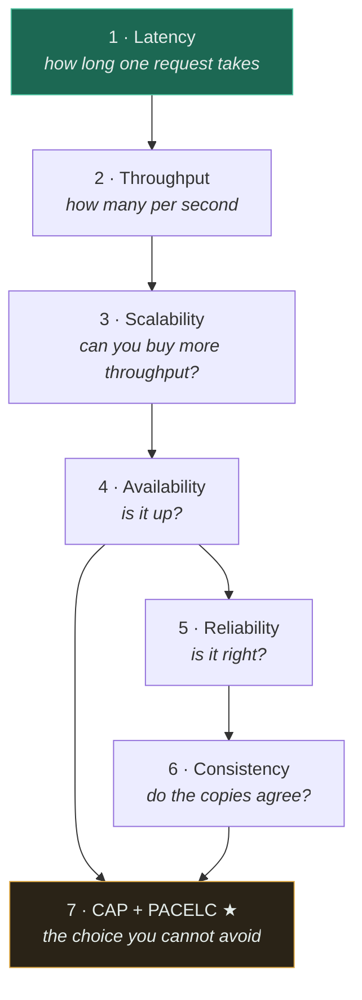
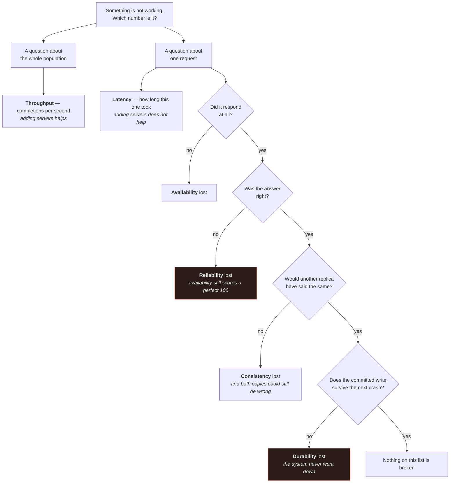

# Foundations

The vocabulary everything else assumes. Seven concepts, and they are not independent — read them in
the order below, because each one is the reason the next exists.

If you only read two, read [latency](latency/) and [CAP](cap-theorem/). The first is what most
architecture decisions are made *for*; the second is what most of them are constrained *by*.

---

## Read in this order

| # | Topic | Difficulty | The one thing to take away |
|---|---|---|---|
| 1 | [Latency](latency/) | `[B]` | It is a **distribution**. Quote p99, never the average. |
| 2 | [Throughput](throughput/) | `[B]` | Not the inverse of latency. Batching improves one and worsens the other. |
| 3 | [Scalability](scalability/) | `[B]` | Limited by what the copies **share**, not by the copies. |
| 4 | [Availability](availability/) | `[B]` | Chains multiply: ten 99.9% dependencies give you 99%. |
| 5 | [Reliability](reliability/) | `[B]` | Availability is being up; reliability is being **right**. |
| 6 | [Consistency](consistency/) | `[I]` | A spectrum, chosen **per dataset** — never once for a whole system. |
| 7 | [CAP theorem](cap-theorem/) ★ | `[I]` | **Not** "pick two of three". You do not get to decline partitions. |

## The four distinctions people get wrong

Most confusion in system design traces back to conflating one of these pairs. If you can state each
difference in a sentence, the foundations have done their job.

| These are not the same | The difference |
|---|---|
| Latency vs throughput | One request's duration vs requests per second. Independent, and frequently opposed. |
| Availability vs reliability | Responding at all vs responding **correctly**. A fast wrong answer scores 100% on the first. |
| Consistency vs correctness | All copies agreeing vs the value being right. Replicas can agree on garbage. |
| Availability vs durability | Being up vs not losing committed data. A system can be up and quietly losing writes. |

Read it as a triage order. The first fork is the one people skip: throughput is a property of the
population and latency is a property of a single request, so no quantity of the first ever buys you
the second. The two red boxes are the failures your status dashboard reports as success — a fast
wrong answer and a quietly lost write both return `200`.

## Where estimation lives

Capacity estimation is a foundation too, but it is a *method* rather than a concept, so it has its
own top-level document: **[ESTIMATION-GUIDE.md](../ESTIMATION-GUIDE.md)** — the arithmetic, the
numbers worth memorising, and a worked example that ends in the table of decisions those numbers
forced.

Durability is covered inside [reliability](reliability/) rather than separately, because in practice
it is never traded on its own — it is always traded against write latency.

## What these unlock

Once you have these, the component pages stop being a catalogue and start being answers:

- A **cache** exists because of the memory-versus-disk ratio in [latency](latency/)
- A **load balancer** exists because of [throughput](throughput/) and [scalability](scalability/)
- **Replication** exists because of [availability](availability/) — and creates the
  [consistency](consistency/) problem
- **Sharding** exists because one machine's write ceiling is a [scalability](scalability/) limit
- Every one of those choices is bounded by [CAP](cap-theorem/)

## Related

- [System Design Thinking](../SYSTEM-DESIGN-THINKING.md) — the method these feed into
- [Trade-off Framework](../TRADEOFF-FRAMEWORK.md) — the seven axes, which are these plus cost and operability
- [Glossary](../GLOSSARY.md) — one-line definitions of everything
- [Concept dependency graph](../19-diagrams/concept-dependency-graph.mmd) — the full learning order

<!-- PATH:BEGIN -->

---

**The reading path** · step 4 of 27 · *Foundations*

◀ **Previous** [Trade-off framework](../TRADEOFF-FRAMEWORK.md) &nbsp;·&nbsp; **Next** [Latency](../00-foundations/latency/README.md) ▶

<!-- PATH:END -->
