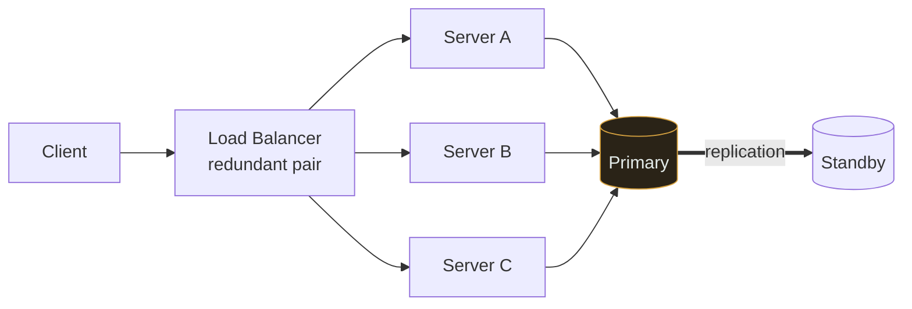

# Availability

`[BEGINNER]` · The fraction of time the system answers successfully. Measured in nines, and each nine costs about 10× the last.

---

## 1. One-line definition

The probability that a request made right now gets a successful response.

## 2. Explain like I'm new

A shop with a sign saying "open 99% of the time" is closed for about 3.5 days a year — and you will
not know in advance which days. Availability is that percentage for a system, and the interesting
question is never the number itself but **what it costs to add another 9**.

## 3. Real-world analogy

A hospital emergency department: it must be open even when staff are ill, so it keeps spare capacity
and cross-trained people.

**Where it breaks:** a hospital degrades gracefully — a queue forms, urgent cases go first. Many
software systems have no equivalent and simply fail. Building the graceful version is a deliberate
choice, not a default.

## 4. Technical explanation

```
Availability = uptime / (uptime + downtime)
```

| Nines | Downtime/year | Downtime/month | Realistically means |
|---|---|---|---|
| 99% | 3.65 days | 7.2 hours | One server, manual recovery |
| 99.9% | 8.77 hours | 43.8 min | Redundancy, someone on call |
| 99.99% | 52.6 min | 4.4 min | Automated failover, multi-AZ |
| 99.999% | 5.26 min | 26 s | Multi-region, no human in the loop |

**Five minutes a year is less time than it takes a human to read an alert and open a laptop.** Past
about 99.99%, every recovery has to be automatic — which is why the cost curve is exponential rather
than linear.

### Components in series multiply

This is the part that surprises people:

```
Service (99.9%) → Database (99.9%) → Cache (99.9%)
   0.999 × 0.999 × 0.999  =  99.7%      ~26 hours/year
```

**A chain is less available than any of its links.** Ten dependencies at 99.9% each give you 99%.
This is the strongest technical argument against gratuitous microservices, and the reason each
synchronous dependency you add has a real cost.

### Redundancy in parallel adds nines

```
Two independent servers at 99% each:
   1 - (0.01 × 0.01)  =  99.99%
```

The word doing the work is **independent**. Two servers in the same rack share a power supply; two
availability zones share a region; two regions share your deployment pipeline and your DNS. Correlated
failure is what turns a calculated 99.99% into a real 99.5%.

## 5. Engineering at scale

**Your availability is capped by your least available critical dependency.** Before promising 99.99%,
check what your cloud provider, payment processor and DNS actually promise. You cannot exceed them on
the synchronous path.

**Most outages are not hardware.** They are deploys, config changes, certificate expiry, and capacity
exhaustion. Redundancy protects against a machine dying; it does nothing at all against a bad config
pushed to every machine simultaneously. Staged rollouts protect against the more common failure.

## 6. The problem it solves

Puts a number on "how much downtime is acceptable", which turns an argument into a budget.

## 7. The problem it does NOT solve

Availability says nothing about **correctness**. A system returning wrong answers quickly is 100%
available and useless. It also says nothing about [durability](../reliability/) — a system can be up
while quietly losing data.

---

## 9. How it works



Three app servers, but **one primary database** — so the system's availability is the database's
availability. Redundancy at the wrong layer buys nothing. Find the un-redundant component; that is
your real number.

Note also that a *single* load balancer would make the whole diagram pointless, which is the classic
mistake: adding an LB to remove a single point of failure and creating one in the process.

## 13. When to chase more nines

- Revenue stops when you are down
- Contractual SLA with penalties
- Safety-relevant systems
- The cost of downtime exceeds the cost of the next nine — **compute this, do not assume it**

## 14. When NOT to

- Internal tools. 99% is genuinely fine for a dashboard three people use.
- Before you have measured your current availability. You cannot improve a number you do not have.
- When correctness or durability matters more. A payment system that is briefly down is
  survivable; one that loses a transaction is not.
- When the money would buy more by reducing [latency](../latency/) instead.

## 17. Trade-offs

| Choose | Get | Pay |
|---|---|---|
| Redundancy | Higher availability | ~2× infrastructure cost |
| Multi-region | Survives regional failure | ~2× cost, cross-region consistency problems |
| Automated failover | Recovery in seconds | Split-brain risk; failover itself can cause the outage |
| Graceful degradation | Partial service beats none | Every feature needs a defined degraded mode |
| **Choosing A over C under partition** | Stays up during a network split | Serves stale or conflicting data — see [CAP](../cap-theorem/) |

## 19. Failure scenarios

| Failure | Effect | Mitigation |
|---|---|---|
| Single instance dies | Proportional capacity loss | N+1 redundancy, health checks |
| Whole AZ fails | Big loss if not spread | Multi-AZ |
| Region fails | Total outage | Multi-region + **tested** failover |
| Bad deploy | 100% outage, instantly, everywhere | Canary, staged rollout, fast rollback |
| Cert expiry | Total outage, entirely predictable | Automated renewal + expiry alerting |
| Dependency slow (not down) | Threads exhaust; you go down too | Timeouts, circuit breakers, bulkheads |

**Untested failover is not failover.** A standby nobody has ever failed over to is a hypothesis, and
the outage is a poor time to test it.

## 25. Without it → With it → New problem → Next

```
Without it   →  no shared definition of "up", so no way to decide what redundancy is worth
With it      →  a budget that justifies (or refuses) redundancy spending
New problem  →  redundancy means multiple copies, which means keeping them in agreement
Next         →  consistency, and then CAP — because under a partition you must choose
```

Availability is one half of the [CAP](../cap-theorem/) trade-off. You cannot reason about CAP until
you can state your availability target.

## 26. Combination patterns

- **Load balancer + health checks** — removes dead servers automatically; the foundation of the rest
- **Replication + failover** — availability for stateful components, which is the hard case
- **Circuit breaker + graceful degradation** — stays partly up when a dependency is down

## 28. Common mistakes

| Mistake | Why it is wrong |
|---|---|
| Redundant app servers, single database | Availability equals the database's |
| Assuming independence | Same rack, same AZ, same deploy pipeline = correlated failure |
| Ignoring dependency chains | Ten 99.9% dependencies in series = 99% |
| Untested failover | Discovering it does not work during the outage |
| Measuring server-side only | Users experiencing DNS or CDN failures are down and invisible to you |
| Chasing nines nobody asked for | Enormous cost, no value |

## 29. Monitoring

Measure availability from **outside** — a synthetic probe from a user's perspective, not your own
health endpoint saying it is fine. Track it as successful requests / total, per endpoint. Alert on
error budget burn rate rather than on individual failures, so a slow leak is caught and a single blip
is not paged.

## 31. Interview questions

- **"What does 99.99% actually mean?"** — wants 52 min/year and the implication that recovery must be automated.
- **"Three services at 99.9% in series — what's the availability?"** — wants 99.7%, and why chains multiply.
- **"How do you get from 99.9% to 99.99%?"** — wants automated failover, multi-AZ, staged deploys — and the observation that most outages are deploys, not hardware.
- **"Would you ever choose lower availability?"** — wants a yes: consistency for a payment ledger.

## 32. Decision checklist

- [ ] Target stated as a number, with the cost of downtime that justifies it
- [ ] Every single point of failure identified — especially stateful ones
- [ ] Dependency chain multiplied out, not assumed
- [ ] Redundancy is genuinely independent (rack, AZ, region, deploy)
- [ ] Failover has actually been executed, deliberately, at least once
- [ ] Measured externally, not from inside the system
- [ ] Degraded modes defined per feature

## 33. Related

- [Reliability](../reliability/) — availability is about being up; reliability is about being right
- [CAP theorem](../cap-theorem/) — the choice availability forces
- [Latency](../latency/) — slow is a form of down
- [Glossary: availability](../../GLOSSARY.md#availability)
