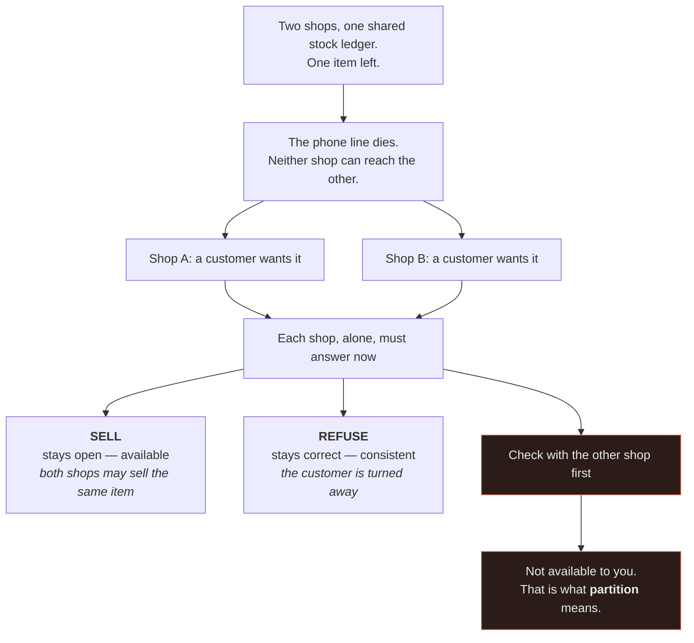
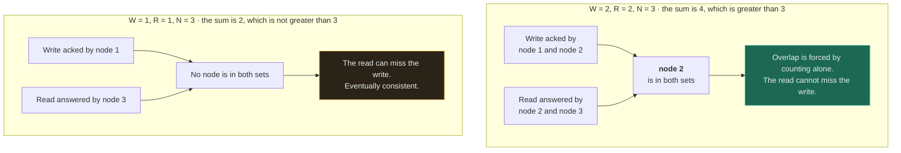
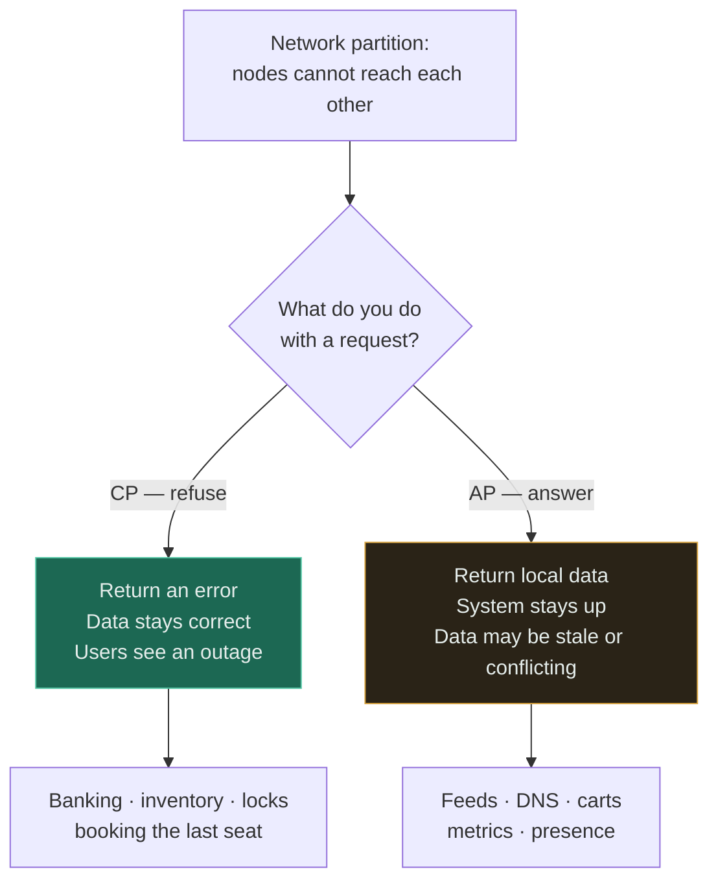
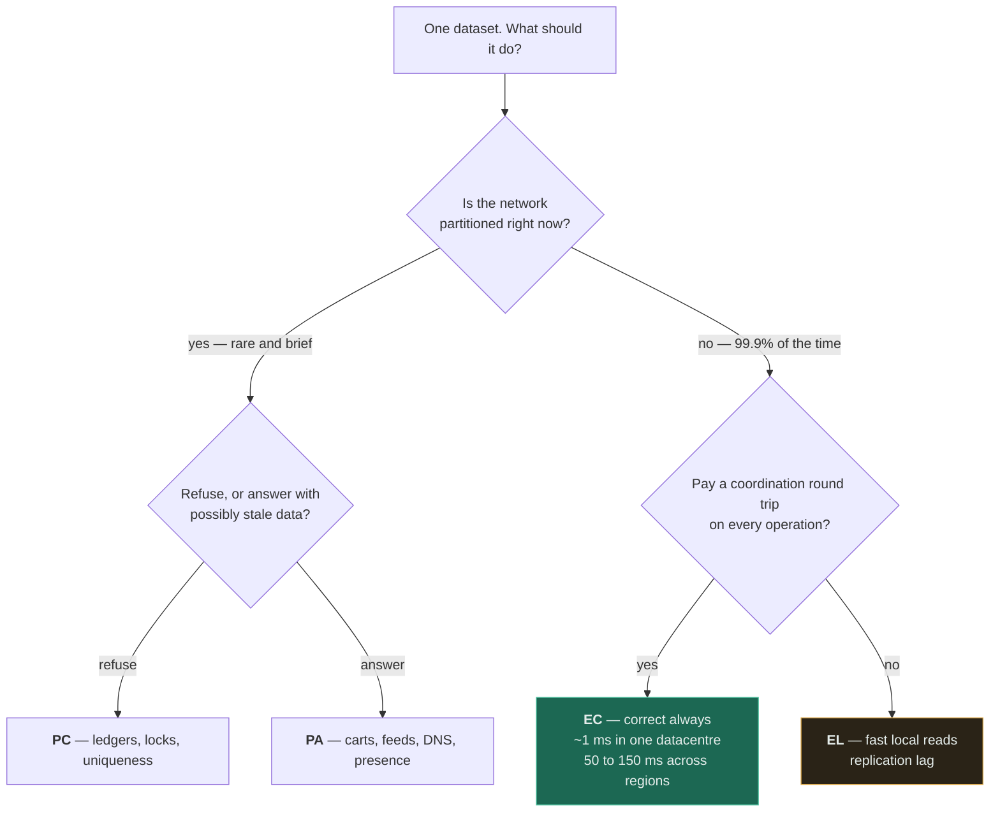

# CAP Theorem ★

`[INTERMEDIATE]` · Under a network partition you must choose availability or consistency. It is not "pick two of three", and almost everyone who quotes it gets that wrong.

---

## 1. One-line definition

In a distributed system that can suffer network partitions, you cannot have both strong consistency
and full availability during a partition — you must sacrifice one.

## 2. Explain like I'm new

Two shops share one stock ledger. The phone line between them goes dead.

A customer wants the last item. Each shop has two options:

- **Sell it** — stay open (available), risk both shops selling the same item (inconsistent)
- **Refuse** — stay correct (consistent), turn the customer away (unavailable)

There is no third option. You cannot phone the other shop; that is what "partition" means. **CAP is
just this, formalised.**



The third branch is the content of this diagram. It is the option everyone reaches for on first
encountering CAP, and the picture shows why it is not there: the one mechanism that would let a shop
be available *and* consistent is precisely the mechanism the partition has removed. Read the other
two boxes as live options rather than as a right and a wrong answer — which of them you want depends
entirely on what the item is.

## 3. Real-world analogy

Two air traffic controllers who lose radio contact with each other. Either they keep issuing
clearances independently (available, risk of collision) or they stop issuing clearances (safe,
nothing moves).

**Where it breaks:** aviation has agreed procedures for exactly this, which is effectively a
pre-negotiated conflict resolution strategy. Distributed systems can do the same — CRDTs and
application-level merge rules are that idea. The choice is starker only when you have not planned.

## 4. Technical explanation

Three properties:

| | Meaning |
|---|---|
| **C** onsistency | Every read receives the most recent write, or an error. (Linearizability — *not* the C in ACID.) |
| **A** vailability | Every request receives a non-error response, without guaranteeing it is the latest. |
| **P** artition tolerance | The system continues to operate despite messages being dropped between nodes. |

### The part everyone gets wrong

**You do not choose P.** Network partitions are a fact of the physical world — cables are cut,
switches fail, packets drop. If your system runs on more than one machine, partitions *will* happen,
whether or not you planned for them.

So the real statement is:

```
       Partition happens (not optional)
                  │
        ┌─────────┴─────────┐
       CP                   AP
   refuse requests      answer anyway
   stay correct         risk staleness
```

"Pick two of three" implies **CA** is available to you. It is not — a CA system is simply one that
has not thought about partitions and will silently corrupt or hang when one occurs. A single-node
database is the only honest CA system, and only because it has no network to partition.

## 5. Engineering at scale

**CAP describes a moment, not a system.** Partitions are rare and brief. A system labelled "AP"
behaves exactly like a CP system 99.9% of the time. The label describes only what happens during the
partition — which is why CAP alone is a poor way to choose a database, and why
[PACELC](#pacelc) exists.

**The choice is per operation, not per system.** The same product can and should be CP for payments
and AP for the activity feed. Labelling a whole system is almost always a simplification too far.

**Most real systems are tunable.** Cassandra and DynamoDB let you set the consistency level per query.
You are not picking a corner of a triangle; you are setting a dial, per read and per write.

---

## 9. How it works — the quorum mechanism

The dial is usually implemented as a quorum:

```
N = replicas,  W = replicas that must ack a write,  R = replicas that must answer a read

R + W > N   →  reads and writes overlap on at least one node  →  strongly consistent
R + W ≤ N   →  a read can miss the latest write               →  eventually consistent
```



`R + W > N` is the pigeonhole principle in a costume: if the two sets between them name more nodes
than exist, at least one node must appear in both, and that node is holding the latest write. Read
the lower half as the same rule failing rather than as a system misbehaving — the two sets are simply
not obliged to intersect, so a read may land entirely on replicas that never heard about the write.
The inequality is the whole mechanism; there is no further protocol beneath it.

With `N=3`:

| W | R | Behaviour |
|---|---|---|
| 3 | 1 | Fast reads, slow writes, no writes during any partition |
| 1 | 3 | Fast writes, slow reads |
| 2 | 2 | Balanced; survives one node down — **the usual choice** |
| 1 | 1 | Fastest, eventually consistent |

`W=2, R=2, N=3` is common because it is strongly consistent (`4 > 3`) while surviving the loss of any
one node. That is the sweet spot, and knowing *why* it is the sweet spot is more useful than any
amount of CAP vocabulary.

## 11. What each choice looks like



The clearest way to decide: **which is worse — showing the wrong answer, or showing no answer?**

For a bank balance, wrong is worse. For a follower count, no answer is worse. That one question
resolves most cases without needing the theorem at all.

## PACELC

CAP's real weakness is that it only describes the rare case. **PACELC** completes it:

```
if (P)artition:  choose (A)vailability or (C)onsistency
(E)lse:          choose (L)atency or (C)onsistency
```

The **ELC** half is the important one, because that is where systems spend 99.9% of their life. Even
with a perfectly healthy network, keeping replicas in agreement costs a round trip — and across
regions that is ~150ms you cannot optimise away.

| System | Classification | Reading |
|---|---|---|
| Single-node Postgres | — | No partition possible; not a distributed system |
| Postgres + sync replica | PC/EC | Consistent always, pays latency always |
| Postgres + async replica | PC/EL | Consistent-ish, fast reads, replication lag |
| DynamoDB (eventual) | PA/EL | Available and fast; may be stale |
| DynamoDB (strong read) | PC/EC | Same system, different dial setting |

Two rows there are the *same product*. That is the point: PACELC describes configurations, not
brands.



Compare the two branches out of the first decision by how often you actually take them. CAP describes
only the upper one, which fires rarely and briefly; the lower branch is where the system spends its
life, and it is an entirely separate choice that a CAP label does not record. Read your answer off as
a **pair** — PC/EC and PC/EL are identical partition behaviour with completely different everyday
costs, which is why "we chose CP" is not yet a decision.

## 13. When to choose CP

- Money, ledgers, double-entry anything
- Uniqueness: usernames, seat reservations, the last item in stock
- Distributed locks and leader election — a lock that is "eventually" held is not a lock
- Permission revocation

## 14. When to choose AP

- Feeds, timelines, recommendations
- Counters — likes, views, followers
- Shopping carts (Amazon's famous example: a cart that loses an item costs less than a cart that
  refuses to accept one)
- DNS, service discovery, presence
- Metrics and logs

## 18. Why not just...?

| Alternative | Why not | When it WOULD win |
|---|---|---|
| **A single node** | No horizontal scale, no HA | Data fits one machine, downtime is tolerable — **genuinely the right answer more often than people admit** |
| Strong consistency everywhere | Latency on every write; unavailable during any partition | Single region, correctness dominates |
| Eventual everywhere | Conflicts and stale reads on data that cannot tolerate them | Append-only or single-writer data |
| Consensus (Raft/Paxos) everywhere | Majority round trip per operation; operationally heavy | Control-plane data — leader election, config, locks |
| Per-operation tuning | Most thought required | Large systems with genuinely mixed data — the mature answer |

## 19. Failure scenarios

| Failure | CP system | AP system |
|---|---|---|
| Partition | Minority side refuses requests | Both sides serve; diverge |
| Partition heals | Nothing to reconcile | **Conflict resolution required** |
| Node dies | Fine if quorum survives | Fine |
| Quorum lost | Whole system read-only or down | Still serving |
| Clock skew | Affects timeout-based leases | Corrupts wall-clock last-write-wins |

**The AP cost arrives after the partition heals, not during it.** Divergent replicas must be merged,
and if you have not designed a merge strategy, the default is usually last-write-wins — which
silently discards data. Plan the reconciliation before you choose AP.

## 21. Performance

CP costs a round trip to a quorum on every operation. Within one datacentre that is ~1ms and mostly
ignorable. Across regions it is ~50–150ms and dominates everything else you might optimise.

**This is why "multi-region and strongly consistent and low latency" is not a thing you can buy.** It
is not a gap in the market; it is a constraint of distance.

## 25. Without it → With it → New problem → Next

```
Without it   →  partition behaviour is accidental — the system does something nobody chose
With it      →  a deliberate decision about what happens during a partition
New problem  →  choosing A means reconciling divergent replicas afterwards
Next         →  conflict resolution (CRDTs, vector clocks), or quorums to get C back
```

## 26. Combination patterns

- **Sharding + replication** — each shard is its own CAP decision; a partition can affect some and not others
- **Cache + database** — a cache is an AP layer bolted onto a CP store, with the TTL as the divergence bound
- **Multi-region + eventual** — the standard AP shape, and the reason cross-region products feel fast

## 28. Common mistakes

| Mistake | Why it is wrong |
|---|---|
| "Pick two of three" | You do not get to decline P |
| Calling a system "CA" | Means "has not thought about partitions" |
| Labelling a whole system | The choice is per-operation |
| Using CAP to pick a database | Use [PACELC](#pacelc) — the else-branch is where systems live |
| Confusing CAP's C with ACID's C | Unrelated; one is linearizability, the other is constraint validity |
| Choosing AP without a merge strategy | Default LWW silently loses data |
| Applying CAP to a single node | There is no partition to tolerate |

## 29. Monitoring

Alert on **partition events themselves** — nodes unable to reach quorum — not only on the symptoms.
Track replication lag as your live measure of divergence. On AP systems, count conflict resolutions;
a rising count means real data is being merged, or silently dropped.

## 31. Exercises

**1.** A vendor describes their product as "CA". What have they actually told you?

<details><summary>Answer</summary>

That they have not thought about partitions. **P is not a property you elect to have** — cables get
cut and packets get dropped whether or not it was in the design document — so a multi-node "CA"
system is one that will hang or silently corrupt when the network splits, and nobody chose which.

The only honest CA system is a single node, because it has no network to partition. Ask instead what
happens to a write when half the cluster is unreachable; the answer is CP or AP regardless of the
label on the box.
</details>

**2.** With `N=3`, why is `W=2, R=2` the usual setting rather than `W=3, R=1`?

<details><summary>Answer</summary>

Both are strongly consistent — `R + W > N` means reads and writes overlap on at least one node, and
`4 > 3` as surely as `4 > 3`. The difference is what happens when a node dies. At `W=3` every write
needs all three acks, so losing any single node stops writes entirely; at `W=2` you survive it.

`W=2, R=2` is the sweet spot because it keeps the consistency guarantee while tolerating one failure,
and knowing *why* is worth more than any amount of CAP vocabulary. `W=3, R=1` is still the right dial
for a read-dominated dataset where writes are rare and downtime on write is acceptable.
</details>

**3.** You chose AP. The partition lasts four minutes and then heals. When does the bill arrive?

<details><summary>Answer</summary>

**After it heals, not during it.** During the partition both sides happily serve local data, which is
what you bought. Afterwards you have two divergent replicas and no way to merge them unless you
planned one.

If no merge strategy was designed, the default is usually wall-clock last-write-wins, which silently
discards whichever update lost a timestamp comparison between two imperfectly synchronised clocks.
Plan the reconciliation *before* choosing AP — CRDTs, version vectors, or an application-level merge
rule — and count conflict resolutions in production so you know it is being exercised.
</details>

**4.** Your system is three nodes in one datacentre. Someone proposes moving to an AP datastore "for
availability". Do you?

<details><summary>Answer</summary>

Probably not on that argument. You would take on conflict resolution, staleness, and merge logic
permanently, in exchange for better behaviour during an event that a single-datacentre deployment
rarely experiences — and CAP describes only that moment. An AP system behaves like a CP one 99.9% of
the time.

The question that matters is [PACELC's else-branch](#pacelc): with a healthy network, are you trading
latency or consistency, and what does that cost inside one datacentre? Usually ~1 ms, which is
ignorable. Ask what the availability target actually is, what the measured partition rate actually
is, and whether the real problem is a single point of failure that redundancy would fix without
touching the consistency model at all.
</details>

## 32. Decision checklist

- [ ] Partition behaviour is chosen deliberately, per dataset
- [ ] For each dataset: is stale worse, or is unavailable worse?
- [ ] If AP: the conflict resolution strategy is written down, and it is not naive LWW
- [ ] If CP: the availability cost during partition is accepted by the business
- [ ] Quorum settings (N, R, W) are explicit, and you can say why
- [ ] PACELC's else-branch considered — the latency cost during *normal* operation
- [ ] Partition detection is monitored and alerted

## 33. Related

- [Observability](../../11-observability/) — how you would know any of this broke
- [Consistency](../consistency/) — read first; the spectrum CAP's C sits at the top of
- [Availability](../availability/) — the other side of the trade
- [Trade-off framework](../../TRADEOFF-FRAMEWORK.md) — where this fits among the seven axes
- [Glossary: quorum](../../GLOSSARY.md#quorum) · [split brain](../../GLOSSARY.md#split-brain)

<!-- PATH:BEGIN -->

---

<sub>**The reading path** · step 11 of 23 · *CAP theorem*</sub>

◀ **Previous** [Consistency](../../00-foundations/consistency/README.md) &nbsp;·&nbsp; **Next** [Load balancer](../../03-load-balancing/fundamentals/README.md) ▶

<!-- PATH:END -->
