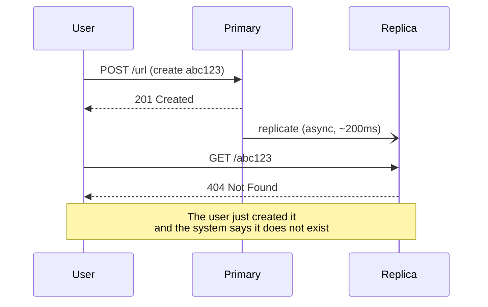

# Consistency

`[INTERMEDIATE]` · Whether every reader sees the same data. The moment you have more than one copy, you have to decide how much disagreement you will tolerate.

---

## 1. One-line definition

The guarantee about what a read may return, relative to the writes that preceded it.

## 2. Explain like I'm new

You post a photo. Your phone shows it immediately. Your friend refreshes and does not see it for two
seconds.

That two-second window is **inconsistency**, and it is not a bug — it is a deliberate trade someone
made so the app could be fast and stay up. For a photo, two seconds is invisible. For a bank balance,
two seconds is a lawsuit. **The same technical behaviour is fine or fatal depending entirely on what
the data means.**

## 3. Real-world analogy

Several notice boards across a campus. Post an update on one; someone reading another sees the old
version until a runner carries the update over.

**Where it breaks:** real replicas can receive updates in *different orders*, so two boards can
disagree about which of two updates came last. That is the genuinely hard part, and no notice-board
intuition prepares you for it.

## 4. Technical explanation

Consistency is a spectrum, not a switch. From strongest to weakest:

| Model | Guarantee | Cost |
|---|---|---|
| **Linearizable** | Every read sees the latest write, globally, as if there were one copy | Coordination on every operation; highest latency |
| **Sequential** | Everyone sees operations in the *same* order, not necessarily real-time order | Cheaper than linearizable |
| **Causal** | Related operations appear in order; unrelated ones may not | Often the sweet spot |
| **Read-your-writes** | *You* always see your own writes; others may lag | Cheap and fixes the most-noticed problem |
| **Eventual** | Replicas converge if writes stop | Cheapest, weakest |

**"Eventually consistent" with no stated bound is not a design.** The useful statement names the
window and who is affected: *"a follower count may lag up to 30 seconds; the account balance never
lags."*

### The classic bug



This is **read-your-writes** being violated, and it is the single most common consistency bug in
systems with read replicas. It is also cheap to fix without going strongly consistent: route a user's
reads to the primary for a short window after they write, or pin them to the replica that has caught
up.

## 5. Engineering at scale

**Consistency costs latency, and physics sets the floor.** Strong consistency across regions means
coordinating over a link with a ~150ms round trip. No implementation improves on that; it is distance.

**Different data in the same product deserves different models.** This is the mature position, and it
is what [PACELC](../cap-theorem/#pacelc) formalises:

| Data | Model | Why |
|---|---|---|
| Payment balance | Strong | Double-spend is unacceptable |
| Inventory count | Strong-ish | Overselling has real cost |
| Follower count | Eventual | Nobody notices or cares |
| Feed / timeline | Eventual | Freshness matters more than exactness |
| Session | Read-your-writes | Users must see their own changes |

Choosing one model for a whole system is a design smell. Choose per dataset.

## 7. The problem it does NOT solve

Consistency is about **agreement between copies**, not correctness. A perfectly linearizable system
can store a wrong value — every replica will agree on it. It also does not mean
[durability](../reliability/): all replicas agreeing on data that is then lost is entirely possible.

---

## 13. When you need strong consistency

- Money moving; anything double-spendable
- Uniqueness constraints — usernames, seat reservations, inventory at zero
- Anything where two concurrent readers acting on stale data causes real harm
- Authorisation and permission revocation

## 14. When NOT to

- Counts, likes, view totals — nobody can tell
- Feeds and timelines — freshness beats exactness
- Search indexes — seconds of lag is normal and expected
- Analytics
- **When it would cost availability you need more.** See [CAP](../cap-theorem/).

## 17. Trade-offs

| Choose | Get | Pay |
|---|---|---|
| Strong | Trivial reasoning; no reconciliation code | Latency, reduced availability under partition, no local reads |
| Eventual | Low latency, high availability, local reads | Conflict resolution, stale reads, harder debugging |
| Read-your-writes | Fixes the visible symptom cheaply | Session pinning complexity |
| Causal | Related ops ordered, good latency | More machinery than eventual |

## 18. Why not just use strong consistency everywhere?

| Alternative | Why not | When it WOULD win |
|---|---|---|
| Strong everywhere | Every cross-region write pays ~150ms; system stops on partition | Small dataset, single region, correctness dominates — genuinely common |
| Eventual everywhere | Users see their own writes vanish; conflicts everywhere | Single-writer or append-only data |
| Single node, no replicas | No consistency problem at all — the honest cheapest answer | Data fits one machine and downtime is acceptable |
| Per-dataset choice | Most code and thought | Almost every real product at scale |

That third row matters: **the simplest way to avoid consistency problems is to not have replicas.**
That is a legitimate answer until scale or availability forces otherwise.

## 19. Failure scenarios

| Failure | Effect | Mitigation |
|---|---|---|
| Replication lag spike | Users read stale data; read-your-writes breaks | Route reads to primary after write; monitor lag |
| Network partition | Replicas diverge | Pick A or C deliberately — [CAP](../cap-theorem/) |
| Split brain | Two primaries both accept writes | Quorum, fencing tokens |
| Concurrent conflicting writes | Last-write-wins silently discards one | Vector clocks, CRDTs, or application-level merge |
| Clock skew | Last-write-wins picks the wrong winner | Logical clocks, never wall-clock time |

**Last-write-wins based on wall-clock time is a data-loss mechanism dressed as a conflict-resolution
strategy.** Two servers whose clocks differ by 50ms will silently discard the write that actually
came second.

## 25. Without it → With it → New problem → Next

```
Without it   →  replicas disagree and nobody knows which is right
With it      →  a stated contract about what a read may return
New problem  →  stronger guarantees cost latency and availability
Next         →  CAP and PACELC, which is where that cost gets made explicit
```

## 26. Combination patterns

- **Cache + database** — a cache is a deliberate consistency weakening, with the TTL as the bound
- **Replication + read-your-writes routing** — read scale without the most-noticed bug
- **Sharding + replication** — each shard makes its own consistency choice

## 28. Common mistakes

| Mistake | Why it is wrong |
|---|---|
| "Eventually consistent" with no bound | Not a design; nobody can verify it |
| One model for the whole system | Overpays on some data, under-protects the rest |
| Reading from a replica right after writing | The 404-on-your-own-record bug |
| Wall-clock last-write-wins | Clock skew silently loses writes |
| Assuming a transaction spans services | It does not — that is what sagas are for |
| Treating a cache as consistent | It is a replica with a TTL, and it lies for exactly that long |

## 29. Monitoring

Alert on **replication lag** with a threshold derived from your stated window — if you promised 30s,
alert at 10s. Track stale-read rate where you can detect it. Count conflict resolutions; a rising
count means your assumptions about concurrency are wrong.

## 31. Interview questions

- **"Strong vs eventual — which for a like counter?"** — wants eventual, and the reason: nobody can tell.
- **"User posts and immediately gets a 404. Why?"** — wants replication lag and read-your-writes.
- **"How do you resolve concurrent writes?"** — wants LWW's flaws, then vector clocks or CRDTs.
- **"Can you have strong consistency across regions?"** — wants yes, at ~150ms per write, and that this
  is physics rather than implementation.

## 32. Decision checklist

- [ ] Consistency chosen **per dataset**, not per system
- [ ] Every "eventual" has a stated bound, and someone has agreed it
- [ ] Read-your-writes handled wherever users write then read
- [ ] Conflict resolution defined — and not naive wall-clock LWW
- [ ] Replication lag monitored with an alert
- [ ] The partition behaviour is a decision, not an accident

## 33. Related

- [Observability](../../11-observability/) — how you would know any of this broke
- [CAP theorem](../cap-theorem/) — the formal statement of this trade-off ★
- [Availability](../availability/) — the thing consistency is traded against
- [Reliability](../reliability/) — agreement is not correctness
- [Glossary: eventual consistency](../../GLOSSARY.md#eventual-consistency)
