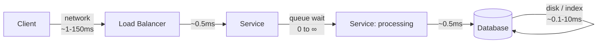

# Latency

`[BEGINNER]` · How long **one** operation takes. The number your users actually feel.

---

## 1. One-line definition

The time between making a request and receiving the response.

## 2. Explain like I'm new

You order a coffee. Latency is how long *you* wait, from ordering to holding the cup. It has nothing
to do with how many coffees the shop makes an hour — that is a different number, and confusing the
two is the most common mistake in this whole subject.

## 3. Real-world analogy

A single car's journey time from A to B.

**Where the analogy breaks:** a road can carry more cars by adding lanes without any one journey
getting faster. Systems work the same way — which is exactly why latency and
[throughput](../throughput/) are separate axes. Adding servers usually raises throughput and does
nothing at all for latency.

## 4. Technical explanation

Latency is a **distribution**, not a number. Every request takes a different amount of time, and the
shape of that distribution is what matters.

The distribution is almost always right-skewed with a long tail: most requests are fast, a few are
dramatically slower. That shape is why the average is close to useless.

| Statistic | What it tells you |
|---|---|
| Average (mean) | Almost nothing. One 10-second request hides behind a thousand fast ones. |
| p50 (median) | The typical experience |
| **p99** | The experience of your least happy 1% — **quote this one** |
| p99.9 | Where your worst outliers live; matters at high volume |

**Always specify the percentile.** "Latency is 20ms" is not a claim, because it does not say whether
that is p50 or p99, and those can differ by 50×.

## 5. Engineering at scale

Two things become true at scale that are not obvious at small scale.

**Tail latency dominates.** If a single page load fans out to 100 backend services, and each has a
1% chance of being slow, then the probability that *at least one* is slow is `1 - 0.99^100 ≈ 63%`.
Nearly two thirds of page loads hit somebody's p99. **At scale, your p99 becomes your typical
experience.**

**Latency adds along the synchronous path and does not along the asynchronous one.** This is the
single most useful reading skill for an architecture diagram — sum the solid arrows, ignore the
dashed ones. See [the notation contract](../../19-diagrams/README.md).

## 6. The problem it solves

Latency is not a solution — it is a *constraint you are given*. It is on this list because most
architecture decisions are made in service of it.

## 7. The problem it does NOT solve

Low latency does not mean high capacity. A system can answer every request in 2ms and still collapse
at 100 concurrent users. If you optimise latency and your problem was throughput, nothing improves.

## 8. Why does this exist as a concept?

Because "make it faster" is ambiguous, and the two things it might mean are addressed by opposite
techniques. Batching makes throughput better and latency worse. Caching usually improves both.
Adding servers improves throughput and leaves latency untouched.

---

## 9. How it works — where the time goes



Five contributors, roughly in order of how often they are the actual culprit:

1. **Queueing delay** — waiting for a free worker. Invisible in code, dominant under load, and the
   usual answer when latency degrades non-linearly.
2. **Network** — dominated by physical distance. Unfixable except by moving closer.
3. **Processing** — actual computation. Usually the *smallest* term, and usually where people look first.
4. **Storage** — disk seeks, index traversal, lock waits.
5. **Serialisation** — encoding and decoding, which becomes real with large payloads.

## 11. The numbers that shape architecture

Orders of magnitude, not measurements. The ratios are the point.

| Operation | Order |
|---|---|
| Memory reference | ~100 ns |
| SSD random read | ~100 µs |
| Round trip inside a datacentre | ~0.5 ms |
| Round trip across a continent | ~50 ms |
| Round trip across the world | ~150 ms |

**Memory is ~1,000× faster than SSD. A cross-world round trip is ~1,000,000× slower than memory.**

Those two ratios explain most of system design. Caching exists because of the first. CDNs and
multi-region exist because of the second, and because **the speed of light is the one constraint no
amount of hardware fixes**.

---

## 13. When to optimise for latency

- Anything a human is waiting on. Perceptible delay starts around 100ms; ~1s breaks the sense of
  direct manipulation.
- Anything on a fan-out path, where your p99 becomes someone else's typical case.
- Trading, bidding, real-time control — where latency *is* the product.

## 14. When NOT to

- Batch and offline work. A nightly job that finishes by morning has no latency requirement, and
  optimising it costs throughput you actually need.
- When the real complaint is capacity. Measure before choosing which number to chase.
- When it is already below human perception. Going from 20ms to 10ms is invisible and will cost you
  something real elsewhere.

## 17. Trade-offs

| Choose | Get | Pay |
|---|---|---|
| Cache | Much lower p50 and p99 | Staleness, invalidation, thundering herd |
| Edge / CDN | Lower network term | Only works for cacheable responses |
| Bigger connection pool | Less queueing delay | More memory and DB connections |
| Batching | — | **Worse latency**, better throughput |
| Async processing | Lower *perceived* latency | The work is now eventual |

## 19. Failure scenarios

| Failure | What happens |
|---|---|
| A dependency gets slow | **Worse than it going down.** A dead dependency fails fast and you route around it; a slow one holds every thread that touches it and takes down callers that do not even depend on it. |
| Queue builds up | Latency rises non-linearly. Near saturation, a 10% traffic increase can multiply wait time. |
| Retry storm | Retries add load, which adds latency, which triggers more retries. |
| GC pause / cold start | A clean p99 with an ugly p99.9 |

**Timeouts are not optional.** They are the only thing that converts "slow" back into "down", which
is the failure mode you can actually handle.

## 21. Performance — the counter-intuitive part

Latency does **not** degrade linearly with load. Queueing theory says wait time scales roughly with
`1/(1 - utilisation)`:

| Utilisation | Relative wait |
|---|---|
| 50% | 2× |
| 80% | 5× |
| 90% | 10× |
| 95% | 20× |
| 99% | 100× |

**This is why you do not run systems at 90% utilisation**, however efficient it looks on a cost
dashboard. The last 10% of capacity buys you 10× the latency, and leaves nothing for a traffic spike.

---

## 25. Without it → With it → New problem → Next

```
Without it   →  no way to say what "fast" means, so no way to know if a change helped
With it      →  a measurable target, and a way to find the bottleneck
New problem  →  optimising latency often costs throughput or money
Next         →  throughput, and the trade-off framework for deciding between them
```

Latency is where the whole chain starts: a latency problem is what forces the first cache, which
forces invalidation, which forces everything after it.

## 26. Combination patterns

- **Cache + database** — the standard latency fix; the cache absorbs the skewed reads
- **CDN + load balancer + cache** — attacks the network term, which nothing else can
- **Batching + queue** — deliberately trades latency away for throughput

## 28. Common mistakes

| Mistake | Why it is wrong |
|---|---|
| Quoting the average | Hides the tail completely |
| Measuring server-side only | Excludes network and client time — the user's number is larger |
| Optimising the median | The p99 is what people complain about |
| No timeouts | Slow dependencies hang everything |
| Running at high utilisation | Latency explodes non-linearly |
| Confusing it with throughput | Leads to fixing the wrong thing entirely |

## 29. Monitoring

Track p50, p99 and p99.9 separately — **never average percentiles across hosts**, which is
mathematically meaningless. Alert on p99 breaching its budget, not on the mean. Break the number down
by endpoint; one slow endpoint disappears inside an aggregate.

## 31. Interview questions

- **"What's the difference between latency and throughput?"** — checks whether you know the two are
  independent, and can be opposed.
- **"Your p50 is fine and p99 is terrible. What's happening?"** — wants queueing, GC pauses, cold
  caches, or a slow shard.
- **"Why not run servers at 95% utilisation?"** — wants the non-linear queueing answer.
- **"A downstream service slows to 5 seconds. What happens to you?"** — wants thread exhaustion, and
  timeouts plus circuit breakers as the fix.

## 32. Decision checklist

- [ ] Latency target stated as a **percentile**, not an average
- [ ] Measured at the client, not just the server
- [ ] Broken down per endpoint
- [ ] Every outbound call has a timeout
- [ ] Utilisation kept below ~70%
- [ ] You know whether the requirement is really latency or throughput

## 33. Related

- [Throughput](../throughput/) — the other half; read it next
- [Estimation guide](../../ESTIMATION-GUIDE.md) — the latency table in context
- [Trade-off framework](../../TRADEOFF-FRAMEWORK.md) — the "faster reads" decision tree
- [Glossary: tail latency](../../GLOSSARY.md#tail-latency)
