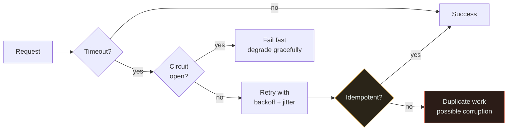

# Reliability

`[BEGINNER]` · Doing the **right** thing, consistently, including when parts are broken. Availability is being up; reliability is being correct.

---

## 1. One-line definition

The probability that the system performs its function correctly over a period of time.

## 2. Explain like I'm new

A cash machine that is always switched on is **available**. A cash machine that always dispenses the
right amount and always debits the right account is **reliable**.

You want both, but if you can only have one, everybody wants the second. A bank that is briefly
closed survives; a bank that loses your money does not.

## 3. Real-world analogy

An airliner: it has redundant systems not so it can fly *more often*, but so that a single failure
never produces a wrong outcome.

**Where it breaks:** aircraft redundancy is physically independent. Software "redundancy" often shares
a code path, so the same bug fails in all copies simultaneously. Redundancy defends against random
failure, never against a logic error.

## 4. Technical explanation

Reliability decomposes into three properties that are frequently confused:

| Property | Question | Failure looks like |
|---|---|---|
| **Availability** | Does it respond? | Timeout, 503 |
| **Correctness** | Is the answer right? | Wrong balance, missing record |
| **Durability** | Does committed data survive? | Data loss after a crash |

A system can score perfectly on one and fail the others. Ranked by how bad the failure is:

```
data loss  >  silent wrong answer  >  loud failure  >  slow  >  fine
```

**A loud failure is better than a silent wrong answer**, because a loud failure can be retried and a
wrong answer propagates. This ordering should drive your design: prefer to fail visibly.

Standard measures: **MTBF** (mean time between failures), **MTTR** (mean time to recovery).
Reducing MTTR is almost always cheaper than increasing MTBF — you cannot prevent every failure, but
you can always recover faster.

## 5. Engineering at scale

**At scale, rare becomes constant.** A disk with a 1-in-100,000-per-hour failure rate is effectively
reliable — until you have 10,000 of them, at which point one fails roughly every 10 hours. Everything
that can fail, does, continuously. Designs must assume it rather than hope.

**Idempotency is the load-bearing property.** Once you retry — and you will — every operation must be
safe to apply twice, or your reliability work actively creates corruption.

## 6. The problem it solves

Ensures the system produces correct outcomes despite component failures, which are guaranteed.

## 7. The problem it does NOT solve

Reliability engineering does not fix bugs. Retries, replicas and failover all faithfully reproduce a
logic error across every copy. **Redundancy protects against random failure, not against being wrong.**

---

## 9. How it works

Four mechanisms, roughly in order of how much they buy:

1. **Idempotency** — operations safe to repeat. Everything else depends on this.
2. **Retries with backoff and jitter** — survive transient faults without becoming a retry storm.
3. **Timeouts and circuit breakers** — stop a slow dependency from taking you with it.
4. **Redundancy and replication** — survive the loss of a machine or a disk.



The red box is what you get when retries are added without idempotency — a very common sequence,
because retries are easy to add and idempotency is easy to forget.

## 13. When to invest heavily

- Money, health, legal records — anywhere a wrong answer has consequences beyond annoyance
- Anything without a human to notice the mistake
- Write paths, always: a bad read is recoverable, a bad write may not be

## 14. When NOT to

- Read-only derived data that can simply be recomputed
- Analytics where a 0.1% error is invisible
- Before you have basic observability: **you cannot improve reliability you cannot measure**
- When it would be cheaper to make recovery fast than to make failure rare

## 17. Trade-offs

| Choose | Get | Pay |
|---|---|---|
| Retries | Survives transient faults | Duplicates unless idempotent; retry storms |
| Synchronous replication | No data loss on failover | Latency on every write; reduced availability |
| Async replication | Fast writes | A failover window where committed data is lost |
| Circuit breaker | Contains cascading failure | Rejects requests that might have worked |
| Strong consistency | Simple correctness reasoning | Latency, and availability under partition |

## 19. Failure scenarios

| Failure | Effect | Mitigation |
|---|---|---|
| Transient network blip | Request fails spuriously | Retry with backoff + jitter |
| Worker dies mid-job | Job lost or half-applied | At-least-once delivery + idempotency |
| Message delivered twice | Duplicate effect | Idempotency keys |
| Messages out of order | Inconsistent state | Sequence numbers, or design order-independently |
| Poison message | Retries forever, blocks the queue | Delivery cap → dead letter queue |
| Silent data corruption | Wrong answers, undetected | Checksums, invariant checks, reconciliation |
| Partial write | Some records applied | Transactions, or the outbox pattern |

**Silent corruption is the worst row**, because nothing alerts. This is what reconciliation jobs are
for: periodically re-derive the truth and compare.

## 25. Without it → With it → New problem → Next

```
Without it   →  failures produce wrong answers and lost data, silently
With it      →  failures produce correct-but-degraded behaviour, loudly
New problem  →  retries create duplicates; replication creates lag and disagreement
Next         →  idempotency to make retries safe, then consistency to reconcile the copies
```

## 26. Combination patterns

- **Retry + circuit breaker** — retries alone finish off a struggling service; the breaker is what
  makes retries safe
- **Queue + workers + idempotency** — the standard at-least-once pipeline
- **Replication + failover** — durability and availability together, at the cost of lag

## 28. Common mistakes

| Mistake | Why it is wrong |
|---|---|
| Retries without idempotency | Manufactures duplicate writes |
| Retries without backoff | Retry storm; you finish off the dying service |
| Retries without jitter | Every client retries in lockstep, recreating the spike |
| No timeout | One slow dependency exhausts your threads |
| No dead letter queue | One poison message blocks the whole queue |
| Confusing availability with reliability | Optimising uptime while losing data |
| Assuming replicas are independent | Same bug, same code, all copies wrong |

## 29. Monitoring

Error rate by type — distinguish "failed loudly" from "returned something wrong", because only the
first shows up in a 5xx count. Track MTTR, not just incident count. Run reconciliation jobs that
re-derive state independently and alert on divergence; this is the only defence against silent
corruption.

## 31. Interview questions

- **"Availability vs reliability?"** — wants up versus correct, and that they can be traded.
- **"You add retries. What breaks?"** — wants duplicates, and idempotency as the answer.
- **"How do you make a payment endpoint safe to retry?"** — wants an idempotency key stored with the
  result, so a repeat returns the original outcome instead of charging twice.
- **"A message keeps failing. What happens?"** — wants a delivery cap and a DLQ, not infinite retry.

## 32. Decision checklist

- [ ] Every retried operation is idempotent
- [ ] Every retry has backoff **and jitter**
- [ ] Every outbound call has a timeout
- [ ] Poison messages have a delivery cap and a DLQ
- [ ] Data loss window under failover is known and accepted
- [ ] Correctness is monitored, not only uptime
- [ ] MTTR is measured, and rehearsed

## 33. Related

- [Availability](../availability/) — up versus correct
- [Consistency](../consistency/) — agreement between copies
- [Glossary: idempotency](../../GLOSSARY.md#idempotency) · [retry storm](../../GLOSSARY.md#retry-storm)
