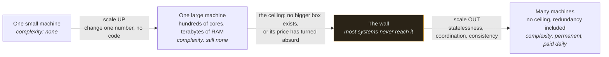
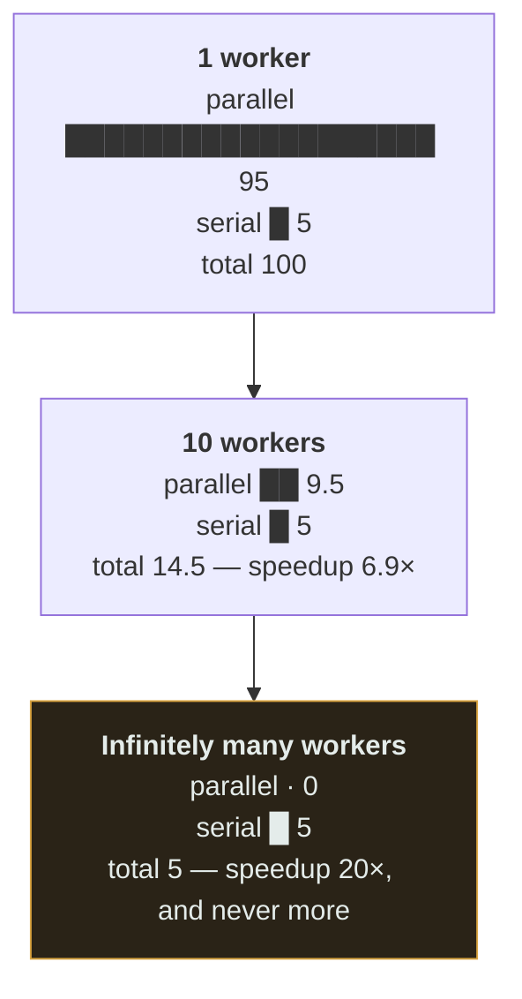
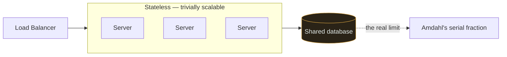
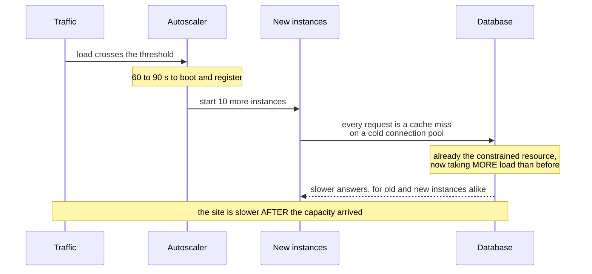

# Scalability

`[BEGINNER]` · Whether you can meet more demand by adding resources — and how much extra you get per unit added.

---

## 1. One-line definition

The ability to handle growing load by adding resources, ideally in proportion.

## 2. Explain like I'm new

A restaurant with one chef serves 20 covers a night. Scalability is the question: *if I hire a second
chef, do I serve 40?*

Sometimes yes. Sometimes no — because there is one oven, and the oven is the real limit. Hiring chefs
until you notice the oven is how most scaling money gets wasted.

## 3. Real-world analogy

Adding checkout lanes to a supermarket.

**Where it breaks:** lanes are independent, and web servers usually are too — but they share a
database, the way lanes would share a single price scanner. **Scalability is almost always limited by
what the copies share**, not by the copies.

## 4. Technical explanation

Two directions:

| | Vertical (scale up) | Horizontal (scale out) |
|---|---|---|
| Method | Bigger machine | More machines |
| Ceiling | Hard — biggest machine that exists | Effectively none |
| Complexity | **None** — no code changes | Distribution, coordination, consistency |
| Cost curve | Superlinear; the top end is brutally priced | Roughly linear |
| Availability | Still one machine | Redundancy comes free |
| Downtime to scale | Usually yes | No |

**Vertical scaling is underrated.** It requires no architectural change at all, and modern hardware is
enormous — hundreds of cores and terabytes of RAM. A great many systems that were rewritten to be
distributed would have run comfortably on one large machine for years.

The honest sequence is: **scale up until it hurts, then scale out.** Going distributed on day one
buys complexity you pay for immediately and capacity you may never need.



The table above sets the two directions side by side, which makes them look like alternatives. Read
this instead as stages. Capacity rises smoothly left to right, but complexity is a **step function**
that fires at the wall — and you pay it in full on crossing, even if what you needed was 20% more
capacity. Going distributed on day one is this same picture with the first two boxes deleted and the
bill brought forward.

### Amdahl's Law — why scaling stops working

If a fraction `s` of the work is serial (cannot be parallelised), the maximum speedup with `N` workers is:

```
speedup  =  1 / (s + (1 - s)/N)
```

| Serial fraction | Max speedup, ∞ workers |
|---|---|
| 0% | unlimited |
| 1% | **100×** |
| 5% | 20× |
| 10% | 10× |
| 50% | 2× |

**Just 5% serial work caps you at 20× no matter how many machines you buy.** That serial 5% is usually
a shared database, a global lock, or a single-threaded coordinator. Finding and removing it is worth
more than any amount of extra hardware.



Read off the width of the serial bar: it is the same in all three rows. Machines shorten only the
top bar, and the top bar cannot go below zero, so the total converges on the serial term and the
speedup converges on `1/s`. The second reading is where the money goes — ten machines already bought
you 6.9× of the available 20×, so every further machine competes with the far cheaper option of
deleting that 5%.

## 5. Engineering at scale

**Statelessness is the enabling property.** A stateless server can be added, removed or killed
freely. A server holding session state in memory cannot — every request from that user must return to
it, which breaks load balancing, deploys and failover simultaneously. Push state to a shared store
and the whole tier becomes trivially scalable.

**Stateful components are the hard part, and they are where all the real work is.** Scaling web
servers is a solved problem. Scaling the database is the actual project — and it is why
[replication](../../GLOSSARY.md#replication) and [sharding](../../GLOSSARY.md#sharding) exist.

## 6. The problem it solves

Growth without a rewrite.

## 7. The problem it does NOT solve

Scalability is not performance. A system can scale beautifully and be slow at every size — adding
machines does nothing for [latency](../latency/). It also does not fix an inefficient algorithm; it
just lets you pay more to run it. **An O(n²) query scaled horizontally is an expensive O(n²) query.**

---

## 9. How it works



You can add servers all day. The database is shared, so it is the serial fraction, and it sets your
ceiling. Every scaling story eventually becomes a story about the datastore.

## 13. When to scale horizontally

- Past the biggest single machine available, or its price becomes absurd
- You need redundancy anyway — horizontal gives you both
- Load is spiky and you want elastic cost
- Zero-downtime deploys matter

## 14. When NOT to

- **Before you have measured.** Most systems are far smaller than their owners believe.
- When vertical scaling still has headroom and no architectural change is required
- When the bottleneck is a single shared resource — adding servers just queues harder on it
- When the team cannot operate a distributed system. Team size is an architectural constraint.

## 17. Trade-offs

| Choose | Get | Pay |
|---|---|---|
| Vertical | Zero complexity, immediate | Hard ceiling, superlinear cost, still one machine |
| Horizontal | No ceiling, redundancy included | Distribution: consistency, coordination, debugging |
| Stateless services | Trivial scaling | State must live somewhere, and that thing must scale |
| Read replicas | Read scale, cheap | Replication lag |
| Sharding | Write scale, unbounded storage | No cross-shard joins; the shard key is near-permanent |
| Autoscaling | Cost tracks demand | Cold starts; scales *after* the spike has hurt you |

## 19. Failure scenarios

| Failure | Effect |
|---|---|
| Bottleneck moves | Fix one tier, the next saturates. Expect this — it is the normal loop. |
| Shared resource saturates | Adding servers makes it *worse* — more clients on the same contended thing |
| Hot shard | One partition takes disproportionate load; hashing spreads keys, not traffic |
| Autoscale too slow | The spike is over before capacity arrives |
| Autoscale thrashing | Scale up, scale down, repeat — often costs more than static |
| Coordinated cold start | New instances all miss the cache at once, hammering the database |

That last one is a genuinely common surprise: scaling *out* during a spike can make things worse for
a minute, because the new instances arrive with empty caches.



Read the order, because the order is the whole surprise. Capacity arrives late, and when it arrives
it lands *on* the bottleneck rather than relieving it — for the first minute the autoscaler is a load
generator aimed at the database. That is also the argument against autoscaling as a response to a
spike already in progress: warm on boot, stagger the rollout, and keep the cache shared rather than
in-process, so a new instance costs the database nothing.

## 25. Without it → With it → New problem → Next

```
Without it   →  growth requires a rewrite, always at the worst possible time
With it      →  capacity tracks demand by adding resources
New problem  →  many machines must be coordinated, and they share a datastore
Next         →  load balancing to spread the work, then replication and sharding for the state
```

## 26. Combination patterns

- **Load balancer + stateless servers** — the foundational horizontal pattern
- **Sharding + replication** — scale writes and reads simultaneously; the standard database answer
- **Queue + workers + autoscaling** — scales on backlog depth, which is a far better signal than CPU

## 28. Common mistakes

| Mistake | Why it is wrong |
|---|---|
| Distributed on day one | Complexity now, benefit maybe never |
| Adding servers without finding the bottleneck | Zero improvement, guaranteed |
| Sessions in local memory | Breaks load balancing, deploys and failover at once |
| Ignoring Amdahl | 5% serial caps you at 20× |
| Scaling instead of fixing the query | An expensive bad query is still a bad query |
| Autoscaling on CPU for queue workers | Queue depth is the correct signal |
| Assuming linear scaling | Shared resources break linearity early |

## 29. Monitoring

Track utilisation **per tier** so you can see where the bottleneck currently is — it moves. Measure
throughput per instance: if it falls as you add instances, you have found contention. Watch queue
depth as the leading indicator; it moves before latency does.

## 31. Exercises

**1.** A new internal service is expected to peak at 50 rps and the team is four people. The proposed
architecture is sharded, multi-region and distributed from day one. What do you say?

<details><summary>Answer</summary>

No — and the argument is not that it will not work, it is that you pay the complexity immediately for
capacity you may never need. 50 rps is a laptop. Scale up until it hurts, then scale out.

**Team size is an architectural constraint**, not an excuse: four people cannot operate `N` databases,
their backups, failovers and migrations while also building the product. The reversible mistake is
running on one large machine for two years; the expensive one is a distributed system nobody has time
to run.
</details>

**2.** You remove every bottleneck you can find, but 5% of the work still passes through a single
global lock. What is your ceiling?

<details><summary>Answer</summary>

**20×, with infinitely many machines.** Amdahl's Law: `1 / (s + (1−s)/N)` converges on `1/s`, and
`1/0.05 = 20`. Buying the 200th machine changes nothing measurable.

That makes the lock the project, not the hardware. The serial fraction is nearly always a shared
database, a global lock, or a single-threaded coordinator — finding and removing it is worth more
than any budget you could spend on instances.
</details>

**3.** You double the instance count and total throughput rises by 20%, so throughput *per instance*
has fallen. What have you found?

<details><summary>Answer</summary>

Contention on something shared. The new instances are not doing independent work; they are queueing
alongside the old ones on the same database, lock, or pool, and each one now gets a smaller slice.

This is the measurement worth watching, because aggregate throughput still went up and looks like a
win. Falling per-instance throughput is the early signal that you are approaching the serial fraction
and that the next instance will buy even less than this one did.
</details>

**4.** The web tier scales by editing one number. The database does not. Why is that asymmetry
fundamental rather than a gap in tooling?

<details><summary>Answer</summary>

Because stateless copies share nothing, so any of them can serve any request and be killed at will.
Stateful copies must **agree**, and agreement costs coordination — which is latency, and which fails
under partition.

That is why the whole of [replication](../../GLOSSARY.md#replication) and
[sharding](../../GLOSSARY.md#sharding) exists, and why every scaling story eventually becomes a story
about the datastore. Scaling web servers is a solved problem; the datastore is the actual project.
</details>

**5.** You autoscale during a traffic spike and the site gets measurably *slower* for ninety seconds
after the new instances arrive. Explain.

<details><summary>Answer</summary>

Coordinated cold start. The new instances begin with empty caches and empty connection pools, so
every request they take is a miss that goes to the database — which is already the constrained
resource. For a minute you have added load to the bottleneck rather than capacity.

Mitigations are warming on startup, staggering the rollout, and keeping the cache tier shared rather
than in-process. It is also a reason autoscaling is a poor answer to a spike that has already
started: capacity arrives after the damage.
</details>

## 32. Decision checklist

- [ ] Current bottleneck identified by measurement, not assumption
- [ ] Vertical headroom considered before going distributed
- [ ] Services genuinely stateless; state in a shared store
- [ ] The serial fraction named — you know what your ceiling is
- [ ] Autoscaling keyed on the right signal, with sane bounds
- [ ] The datastore's scaling path decided before you need it
- [ ] The team can actually operate what you are proposing

## 33. Related

- [Observability](../../11-observability/) — how you would know any of this broke
- [Throughput](../throughput/) — what scaling buys you
- [Latency](../latency/) — what scaling does **not** buy you
- [Availability](../availability/) — redundancy comes along with horizontal scaling
- [Estimation guide](../../ESTIMATION-GUIDE.md) — how much scale you actually need
