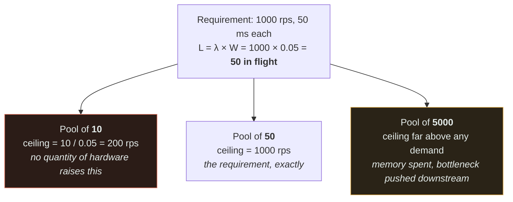
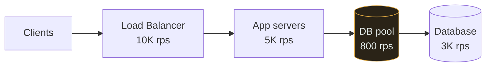
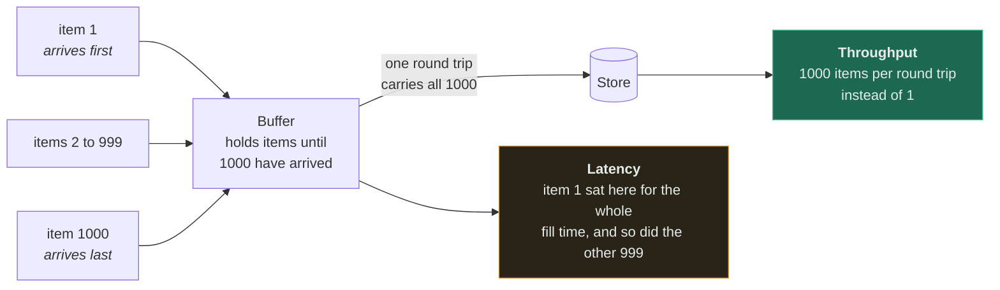
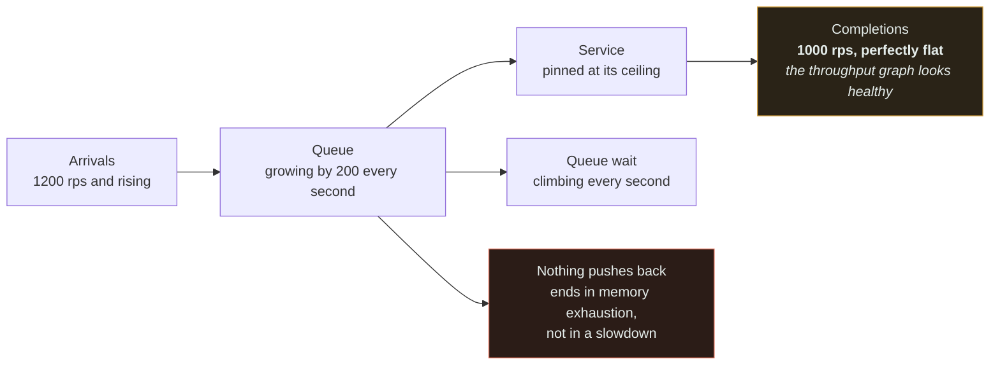

# Throughput

`[BEGINNER]` · How **many** operations complete per second. The number that decides how many servers you buy.

> Read [latency](../latency/) first. Throughput only makes sense in contrast to it.

---

## 1. One-line definition

Completed operations per unit of time.

## 2. Explain like I'm new

The coffee shop again. [Latency](../latency/) is how long *you* wait for your cup. Throughput is how
many cups the shop serves per hour.

Hire a second barista and throughput doubles. **Your wait does not change at all.** That is the whole
distinction, and it is worth holding onto — most confusion in performance work comes from mixing
these two up.

## 3. Real-world analogy

Lanes on a motorway. More lanes carry more cars per hour; no individual car goes faster.

**Where it breaks:** adding lanes to a road *can* reduce journey time, by removing congestion. Same
in systems — if requests were queueing, adding capacity reduces queueing delay and therefore latency
too. So the two are independent in principle but coupled under load.

## 4. Technical explanation

Throughput is bounded by the **narrowest stage** in the pipeline. A chain of stages handling 1000,
1000, 50 and 1000 rps has a throughput of 50 rps. Optimising any stage other than the 50 changes
nothing at all.

**Little's Law** ties the two numbers together, and it is the single most useful formula here:

```
Concurrency  =  Throughput  ×  Latency

  L = λ × W        L = requests in flight
                   λ = arrival rate (throughput)
                   W = time each spends in the system (latency)
```

Rearranged, it sizes your thread and connection pools without guessing:

```
1000 rps at 50ms latency  →  1000 × 0.05  =  50 concurrent requests in flight
```

So you need ~50 workers. Configure 10 and you have capped throughput at 200 rps no matter how much
hardware you add. Configure 5000 and you have wasted memory and moved the bottleneck downstream.



The formula is not the interesting part — the two failures either side of it are. Read off the left
branch: a pool of 10 caps you at 200 rps, and every server you add afterwards simply queues in front
of the same 10 slots. That is why "we added capacity and nothing happened" so often ends in a config
file rather than on the architecture diagram. The right branch fails silently instead: you never
reach the ceiling, so you never learn that the bottleneck has moved to whatever the small pool was
inadvertently protecting.

## 5. Engineering at scale

**Throughput scales horizontally; latency does not.** Doubling servers roughly doubles throughput.
Nothing you can buy halves the round-trip time to Sydney. This asymmetry is why capacity problems are
comparatively easy and latency problems are hard.

**Utilisation is the hidden variable.** A system at 95% utilisation has the throughput you measured
and none of the headroom you need — see the queueing table in [latency §21](../latency/#21-performance--the-counter-intuitive-part).

## 6. The problem it solves

Answers "how much hardware do I need, and when do I add more?"

## 7. The problem it does NOT solve

High throughput says nothing about individual experience. A batch pipeline moving 1M records/sec has
enormous throughput and may take 20 minutes to return any single one. If users are waiting,
throughput is the wrong number.

## 8. Why does this exist as a concept?

Because capacity and responsiveness are bought differently, and frequently traded against each other.
The clearest case is [batching](../../GLOSSARY.md#batching): it raises throughput and *worsens*
latency, always.

---

## 9. How it works — finding the ceiling



System throughput here is **800 rps**, set by the connection pool — not by the database, which can do
3K, and not by the app servers, which can do 5K. Adding app servers achieves nothing; it just makes
more threads wait for the same 800 connections.

**The bottleneck is rarely where people look first.** It is very often a pool size, a lock, or a
single-threaded stage.

---

## 13. When to optimise for throughput

- Batch and ETL work, where total completion time is the goal
- Ingestion pipelines — logs, metrics, events
- Anything where per-item latency has no human waiting on it
- When cost per request is the binding constraint

## 14. When NOT to

- When a user is waiting. Optimise their [latency](../latency/) instead.
- When you are already meeting demand. Extra throughput has no value; spend the effort on headroom or cost.
- **Before finding the actual bottleneck.** Optimising a non-bottleneck stage is guaranteed to produce
  exactly zero improvement, and this is the most common wasted week in performance work.

## 17. Trade-offs

| Choose | Get | Pay |
|---|---|---|
| Batching | Big throughput gain, fewer round trips | Latency for every item in the batch |
| More servers | Near-linear throughput | Cost; and the shared database is now the bottleneck |
| Bigger pools | Higher concurrency | Memory, and pressure pushed downstream |
| Async processing | Absorbs spikes | Results become eventual |
| Compression | More throughput per byte of bandwidth | CPU, and a little latency |

## 19. Failure scenarios

| Failure | What happens |
|---|---|
| Demand exceeds throughput | The queue grows without bound. **Latency rises until everything times out** — a throughput problem always surfaces as a latency problem first. |
| The bottleneck moves | You fix one stage and the next one saturates. Expect this; it is normal. |
| No backpressure | The queue absorbs load until memory runs out, converting a slowdown into an outage. |
| Retry storm | Failed requests retried immediately consume the very capacity needed to recover. |

## 21. Performance — the batching relationship

The clearest example of the two axes in opposition:

| Batch size | Throughput | Latency for the first item |
|---|---|---|
| 1 | baseline | best |
| 10 | much higher | waits for 9 others |
| 1000 | highest | waits for 999 others |

Both columns move, always in opposite directions. There is no batch size that improves both, which is
why "how big should the batch be?" is a product question, not a technical one.



One mechanism, two consequences — and it is genuinely the *same* mechanism, because the wait that
makes the round trip efficient is the wait the item experiences. Read off that both outputs hang
from the buffer: no batch size improves the green box without worsening the amber one. The diagram
also shows a cost the table above hides — a batch shares fates, so one poison item drags the other
999 through the retry with it.

---

## 25. Without it → With it → New problem → Next

```
Without it   →  no basis for capacity planning; you scale by guessing
With it      →  a known ceiling, and a known bottleneck to attack
New problem  →  raising throughput usually costs latency, money, or both
Next         →  load balancing to add capacity, then batching to use it efficiently
```

Throughput is what forces the [load balancer](../../GLOSSARY.md#load-balancer) — the first step of the
chain after caching.

## 26. Combination patterns

- **Load balancer + more servers** — the primary throughput lever
- **Batching + queue** — highest throughput per unit of work
- **Queue + workers** — decouples arrival rate from processing rate, so a spike becomes a backlog
  rather than an outage

## 28. Common mistakes

| Mistake | Why it is wrong |
|---|---|
| Optimising a non-bottleneck | Produces exactly zero improvement |
| Measuring throughput without latency | 1M rps at 30s each is not a working system |
| Ignoring Little's Law | Pools sized by guesswork silently cap you |
| Testing with unrealistic concurrency | Sequential load tests never find the real ceiling |
| Assuming linear scaling | Shared resources — the database — break linearity fast |
| No backpressure | Turns overload into memory exhaustion |

## 29. Monitoring

Requests/sec **and** the corresponding latency percentiles, always together. Track queue depth — a
growing queue is the earliest signal that demand has passed capacity, and it leads the latency graph
by minutes. Watch utilisation per stage to see where the bottleneck currently sits, because it moves.



The amber box is why this incident is normally noticed late. Throughput is flat because it is
**pinned at the ceiling**, not because demand is satisfied — so the first graph anyone checks reports
maximum health at precisely the moment the system stops coping. Read the queue instead: it is the
only quantity here that moves before latency does, and it is the one that decides whether overload
ends as a slowdown or as an out-of-memory kill.

## 31. Exercises

**1.** You need 10,000 rps and each request spends 30 ms in the system. Your connection pool is set to
100. What is the ceiling, and what should the pool be?

<details><summary>Answer</summary>

Little's Law: `L = λ × W = 10,000 × 0.03 = 300` requests in flight, so you need ~300 slots. With 100
you have capped yourself at `100 / 0.03 ≈ 3,300 rps`, and no amount of extra hardware moves that
number — the queue simply grows in front of the pool instead.

Oversizing is not free either: 5,000 slots wastes memory and pushes the bottleneck downstream onto
something with no such limit. Size pools from the formula, not from the default in the config file.
</details>

**2.** You double the app servers and throughput does not move. What is going on?

<details><summary>Answer</summary>

Something shared is the bottleneck, and adding clients to a contended resource does not increase its
capacity — it just makes more threads wait on it. The usual suspects are the database, a global lock,
or a connection pool, and the last one is the most commonly overlooked because it lives in a config
file rather than on the architecture diagram.

Throughput is set by the narrowest stage, so optimising any other stage produces exactly zero
improvement. Find the ceiling by measurement before spending anything — see [§9](#9-how-it-works--finding-the-ceiling).
</details>

**3.** Requests per second is flat and healthy on the dashboard. Latency has been climbing for twenty
minutes. What is happening, and why does the throughput graph look fine?

<details><summary>Answer</summary>

Demand has passed capacity. Throughput is flat because it is *pinned at the ceiling* — you are
serving everything you can serve — while arrivals in excess of that are accumulating in a queue, and
queue wait is what the latency graph is showing.

A throughput problem always surfaces as a latency problem first, which is why the two numbers are
only meaningful together. Queue depth is the leading indicator here and moves minutes before latency
does; without [backpressure](../../GLOSSARY.md#backpressure) the ending is memory exhaustion rather
than a slowdown.
</details>

**4.** You comfortably serve 900 rps and demand peaks at 400. An engineer proposes batching to reach
3,000 rps. Do you approve it?

<details><summary>Answer</summary>

No. Extra throughput you will not use has no value, and batching is never free — it worsens latency
for **every** item in the batch, always, and it makes a single poison item retry the other 99
alongside it.

The honest answer is that you are already meeting demand, so the effort belongs on headroom, cost, or
the [latency](../latency/) users actually feel. Batching earns its place when throughput is the
binding constraint and nobody is waiting on an individual item — an ingestion pipeline, not this.
</details>

## 32. Decision checklist

- [ ] Peak throughput requirement stated, not just average
- [ ] The bottleneck stage identified by measurement
- [ ] Pools sized using Little's Law rather than defaults
- [ ] Headroom for a spike (utilisation under ~70%)
- [ ] Backpressure exists somewhere
- [ ] You know whether the real requirement is throughput or latency

## 33. Related

- [Observability](../../11-observability/) — how you would know any of this broke
- [Latency](../latency/) — the other half
- [Estimation guide](../../ESTIMATION-GUIDE.md) — computing the requirement
- [Rate limiter implementation](../../18-implementations/rate-limiter/) — measured throughput in practice
- [Glossary: backpressure](../../GLOSSARY.md#backpressure)

<!-- PATH:BEGIN -->

---

<sub>**The reading path** · step 6 of 27 · *Throughput*</sub>

◀ **Previous** [Latency](../../00-foundations/latency/README.md) &nbsp;·&nbsp; **Next** [Scalability](../../00-foundations/scalability/README.md) ▶

<!-- PATH:END -->
