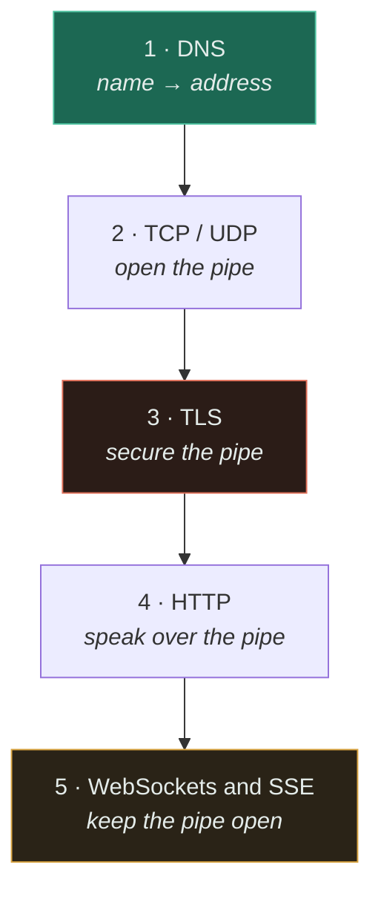

# Networking

Five layers a request passes through before your application code runs. Every one of them costs
round trips, and **round trips are the only part of latency you cannot buy your way out of** — the
speed of light is fixed, so the whole section is really about doing fewer of them.

If you only read two, read [TCP/UDP](tcp-udp/) and [TLS](tls/). The first explains why a cold
request is slow; the second explains the most predictable outage in this repository.

---

## Read in this order

The order is not arbitrary — it is the order a single HTTPS request actually happens in. Each page
assumes the one before it.

| # | Topic | Difficulty | The one thing to take away |
|---|---|---|---|
| 1 | [DNS](dns/) | `[B]` | **TTL is your real failover time.** And DNS is a dependency your availability number multiplies by. |
| 2 | [TCP / UDP](tcp-udp/) | `[I]` | TCP's ordering guarantee is also its worst failure mode — one lost packet stalls everything behind it. |
| 3 | [TLS](tls/) | `[I]` | The cost is **per connection, not per byte**. Certificate expiry is a total, scheduled, self-inflicted outage. |
| 4 | [HTTP](http/) | `[I]` | HTTP/2 fixed head-of-line blocking at the HTTP layer and not at TCP. HTTP/3 moved transports to finish the job. |
| 5 | [WebSockets](websockets/) | `[I]` | A million idle connections is a **memory and file-descriptor** problem, not a throughput one. |

## What one cold request actually costs

This table is the reason the section exists. A first request to a new origin, at a 100 ms
round-trip time — a realistic transatlantic figure from [latency](../00-foundations/latency/):

| Step | Round trips | Cost at 100 ms RTT | Removed by |
|---|---|---|---|
| DNS resolution | 0–2 (often cached) | 0–200 ms | Resolver cache, prefetch, a warm client |
| TCP handshake | 1 | 100 ms | Connection reuse — **keep-alive** |
| TLS handshake (1.3) | 1 | 100 ms | Session resumption, or connection reuse |
| HTTP request/response | 1 | 100 ms | Nothing — this is the actual work |
| **Total, cold** | **~4** | **~400 ms** | |
| **Total, warm pooled connection** | **1** | **~100 ms** | |

**A warm connection is a 4× latency improvement and costs you a config change.** Nothing else in
this section comes close to that ratio, which is why connection pooling matters more than any
protocol-version debate — see [HTTP §5](http/#5-engineering-at-scale).

## The three things most treatments get wrong

| Common claim | What is actually true |
|---|---|
| "DNS failover gives us multi-region resilience" | Your recovery time is TTL plus every cache you do not control. Resolvers, JVMs and browsers all ignore TTLs they find inconvenient. |
| "We're on HTTP/2, so head-of-line blocking is solved" | Solved between HTTP streams, still present in the TCP byte stream underneath. On a lossy link HTTP/2 can be *slower* than HTTP/1.1. |
| "We need WebSockets for real-time" | Usually you need one-way push, which is [SSE](websockets/#4-technical-explanation): plain HTTP, auto-reconnecting, and about a tenth of the work. |

## What this section unlocks

- A [load balancer](../03-load-balancing/fundamentals/) is a TLS termination point and a connection
  multiplier before it is anything else
- A [CDN](../04-caching/fundamentals/) wins mostly by moving the *handshakes* closer, not the bytes
- A real-time feature forces a [queue](../06-messaging/queues/), because the event and the
  connection land on different servers
- Every latency budget in [ESTIMATION-GUIDE.md](../ESTIMATION-GUIDE.md) starts with the round trips
  above

## Related

- [Foundations](../00-foundations/) — [latency](../00-foundations/latency/) especially; read it first
- [System Design Thinking](../SYSTEM-DESIGN-THINKING.md) — the chain these pages plug into
- [Trade-off Framework](../TRADEOFF-FRAMEWORK.md) · [Glossary](../GLOSSARY.md)
- [Roadmap](../ROADMAP.md) — what is written and what is not
