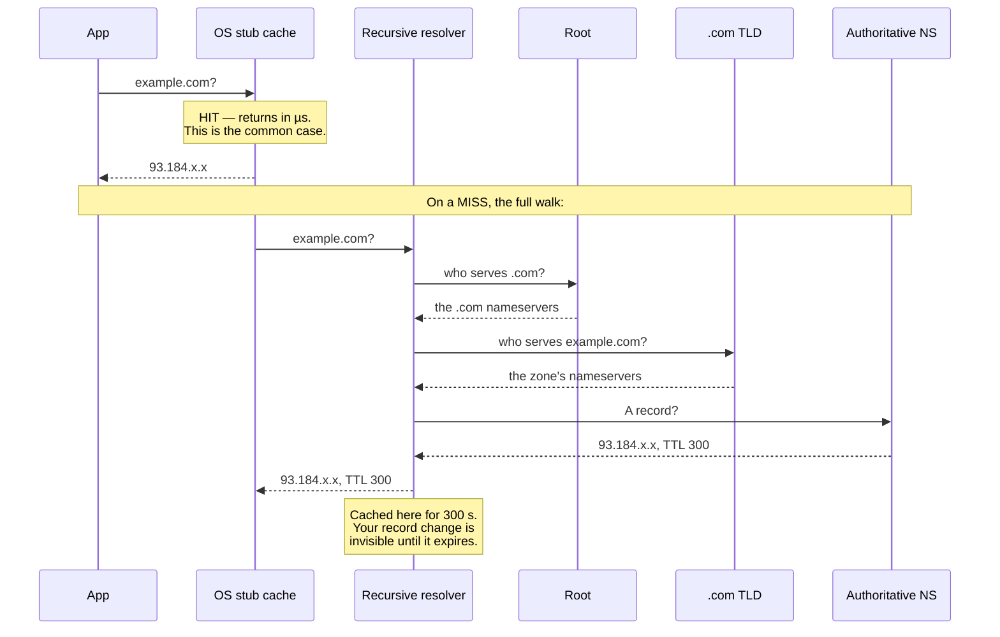

# DNS

`[BEGINNER]` · Turns a name into an address. Also, quietly, the slowest and least controllable
failover mechanism you own — **your TTL is your recovery time, and you do not control most of the
caches that hold it**.

---

## 1. One-line definition

A distributed, hierarchical, aggressively cached lookup that maps names to addresses and other
records.

## 2. Explain like I'm new

You type `example.com`. Your computer has no idea where that is — the network only moves packets
between numeric addresses. So it asks. The answer comes back as a number, and then the real request
begins.

The part that matters is what happens next: **the answer gets written down**. Your browser writes it
down, your operating system writes it down, your office resolver writes it down, your ISP writes it
down. Every one of them keeps it for a while so it does not have to ask again. That is what makes
DNS fast, and it is also the entire reason DNS is difficult — when you change the answer, all those
written-down copies are still out there being wrong.

## 3. Real-world analogy

A printed phone directory that everyone in the country keeps a copy of.

**Where it breaks:** you can print a new directory, but you cannot recall the copies already sitting
on people's desks — and a printed directory has no expiry date, whereas a DNS record does. That
expiry date is the [TTL](#4-technical-explanation), and it is the *only* control you have over how
long the stale copies survive. The analogy misleads in a second, worse way: a directory is a
convenience, whereas DNS sits on the critical path of every request. If the directory burns down,
nobody can call anybody. **DNS is not a lookup service you use; it is a dependency you are down
without.**

## 4. Technical explanation

A record has a name, a type, a value and a **TTL** in seconds. The TTL is a *permission*: it tells
every cache how long it may keep serving this answer without asking again.

| Type | Maps to | Note |
|---|---|---|
| `A` / `AAAA` | IPv4 / IPv6 address | The terminal answer |
| `CNAME` | Another name | **Illegal at the zone apex** — it cannot coexist with the SOA and NS records that live there |
| `ALIAS` / `ANAME` | Another name, flattened by the provider | Non-standard; the apex workaround |
| `NS` | The authoritative servers for a zone | Delegation |
| `MX`, `TXT`, `SRV`, `CAA` | Mail, verification, service location, which CAs may issue | `CAA` is the one nobody remembers until certificate issuance fails |

Resolution walks a hierarchy: stub resolver → recursive resolver → root → TLD → authoritative. Almost
none of that happens on a typical request, because **the answer is cached at every hop, and most of
those hops are not yours**:

| Cache layer | Honours your TTL? | Who controls it |
|---|---|---|
| Browser | Partly — browsers keep their own short cache | Not you |
| OS stub resolver | Usually | Not you |
| **Application runtime** | Often **not** — the JVM caches successful lookups for 30 s by default, and *forever* if a security manager is installed | Your team, if they know to look |
| Container / pod resolver | Usually | You, roughly |
| Corporate or ISP recursive resolver | **Frequently clamps** long TTLs down and short TTLs up | Not you |
| Public resolver (8.8.8.8, 1.1.1.1) | Mostly | Not you |

**Negative answers are cached too.** An `NXDOMAIN` is cached for the minimum field of the zone's SOA
record — so a typo you fix in thirty seconds can keep failing for an hour, and the fix will look
like it did not work.

## 5. Engineering at scale

**DNS is part of your availability calculation, and it is almost always left out of it.**
Availability chains multiply: a 99.99% DNS provider in front of a 99.99% application gives you
99.98%, and the DNS half is the one you cannot fix during the incident. In October 2016 a DDoS
against a single managed DNS provider removed Twitter, Reddit, Spotify and GitHub from the internet.
None of those applications were down. **Two providers on independent infrastructure is the
mitigation, and it is cheap relative to what it prevents.**

Beyond resolution, DNS gets used as a routing layer:

| Technique | What it buys | What it cannot do |
|---|---|---|
| Multiple `A` records | Crude round-robin; the client picks | No health awareness, no weighting |
| Geo / latency routing | Sends users to a nearby region | Granularity is the *resolver's* location, not the user's |
| Weighted records | Percentage-based traffic shifts | Slow to change — bounded by TTL |
| Health-checked failover | Removes a dead region | Only as fast as detection plus TTL |
| Anycast (one IP, many sites) | Failover at BGP speed, TTL-independent | Needs network-layer control, not just DNS |

The TTL choice is the whole game:

| TTL | Load on your authoritative NS | Realistic failover time |
|---|---|---|
| 30 s | High — every resolver on earth is a client | ~1–3 min, if resolvers behave |
| 300 s | Moderate | ~5–15 min |
| 3600 s | Low | ~1 h, with a long tail of stragglers |
| 86400 s | Trivial | **Effectively never** during an incident |

**Your real failover time is: time to detect + time to change the record + TTL + the tail of caches
that ignore TTLs.** The last term has no upper bound, which is why DNS failover is a *degradation
strategy* rather than a recovery-time objective. Lowering the TTL once the incident has started does
nothing — the old TTL is already out there.

## 6. The problem it solves

Addresses change and humans cannot memorise them. More usefully: it decouples clients from
infrastructure, so you can replace every machine behind a name without touching a single client, and
it lets one name resolve differently for different callers.

## 7. The problem it does NOT solve

**DNS is not a load balancer.** It distributes *names*, not load. It has no idea how many requests
one answer will end up serving, so a single corporate resolver caching one of your two `A` records
sends an entire company to one server. It cannot see request rate, cannot drain a host mid-request,
and cannot react between one request and the next — everything it does is bounded by a cache timer.

It also authenticates nothing by default. A resolver's answer is trusted unless you deploy DNSSEC,
and DNSSEC protects the *record*, not the connection — that is [TLS](../tls/)'s job.

## 9. How it works



The diagram earns its place for one reason: it shows that the recursive resolver — a box you have no
relationship with and no access to — is where your TTL is actually enforced.

## 13. When to use it

- As the stable public entry point to anything. There is no alternative.
- **Planned** traffic moves: migrations, blue/green cutovers, region drains — where you can lower the
  TTL days in advance and then wait it out
- Geographic routing where "roughly the right continent" is good enough
- Multi-region failover with an RTO measured in **tens of minutes**, sitting behind something faster

## 14. When NOT to

- **As your primary failover mechanism when RTO matters.** Sub-minute recovery needs anycast or a
  global load balancer on a stable IP. DNS cannot do it, and no TTL setting changes that.
- For per-request load balancing — that is a [load balancer](../../03-load-balancing/fundamentals/)
- For fine-grained canaries. A 1% weighted record does not give you 1% of traffic; it gives you 1%
  of *resolvers*, weighted by however many users sit behind each one.
- Internal service-to-service discovery in a fast-moving fleet, where a registry or xDS pushes
  membership changes instead of making you wait for expiry

## 17. Trade-offs

| Choose | Get | Pay |
|---|---|---|
| Short TTL (30–60 s) | Faster failover and migrations | More queries, higher bill, more exposure when DNS itself degrades |
| Long TTL (1 h+) | Cheap; cached answers keep you reachable through a DNS outage | **Failover measured in hours** |
| DNS-based failover | Works everywhere, no extra infrastructure | An RTO you cannot state honestly |
| Anycast entry point | Failover at BGP speed | Network expertise, or paying a CDN to own it |
| Two DNS providers | Removes a single point of total failure | Zone sync, drift, two consoles, double the config bugs |
| Geo routing | Lower latency per user | Routes by resolver location; public resolvers blur it |

## 18. Why not?

| Alternative | Why not here | When it WOULD win |
|---|---|---|
| **Anycast + a single IP** | Needs network-layer control most teams do not have | You need failover faster than any TTL and you own or rent the network |
| **Global load balancer (one VIP)** | Costs money; ties you to a provider | Sub-second health-checked failover, managed for you |
| **Client-side service discovery** (Consul, xDS) | Useless for public clients — browsers do not speak it | Internal fleets with fast membership change and push updates |
| **Hardcoded IPs** | You will need to change them, and you will not be able to | Essentially never for public services; occasionally to bootstrap a resolver |
| **Do nothing — accept the TTL** | Nothing, if your RTO honestly allows it | Most systems. **State the RTO, check it against the TTL, move on.** |

The last row is the right answer more often than the others combined. The failure is not choosing
DNS failover — it is choosing it and then writing "RTO: 2 minutes" in the design document.

## 19. Failure scenarios

| Failure | What happens | Mitigation |
|---|---|---|
| **DNS provider outage** | Total outage. Healthy servers, unreachable name. The most complete failure mode in this repository. | A second provider on independent infrastructure, zones kept in sync |
| **Domain expiry** | Total outage, entirely predictable, and it has happened to very large companies | Auto-renew, registrar lock, an expiry alert owned by a *team* not a person |
| **TTL too long during an incident** | You fix the problem and traffic keeps arriving at the dead address for an hour | Pre-lower the TTL before any risky change; keep failover-critical names permanently low |
| **Negative caching** | You fix a typo and `NXDOMAIN` is still served for the SOA minimum | Keep the SOA minimum low (60–300 s) |
| **A resolver ignores your TTL** | Failover partially works; a subset of users stays broken far longer than planned | Design for it — never promise a hard RTO on DNS |
| **DNSSEC signature expiry** | Validating resolvers return SERVFAIL, non-validating ones are fine. **A partial outage that looks random.** | Monitor signature expiry exactly like certificate expiry |
| **Failover into an already-loaded region** | The survivor takes 2× traffic and follows the first region down | Capacity headroom, or shed load deliberately |
| **Slow resolution rather than failed** | Every cold request pays hundreds of extra ms and nothing alerts | Measure resolution time from outside — see [observability](../../11-observability/) |

## 25. Without it → With it → New problem → Next

```
Without it   →  clients must know IP addresses, so nothing behind a name can ever move
With it      →  infrastructure changes freely; one name serves many addresses and regions
New problem  →  answers are cached in layers you do not own, so changes are never atomic —
                and DNS is now a hard dependency your availability multiplies by
Next         →  a TTL policy, a second DNS provider, and something faster than DNS for real
                failover: anycast, or a global load balancer on a stable IP
```

That last line is the step people skip. DNS failover gets designed once, never tested, and
discovered to be an hour slow during the exact incident it existed for. See
[the chain](../../SYSTEM-DESIGN-THINKING.md#part-1--the-chain).

## 28. Common mistakes

| Mistake | Why it is wrong |
|---|---|
| One DNS provider | A single dependency capable of removing everything at once |
| TTL chosen once and never revisited | The TTL is a recovery-time decision, not a config detail |
| Lowering the TTL *during* the incident | The old TTL is already cached; you are an hour too late |
| Quoting an RTO that DNS cannot deliver | The plan reads well and fails in practice |
| Ignoring runtime DNS caches | A JVM caching an address forever is a classic all-day outage |
| Long SOA minimum | Makes every fixed typo look unfixed |
| Treating DNS as free in the latency budget | A cold lookup is 1–2 round trips before anything else can start |
| No alert on domain or DNSSEC expiry | Both are calendar events, and both take you fully down |
| Assuming round-robin balances load | It balances *resolvers*, and one resolver can be an entire company |

## 29. Monitoring

Resolve your own names **from outside your network**, from several regions, and alert on both
failure and latency — internal monitoring shares your resolver's cache and will happily report
success while the rest of the world gets `SERVFAIL`. Track authoritative query rate (a spike is
either an attack or somebody just dropped a TTL), `NXDOMAIN` rate, and a diff of the live zone
against what you expect, because an accidental record change is silent until users find it.

**Two calendar alerts are non-negotiable: domain expiry and DNSSEC signature expiry.** Both are
scheduled outages waiting for someone to forget.

## 31. Exercises

Reason these through before opening the answers.

**1.** Your service runs in two regions behind DNS health-checked failover with a 60-second TTL. The
primary dies at 09:00. Health checks run every 30 seconds and need two consecutive failures. Your
status page claims a 2-minute RTO. What actually happens — and what do you tell the customer still
failing at 09:20?

<details><summary>Answer</summary>

Add the terms honestly: up to 60 s to detect (two checks at 30 s), a few seconds for the provider to
push the change to its authoritative servers, then up to 60 s of TTL for every resolver holding a
cached answer. Resolvers only re-query when their entry expires, so the last user moves roughly two
minutes after the first. That much matches the claim.

The customer still failing at 09:20 is behind something that ignored your TTL: a corporate resolver
clamping short TTLs upward, a JVM that cached the address for the process lifetime, or a client that
resolved once at startup and kept the socket target. None of those are addressable by DNS
configuration, which is the actual lesson — **the RTO is not bounded by your TTL, it is bounded by
the worst-behaved cache in the path**. An honest status page says "most users recover in about two
minutes; some clients will take longer". If you needed a hard bound, you needed anycast or a load
balancer on a stable IP, and DNS was the wrong tool from the start.
</details>

**2.** A colleague proposes dropping every TTL in the zone to 10 seconds "so we can always fail over
fast". Give two concrete reasons this makes the system *less* reliable.

<details><summary>Answer</summary>

First, it multiplies query volume against your authoritative servers by roughly the ratio of old TTL
to new — 300 s → 10 s is about 30×. That costs money, but the real problem is what it does to your
failure mode: **a long TTL is a buffer that keeps you reachable while your DNS provider is having a
bad day**, because resolvers keep answering from cache. Drop every TTL to 10 s and you have removed
that buffer, so a two-minute DNS provider blip becomes a two-minute total outage instead of a
non-event.

Second, it does not buy what he thinks. Many resolvers clamp very short TTLs up to a floor of their
own, so effective failover time does not fall proportionally — you pay the full query cost and
collect a fraction of the benefit. The correct shape is a low TTL on the handful of names that are
genuinely failover-critical, and a normal one everywhere else.
</details>

**3.** You are asked for the availability of a service whose application tier is 99.95% and whose
managed DNS is advertised at 99.99%. What number do you give, and what is the cheapest way to
improve it?

<details><summary>Answer</summary>

They are in series — every request needs both — so multiply: `0.9995 × 0.9999 ≈ 0.9994`, about
99.94%, or roughly 5.3 hours a year. The DNS term is small, but it is not zero, and it is the term
you have no ability to fix while it is happening.

The cheapest improvement is a second DNS provider serving the same zone, because two independent
providers combine in *parallel*: `1 - (0.0001 × 0.0001)`, which effectively deletes DNS from the
calculation. Compare that with taking the application tier from 99.95% to 99.99%, which is an
architecture programme measured in quarters. **Redundancy is cheap where the dependency is external
and expensive where it is yours** — so buy the external nine first.
</details>

**4.** During a migration you repoint `api.example.com` at a new load balancer. Most traffic moves,
but a steady 3% keeps arriving at the old address for two days — long past the 300-second TTL. Every
resolver you check returns the new record. What is the most likely explanation, and how would you
confirm it?

<details><summary>Answer</summary>

Almost certainly long-lived clients that resolved once and never again. A connection pool created at
process start, a JVM with `networkaddress.cache.ttl` set to `-1`, or a client library that resolves
at construction and keeps the address for the life of the object — all of them are immune to TTL,
because they are not asking DNS at all any more. Note the shape of the evidence: **a fixed, flat
percentage that does not decay is the signature of pinned clients, whereas a decaying tail is the
signature of caches expiring.**

To confirm, look at the old load balancer's connection log rather than at DNS. If the residual
traffic comes from a small, stable set of source IPs, and the connections are long-lived rather than
newly established, it is pinned clients. The fix is not a DNS change — it is restarting or
reconfiguring those clients, and in the meantime keeping the old address alive. Which is the general
rule: **plan every migration so the old endpoint can be kept serving indefinitely**, because you do
not control when the last client lets go.
</details>

## 33. Related

- [Networking index](../README.md) — the round-trip budget this page contributes to
- [TCP / UDP](../tcp-udp/) — what happens once you have the address
- [TLS](../tls/) — DNS gets you to a machine; TLS is what proves it is the right one
- [Availability](../../00-foundations/availability/) — why a DNS provider's nines multiply into yours
- [Latency](../../00-foundations/latency/) — resolution is a round trip, and round trips are the budget
- [Load balancing](../../03-load-balancing/fundamentals/) — what DNS is repeatedly mistaken for
- [Observability](../../11-observability/) — how you would know any of this broke
- [Glossary: CDN](../../GLOSSARY.md#cdn) · [availability](../../GLOSSARY.md#availability)
