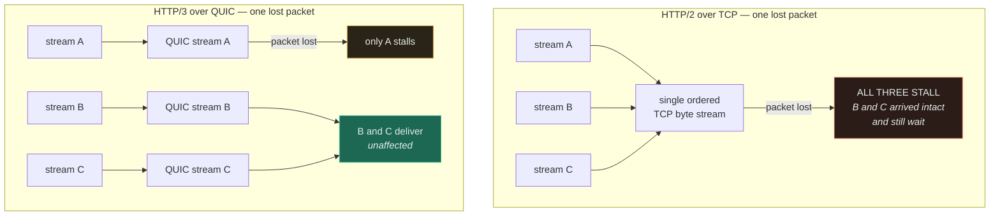

# HTTP

`[INTERMEDIATE]` · Each version exists because the previous one made round trips the bottleneck.
**HTTP/2 fixed head-of-line blocking at the HTTP layer and not at TCP; HTTP/3 changed transport to
finish the job — and for most systems connection reuse still matters more than either.**

---

## 1. One-line definition

A request/response protocol carrying typed messages over a reliable transport, plus the caching and
semantics layer that makes the web scalable.

## 2. Explain like I'm new

You ask for a thing, you get the thing. That is HTTP, and it has not changed since 1991.

What has changed three times is *how many things you can ask for at once over one connection*.
Version 1.1 could carry one at a time, so browsers opened six connections in parallel to compensate.
Version 2 let many requests share one connection — but the connection underneath still delivers
bytes in strict order, so one lost packet freezes all of them together. Version 3 swapped the
connection for one that keeps each request separate, so a lost packet only affects the request that
lost it.

**Every version is the same protocol answering the same complaint: too many round trips, and too
much waiting for the wrong thing.**

## 3. Real-world analogy

A counter at a post office. HTTP/1.1 is one queue at one window — the person in front with a
complicated parcel holds everyone up, so you open six windows. HTTP/2 is one window that takes
everyone's parcels at once and hands them back as they finish, in any order.

**Where it breaks:** the analogy makes HTTP/2 sound like a clean win, and it stops being true one
level down. The post office has a single conveyor belt out the back, and it is strictly ordered — if
one parcel falls off, everything behind it stops, including parcels for people the accident had
nothing to do with. That conveyor belt is [TCP](../tcp-udp/), the analogy has no way to show it, and
it is the reason HTTP/3 exists. The analogy also implies six windows are always worse than one; on a
lossy network they are genuinely better, because an accident only blocks one sixth of the work.

## 4. Technical explanation

| | HTTP/1.1 | HTTP/2 | HTTP/3 |
|---|---|---|---|
| Year | 1997 | 2015 | 2022 |
| Transport | TCP | TCP | **QUIC over UDP** |
| Message format | Text | Binary frames | Binary frames |
| Concurrency per connection | 1 (pipelining defined but unusable) | Many streams, multiplexed | Many streams, **independent** |
| Header compression | None | HPACK | QPACK |
| HTTP-layer head-of-line blocking | **Yes** | No | No |
| Transport-layer head-of-line blocking | Yes (mitigated by 6 connections) | **Yes — connection-wide** | **No** |
| Secure handshake cost | TCP + TLS = 2 RTT | TCP + TLS = 2 RTT | **1 RTT, or 0 on resumption** |
| Survives client IP change | No | No | Yes |

### HTTP/1.1 — the six-connection workaround

One request at a time per connection. Pipelining was specified and is effectively unusable, because
responses must return in request order and intermediaries handle it badly. Browsers responded by
opening about six connections per origin, and developers responded to *that* with domain sharding —
splitting assets across `img1.`, `img2.` to buy more parallel connections.

Both are workarounds for a protocol limit, and both cost handshakes. **Six connections is six TCP
handshakes and six TLS handshakes**, which was the actual bill.

### HTTP/2 — multiplexing, and the limit of it

Binary framing lets many logical streams interleave on one connection. This removes the
six-connection limit, makes domain sharding counterproductive, and HPACK removes the kilobytes of
repeated headers that dominated small requests.

Then the important part. **TCP delivers a single ordered byte stream, and it has no idea your
frames belong to different requests.** One lost packet holds every stream on that connection until
it is retransmitted — so HTTP/2 concentrated all your traffic onto one connection whose stalls are
now shared. On a link with meaningful loss, HTTP/2 can be *slower* than HTTP/1.1 with six
connections, because six connections means a loss event stalls one sixth of the work.

Server push shipped with HTTP/2 and is dead — browsers removed support, because it pushed resources
clients already had. `103 Early Hints` is the replacement and does the useful part without the
waste.

### HTTP/3 — moving the floor

HTTP/3 keeps HTTP/2's semantics and replaces TCP with [QUIC](../tcp-udp/#4-technical-explanation).
QUIC tracks ordering per stream, so loss on one stream leaves the rest untouched — the head-of-line
problem is gone at both layers. It also merges the transport and TLS handshakes into one round trip,
and survives a client changing network.



That diagram is the whole argument for HTTP/3, and it is the thing the version table cannot show:
the blockage is not in HTTP at all.

## 5. Engineering at scale

**Connection reuse beats the version number.** This is the section's main claim and it is
unpopular, because the version number is easier to put in a slide.

| Change | Effect on a cold request at 100 ms RTT |
|---|---|
| Enable keep-alive / pooling on the client | **~400 ms → ~100 ms** |
| HTTP/1.1 → HTTP/2 | Removes per-request queueing; no change to handshake cost |
| HTTP/2 → HTTP/3 | Saves 1 RTT on new connections; large win only on lossy links |
| TLS session resumption | Saves 1 RTT on new connections |

Most server-to-server systems open a connection, make one call, and close it, then debate protocol
versions. **Check whether your connection establishment rate is close to your request rate before
anything else** — if it is, you have found a 3–4× win that costs a config change.

### The idle-timeout race

The most common HTTP bug in production is not a protocol issue. The server closes an idle keep-alive
connection at the same moment a client picks it out of the pool and writes to it; the client sees a
reset on a request that never reached the application.

Two rules fix it: **the client's idle timeout must be shorter than the server's**, so the client
always retires the connection first; and requests that fail with a connection-level error before any
response byte arrives are safe to retry on a fresh connection, because the server never processed
them. Get the first wrong and you will see a low, constant, unexplained error rate that survives
every code change.

### HTTP/2 and load balancing pin traffic

A subtle one. An L4 load balancer distributes *connections*. HTTP/2 gives it one long-lived
connection carrying everything. **So all of a client's traffic lands on one backend, and your load
balancing quietly stops working** — worse, a new backend added during a scale-out receives nothing
until connections happen to rotate.

The fixes are to balance per request at L7, or to cap connection lifetime so connections
redistribute — gRPC's `MAX_CONNECTION_AGE` exists precisely for this. See
[load balancing](../../03-load-balancing/fundamentals/).

### Caching headers are part of the protocol, and they are free

`Cache-Control` with a sensible `max-age`, `ETag` with conditional requests, and
`stale-while-revalidate` push work to caches you do not run and do not pay for. Getting `Vary` wrong
is the classic mistake — omit it and a personalised response gets served to the wrong user by a
shared cache, which is a security bug wearing a performance costume. See
[caching](../../04-caching/fundamentals/).

## 6. The problem it solves

A uniform, cacheable, intermediary-friendly way for a client to ask a server for something, such
that proxies, load balancers and CDNs can understand and act on the traffic without knowing
anything about the application.

## 7. The problem it does NOT solve

**HTTP is request/response, and no version changes that.** The server cannot initiate. Everything
that looks like server push — polling, long polling, SSE, WebSockets — is a workaround built on top,
and choosing between them is [its own page](../websockets/).

Upgrading the version also does not fix a slow application. If your p99 is 800 ms because of a
missing database index, HTTP/3 will save you a round trip and change nothing that matters. **The
protocol is rarely the bottleneck; it is just the most enjoyable thing to change.**

## 9. How it works

A request is a method, a target, headers and an optional body; a response is a status, headers and
an optional body. The mechanics that matter operationally are not in the message format:

| Mechanism | What it does | Where it bites |
|---|---|---|
| Persistent connections | Reuse a TCP connection across requests | Idle-timeout races; pool sizing |
| Multiplexing (h2/h3) | Many requests in flight on one connection | Connection-level flow control; LB pinning |
| Flow control | Per-stream and per-connection windows | A slow reader can stall a fast stream |
| Conditional requests | `ETag` / `If-None-Match` → `304` | Cheap, and routinely left unimplemented |
| Content negotiation | `Accept`, `Vary` | `Vary` errors cause cross-user cache poisoning |
| Chunked / streaming bodies | Response before the length is known | Buffering proxies silently defeat it |

## 13. When to use it

- Effectively all client/server communication. It is the default and the default is right.
- Anything that must traverse the public internet, corporate proxies or a CDN — HTTP is the only
  protocol universally permitted
- Anywhere you want caching, retries and observability for free from intermediaries
- **HTTP/2 or HTTP/3 specifically** when a page or call graph makes many parallel requests to one
  origin

## 14. When NOT to

- High-frequency bidirectional messaging. Per-message header and request overhead adds up — see
  [WebSockets](../websockets/).
- Very large internal data transfer where a purpose-built protocol wins, though the operational cost
  of a bespoke protocol is usually underestimated
- **Adopting HTTP/3 before you have connection reuse.** You would be optimising one round trip out
  of four while still paying the other three.
- Streaming media, where the specialised stack exists for good reasons

## 17. Trade-offs

| Choose | Get | Pay |
|---|---|---|
| HTTP/1.1 | Simplicity; trivially debuggable; loss stalls only one of six connections | Six handshakes, no header compression, one request at a time each |
| HTTP/2 | Multiplexing, header compression, one connection | **All streams share TCP's stalls**; L4 load balancers pin traffic |
| HTTP/3 | No head-of-line blocking, 1-RTT setup, connection migration | Higher CPU, younger tooling, UDP blocked on some networks |
| Keep-alive pooling | Removes ~3 RTT per request | Held file descriptors; idle-timeout races |
| Long cache TTLs on responses | Origin load collapses | Staleness you cannot recall — same problem as [DNS](../dns/) |
| `ETag` + conditional requests | Bandwidth saved, freshness kept | Still a round trip; server must compute the tag |

## 18. Why not?

| Alternative | Why not here | When it WOULD win |
|---|---|---|
| **gRPC** | Still HTTP/2 underneath — it inherits every constraint on this page | Typed internal RPC, streaming, code generation across languages |
| **WebSockets** | Loses caching, intermediaries and statelessness | Genuinely bidirectional, high-frequency messaging |
| **A message queue** | Not request/response; different failure model | Work that need not be synchronous — [queues](../../06-messaging/queues/) |
| **A bespoke binary protocol** | Nothing on the path understands it: no CDN, no proxy, no standard tooling | Datacentre-internal, extreme throughput, and you can afford to own it |
| **Stay on HTTP/1.1** | Six handshakes and no multiplexing | Low request concurrency, lossy links, or debuggability matters more than throughput |

The last row is real. **A system making a handful of large sequential requests gains almost nothing
from HTTP/2** and loses the ability to read the wire with `tcpdump`.

## 19. Failure scenarios

| Failure | What happens | Mitigation |
|---|---|---|
| **Idle-timeout race** | Sporadic connection resets on requests the server never saw. Low, constant, maddening. | Client idle timeout < server keep-alive; retry safe requests on a fresh connection |
| **HTTP/2 pinning on an L4 balancer** | One backend takes everything; new backends receive nothing | L7 per-request balancing, or cap connection age |
| **Packet loss with h2** | All streams stall together; p99 spikes with no server-side cause | HTTP/3, or accept parallel connections |
| **Connection pool exhausted** | Requests queue in the client before reaching the network. Invisible in server metrics. | Size the pool, measure client-side wait, timeout on acquisition |
| **`Vary` missing or wrong** | A shared cache serves one user's personalised response to another — a security incident | Set `Vary` explicitly; never cache authenticated responses publicly |
| **Retrying a non-idempotent request** | Duplicate side effects after a timeout | Retry only idempotent methods, or use idempotency keys |
| **Buffering proxy defeats streaming** | A streamed response is held and delivered whole; latency looks fine, feel is wrong | Check every intermediary; disable response buffering explicitly |
| **Slow rather than failed backend** | Streams and pool slots are held; client threads exhaust and callers fail too | Timeouts everywhere, plus a circuit breaker |

## 25. Without it → With it → New problem → Next

```
Without it   →  every client/server pair invents its own protocol; nothing on the path —
                proxy, cache, CDN — can understand or act on the traffic
With it      →  uniform semantics, free caching and intermediary support, and a version
                ladder that removes round trips as they become the bottleneck
New problem  →  connections are now precious (pooling, idle-timeout races), multiplexing
                defeats connection-level load balancing, and the request/response shape
                still cannot let a server initiate
Next         →  keep-alive tuning and L7 load balancing; then SSE or WebSockets for the
                push case HTTP structurally cannot serve
```

Note that the new problems are *operational*, not protocol problems — which is why teams that
upgrade the version and skip the pooling work see no improvement. See
[the chain](../../SYSTEM-DESIGN-THINKING.md#part-1--the-chain).

## 28. Common mistakes

| Mistake | Why it is wrong |
|---|---|
| "We're on HTTP/2, head-of-line blocking is solved" | Solved above TCP only. The transport still stalls every stream. |
| Upgrading the version before enabling keep-alive | Optimising 1 round trip out of 4 while ignoring the other 3 |
| Client idle timeout ≥ server keep-alive timeout | Guarantees a steady trickle of reset connections |
| Domain sharding on HTTP/2 | Actively harmful — it splits one multiplexed connection into several |
| Relying on server push | Removed by browsers; use `103 Early Hints` |
| Retrying `POST` blindly on timeout | Duplicate charges, duplicate orders |
| No `Cache-Control` on cacheable responses | Discards free capacity at every layer between you and the user |
| `Vary` omitted on personalised responses | Cross-user cache poisoning — a security bug, not a performance one |
| L4 balancing in front of HTTP/2 backends | Traffic pins to one backend and load balancing silently stops |
| Unbounded connection pools | Trades a client-side queue for a backend collapse |

## 29. Monitoring

Report status codes as classes and separately as specific codes — a rise in `499`/`502`/`504`
distinguishes client aborts from your gateway from your backend, and aggregating them hides which
one is failing. **Track connection establishment rate against request rate**, since their ratio is
the single number that tells you whether pooling works.

Measure client-side pool wait time, not just server duration: a request queued for a connection is
slow to the user and invisible to the server. Break latency down by endpoint, and for HTTP/2 watch
per-backend request distribution — pinning shows up as one backend at 90% CPU while its peers idle.
See [observability](../../11-observability/).

## 31. Exercises

**1.** You migrate a mobile API from HTTP/1.1 to HTTP/2 expecting a large latency win. p50 improves
slightly; p99 gets *worse*. Explain the regression.

<details><summary>Answer</summary>

Before the migration the client used about six parallel TCP connections. Loss on any one of them
stalled only the requests on that connection — roughly a sixth of the work — while the other five
carried on. After the migration everything shares a single TCP connection, so **one lost packet now
stalls every request in flight simultaneously**.

Mobile networks have real, bursty loss, so this is not a rare case. The p50 improved a little
because header compression and the removal of per-connection queueing help every request slightly.
The p99 got worse because loss events, previously partial, are now total: the tail of the
distribution is made of loss, and you concentrated the blast radius. The fix is HTTP/3, whose
per-stream ordering means a lost packet blocks only the stream that lost it. The general lesson is
that **multiplexing onto one connection trades isolation for efficiency, and isolation is what the
tail was made of.**
</details>

**2.** A service sees roughly 0.05% of requests fail with connection resets. It happens on every
endpoint, at every hour, and no server log records the request. Latency is fine. What is the most
likely cause, and how do you confirm it without a packet capture?

<details><summary>Answer</summary>

Almost certainly an idle keep-alive timeout race. The server closes a connection it considers idle
while the client simultaneously takes that connection from its pool and writes a request onto it.
The `FIN` and the request cross on the wire, the client gets a reset, and the server never parsed
anything — which is exactly why no server log exists. **The absence of a server-side record is the
diagnostic**: a request that failed *at* the server leaves a trace; one that failed on a
mid-teardown connection leaves nothing.

Confirm it by comparing the two idle timeouts. If the client's is greater than or equal to the
server's (including any load balancer in between, which has its own), the race is guaranteed and its
rate scales with how much idle time your traffic pattern has. Fix it by setting the client idle
timeout comfortably below the server's, so the client always retires connections first, and by
retrying idempotent requests that fail before any response byte. Note that this is not a bug in any
component — every party behaved correctly — which is why it survives code reviews indefinitely.
</details>

**3.** Your gRPC service sits behind an L4 load balancer. After a scale-out from 4 to 8 pods, CPU on
the original 4 stays at 80% and the new 4 sit at 2%. Why, and what are your two options?

<details><summary>Answer</summary>

gRPC runs on HTTP/2, which multiplexes all of a client's calls onto one long-lived connection. An L4
balancer makes its decision once, at connection establishment. The existing connections were
assigned when only 4 pods existed, they never close, and so **the new pods can only receive traffic
from clients that happen to connect after the scale-out** — of which there are none, because nobody
is reconnecting.

Option one: balance at L7, where the proxy terminates HTTP/2 and distributes individual requests, so
every new pod receives traffic immediately. Option two: bound connection lifetime — gRPC's
`MAX_CONNECTION_AGE` (with a grace period) makes servers politely retire connections so clients
reconnect and redistribute. Option one is better if you already run an L7 proxy or a service mesh;
option two is a small server-side change that works with the balancer you have. The deeper point is
that **connection-level load balancing and connection-level multiplexing are in direct conflict**,
and autoscaling is where you discover it, because that is when a rebalance was supposed to happen.
</details>

**4.** A colleague wants to remove `ETag` support to save CPU, arguing "the response is only 2 KB,
the round trip dominates anyway". Is the argument sound?

<details><summary>Answer</summary>

The arithmetic is right and the conclusion is wrong for a reason the arithmetic cannot see. A `304
Not Modified` costs the same round trip as a `200`, so for a single client on a warm connection the
latency saving really is negligible for 2 KB.

What the argument omits is everything that is not that client. A validated response can be revalidated
by *shared* caches — CDN nodes, reverse proxies — which is how one origin request serves many users.
More importantly, a `304` typically means the origin skipped rendering the response body, so the
saving is not 2 KB of bandwidth but whatever computation and database work produced it. That is
often orders of magnitude more than the CPU spent hashing. **Measure what the `ETag` lets you skip,
not what it costs to compute.**

There is a legitimate version of his argument: if your `ETag` is computed by fully rendering the
response and then hashing it, you have paid the full cost and saved only bandwidth. That is worth
fixing — by deriving the tag from a version or timestamp you already have — rather than by removing
validation. See [caching](../../04-caching/fundamentals/).
</details>

## 33. Related

- [Networking index](../README.md) — the cold-request budget this page keeps referring to
- [TCP / UDP](../tcp-udp/) — read first; it explains the constraint every version is fighting
- [TLS](../tls/) — the other handshake in the budget
- [WebSockets](../websockets/) — what to do when request/response is the wrong shape
- [Caching](../../04-caching/fundamentals/) — HTTP caching headers are the cheapest cache you own
- [Load balancing](../../03-load-balancing/fundamentals/) — where HTTP/2 multiplexing complicates things
- [Observability](../../11-observability/) — how you would know any of this broke
- [Glossary: CDN](../../GLOSSARY.md#cdn) · [idempotency](../../GLOSSARY.md#idempotency)
