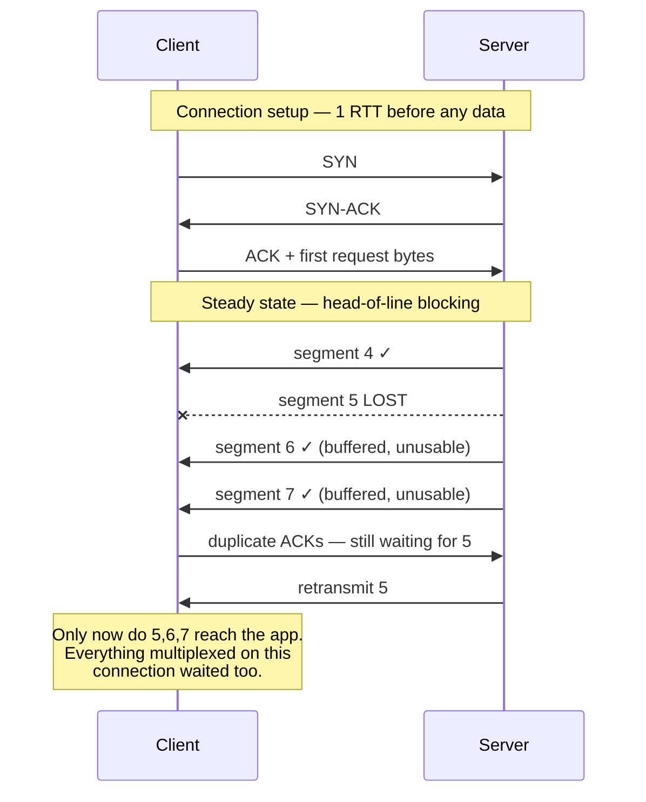

# TCP / UDP

`[INTERMEDIATE]` · TCP gives you ordered, reliable bytes — and **its ordering guarantee is also its
worst failure mode**, because one lost packet stalls everything that arrived behind it. UDP gives
you none of that, which is occasionally exactly right.

---

## 1. One-line definition

Two transport protocols: TCP delivers a reliable, ordered byte stream over an established
connection; UDP delivers individual datagrams with no connection, no ordering and no delivery
guarantee.

## 2. Explain like I'm new

Sending data across a network means chopping it into packets. Packets get lost, arrive out of order,
or arrive twice — the network makes no promises at all.

TCP hides that. It numbers everything, asks for anything missing to be sent again, and hands your
program a clean stream of bytes in the right order. That convenience costs a conversation up front
to agree the connection exists, and it costs *waiting*: if packet 5 goes missing, packets 6, 7 and 8
sit in a buffer unread until 5 turns up, even though they arrived perfectly.

UDP does not hide anything. It throws the packet and forgets. No setup conversation, no
retransmission, no waiting for stragglers. If you actually need reliability you have to build it —
which sounds like a bad deal until you notice that **building it yourself lets you decide what to do
about a lost packet, and sometimes the right answer is nothing at all**.

## 3. Real-world analogy

TCP is a phone call: you dial, they answer, you both confirm you can hear each other, and then you
talk knowing every word arrives in order. UDP is shouting across a room.

**Where it breaks:** a phone call has one conversation on it, so "wait for the missing word" costs
only that conversation. A modern TCP connection carries dozens of independent things at once — a
hundred HTTP/2 streams, a stream of gRPC calls — and the waiting is not scoped to the one that lost
a packet. **The analogy hides the entire point of this page: TCP's stall is shared by everything
riding on the connection**, which is why QUIC exists. And unlike a phone call, a TCP connection can
be silently dead for minutes with both ends still believing it is open, because nobody is talking.

## 4. Technical explanation

### The handshake, and what it costs

TCP's three-way handshake — `SYN`, `SYN-ACK`, `ACK` — costs **one full round trip before the client
may send a single byte of application data**. That is not the whole cost of a cold connection:

| Step | Round trips | At 10 ms RTT | At 100 ms RTT |
|---|---|---|---|
| TCP handshake | 1 | 10 ms | 100 ms |
| TLS 1.3 handshake | 1 | 10 ms | 100 ms |
| First HTTP request/response | 1 | 10 ms | 100 ms |
| **Total before the first byte of body** | **3** | **30 ms** | **300 ms** |

**The protocol is not slow; the round trips are.** This table is the entire argument for connection
pooling, and it is why a keep-alive setting frequently beats a protocol upgrade —
see [HTTP](../http/#5-engineering-at-scale). TCP Fast Open can carry data in the `SYN`, but
middleboxes mangle it often enough that nobody relies on it.

### Slow start: the connection is also slow after it opens

A new connection does not begin at full speed. Congestion control starts with an initial window of
about 10 segments — roughly 14 KB — and doubles each round trip until it sees loss. A 200 KB
response over a fresh connection therefore takes several round trips *regardless of bandwidth*.

**A warm connection is not just one that skipped the handshake; it is one whose congestion window
has already grown.** Killing idle connections aggressively throws that away and people rarely notice
they are paying for it.

### Head-of-line blocking

TCP promises in-order delivery to the application. So when segment 5 is lost, segments 6–9 sit in
the receiver's kernel buffer — received, intact, unusable — until 5 is retransmitted and arrives, a
minimum of one more round trip later.

If that connection is carrying one file, the wait is honest. If it is carrying 100 multiplexed
HTTP/2 streams, **99 of them just stalled for a packet none of them needed**. This is the defect
QUIC was built to remove.

### TCP vs UDP vs QUIC

| | TCP | UDP | QUIC |
|---|---|---|---|
| Connection setup | 1 RTT (+1 for TLS) | None | **1 RTT including TLS 1.3; 0 RTT on resumption** |
| Reliability | Built in | None | Built in, per stream |
| Ordering | Global, across the whole connection | None | **Per stream** — independent |
| Head-of-line blocking | Yes, connection-wide | N/A | Only within one stream |
| Congestion control | In the kernel | You build it | In user space — shippable with the app |
| Survives an IP change | No — connection dies | N/A | **Yes, via connection IDs** |
| Where it runs | Kernel | Kernel | User space, over UDP |

### Why QUIC exists

Three reasons, and only the first is the famous one:

1. **Per-stream ordering** removes connection-wide head-of-line blocking. Loss on one stream leaves
   the others untouched.
2. **The transport and cryptographic handshakes are merged**, so a secure connection costs one round
   trip instead of two, and zero on resumption.
3. **Connection IDs replace the four-tuple**, so a phone moving from Wi-Fi to cellular keeps its
   connection instead of rebuilding it. On mobile this matters more than the first two.

And the reason it is built on UDP rather than as a new transport protocol: **middleboxes.** Firewalls
and NATs inspect and rewrite TCP so aggressively that a genuinely new transport cannot traverse the
internet, and kernel-level changes take a decade to reach users. UDP was the only viable substrate.
QUIC is not "UDP because UDP is fast" — it is UDP because TCP has been ossified by the network.

## 5. Engineering at scale

**Connections are a finite resource in four separate ways, and each one fails differently.**

| Limit | Typical ceiling | Symptom when hit |
|---|---|---|
| File descriptors | `ulimit -n`, often 1024 by default | `EMFILE`, accepts start failing |
| Ephemeral ports (outbound) | ~28,000 per destination tuple on Linux | `EADDRNOTAVAIL` — the client cannot open connections, and it looks like the server is down |
| `TIME_WAIT` sockets | 60 s each after close | Port exhaustion under high connection churn |
| Accept queue / `backlog` | Small by default | Silent `SYN` drops under burst, seen as sporadic timeouts |

Ephemeral port exhaustion is the one that catches teams: it appears on the *client* side, most often
in a proxy or service-mesh sidecar making many short-lived connections to one backend address, and
the error surfaces far from its cause. The fix is connection reuse, then more destination
addresses — never more retries.

**Congestion-control choice becomes visible at scale.** CUBIC treats loss as congestion, which is
wrong on wireless links where loss is often just interference. BBR models bandwidth and round-trip
time instead and typically outperforms CUBIC over lossy or long-fat paths — the sort of measurement
worth doing on your own traffic rather than accepting a default.

**Nagle's algorithm plus delayed ACK** is a classic latency bug: Nagle holds a small write waiting
for more data, the peer's delayed ACK holds the acknowledgement waiting for a response, and the two
deadlock for tens of milliseconds. It shows up as a suspiciously round latency floor on small
request/response traffic. `TCP_NODELAY` is the fix, and most RPC frameworks set it — check yours
rather than assuming.

## 6. The problem it solves

TCP: turning an unreliable packet network into something a programmer can treat as a file. Almost
everything above it — HTTP, TLS, databases, RPC — assumes that abstraction and would have to
reimplement it otherwise.

UDP: getting out of the way, for cases where the transport's idea of "correct" is wrong.

## 7. The problem it does NOT solve

**TCP does not tell you the peer is alive.** A connection through a NAT or firewall can be silently
dead for minutes while both ends believe it is open; you discover it on the next write, which then
takes a retransmission timeout to fail. Keep-alives and application-level heartbeats exist because
the transport will not tell you.

It also does not bound latency — reliability is bought with retransmission, and a retransmission is
a round trip you did not plan for. **TCP converts loss into latency**, which is exactly the trade
you do not want for real-time media. And it does not protect anything: TCP has no encryption and no
authentication. That is [TLS](../tls/).

## 9. How it works



The second half is the part worth staring at: segments 6 and 7 arrived intact and on time, and were
still late to the application. **No amount of bandwidth fixes that; only changing the transport
does.**

## 13. When to use it

**TCP** — the default, and correctly so. Anything where every byte must arrive: HTTP, databases,
RPC, file transfer, anything transactional.

**UDP** — when at least one of these is true:

- **A late packet is worthless.** Voice, video, live telemetry: retransmitting audio from 300 ms ago
  is strictly worse than a gap, because the gap is already over.
- **The newest message supersedes the old one.** Game state, position updates, sensor readings —
  resending a stale position is wasted work.
- **The exchange is smaller than the handshake.** DNS is one query and one answer; paying a round
  trip to set up a connection for a single packet is absurd, and retrying is cheaper than
  connecting.
- **Loss is acceptable and volume is enormous.** StatsD-style metrics emission: dropping 0.1% of
  samples changes no decision, and blocking the application to guarantee delivery would.
- **You are building a better transport.** QUIC's use of UDP is this case.

## 14. When NOT to

- UDP because "it is faster". For bulk transfer it is not — you will reimplement retransmission and
  congestion control, badly, and end up slower than TCP as well as unfair to everyone sharing the
  link.
- UDP for anything transactional. Losing a payment because a datagram vanished is not a trade
  anybody agreed to.
- **QUIC everywhere without measuring.** It is a clear win on lossy, high-latency and mobile paths.
  Inside a datacentre — 0.5 ms RTT, near-zero loss — TCP has no head-of-line problem to fix, and
  QUIC's user-space processing can cost more CPU than it saves.
- Tuning congestion control before you have checked whether your real bottleneck is a
  [queue](../../06-messaging/queues/) or a slow database. It usually is.

## 17. Trade-offs

| Choose | Get | Pay |
|---|---|---|
| TCP | Reliability and ordering for free | 1 RTT setup, slow start, connection-wide head-of-line blocking |
| UDP | No setup, no waiting, full control | You implement reliability, ordering and congestion control — or accept losing data |
| QUIC | 1-RTT secure setup, per-stream ordering, connection migration | Higher CPU, younger tooling, some networks block or throttle UDP |
| Long-lived pooled connections | No handshake, warm congestion window | Memory and file descriptors held while idle; stale-connection handling |
| Aggressive idle timeouts | Fewer resources held | Every reconnect pays handshake **and** slow start again |
| Larger socket buffers | Higher throughput on long-fat paths | Memory per connection, and more bufferbloat latency |

## 18. Why not?

| Alternative | Why not here | When it WOULD win |
|---|---|---|
| **UDP instead of TCP** | You rebuild reliability worse than the kernel's | Real-time media, tiny request/response, tolerable loss |
| **QUIC instead of TCP** | Inside a datacentre there is no head-of-line problem to solve, and CPU cost is real | Mobile clients, lossy or long-haul paths, connection migration matters |
| **A message queue instead of a connection** | Adds a component and gives up request/response | Work that need not be synchronous — see [queues](../../06-messaging/queues/) |
| **More retries at the application layer** | Retries on a congested path make congestion worse | Never as a substitute for transport tuning; only with backoff and jitter |
| **Do nothing — tune keep-alive instead** | Nothing. This is usually the correct answer. | **Most systems.** Connection reuse beats every other item in this table. |

## 19. Failure scenarios

| Failure | What happens | Mitigation |
|---|---|---|
| **Packet loss on a multiplexed connection** | Every stream stalls for one round trip minimum, not just the affected one | QUIC/HTTP/3, or several parallel connections |
| **Ephemeral port exhaustion** | Client cannot open connections; looks exactly like server failure | Connection pooling, more destination IPs, shorter `TIME_WAIT` reuse |
| **Silently dead connection (NAT idle timeout)** | Writes succeed locally, then fail minutes later after a retransmission timeout | Keep-alives below the shortest idle timeout in the path; application heartbeats |
| **Accept queue overflow** | `SYN`s dropped silently; clients see intermittent timeouts and nothing is logged | Raise `backlog` and `somaxconn`, monitor overflow counters |
| **Bufferbloat** | Throughput fine, latency terrible — queues absorb load instead of signalling it | BBR, AQM (fq_codel), smaller buffers |
| **Path MTU black hole** | Small packets work, large ones vanish. **Presents as "the API works but uploads hang".** | MSS clamping, PMTUD, or lower the MTU |
| **SYN flood** | Half-open connections exhaust the accept queue | SYN cookies, upstream filtering |
| **UDP amplification abuse** | Your open UDP service becomes a reflector in someone else's DDoS | Never expose unauthenticated UDP services; rate limit; ingress filtering |
| **Slow rather than down** | Retransmissions raise latency without raising error rate. Nothing alerts, and callers exhaust their threads. | Timeouts on every call — see [latency](../../00-foundations/latency/) |

**The third row is the one that catches people.** A dead-but-open connection is worse than a closed
one, because the failure is deferred to whenever you next try to use it — typically in the middle of
a request, long after the network event that caused it.

## 25. Without it → With it → New problem → Next

```
Without it   →  the application must handle loss, duplication and reordering itself
With it      →  a reliable ordered byte stream, and every protocol above can assume it
New problem  →  a round trip before the first byte, a slow-starting connection, and
                connection-wide head-of-line blocking shared by everything multiplexed on it
Next         →  connection pooling and keep-alive to amortise setup; then QUIC/HTTP/3 when
                the head-of-line stall is what actually hurts
```

Note the order: **pooling first, protocol second.** Reusing connections is a configuration change
with a 3× effect on cold latency; adopting HTTP/3 is a migration with a narrower one. See
[the chain](../../SYSTEM-DESIGN-THINKING.md#part-1--the-chain).

## 28. Common mistakes

| Mistake | Why it is wrong |
|---|---|
| A new connection per request | Pays handshake and slow start every time — often the single biggest latency win available |
| Assuming HTTP/2 removed head-of-line blocking | It removed it above TCP. TCP still stalls every stream. |
| Choosing UDP for speed on bulk transfer | You will reimplement TCP, worse, and be unfair to the network |
| No `TCP_NODELAY` on small request/response traffic | Nagle plus delayed ACK adds tens of ms for no reason |
| Idle timeouts shorter than the traffic pattern | Every request pays a fresh handshake and a cold window |
| Ignoring `TIME_WAIT` under high churn | Port exhaustion presents as a server outage that is really a client bug |
| No application heartbeat on long-lived connections | Dead connections are discovered mid-request, at the worst moment |
| Tuning buffers before measuring | Bufferbloat trades the latency you care about for throughput you do not need |

## 29. Monitoring

Retransmission rate is the signal most worth having and the one least often collected — rising
retransmits mean loss, and loss means latency long before it means errors. Track connection
establishment rate separately from request rate: **if they are similar, you have no connection
reuse**, and that single ratio is worth more than most dashboards.

Also watch accept-queue overflow counters, socket state counts (`TIME_WAIT`, `CLOSE_WAIT` — a
growing `CLOSE_WAIT` count is an application leaking sockets, not a network problem), and
established connections per host against your descriptor limit. See
[observability](../../11-observability/).

## 31. Exercises

**1.** Your API is 40 ms away. A client makes 10 sequential requests and reports 1.6 seconds total.
Each server-side trace shows 15 ms of processing. Where did the time go, and what is the one change
that fixes most of it?

<details><summary>Answer</summary>

Server processing accounts for 150 ms of the 1600 ms, so 1450 ms is network. If connections were
being reused, each request would cost one round trip plus processing: `10 × (40 + 15) = 550 ms`. The
observed 1.6 s is roughly `10 × (40 + 40 + 40 + 15)` — three round trips per request plus
processing, which is the signature of **a fresh TCP handshake and TLS handshake on every single
request**.

The fix is connection reuse: a keep-alive pool on the client. It takes the total to around 550 ms —
about 3× — without touching a line of server code. The general lesson is that a repeated cost times
the number of requests is where the time hides; per-request tracing shows 15 ms and looks healthy,
because the handshakes happen *before* the server ever sees the request. **Measure at the client, or
you will optimise the 150 ms and never see the 1450.**
</details>

**2.** You move a mobile app from HTTP/2 to HTTP/3. Median latency barely changes; p99 improves
dramatically. Why would the tail improve so much more than the median?

<details><summary>Answer</summary>

The median request encountered no packet loss, so there was nothing for QUIC to fix — same number of
round trips, same bandwidth, no measurable difference. The improvement is concentrated in the tail
because **the tail *is* the loss cases**.

Under HTTP/2, a single lost packet stalls the whole TCP connection for at least a retransmission
round trip, and every concurrent stream waits with it. So one loss event does not slow one request —
it slows all of them, converting a rare network event into a broad latency spike. QUIC's per-stream
ordering means only the stream that actually lost a packet waits. Mobile networks add the second
effect: a Wi-Fi to cellular handover kills a TCP connection outright and forces a full reconnect,
whereas QUIC's connection ID survives it. Both mechanisms hit a small fraction of requests very
hard, which is the exact shape of a p99 problem — see [latency](../../00-foundations/latency/).
</details>

**3.** A team proposes UDP for a service that sends live sensor readings every 100 ms, where only
the newest reading matters. A reviewer objects: "UDP loses data." Who is right, and what must the
team build regardless?

<details><summary>Answer</summary>

The team is right on the transport choice and the reviewer is right to be nervous about what comes
with it. If only the newest reading matters, retransmitting a lost one is actively harmful: it
arrives late, it is already superseded, and under TCP it would have *delayed the fresher readings
behind it* through head-of-line blocking. Losing a reading costs 100 ms of staleness; TCP recovering
that reading could cost more than that and hold up everything after it. **When data has a shelf
life shorter than a retransmission, reliability is a downgrade.**

What they must build regardless: sequence numbers (to detect loss and to discard out-of-order stale
readings, which UDP will deliver), a bounded send rate — UDP has no congestion control, so a busy
sender will happily contribute to a collapse it cannot see — and monitoring of the loss rate itself,
because loss is now a normal condition rather than an error, and without a metric nobody will notice
it going from 0.1% to 30%. The reviewer's real objection should have been "loss becomes invisible",
and that is fixed with instrumentation, not with TCP.
</details>

**4.** A service behind a sidecar proxy starts failing with `EADDRNOTAVAIL` under load. The backend
it calls is healthy and barely loaded. What is happening, and why does adding backend capacity not
help?

<details><summary>Answer</summary>

The proxy has run out of **ephemeral ports** to the backend. An outbound TCP connection is
identified by (source IP, source port, destination IP, destination port); with the destination fixed
at one address and one port, the only variable is the source port, and Linux offers roughly 28,000
of them. Add sockets lingering in `TIME_WAIT` for 60 s after close and a service making thousands of
short-lived connections per second exhausts the range in well under a minute.

Adding backend capacity does not help because the limit is on the *client* side of the connection
and is per destination tuple — more backend CPU behind the same address changes nothing. The real
fixes, in order: reuse connections instead of opening one per request, which removes the churn
entirely; then give the destination more addresses or ports so the tuple space grows; then, last and
least, tune `TIME_WAIT` reuse. Note the diagnostic trap — the errors appear in the caller and the
graphs on the callee look perfect, so the investigation starts in the wrong place.
</details>

## 33. Related

- [Networking index](../README.md) — where these round trips sit in the total budget
- [HTTP](../http/) — the protocol whose three versions are all reactions to this page
- [TLS](../tls/) — the other handshake, and the other round trip
- [DNS](../dns/) — what happens before the handshake
- [Latency](../../00-foundations/latency/) — round trips are the term you cannot optimise away
- [Throughput](../../00-foundations/throughput/) — why slow start bounds it early
- [Queues](../../06-messaging/queues/) — the alternative to holding a connection open at all
- [Glossary: timeout](../../GLOSSARY.md#timeout) · [tail latency](../../GLOSSARY.md#tail-latency)
