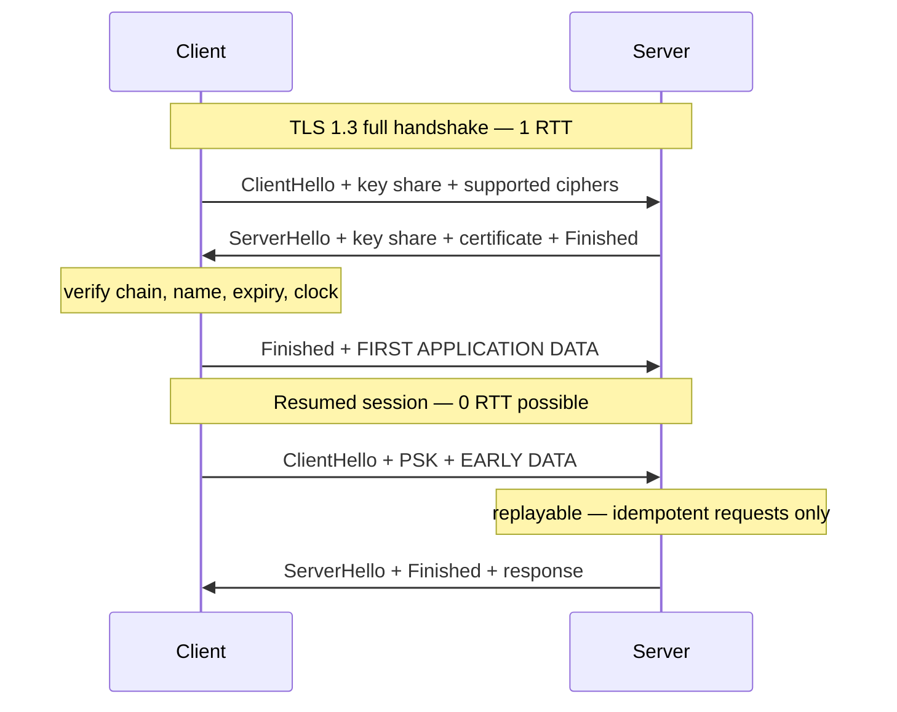

# TLS

`[INTERMEDIATE]` · Encryption and identity for a connection. Costs you round trips once and a
renewal process forever — and **certificate expiry is a total outage you could have put in a
calendar, which is exactly why it keeps happening**.

---

## 1. One-line definition

A protocol that authenticates the server (and optionally the client) and encrypts everything on the
connection, negotiated in a handshake before any application data flows.

## 2. Explain like I'm new

Two strangers need a private conversation over a wire anyone can listen to. Two problems, in this
order.

First, *who are you?* The server presents a certificate — a document saying "this name belongs to
this public key", signed by an authority the client already trusts. The client checks the signature,
checks the name matches what it asked for, and checks the document has not expired.

Second, *agree a shared secret without anyone overhearing it*. Public-key mathematics lets two
parties establish a key over a public channel; from then on everything is encrypted with fast
symmetric cryptography using that key.

Both problems cost messages back and forth, and messages back and forth cost time. **The whole
engineering story of TLS is reducing the number of round trips before real data can flow, and never
letting the certificate expire.**

## 3. Real-world analogy

A passport check at a border. You present a document issued by an authority the guard trusts, they
verify the seal, and then you are through.

**Where it breaks:** a passport check verifies *you*; TLS verifies the *name*. A valid certificate
for `evil.example.com` proves the connection reached the operator of that name — nothing about
whether they deserve your data. The analogy also implies the check happens once and you walk
through; in reality the guard rechecks on every new connection, which is why session resumption
exists and why connection reuse matters so much here. And there is no passport in the world whose
expiry closes the border for everyone simultaneously — but **a certificate's does exactly that, at a
timestamp everyone could have read months in advance.**

## 4. Technical explanation

### The handshake, in round trips

Round trips are the cost, not the cryptography.

| Scenario | Round trips before application data | At 100 ms RTT |
|---|---|---|
| TLS 1.2, full handshake | 2 | 200 ms |
| **TLS 1.3, full handshake** | **1** | 100 ms |
| TLS 1.3, resumed session | 1 (0-RTT data possible) | 100 ms, or 0 with 0-RTT |
| Reused connection from the pool | **0** | **0** |

Add TCP's own handshake underneath and a cold HTTPS connection is 2 round trips (TLS 1.3) or 3
(TLS 1.2) before the request even starts. The last row is the one that matters:
**connection reuse is the only option here that costs nothing and saves everything.**

0-RTT resumption sends application data in the first flight, which is free latency with one sharp
edge: **0-RTT data is replayable by an attacker who captures it.** Use it only for idempotent
requests, never for anything with a side effect.

### Session resumption, and why it silently fails behind a load balancer

Resumption avoids the expensive asymmetric operations by reusing a previously negotiated secret.
Two mechanisms:

| Mechanism | State lives | Fleet-wide problem |
|---|---|---|
| Session IDs | Server-side cache | A cache per server means resumption works only if you return to the same one |
| Session tickets | Client-side, encrypted with a server key | **Every server must share the same ticket key**, or a resumption offered to server B is rejected |

The default configuration of most servers generates a ticket key per process at startup. Behind a
load balancer that distributes connections, resumption then fails almost always, **every connection
pays a full handshake, and nothing anywhere reports an error** — you simply have higher latency and
CPU than you should. Sharing and rotating a ticket key across the fleet is the fix, and rotation
matters because a long-lived ticket key weakens forward secrecy.

### The cost is per connection, not per byte

The expensive part is the handshake's asymmetric cryptography. Bulk encryption afterwards is
symmetric, hardware-accelerated on every modern CPU, and close to free. When Google moved Gmail
entirely to HTTPS in 2010 they reported it cost under 1% of CPU, under 10 KB of memory per
connection, and no additional machines.

**"TLS is slow" is a claim about handshakes, and the answer to it is fewer handshakes** — connection
pooling, keep-alive, resumption — not weaker cryptography.

### Certificate validation, and the parts that fail quietly

| Element | Failure mode |
|---|---|
| Expiry | **Total, hard, dated failure.** Every client, at once. |
| Name mismatch (SAN) | Hard failure. Common after adding a hostname and forgetting the certificate. |
| **Incomplete chain** (missing intermediate) | **Partial** — browsers often recover by fetching the missing certificate; many API clients, JVMs and older tools do not. Works in your browser, fails for your customers' servers. |
| Revocation (OCSP / CRL) | Historically a third-party call on the critical path; OCSP stapling moved it server-side, and the industry is retiring OCSP in favour of CRLs and short-lived certificates |
| Client clock skew | A perfectly valid certificate rejected because the *client's* clock is wrong |
| SNI | One IP, many certificates. Get it wrong and clients receive the wrong certificate entirely. |

The incomplete-chain row is the nastiest, because it produces a partial outage that your own browser
testing will not reproduce.

## 5. Engineering at scale

### Where you terminate decides what you get

| Termination point | Who sees plaintext | Get | Pay |
|---|---|---|---|
| **CDN / edge PoP** | The CDN | Handshake happens ~10 ms from the user instead of ~150 ms — the largest single latency win available | Trust in the CDN; keys or a keyless arrangement |
| **Load balancer** | The LB | One place for certificates, renewals and ciphers; backends stay simple | Plaintext on the internal network; the LB becomes the crypto bottleneck |
| **Application** | The app | End-to-end encryption to the process | Certificate management on every service — the operationally hardest option |
| **mTLS everywhere / service mesh** | Nobody in between | Both ends authenticated; the basis of zero-trust internal networking | Internal PKI, short-lived certificates, rotation — and **the mesh's certificates expire too** |

**Edge termination is the underrated one.** A TLS handshake is one or two round trips, and moving
those round trips from a transatlantic path to a nearby point of presence removes hundreds of
milliseconds from the first request — which is a bigger effect than any protocol version change in
this section. The origin connection is then a warm, pooled, long-lived one that pays the handshake
almost never.

Re-encrypting from the load balancer to the origin is common and usually right; it costs a second
handshake on a low-latency internal hop, which is cheap, and it keeps plaintext off the internal
network.

### Certificate expiry is the failure mode

It deserves its own paragraph because it is the most predictable outage in this repository and it
still takes down large companies. **Every certificate has a known expiry timestamp, visible to
anyone who looks, and the outage it produces is complete: every client, every request,
simultaneously.** In 2018 an expired certificate inside a mobile network vendor's software removed
data service for tens of millions of subscribers across multiple operators for most of a day.

The controls, in order of how much they actually help:

1. **Automate renewal** (ACME) so no human is in the path. Public certificates are the easy case.
2. **Monitor from outside**, against the certificate your users receive — not the file on disk, not
   the config. The chain your server actually serves is what matters.
3. **Alert with room**: 30 days, 14 days, 7 days, and page at 3. Alert a *team*, never a person.
4. **Inventory the ones without ACME.** Internal PKI, mTLS client certificates, mesh identities,
   database and message-broker certificates, pinned certificates in mobile apps. **These are the
   ones that take you down**, because the public web certificate is the one everybody remembered to
   automate.
5. **Do not pin** unless you have a rotation plan and a remote kill switch. Pinning converts a
   renewal into an outage you cannot fix without shipping a client release.

## 6. The problem it solves

Anyone on the path can otherwise read and modify traffic, and a client has no way to know whether it
reached the right server. TLS gives confidentiality, integrity and server identity, and does it
generically enough that every protocol above it gets those properties without implementing anything.

## 7. The problem it does NOT solve

**TLS authenticates a name, not a party or a payload.** A valid certificate says you reached the
operator of that hostname; it says nothing about whether they are trustworthy, whether your data is
safe once decrypted, or whether the request was authorised. Authentication of *users* and
authorisation of *actions* are entirely separate problems.

It does not protect data at rest, does not protect anything past the termination point — traffic
beyond your load balancer is plaintext unless you re-encrypt — and does not hide metadata: the
destination IP is visible, and the hostname is visible in SNI unless Encrypted Client Hello is in
use. **A common misconception is that HTTPS makes an endpoint safe to expose; it makes it private,
not safe.**

## 9. How it works



The diagram is here for one detail prose states badly: in TLS 1.3 the client sends application data
in its *second* flight, not its third. That single change is the whole 1.2 → 1.3 latency
improvement, and it is why the version upgrade is worth doing even though nothing about your
application changes.

## 13. When to use it

- Everywhere on the public internet. There is no remaining argument for plaintext HTTP.
- Internal service-to-service traffic where the network is not trusted — which, if you are honest,
  is all of them
- **mTLS** where both ends must be authenticated: service meshes, partner integrations, anything
  where an API key in a header is doing work it is not strong enough for

## 14. When NOT to

- Terminating at the application when you have no automation for per-service certificates. You will
  trade an eavesdropping risk you do not have for an expiry outage you certainly will.
- Certificate pinning in mobile clients without a rotation plan and a remote disable switch
- 0-RTT for non-idempotent requests. Replay is a real attack, not a theoretical one.
- Adding mTLS across a fleet before you have certificate lifecycle automation. **An internal PKI
  with manual renewal is a scheduled outage generator.**

## 17. Trade-offs

| Choose | Get | Pay |
|---|---|---|
| TLS 1.3 over 1.2 | One round trip saved on every new connection | Very old clients drop off |
| 0-RTT resumption | Zero-latency resumed requests | Replay risk — idempotent requests only |
| Terminate at the edge/CDN | Handshake round trips move next to the user; the biggest latency win here | Trust in the CDN; key custody arrangements |
| Terminate at the LB | Central certificate management, simple backends | Plaintext internally; the LB is a crypto bottleneck |
| End-to-end / mTLS | No plaintext anywhere; both ends authenticated | Certificate lifecycle on every service, forever |
| Long certificate lifetime | Fewer renewals | A rusty renewal process that fails when finally exercised |
| **Short certificate lifetime** | Renewal is exercised constantly, so it works | Automation is mandatory — manual renewal becomes impossible |
| Session tickets | Cheap resumption across the fleet | A shared key to distribute and rotate; weaker forward secrecy if it is not |

The short-lifetime row is the counter-intuitive one and it is correct: **a 90-day certificate is
safer than a 2-year one, because a process you run every month works and a process you run every
other year does not.**

## 18. Why not?

| Alternative | Why not here | When it WOULD win |
|---|---|---|
| **Plaintext HTTP internally** | The internal network is not trusted, and one compromised host reads everything | Genuinely isolated, short-lived, low-sensitivity paths — and audit the assumption |
| **VPN / IPsec instead** | Network-level, so it authenticates hosts and not services | Site-to-site links, legacy systems that cannot do TLS |
| **Application-level encryption** | Does not authenticate the connection or stop tampering with metadata | Field-level protection *in addition* to TLS, for data that must stay encrypted at rest |
| **API keys in headers instead of mTLS** | Bearer secrets leak in logs and proxies and do not rotate themselves | Low-risk integrations where mTLS operations exceed the benefit |
| **Do nothing — terminate at the LB and stop there** | Nothing, if the internal network is genuinely controlled | **Most systems.** Full internal mTLS is real work; adopt it because of a threat model, not a diagram. |

## 19. Failure scenarios

| Failure | What happens | Mitigation |
|---|---|---|
| **Certificate expiry** | Total outage, every client at once, at a known timestamp. **Entirely predictable and still the most common self-inflicted TLS failure.** | ACME automation; external expiry monitoring; alerts at 30/14/7 days to a team |
| **Internal or mTLS certificate expiry** | Same, but for the certificates nobody automated | Inventory every certificate, including mesh, database and broker |
| **Incomplete chain** | Browsers work, API clients and JVMs fail. **A partial outage your own testing will not reproduce.** | Validate the served chain from a clean client, not a browser |
| **Client clock skew** | Valid certificates rejected; looks like your problem and is not fixable by you | Support reasonable skew where possible; recognise the signature in support tickets |
| **Ticket key not shared across the fleet** | Resumption silently never happens; latency and CPU quietly elevated with no error anywhere | Shared, rotated ticket keys; monitor resumption rate |
| **Private key compromise** | Everything encrypted with it is exposed and rotation is urgent | Short lifetimes, forward secrecy, HSM or keyless where warranted |
| **Handshake CPU saturation under a reconnect storm** | Full handshakes are expensive; a mass reconnect can exhaust CPU when everything is trying to recover | Resumption, jittered reconnect — see [WebSockets §19](../websockets/#19-failure-scenarios) |
| **OCSP responder slow or unreachable** | Without stapling, clients block on a third party you do not control | Staple; keep the stapled response fresh; monitor it |
| **Protocol or cipher deprecation** | Old clients drop off after a security upgrade | Measure the version distribution of real traffic before deprecating anything |

## 25. Without it → With it → New problem → Next

```
Without it   →  anyone on the path can read and modify traffic, and the client cannot tell
                whether it reached the right server
With it      →  confidentiality, integrity and server identity for every protocol above it
New problem  →  a handshake costing 1–2 round trips on every new connection, and a fleet of
                certificates that expire on fixed dates and take everything down when they do
Next         →  connection reuse and session resumption to amortise the handshake; automated
                renewal with external expiry monitoring, extended to the internal and mTLS
                certificates nobody automated
```

The second half of that last line is where the outages live. See
[the chain](../../SYSTEM-DESIGN-THINKING.md#part-1--the-chain).

## 28. Common mistakes

| Mistake | Why it is wrong |
|---|---|
| Manual certificate renewal | A calendar entry is not a control. People leave, calendars do not get handed over. |
| Monitoring the certificate file instead of the served chain | The file can be fine while the served chain is broken |
| Automating the public certificate and nothing else | Internal, mTLS and broker certificates are the ones that expire unnoticed |
| Alerting one person | They will be on holiday. Alert a team, or a rota. |
| Assuming the chain is complete because a browser accepts it | Browsers fetch missing intermediates; your customers' API clients do not |
| Per-process session ticket keys behind a load balancer | Resumption never happens and nothing reports it |
| 0-RTT for non-idempotent requests | Replayable — duplicate side effects by design |
| Pinning without a rotation plan | Converts renewal into a client-release emergency |
| Believing HTTPS means the endpoint is secure | It is private, not authorised. Different problem. |
| Terminating at the LB and forgetting the internal hop is plaintext | The threat model was never written down, so nobody noticed |

## 29. Monitoring

**Days-until-expiry, measured externally, for every certificate you serve — this is the most
valuable alert in this section.** Check the full chain as a client sees it, from outside your
network, and include internal and mTLS certificates in the same inventory. Alert well ahead, and
alert a rota.

Beyond expiry: handshake rate and handshake latency (a rising full-handshake rate means resumption
has broken), **session resumption rate** as an explicit metric, TLS version and cipher distribution
across real traffic so you know what a deprecation would cost, and handshake failure counts broken
down by cause — the difference between "expired", "unknown CA" and "name mismatch" is the difference
between three unrelated incidents. See [observability](../../11-observability/).

## 31. Exercises

**1.** A colleague proposes disabling TLS on internal service-to-service calls, arguing the network
is private and "encryption costs CPU". You measure and find TLS accounts for 12% of CPU on those
services. Is he right, and what would you check first?

<details><summary>Answer</summary>

The 12% figure is the interesting part, because it is far higher than bulk encryption should cost.
Symmetric encryption with hardware acceleration is a fraction of a percent for most workloads, so
12% strongly suggests you are paying for **handshakes**, not for encrypting data — meaning the
services are opening a new connection per request, or session resumption is broken.

So check two things before touching the security posture. First, connection establishment rate
against request rate: if they are similar, there is no connection reuse, and fixing that removes
most of the 12% *and* removes a round trip of latency at the same time. Second, the session
resumption rate — a common cause is each server generating its own session ticket key at startup, so
behind a load balancer no resumption ever succeeds and every connection pays a full handshake, with
nothing logged.

His conclusion is wrong even if the CPU were real: dropping internal TLS means one compromised host
reads all traffic, and it removes service identity you probably rely on. But the useful response is
not the security argument — it is that **the cost he measured is a misconfiguration, and fixing it
makes the trade-off disappear.**
</details>

**2.** Your public certificate is auto-renewed by ACME and monitored. You still suffer a total
outage caused by an expired certificate. Name three places it could have come from.

<details><summary>Answer</summary>

Any certificate on the request path can do it, and ACME typically covers only the public web one.

First, **an internal certificate**: service mesh identities, mTLS between services, or the
certificate your database or message broker presents. These usually come from an internal CA with
its own tooling, and are frequently issued once by hand during a migration.

Second, **a client certificate**. In mTLS the client also presents one, and its expiry fails the
connection just as completely — while your server-side monitoring, which watches what you serve,
sees nothing wrong at all.

Third, **something outside your own perimeter**: an upstream API's certificate, a partner endpoint,
a certificate embedded in a mobile app for pinning, or the intermediate CA in your own chain. Also
worth naming: the CA's *root* rolling over, which has broken large swathes of the internet when old
client trust stores did not have the replacement.

The pattern behind all three is the same — **the automated certificate is by definition the one
that will not fail, so an inventory of the un-automated ones is the actual control.** Monitoring
should be driven by that inventory, not by the renewal system, because the renewal system only knows
about the certificates it manages.
</details>

**3.** Moving TLS termination from your origin load balancer to a CDN edge cuts p50 first-request
latency by 220 ms, while the response body itself is unchanged and still fetched from origin. Where
did 220 ms come from?

<details><summary>Answer</summary>

From relocating round trips, not from moving data. Before the change, a cold client did the TCP
handshake and the TLS handshake against your origin — say two round trips at a transatlantic ~110 ms
each, roughly 220 ms, before the request was even sent. After the change, both handshakes happen
against an edge PoP perhaps 5–10 ms away, costing around 20 ms in total.

The origin fetch still happens, but it happens over a connection the CDN already holds open and
warm: no handshake, and a congestion window that has long since grown. So the origin leg costs one
round trip of an existing connection rather than three round trips of a new one.

The general principle is the one this whole section is built on: **latency is dominated by the
number of round trips and the distance each one covers, and a CDN's main trick is shortening the
handshake distance rather than caching the body.** It is worth noting explicitly because it means
edge termination helps even for fully dynamic, uncacheable responses — which is exactly the case
people assume a CDN cannot help with.
</details>

**4.** After a security upgrade that removed TLS 1.0 and 1.1, a small number of partners can no
longer connect. Your test suite passed. What went wrong in the process, and what should you have
measured?

<details><summary>Answer</summary>

The test suite proved your servers still work with modern clients; nobody proved that every real
client *was* modern. Those are different claims, and only the second one predicts the outcome.

What should have been measured is the **TLS version and cipher distribution of actual production
traffic**, broken down by client — server-side handshake logs give you this. That turns an unknown
into a number: if 0.3% of connections negotiate TLS 1.0, you know exactly how many partners break
and can contact them before the change rather than during the incident. Without that metric the
decision was made blind and the discovery mechanism was your customers.

The process failure is more general than TLS. **A deprecation needs a measurement of who still uses
the thing being deprecated, and that measurement has to come from production traffic rather than
from a test environment**, because a test environment contains only the clients you remembered to
model. The remediation is the same shape either way: instrument first, publish a deadline, watch the
number fall, then remove.
</details>

## 33. Related

- [Networking index](../README.md) — TLS is one round trip of a four-round-trip cold request
- [TCP / UDP](../tcp-udp/) — the handshake underneath, and why QUIC merges the two
- [HTTP](../http/) — what runs on top, and where connection reuse is configured
- [WebSockets](../websockets/) — per-connection TLS state is a large part of the memory bill
- [Load balancing](../../03-load-balancing/fundamentals/) — the usual termination point
- [Availability](../../00-foundations/availability/) — expiry is a scheduled, total outage
- [Observability](../../11-observability/) — expiry monitoring is the highest-value alert here
- [Glossary](../../GLOSSARY.md) · [Design checklist](../../DESIGN-CHECKLIST.md)
