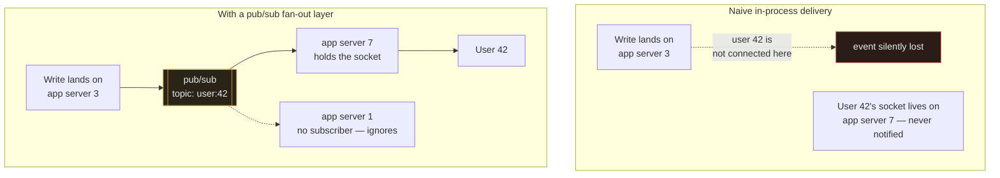

# WebSockets

`[INTERMEDIATE]` · A persistent, full-duplex connection between browser and server. **Most systems
that reach for it needed Server-Sent Events instead — one-way, plain HTTP, reconnects itself, and
about a tenth of the work.**

---

## 1. One-line definition

A protocol that upgrades an HTTP connection into a long-lived, bidirectional, message-oriented
channel where either side may send at any time.

## 2. Explain like I'm new

HTTP has one shape: the client asks, the server answers. The server can never speak first. That is
fine for loading a page and useless for a chat message arriving while you sit still.

There are four ways around it and they form a ladder. You can ask repeatedly — "anything yet? anything
yet?" — which is *polling*, and it is mostly wasted questions. You can ask once and have the server
hold the question open until it has something to say, which is *long polling*. You can ask once and
have the server keep the answer channel open forever, sending updates down it as they occur, which
is *Server-Sent Events*. Or you can convert the connection into a genuine two-way pipe, which is a
*WebSocket*.

**The ladder is ordered by capability and also by cost, and most teams climb further up it than
their problem requires.**

## 3. Real-world analogy

Polling is ringing someone every five minutes to ask if the parcel arrived. Long polling is ringing
and having them keep you on hold until it does. SSE is them ringing *you* when it arrives. A
WebSocket is an open intercom line between the two rooms.

**Where it breaks:** the analogy makes an open intercom sound nearly free — nobody is speaking, so
what could it cost? On a phone line, nothing. On a server, an idle connection still occupies a file
descriptor, kernel socket buffers, TLS state and whatever your application hangs off it, and it
occupies them **whether or not a single byte ever flows**. A million silent intercoms is a serious
capacity problem with zero traffic on it, which the analogy actively conceals. It also hides the
second cost: an intercom survives you rearranging the furniture, while every WebSocket in your fleet
dies the moment you deploy.

## 4. Technical explanation

The comparison table is the point of this page.

| | Polling | Long polling | **SSE** | WebSocket |
|---|---|---|---|---|
| Direction | Client → server | Client → server | **Server → client** | Both |
| Protocol | Plain HTTP | Plain HTTP | Plain HTTP (`text/event-stream`) | Upgrade from HTTP, then its own framing |
| Held connections at 100k clients | ~0 (short requests) | **100k** | **100k** | **100k** |
| Requests/sec at 100k clients | **20,000** (at 5 s interval), ~99% empty | ~3,300 re-establishments (30 s timeout) | ~0 after setup | ~0 after setup |
| Delivery latency | 0 to the poll interval | Near zero | Near zero | Near zero |
| Automatic reconnect | N/A | You build it | **Built in, with `Last-Event-ID` replay** | You build it |
| Message loss on reconnect | N/A | Needs a cursor | **Handled by `Last-Event-ID`** | You build it |
| Proxy / CDN / corporate firewall | Fine everywhere | Fine everywhere | Fine almost everywhere | Upgrade sometimes blocked or stripped |
| Binary payloads | Yes | Yes | **No** — text only | Yes |
| Browser connection limit | N/A | 6 per origin on HTTP/1.1 | 6 per origin on HTTP/1.1 — **gone on HTTP/2** | Separate, higher limit |
| Client complexity | Trivial | Moderate | **Low** | High |
| Server complexity | Trivial | Moderate | Low | High |

**SSE is the underrated row.** It is ordinary HTTP, so every proxy, load balancer and CDN already
handles it; the browser's `EventSource` reconnects on its own with exponential backoff and replays
from the last event ID it saw; and it costs one connection per client, exactly like a WebSocket. If
your requirement is "the server tells the client when something happens" — notifications, live
dashboards, progress bars, feed updates, streamed tokens — **SSE does the job and deletes an entire
category of code you would otherwise write and maintain**: reconnection, backoff, heartbeats,
resume-from-cursor.

Choose a WebSocket when the client genuinely needs to send at high frequency too: collaborative
editing, multiplayer, live cursors, trading. "The client sends occasionally" is not that case — the
client can send over a normal HTTP request while receiving over SSE, and that hybrid is a perfectly
respectable design that most people never consider.

Polling still wins in one situation, and it is more common than its reputation suggests: **when
updates are rare and staleness of a few seconds is acceptable, polling holds no state at all** —
your servers stay stateless, deploys are free, and there is nothing to reconnect.

## 5. Engineering at scale

### A million idle connections is a memory and file-descriptor problem

Not a throughput one. This is the thing people get wrong, because their load test measured messages
per second and the production failure was about connections doing nothing.

| Resource | Per connection | At 1,000,000 connections |
|---|---|---|
| Kernel socket buffers | ~4–64 KB depending on tuning | 4–64 GB |
| TLS session state and record buffers | ~16–50 KB with default settings | 16–50 GB |
| Application per-connection object | Whatever you attached — user, subscriptions, send queue | Usually the biggest term, and always the least measured |
| File descriptor | 1 | **`ulimit -n` must exceed 1M** |
| Conntrack entry (stateful firewall in path) | 1 | Default tables hold ~262k — **this fails long before memory does** |

**Idle connections consume almost no CPU and never release memory.** So the capacity question is not
"how many messages per second" but "how many sockets can one box hold", and the answer is decided by
tuning and by how fat your per-connection object is. Trimming the application-side state per
connection is usually the highest-leverage optimisation available, and nobody profiles it because it
does not appear on a CPU flame graph.

One more limit, on the *other* side of a proxy: connections from a load balancer to a backend are
identified by a four-tuple, so a single proxy can open only ~64k connections to one backend address
and port. Terminating a million WebSockets means multiple backend addresses or ports, not just more
CPU.

### The fan-out problem — the one that forces another component

A user's socket lives on exactly one server. The event that user cares about is produced by some
other server, chosen by a load balancer that knew nothing about sockets.



**Persistent connections make your application tier stateful, and a stateful tier needs a fan-out
bus.** That is the real cost of real-time, and it is almost never in the estimate: you did not add a
WebSocket, you added a WebSocket *and* a [pub/sub layer](../../06-messaging/queues/) with its own
delivery semantics, ordering questions and failure modes.

Sticky routing is the tempting alternative — pin each user to a server so events can be delivered
locally. It works until a server dies, a deploy rolls, or the hot users cluster on one box. Prefer
the bus.

### Deploys drop every connection at once

A rolling restart terminates every socket it touches. A million clients then reconnect — and if
their retry logic has no jitter, they reconnect *together*, producing a self-inflicted
[thundering herd](../../GLOSSARY.md#thundering-herd) that your fleet meets while half of it is still
restarting.

Three mitigations, all required: **jittered exponential backoff in the client**, staged restarts
that shed connections gradually, and enough headroom to absorb the reconnect burst. The
reconnect storm, not the steady state, is what sizes the fleet.

### Heartbeats are not optional

Load balancers and NATs close connections they consider idle — 60 seconds is a common default. A
WebSocket with nothing to say for 60 seconds is idle by that definition and gets cut, and neither
end is told promptly. Send an application-level ping well inside the shortest idle timeout in the
path, and treat a missed pong as a dead connection. Browsers do not expose the protocol's own
ping/pong frames to JavaScript, so this must live in your message layer.

### Backpressure

A slow client that cannot drain its socket while the server keeps producing means an ever-growing
outbound buffer. Unbounded, that is an out-of-memory kill for every other connection on the box.
Bound the per-connection send queue and decide explicitly what happens when it fills: drop the
oldest updates, collapse them into the latest state, or disconnect the client. **Doing nothing is
also a decision, and it is the one that takes the server down.**

## 6. The problem it solves

The server cannot initiate under HTTP. WebSockets give it a channel to push on, and give the client
a cheap way to send small messages frequently without paying request overhead each time.

## 7. The problem it does NOT solve

**A WebSocket does not make your system real-time; it makes the transport real-time.** If the event
takes 400 ms to appear because it goes through a queue and a database, the socket saves you the poll
interval and nothing else.

It also does not deliver reliably. The protocol has no acknowledgements, no replay and no ordering
guarantees across a reconnect — a message sent while the client was disconnected is simply gone
unless you built sequence numbers and a resume protocol. **SSE gives you a resume mechanism for
free; with WebSockets you write it yourself, and most teams discover they needed it after the first
incident.**

And it removes what HTTP gave you: no caching, no intermediary visibility, no per-request
observability, no standard retry semantics. Your traffic becomes opaque to everything between client
and server.

## 9. How it works

The client sends an ordinary HTTP request with `Upgrade: websocket` and a nonce. The server replies
`101 Switching Protocols`. From that point the TCP connection carries WebSocket frames instead of
HTTP messages: small binary headers, text or binary payloads, plus control frames for ping, pong and
close. Over HTTP/2 the same thing happens through extended `CONNECT` and becomes a stream rather
than a whole connection.

The mechanically important consequences:

| Consequence | Why it matters |
|---|---|
| It stops being HTTP after the upgrade | Proxies, CDNs and WAFs stop understanding it; your per-request metrics vanish |
| One connection lives on one server | Forces the fan-out bus in §5 |
| Auth happens once, at upgrade | A token that expires mid-connection needs re-authentication *in* the protocol |
| Either side may close at any time | Reconnection is a first-class part of your design, not error handling |

## 13. When to use it

- **Bidirectional, high-frequency messaging**: collaborative editing, multiplayer, live cursors,
  trading, interactive terminals
- Where per-message overhead genuinely matters, because messages are small and frequent
- Where binary framing matters
- When you have already concluded SSE is insufficient — and can say why in one sentence

## 14. When NOT to

- **One-way server push.** Use SSE. Notifications, dashboards, progress, streamed tokens, feeds —
  all one-way, all simpler, all self-healing.
- Infrequent updates where a few seconds of staleness is fine. **Polling costs you nothing
  architecturally and keeps the tier stateless**, which is worth more than it sounds.
- Before you have somewhere to fan out through. Without a pub/sub layer you will deliver events only
  to whichever server happens to hold the socket, and the bug is intermittent by construction.
- When clients are behind hostile corporate proxies that strip the upgrade. SSE survives; WebSockets
  need a fallback you must then maintain.
- Request/response with a result. That is HTTP, and dressing it up as a message with a correlation
  ID is reinventing HTTP badly.

## 17. Trade-offs

| Choose | Get | Pay |
|---|---|---|
| Polling | Stateless servers, trivial code, free deploys | Wasted requests; staleness up to the interval |
| Long polling | Near-zero latency on plain HTTP | Held connections *and* re-establishment churn; cursor logic |
| **SSE** | Server push, auto-reconnect, resume, plain HTTP | One-way, text only, one connection per client |
| WebSocket | Full duplex, low per-message overhead, binary | Stateful tier, custom reconnect, heartbeats, no caching, fan-out bus |
| Sticky routing | Local delivery, no bus | Breaks on deploys and failures; hot-spotting |
| Pub/sub fan-out | Delivery regardless of which server holds the socket | Another component, another set of delivery semantics |

## 18. Why not?

| Alternative | Why not here | When it WOULD win |
|---|---|---|
| **SSE** | One-way and text only | **The default for push.** Any time the client does not need a high-rate upstream channel. |
| **Long polling** | Held connections plus reconnect churn — the costs of both models | Legacy clients, or environments where nothing else survives the network |
| **Polling** | Wasted requests, latency bounded by the interval | Rare updates, seconds of staleness acceptable, and statelessness is worth protecting |
| **HTTP/2 or /3 streaming** | Less browser-ergonomic than `EventSource` | Server-to-server streaming, gRPC streams |
| **A queue to the client** (MQTT etc.) | Extra infrastructure and a second protocol | IoT, unreliable networks, offline devices needing durable per-device queues |
| **Do nothing — poll every 30 s** | Nothing, if the product tolerates it | More often than teams admit. **Ask what latency the feature actually requires before choosing a transport.** |

## 19. Failure scenarios

| Failure | What happens | Mitigation |
|---|---|---|
| **Deploy or rolling restart** | Every connection drops; all clients reconnect at once | Jittered backoff, staged restarts, headroom for the burst |
| **Reconnect storm with no jitter** | Synchronised retries repeatedly knock over the fleet as it recovers | Exponential backoff **plus jitter** — jitter is the part that matters |
| **File descriptor / conntrack exhaustion** | New connections refused while existing ones look healthy | Raise limits deliberately; alert on utilisation, not just failure |
| **Slow consumer** | Outbound buffer grows unbounded; the process is OOM-killed and takes every other connection with it | Bounded send queue with an explicit drop or disconnect policy |
| **Idle timeout in a proxy** | Connection cut silently; client believes it is connected and receives nothing | Heartbeat inside the shortest idle timeout in the path |
| **Missed messages during reconnect** | Silent data loss — the user sees a gap and you see nothing | Sequence numbers and resume-from-cursor; SSE gives this via `Last-Event-ID` |
| **Events delivered to the wrong server** | Intermittent non-delivery that is impossible to reproduce | Pub/sub fan-out rather than in-process delivery |
| **Auth token expires mid-connection** | Connection stays open with stale authorisation — a security problem, not an availability one | Re-authenticate in-protocol; bound connection lifetime |
| **Hot shard of users on one node** | One box at capacity while the fleet idles | Balance on connection count, not request rate |

**The reconnect storm is the one that turns a small incident into a long one.** A brief blip
disconnects everybody, everybody retries together, the retry wave prevents recovery, and the outage
lasts as long as the synchronisation does.

## 25. Without it → With it → New problem → Next

```
Without it   →  the server cannot initiate, so clients poll — wasted requests, and latency
                bounded by the poll interval
With it      →  events reach the client the moment they happen, at near-zero per-message cost
New problem  →  the application tier is stateful: a million idle sockets cost memory and file
                descriptors, deploys drop every connection, and an event produced on one server
                cannot reach a socket held by another
Next         →  a pub/sub fan-out bus, jittered reconnect with resume, bounded send queues —
                and capacity planned for the reconnect storm rather than the steady state
```

Read that chain before choosing the transport, because it prices the whole decision rather than the
handshake. Half of it disappears if SSE is sufficient. See
[the chain](../../SYSTEM-DESIGN-THINKING.md#part-1--the-chain).

## 28. Common mistakes

| Mistake | Why it is wrong |
|---|---|
| WebSockets for one-way push | SSE is simpler, self-healing and resumes on its own |
| Load-testing throughput, not connection count | The real limit is idle sockets, and it never appears in a throughput test |
| No jitter on reconnect | Turns a blip into a synchronised herd that prevents recovery |
| No heartbeat | Proxies cut idle connections and the client never notices |
| Unbounded send buffers | One slow client OOM-kills every connection on the box |
| In-process delivery with no fan-out bus | Works on one server, fails intermittently on two |
| Sticky sessions instead of pub/sub | Breaks precisely when a server is lost, which is when it was needed |
| No resume protocol | Messages during a reconnect vanish silently |
| Ignoring auth expiry on long connections | Connections outlive their authorisation |
| Assuming idle connections are free | They are the entire capacity model |

## 29. Monitoring

**Connection count is the primary SLI** — current, peak, and against your descriptor and conntrack
limits, not against CPU. Then connection *churn*: a rising establish/close rate with flat user
numbers means something in the path is cutting connections and clients are papering over it.

Track per-connection send-queue depth (the leading indicator of the OOM in §19), message delivery
lag from event production to client receipt — which is the number users actually experience, and
which no server-side metric shows — reconnect rate after deploys, and memory per connection so you
notice the day someone attaches a large object to it. See
[observability](../../11-observability/).

## 31. Exercises

**1.** A team benchmarks their WebSocket service at 50,000 messages/sec on one box and sizes the
fleet from that number. In production the same box falls over at 80,000 connected users sending
almost nothing. Why did the benchmark mislead them?

<details><summary>Answer</summary>

They measured the wrong axis. A throughput benchmark opens a modest number of connections and pushes
messages hard, so it exercises CPU, serialisation and the network — and it says nothing whatsoever
about the cost of a connection that exists and is silent. Production has the opposite shape: many
connections, almost no traffic.

The binding constraint for idle connections is memory and file descriptors. Each one holds kernel
socket buffers, TLS state and whatever application object was attached, none of which is released
while the connection lives, and none of which shows up in a messages-per-second figure. On top of
that, a stateful firewall's conntrack table or the process's `ulimit -n` will often refuse new
connections long before memory runs out — a hard cliff rather than a gradual degradation, which is
why it presents as "fell over" rather than "got slow". **The correct benchmark holds a million idle
connections and measures resident memory and descriptor use**; the message rate test is a separate
experiment answering a separate question.
</details>

**2.** You need to show live order status to customers. Updates arrive a handful of times per order,
seconds apart. A colleague has written a WebSocket design with sticky sessions and a Redis pub/sub
layer. Argue for something simpler, and say what you would lose.

<details><summary>Answer</summary>

The requirement is one-way — the server tells the client, the client never pushes — so SSE covers it
with a single `EventSource` on the browser side and an ordinary HTTP handler on the server. That
deletes the reconnection logic, the backoff, the heartbeat and the resume protocol, because
`EventSource` reconnects itself and replays from `Last-Event-ID`. It also keeps the traffic as plain
HTTP, so your proxies, WAF and per-request metrics keep working.

The sticky sessions should go regardless of transport: they are the fragile part of the design,
since they break exactly when a server fails or a deploy rolls, and the pub/sub layer already makes
them unnecessary — that is what it is for. Keep the pub/sub; drop the stickiness.

What you lose: binary frames (irrelevant for order status), a client-to-server channel (the client
can use a normal HTTP request when it needs one), and, on HTTP/1.1 clients, the browser's six
connections per origin becomes a real limit if you open several streams — HTTP/2 removes it. **The
honest version of this argument names what SSE cannot do; if none of those things is required, the
WebSocket is unpaid complexity.**

Worth noting for completeness: with updates a handful of times per order, seconds apart, polling
every few seconds would also satisfy the product requirement and keep the tier stateless. It is
worth pricing before committing to held connections at all.
</details>

**3.** After a 20-second network blip, your service takes 15 minutes to recover even though the
network healed immediately. Connection count graphs show a sawtooth. What is happening, and what is
the single most important fix?

<details><summary>Answer</summary>

A reconnect storm. The blip disconnected every client at effectively the same instant, so every
client began retrying at the same instant. If the retry schedule is identical across clients — even
a "good" exponential backoff of 1 s, 2 s, 4 s, 8 s — they all wake together, and the fleet receives
its entire connection load as a series of synchronised spikes. Each spike overwhelms accept queues
and TLS handshake capacity, connections fail, clients back off together, and the pattern repeats:
that is the sawtooth.

The single most important fix is **jitter**. Exponential backoff alone preserves the
synchronisation; randomising each delay spreads the same clients across the window and converts the
spikes into a smooth ramp. It is a two-line client change and it is the difference between 15
minutes and 30 seconds.

Supporting fixes worth having: cap the reconnect rate at the server and shed politely rather than
failing hard, size the fleet for reconnect burst rather than steady state, and stagger deploys so
you never create the storm deliberately. But note where the fix lives — **in the client**, which is
the part you may not be able to update quickly, which is why it has to be right before you need it.
</details>

**4.** Your WebSocket service runs on 10 servers behind a load balancer. Users report that
notifications work "sometimes". Message volume is low and no errors are logged. What is the most
likely cause, and why does the intermittency have a suspiciously specific rate?

<details><summary>Answer</summary>

Events are being delivered in-process rather than through a fan-out bus. When a notification is
produced, it is handed to whichever server is processing that request, and that server can only push
to sockets it holds itself. If the user's socket happens to be on the same server, the notification
arrives; otherwise it is dropped, and since nothing failed, nothing is logged.

The rate is the giveaway. With 10 servers and roughly even distribution, the chance that the
producing server also holds the target socket is about 1 in 10 — so users see roughly 10% of their
notifications. **A success rate that closely matches `1/N` for your server count is a fan-out bug
until proven otherwise**, and it is one of the few bugs whose symptom names its own cause. It also
explains why it never appeared in staging: on a single server the hit rate is 100%.

The fix is a pub/sub layer that every server subscribes to, so the event reaches the server holding
the socket regardless of where it was produced. Sticky routing would also mask it, but it fails
whenever a server is lost, which is the case the design has to survive.
</details>

## 33. Related

- [Networking index](../README.md) — where this sits relative to the rest of the stack
- [HTTP](../http/) — read first; WebSockets exist because of its request/response shape
- [TCP / UDP](../tcp-udp/) — the connection you are holding open, and what it costs
- [TLS](../tls/) — per-connection state is a large part of the memory bill
- [Queues](../../06-messaging/queues/) — the fan-out bus persistent connections force on you
- [Load balancing](../../03-load-balancing/fundamentals/) — idle timeouts, stickiness, and why to avoid it
- [Observability](../../11-observability/) — connection count is the SLI, not request rate
- [Glossary: thundering herd](../../GLOSSARY.md#thundering-herd) · [backpressure](../../GLOSSARY.md#backpressure)
