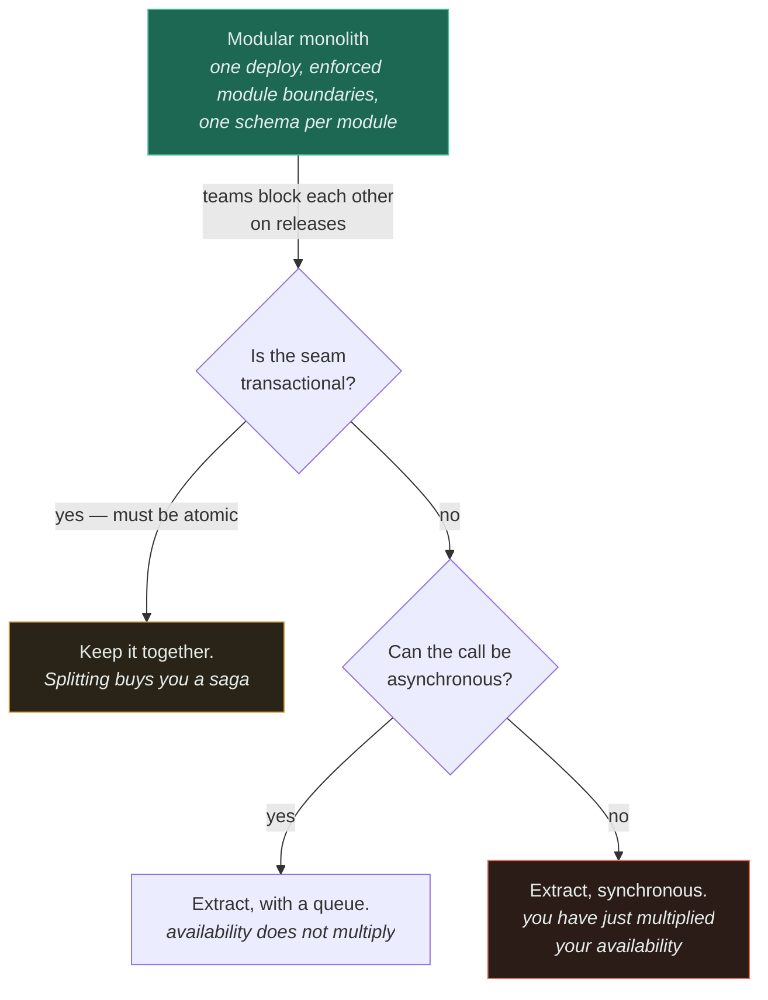

# Monolith vs Microservices ★

`[INTERMEDIATE]` · **Start with a modular monolith.** Microservices are an organisational solution to a team-scaling problem — not a technical solution to a performance problem — and the most common outcome of adopting them early is a distributed monolith, which is worse than either.

---

## 1. One-line definition

A **monolith** deploys the whole application as one unit; **microservices** deploy independently
owned pieces of it separately, communicating over a network — trading in-process calls, shared
transactions and a single deploy for independent release, independent scaling and independent
failure.

## 2. Explain like I'm new

One building versus a street of separate buildings.

In one building, everyone is in the same room. Passing a message is turning your head. Nobody needs
an address, a postal service, or a plan for what happens when the post does not arrive. But everyone
has to leave when the building is repainted, and if one person sets a fire, everyone is affected.

On a street, each team has its own building. They can repaint whenever they like without asking
anyone. In exchange, every conversation is now a letter: it takes vastly longer, it can be lost, it
can be delivered twice, it can arrive out of order, and it can be answered by someone who has since
moved out. **Nothing about separate buildings makes the work faster.** It makes teams independent,
which is a completely different benefit and one you only need once there are enough teams to get in
each other's way.

Almost every team that regrets its architecture built the street before there were enough people to
fill one building.

## 3. Real-world analogy

A restaurant kitchen with one head chef and one bill, versus a food court with a dozen independent
stalls.

**Where it breaks:** the food court analogy makes independence sound clean, because in a food court
nobody's dish depends on another stall finishing first. Real services are not like that — your order
service calls inventory, which calls pricing, which calls the tax service, and if any one of them is
slow *your customer waits for all of them*. The analogy hides the two properties that actually
define distributed systems: **availability multiplies down a synchronous chain**, and any stall can
fail halfway through your order leaving you with no way to undo the part that succeeded. A food court
has no partial failure. Your architecture does.

## 4. Technical explanation

The comparison is usually framed as monolith versus microservices, which is a false pair. There are
three real options and the middle one is the answer most of the time.

| | **Ball of mud** | **Modular monolith** | **Microservices** |
|---|---|---|---|
| Deploy units | 1 | 1 | Many |
| Module boundary enforced by | Nothing | Compiler, package visibility, architecture tests | The network |
| Cross-module call | Any function, any table | A published in-process interface | RPC |
| Data ownership | Everything reads everything | One schema per module; no cross-module table access | One store per service, private |
| Transaction across modules | Yes | **Yes, trivially** | **No** — sagas and compensation |
| Cost of a wrong boundary | A rewrite | A refactor | A migration and a data split |
| Team independence | None | Low | High |
| Failure of one module | Whole process | Whole process | Contained *if* the boundary is async |
| Debugging one request | A stack trace | A stack trace | Distributed tracing, or nothing |

**The modular monolith is the default and it is not a compromise.** It gets you enforced boundaries,
one deploy, one place to look when something breaks, and — the row that matters most — transactions
that still work. It is what you should build until you can name the specific constraint that breaks
it, and the constraint is almost always about *teams*, not about load.

The critical misunderstanding this table is meant to kill: **"monolith" does not mean "unstructured".**
When people describe escaping a monolith, what they are usually escaping is column one — no
boundaries, everything coupled to everything, a change anywhere risking a break anywhere. Microservices
appear to fix that because the network forces boundaries you were unwilling to enforce yourself. But
enforcing boundaries is available in column two for free, at compile time, with no partial failure
and no distributed transaction. **If you cannot maintain module boundaries in one process, you will
not maintain them across a network — you will just have the same tangle with worse latency and no
stack traces.**

### What microservices actually buy

One thing, and everything else follows from it: **the independent deploy**. A team can ship without
coordinating with any other team. That is genuinely valuable, and it is an organisational value, not
a technical one.

Everything else on the usual list is either downstream of that or is available more cheaply:

| Claimed benefit | Honest assessment |
|---|---|
| Independent deployment | **Real, and the only reason that survives scrutiny** |
| Independent scaling | Real, but only when the profiles genuinely diverge — and a monolith scales horizontally too |
| Fault isolation | Real **only across an asynchronous boundary**. Synchronous calls propagate failure, they do not contain it |
| Technology diversity | Real, and usually a liability — five languages means five toolchains, five CVE feeds, five sets of expertise |
| Smaller, comprehensible codebases | Available in a modular monolith at no cost |
| Easier onboarding | Frequently the opposite — a new engineer must now understand the network topology as well as the code |
| Better performance | **False.** You replaced function calls with network calls |
| Easier to reason about | **False.** You replaced a stack trace with a distributed trace, and a transaction with a saga |

## 5. Engineering at scale

### Availability multiplies, and this is the number that ends most arguments

Every synchronous dependency in a request path multiplies into your availability. Not averages —
multiplies.

| Synchronous services in the request path | Each at 99.9% | Effective availability | Downtime per year |
|---|---|---|---|
| 1 | 99.9% | 99.9% | 8.8 hours |
| 3 | 99.9% | 99.7% | 26 hours |
| 5 | 99.9% | 99.5% | 44 hours |
| **10** | 99.9% | **99.0%** | **3.7 days** |
| 20 | 99.9% | 98.0% | 7.3 days |

**Ten services that are each individually excellent give you an application that is not.** Nobody is
at fault; no team missed its SLO; the architecture did this on its own. And the number is optimistic,
because it assumes independent failures and ignores the deploys, the retry storms, and the shared
database underneath all ten.

Three things break the multiplication, and only these three:

1. **Make the hop asynchronous.** A [queue](../../06-messaging/queues/) between two services means
   the caller does not need the callee to be up right now. This is the single most effective
   availability intervention in a service architecture — and it is why "event-driven" and
   "microservices" so often appear together. It is not a style preference; it is the arithmetic.
2. **Make the dependency optional.** Serve a degraded response when recommendations are down. A
   dependency you can fall back from is not in the multiplication.
3. **Cache the dependency's answers** so a brief outage is invisible — see
   [caching](../../04-caching/fundamentals/), and note you have now bought staleness.

Everything else — retries, circuit breakers, bulkheads — limits the *blast radius* of a failure. It
does not remove the term from the product. See [availability](../../00-foundations/availability/)
for the full arithmetic.

### Team size is an architectural constraint

This is the part treated as a soft consideration and it is not; it is as hard a limit as memory.

| Engineers | Services they can actually operate | Why |
|---|---|---|
| 1–3 | **1** | One on-call rotation. Every service needs a pipeline, dashboards, alerts, dependency upgrades, a runbook |
| 4–8 | 1–2 | A modular monolith with enforced internal boundaries |
| 8–25 | 2–5 | Split exactly where teams block each other, nowhere else |
| 25–100 | Roughly one per team | Deploy coupling is now the dominant cost |
| 100+ | Many | The regime microservices were invented in, by companies in it |

**Three people cannot operate twelve services.** Not "should not" — cannot. Each service carries a
standing tax that does not shrink with the service: a repository, a build pipeline, a deployment, a
runtime to patch, dashboards, alerts that someone tuned, a dependency-upgrade cadence, a security
patch cadence, a place in the local development setup, and a slot in somebody's head. Twelve of those
across three people means each person is nominally responsible for four services they touch once a
quarter, which in practice means nobody knows how any of them work when one breaks at 2am.

The [system design method](../../SYSTEM-DESIGN-THINKING.md) lists constraints as step 5 for this
reason: a design that ignores team size is a fantasy, however good the boxes look.

### Conway's Law is not a curiosity

> Organisations design systems that mirror their own communication structures.

The practical form: **you cannot sustain a service boundary that cuts across a team boundary.** If
two teams must talk daily to ship a feature, the code between them will fuse regardless of how many
repositories it lives in — because the path of least resistance for two people under deadline is to
add the field, share the table, call the internal endpoint. Repository boundaries are a suggestion;
team boundaries are a physical fact.

Two consequences worth internalising:

- **Adopting microservices without reorganising is a rename.** You will get the same coupling, now
  over HTTP, plus latency and partial failure. This is the most common way a distributed monolith is
  built, and it is built by well-meaning people following a diagram.
- **The inverse Conway manoeuvre works**: change the team structure first, let the architecture
  follow. If you want an independent payments service, you first need an independent payments team
  that owns it end to end — build, deploy, on-call, roadmap. Without that ownership you have created
  a shared library with network latency.

### Latency: six orders of magnitude, per hop

An in-process function call is measured in nanoseconds. A same-datacentre service call — serialise,
TLS, network, deserialise, and the callee's own work — is measured in milliseconds. That ratio is
roughly a million, and it is the same physics discussed in
[latency](../../00-foundations/latency/#11-the-numbers-that-shape-architecture).

The consequence is not that microservices are "slow" — a millisecond is fine. It is that a call which
was free is now expensive, so the *shape* of your code matters in a way it did not. A loop that
called a module function a thousand times per request was invisible; the same loop across a service
boundary is a thousand round trips and a support ticket. Chatty in-process code becomes an outage
when you split it, and it is very hard to know in advance which code is chatty, because nobody ever
had a reason to measure it.

**The tail is worse than the average.** A request touching ten services hits *someone's* p99 nearly
every time — that is what tail-at-scale means, and it is why p99 latency usually gets worse after a
split even when every individual service is fast.

### The distributed monolith

The failure mode, and it is the normal outcome rather than an exotic one.

| Symptom | What it actually means |
|---|---|
| Services must be released together | You have a monolith's coupling with none of its convenience |
| One feature touches four repositories | Your boundaries do not match how the system changes |
| Services share a database schema | There is no boundary — there is a naming convention |
| You cannot run or test one service alone | The boundary exists on the deployment diagram and nowhere else |
| One service down takes everything down | Synchronous coupling with no fallback |
| Release order matters and is written down somewhere | Deployment is now a distributed transaction, performed by humans |
| Teams coordinate every release in a chat channel | Conway's Law reporting the truth about your org |

**A distributed monolith is worse than a monolith on every axis.** You kept every coupling and added
the network: partial failure, latency, no transactions, no stack traces, and a deploy that is now a
multi-party negotiation. There is no benefit column. If you recognise three or more rows in that
table, the correct response is usually to *merge services back together*, which nobody wants to do
and which is almost always right.

The diagnostic that cuts through the debate, and it is measurable: **how many services must be
released together for a typical feature?** If the answer is greater than one, you do not have
microservices. Chart it monthly.

## 6. The problem it solves

**Microservices solve teams blocking each other.** Concretely: a shared release train where one
team's bug delays everyone; a codebase where merge conflicts and test-suite runtime scale with
headcount; a deploy that requires sign-off from five teams; a change that cannot ship because an
unrelated part of the same artefact is unstable. Those are real, expensive, and they get worse
super-linearly with the number of engineers.

Secondarily, and only where the profiles genuinely diverge: independent scaling (video transcoding
wants a hundred CPU-bound machines; the API that triggers it wants four), independent availability
targets (checkout must be up when recommendations are not), and hard isolation for regulatory or
data-residency reasons.

**A modular monolith solves everything else on the usual list** — comprehensible modules, enforced
boundaries, clear ownership, independent reasoning — without paying for any of it with the network.

## 7. The problem it does NOT solve

**Microservices do not make anything faster.** They add a network hop to calls that were free. Every
performance benefit attributed to them is really horizontal scaling, which a monolith also does — you
run twenty copies behind a [load balancer](../../03-load-balancing/fundamentals/) exactly the same
way. If your system is slow, the fix is in [profiling, indexes, caching and
queries](../../05-databases/fundamentals/#20-scaling--in-order), and splitting the process will make
each of those harder to find.

They also do not solve:

- **A bad domain model.** Wrong boundaries in one process are a refactor; wrong boundaries across
  services are a data migration, a dual-write period, and a quarter.
- **Poor code quality.** You now have the same code in more repositories, with less shared review.
- **Unclear ownership.** Ownership is an organisational fact. Splitting the code does not create it,
  and a service with no owner is worse than a module with no owner.
- **Scaling the database.** Ten services over one Postgres instance have one bottleneck and ten ways
  to reach it. Splitting the data is the actual work, and it is the part that makes the split
  irreversible.
- **Coupling.** It relocates coupling from the compiler, where it is visible and checkable, to the
  network, where it is invisible until runtime.

---

## 9. How it works — where the line goes

The protocol is the cheap decision (see [API design](../../07-api-design/)); **the boundary is the
expensive one**, and there is one test that outperforms the rest:

> **If two operations must be atomic, they belong in the same service.**

Splitting an invariant across services means choosing a [saga](../../13-design-patterns/CATALOGUE.md)
— a sequence of local transactions with explicit compensating actions for every failure point — plus
eventual consistency, plus reconciliation, forever. That is sometimes correct. It is never cheap, and
it is frequently chosen by accident, in an afternoon, by someone drawing boxes around nouns.

Boundary heuristics, ranked by how well they hold up:

| Heuristic | Verdict |
|---|---|
| **Transactional boundary** — what must be atomic | **Best.** Checkable against code you already have |
| **Team ownership** — one team owns it end to end | **Second best.** Conway's Law means this one enforces itself |
| **Rate of change** — parts that change together, stay together | Strong. Measurable from your commit history |
| **Data ownership** — one writer per dataset | Strong, and the hardest to retrofit |
| Bounded context (DDD) | Good in principle; in practice people disagree about where contexts end |
| Scaling profile | Valid only where profiles genuinely diverge, which is rarer than assumed |
| **One service per noun** (`User`, `Order`, `Product`) | **The classic mistake.** Guarantees chatty synchronous fan-out and split invariants |
| One service per developer | Not a heuristic, an anti-pattern with a headcount |



The red leaf is not forbidden — plenty of correct architectures have synchronous service calls. It is
marked because it is the branch where you must *say out loud* what you just did to your availability
number, and because it is the branch people take without noticing there was a decision.

### Extracting a service

When the split is genuinely warranted, the order matters:

1. **Enforce the module boundary in the monolith first.** If you cannot stop code reaching across the
   seam in one process, extraction will not help — it will just convert compile errors into runtime
   errors.
2. **Extract the least-coupled module first**, not the most painful one. The first extraction is how
   the team learns what a service costs — pipelines, dashboards, on-call, tracing, deploy. Learn that
   on something cheap.
3. **Split the data, and accept that this is the project.** Moving the code is perhaps 20% of the
   work; separating the schema, removing cross-module joins, deciding who owns each row and handling
   the dual-write period is the other 80%. This is also the step that makes the split irreversible.
4. **[Strangler fig](../../13-design-patterns/CATALOGUE.md)** — route a slice of traffic to the new
   service behind a facade, keeping the old path live until the new one is proven. Never a big-bang
   cutover.
5. **Stop when the pain stops.** There is no target number of services. Three well-chosen services
   beat thirty, permanently.

## 13. When to use it

**Stay with a modular monolith when:** the team is under roughly 20–30 engineers; the domain is still
moving (boundaries you draw now will be wrong, and being wrong inside one process is a refactor);
deploys are not blocking anyone; nobody is on call for anything yet; you cannot yet name which two
teams are colliding.

**Split when you can name the specific constraint**, and it is one of these:

- **Teams are blocking each other on releases**, measurably and repeatedly. The primary reason.
- **A genuinely divergent scaling profile** where the divergent part is separable — transcoding,
  ML inference, a crawler.
- **A genuinely divergent availability requirement** — the part that must stay up when the rest is
  down, with an asynchronous or fallback-able boundary.
- **Regulatory or data-residency isolation** that the law requires and a module cannot provide.
- **An acquired or legacy system** with its own lifecycle, which was never going to be one deploy.
- **A genuine polyglot need** — a model that must run in Python inside a JVM shop.

Note how many of those are about organisations, contracts and legislation rather than about
computers. That is the point of the page.

## 14. When NOT to

- **Because it is the modern way.** Not a constraint. Not an argument.
- **For performance.** You are adding network hops to remove function calls.
- **With a small team.** Three people cannot operate twelve services, and pretending otherwise
  produces twelve unowned services.
- **Before the domain is stable.** You will draw the boundaries in the wrong places and then have to
  move data across them.
- **When the split is synchronous and mandatory** — you have multiplied your availability and gained
  a deploy convenience for it.
- **When the services will share a database.** That is not a boundary; it is a naming convention with
  extra latency, and it makes the eventual real split harder.
- **To force teams to define interfaces.** Do that in the monolith, where a violation is a build
  failure instead of an incident.
- **To rescue a codebase nobody understands.** You will end up with several services nobody
  understands, plus the network between them.

## 17. Trade-offs

| Choose | Get | Pay |
|---|---|---|
| Monolith (modular) | One deploy, real transactions, stack traces, trivial local dev | Teams share a release; one bad module can take the process down |
| Microservices | Independent deploys; team autonomy; per-service scaling | Availability multiplies; no cross-service transactions; tracing mandatory; N pipelines and N rotations |
| Synchronous service calls | Simple mental model; immediate consistency at the boundary | **Availability multiplies**; failures cascade; latency adds down the chain |
| Asynchronous boundaries | Availability stops multiplying; natural backpressure | Eventual consistency; ordering and duplicate handling; harder debugging |
| Shared database between services | Easy to start; joins still work | **Not a boundary.** No independent schema change; the worst of both models |
| Database per service | A real boundary; independent evolution | No joins; duplicated data; eventual consistency; reporting becomes its own problem |
| One service per team | Ownership matches the code; Conway's Law is on your side | Requires enough teams to be a meaningful statement |
| Many small services | Fine-grained deploys | The per-service tax multiplied by the count, paid forever |

**Fill in the Pay column first.** The most useful reading of this table is that microservices' costs
are all *recurring* — an on-call rotation, a pipeline, a dashboard set, per service, per year — while
the monolith's costs are mostly *friction*, which is visible daily and therefore over-weighted in
decision-making. Teams routinely trade an acute, visible pain for a chronic, invisible one and call
it progress.

## 18. Why not?

| Alternative | Why not here | When it WOULD win |
|---|---|---|
| **Modular monolith** | Teams still share a release train | **The default. Needs no justification.** Under ~25 engineers, or a domain still in motion |
| Ball-of-mud monolith | No boundaries; every change risks everything | Never deliberately. It is what a monolith becomes without enforcement |
| Microservices | Availability multiplies; per-service tax; no transactions | Many teams blocking each other; genuinely divergent scaling or availability needs |
| **Distributed monolith** | Every cost, no benefit | **Never.** It is an outcome, not a choice — and the most common one |
| Service-oriented architecture (coarse services) | Unfashionable; fuzzy boundaries | **Underrated.** Three to five substantial services often beats thirty small ones |
| Modular monolith + a few extracted services | Two operating models at once | **Extremely common and usually right.** Extract only what has earned it |
| Serverless functions | Extreme granularity; cold starts; even more moving parts | Spiky, isolated, stateless workloads — image processing, webhooks |
| [Cell-based architecture](../../13-design-patterns/CATALOGUE.md) | Duplicates the whole stack per cell | Blast-radius isolation at very large scale, without fine-grained decomposition |

The sixth row is where most healthy systems actually live and it is rarely named as an option: a
substantial modular monolith, plus two or three services that were extracted because something
specific demanded it. **You do not have to pick a side; you have to justify each line you draw.**

## 19. Failure scenarios

| Failure | Monolith | Microservices |
|---|---|---|
| A module leaks memory | The process dies; everything is down; obvious in one place | One service dies; every caller must degrade or fail — and most will not have been written to |
| **A dependency gets slow (not down)** | Thread pool exhausts; the whole app stalls | Every caller's pool exhausts, then *their* callers' — **cascading failure**. Needs timeouts, bulkheads, breakers on every hop |
| Bad deploy | One rollback | N rollbacks, possibly in a specific order, while the system is in a mixed-version state |
| Schema migration | One coordinated change | Expand-contract across independently deployed consumers you do not control |
| Network partition between modules | Impossible | Possible between **every pair** — and the [CAP](../../00-foundations/cap-theorem/) choice becomes yours to make explicitly |
| Debugging a slow request | A stack trace and a profiler | Distributed tracing, or guesswork |
| A retry storm | Bounded by one process | Amplifies at each hop: 3 retries × 3 hops = 27× load on the deepest service |
| Partial failure mid-operation | Transaction rolls back | Some steps committed, some not — **compensation is now your code** |
| One team's bug | Blocks everyone's release | Contained — the actual benefit, and this row is the whole case |
| Shared database saturates | One bottleneck, one place to look | One bottleneck, ten services blaming each other |

**The second row is the one that produces multi-hour outages.** Slow is worse than down: a dead
dependency fails fast and callers route around it, while a dependency at five-second latency holds
every thread that touches it and takes down services that do not even depend on it. In a monolith
this is bad; in a service graph it is how one slow database query becomes a company-wide incident.
Every synchronous call needs a timeout shorter than the caller's own, and that budget must be
propagated. See [reliability](../../00-foundations/reliability/).

The retry-storm row deserves its arithmetic too: retries compose multiplicatively down a chain, so
three hops each retrying three times means the deepest service sees up to 27 times the load —
arriving precisely when it is already struggling. Retry budgets, not retry counts.

---

## 25. Without it → With it → New problem → Next

```
Without it   →  every team ships from one artefact; releases queue behind each
                other, one team's bug blocks everyone, and the test suite and
                merge-conflict rate grow with headcount
With it      →  teams deploy independently; ownership is real; genuinely divergent
                workloads scale separately
New problem  →  availability now multiplies across every synchronous hop, there are
                no cross-service transactions, a request has no stack trace, and
                every service carries a permanent operational tax
Next         →  asynchronous boundaries and queues to stop the multiplication;
                sagas and idempotency for what used to be one transaction;
                distributed tracing, which stops being optional; timeouts, circuit
                breakers and retry budgets on every hop
```

Read that block in reverse and it is a warning: if you are not prepared to build the "Next" line, do
not take the "With it" line. See [the chain](../../SYSTEM-DESIGN-THINKING.md#part-1--the-chain).

## 28. Common mistakes

| Mistake | Why it is wrong |
|---|---|
| Microservices for performance | You replaced function calls with network calls. Horizontal scaling was always available |
| Starting with microservices on a new product | The boundaries are wrong because the domain is not known yet — and now they are data migrations |
| Splitting by noun (`User`, `Order`, `Product`) | Guarantees chatty synchronous fan-out and invariants split across services |
| Services sharing a database | Not a boundary. No independent schema change, and the real split gets harder |
| Ignoring the availability product | Ten 99.9% services in series is 99% — 3.65 days a year, from components nobody would call unhealthy |
| Synchronous calls everywhere | Every hop multiplies availability and adds to p99 |
| No timeout on a service call | One slow dependency exhausts thread pools system-wide |
| Retries without a budget | 3 retries × 3 hops = 27× load on the service already failing |
| Splitting without reorganising teams | Conway's Law wins; you get the same coupling over HTTP |
| More services than engineers | Nobody knows how any of them work when one breaks at 2am |
| Distributed transactions via two-phase commit | Blocking, brittle, and it makes availability worse; use sagas or do not split |
| No distributed tracing before the first split | You have removed your ability to debug and not replaced it |
| Believing "monolith" means "no structure" | The modular monolith gets you boundaries without the network |
| Never merging services back | Recognising a wrong boundary and undoing it is a sign of competence, not failure |

## 29. Monitoring

**Distributed tracing is not optional after the first split.** It is the replacement for the stack
trace you gave up, and it must exist *before* the split, not after the first incident — see
[observability](../../11-observability/).

Beyond the usual per-service golden signals, four measurements are specific to this decision and
almost nobody collects them:

| Measurement | What it tells you |
|---|---|
| **Services released together per feature** | If > 1, you have a distributed monolith. The single best architectural health metric |
| **Synchronous dependencies in the p99 request path** | Your availability product, measured rather than assumed |
| Service dependency graph, generated from traces | The architecture as it *is*, which is never the architecture on the diagram |
| Cross-service saga completion and compensation rate | How often the thing that replaced your transaction is failing |

Also worth tracking: per-service error budget consumption (so the availability product is somebody's
explicit problem, not an emergent surprise), and deploy frequency per team — because if it has not
risen since the split, you paid for independent deployment and did not receive it.

## 31. Exercises

1. A team of six runs a modular monolith at 99.9% availability. They split it into eight synchronous
   services, each of which also achieves 99.9%. Availability drops and nobody can explain it, because
   every service is meeting its SLO. Explain it, and give the two changes with the largest effect.

<details><summary>Answer</summary>

Availability multiplies across synchronous dependencies. Eight services at 99.9% in a request path
give roughly 0.999⁸ ≈ 99.2%, or about 70 hours of downtime a year against the 8.8 hours they had.
Every service is meeting its SLO and the application is down roughly eight times as long, because nobody
owns the product of the terms. In reality it is worse than 99.2%: failures are correlated through the
shared database and shared deploy tooling, retries amplify load down the chain, and the split added
eight new deploy surfaces — and deploys, not hardware, cause most outages.

The two highest-leverage changes: **make hops asynchronous** wherever the caller does not need the
answer to respond — a [queue](../../06-messaging/queues/) removes the term from the product entirely,
because the caller no longer requires the callee to be up. And **make dependencies optional**, with a
fallback or a cached last-known-good answer, so a failure degrades the response instead of failing
it. Timeouts and circuit breakers are necessary but they only bound the blast radius; they do not
remove the multiplication.

The uncomfortable third option that should be on the table: with six engineers and eight services,
merging several back together is very likely the correct engineering decision.
</details>

2. Your services each have their own repository and their own pipeline, but shipping a feature
   requires releasing four of them in a specific order. Someone proposes adding a release-orchestration
   tool. What would you say?

<details><summary>Answer</summary>

That the tool would automate the symptom and entrench the disease. Ordered multi-service releases are
the defining property of a **distributed monolith**: you have the coupling of a single deployable and
the failure modes of a distributed one. A release orchestrator makes that state comfortable, which
means it will never be fixed — and it adds a new component whose failure blocks all deploys.

Diagnose first. If four services must change together for a typical feature, the boundaries do not
match how the system actually changes. Look at commit history: which files change in the same commit,
consistently? Those belong together. Very often the honest answer is that three of the four should be
merged back into one service, or into the monolith they came from, and undoing a wrong boundary is a
sign of competence rather than failure.

Where a split is genuinely right and ordering still bites, the fix is compatibility, not
orchestration: make every change backwards compatible so that release order stops mattering. That is
expand-contract, applied to service interfaces — add the new field, deploy consumers that tolerate
both, then remove the old, with each step independently deployable. See
[versioning](../../07-api-design/versioning/). Note that you need this anyway, because during any
rolling deploy two versions are live simultaneously whether you planned for it or not.
</details>

3. A five-person startup is designing a new product. The CTO wants microservices "so we can scale
   later". Give the strongest version of that argument, then respond to it.

<details><summary>Answer</summary>

The strongest version: boundaries are much cheaper to establish at the start than to retrofit; a
monolith accretes coupling that nobody ever pays down; hiring is easier when candidates see a modern
stack; and if the product succeeds, the migration will land at exactly the moment when the team has
the least capacity to do it. Getting it right early avoids a painful year later.

The response has three parts. **The boundaries will be wrong**, because nobody knows the domain in
month one — and a wrong boundary inside one process is a refactor an afternoon long, while a wrong
boundary across services is a data migration, a dual-write period and a quarter. **Five people cannot
operate a service estate**: each service is a pipeline, a runtime, dashboards, alerts, a runbook and a
slot in someone's head, and that tax is paid every week regardless of traffic. And **the stated
benefit is not the stated problem** — "scale later" is about load, and microservices do not address
load; horizontal scaling of a monolith behind a
[load balancer](../../03-load-balancing/fundamentals/) does, and it is available today.

What to offer instead, so the concern is genuinely met rather than dismissed: a **modular monolith**
with boundaries enforced by the build — package visibility, architecture tests in CI, one schema per
module, no cross-module table access, no shared mutable state. That gets every discipline benefit the
CTO wants, keeps transactions, keeps stack traces, and leaves each module extractable when a specific
constraint finally demands it. The trigger to revisit is organisational and should be written down
now: when teams start blocking each other on releases.
</details>

4. Two teams each own a service. A new feature needs an invariant to hold across both — an order may
   only be confirmed if inventory was reserved. What are your options, and what does each cost?

<details><summary>Answer</summary>

Four options, in descending order of how often they are correct.

**Merge the two services**, or move the invariant wholly into one. If order confirmation and
inventory reservation must be atomic, that is the textbook signal they belong together. Cost: an
organisational conversation about ownership, which is why this option is usually skipped despite
being right.

**Saga with compensation.** Reserve inventory, confirm the order, and if confirmation fails, issue a
compensating release of the reservation. Cost: eventual consistency, a window where reserved stock is
not sold, compensation logic for every failure point (including compensations that themselves fail),
[idempotency](../../07-api-design/idempotency/) on every step because retries are guaranteed, and
reconciliation to find stuck sagas. This is the standard answer and it is a real project, not a
pattern you sprinkle on.

**Reservation with a timeout** — the pragmatic variant. Inventory issues a reservation that expires
on its own if not confirmed. Cost: a short window of unsellable stock and a business rule about the
timeout, but no distributed rollback. Often the best real answer, because it converts a distributed
transaction into a local one plus an expiry.

**Two-phase commit.** Cost: it blocks, it makes availability strictly worse than either service
alone, coordinator failure leaves locks held, and almost nothing in a service stack supports it well.
Essentially never right here.

The meta-point: notice that three of the four options are ways of *paying* for a boundary that was
drawn through the middle of an invariant. That is the cost of the boundary, arriving late — which is
why "must these be atomic?" is the first question to ask before drawing the line, not after.
</details>

5. You inherit twelve services owned by four engineers. Where do you start, and what would make you
   decide to merge rather than fix?

<details><summary>Answer</summary>

Start by measuring, not by re-architecting. Three numbers: **how many services must be released
together** for a typical feature; **how many synchronous hops** are in the p99 request path; and
**which services have had no commits in six months** but still take deploys, patches and pages.
Generate the dependency graph from traces rather than trusting any diagram — the real graph is never
the drawn one.

Then, immediate safety work regardless of the eventual shape: timeouts on every call (a missing
timeout is the fastest route to a total outage), tracing if it does not exist, and a single on-call
rotation with one runbook rather than twelve.

Merge — do not fix — when you find any of these. Services that always release together: they are one
service pretending. Services sharing a database schema: there is no boundary to preserve, only
latency to remove. Services with no independent reason to exist — no separate scaling profile, no
separate team, no separate availability target. And any service whose entire API is called by exactly
one other service, synchronously, on every request: that is a function with a network in front of it.

The arithmetic makes the case on its own. Four engineers over twelve services means each person
nominally owns three services they touch once a quarter, which means nobody knows how any of them
work at 2am — and twelve synchronous 99.9% services is 98.8% availability, over four days of downtime
a year, before you count the deploys. Consolidating to three or four services aligned with the four
people is not a retreat; it is the only configuration this team can actually operate.
</details>

## 33. Related

- [Availability](../../00-foundations/availability/) — the multiplication that decides this argument
- [Latency](../../00-foundations/latency/) — an in-process call and a network call differ by about six orders of magnitude
- [Consistency](../../00-foundations/consistency/) · [CAP](../../00-foundations/cap-theorem/) — what a boundary costs you the moment it exists
- [Reliability](../../00-foundations/reliability/) — timeouts, retries and circuit breakers; mandatory on every hop
- [Queues](../../06-messaging/queues/) — asynchrony is the only thing that stops availability multiplying
- [API design](../../07-api-design/) — the boundary is the expensive decision; the protocol is the cheap one
- [Idempotency](../../07-api-design/idempotency/) — every retry across a service boundary needs it
- [Scalability](../../00-foundations/scalability/) — horizontal scaling was always available to the monolith
- [Observability](../../11-observability/) — distributed tracing replaces the stack trace you gave up
- [Pattern catalogue](../../13-design-patterns/CATALOGUE.md) — Strangler Fig, Saga, Bulkhead, Cell-Based Architecture
- [Combination matrix](../../14-component-combinations/MATRIX.md) · [System Design Thinking](../../SYSTEM-DESIGN-THINKING.md) · [Glossary](../../GLOSSARY.md)
- [Architecture index](../README.md)