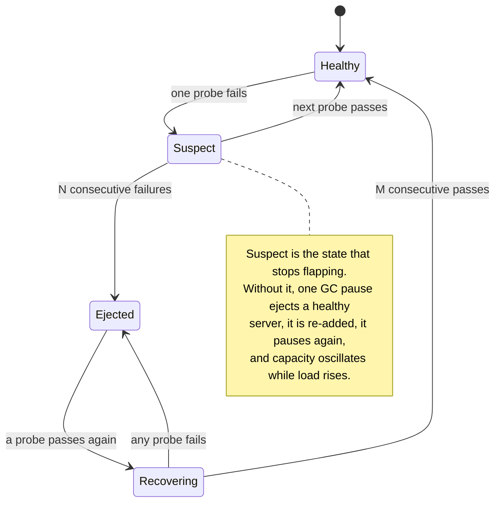
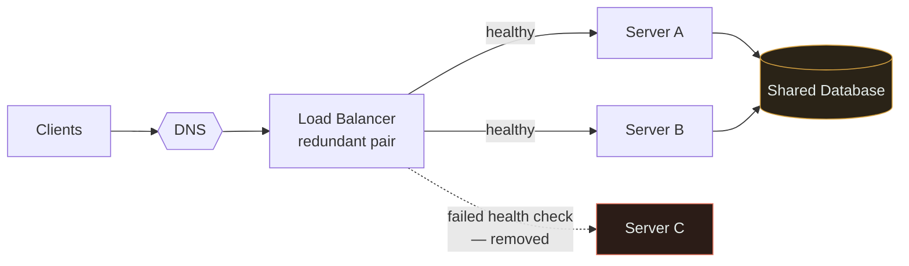
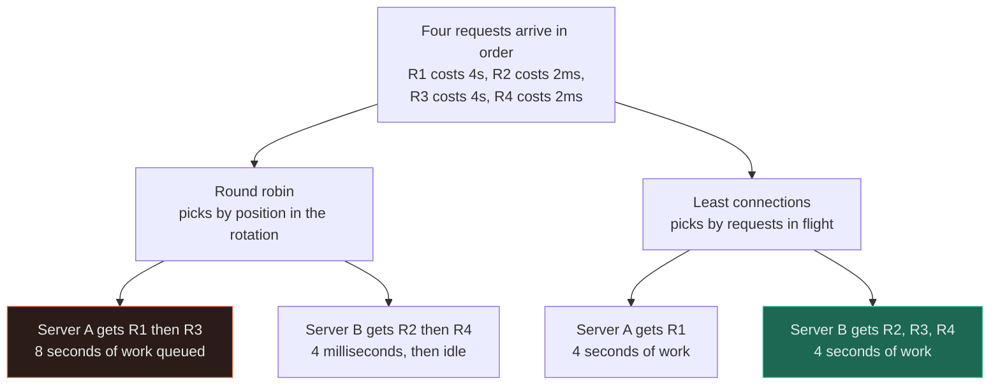
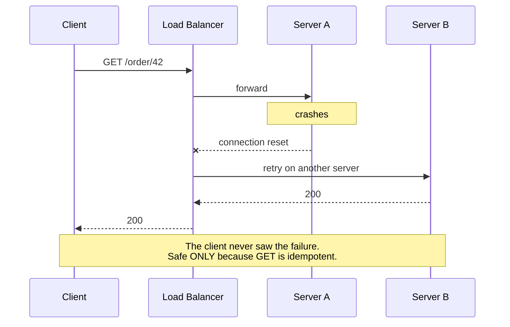

# Load Balancer ★

`[BEGINNER]` · Spreads requests across servers. Also buys zero-downtime deploys — which is usually the benefit that actually forces the change.

---

## 1. One-line definition

A component that receives requests and distributes them across a pool of backend servers.

## 2. Explain like I'm new

A supermarket with one till and a queue out the door. You open five tills — but now customers do not
know which to join, so you add a person at the front directing people to whichever till is free.

That person is the load balancer. Notice they do no shopping and sell nothing; they only decide
*where each customer goes*. Notice also that **if they go home, all five tills become useless** even
though every one of them still works.

## 3. Real-world analogy

The queue marshal above.

**Where it breaks:** a human marshal can see that till three has a customer with a huge trolley. A
round-robin load balancer cannot — it counts customers, not work. That gap is why
[least-connections](#11-algorithms) exists and why round-robin is usually the wrong default.

## 4. Technical explanation

Two things, often confused, and the distinction decides what the load balancer can do:

| | **L4** (transport) | **L7** (application) |
|---|---|---|
| Sees | IP and port | The full HTTP request |
| Can route on | Connection tuple | Path, header, cookie, method |
| Terminates TLS | No | Usually yes |
| Cost per request | Very low | Higher — must parse |
| Throughput | Millions of connections | Lower |
| Use for | Raw TCP, databases, extreme throughput | Anything HTTP — the normal case |

**L7 is the default for web traffic**, because routing `/api/*` to one pool and `/static/*` to
another is worth far more than the parsing cost. L4 wins when you are balancing non-HTTP protocols
or when throughput is extreme enough that parsing matters.

## 5. Engineering at scale

**The load balancer must itself be redundant, or you have achieved nothing.** This is the single most
common mistake in the whole topic: adding a load balancer to remove a single point of failure and
creating one in the process. Five app servers behind one load balancer is a system with the
availability of one machine.

The standard answer is a redundant pair with a floating address, plus DNS with multiple A records —
which makes **DNS part of your availability calculation**, a dependency most designs forget to count.

**Health checks are what make it work, and their tuning is a real trade-off.** Too aggressive and a
brief GC pause removes a healthy server; too lax and you keep routing to a dead one. The subtler
failure: a **shallow** health check (`GET /health` returning 200 unconditionally) reports healthy
while the database connection is gone. A **deep** check tests the dependency — and then a database
blip marks your entire fleet unhealthy at once and takes you down. Both extremes fail; the usual
answer is a shallow check for load balancing and a deep check for alerting.



Read the two thresholds off that, not the boxes. **N** decides how long you keep sending traffic to a
dead server; **M** decides how fast a recovered one is trusted again. Collapsing `Suspect` and
`Recovering` into a single edge — eject on the first failure, re-add on the first pass — is what turns
a transient pause into a server flapping in and out of the pool under exactly the load that caused it.

## 6. The problem it solves

One server has a throughput ceiling and is a single point of failure. A load balancer lets you add
machines to get past the first and survive the second.

## 7. The problem it does NOT solve

**It does not improve latency for a single request** — it adds a hop. It buys
[throughput](../../00-foundations/throughput/), not [latency](../../00-foundations/latency/).

It also does not help when the bottleneck is shared. Ten app servers behind a load balancer all
querying one database gives you ten clients contending for the same resource, which is often *worse*
than one. And it cannot fix a stateful service — sessions in local memory break the moment requests
are spread.

## 8. Why does this exist?

Two forces, and the second is underrated. The obvious one is capacity: one machine runs out. The one
that actually triggers the change in most organisations is **deployment** — with a load balancer you
can drain one server, upgrade it, and return it to the pool with nobody noticing. Without one, every
deploy is downtime.

---

## 9. How it works



Two things worth reading off that diagram. Server C was removed automatically — that is the
availability benefit, and it only works if health checks are honest. And the database is amber:
**the load balancer moved the bottleneck rather than removing it**, which is the normal outcome and
the reason the next step in the chain is caching or replication.

## 10. Internal components

- **Frontend listener** — accepts connections; terminates TLS at L7
- **Backend pool** — the set of servers, with weights
- **Health checker** — probes and ejects
- **Algorithm** — picks the target
- **Connection tracker** — needed for least-connections and session affinity

## 11. Algorithms

| Algorithm | How | Good when | Weakness |
|---|---|---|---|
| **Round robin** | Next in rotation | Identical servers, uniform requests | Ignores actual load entirely |
| **Weighted round robin** | Proportional to capacity | Mixed instance sizes | Still blind to current load |
| **Least connections** | Fewest in-flight | **Variable request cost — the usual reality** | Needs connection state |
| **Least response time** | Fastest recent | Heterogeneous backends | Can oscillate; needs damping |
| **IP hash** | Hash the client IP | Crude session stickiness | Breaks badly when the pool changes |
| **Consistent hashing** | Hash onto a ring | Cache affinity, sharded backends | More complex; needs virtual nodes |

**Round robin is the default in most configurations and is usually the wrong choice.** It assumes
every request costs the same. Real traffic has a long tail — one request rebuilds a report while a
hundred serve a cached page — and round robin will happily hand a second expensive request to the
server still working on the first. Least-connections approximates "least loaded" for free.



The two algorithms see identical traffic and split it identically **by count** — two requests each on
the left, and the fleet is still only half loaded. What diverges is *work*: round robin puts both
expensive requests behind each other on Server A because position 3 in the rotation comes back round
to A, while B finishes in milliseconds and idles. Least-connections never sends R3 to A because A is
still holding R1. The p99 gap between those two rows is the entire argument.

**Consistent hashing deserves special mention** because it is what makes cache affinity survive
scaling. With plain `hash(key) % N`, adding one server remaps roughly *every* key and invalidates the
entire cache tier at once. With a hash ring, adding a server remaps only `1/N` of keys.

## 12. Sequence — a server failing mid-flight



That last note is the point. Retrying a `GET` is free; retrying a `POST /charge` at the load balancer
may charge twice. **Load balancer retries are safe for idempotent methods and dangerous otherwise** —
which is why idempotency keys exist.

---

## 13. When to use it

- More than one server, for any reason
- You want deploys without downtime — often the real trigger
- You need to survive an instance dying
- Traffic is spiky and you want to autoscale behind a stable address

## 14. When NOT to

- **One server is genuinely enough.** Adding a load balancer to a single backend adds a hop and a
  failure mode for no benefit.
- The bottleneck is downstream. Ten app servers on one saturated database is worse, not better.
- The service is stateful and you cannot fix that yet — fix statelessness first.
- A managed platform already does it and you would be adding a second layer for nothing.

## 15. Advantages

Horizontal scale · automatic removal of dead instances · zero-downtime deploys · one stable address ·
TLS termination in one place · a natural point for rate limiting

## 16. Disadvantages

An extra hop of latency · **a new single point of failure unless made redundant** · requires
statelessness · health check tuning is genuinely fiddly · another thing to operate

## 17. Trade-offs

| Choose | Get | Pay |
|---|---|---|
| L7 over L4 | Content-based routing, TLS termination | Higher per-request cost |
| Least-connections over round robin | Better distribution under variable cost | Connection state tracking |
| Aggressive health checks | Fast ejection of dead servers | Healthy servers ejected on a GC pause |
| Deep health checks | Detects broken dependencies | A database blip fails the entire fleet at once |
| Session affinity | Stateful apps work | Uneven load; breaks on pool change; blocks scaling |

## 18. Why not?

| Alternative | Why not here | When it WOULD win |
|---|---|---|
| **One bigger server** | Hard ceiling; still one point of failure; deploys mean downtime | Genuinely small load — **more often the right answer than people admit** |
| **DNS round robin** | Clients cache DNS; no health awareness; removal takes a TTL | Coarse geographic distribution, or as a layer *above* the load balancer |
| **Client-side balancing** | No extra hop, lowest latency | Internal service-to-service with a service mesh; needs smart clients |
| **Anycast** | Operationally heavy; routing changes can break connections | Global edge, UDP, DDoS absorption |
| **Managed cloud LB** | Less control, provider lock-in | Almost always correct if you are already on that cloud |

## 19. Failure scenarios

| Failure | What happens | Mitigation |
|---|---|---|
| **The load balancer dies** | Total outage. N redundant servers become worthless. | Redundant pair, floating IP, multiple DNS records |
| Health check too aggressive | Healthy servers ejected during GC; capacity drops under load, causing more GC | Tune thresholds; require consecutive failures |
| Deep health check + DB blip | **Entire fleet marked unhealthy simultaneously** | Shallow check for routing, deep check for alerting |
| All backends unhealthy | Depends on config: fail closed (503) or "fail open" and route anyway | Decide deliberately — the default is rarely what you want |
| Uneven distribution | One server saturated while others idle | Least-connections instead of round robin |
| Session affinity + scale-out | New servers get no traffic; old ones stay hot | Externalise session state |
| Retry on non-idempotent request | Duplicate writes | Retry only idempotent methods; idempotency keys |

## 20. Scaling considerations

The load balancer itself eventually becomes the bottleneck. The escalation path is roughly: bigger
instance → active-active pair → DNS across several load balancers → anycast at the edge. Most systems
never leave step two.

**Connection limits bite before CPU does.** A load balancer holding a million idle WebSocket
connections is constrained by file descriptors and memory, not by request throughput — a completely
different capacity model from a request/response workload.

## 23. Operational considerations

Connection draining on deploy — stop new connections, let in-flight requests finish, then remove. The
drain timeout must exceed your slowest request or you will cut users off mid-response. TLS
certificates terminate here, so certificate expiry is a **total outage** and entirely predictable;
automate renewal and alert on days-remaining.

---

## 25. Without it → With it → New problem → Next

```
Without it   →  one server caps throughput, and every deploy is downtime
With it      →  horizontal scale, dead instances ejected, deploys invisible
New problem  →  the LB is now a single point of failure, and all servers share one database
Next         →  make the LB redundant; then cache or replicate, because the
                bottleneck moved downstream rather than disappearing
```

## 26. Combination patterns

- **[Load balancer + cache](../../14-component-combinations/MATRIX.md)** — where the cache sits decides whether hit rate survives fleet growth
- **[CDN + load balancer](../../14-component-combinations/MATRIX.md)** — the edge absorbs cacheable traffic first; the LB sees only misses
- **[Rate limiter + load balancer](../../14-component-combinations/MATRIX.md)** — per-server limiting means N servers each allow the full limit
- **[LB + service discovery](../../14-component-combinations/MATRIX.md)** — in autoscaled fleets the backend list changes constantly

## 27. Implementation

The balancing algorithms are on the roadmap for
[18-implementations/](../../18-implementations/) — they are small, and comparing round robin against
least-connections under variable request cost makes the difference immediately obvious in a way prose
does not.

## 28. Common mistakes

| Mistake | Why it is wrong |
|---|---|
| **A single load balancer** | Re-creates the single point of failure it was added to remove |
| Round robin with variable request cost | Sends the next expensive request to the busiest server |
| Sessions in local memory | Forces affinity, which breaks scaling and deploys |
| Shallow health check | Reports healthy while the database connection is gone |
| Deep health check for routing | One dependency blip fails the whole fleet |
| No connection draining | Deploys cut users off mid-request |
| Retrying non-idempotent requests | Duplicate writes |
| Forgetting DNS is in the path | DNS TTL sets your real failover time |

## 29. Monitoring

Requests and errors **per backend**, not just in aggregate — an aggregate hides one sick server
perfectly. Track health check state changes; flapping is a signal in its own right. Watch connection
counts against the limit, and alert on certificate expiry in days, because that outage is both total
and entirely avoidable.

## 31. Exercises

**1.** You add a load balancer in front of five app servers so no single machine can take the site
down. What is the new single point of failure, and what else just entered your availability
calculation?

<details><summary>Answer</summary>

The load balancer itself. Five servers behind one load balancer is a system with the availability of
one machine, and adding an LB to remove a single point of failure while creating one is the most
common mistake in this topic. Fix it with a redundant pair and a floating address.

Two dependencies arrive quietly with it. **DNS is now on the critical path**, and its TTL sets your
real failover time. And the five servers still share one database, which is un-redundant and is
therefore your actual number — see [availability](../../00-foundations/availability/).
</details>

**2.** Requests on this service range from 2 ms to 4 seconds. Round robin is configured. Predict the
symptom.

<details><summary>Answer</summary>

One server pinned while others idle, and a p99 far worse than the fleet's capacity suggests. Round
robin counts **requests, not work**, so it will cheerfully hand the next report-rebuild to the server
still grinding through the last one.

Least-connections approximates "least loaded" for free by tracking in-flight requests, and variable
request cost is the normal case rather than an exotic one — which is why round robin being the
default in most configurations is unfortunate. See [§11](#11-algorithms).
</details>

**3.** A server returns 200 from `/health` but cannot reach the database. Then you make the health
check query the database, and one database blip takes the whole site down. What is the resolution?

<details><summary>Answer</summary>

Both extremes fail, so use both checks for different purposes: a **shallow** check for routing, and a
**deep** check for alerting.

A shallow check keeps servers in the pool that cannot do useful work. A deep check for routing is
worse, because the dependency is shared — one blip marks every backend unhealthy simultaneously, and
the load balancer now has an empty pool. Decide deliberately what happens then, too: fail closed with
503s, or fail open and route anyway. The default is rarely what you want.
</details>

**4.** Your cache tier sits behind a load balancer using `hash(key) % N`. You add one node to a
four-node tier. What does the origin see?

<details><summary>Answer</summary>

A step change it may not survive. Changing `N` from 4 to 5 changes the destination for roughly
`(N−1)/N` of all keys — about 80% — so the cache tier is effectively empty in one instant and 80% of
reads fall through to the origin simultaneously.

Consistent hashing places keys and nodes on a ring, so a new node steals a contiguous arc from one
neighbour and only ~1/N of keys move. This is why cache affinity behind a load balancer is one of the
few places the extra complexity of a hash ring clearly pays.
</details>

**5.** A service runs comfortably on one machine at 30 rps and deploys during a monthly maintenance
window. Someone proposes a load balancer "for scalability". Do you?

<details><summary>Answer</summary>

Not on that argument. At 30 rps capacity is not the problem, and adding a load balancer in front of a
single backend buys you an extra hop, a certificate to renew, health checks to tune and a new failure
mode — for no benefit at all.

The arguments that would win are the other two: surviving an instance dying, and deploys without
downtime. If a monthly maintenance window is genuinely acceptable and an hour of downtime costs
nothing, then one bigger server remains the right answer — **more often than people admit**.
</details>

## 32. Decision checklist

- [ ] The load balancer itself is redundant
- [ ] Backends are genuinely stateless
- [ ] Algorithm matches request-cost variance
- [ ] Health checks: shallow for routing, deep for alerting
- [ ] Connection draining configured, timeout > slowest request
- [ ] Behaviour when all backends are unhealthy is a decision, not a default
- [ ] Retries restricted to idempotent methods
- [ ] Certificate renewal automated and alerted
- [ ] DNS TTL understood as part of failover time

## 33. Related

- [Observability](../../11-observability/) — how you would know any of this broke
- [Scalability](../../00-foundations/scalability/) — the property this enables
- [Throughput](../../00-foundations/throughput/) — what it buys
- [Availability](../../00-foundations/availability/) — why redundancy of the LB itself matters
- [Cache](../../04-caching/fundamentals/) — usually the next step in the chain
- [Combination matrix](../../14-component-combinations/MATRIX.md)

<!-- PATH:BEGIN -->

---

<sub>**The reading path** · step 12 of 27 · *Load balancer*</sub>

◀ **Previous** [CAP theorem](../../00-foundations/cap-theorem/README.md) &nbsp;·&nbsp; **Next** [Cache](../../04-caching/fundamentals/README.md) ▶

<!-- PATH:END -->
