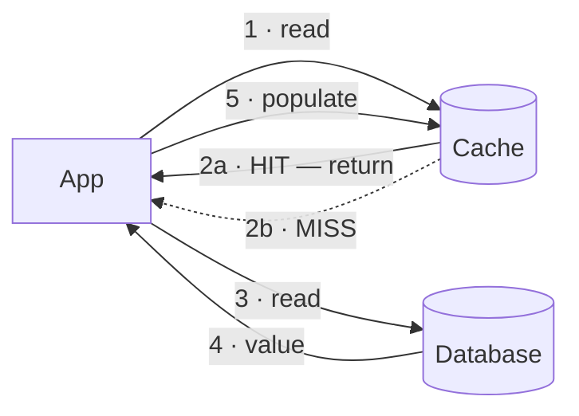

# Cache ★

`[BEGINNER]` · A faster, smaller copy of data kept nearer the reader. Buys latency, sells staleness — and only works if access is skewed.

---

## 1. One-line definition

A store that keeps a subset of data somewhere faster than its source, so repeated reads avoid the
source entirely.

## 2. Explain like I'm new

You keep milk in the fridge rather than driving to the shop each time you want tea. The fridge is
smaller than the shop and does not have everything — but it has the things you reach for often, and
reaching for them takes seconds instead of half an hour.

Two problems follow immediately, and they are the same two every cache has: the fridge might hold
milk that has **gone off** (staleness), and it only helps if you keep wanting the same few things
(skew). If you wanted a different exotic ingredient every day, a fridge would save you nothing.

## 3. Real-world analogy

A desk drawer versus the stationery cupboard down the corridor.

**Where it breaks:** nobody else can silently change what is in your drawer. A cache's source *can*
change underneath it, and the cache has no way to find out unless something tells it. That single
difference is [cache invalidation](#7-the-problem-it-does-not-solve), which is the hard part.

## 4. Technical explanation

A cache is a bet on two properties of your access pattern:

- **Temporal locality** — data read once is likely to be read again soon
- **Skew** — a small fraction of keys account for most reads

The bet is measured by **hit rate**, and the relationship to latency is non-linear in an important
way. With a 1 ms cache and a 50 ms database:

| Hit rate | Average latency | |
|---|---|---|
| 0% | 50.0 ms | no cache at all |
| 50% | 25.5 ms | |
| 90% | 5.9 ms | |
| 95% | 3.5 ms | |
| 99% | 1.5 ms | |
| 99.9% | 1.05 ms | |

**Going from 90% to 99% is a bigger win than going from 0% to 90%** in the sense that matters: it
removes 90% of the *remaining* database load. Each additional nine of hit rate is another order of
magnitude off the origin. This is why hit rate is the number to optimise, and why a small
improvement at the top end is worth real effort.

## 5. Engineering at scale

**Where the cache lives changes what it does.** This is the decision people get wrong most often:

| Placement | Hit rate as the fleet grows | Invalidation | Use when |
|---|---|---|---|
| In-process (local) | **Falls** — each server caches independently | Near impossible | Tiny read-only reference data |
| Distributed (shared) | Constant at any fleet size | Feasible | Shared hot keys — the common case |
| Edge / CDN | Constant, and nearest the user | TTL only, mostly | Cacheable responses identical for everyone |

With 100 servers and a local cache, each server must independently miss on a key before it caches
it, so your effective hit rate for a given key is roughly `1 - (1/100)` worse than a shared cache
would give. **Local caches get worse as you scale out**, which is precisely when you need them most.

**Cache memory is not free capacity.** A cache sized at 20% of the dataset with uniformly random
access gives you a 20% hit rate. The same cache over a Zipf-distributed workload can give 95%. Check
the distribution before sizing.

## 6. The problem it solves

Repeated reads of the same data paying full cost every time — where "full cost" is a database query,
a network round trip, or a computation.

## 7. The problem it does NOT solve

**A cache does not fix a slow query. It hides one — until the miss.** Every cache miss pays the
original cost, so a 95% hit rate means your p95 latency looks great and your **p99 is still the
uncached query**. If the underlying query is slow, the tail stays slow, and the tail is what users
complain about.

It also does not help uniformly random access over a large keyspace, does not make writes faster,
and does not add capacity you can rely on — a cache is *by definition* allowed to lose everything at
any moment.

## 8. Why does this exist?

Because the memory hierarchy has always had orders of magnitude between its levels — see
[latency](../../00-foundations/latency/#11-the-numbers-that-shape-architecture). Memory is ~1,000×
faster than SSD. Whenever a gap that large exists between two tiers, putting a small fast copy in
front of the slow one is worth doing.

---

## 9. How it works — the strategies

Five, and choosing between them is mostly about **who writes to the cache and when**.

| Strategy | Read path | Write path | Data loss risk |
|---|---|---|---|
| **Cache-aside** | App checks cache, on miss reads DB and populates | App writes DB, invalidates cache | None |
| **Read-through** | Cache itself fetches on miss | — | None |
| **Write-through** | — | Write cache **and** DB synchronously | None |
| **Write-behind** | — | Write cache, flush to DB later | **Yes** — acknowledged writes can be lost |
| **Write-around** | — | Write DB only; cache populates on read | None |

**Cache-aside is the default** and the one most systems use. Its weakness is that invalidation lives
in application code, which is exactly where invalidation bugs live — every code path that writes
must remember to invalidate, and the one that forgets is found in production.

**Write-behind is the only row that can lose acknowledged data.** It is the fastest write path
available and should be chosen deliberately, for data where loss is survivable — counters, telemetry
— never for anything a user was told was saved.



That is cache-aside. Note step 5 is the application's responsibility — which is the whole difference
from read-through, where the cache does it.

## 10. Internal components

- **Store** — the key/value map itself, usually in memory
- **Eviction policy** — what to drop when full: LRU, LFU, FIFO, random
- **TTL** — a time bound on staleness, and the *only* invalidation many systems have
- **Serialisation** — objects to bytes; often a surprising share of the cost

## 11. Eviction

| Policy | Keeps | Good for | Weakness |
|---|---|---|---|
| **LRU** | Recently used | General purpose — the default | A single large scan evicts everything useful |
| **LFU** | Frequently used | Stable hot sets | Slow to adapt; old popularity lingers |
| **FIFO** | Newest | Trivially cheap | Ignores access entirely |
| **Random** | — | Surprisingly competitive, no bookkeeping | Unpredictable |

**LRU's scan vulnerability is real and common.** A nightly analytics job that reads every row will
evict your entire working set, and the morning traffic then arrives to a cold cache. The mitigation
is a separate cache, a scan-resistant policy like LRU-K or SLRU, or simply not routing batch reads
through the cache.

---

## 13. When to use it

- Reads greatly outnumber writes — check the ratio, it is one division
- **Access is skewed** — a small key set takes most of the traffic
- Stale data is tolerable for a stateable window
- The source is expensive: slow query, remote call, heavy computation

## 14. When NOT to

- **Uniform access over a large keyspace.** The hit rate will be near zero and you have added a
  failure mode for nothing.
- Write-heavy workloads. The cache is invalidated faster than it is used.
- Data that must never be stale — see [consistency](../../00-foundations/consistency/)
- **When you have not measured.** The instinct to add a cache before profiling is how a slow query
  survives for two more years, hidden.
- When fixing the query or adding an index would solve it properly

## 15. Advantages

Dramatically lower read latency · large reduction in load on the source · absorbs read spikes ·
cheap relative to scaling the database

## 16. Disadvantages

Staleness · invalidation complexity · a new component to run and monitor · thundering herd ·
**a new and non-obvious failure mode** — see §19

## 17. Trade-offs

| Choose | Get | Pay |
|---|---|---|
| Cache | Latency, less origin load | Staleness bounded by TTL; invalidation bugs |
| Longer TTL | Higher hit rate | More staleness |
| Shorter TTL | Fresher data | Lower hit rate, more origin load |
| Bigger cache | Higher hit rate | Memory cost; diminishing returns |
| Write-through | No stale reads after write | Slower writes |
| Write-behind | Fastest writes | **Can lose acknowledged data** |

## 18. Why not?

| Alternative | Why not here | When it WOULD win |
|---|---|---|
| **No cache — fix the query** | Slower than a cache hit | Uniform access; or the query is slow because it is *wrong*, and caching would hide that |
| **Local in-process memory** | Hit rate degrades as the fleet grows; invalidation near impossible | Small fleet, tiny read-only data, sub-µs reads needed |
| **Read replica** | Not a cache — still a query. Helps load, not per-key latency | You need consistency a cache cannot give |
| **CDN / edge** | Only for cacheable, mostly-static responses | Geographically spread users, identical content |
| **Materialised view** | Refresh cost; less flexible | The expensive part is a *computation*, not a lookup |

The first row is a real option. **If your options table has no row for "do nothing", you have not
finished thinking.**

## 19. Failure scenarios

| Failure | What happens | Mitigation |
|---|---|---|
| **Cache down** | Every read falls through at once. The database sees a step change of 10–20× and often dies. **This is how a cache outage becomes a full outage.** | Circuit breaker to the origin, request coalescing, capacity headroom |
| **Thundering herd** | A hot key expires; every concurrent request misses simultaneously and hammers the origin | Probabilistic early expiry, request coalescing, lock-free single-flight |
| **Cache stampede on cold start** | New instances start empty and all miss together — scaling *out* during a spike makes things worse for a minute | Warm on startup, stagger rollout |
| **Stale after write** | A code path forgot to invalidate | Prefer read-through or CDC-driven invalidation over hand-written invalidate calls |
| **Scan evicts the working set** | A batch job flushes everything useful | Separate cache, or scan-resistant eviction |
| **Hot key overloads one node** | Sharded cache: one key, one node, all traffic | Replicate hot keys, or add a small local tier in front |

**The first row is the one that catches people.** Teams add a cache to survive their traffic, and in
doing so make the database permanently incapable of serving that traffic unaided. The cache stops
being an optimisation and becomes a load-bearing dependency — while still being labelled "safe to
lose" on the diagram.

## 21. Performance

Ratios, not measurements: a memory cache hit is roughly 1,000× faster than an SSD read and ~50,000×
faster than a cross-continent round trip. The gain is real and large.

The number to watch is not average latency but **origin load reduction**, because that is what
decides whether the database survives. At 95% hit rate the origin sees 1/20th of the traffic — which
is also the multiplier it will suddenly face if the cache disappears.

## 23. Operational considerations

Size it from the working set, not from the dataset. Monitor hit rate as a first-class SLI — a
gradually falling hit rate is an early warning that the access pattern is changing. Decide in advance
whether a cache outage should fail open (fall through, risk the origin) or fail closed (serve errors,
protect the origin); **both are defensible and the default is usually neither, because nobody chose.**

## 24. Real-world usage

Facebook's memcached tier is the best-documented example at scale — *Scaling Memcache at Facebook*
(NSDI '13) covers the lease mechanism they built specifically to solve thundering herd and stale
sets, which is worth reading precisely because those are the two problems this page keeps returning
to.

---

## 25. Without it → With it → New problem → Next

```
Without it   →  every read pays full cost; the database saturates on repeat traffic
With it      →  most reads never reach the database; p50 collapses
New problem  →  stale data, and invalidation logic scattered through the codebase
Next         →  TTL and invalidation strategy; then the database becomes unable to
                survive without the cache, which forces capacity planning for its loss
```

That last line is the step people skip. See [the chain](../../SYSTEM-DESIGN-THINKING.md#part-1--the-chain).

## 26. Combination patterns

- **[Cache + database](../../14-component-combinations/MATRIX.md)** — the canonical pairing, and the canonical bug
- **[Load balancer + cache](../../14-component-combinations/MATRIX.md)** — placement decides whether hit rate survives the fleet growing
- **[Cache + queue](../../14-component-combinations/MATRIX.md)** — ⚠ the dangerous one: a miss storm and a backlog amplify each other
- **[CDN + LB + cache](../../14-component-combinations/MATRIX.md)** — three layers, three TTLs, one debugging problem

## 27. Implementation

An LRU + TTL cache is on the roadmap for [18-implementations/](../../18-implementations/). The
[rate limiter](../../18-implementations/rate-limiter/) already demonstrates the measurement
discipline these use: real numbers, and an explicit list of what production adds.

## 28. Common mistakes

| Mistake | Why it is wrong |
|---|---|
| Caching before measuring | Hides a slow query instead of fixing it |
| Caching uniformly-accessed data | Near-zero hit rate, new failure mode, no benefit |
| No TTL | Unbounded staleness; stale data lives until evicted |
| Invalidation scattered across write paths | The one path that forgets is found in production |
| Treating the cache as durable | It is allowed to lose everything at any moment |
| No plan for cache-down | The database cannot absorb the step change |
| Caching at the wrong layer | Local caches get worse as the fleet grows |
| Caching user-specific data in a shared cache | Cross-user data leaks — a security bug, not a performance one |

## 29. Monitoring

**Hit rate** is the primary SLI. Also track origin load — so you know the multiplier a cache outage
would produce — eviction rate, which tells you the cache is too small, and p99 specifically, since
the tail *is* the miss path and a good average hides it entirely.

## 31. Interview questions

- **"When would you not add a cache?"** — the best question here. Wants uniform access, write-heavy
  workloads, and "fix the query instead".
- **"Your cache dies. What happens?"** — wants the 10–20× step change and the observation that the
  database may not survive it.
- **"What's a thundering herd?"** — wants hot-key expiry, and coalescing or probabilistic early
  refresh as the fix.
- **"Cache-aside vs read-through?"** — wants "who owns invalidation", not a definition.
- **"How would you size it?"** — wants working set and access distribution, not a fraction of the
  dataset.

## 32. Decision checklist

- [ ] Read:write ratio measured
- [ ] Access skew confirmed, not assumed
- [ ] Staleness window stated and agreed with whoever owns the product
- [ ] Invalidation strategy chosen — ideally not hand-written invalidate calls
- [ ] Behaviour on cache-down decided: fail open or fail closed
- [ ] Origin can absorb the step change, or is protected by a breaker
- [ ] Thundering herd mitigated for hot keys
- [ ] Hit rate monitored, with an alert on decline

## 33. Related

- [Observability](../../11-observability/) — how you would know any of this broke
- [Latency](../../00-foundations/latency/) — why the memory/disk ratio makes this work
- [Consistency](../../00-foundations/consistency/) — a cache is a deliberate weakening, TTL is the bound
- [Combination matrix](../../14-component-combinations/MATRIX.md)
- [Glossary: thundering herd](../../GLOSSARY.md#thundering-herd) · [cache invalidation](../../GLOSSARY.md#cache-invalidation)
