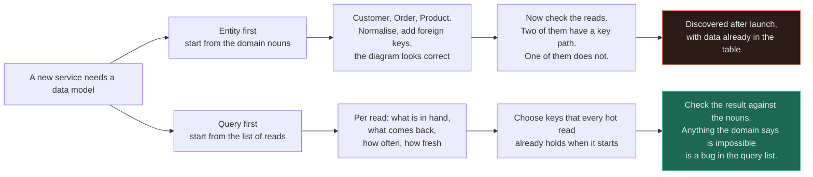
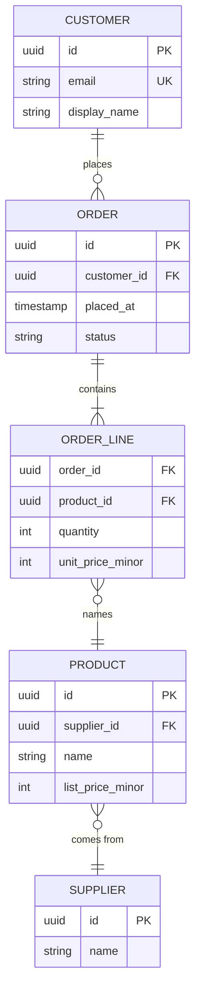
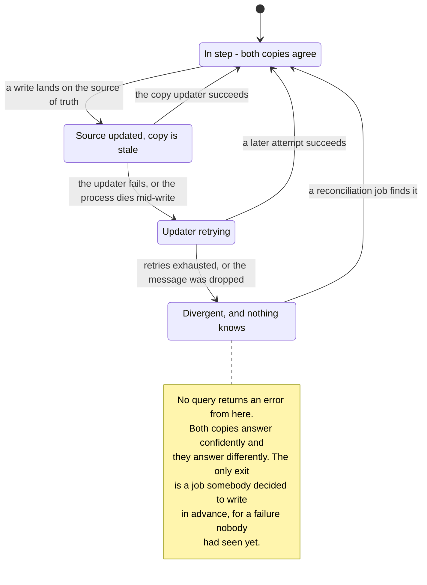
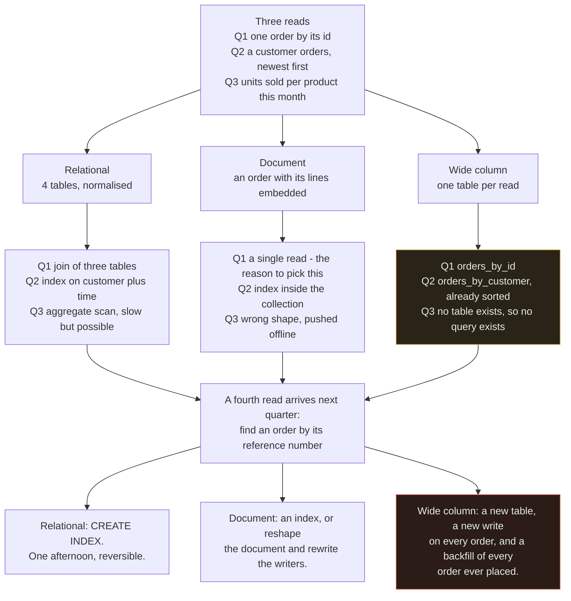

# Data Modelling

`[ADVANCED]` · **Design for the query, not the entity.** The domain tells you what things exist; only the access pattern tells you how to store them — and in a key-value or wide-column store, getting that wrong does not make a query slow, it makes the query impossible without a migration.

---

## 1. One-line definition

Deciding what entities exist, how they relate, and — the part that determines everything else — what
physical shape they take in a particular store, given the queries that will actually be run against
it.

## 2. Explain like I'm new

You are building a shop. There are customers, and there are orders. That much the business tells you,
and it is the easy half.

The hard half is the layout. Do orders live inside the customer record, or in their own list with a
pointer back? Is the product's name copied into each order line, or looked up? Nothing in the domain
answers these, because they are not questions about the world — they are questions about **which
lookups you want to be cheap**.

A relational database is forgiving about this. Lay the data out almost any sensible way and it can
still answer almost any question; if a question is slow you add an index and it stops being slow.
That forgiveness is why a lot of people never learn there was a decision here.

Move the same data into a key-value or wide-column store and the forgiveness disappears. Those stores
find rows by a key, and a question that does not supply the key has no path to an answer. It is not
slower. **There is no query.** Your options become: scan everything, or build a second copy of the
data arranged by the other key — and building that second copy over existing data is a migration, not
an afternoon.

## 3. Real-world analogy

A library shelved by author. "What has Le Guin written" is one shelf and thirty seconds. "What was
published in 1974" means walking the entire building. You can add a second card drawer sorted by
year, and then both questions are cheap — and somebody now has to keep the drawer up to date.

**Where it breaks:** the library can add that drawer on a quiet Tuesday, from the books it already
owns, and no book moves. A distributed store frequently cannot. There, the second drawer is a whole
second copy of the data, written by the application on every single write, and populating it means
reading every existing row while the store is serving traffic — a
[schema migration](../schema-migration/) measured in days. The analogy also lets the cards go a day
stale without anyone caring; your second copy drifting is a correctness bug that returns a confident
wrong answer and raises no error at all.

## 4. Technical explanation

### The method: start from the reads

Write down every read the system performs. For each one, four facts:

1. **What you have in hand** when the read begins — a user id, a session, a search string
2. **What comes back** — one row, a page, an aggregate
3. **How often** — per request, per page load, nightly
4. **How fresh** it must be — this instant, within a minute, yesterday is fine

That list is the model. The entity diagram is a **check** on it, not its source: anything the domain
says is impossible but the query list assumes is a bug in the query list, and anything the query list
never touches is a column you are about to carry for a decade for nothing.



Both paths visit the same two things — the nouns and the reads — and **the only difference is which
one is the input and which is the check.** Entity-first finds the missing key path after launch with
data in the table; query-first finds it on a whiteboard. Note that the domain does not disappear on
the right-hand path; it moves to the last box, where it is doing more useful work.

### Normalisation, as an actual trade

| | **Normalised** | **Denormalised** |
|---|---|---|
| A fact lives | In exactly one place | In several places |
| Write | One row, atomically | Several rows, and no single commit unless the store gives you one |
| Read | Joins, or several round trips | One read |
| Update anomaly | Impossible by construction | The permanent standing risk |
| Storage | Minimal | Multiplied, sometimes by a lot |
| Adding a field | One table | Every copy, and every writer of every copy |
| Cross-shard behaviour | Joins may not exist at all | Fine — this is why sharded systems denormalise |
| **Fails by being** | **Slow** | **Wrong** |

The bottom row is the one to weigh, and it is the reason the two are not symmetric. **A normalised
model that is too slow tells you loudly, in a metric, at a time of its choosing; a denormalised model
that has drifted tells you nothing, ever.** One of those failure modes you can respond to.

"Normalise until it hurts, denormalise until it works" is the right order and says nothing about the
price. The usable version: normalise by default; denormalise **one measured slow read at a time**,
with a named owner for each copy and a reconciliation job shipped in the same change.

### Entities, relationships and cardinality



Read the crow's feet, not the boxes — the cardinality markers are the only part of an ER diagram that
constrains the physical design. And notice `ORDER_LINE`: **it is the one entity here that nobody in
the business would have named.** It exists because orders and products are many-to-many, and the
moment it exists it acquires attributes of its own — `quantity`, `unit_price_minor` — which is the
proof it was always an entity rather than plumbing. A junction table with attributes is the normal
case, not the exception.

An ER diagram shows structure and cardinality. It shows **nothing** about volume, latency, freshness,
or which side of a relationship is hot — which is exactly the information a physical model is built
from. So it is worth drawing when the domain is unfamiliar or contested and you need agreement on
cardinality before anyone writes code. It is not worth drawing to document a model everyone already
agrees on, and it is actively misleading as the *starting point* for a non-relational store, because
it describes shape and those stores are priced on access.

### Why cardinality changes the physical design

| | **One-to-many** | **Many-to-many** |
|---|---|---|
| Relational | Foreign key on the many side | Junction table, two foreign keys, composite primary key |
| Document | **Embed** the children if bounded and always read together; otherwise reference | Cannot embed both directions — reference from one side, or duplicate and accept drift |
| Wide-column | Partition by the one side; children are clustered rows inside that partition | Two tables, one per direction of traversal, both written on every link |
| Graph | An edge | An edge — the only model where the two are the same shape |
| Getting it wrong | A column becomes a table | Every query that traverses it is rewritten |

One-to-one deserves a note of its own: it is usually a smell, meaning two tables that should be one.
The legitimate reasons to split are access frequency (a hot narrow row beside a cold wide one), size
(a blob you rarely read), and security (a column with a different access policy). "It felt tidier" is
not one.

**Cardinality is the most expensive thing to get wrong, because the mistake is structural and it
surfaces late.** A one-to-many that turns out to be many-to-many — a user has one address, until the
day they have two — is not a column addition. It is a new table, a backfill of every historical row,
and a rewrite of every query that touched the old shape. When the "one" is a *policy* rather than a
physical fact, model it as many from the start; the junction table costs one join today and saves a
[migration](../schema-migration/) later.

### Surrogate and natural keys

| | **Natural key** | **Surrogate key** |
|---|---|---|
| Example | Email, ISBN, country code, national ID | `bigint` identity, UUIDv7, ULID |
| Meaning | Carries domain meaning | Carries none, deliberately |
| Stability | As stable as the real world — **which is not stable** | Permanent by construction |
| Uniqueness guaranteed by | Someone outside your system | You |
| In child tables and indexes | A wide, variable-length value copied everywhere | Narrow, fixed, uniform |
| When it changes | Cascades through every foreign key and index that holds it | It does not change |
| Privacy | Frequently personal data, now embedded in URLs, logs and backups | Meaningless outside the system |
| Under sharding | May distribute badly, or not be present in the hot query | Chosen for distribution — see [sharding](../sharding/) |

The rule that resolves it: **use a surrogate as the primary key and put a unique constraint on the
natural key.** You keep the integrity guarantee the natural key provides and you stop betting on the
real world holding still. People change email addresses, country codes have been reassigned, ISBNs
have been reissued, and every one of those is a support ticket rather than a schema event — unless
you made it the primary key, in which case it is a cascading update across the database.

Two follow-ons. A sequential integer surrogate leaks: exposed in a URL it invites enumeration and it
tells a competitor your order rate, so keep it internal and publish an opaque public identifier
instead. And a random UUIDv4 primary key on a large table destroys index locality — inserts land
uniformly across the B-tree, causing page splits and a working set that no longer fits in cache.
UUIDv7 and ULID are time-ordered and globally unique, which is the combination you almost always
wanted.

## 5. Engineering at scale

**Every denormalised copy needs a named owner and a reconciliation job, and both must ship with the
copy.** Not afterwards. The job written after the first divergence is written during an incident, by
someone reading the schema for the first time, against data that is already wrong.



Every state on that diagram has an automatic way out except one. `BAD` has a single exit arrow and it
is not automatic — **that arrow is the real cost of denormalisation**, and it is not the extra write,
it is the fact that the failure state is silent, stable and terminal by default. Which is also why a
[materialised view](../fundamentals/) maintained by the database beats an application-maintained copy
wherever it is available: the refresh semantics are defined and there is exactly one writer.

**The partition key is a modelling decision, and it is made once.** In any partitioned store the key
you choose decides which queries are single-partition and which are scatter-gather, and changing it
later means rewriting every row. That makes it the same decision as the shard key, with the same
three requirements pulling against each other — see [sharding](../sharding/). Model the partition
before you model the columns.

**A mostly-null column is usually a second entity.** If `cancellation_reason` is null for 97% of
orders, you have two kinds of order sharing a table, and the schema has stopped encoding what is
true. Sometimes that is the right trade for read simplicity; it should be a decision rather than a
drift. The same applies to a status column with fifteen values — there is a state machine hidden in
it, and the transitions it permits exist only in application code where nothing enforces them.

**Model the facts, project the views.** A schema shaped around the current screen is a schema that
expires when the design system does. The UI changes twice a year; the data outlives the service that
wrote it, frequently by a decade, and it will be read by things you have not built. Store what
happened; derive what is displayed.

**Time is a modelling problem, not a column type.** Keep immutable timestamps (`created_at`,
`placed_at`) separate from mutable ones (`updated_at`), because only the immutable ones can be
paginated or replicated on safely — a cursor over a mutable sort key duplicates and skips rows, see
[pagination](../../07-api-design/pagination/). Store instants in UTC, and if a local time genuinely
matters, store the zone as its own field rather than encoding it in the instant.

**Money is an integer.** Minor units, or a decimal type. A float reconciles to almost right, which is
the worst available outcome because it looks fine for two years.

## 6. The problem it solves

Making the queries the system actually runs both cheap and correct, and making illegal states
unrepresentable so that the schema — rather than a code review — is what enforces them.

## 7. The problem it does NOT solve

**It does not survive a new access pattern.** Every model is a bet on a query list, and the list
changes. This is not a failure of modelling; it is the reason
[schema migration](../schema-migration/) exists as a discipline.

It also does not give you:

- **A fast query with no key path.** No amount of modelling elegance makes an unindexed, unpartitioned
  lookup cheap. That needs an index or a second copy, and in a partitioned store the second copy is
  the only option.
- **Invariants across aggregates.** A constraint spanning two tables in two services is application
  logic or a saga, and the database will not help you. See
  [consistency](../../00-foundations/consistency/).
- **Consistency between copies.** A denormalised copy is a replication problem implemented in your
  application, with none of the tooling a real replica gets — see [replication](../replication/).
- **Capacity.** A correct model on undersized hardware still falls over, and a beautiful schema is a
  common way to avoid noticing that.
- **Protection from the application.** A document store's "flexible schema" means the schema now lives
  in whichever service wrote the document last, unversioned and unenforced.

---

## 9. How it works

### One domain, three stores

The requirement is order history. Three reads:

- **Q1** — fetch one order with its lines, by order id. Very hot, on every order page.
- **Q2** — list a customer's orders, newest first, paged. Hot.
- **Q3** — units sold per product this month. Cold, analytical, run by finance.



Read the bottom row, not the middle one — all three stores answer the queries they were designed for,
which is what designing for them means, so the middle row is uninformative. The difference appears
only on the last line, where the identical request costs an afternoon, a reshape, or a migration of
every row you have ever written. **The further right you sit, the earlier the model has to be right**,
and Q3 in the wide-column column is not slow, it is simply absent.

The three models in full:

| | **Relational** | **Document** | **Wide-column** |
|---|---|---|---|
| Shape | `CUSTOMER`, `ORDER`, `ORDER_LINE`, `PRODUCT` | An `order` document with lines embedded, plus a `product` collection | `orders_by_id`, `orders_by_customer`, `product_sales_by_month` |
| Q1 one order | Join of two or three tables | **One read, no join** | One read by partition key |
| Q2 a customer's orders | Index seek on `(customer_id, placed_at)` | Index seek within the collection | **One partition, already in sort order** |
| Q3 product totals | Aggregate over two tables; slow at scale, exported to a warehouse | An aggregation across every document — the wrong shape | **A counter table maintained on write, or nothing** |
| A product is renamed | One row | Every embedded copy — **which you may not want to do** | Every copy |
| A new access pattern | `CREATE INDEX` | An index, or reshape the document | A new table plus a full backfill |
| Cost of a wrong model | Slow | Slow, sometimes awkward | **Blocking** |

One detail in the document model is worth pulling out, because it looks like a mistake and is not.
The product's **name and price are copied into every order line, deliberately.** That is not
denormalisation for speed — the price at the time of the order is a genuinely different fact from the
price today, and normalising it would mean that repricing a product silently rewrites history and an
old invoice stops matching what the customer was charged. **When the copy and the source are
different facts that happen to share a word, duplication is the correct model**, and it carries none
of the drift risk from §5 because nothing is ever supposed to update it.

## 13. When to use it

Invest deliberately in modelling — as a distinct activity with an artefact, before the first write —
when any of these hold:

- The store is not relational, so a wrong layout is blocking rather than slow
- The data will be **sharded or partitioned**, since the key is chosen once
- Cardinality is contested or assumed, especially any "a user only ever has one of these"
- More than one service will read the data, so the schema is now an interface
- The data will outlive the service writing it, which it almost certainly will
- Volume is large enough that a backfill is measured in days rather than minutes

For a small, single-service, relational dataset, a sensible normalised schema and an index when
something gets slow is the whole of the discipline, and reaching for more is cost without return.

## 14. When NOT to

- **Do not model beyond the queries you have.** Speculative generality in a schema is as expensive as
  in code and considerably harder to remove — a column nobody uses is three deploys to delete.
- **Do not draw an ER diagram for a model everyone already agrees on.** It documents the half that was
  never in dispute.
- **Do not normalise to the fifth normal form because a textbook has one.** Third is where the returns
  flatten for almost every operational system.
- **Do not denormalise before there is a measured slow read.** You are buying a permanent correctness
  risk to fix a hypothetical.
- **Do not choose a document store to avoid modelling.** It relocates the schema into application
  code, where it is unversioned, unenforced and re-implemented by every reader.
- **Do not copy a single-table design from a conference talk** onto a workload whose query list is
  still changing weekly. It is an optimisation for a *known, fixed* set of accesses.
- **Do not model around the current screen.** See §5.

## 17. Trade-offs

| Choose | Get | Pay |
|---|---|---|
| Normalised | One fact in one place; update anomalies impossible; small writes | Joins on every read; and joins may not exist across shards |
| Denormalised | One read, no join, and it works when sharded | Copies that drift silently; a write path that touches several places |
| Model from the query list | Every hot read has a key path | The model is a bet on that list, and the list will change |
| Model from the domain | Survives changing queries; reads naturally | One of your hot reads probably has no key path, and you find out late |
| Embed in a document | The aggregate is one read, atomically | Unbounded growth; the child cannot be queried independently |
| Reference from a document | Children are bounded and independently queryable | Two round trips, and no transaction across them by default |
| Surrogate primary key | Stability; narrow uniform keys; a free sharding choice | An extra column, and an extra join to resolve a human-meaningful value |
| Natural primary key | One less column; the key means something | The real world changes it, and the change cascades through every index |
| Wide-column, one table per query | Every modelled read is a single-partition seek | Every write fans out; an unmodelled read is impossible |
| Strict `NOT NULL` everywhere | The schema encodes what is actually true | Each new optional field is a migration rather than a shrug |

## 18. Why not?

| Alternative | Why not here | When it WOULD win |
|---|---|---|
| A schemaless JSON blob | The schema still exists, enforced nowhere, re-implemented by every reader | Genuinely variable, rarely-queried payloads — an audit record, a raw webhook body |
| **Fully normalised, always** | Joins across a large dataset, or across shards where a join may not exist at all | **Transactional cores at modest volume — the default, and correct far more often than the internet suggests** |
| Fully denormalised | Every fact in many places, all of which can drift, with no owner | Write-once or derived read models, where nothing updates in place |
| Single-table design | Cognitively expensive and hostile to any query nobody predicted | A DynamoDB-style store with a fixed, exhaustively-known query list |
| EAV — a row per attribute | Every query becomes self-joins; no types, no constraints, no useful indexes | Sparse user-defined fields, alongside a real schema rather than instead of one |
| A graph store | Another store to operate; poor at aggregate scans | Traversal is the primary access pattern — permissions, recommendations, fraud rings |
| **Just add an index** | You cannot index your way out of a missing key path in a partitioned store | **Relational, and the model is basically right — frequently the actual answer** |
| Copy it into a warehouse | Latency and staleness; a second system to keep in step | Q3-shaped work. Analytical queries do not belong in the operational model |

The last row and row two together cover most real cases. A great many "we need to remodel"
conversations are really "we are running an analytical query against an operational schema", and the
answer is not a better model — it is a second, differently-shaped copy of the data somewhere designed
for scans.

## 19. Failure scenarios

| Failure | What happens | Mitigation |
|---|---|---|
| **A new access pattern with no key path** | Relational: a scan and a slow query. Partitioned: no query at all | A new table plus a backfill — a [schema migration](../schema-migration/), not an index |
| **A denormalised copy drifts** | Two confident answers to one question, and no error anywhere | One named owner per copy; a reconciliation job; a divergence metric |
| A cardinality assumption breaks | A one-to-many becomes many-to-many; a column becomes a table and every query is rewritten | Model many-to-many whenever "one" is policy rather than physics |
| A natural key changes | The value is copied into every child row and index; the update cascades or breaks | Surrogate primary key, unique constraint on the natural key |
| UUIDv4 primary key at scale | Random inserts across the B-tree, page splits, and an index that no longer fits in cache | UUIDv7 or ULID — time-ordered and still globally unique |
| Sequential ids exposed publicly | Enumeration of other users' records, and your order rate is now public | Internal surrogate, opaque external identifier |
| Everything nullable | The schema encodes nothing; every reader guesses and they guess differently | `NOT NULL` by default; a mostly-null column is a second entity |
| An embedded array grows unbounded | The document approaches the size limit and every read of it gets slower forever | Embed only bounded collections; reference the rest |
| One enormous flexible JSON column | No types, no constraints, no index; each consumer parses it differently | Promote queried fields to real columns and keep the blob for the rest |
| Timestamps without a zone | Two servers give two answers, discovered at a daylight-saving boundary | Store UTC instants; keep the local zone as its own field |
| Money as a floating-point number | Totals that reconcile to almost right, for two years, then do not | Integer minor units, or a decimal type |
| The partition key is not in the hot query | Every read is a scatter-gather and takes the slowest partition's p99 | Choose the partition key from the query list — see [sharding](../sharding/) |
| **Slow, not wrong** | The model is fine and one join has grown past the point where the plan holds | Watch rows examined per row returned; it should be near 1 |

---

## 25. Without it → With it → New problem → Next

```
Without it   →  the store is laid out for the entities somebody named, so the reads
                that actually run either scan the table or, in a partitioned store,
                cannot be expressed at all
With it      →  every hot read has a key path, and the physical layout is a
                consequence of the query list rather than of the domain vocabulary
New problem  →  the model is now a bet on that query list; denormalised copies must
                be kept in step by application code with nothing enforcing it; and
                the first unanticipated query needs a whole new table
Next         →  a schema migration to add it, an index or a second copy with a named
                owner and a reconciliation job, and a partition key decision that
                sharding will hold you to permanently
```

Modelling is where the chain starts for a stateful system: every later component — cache, replica,
shard, search index — is a response to a query the model cannot serve cheaply. See
[the chain](../../SYSTEM-DESIGN-THINKING.md#part-1--the-chain).

## 28. Common mistakes

| Mistake | Why it is wrong |
|---|---|
| Modelling entities before listing the reads | Produces a diagram everyone approves and a hot query with no key path |
| Assuming "one" because it is one today | A user has one address until they have two; that is a table, not a column |
| Natural key as the primary key | The real world changes it, and the change cascades through every index that holds it |
| UUIDv4 primary key on a large table | Destroys index locality; the working set stops fitting in cache |
| Exposing sequential ids in URLs | Enumeration, and a public counter of your business volume |
| Denormalising before measuring | A permanent correctness risk purchased to fix a hypothetical |
| Denormalising with no owner and no repair job | The copy will drift, and the drift is silent |
| Everything nullable "for flexibility" | The schema stops asserting anything and every reader invents its own rules |
| A mostly-null column | Two entities sharing a table, and queries with a special case in every branch |
| Storing money as a float | Rounding that looks correct until it is audited |
| Naive timestamps with no zone | Correct in one region, wrong in another, discovered at a DST boundary |
| Unbounded embedded arrays | The document grows forever and every read of it degrades |
| Modelling the current screen | The UI changes twice a year; the data outlives the service |
| Choosing a document store to skip modelling | The schema moves into application code, unversioned and unenforced |
| Running analytics against the operational model | Two workloads with opposite shapes competing for one layout |
| Assuming an index will fix a partitioned store | A secondary index there is scatter-gather, with the same tail latency it has in [sharding](../sharding/) |

## 29. Monitoring

**Rows examined per row returned is the single metric that measures whether the model matches the
queries.** It should sit near 1. When it climbs, the access pattern has drifted away from the layout,
and it climbs long before latency does — which makes it the leading indicator rather than the
symptom.

Alongside it: sequential scans per table, which localises the problem to a shape; **query shapes
arriving in the log that are not on your query list**, the direct signal that the model's bet is
expiring; divergence counts between denormalised copies, produced by a continuous job rather than an
incident-time script; partition size distribution in any partitioned store, since an unbounded
partition is a modelling error that presents as an operations problem; null rate per column, which
drifts upward as a schema quietly loses meaning; and row and document size at p99, where an embedded
array growing without limit becomes visible months before it hits a hard limit. See
[observability](../../11-observability/).

## 31. Exercises

**1.** Wide-column store, orders partitioned by `customer_id`. Support asks for "find the order with
this reference number" — one query, and they only need it a few times a day. What does it cost, and
what do you do?

<details><summary>Answer</summary>

There is no key path. The reference number is not the partition key, so the store has no way to locate
the row without visiting every partition. Three options, and their prices are wildly different.

**Scan everything.** Cassandra will even let you, with `ALLOW FILTERING`, which is the trap — it works
instantly in a test dataset and takes the cluster down at production scale, and it is presented as a
query hint rather than as the full-table scan it is.

**A secondary index.** In a partitioned store this is not the relational thing of the same name: the
index is itself distributed, so a lookup fans out to every node and takes the slowest node's p99 every
time. That is the scatter-gather problem from [sharding](../sharding/), with all its tail-latency
behaviour, and it degrades as the cluster grows.

**A second table, `orders_by_reference`**, written on every order write and backfilled across all
history. This is the correct answer, and it is a [schema migration](../schema-migration/) — a new
write path, a throttled backfill, verification, and only then a read switch.

The point of the question is the contrast. In a relational store this request is `CREATE INDEX` and an
afternoon. Here it is a project. "A few times a day" does not reduce the cost at all, because the cost
is in building the access path, not in using it — and that asymmetry is the whole reason the model has
to be right earlier in a partitioned store.
</details>

**2.** An engineer proposes copying `product_name` into `order_line` to avoid a join. The join is a
primary-key lookup against a 40,000-row product table that is entirely cached, and it has never
appeared in a slow-query report. Should you?

<details><summary>Answer</summary>

**No** — not for that reason. You would be trading a cost that measures as approximately zero for a
permanent correctness risk: a second copy of a fact, with no owner, that can drift and will do so
silently. That is denormalising in advance of a measured problem, which is the mistake §14 is about.

But there is a different reason to make exactly the same change, and it is a good one.

The product's name and price **at the time of the order** are not the same fact as the product's name
and price now. If the order line references the product, then renaming a product silently rewrites
history — an invoice issued in March stops matching what the customer was shown and charged, and a
refund is calculated against today's price. That is not a performance question, it is a correctness
one, and normalising it is the bug.

So copy them — as an immutable snapshot taken when the order is placed, documented as such, and never
updated. Once it is framed that way it is not denormalisation at all: they are two different facts
that happen to share a word. The distinction matters operationally too, because a copy that is never
supposed to change carries none of the drift risk of one that is, and needs no reconciliation job.
</details>

**3.** You are handed a finished, agreed ER diagram — normalised, cardinalities settled, everyone has
signed it off — and asked to implement it in DynamoDB. What is missing?

<details><summary>Answer</summary>

The access-pattern list, and it is not a detail — it is the entire input to the design.

An ER diagram describes structure and cardinality. DynamoDB is shaped and priced by access: the
partition key decides what is a single cheap read and what is impossible, and **there is no way to
derive a partition key from an ER diagram**, because the diagram does not record which reads happen,
what the caller holds when they start, how often, or how fresh the answer must be.

Worse, most of what the diagram carefully specifies is what you will undo. Its third-normal-form
decomposition and its junction tables exist to make a *join planner's* life easy, and there is no join
planner. Implementing it literally gives you a table per entity and an application performing joins by
hand across round trips, which is the worst of both models.

The diagram is not wrong. It is answering a different question, and it remains useful as the check
described in §4 — it will tell you when your access-pattern list assumes something the domain forbids.

So the deliverable to ask for is the query list. If nobody has one, that *is* the piece of work, and
producing it will also tell you whether DynamoDB was the right choice: a fixed, known, small set of
accesses is what it is good at, and a query list that is still changing weekly is an argument for a
relational store until it stops changing.
</details>

**4.** The customer dashboard is slow. A senior engineer proposes a denormalised `customer_summary`
table maintained on every write. Is that the right call?

<details><summary>Answer</summary>

**Not yet.** Nothing in the question says what is slow, and the proposed fix is the most expensive and
least reversible option on the list.

Read the plan first. The three most common causes are a missing index, a composite index whose column
order does not match the query, and an N+1 from the ORM issuing one query per row — all of which are
diagnosable in an hour and reversible in an afternoon. A maintained summary table is none of those
things: it is a permanent second copy, a cost on every write in the system, an ownership question, and
a silent-drift risk of the kind in the §5 state diagram.

The order to work through: read the query plan; fix the index; consider a cache if the read is hot and
tolerates staleness; consider a **materialised view maintained by the database**, which gets you the
denormalised read with exactly one writer and defined refresh semantics; and only then an
application-maintained copy.

If you do end up building it, two conditions. Name the owner, and ship the reconciliation job in the
same change — because the copy will diverge, and the version of that job written later is written
during an incident against data that is already wrong.
</details>

**5.** The team uses `email` as the primary key of `users`. It is unique, it is required, and it saves
a join on several hot paths. Where does this end?

<details><summary>Answer</summary>

With a support ticket that turns into a migration.

Users change email addresses. A natural key that *can* change is one that *will*, and the change is
not one row — the value has been copied into every child table's foreign key and into every index that
references it, so a single "please update my email" becomes a cascading update across the database,
taken under locks, with a window in which referential integrity depends entirely on the cascade
behaving. It is also a wide, variable-length value now propagated into every index in the system,
which costs memory on every read that touches them.

Then the privacy problem, which is the one that usually forces the issue. The primary key is personal
data. It is in URLs, log lines, cache keys, analytics events, backups and every downstream system that
ever consumed a row. An erasure request now touches your primary keys and everything that ever held
one, and there is no clean way to satisfy it.

The fix is small and should happen before there is much data: a `bigint` or UUIDv7 surrogate primary
key, and `UNIQUE NOT NULL` on email. You keep every integrity guarantee that motivated the original
choice and lose the coupling entirely — the join it "saves" is a primary-key lookup, which is the
cheapest operation the database has.

The general rule underneath: **uniqueness is a constraint and identity is a key, and they are not the
same requirement.** Conflating them is how a natural key ends up in a primary key position.
</details>

## 33. Related

- [Schema migration](../schema-migration/) — how you get from a wrong model to a right one without downtime
- [Databases](../fundamentals/) — indexes, transactions and what the engine can do with a given layout
- [Sharding](../sharding/) — the partition key is a modelling decision made once, and permanently
- [Replication](../replication/) — a denormalised copy is a replica you have to maintain yourself
- [Consistency](../../00-foundations/consistency/) — two copies of one fact is a consistency problem wearing a schema
- [Pagination](../../07-api-design/pagination/) — why immutable sort keys belong in the model
- [Versioning](../../07-api-design/versioning/) — a schema read by another service is an interface
- [Observability](../../11-observability/) — rows examined per row returned is the metric that measures a model
- [System design thinking](../../SYSTEM-DESIGN-THINKING.md) · [Pattern catalogue](../../13-design-patterns/CATALOGUE.md)
- [URL shortener](../../15-real-world-problems/url-shortener/) — a worked model where the query list is exactly two reads
- [Glossary](../../GLOSSARY.md)
