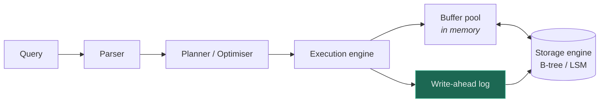

# Database ★

`[INTERMEDIATE]` · The component whose loss costs **data**, not just latency. Every other choice in a system is eventually constrained by this one.

---

## 1. One-line definition

A system that stores data durably and answers queries over it, with defined guarantees about what
survives a crash and what a reader may see.

## 2. Explain like I'm new

A filing cabinet that also answers questions. Not just "give me folder 47" but "how many folders were
opened last Tuesday" — and crucially, it promises that once it says *filed*, the paper is still there
after the building loses power.

That promise is the whole difference between a database and a cache. A cache is allowed to forget
everything at any moment. **A database that forgets is broken.**

## 3. Real-world analogy

A bank ledger: append-only, auditable, and never allowed to lose an entry.

**Where it breaks:** a paper ledger has exactly one copy and one reader at a time. A database has
many copies and thousands of concurrent readers and writers, which is where every hard problem in
this page comes from — [isolation](#12-isolation-levels), [replication lag](#19-failure-scenarios),
and [consistency](../../00-foundations/consistency/).

## 4. Technical explanation

Databases differ along one axis that matters more than the SQL/NoSQL label: **the access pattern they
are built to serve.**

| Type | Data shape | Query shape | Choose when |
|---|---|---|---|
| **Relational** | Rows, fixed schema | Joins, transactions, ad-hoc | **The default. Needs no justification.** |
| Key-value | Opaque blob by key | Get/put by exact key | Access is always by one key |
| Document | Nested JSON | By key, or fields within | The aggregate is the unit of access |
| Wide-column | Sparse rows, many columns | By partition key + range | Huge write volume, time-series |
| Graph | Nodes and edges | Traversal | **Relationships are the query**, not the data |
| Search index | Inverted index | Text, facets, ranking | Relevance matters, not exactness |

**Relational is the correct default and everything else needs an argument.** Postgres handles far
more load than most people assume, and "we might need to scale" is not a reason to give up
transactions and joins before you have measured anything. The most expensive architectural mistakes
in this area are made by teams who chose a distributed store at day one and spent two years
reimplementing joins in application code.

## 5. Engineering at scale

**Design for the query, not the entity.** The access pattern decides the storage, never the other way
round. This inverts how most people are taught to model data, and it is the single most useful habit
here — in a key-value or wide-column store, getting it wrong is not slow, it is *impossible without a
migration*.

**The storage engine matters more than the vendor.** Two engines dominate, and they are opposites:

| | **B-tree** | **LSM-tree** |
|---|---|---|
| Writes | In place — random I/O | Append to a log, merge later — sequential |
| Reads | One traversal, predictable | May check several levels; needs Bloom filters |
| Best for | Read-heavy, range scans | **Write-heavy** |
| Cost | Write amplification on random writes | Compaction: background CPU and I/O spikes |
| Examples | Postgres, MySQL/InnoDB | Cassandra, RocksDB, ScyllaDB |

If your workload is write-dominated and you picked a B-tree engine, you will be fighting random I/O
forever. That decision is made once, and it is nearly impossible to reverse later.

## 6. The problem it solves

Durable, queryable, concurrent access to shared state — with guarantees strong enough that
application code does not have to reason about crashes and interleaving.

## 7. The problem it does NOT solve

A database does not make your data model correct. It does not scale writes past one machine without
[sharding](../sharding/). It does not give you low latency to distant users — that is physics, not
configuration. And **it does not protect you from your own application**: a missing index, an N+1
query, or a transaction held open across a network call will bring down any database on the market.

## 8. Why does this exist?

Because the alternatives — files, and application-managed state — cannot provide concurrency control,
crash recovery, or ad-hoc queries. Every one of those was reinvented badly enough times that a
category emerged.

---

## 9. How it works



The **write-ahead log** is highlighted because it is the mechanism behind almost everything a database
promises. Write the intent to an append-only log and `fsync` it *before* touching the data pages, and
a crash mid-write is recoverable — replay the log. The same log then does double duty as the source
for [replication](../replication/) and for change data capture.

**Durability is the WAL and the `fsync`.** A database configured with `fsync` off is fast and is
lying to you about what it has saved.

## 10. Indexing

An index is a second data structure that trades write cost and storage for read speed.

| Concept | What to know |
|---|---|
| **B-tree index** | The default. Supports equality *and* range. |
| **Hash index** | Equality only, O(1). Cannot serve `>` or `ORDER BY`. |
| **Composite index** | Column order matters: an index on `(a, b)` serves `WHERE a=?` and `WHERE a=? AND b=?`, but **not** `WHERE b=?` — the leftmost-prefix rule. |
| **Covering index** | Contains every column the query needs, so the table is never touched. |
| **Partial index** | Indexes only rows matching a predicate. Small and cheap. |
| **Selectivity** | An index on a boolean column matching half the rows will be ignored — a scan is cheaper. |

**Every index makes writes slower.** An index is not free storage; it is a tax on every insert,
update and delete of the indexed columns. The common failure is a table with fifteen indexes added
one incident at a time, where writes have quietly become the bottleneck.

## 11. Transactions — ACID

| | Means | The one thing people get wrong |
|---|---|---|
| **A**tomicity | All or nothing | Only within one database. It does not span services — that is what sagas are for. |
| **C**onsistency | Constraints hold before and after | **Unrelated to the C in [CAP](../../00-foundations/cap-theorem/).** Different concept entirely. |
| **I**solation | Concurrent transactions do not corrupt each other | Almost nobody runs at full isolation — see below |
| **D**urability | Committed survives a crash | Depends on `fsync` actually being on |

## 12. Isolation levels

Weaker isolation is faster and permits specific anomalies. Knowing *which* anomaly each level allows
is the difference between choosing a level and inheriting one.

| Level | Dirty read | Non-repeatable read | Phantom | Notes |
|---|---|---|---|---|
| Read uncommitted | possible | possible | possible | Almost never useful |
| **Read committed** | no | possible | possible | **Postgres default** |
| **Repeatable read** | no | no | possible* | **MySQL/InnoDB default** |
| Serializable | no | no | no | Correct, and slowest |

\* Postgres's repeatable read also prevents phantoms; the SQL standard does not require it. **Two
databases at the "same" isolation level behave differently**, which is why the level name alone is
not a specification.

The practical rule: **read committed is fine until you do read-modify-write**. `SELECT balance` then
`UPDATE balance = x` is a lost-update bug at read committed, and no amount of care in application
code fixes it. Use `SELECT ... FOR UPDATE`, an atomic `UPDATE ... SET balance = balance - 10`, or
serializable.

---

## 13. When to use a relational database

- You need transactions across more than one row
- The query shape is not fully known in advance — ad-hoc reporting exists
- Data has genuine relationships
- **By default**, unless something specific rules it out

## 14. When NOT to

- Access is always by a single key and the value is opaque → key-value
- Write volume genuinely exceeds one machine and the data partitions cleanly → wide-column
- The query *is* a traversal ("friends of friends who like X") → graph
- Ranking and relevance matter more than exactness → search index
- **When you do not need a database at all** — a file, or a cache, or nothing

## 17. Trade-offs

| Choose | Get | Pay |
|---|---|---|
| Relational | Transactions, joins, flexible queries | Harder horizontal write scale |
| NoSQL | Scale, flexible schema | No joins; the access pattern is fixed at design time |
| More indexes | Faster reads | Slower writes, more storage |
| Stronger isolation | Fewer anomalies | Lower concurrency, more deadlocks |
| Synchronous replication | No data loss on failover | Latency on every write |
| Async replication | Fast writes | A failover window where committed data is lost |
| Normalisation | No update anomalies | Joins at read time |
| Denormalisation | Fast reads | Update anomalies; you now own consistency |

## 18. Why not?

| Alternative | Why not here | When it WOULD win |
|---|---|---|
| **A file** | No concurrency, no queries, no crash safety | Genuinely single-writer config or logs |
| SQLite | Single writer | Embedded, single-machine, read-heavy — **very underrated** |
| NoSQL from day one | Loses joins and transactions before you know if you need scale | Access pattern is genuinely single-key and volume is known to be huge |
| Sharding from day one | Enormous complexity, permanent shard-key commitment | You already know one machine cannot hold it |
| Managed cloud database | Cost, less control | Almost always right if the team is small — **operations is the real cost of a database** |

## 19. Failure scenarios

| Failure | What happens | Mitigation |
|---|---|---|
| Primary dies | Writes stop; reads continue on replicas | Automated failover — **tested** |
| Async replica promoted | Acknowledged writes in the lag window are **lost** | Sync replication for data that cannot be lost |
| Replication lag spike | Users do not see their own writes | Route reads to primary after write |
| Connection pool exhausted | Everything fails while the database is idle | Size with Little's Law; a per-service pool cap |
| Long transaction held open | Blocks vacuum/GC; bloat; lock pileups | Never hold a transaction across a network call |
| Missing index | A full scan under load takes everything down | Query review; alert on slow queries |
| N+1 queries | 1 + N round trips instead of 1 | Eager loading; the ORM proxy hid the cost |
| Split brain | Two primaries accept writes; divergence | Quorum, fencing tokens |
| Disk full | Usually a **total** outage, and predictable | Alert on growth trend, not just threshold |

**The most common real outage on this list is not hardware.** It is a missing index or an unbounded
query meeting a traffic increase.

## 20. Scaling — in order

The order matters, and most teams skip to step 5.

1. **Fix the queries.** Indexes, N+1, unnecessary columns. Routinely 10–100×, and free.
2. **Scale up.** Modern machines are enormous. No architectural change.
3. **Cache.** Absorbs skewed reads — see [cache](../../04-caching/fundamentals/).
4. **[Read replicas](../replication/).** Read scale; introduces lag.
5. **[Shard](../sharding/).** Write scale; the last resort, and near-irreversible.

Steps 1–3 solve the overwhelming majority of real problems. Step 5 changes what your application can
express, permanently.

## 23. Operational considerations

Backups are worthless until a restore has been **tested** — an untested backup is a hypothesis. Know
your RPO (how much data you can lose) and RTO (how long recovery may take) as numbers, not
adjectives. Schema migrations on a large table need expand-contract; `ALTER TABLE` that locks a
hot table is an outage you scheduled yourself.

---

## 25. Without it → With it → New problem → Next

```
Without it   →  no durable shared state; no concurrency control; no queries
With it      →  durable, queryable, transactional state
New problem  →  it is the one component that cannot simply be duplicated, so it
                becomes the bottleneck AND the single point of failure
Next         →  cache for read latency, replicas for read scale and availability,
                sharding for write scale — each with its own consistency cost
```

Every scaling story eventually becomes a story about the database. See
[the chain](../../SYSTEM-DESIGN-THINKING.md#part-1--the-chain).

## 26. Combination patterns

- **[Cache + database](../../14-component-combinations/MATRIX.md)** — the canonical latency fix
- **[Database + replica](../../14-component-combinations/MATRIX.md)** — read scale, replication lag
- **[Database + shard](../../14-component-combinations/MATRIX.md)** — write scale, no cross-shard joins
- **[Queue + database](../../14-component-combinations/MATRIX.md)** — the dual-write problem; solved by the outbox
- **[Database + search](../../14-component-combinations/MATRIX.md)** — truth versus query; always slightly out of sync

## 28. Common mistakes

| Mistake | Why it is wrong |
|---|---|
| Choosing NoSQL for "scale" before measuring | Gives up joins and transactions for scale you may never need |
| Modelling entities instead of queries | In a KV or wide-column store this is unrecoverable without migration |
| Adding indexes without removing any | Writes quietly become the bottleneck |
| Transactions held across network calls | Locks held for the duration of someone else's outage |
| Read-modify-write at read committed | Lost updates; no amount of application care fixes it |
| Trusting untested backups | Discovering the restore is broken during the incident |
| `SELECT *` | Fetches columns you do not need; defeats covering indexes |
| Reading from a replica right after writing | The 404-on-your-own-record bug |
| Confusing ACID's C with CAP's C | They are unrelated |

## 29. Monitoring

Slow query log, always on, with an alert. Replication lag with a threshold derived from your stated
consistency window. Connection pool utilisation — exhaustion looks like a total outage while the
database sits idle. Disk growth **trend**, not just a threshold, because the alert needs to fire days
before it matters. Lock waits and deadlock counts.

## 31. Interview questions

- **"SQL or NoSQL?"** — wants "relational by default, and here is what would change my mind". An
  immediate NoSQL answer is a flag.
- **"How would you scale reads?"** — wants the ordered list: queries, then cache, then replicas.
- **"What's the difference between B-tree and LSM?"** — wants read-heavy vs write-heavy, and
  compaction as the cost.
- **"Index on `(a, b)` — does it help `WHERE b = ?`"** — no. Leftmost prefix.
- **"You must not lose a write. What changes?"** — wants synchronous replication and the latency it
  costs.
- **"Why is your database slow at 3am?"** — wants backup jobs, vacuum, batch reads evicting the cache.

## 32. Decision checklist

- [ ] Access patterns written down **before** the schema
- [ ] Relational chosen by default, or a specific reason recorded for not
- [ ] Storage engine matches read/write balance
- [ ] Isolation level chosen deliberately; read-modify-write paths identified
- [ ] Index set reviewed for write cost, not only read benefit
- [ ] Connection pool sized by Little's Law
- [ ] RPO and RTO are numbers, and a restore has actually been performed
- [ ] Migration strategy for large tables (expand-contract)
- [ ] Slow query alerting on

## 33. Related

- [Consistency](../../00-foundations/consistency/) · [CAP](../../00-foundations/cap-theorem/)
- [Cache](../../04-caching/fundamentals/) — step 3 of scaling reads
- [Combination matrix](../../14-component-combinations/MATRIX.md)
- [Glossary: replication](../../GLOSSARY.md#replication) · [sharding](../../GLOSSARY.md#sharding)
