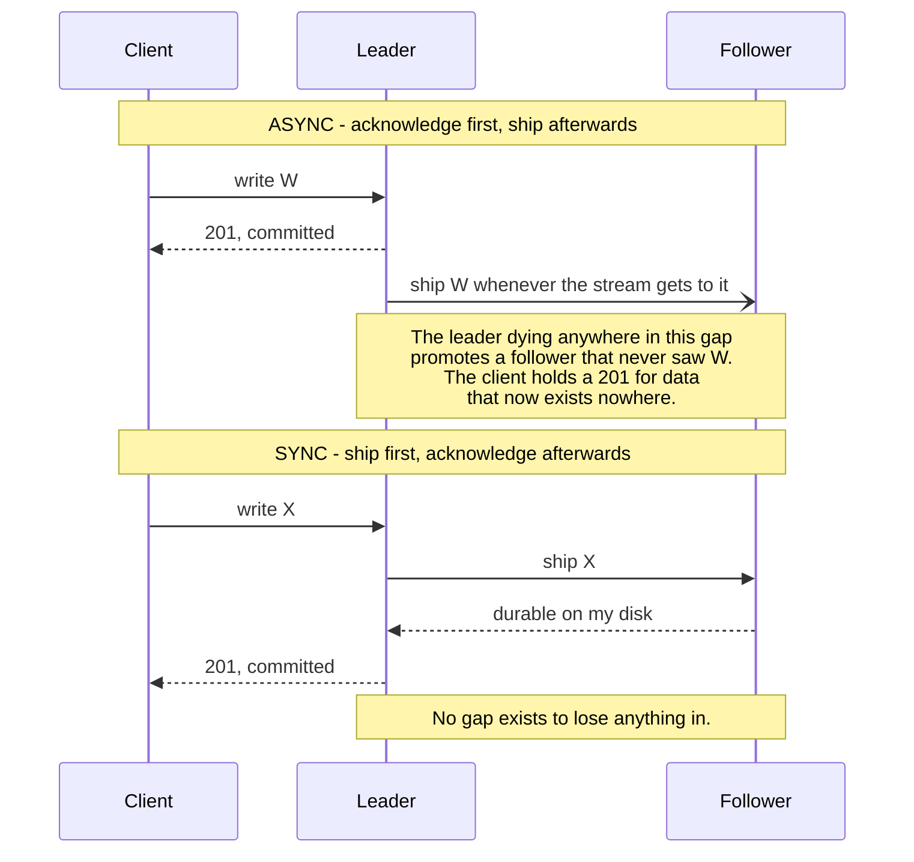
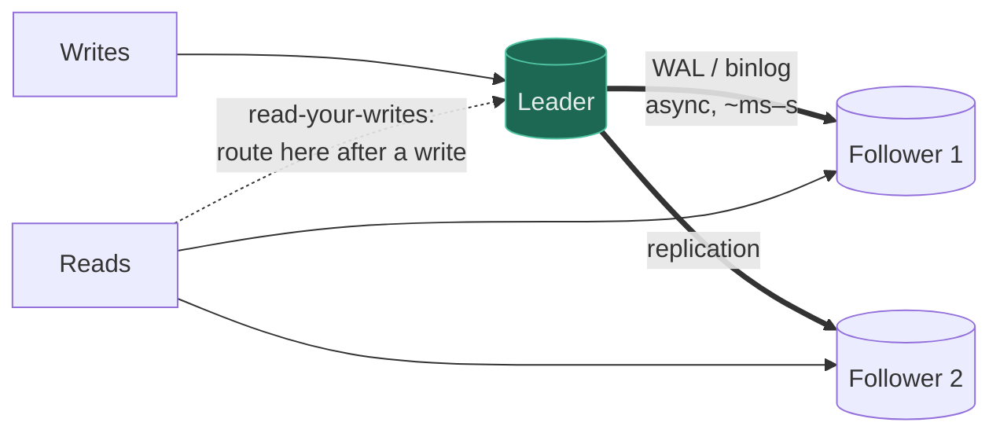
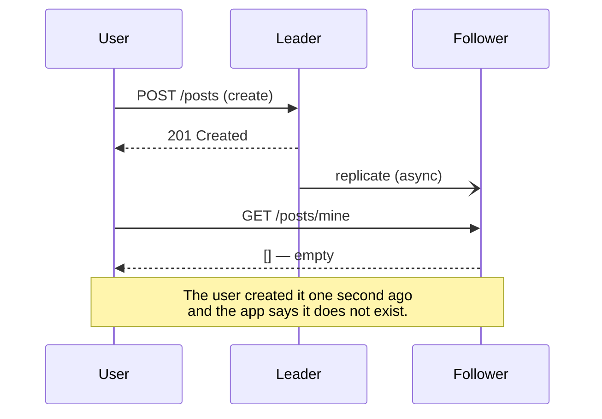
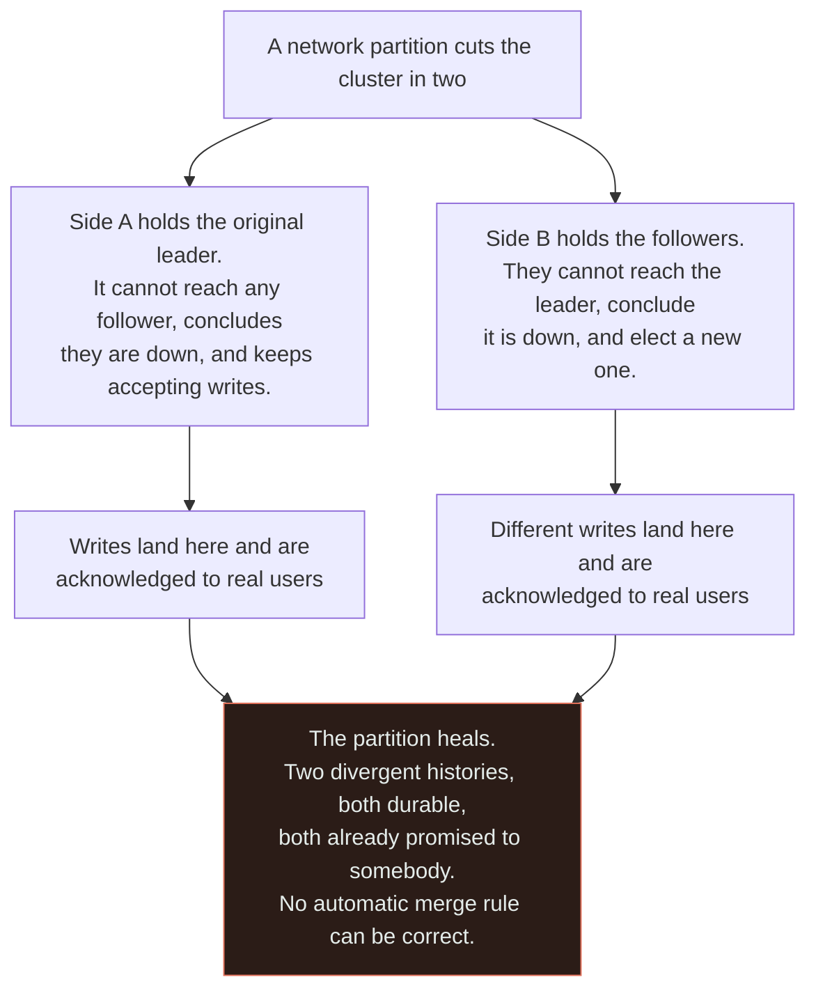

# Replication

`[INTERMEDIATE]` · Keep copies of the data on more than one machine. Buys read scale and availability. Costs you replication lag — and lag is where the bugs live.

---

## 1. One-line definition

Maintaining copies of the same data on multiple nodes, kept in sync by shipping changes between them.

## 2. Explain like I'm new

You photocopy the ledger and put a copy in three offices. Now three people can read at once, and
losing one office loses no information.

But when someone writes in the master ledger, the copies are **briefly wrong** — until the courier
arrives. Almost every problem with replication is a consequence of that gap, and the gap can never be
zero.

## 3. Real-world analogy

The couriered ledger copies above.

**Where it breaks:** a courier delivers pages in order. Real replicas can receive updates out of
order, or receive them from two different masters, and then disagree about which write came last.

## 4. Technical explanation

Three topologies, and the choice determines what problems you get:

| | **Leader–follower** | **Multi-leader** | **Leaderless** |
|---|---|---|---|
| Writes go to | One node | Several nodes | Any node |
| Conflicts | Impossible | **Possible; must be resolved** | Possible; resolved by quorum + repair |
| Failover | Promote a follower | Already writable | Nothing to fail over |
| Complexity | Low | High | Medium |
| Use | **The default** | Multi-region writes, offline clients | Dynamo-style stores |

**Leader–follower is the default and covers most needs.** Multi-leader exists to solve one problem —
accepting writes in more than one place — and it introduces conflict resolution, which is genuinely
hard. Do not adopt it because it sounds more scalable.

### Synchronous versus asynchronous

This is the decision that actually matters:

| | Sync | Async |
|---|---|---|
| Leader waits for follower | Yes | No |
| Write latency | Leader + slowest follower + network | Leader only |
| Data loss on failover | **None** | **Everything in the lag window** |
| Availability | A slow follower slows all writes | Followers cannot affect writes |

**Semi-synchronous is the usual compromise**: one follower acknowledges synchronously, the rest catch
up asynchronously. You keep durability against a single-node loss without letting the slowest replica
set your write latency.



The data-loss window is not an abstract risk — it is **the visible distance between the acknowledgement
arrow and the shipping arrow**, and it is measured in whatever your current replication lag happens to
be. The second half shows that sync does not remove that cost so much as relocate it: it moves out of
a rare failover and into every single write, where a slow follower now slows all writers. That is the
whole reason semi-sync exists.

## 5. Engineering at scale

**Replication lag is not a bug to be fixed; it is a property to be bounded and stated.** Under normal
load it may be milliseconds. Under a write spike, a long-running query on the follower, or a network
hiccup, it can become minutes — and it is precisely when the system is under stress that lag is
worst, which is also when users notice.

**Replicas scale reads, not writes.** Every replica applies *every* write. Ten replicas do ten times
the write work in total, and each still does 100% of it. If writes are the bottleneck, replication
makes it slightly worse; you need [sharding](../sharding/).

## 6. The problem it solves

Read throughput, availability under node failure, and durability against losing one machine's disk.
Also geographic latency, by putting a copy near the reader.

## 7. The problem it does NOT solve

Write throughput. Storage capacity. And it does not protect against logical errors: a `DELETE`
without a `WHERE` clause replicates perfectly to every copy in milliseconds. **Replication is not a
backup** — backups protect against mistakes, replicas faithfully reproduce them.

---

## 9. How it works



The leader's write-ahead log *is* the replication stream. The same mechanism that makes a single
database crash-safe makes replication possible — and makes
[change data capture](../../13-design-patterns/CATALOGUE.md#distributed-systems-patterns) possible on
top of it.

## 10. The bug you will hit



**Read-your-writes** is the guarantee being violated, and this is the single most common consistency
bug in any system with replicas. Three fixes, cheapest first:

1. **Route reads to the leader for N seconds after a write** — simple, effective, mildly wasteful
2. **Pin the session to a replica that has caught up** — needs lag tracking per replica
3. **Pass the write's log position** with the read and wait for the replica to reach it — most
   precise, most machinery

You do not need full strong consistency to fix this. That is the point worth remembering: the
*visible* symptom has a cheap fix.

## 13. When to use it

- Reads exceed what one machine serves
- You need to survive losing a machine without losing data
- Users are geographically spread and reads can be local
- You want a copy to run expensive analytics against, off the hot path

## 14. When NOT to

- **Writes are the bottleneck** — replication does not help; [shard](../sharding/)
- Data must never be stale anywhere and you cannot afford sync latency
- One machine is genuinely enough — a replica adds a failure mode and an operational burden
- **As a substitute for backups.** It is not one.

## 17. Trade-offs

| Choose | Get | Pay |
|---|---|---|
| Async replication | Fast writes; followers cannot slow you | Data loss window on failover |
| Sync replication | No data loss | Every write waits for the slowest follower |
| Semi-sync | Most of the durability, most of the speed | Still a window if the sync follower also fails |
| More replicas | More read capacity, more redundancy | Every replica applies every write; more lag surface |
| Multi-leader | Writes in several regions | **Conflict resolution**, which is genuinely hard |
| Reads from replicas | Read scale | Stale reads; read-your-writes breaks |

## 19. Failure scenarios

| Failure | What happens | Mitigation |
|---|---|---|
| Leader dies (async) | Writes in the lag window are **lost** | Semi-sync for data that cannot be lost |
| Follower falls behind | Users read increasingly stale data | Alert on lag; remove the replica from rotation past a threshold |
| **Split brain** | Two nodes both believe they lead; both accept writes | Quorum-based election, fencing tokens |
| Failover to a stale replica | Silent data loss | Only promote a replica within a lag bound |
| Replication stream breaks | Follower drifts indefinitely, silently | Monitor lag *and* stream health — a stopped stream shows 0 lag |
| Logical error replicated | `DELETE` with no `WHERE` on every copy | Backups; delayed replica |
| Read-your-writes violated | User does not see their own action | Route to leader after write |

**A stopped replication stream can report zero lag**, because lag is often measured as the difference
between the last received and last applied position. If nothing is being received, those are equal.
Monitor stream health separately.

A **delayed replica** — one deliberately kept an hour behind — is an underused defence against the
logical-error row. It gives you an hour to notice the bad `DELETE` and recover from a live database
rather than from backup.

The split-brain row is the one worth drawing, because both halves of the system are behaving correctly:



Read the two middle branches as **identical reasoning from identical evidence**: neither side has a bug,
because "the other nodes are dead" and "the other nodes are unreachable" produce exactly the same
observations. That is why the fix cannot be smarter detection. A quorum rule makes the minority side
refuse writes even though it believes it is right, and fencing tokens stop the deposed leader's
in-flight writes from landing after the new one starts — both work by removing the ambiguity, not by
resolving it.

## 25. Without it → With it → New problem → Next

```
Without it   →  one machine serves all reads and its loss loses data
With it      →  read scale, and survival of a node failure
New problem  →  replication lag: replicas disagree with the leader, and users
                stop seeing their own writes
Next         →  read-your-writes routing, then a consistency model chosen per
                dataset; and sharding if it was writes that were the problem
```

## 26. Combination patterns

- **[Database + replica](../../14-component-combinations/MATRIX.md)** — read scale and its lag cost
- **[Shard + replica](../../14-component-combinations/MATRIX.md)** — the standard large-database shape
- **[Cache + replica](../../14-component-combinations/MATRIX.md)** — two staleness windows stacked; users can see data older than either bound alone

## 28. Common mistakes

| Mistake | Why it is wrong |
|---|---|
| Treating replication as backup | It replicates your mistakes perfectly |
| Reading from a replica right after writing | The empty-list bug |
| Async replication for data that cannot be lost | The failover window loses acknowledged writes |
| Not alerting on lag | Staleness grows silently until users complain |
| Promoting any replica on failover | May promote a badly lagging one |
| Adding replicas to fix write load | Every replica does 100% of the writes |
| Multi-leader without a conflict strategy | Default last-write-wins silently discards data |

## 29. Monitoring

Replication lag per replica, with a threshold derived from your stated consistency window — if you
promised 30 seconds, alert at 10. Replication **stream health** separately, because a dead stream can
read as zero lag. Failover events and their duration. On multi-leader setups, count conflict
resolutions: a rising count means real data is being merged, or quietly dropped.

## 31. Exercises

**1.** Your leader dies with 2 seconds of replication lag, under async replication. What exactly have
you lost, and who was told otherwise?

<details><summary>Answer</summary>

Every write acknowledged in that 2-second window. Those users received a `201` or a success screen
for data that no longer exists anywhere, which is worse than an error would have been — a loud
failure can be retried and a silent one propagates.

That is the async bill, stated plainly: fast writes, in exchange for a data-loss window on failover.
**Semi-synchronous is the usual compromise** — one follower acks synchronously, the rest catch up —
so you keep durability against a single-node loss without letting the slowest replica set your write
latency. Whichever you pick, the acceptable window should be a number someone agreed to.
</details>

**2.** A user creates a post, is shown `201 Created`, immediately loads their own list, and it is
empty. Give three fixes, cheapest first.

<details><summary>Answer</summary>

**Read-your-writes** is the guarantee being violated — see [§10](#10-the-bug-you-will-hit). Cheapest
first: route that user's reads to the leader for N seconds after a write; pin the session to a
replica known to have caught up; or pass the write's log position with the read and wait for the
replica to reach it.

The point worth keeping is that none of these is strong consistency. The visible symptom has a cheap
fix, and reaching for [linearizability](../../00-foundations/consistency/) to solve it is paying a
permanent latency cost for a routing problem.
</details>

**3.** Writes are the bottleneck. An engineer adds three read replicas. What happens?

<details><summary>Answer</summary>

It gets slightly worse. **Every replica applies every write**, so you have tripled the total write
work in the system and added three streams that can lag, while the leader — which is the thing that
was saturated — has exactly as much write capacity as before.

Replicas scale reads. When writes or storage are the constraint the answer is
[sharding](../sharding/), and confirming which of the two you actually have is one measurement, not a
debate.
</details>

**4.** Your lag dashboard reads 0 ms and users are reporting stale data. How?

<details><summary>Answer</summary>

The replication stream has stopped. Lag is commonly computed as the difference between the last
position **received** and the last position **applied** — and if nothing is being received, those two
are identical, so a dead stream reports perfect health.

Monitor stream health as a separate signal from lag, and alert on both. This is the failure that
looks fine on every dashboard right up until someone opens a ticket, which makes it one of the more
expensive ones on [§19](#19-failure-scenarios).
</details>

**5.** One machine serves all your reads at 20% CPU. An engineer proposes a read replica "for safety".
Do you approve it?

<details><summary>Answer</summary>

Not for read scale — there is no read problem, and a replica would add an operational burden, a new
failure mode, and the read-your-writes bug above in exchange for capacity you are not using.

If the goal is surviving a machine loss, that is a real argument, but price it against tested backups
and a documented restore first, and be explicit that **a replica is not a backup**: a `DELETE` with no
`WHERE` reaches every copy in milliseconds. A *delayed* replica, deliberately kept an hour behind, is
the underused version of this proposal and defends against the failure a normal replica cannot.
</details>

## 32. Decision checklist

- [ ] Sync/async chosen against a stated acceptable data-loss window
- [ ] Read-your-writes handled wherever users write then read
- [ ] Lag monitored **and** stream health monitored separately
- [ ] Failover only promotes replicas within a lag bound
- [ ] Failover has actually been executed at least once, deliberately
- [ ] Real backups exist in addition to replicas
- [ ] A delayed replica considered as protection against logical errors

## 33. Related

- [Observability](../../11-observability/) — how you would know any of this broke
- [Database](../fundamentals/) — step 4 of scaling reads
- [Sharding](../sharding/) — the answer when writes are the problem
- [Consistency](../../00-foundations/consistency/) · [Availability](../../00-foundations/availability/)
- [Glossary: read replica](../../GLOSSARY.md#read-replica)

<!-- PATH:BEGIN -->

---

<sub>**The reading path** · step 15 of 27 · *Replication*</sub>

◀ **Previous** [Database](../../05-databases/fundamentals/README.md) &nbsp;·&nbsp; **Next** [Sharding](../../05-databases/sharding/README.md) ▶

<!-- PATH:END -->
