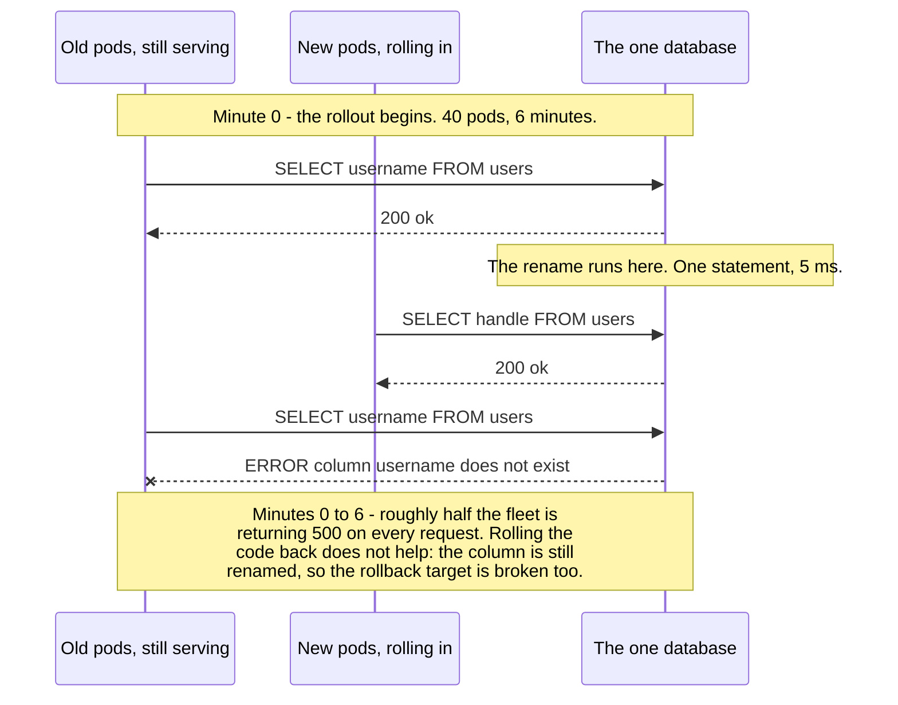
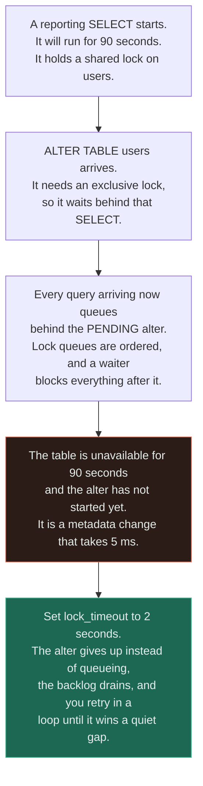
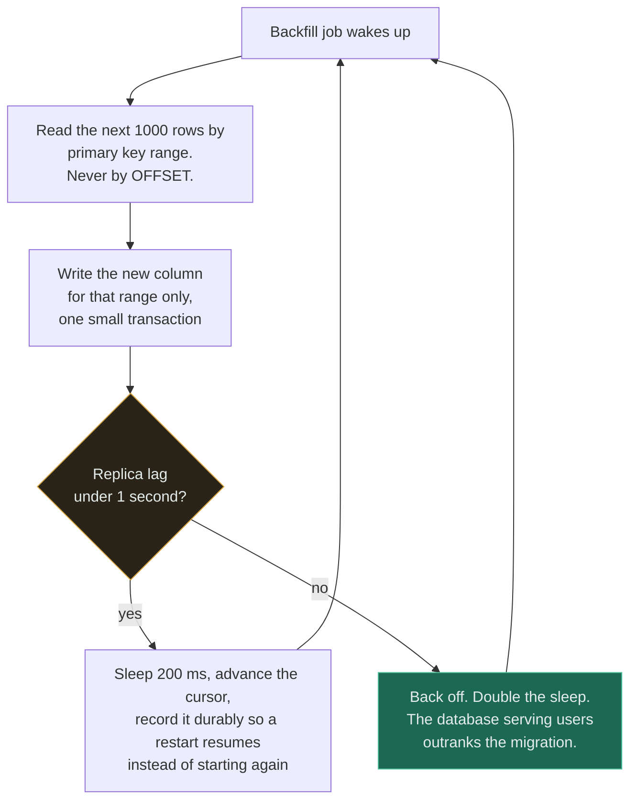
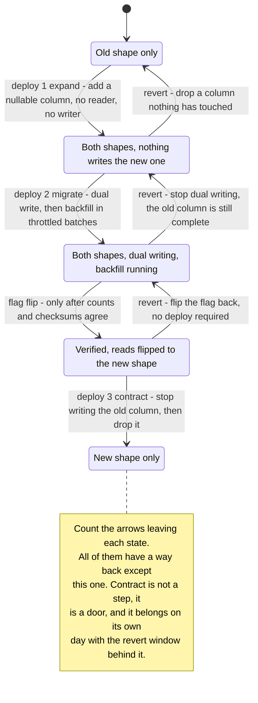

# Schema Migration

`[ADVANCED]` · A deploy is not an instant, it is a window — and for the length of that window the old code and the new code are talking to the same database, so the schema must satisfy **both versions at once**. Every safe migration is three deploys because of that one fact.

---

## 1. One-line definition

Changing the structure or the contents of a database that is currently serving traffic, without
downtime and without giving up the ability to go back.

## 2. Explain like I'm new

You want to rename a column from `username` to `handle`. The obvious move is one change: rename the
column, ship the code that uses the new name, done.

It does not work, and it does not work in **either order**. Your application does not restart
everywhere at the same moment — it rolls out pod by pod over several minutes. Rename the column
first, and every server still running the old code asks for `username` against a table that no longer
has one. Ship the code first, and every new server asks for `handle` against a table that does not
have one yet. There is no ordering that avoids this, because for the duration of the rollout **both
versions are live and both are hitting the same database**.

So you stop trying to move between two shapes and instead pass through a third shape that both
versions can live with. Add `handle` alongside `username`. Write to both. Copy the history across.
Check it. Only then start reading `handle`. Only much later drop `username`.

That is five steps and three deploys to rename a column, and it is not ceremony — it is the smallest
sequence in which no running version of your code ever meets a schema it was not built for.

## 3. Real-world analogy

Renumbering the platforms at a railway station that cannot close. You do not repaint the signs
overnight. You add the new numbers beside the old ones, print both on tickets for a season, and take
the old numbers down once nothing in circulation refers to them.

**Where it breaks:** the station has a passenger in the loop who can read both signs and work it out,
and a member of staff on the concourse for the awkward week. Your old application version can do
neither. It was compiled against one schema, it will throw on anything else, and you cannot patch it
— it shipped months ago and the whole point is that it is still running. The ambiguity a human
resolves in a second is an unhandled exception in production, repeated at the request rate. The
analogy also flatters the timeline: a station renumbering is a plan with an end date, whereas a
half-finished migration is a state a real system will happily sit in for a year while everyone
forgets which shape is authoritative.

## 4. Technical explanation

### Two different operations wearing one name

| | **Schema migration** | **Data migration** |
|---|---|---|
| Changes | Structure — a DDL statement | Contents — rows |
| Duration | Milliseconds to hours | Hours to weeks |
| Fails by | Taking a lock and blocking the table | Saturating I/O and starving live traffic |
| Correct pacing | **As fast as possible**, lock held briefly | **Deliberately slow**, throttled against live load |
| Where it runs | A gated pipeline step, once | A resumable background job |
| Rollback | A reverse DDL, if one exists | Usually free — the old column is still there |
| Interruptible | No — half an `ALTER` is not a state | Yes, and it will be, several times |

**Conflating these two is how a five-second deploy becomes a forty-minute outage.** A backfill written
inside a migration script runs in the deploy pipeline, at full speed, against production, holding
whatever lock the framework took, with a pipeline timeout as its only safety limit. They are opposite
operations with opposite correct behaviours and they belong in different places.

### The overlap window — the fact people miss



There is no ordering of those two changes that works, and that is the whole point. The final note is
the part that turns a bad deploy into an incident: the reflex under pressure is to roll the code
back, and **the rollback restores the half that was never the problem.** A schema change is the one
kind of change your deploy tooling cannot undo for you.

### Which operations lock, and which do not

This is the most engine-specific table in this repository, and it is version-specific inside each
engine. Treat it as a list of questions to ask your own documentation, not as an answer.

| Operation | PostgreSQL | MySQL / InnoDB | The catch |
|---|---|---|---|
| Add a nullable column, no default | Metadata only, instant | Instant, in place | Safe nearly everywhere — the one genuinely cheap change |
| Add a column with a constant default | Instant since PG 11 | Instant since 8.0 | **Rewrote the entire table on older versions.** Check your version, not the blog post |
| Add a column with a volatile default | Full rewrite | Full rewrite | Add nullable, backfill, then set the default |
| Add `NOT NULL` to an existing column | Full scan under an exclusive lock | Rewrite | Add a `CHECK ... NOT VALID`, `VALIDATE` separately, then convert |
| Drop a column | Metadata only, instant | Instant with the right algorithm, rewrite otherwise | Instant does not mean safe — see the rollout window above |
| Rename a column or table | Instant | Instant | **The lock is not the danger here. The rollout is** |
| Create an index | Blocks writes unless built concurrently | Online since 5.6 | A concurrent build cannot run inside a transaction and can leave an invalid index behind on failure |
| Change a column type | Rewrite, usually | Rewrite, usually | Widening is sometimes free; narrowing never is. Use add-copy-swap |
| Add a foreign key | Locks both tables to validate | Locks both tables | Create it unvalidated, validate as a separate throttled step |
| Add a `CHECK` constraint | Full scan under an exclusive lock | Full scan | Same pattern: create unvalidated, validate later |

Two rules survive every engine. **Instant is a statement about work, not about waiting** — and a
change that rewrites the table is proportional to rows, so it is invisible on a staging database with
a thousand of them.

### The lock queue — why "instant" is not the same as "safe"



Read the third box carefully: the outage is not caused by the `ALTER` **running**, it is caused by the
`ALTER` **waiting**. A pending exclusive lock request sits at the head of the queue and everything
behind it waits too, so a five-millisecond metadata change inherits the duration of the longest
transaction already open on that table. `lock_timeout` plus a retry loop converts an outage into a
migration that occasionally has to try again, which is why it is not a tuning knob.

## 5. Engineering at scale

**Backfills must be batched, throttled, and resumable — in that order of importance.** An unthrottled
`UPDATE ... WHERE new_col IS NULL` over 400 million rows is one transaction, one enormous write-ahead
log, one very long lock, and a rollback that takes longer than the statement did. It is also pointed
at the exact database that is serving your users.



The edge that matters is the one from the lag check back to the top: **a backfill without a feedback
signal is an unbounded write workload aimed at production, and it will finish.** Replica lag is the
right signal because it is the first thing to move and it is already the input to your read-path
correctness — see [replication](../replication/). Note the durable cursor too: this job will be
interrupted, probably more than once, and a backfill that cannot resume gets restarted from zero or,
worse, silently half-applied. Chunking by primary-key range rather than `OFFSET` is the same argument
as in [pagination](../../07-api-design/pagination/) — an offset re-scans everything before it, and
shifts underneath you when rows change.

**Verification is the step everyone skips, and it is the only one that catches a silent problem.**
Every other step announces its own failure: a bad DDL errors, a failed deploy rolls back, a saturated
backfill pages you. A dual-write that dropped 0.2% of updates because of a retry race produces no
error anywhere. You find out when you switch reads and the wrong data is already on screen.

Verification means, at minimum: row counts on both shapes taken against the same snapshot; an
aggregate checksum over the pair; and a sampled row-by-row diff. Better, run a **shadow read** — for
a period, serve from the old shape but also read the new one, compare, and emit a divergence metric
without changing the response. That turns a one-off gate into a continuous signal, and it is the only
way to catch a dual-write race, because a race by definition does not reproduce on demand.

**Dual-writing is two writes with no transaction between them.** If they are two columns in one table
it is one statement and you are fine. If they are two tables, two databases, or a database and a
search index, then a crash between them leaves you inconsistent and the reconciliation job is not
optional. Prefer, in order: one statement; one transaction; the database's own change stream
[CDC](../../13-design-patterns/CATALOGUE.md) driving the copy; and only then application-level
dual-write with a repair job behind it.

**Under [sharding](../sharding/), partially applied is the normal state, not the failure state.** A
migration across 64 shards will be applied to 61 of them at some point, and three will have failed on
a lock timeout. The application must tolerate both shapes on different shards simultaneously —
usually meaning the read switch is a per-shard flag rather than a global one — and you need per-shard
tracking of what has actually landed, because "the deploy succeeded" says nothing about shard 47.

**Large table rewrites want a tool, not a statement.** `gh-ost`, `pt-online-schema-change` and the
equivalents build a shadow table, copy rows in throttled chunks, keep it current from the binlog or a
trigger, and finish with an atomic rename. That converts one long exclusive lock into a long,
observable, pausable copy plus one instant swap. The costs are real — double the disk for the
duration, trigger or replication overhead on every write, and the rename itself is a cutover with its
own lock — but for a multi-hour rewrite on a hot table it is the difference between a project and an
outage.

**Leave a real revert window between the deploys.** The expand and contract steps exist to be
separated in time. Shipping both in the same release restores the exact property you spent three
deploys avoiding, and the interval needs to be long enough that a problem would actually have
surfaced — at least one full traffic cycle, including the weekly peak and the monthly batch job.

## 6. The problem it solves

Changing a live schema without downtime, and keeping a way back at every step. Concretely: it removes
the requirement for a maintenance window, and it makes each individual change small enough that its
blast radius is knowable.

## 7. The problem it does NOT solve

**It does not make a bad model good.** A migration is how you travel between models; it has no
opinion on the destination. Arriving at a second wrong shape is a common and expensive outcome — see
[data modelling](../data-modelling/).

It also does not give you:

- **A transaction spanning deploys.** Nothing holds the intermediate state together except your
  discipline. There is no rollback of a half-finished sequence, only a forward or backward step.
- **Coordination across services.** If another team's service reads your table, expand–contract
  inside your repository is not sufficient — their deploy schedule is now part of your migration.
  That is an interface problem, and it wants the same shape one level up; see
  [versioning](../../07-api-design/versioning/).
- **Protection from the contract step.** Dropping a column is destructive and no amount of process
  changes that. It is a one-way door with a nicer approach path.
- **A substitute for backups.** Every step above assumes the data still exists. Verify that a restore
  works *before* the migration, not after you need it.
- **Immunity to the ORM.** Frameworks generate DDL, not lock analysis. They will happily emit a
  rename.

---

## 9. How it works

Five steps, three deploys, one flag flip. The flag matters: it is the only step that can be reverted
in seconds rather than in a deploy cycle, which is why the riskiest transition is deliberately placed
there.

| # | Step | Schema | Code | Reverted by |
|---|---|---|---|---|
| 1 | **Expand** | Add the new column, nullable, no default | Unchanged | Dropping a column nothing has ever touched |
| 2 | **Dual-write** | None | Writes go to both shapes; reads still use the old | Deploying the previous version — the old shape never stopped being complete |
| 3 | **Backfill** | None | A throttled, resumable job fills history | Nothing to revert; it only ever writes the new shape |
| 4 | **Verify, then switch reads** | None | Flag flip: reads come from the new shape | Flipping the flag back. Seconds, no deploy |
| 5 | **Contract** | Drop the old column | Stop writing the old shape | **Nothing. This is the one-way door** |



**The revert arrows are the design, not a safety feature bolted on afterwards.** Read the diagram by
asking, at each state, "what do I do at 03:00 if this is wrong" — and note that the answer is
different at every stage and never involves a database restore. Note also what step 5 costs: once
taken, a rollback of the *application* to any version older than deploy 3 will meet a schema missing
the column it expects. That is why contract lags expand by weeks and not by minutes.

### Renaming, specifically

A rename is the classic irreversible mistake because it looks like the cheapest possible DDL. It is
instant, it is one line, and it is the only operation on the page that breaks a rolling deploy in
both directions simultaneously. The reversible equivalent is **add, copy, swap, drop** — the exact
five steps above, where the "new thing" happens to hold the same data under a different name. It is
four deploys' worth of effort to achieve a cosmetic improvement, which is usually the argument for
not renaming at all.

## 13. When to use it

Use the full expand–contract sequence when **any** of these hold:

- The table has live traffic and the deploy is rolling rather than atomic
- Another service, job or report reads the same table
- The change is destructive — dropping, renaming, narrowing a type, tightening a constraint
- The table is large enough that a rewrite is measured in minutes
- You cannot take a maintenance window, or you can but do not want to spend it here
- The change needs a data transform, not just a structural one

Use a **single deploy** when the table is new and nothing reads it yet, when the change is purely
additive and nullable, or when the system genuinely has no traffic at that moment and you can prove
it. Adding an unused nullable column is one deploy and should stay one deploy.

## 14. When NOT to

- **Do not run the full ceremony on a table nobody reads.** Three deploys to add a column to a table
  created last Tuesday is process for its own sake, and it teaches the team that the process is
  theatre — which is how it gets skipped when it matters.
- **Do not run a backfill inside the migration script.** Different operation, different pacing,
  different place.
- **Do not rename.** Ever, on a live table. Add, copy, swap, drop.
- **Do not migrate during peak**, and do not migrate during the window in which nobody who understands
  it is awake.
- **Do not contract in the same release as you expand.** The gap *is* the mechanism.
- **Do not take the zero-downtime path when you can simply take the downtime.** A ninety-second
  maintenance window at 04:00 on a Sunday for an internal tool is a legitimate engineering answer and
  costs a fraction of this.
- **Do not migrate to fix a query.** Read the plan first — the answer is frequently an index, which is
  reversible in an afternoon.

## 17. Trade-offs

| Choose | Get | Pay |
|---|---|---|
| Expand–contract | Zero downtime; a revert at every step | Three deploys, three reviews, weeks of elapsed time, two shapes to reason about |
| One-step change with downtime | Simple, fast, one review, one thing to test | An outage window — and it must be one the business will actually grant |
| Dual-write in the application | Full control; works across engines and across stores | Two writes with no transaction between them; they can and will diverge |
| Dual-write via CDC or triggers | The database guarantees the copy | Overhead on every write; another moving part in the hot path |
| Online schema-change tool | Big rewrites with no long lock; pausable and observable | Double the disk; write amplification; the final rename is its own cutover risk |
| Throttled backfill | Live traffic is unaffected | Days of runtime, and a job that can be forgotten half-done |
| Fast backfill | Finished tonight | You have chosen to have tonight's incident |
| Verification before the read switch | Divergence found by a job, in daylight | An extra step, and usually an extra week |
| Skipping verification | One less step | You find out from users, after the switch, with both shapes already in use |
| Feature-flagged read switch | Revert in seconds without a deploy | Flag infrastructure, and a flag someone must remember to remove |

## 18. Why not?

| Alternative | Why not here | When it WOULD win |
|---|---|---|
| **A maintenance window** | Most consumer products cannot take one, and it concentrates rather than removes the risk | **Internal systems, batch-shaped businesses, off-peak regional products** — it is far simpler, so take it whenever you can |
| Blue/green with two databases | Two live databases and no shared write path; the data has to converge somehow | A major version upgrade or an engine change, where the schema change is not the point |
| Move to a schemaless store | The schema does not go away, it moves into application code where nothing enforces it | The shape is genuinely variable — see [data modelling](../data-modelling/) |
| A brand-new table plus a read fallback | Fallback logic on the read path, indefinitely, and two sources of truth | A change so large the old and new shapes have no row-level correspondence |
| Version the API and leave the schema | The schema still ages; you have deferred the cost, not removed it | The consumer contract is the real constraint — see [versioning](../../07-api-design/versioning/) |
| Let the ORM auto-migrate on start-up | It generates DDL, not a lock plan, and every pod races the others | Local development, and nowhere else |
| Do nothing; add a nullable column and move on | Accumulates until the model is unreadable and every query has a special case | **More often than people admit** — an unused column costs almost nothing, and the migration to remove it costs three deploys |

The first row deserves more respect than it usually gets. Expand–contract exists because downtime is
unaffordable, and when downtime *is* affordable it is an elaborate way of avoiding a cheap thing. The
question to ask before starting is not "how do we do this with zero downtime" but "what would ninety
seconds of downtime actually cost us", and the answer is sometimes "nothing".

## 19. Failure scenarios

| Failure | What happens | Mitigation |
|---|---|---|
| **`ALTER` queues behind a long transaction** | The waiter blocks everything behind it; the table is down while nothing is running | Low `lock_timeout` plus a retry loop; kill long transactions first; never migrate behind a running report |
| **A column is renamed in one deploy** | Half the fleet 500s for the length of the rollout, and rolling the code back does not restore it | Add, copy, swap, drop |
| Backfill runs unthrottled | I/O saturates, replica lag climbs, live queries time out | Batch, sleep, and throttle on replica lag |
| Backfill chunks by `OFFSET` | Cost grows with depth and rows shift underneath it, so some are never written | Chunk by primary-key range — see [pagination](../../07-api-design/pagination/) |
| Backfill has no durable cursor | An interruption restarts from zero, or resumes at the wrong place | Persist the cursor with each batch; make the write idempotent |
| Dual-write partially fails | The two shapes diverge silently; no error is raised anywhere | Verification and a continuous divergence metric; a repair job |
| New column added `NOT NULL` with no default | Every insert from the still-running old code fails immediately | Nullable first, backfill, constraint last |
| Reads switched before the backfill finished | Nulls and defaults are served as if they were real values | Gate the switch on a verified count, not on a person's belief |
| Contract shipped too early | The read switch can no longer be reverted; the rollback target no longer parses | A revert window of at least one full traffic cycle |
| Applied to some shards only | Partially applied is the normal state, and code that assumes otherwise breaks on shard 47 | Per-shard tracking; a per-shard read flag — see [sharding](../sharding/) |
| Migration runs as an app start-up hook | Forty pods race the same DDL; health checks time out; the orchestrator restarts them mid-lock | Migrations are their own pipeline step, gated and run once |
| Rollback of code without rollback of schema | Fine after expand, fatal after contract | The separation of the two deploys is exactly what makes this survivable |
| **Slow, not down** | The DDL completes but statistics are stale, plans flip, and p99 quietly triples | Analyse the table afterwards; watch latency per query shape, not the aggregate |
| Verified once, at the end | A dual-write race does not reproduce on demand and will not appear in a single check | Shadow reads with a divergence metric, running for the whole dual-write period |

---

## 25. Without it → With it → New problem → Next

```
Without it   →  every structural change needs downtime, and any change shipped in
                one deploy breaks half the fleet against a shape it was not built
                for, for the length of the rollout
With it      →  structure and data change under live traffic, and every step is
                independently deployable and independently revertable
New problem  →  one change is now three deploys over weeks; two shapes must be kept
                in step by application code with no transaction between them; and a
                half-finished migration is a stable state the system will sit in
Next         →  a throttled, resumable backfill; a verification step comparing counts
                and checksums before the read switch; a feature flag on the switch;
                and per-environment, per-shard tracking of what has actually landed
```

This is the chain in miniature — the fix for downtime buys you a distributed operation with partial
failure, which then needs its own machinery. See
[the chain](../../SYSTEM-DESIGN-THINKING.md#part-1--the-chain).

## 28. Common mistakes

| Mistake | Why it is wrong |
|---|---|
| Renaming a column on a live table | Breaks the rollout in both directions and there is no revert that does not lose writes |
| Shipping code and schema in one deploy | The deploy is a window, not an instant; both shapes coexist for minutes |
| Backfilling inside the migration script | Holds the deploy lock and runs at full speed against production |
| No `lock_timeout` on DDL | One long-running `SELECT` converts a metadata change into a table-wide outage |
| Adding the column and the `NOT NULL` in one statement | Every insert from the still-running old code fails |
| Trusting the framework's generated migration | It writes the DDL; it does not know what locks or how long |
| Reading the docs for a different engine version | "Adding a column with a default is instant" is version-specific and was once simply false |
| Testing the migration against an empty table | Locks and rewrites are proportional to rows; a thousand-row test proves nothing |
| Skipping verification | The only place divergence is visible before users see it |
| Verifying with a row count alone | A count proves every row has a value, not the right one |
| Contract in the same release as expand | Discards the revert path the whole sequence exists to create |
| No way to resume a half-finished backfill | It will be interrupted; plan for the third restart, not the first |
| Assuming the migration ran because the deploy passed | Track applied state per environment and per shard, explicitly |
| `UPDATE` with no bound on the row count | One statement, one giant transaction, one long lock, and a rollback that is slower still |
| Leaving the flag and the old column forever | The intermediate shape becomes permanent, and the next migration starts from a worse place |

## 29. Monitoring

**Lock wait time and the number of queries waiting on a lock are the two metrics that turn the worst
failure on this page into a pageable event before it becomes an outage.** Nothing else moves first.
Alert on the count of sessions blocked for more than a couple of seconds, and expose the oldest
running transaction as a standing gauge — it is the direct input to whether a DDL is safe right now.

Alongside those: replica lag throughout the backfill, since it is both the throttle input and the
alarm; backfill progress expressed as rows remaining and an estimated completion, because a backfill
without an ETA is one nobody will finish; divergence count from the shadow-read comparison, run
continuously rather than once; and error rate **broken out by application version** during the
rollout window, because an aggregate averages the broken half of the fleet with the working half and
reports something unremarkable. Track the elapsed time between the expand and contract deploys too —
if it is trending towards zero, the process has quietly become theatre. See
[observability](../../11-observability/).

## 31. Exercises

**1.** `ALTER TABLE users ADD COLUMN email_verified boolean NOT NULL DEFAULT false;` against a
400-million-row table under live traffic. It ran in 80 ms on staging. What do you check before
running it, and what can production do that staging cannot?

<details><summary>Answer</summary>

Two independent risks, and staging shows neither.

First, the **rewrite**. On older engine versions, adding a column with a default rewrote every row —
80 ms on a staging table with ten thousand rows becomes tens of minutes on 400 million, under an
exclusive lock. Modern PostgreSQL and MySQL make a constant default a metadata change, but that is a
property of your exact version, so check it there rather than in a blog post.

Second, and present even when the change genuinely is instant: the **lock queue**. The statement needs
an exclusive lock, and it can only get one when no other transaction holds the table. Behind a
ninety-second reporting query it waits — and while it waits, every subsequent query queues behind
*it*. Staging has no ninety-second reporting query and no concurrent traffic to queue.

What to do: confirm the behaviour for your version; set a short `lock_timeout` and retry in a loop so
the statement gives up rather than blocking the queue; check for long-running transactions first and
be willing to terminate them; run off-peak. Note the `NOT NULL` here is safe *because* there is a
default — old code that does not set the column still inserts fine. Without the default it would fail
every insert from the old version instantly.
</details>

**2.** Product wants `username` renamed to `handle`. Rolling deploy, 40 pods, about six minutes.
Explain why the one-step version fails in both possible orderings, then give the sequence you would
actually run.

<details><summary>Answer</summary>

Both orderings fail for the same reason: **the deploy is a window, and during it two versions of the
code share one database.** Rename first and the old pods query a column that no longer exists — 500s
until the last old pod is gone. Deploy the code first and the new pods query a column that does not
exist yet — 500s until the DDL runs. There is no ordering in which every live version sees a schema
it understands, because the two versions need different schemas.

Worse, the usual recovery makes it worse. Rolling the code back after the rename restores an old
version that also cannot see `handle`, so the rollback target is broken too. The only forward path is
to rename back, which is another DDL under pressure.

The sequence: **deploy 1** adds `handle` as a nullable column, with nothing reading or writing it —
revert is dropping an untouched column. **Deploy 2** writes both columns on every path and still
reads `username`; a throttled, resumable backfill copies history — revert is the previous version,
and `username` never stopped being complete. Then verify counts and checksums and run shadow reads.
**Flip a flag** to read `handle`; revert is flipping it back, in seconds. Then, after a full traffic
cycle, **deploy 3** stops writing `username` and drops it.

Worth saying out loud at the start: that is four changes and several weeks for a cosmetic improvement.
"We are not renaming it" is a legitimate outcome of this analysis.
</details>

**3.** The backfill has run for five days, is 60% complete, and replica lag spikes to 40 seconds every
evening. An engineer proposes raising the batch size tenfold to finish it tonight. Should you?

<details><summary>Answer</summary>

**No.** The evening spikes are the system telling you that the backfill plus the daily traffic peak
already exceed the available write capacity. Increasing batch size adds load to precisely the window
that is already saturated, and it will convert a lag spike into a timeout cascade.

Note also that 40 seconds of lag is not a cosmetic problem — anything served from a replica is already
40 seconds stale, so the product is degraded right now and nobody has connected the two facts.

The correct moves are the other direction: throttle *on* the lag signal rather than on a fixed batch
size, so the job backs off automatically instead of relying on someone watching; pause entirely during
the peak window; and confirm the job chunks by primary-key range rather than `OFFSET`, because an
offset-based backfill gets slower as it goes and would explain part of the five days.

The deeper point is that **there is no deadline here**. Deploy 1 has already shipped, the new column
is nullable, nothing reads it, and nothing depends on the backfill finishing until the read switch —
which is gated on verification anyway. Urgency has been invented. The only real risk of a slow
backfill is that it is forgotten, and the fix for that is a progress metric with an ETA, not a bigger
batch.
</details>

**4.** The backfill reports complete. Counts match exactly: 412,908,331 rows populated in the new
column, zero nulls. Is it safe to switch reads?

<details><summary>Answer</summary>

**Not yet.** A count proves every row has *a* value. It says nothing about whether it is the *right*
value, and every interesting failure mode here produces a full column with a perfect count.

Three of them, all real: a dual-write race where a read-modify-write on the old shape overwrote a
newer value on the new one; a backfill that wrote a fallback for rows whose source it could not parse,
because the alternative was crashing the job on row two million; and a transform bug applied uniformly
to all 412 million rows, which is the one a count can never see because it is perfectly consistent.

There is also a subtler problem with the count itself — taken at two different instants against a
live table, the two numbers are not comparable. Take both against the same snapshot or the same
transaction.

What actually gates the switch: an aggregate checksum over the pair of columns; a sampled row-by-row
diff, weighted towards recently-written rows where races concentrate; and a period of **shadow reads**
where you serve the old shape but also read the new one and emit a divergence metric. The shadow read
is the only one of the three that can catch a race, because a race does not reproduce on demand — it
has to be observed in the traffic that produces it.
</details>

**5.** The team runs migrations as a `migrate` command in the container's start-up script, so every
pod applies them before serving. What breaks, and what would you change?

<details><summary>Answer</summary>

Forty pods start and forty processes attempt the same DDL. Most frameworks take an advisory lock, so
thirty-nine of them block — and while they block they are not serving, so their start-up health checks
time out and the orchestrator kills and restarts them. That produces a crash loop *during* a
migration, which is the worst possible moment for it, and each restart re-queues behind the lock.

Even with perfect mutual exclusion the design is wrong, because it couples the migration to the
rollout. A migration taking four minutes means no pod becomes healthy for four minutes, so the
rollout stalls with capacity halved or the deploy times out mid-DDL. And it runs the migration at
whatever moment the scheduler happened to start a pod — including during an autoscaling event at
peak, or a node replacement at 03:00, neither of which anybody chose.

The change: migrations become their own gated pipeline step, run exactly once, before the application
rollout, with their own timeout, their own lock strategy and their own rollback plan. Application
start-up should *verify* that the schema is at the expected version and refuse to start on a mismatch
— checking is cheap and safe, applying is neither. This also makes the expand–contract sequence
expressible at all, since steps 1, 3 and 5 are not the same kind of event and cannot share one hook.
</details>

## 33. Related

- [Data modelling](../data-modelling/) — the migration takes you between models; this decides whether the destination is worth the trip
- [Databases](../fundamentals/) — locks, transactions and isolation, which is what a DDL is competing with
- [Replication](../replication/) — lag is the throttle signal for every backfill on this page
- [Sharding](../sharding/) — N databases to migrate, and partially applied is the normal state
- [Consistency](../../00-foundations/consistency/) — a dual-write is two writes with nothing spanning them
- [Pagination](../../07-api-design/pagination/) — why a backfill chunks by key range and never by offset
- [Versioning](../../07-api-design/versioning/) — the same expand–contract shape, one level up, for an interface
- [Observability](../../11-observability/) — lock waits and per-version error rates are the metrics nobody has
- [System design thinking](../../SYSTEM-DESIGN-THINKING.md) · [Pattern catalogue](../../13-design-patterns/CATALOGUE.md)
- [Glossary](../../GLOSSARY.md)
