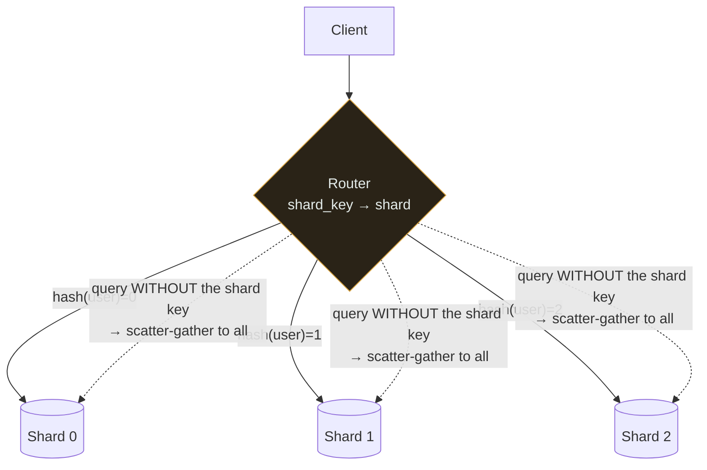

# Sharding ★

`[ADVANCED]` · Split data across machines by a key. Buys write scale and unbounded storage. Costs you cross-shard joins — and the shard key is effectively permanent.

---

## 1. One-line definition

Horizontally partitioning a dataset across multiple machines, each holding a disjoint subset.

## 2. Explain like I'm new

One filing cabinet is full. You buy four, and agree a rule: surnames A–F in cabinet one, G–M in two,
and so on.

Now four people can file at once, and you have four times the space. But **"list everyone who joined
in March" now means opening all four cabinets** and merging the results — a question that used to be
one lookup. And if half your customers are called Smith, cabinet four is overflowing while the others
sit empty.

Both of those problems are permanent features of the decision, not teething issues.

## 3. Real-world analogy

The cabinets above.

**Where it breaks:** you can re-label physical cabinets over a weekend. Re-sharding a live database
means moving terabytes while it is serving traffic, without losing writes. That is a project, not a
maintenance window.

## 4. Technical explanation

Sharding is **partitioning across machines**. Partitioning within one machine is a different thing
with a different cost profile — it helps query performance and does nothing for write throughput or
storage limits.

| Strategy | How | Good | Bad |
|---|---|---|---|
| **Range** | A–F, G–M… | Range scans work; easy to reason about | Hotspots — sequential keys all land on one shard |
| **Hash** | `hash(key) % N` | Even distribution | No range scans; **resharding remaps nearly everything** |
| **Consistent hash** | Hash onto a ring | Adding a node remaps only ~1/N | More complex; needs virtual nodes for balance |
| **Directory** | An explicit lookup table | Total flexibility; easy rebalancing | The directory is a new SPOF and a hot path |
| **Geographic** | By region | Data residency, local latency | Uneven population; cross-region queries are slow |

### Why `hash(key) % N` is a trap

With modulo, changing `N` changes the answer for almost every key:

```
N = 4  →  hash % 4        N = 5  →  hash % 5
key A: 3                  key A: 1     moved
key B: 0                  key B: 4     moved
key C: 2                  key C: 2     stayed
```

Adding one machine remaps roughly `(N-1)/N` of all keys — about 80% at N=5. Every one of those rows
must physically move before the system is correct again.

**Consistent hashing** places both keys and nodes on a ring; a key belongs to the next node clockwise.
Adding a node steals a contiguous arc from exactly one neighbour, so only ~1/N of keys move. Virtual
nodes (each physical node appearing many times on the ring) smooth the distribution.

## 5. Engineering at scale

**The shard key is the most consequential and least reversible decision in the whole design.** It
determines what queries remain possible. Changing it later means rewriting every row and, usually,
part of the application.

A good shard key has three properties, and they pull against each other:

1. **High cardinality** — enough distinct values to spread across shards
2. **Even distribution** — no value dominates
3. **Present in most queries** — otherwise every read is a scatter-gather

That third one is the trap. Shard by `user_id` and any query by `user_id` is a single-shard lookup —
fast, scalable. But "all orders placed today" now hits every shard and takes the slowest shard's
latency, every time. **You have optimised one access pattern and made all the others worse.**

## 6. The problem it solves

One machine's write throughput and storage capacity. These are the only two problems sharding solves,
and it is worth being strict about that, because it is frequently applied to problems it does not
address.

## 7. The problem it does NOT solve

It does not help read latency — [caching](../../04-caching/fundamentals/) and
[replicas](../replication/) do that. It does not improve availability; in the naive form it *reduces*
it, because now `N` machines must be up instead of one. And it does not fix a slow query — it
distributes it.

## 8. Why does this exist?

Because vertical scaling has a ceiling and data volume does not. When the working set exceeds what
one machine can hold, or write throughput exceeds what one machine can commit, there is no
alternative that preserves a single logical dataset.

---

## 9. How it works



The solid arrows are what sharding is for: one key, one shard, constant work regardless of how many
shards exist. The dashed arrows are what it costs — a query without the shard key must ask every
shard and wait for the slowest.

## 11. What you lose

| Lost | Why | Workaround |
|---|---|---|
| **Cross-shard joins** | Rows live on different machines | Denormalise; or join in the application |
| **Cross-shard transactions** | No single commit point | Saga with compensating actions; 2PC (which blocks) |
| **Global uniqueness** | No shard sees all values | UUIDs, or a dedicated ID service (Snowflake-style) |
| **Global secondary indexes** | An index by a non-shard-key spans shards | A separate index shard; or a search index |
| **`ORDER BY` + `LIMIT` across shards** | Each shard's top-10 is not the global top-10 | Over-fetch from each shard, then merge |
| **`COUNT(*)`** | Requires touching every shard | Maintain approximate counters |

That list is the real price. **Sharding does not make the database bigger; it makes it a distributed
system**, and every convenience that depended on there being one machine is gone.

## 13. When to shard

Only after all of these are true:

- Queries are optimised and indexed
- You have scaled up as far as is reasonable
- Caching absorbs what it can
- Read replicas handle read load
- **Writes or storage still exceed one machine**

## 14. When NOT to

- **Before the above.** Sharding early is the most expensive form of premature optimisation there is,
  because it is close to irreversible.
- When reads are the problem — replicas and cache are simpler and reversible
- When you cannot identify a key with all three properties
- When the dataset would fit on one modern machine, which is a larger number than most people assume
- When the team cannot operate `N` databases, backups, failovers and migrations

## 17. Trade-offs

| Choose | Get | Pay |
|---|---|---|
| Shard | Write scale, unbounded storage | Joins, transactions, global queries, operational load |
| Hash key | Even distribution | No range scans; resharding is expensive |
| Range key | Range scans | Hotspots on sequential keys |
| Consistent hashing | Cheap rebalancing | Complexity, virtual nodes |
| More shards | More headroom | More machines to operate; slower scatter-gather |
| Directory-based | Flexible rebalancing | A lookup on the hot path; a new SPOF |

## 18. Why not?

| Alternative | Why not here | When it WOULD win |
|---|---|---|
| **Scale up** | Hard ceiling | Below the ceiling — **which is higher than most teams think** |
| Read replicas | Do not help writes | The problem is reads |
| Caching | Does not help writes or storage | Reads are skewed |
| Archive cold data | Does not help write throughput | Growth is history, not activity — **frequently the real answer** |
| Multiple databases by domain | No cross-domain queries | Domains are genuinely independent |
| A managed distributed database | Cost, lock-in | You need sharding but not the operational burden |

Row four deserves attention. A great many "we need sharding" conversations are really "we have five
years of data nobody queries in the same table as today's". Moving cold rows out is reversible and
takes a week.

## 19. Failure scenarios

| Failure | What happens | Mitigation |
|---|---|---|
| **Hot shard** | One key or range takes most traffic; that shard saturates while others idle | Better key; split the hot range; a cache in front |
| One shard down | That fraction of users is fully down | Replicate every shard — see [replication](../replication/) |
| Resharding mid-write | Writes land on the old shard and are lost | Dual-write during migration; a cutover with fencing |
| Scatter-gather tail | Every cross-shard query takes the slowest shard's p99 | Avoid such queries; hedged requests |
| Uneven growth | Shards diverge in size over time | Consistent hashing; periodic rebalancing |
| Cross-shard transaction | Partial application, inconsistent state | Sagas with compensations |

**Hot shards are the defining failure.** Hashing distributes *keys* evenly, not *load*. One celebrity
user, one popular product, one tenant ten times bigger than the rest — and a perfectly balanced hash
gives you a badly balanced system.

## 20. Resharding

The operation everyone underestimates. The safe shape is roughly:

1. Stand up the new shards
2. **Dual-write** to old and new
3. Backfill historical data
4. Verify — compare row counts and checksums
5. Cut reads over, shard by shard
6. Stop dual-writing, decommission

Every step must be reversible, and step 4 is the one people skip. Some systems avoid this entirely by
**over-sharding at the start**: create 1,024 logical shards on 4 physical machines, and "resharding"
becomes moving logical shards, which is a data-movement problem rather than a re-keying problem.
That is a genuinely good trick and costs almost nothing to adopt early.

---

## 25. Without it → With it → New problem → Next

```
Without it   →  one machine caps write throughput and total storage
With it      →  writes and storage scale roughly linearly with machines
New problem  →  no cross-shard joins or transactions; hot shards; a shard key
                that is effectively permanent; N machines to operate
Next         →  replication per shard for availability, a search index for
                queries the shard key cannot serve, and sagas for cross-shard writes
```

## 26. Combination patterns

- **[Shard + replica](../../14-component-combinations/MATRIX.md)** — shard for writes, replicate each shard for reads and availability. The standard large-database shape.
- **[Shard + distributed lock](../../14-component-combinations/MATRIX.md)** — resharding needs mutual exclusion, one of the few genuinely warranted uses
- **[Shard + search](../../14-component-combinations/MATRIX.md)** — ⚠ scatter-gather search takes the slowest shard's latency every time; use a dedicated index

## 28. Common mistakes

| Mistake | Why it is wrong |
|---|---|
| Sharding before exhausting simpler options | Near-irreversible complexity for a problem cache or replicas would have solved |
| A shard key absent from most queries | Every read becomes scatter-gather |
| Low-cardinality shard key | Cannot spread; some shards stay empty |
| `hash % N` | Adding a node remaps ~80% of keys |
| Assuming hashing prevents hot shards | It balances keys, not load |
| Not replicating each shard | Availability *drops* — N machines must now be up |
| No plan for resharding | Discovering the plan is needed during an incident |
| Forgetting global uniqueness | Auto-increment IDs collide across shards |

## 29. Monitoring

Per-shard everything: QPS, storage, latency, error rate. **An aggregate hides a hot shard perfectly**
— that is the whole reason to break it out. Track the ratio of scatter-gather to single-shard
queries; a rising ratio means the access pattern has drifted away from the shard key. Watch shard
size divergence as the early signal that rebalancing is due.

## 31. Interview questions

- **"How do you pick a shard key?"** — wants cardinality, distribution, and presence in queries — and
  the tension between them.
- **"What breaks after sharding?"** — wants joins, transactions, global uniqueness, `COUNT(*)`.
- **"Why not `hash % N`?"** — wants ~80% remapping, then consistent hashing.
- **"One shard is at 90% CPU, the others at 10%. Why?"** — hot key. Wants that hashing balances keys,
  not load.
- **"How do you reshard live?"** — wants dual-write, backfill, verify, cut over.
- **"When would you *not* shard?"** — the best question. Wants: almost always, until the specific
  ceiling is proven.

## 32. Decision checklist

- [ ] Queries optimised, scaled up, cached and replicated first
- [ ] The specific ceiling (writes or storage) measured, not assumed
- [ ] Shard key has cardinality, distribution, **and** appears in most queries
- [ ] Queries that will become scatter-gather are enumerated and accepted
- [ ] Global uniqueness strategy chosen
- [ ] Each shard is itself replicated
- [ ] Resharding plan exists — ideally over-sharded logically from the start
- [ ] Per-shard monitoring, not aggregate

## 33. Related

- [Database](../fundamentals/) — step 5 of scaling, and the last one
- [Replication](../replication/) — availability per shard
- [Consistency](../../00-foundations/consistency/) · [CAP](../../00-foundations/cap-theorem/)
- [Glossary: hot key](../../GLOSSARY.md#hot-key) · [sharding](../../GLOSSARY.md#sharding)
