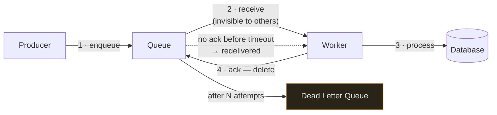
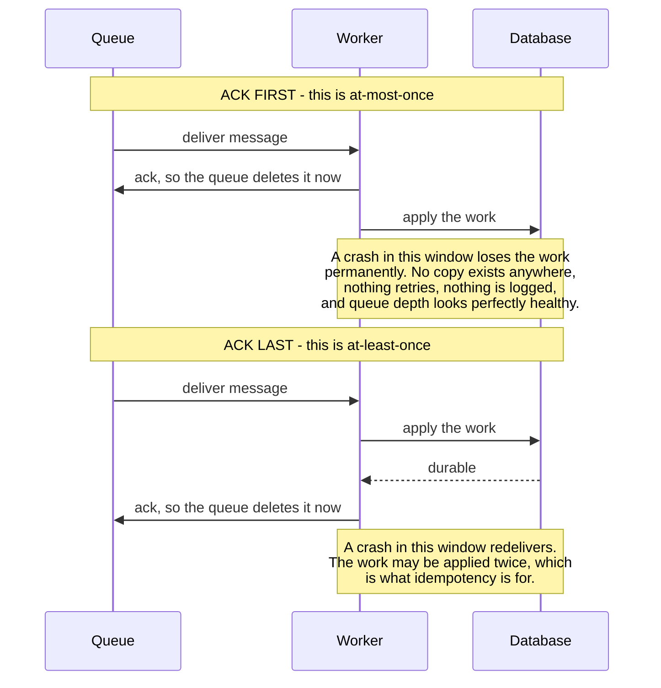
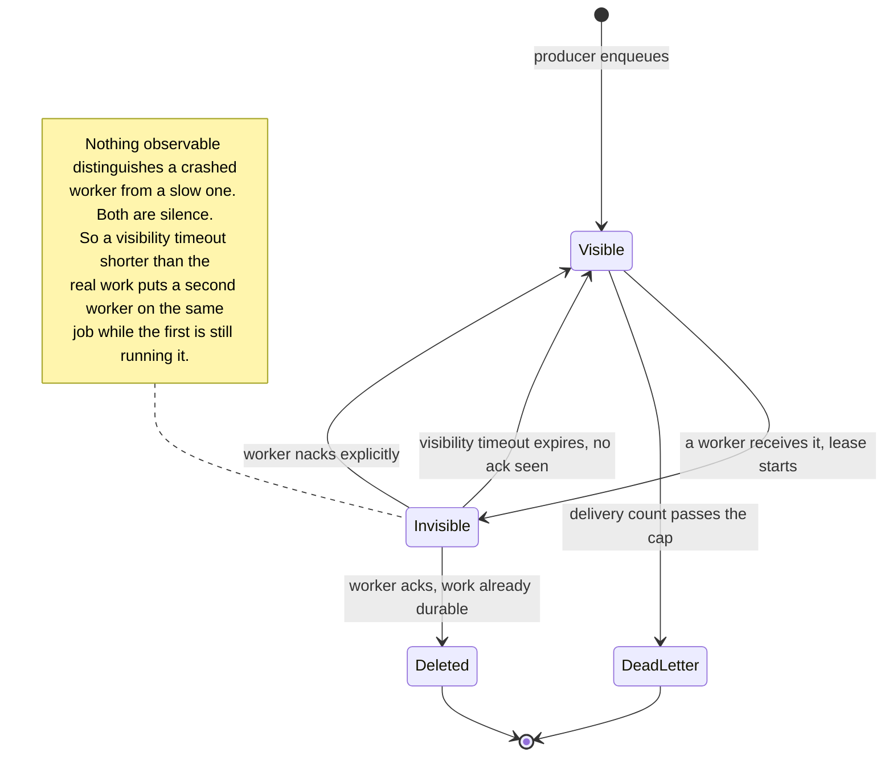
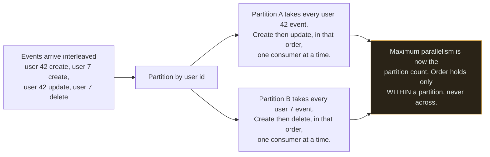

# Queue ★

`[INTERMEDIATE]` · Decouples arrival rate from processing rate, so a spike becomes a backlog instead of an outage. Buys at-least-once delivery — which makes idempotency mandatory, not optional.

---

## 1. One-line definition

A durable buffer that holds work between the thing producing it and the thing doing it.

## 2. Explain like I'm new

A restaurant where waiters clip orders to a rail and cooks take them off. Waiters never wait for
cooking to finish, so a sudden rush of customers produces a **longer rail**, not a jammed dining room.

Three things follow immediately, and they are the three things every queue has: the diner is told
"ordered", not "cooked" — the result is now *eventual*. If the rail fills faster than cooks empty it,
you are still in trouble, just later. And if a cook drops an order on the floor, someone must notice
and re-clip it — which is how the same meal ends up cooked twice.

## 3. Real-world analogy

The order rail above.

**Where it breaks:** a physical ticket exists once. A message can be delivered twice, arrive out of
order, or arrive after the cook has gone home and come back. None of those have a kitchen analogue,
and all three are routine.

## 4. Technical explanation

**A queue is not a stream, and confusing them is expensive.** They look similar and behave
differently:

| | **Queue** | **Stream / log** |
|---|---|---|
| After consumption | Message is deleted | Retained for a period |
| Consumers | One consumer gets each message | Many independent consumers, each with an offset |
| Replay | Impossible — it is gone | Reset the offset and reprocess |
| Ordering | Usually best-effort | Ordered within a partition |
| Scaling | Add workers to one queue | Add partitions |
| Examples | SQS, RabbitMQ | Kafka, Kinesis, Redis Streams |

**Pick a stream when you might want the data twice.** A bug found on Tuesday can be fixed by
replaying from Monday's offset — with a queue, the messages are gone and the data is unrecoverable.
That single property justifies a log for anything resembling an event.

### Delivery semantics

| Guarantee | Reality |
|---|---|
| At-most-once | Fire and forget. Fast, loses messages. Rarely what you want. |
| **At-least-once** | **What you actually get.** Duplicates are possible. Requires idempotency. |
| Exactly-once | Does not exist end-to-end. What is sold as exactly-once is at-least-once plus deduplication, inside a system boundary. |

The practical rule: **assume at-least-once and make every consumer idempotent.** Designs that depend
on exactly-once are depending on something that is not there.

## 5. Engineering at scale

**A queue does not add capacity; it defers work.** If producers sustainably outpace consumers, the
queue grows without bound until memory or disk runs out, and you have converted a slowdown into an
outage. The queue buys time to absorb a *spike*, not a permanent deficit. That is what
[backpressure](../../GLOSSARY.md#backpressure) is for.

**The queue removes natural backpressure from the database.** On the request path, a slow database
slows the client, which throttles arrival. Behind a queue, workers hammer the database at their own
pace with nothing pushing back. A common failure is a batch job that a synchronous path would never
have been able to generate.

**Queue depth is the best autoscaling signal you have.** CPU tells you about the workers; depth tells
you whether you are keeping up. Scaling on CPU for queue consumers is a standard mistake.

## 6. The problem it solves

Slow or unreliable work on the request path — and load spikes that would otherwise exceed capacity.

## 7. The problem it does NOT solve

It does not make the work faster. It does not add throughput. It does not remove the need for the
downstream system to be able to keep up on average. And **it does not preserve order** unless you
have specifically arranged for it — which usually costs you parallelism.

## 8. Why does this exist?

Because coupling the speed of the producer to the speed of the consumer means the slowest component
sets the pace for everyone. A buffer breaks that coupling — the same reason buffers exist everywhere
from CPU pipelines to shipping ports.

---

## 9. How it works



The mechanism that makes it durable is **ack-after-processing**. Receiving a message makes it
invisible to other workers for a visibility timeout, but does not delete it. Only the ack deletes it.
So a worker crashing between steps 2 and 4 causes the message to reappear and be processed again —
which is exactly why at-least-once is what you get, and exactly why idempotency is required.

**Acking before processing turns at-least-once into at-most-once** and silently loses work on every
crash. It is a one-line change and a data-loss bug.



The crash window is the same size in both halves — moving the ack does not shrink it. What changes is
**which side of the ack the durable copy is on**, and therefore what a crash costs you: lost work on
top, duplicated work below. Only one of those is recoverable, and only one of them is visible: the
top half produces no error, no retry and no metric, which is why this bug survives for months.

## 10. Internal components

- **Durable store** — messages must survive a broker restart
- **Visibility timeout / lease** — how long a worker has before redelivery
- **Delivery counter** — how many attempts, so poison messages can be capped
- **Dead letter queue** — where messages go after the cap
- **Ack / nack** — completion signal

Those five components are one state machine, and it is the diagram worth memorising for this topic:



Two things to read off it. **Exactly one transition deletes a message** — the ack — and every other
way out of `Invisible` puts it back on the queue, which is the whole reason at-least-once is what you
get. And the `Invisible → Visible` timeout edge is a *bet*, not a guarantee: set it below your slowest
job and you manufacture duplicates on healthy workers; set it far above and a genuinely crashed
worker's message sits undelivered for that long. The `DeadLetter` edge is the only thing stopping a
message that can never succeed from looping through this machine forever.

## 11. The dead letter queue

Without a delivery cap, a message that can never succeed retries forever. If ordering is enforced, it
blocks everything behind it — one malformed message stops the entire pipeline.

A DLQ makes the failure visible and bounded. **A DLQ nobody monitors is a data-loss mechanism with
extra steps**, so the alert on DLQ depth matters more than the DLQ itself.

## 12. Ordering

Global ordering and parallel consumption are mutually exclusive. The standard compromise is
**ordering within a partition key**: all messages for user 42 go to the same partition and are
processed in order, while different users proceed in parallel.

Choose the key so that ordering is preserved where it matters and parallelism survives everywhere
else. A key with poor distribution recreates the single-consumer bottleneck.



The guarantee you buy is narrower than it looks, and that is the point: user 42's update can never
overtake user 42's create, while **nothing whatsoever orders user 42 against user 7** — which is fine,
because no invariant spanned them. The amber box is the bill. Your consumer count can never usefully
exceed your partition count, and a key with poor distribution funnels most traffic into one partition,
which is the single-consumer bottleneck you were trying to escape, now with extra machinery.

---

## 13. When to use it

- The work is not needed for the response — email, thumbnails, analytics, indexing
- Load is spiky and you want to absorb peaks with fewer machines
- The downstream system is unreliable and you want retries handled centrally
- Fan-out: one event, several independent consumers (prefer a **stream** here)

## 14. When NOT to

- **The user needs the result now.** A queue makes the answer eventual; if a human is waiting for it,
  you have made the experience worse.
- Consumers cannot keep up on average. The queue only defers the problem.
- The operation is not idempotent and you cannot make it so.
- Strict global ordering is required and volume is high.
- **When a synchronous call would do.** A queue is a distributed system's worth of complexity — two
  more failure modes, a broker to run — for work that finishes in 5ms.

## 17. Trade-offs

| Choose | Get | Pay |
|---|---|---|
| Queue | Responsiveness, spike absorption, retry in one place | Eventual results; duplicates; ordering; a broker to run |
| Stream over queue | Replay, multiple consumers | Retention cost, offset management |
| Larger visibility timeout | Fewer spurious redeliveries | Slower recovery from a crashed worker |
| Ordering by key | Order where it matters | Parallelism capped by key distribution |
| Bigger batch | Throughput | Latency; a failure retries the whole batch |

## 18. Why not?

| Alternative | Why not here | When it WOULD win |
|---|---|---|
| **Synchronous call** | Couples you to the callee's latency and availability | The work is fast and the caller needs the result — **the common case** |
| A database table as a queue | Polling, lock contention, no built-in DLQ | Low volume, and you already have the database — genuinely fine at small scale |
| Cron / batch job | High latency, poor failure isolation | Work that is genuinely periodic |
| Stream (Kafka) instead | Heavier to operate | You need replay or multiple consumers |
| In-memory queue | **Loses everything on restart** | Work that is genuinely disposable |

That second row is worth taking seriously. `SELECT ... FOR UPDATE SKIP LOCKED` on a Postgres table is
a perfectly good queue up to a few thousand jobs a second, and it removes an entire component from
your architecture.

## 19. Failure scenarios

| Failure | What happens | Mitigation |
|---|---|---|
| Worker crashes mid-job | Message redelivered; work may be **half-applied** | Idempotency; transactional processing |
| Message delivered twice | Duplicate side effects — double charge, double email | Idempotency keys |
| Poison message | Retries forever; blocks the partition if ordered | Delivery cap → DLQ |
| Queue grows unboundedly | Memory/disk exhaustion; a slowdown becomes an outage | Backpressure; alert on depth *and* age |
| Consumers outpaced permanently | Latency grows without limit | Autoscale on depth; shed load |
| Broker down | Producers block or drop | Broker redundancy; local buffering with a bound |
| Out-of-order arrival | Inconsistent state | Partition keys; sequence numbers; order-independent design |
| **Ack before processing** | Silent data loss on every crash | Ack only after the work is durable |
| Workers overwhelm the database | The queue removed natural backpressure | Concurrency limit on the worker pool |

**Alert on message *age*, not only depth.** A queue with 10 messages that are three hours old is a
worse signal than a queue with 10,000 messages one second old, and a depth-only alert misses it
entirely.

## 21. Performance

The win is in *perceived* latency: the user's request returns as soon as the message is durable,
typically a few milliseconds, instead of waiting for work that might take seconds. Total work is
unchanged — slightly increased, in fact, by serialisation and the extra round trip.

Batching raises throughput and worsens per-item latency, exactly as in
[throughput](../../00-foundations/throughput/). Batch failures are the subtlety: with a batch of 100,
one poison message can cause the other 99 to be reprocessed.

---

## 25. Without it → With it → New problem → Next

```
Without it   →  slow work blocks the response; a traffic spike exceeds capacity
With it      →  responses return immediately; spikes become backlog
New problem  →  at-least-once delivery means duplicates; results are eventual;
                ordering is no longer free; the queue itself can grow unboundedly
Next         →  idempotency to make redelivery safe, a DLQ for poison messages,
                and backpressure so the buffer cannot become the outage
```

## 26. Combination patterns

- **[Queue + workers](../../14-component-combinations/MATRIX.md)** — the core async pipeline
- **[Queue + database](../../14-component-combinations/MATRIX.md)** — the dual-write problem; the outbox is the answer
- **[Cache + queue](../../14-component-combinations/MATRIX.md)** — ⚠ a miss storm and a backlog amplify each other
- **[Breaker + queue](../../14-component-combinations/MATRIX.md)** — park work instead of dropping it when the breaker opens
- **[Worker + object storage](../../14-component-combinations/MATRIX.md)** — claim-check: the message carries a pointer, not the payload

## 27. Implementation

A message queue with visibility timeouts and a DLQ is on the roadmap for
[18-implementations/](../../18-implementations/). The
[rate limiter](../../18-implementations/rate-limiter/) shows the standard these follow: real
measurements, and an explicit list of what production adds.

## 28. Common mistakes

| Mistake | Why it is wrong |
|---|---|
| **Ack before processing** | Turns at-least-once into at-most-once. Silent loss. |
| No idempotency | Duplicates become double charges |
| No DLQ | One poison message blocks the pipeline forever |
| No alert on queue age | Depth alone misses a stalled consumer |
| Assuming exactly-once | It does not exist end-to-end |
| Assuming ordering | Not guaranteed unless arranged, and it costs parallelism |
| Autoscaling on CPU | Depth is the correct signal for consumers |
| Unbounded workers | They overwhelm a database the request path protected |
| Queue where sync would do | A broker and two failure modes for 5ms of work |
| Queue instead of capacity | Defers the problem; does not solve it |

## 29. Monitoring

Depth **and oldest-message age** — the second catches stalled consumers the first cannot see. DLQ
depth with an alert at anything above zero, because a message there is work that silently did not
happen. Processing rate against arrival rate: if arrival exceeds processing for a sustained period,
the outage is already scheduled. Redelivery count, which is a direct measure of how often workers are
failing mid-job.

## 31. Exercises

**1.** On Tuesday you discover a bug that has been corrupting records since Monday. Which choice made
on Friday decides whether Tuesday is survivable?

<details><summary>Answer</summary>

Queue or stream. With a **stream** the messages are still there within the retention window: fix the
consumer, reset the offset to Monday, and reprocess. With a **queue** they were deleted on ack, and
the only record of what happened is whatever the corrupted rows still imply.

That single property — replay — justifies a log for anything resembling an event, and it is worth
more than any feature comparison between products. The other half is fan-out: a queue gives each
message to one consumer, a log gives every consumer its own offset.
</details>

**2.** A vendor advertises exactly-once delivery. Your users report receiving the same email four
times. Who is wrong?

<details><summary>Answer</summary>

Not the vendor — the design, about what that guarantee covers. **Exactly-once does not exist end to
end.** What is sold as exactly-once is at-least-once plus deduplication *inside* the broker's
boundary; the moment an effect leaves it — an SMTP call, a card charge — the ack can be lost after
the work succeeded and the message comes back.

Four deliveries means the worker crashed or timed out after sending and before acking, three times.
Assume at-least-once, make the consumer idempotent, and check the ack happens **after** the work is
durable — acking first turns this into silent data loss instead, which is worse.
</details>

**3.** Queue depth has been climbing for an hour. What is the first question, and how do the two
answers differ?

<details><summary>Answer</summary>

**Is this a spike or a deficit?** If arrivals temporarily exceed processing, the queue is doing
precisely its job — absorbing the peak — and the fix is to autoscale consumers on depth and wait.

If producers outpace consumers *on average*, no amount of queue helps: it grows until memory or disk
runs out, and you have converted a slowdown into an outage. That needs capacity, load shedding or
backpressure. Also check **oldest-message age**, not just depth — ten messages three hours old is a
stalled consumer, and a depth-only alert cannot see it.
</details>

**4.** An internal call takes 5 ms and succeeds 99.99% of the time. Someone proposes putting it behind
a queue "for resilience". Do you approve it?

<details><summary>Answer</summary>

No. You would be buying a broker to operate, at-least-once duplicates, an idempotency requirement, a
DLQ that needs monitoring and an alert, and results that are now eventual — for five milliseconds of
work whose answer the caller needs in order to respond.

**A queue is a distributed system's worth of complexity**, and a synchronous call is the common case
precisely because it is simpler. The arguments that would win are a slow or unreliable callee, a
spiky arrival rate, or work the user genuinely does not need in the response — none of which is
present here.
</details>

**5.** You move work behind a queue and the database starts falling over in ways it never did on the
request path. What changed?

<details><summary>Answer</summary>

The queue removed the **natural backpressure**. On the request path a slow database slows the client,
which throttles the arrival rate — a feedback loop nobody designed but everybody relied on. Behind a
queue, workers pull at their own pace and nothing pushes back.

The number that decides the outcome is total fleet concurrency — workers × per-worker concurrency —
and it is easy to be wrong about it by an order of magnitude. Bound it against measured downstream
capacity and give [workers](../workers/) their own connection pool, or a backlog drain becomes a site
outage.
</details>

## 32. Decision checklist

- [ ] The user genuinely does not need the result synchronously
- [ ] Every consumer is idempotent
- [ ] Ack happens **after** the work is durable
- [ ] Delivery cap and DLQ configured; DLQ depth alerted
- [ ] Alert on message age, not only depth
- [ ] Ordering requirement stated; partition key chosen if needed
- [ ] Worker concurrency bounded so the database is protected
- [ ] Autoscaling keyed on queue depth
- [ ] Consumers can keep up on *average*, not just at trough

## 33. Related

- [Observability](../../11-observability/) — how you would know any of this broke
- [Throughput](../../00-foundations/throughput/) — arrival rate versus processing rate
- [Reliability](../../00-foundations/reliability/) — idempotency, retries, DLQ
- [Database](../../05-databases/fundamentals/) — the dual-write problem
- [Combination matrix](../../14-component-combinations/MATRIX.md)
- [Glossary: idempotency](../../GLOSSARY.md#idempotency) · [backpressure](../../GLOSSARY.md#backpressure)
