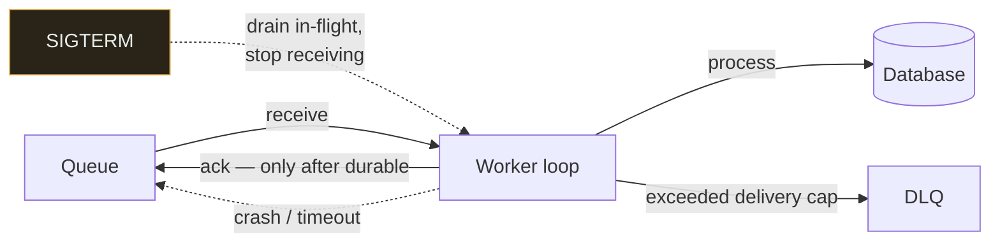

# Worker

`[BEGINNER]` · The process that takes work off a queue and does it. Where at-least-once delivery becomes your problem to handle.

---

## 1. One-line definition

A long-running process that consumes items from a queue or stream and performs the work they describe.

## 2. Explain like I'm new

The cook taking orders off the rail. The [queue](../queues/) is the rail; the worker is the cook.

Adding cooks is how you clear a backlog faster — but only up to the point where they start queueing
for the same oven. Past that, more cooks make things slower, not faster, because they contend for
something they all need.

## 3. Real-world analogy

The kitchen above.

**Where it breaks:** a cook who collapses mid-service is noticed immediately. A worker that hangs
holds its message invisible until a timeout expires, and during that window the work is neither done
nor available to anyone else.

## 4. Technical explanation

A worker is a loop: receive, process, acknowledge. Everything interesting is in what happens when
that loop is interrupted.

| Concern | The decision |
|---|---|
| **Concurrency** | How many items at once — per process, and across the fleet |
| **Ack timing** | After the work is durable, never before |
| **Idempotency** | Required, because redelivery is guaranteed eventually |
| **Poison handling** | Delivery cap, then a dead letter queue |
| **Graceful shutdown** | Finish in-flight work before exiting, or it is redelivered |

## 5. Engineering at scale

**Fleet concurrency is what hits the database, and it is easy to get wrong by an order of
magnitude.** Twenty workers each with concurrency 50 is a thousand simultaneous operations against
whatever they call. The request path had a connection pool and a load balancer implicitly limiting
it; the worker fleet has neither unless you add them.

**Scale on queue depth, not CPU.** CPU tells you how hard the existing workers are working; depth
tells you whether the fleet is keeping up. A worker fleet at 30% CPU with a growing backlog needs
more workers, and a CPU-based policy will never add them — the work is I/O-bound, which is the normal
case.

**Graceful shutdown is a correctness feature, not a nicety.** Autoscaling and deploys kill workers
constantly. A worker that exits without finishing or nacking in-flight work leaves it to time out,
which delays it by the visibility timeout every single time.

## 6. The problem it solves

Executing work that has been decoupled from the request path — at a rate you control, with retries
and failure isolation handled in one place.

## 7. The problem it does NOT solve

Workers do not make the work faster; they make it *parallel*. If the bottleneck is a shared resource,
adding workers increases contention on it — the classic case where scaling out makes throughput
*worse*. And a worker cannot fix non-idempotent work: redelivery will duplicate it.

---

## 9. How it works



## 13. When to use

- Work that is slow, retryable, or not needed for the response
- Load that arrives in bursts and can be smoothed
- Work that calls a flaky dependency and benefits from centralised retry

## 14. When NOT to

- The caller needs the result now
- The work is faster than the overhead of enqueueing it
- **The downstream cannot absorb the concurrency** — you have moved the bottleneck, not removed it
- The work is not idempotent and cannot be made so

## 17. Trade-offs

| Choose | Get | Pay |
|---|---|---|
| More workers | Faster backlog drain | More load on shared dependencies |
| Higher per-worker concurrency | Better I/O utilisation | Harder to reason about; memory |
| Long visibility timeout | Fewer spurious redeliveries | Slow recovery from a crashed worker |
| Batch processing | Throughput | One poison item can retry the whole batch |
| Autoscaling | Cost tracks demand | Cold starts; scaling lags the spike |

## 19. Failure scenarios

| Failure | What happens | Mitigation |
|---|---|---|
| Worker crashes mid-job | Redelivered; work possibly half-applied | Idempotency; transactional processing |
| Worker hangs | Message invisible until timeout; nothing progresses | Per-job timeout inside the worker, not just at the broker |
| **Ungraceful shutdown** | In-flight work waits out the visibility timeout | Handle SIGTERM: stop receiving, finish, then exit |
| Poison message | Retries forever | Delivery cap + DLQ |
| Fleet overwhelms the database | Connection exhaustion; the request path dies too | Bound total concurrency; separate connection pool |
| Scaled on CPU | Backlog grows while workers look idle | Scale on queue depth |
| Slow consumer, fast producer | Unbounded backlog | Backpressure; shed load |

## 25. Without it → With it → New problem → Next

```
Without it   →  queued work is never done; the queue is just a growing list
With it      →  work proceeds at a rate you control, independent of arrival
New problem  →  redelivery duplicates work; the fleet can overwhelm shared
                dependencies that the request path used to protect
Next         →  idempotency, bounded concurrency, and backpressure
```

## 26. Combination patterns

- **[Queue + workers](../../14-component-combinations/MATRIX.md)** — the core async pipeline
- **[Worker + database](../../14-component-combinations/MATRIX.md)** — where the removed backpressure bites
- **[Worker + object storage](../../14-component-combinations/MATRIX.md)** — claim-check for large payloads
- **[Worker + distributed lock](../../14-component-combinations/MATRIX.md)** — one worker per key; often replaceable by partitioning

## 28. Common mistakes

| Mistake | Why it is wrong |
|---|---|
| Ack before processing | Silent loss on every crash |
| No graceful shutdown | Every deploy delays in-flight work by the visibility timeout |
| Unbounded fleet concurrency | Workers take down the database the request path shares |
| Autoscaling on CPU | I/O-bound workers look idle while the backlog grows |
| No per-job timeout | One hung job holds a slot indefinitely |
| Assuming single delivery | Duplicates are guaranteed eventually |
| Long-running jobs with short visibility timeouts | The job is redelivered while still running — and now runs twice |

That last row is a particularly nasty one: the work succeeds twice, concurrently, and neither copy
knows about the other.

## 29. Monitoring

Processing rate against arrival rate — the only pair that answers "are we keeping up". Per-job
duration, so the visibility timeout can be set above the p99 rather than guessed. Redelivery count as
a direct measure of crashes and timeouts. DLQ depth, alerted at anything above zero.

## 31. Interview questions

- **"How many workers?"** — wants Little's Law against the backlog target, and the shared-dependency
  ceiling.
- **"A worker dies mid-job. What happens?"** — wants redelivery and idempotency.
- **"How do you deploy workers without losing work?"** — wants SIGTERM handling and draining.
- **"Backlog is growing but CPU is 20%. Why?"** — I/O-bound; wants scaling on depth.
- **"Job takes 10 minutes, visibility timeout is 5. What happens?"** — it runs twice, concurrently.

## 32. Decision checklist

- [ ] Every job is idempotent
- [ ] Ack after the work is durable
- [ ] Visibility timeout exceeds p99 job duration
- [ ] Per-job timeout inside the worker
- [ ] SIGTERM drains in-flight work
- [ ] Total fleet concurrency bounded against downstream capacity
- [ ] Autoscaling on queue depth
- [ ] DLQ configured and alerted

## 33. Related

- [Observability](../../11-observability/) — how you would know any of this broke
- [Queue](../queues/) — read first
- [Throughput](../../00-foundations/throughput/) — Little's Law for sizing the fleet
- [Reliability](../../00-foundations/reliability/) — idempotency and retries
- [Combination matrix](../../14-component-combinations/MATRIX.md)
