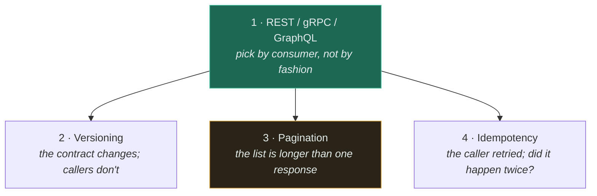

# API Design

The API is the only part of your system that other people have to live with. Everything behind it can
be rewritten on a Tuesday; the contract cannot, because the moment someone depends on it, it stops
being yours.

That is the whole reason this section exists as something separate from the components. A cache is a
decision you can reverse. **An API is a decision other teams build on top of, and reversing it costs
them, not you** — which is why it never gets reversed, and why the mistakes here outlive the people
who made them.

---

## Read in this order

The first page picks a shape. The other three are the problems that shape does not solve for you —
they apply whichever protocol you chose, and every one of them is a place where the naive answer is
quietly wrong.

| # | Topic | Difficulty | The one thing to take away |
|---|---|---|---|
| 1 | [REST vs gRPC vs GraphQL](rest-grpc-graphql/) | `[I]` | Choose by **consumer and call shape**. REST is the default and needs no justification. |
| 2 | [Versioning](versioning/) | `[I]` | Additive is safe, removal is not. The hard part is **deprecation**, not versioning. |
| 3 | [Pagination](pagination/) | `[I]` | **Offset pagination silently skips and duplicates rows.** Your tests will never show it. |
| 4 | [Idempotency](idempotency/) | `[I]` | Store the key **with the result**, so a retry replays instead of re-executing. |

The amber box is the one most likely to be wrong in code you are shipping right now. Offset
pagination is the default in every ORM, it is correct in every test suite, and it is broken in
production the moment the underlying list changes while someone is reading it.

## The four questions every API has to answer

Most API design arguments are actually arguments about one of these, conducted without naming it.

| Question | Where it is answered | The answer most teams give without thinking |
|---|---|---|
| Who calls this, and from where? | [Protocol choice](rest-grpc-graphql/) | "Whatever the last project used" |
| What happens when the contract changes? | [Versioning](versioning/) | "We'll add a v2" — and then never remove v1 |
| What happens when the result is bigger than one response? | [Pagination](pagination/) | `LIMIT ? OFFSET ?` |
| What happens when the caller cannot tell whether it worked? | [Idempotency](idempotency/) | "The client will retry" |

The fourth is the one with money attached. A timeout is not a failure — it is an **unknown outcome**,
and the client's only options are to retry (and risk doing it twice) or to give up (and risk not
doing it at all). Idempotency is what converts that dilemma into a non-event.

## The rule underneath all four

**Every API is a promise about behaviour you did not write down.** Response ordering, page size,
error shape, how long a call takes, whether an unknown field appears — callers will depend on all of
it, and each one becomes part of the contract the day someone ships against it. This is Hyrum's Law,
and it is the reason "we didn't document that" has never once prevented an outage.

The practical consequence: be deliberately boring at the edges. Explicit ordering, explicit page
caps, explicit error shapes, explicit versions. An interface with no surprising behaviour has no
surprising behaviour to depend on.

## What this section does not cover

Authentication, authorisation, and transport security are their own subject and are not treated here.
Neither is the API gateway as a *component* — that belongs with
[load balancing](../03-load-balancing/fundamentals/), because that is what it mostly is.

Rate limiting has a working implementation with measured numbers in
[18-implementations/rate-limiter/](../18-implementations/rate-limiter/); this section only covers the
part of it that is an API design problem — namely that
[GraphQL makes it genuinely hard](rest-grpc-graphql/).

## Related

- [Architecture](../02-architecture/) — service boundaries are API boundaries; the two decisions are the same decision
- [Queues](../06-messaging/queues/) — at-least-once delivery is why [idempotency](idempotency/) stops being optional
- [Observability](../11-observability/) — you cannot deprecate what you cannot see being called
- [Databases](../05-databases/fundamentals/) — the [pagination](pagination/) problem is a query problem wearing an API costume
- [Pattern catalogue](../13-design-patterns/CATALOGUE.md) — Backend-for-Frontend, Idempotent Receiver, Expand-Contract
- [System Design Thinking](../SYSTEM-DESIGN-THINKING.md) · [Trade-off Framework](../TRADEOFF-FRAMEWORK.md) · [Glossary](../GLOSSARY.md)
