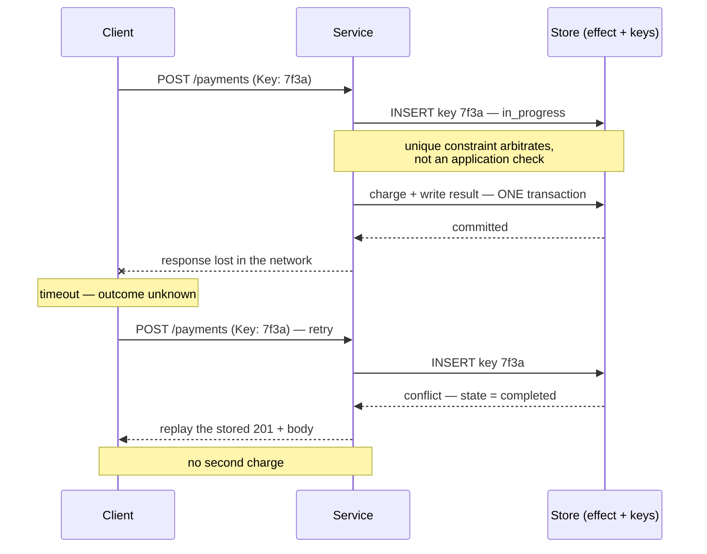

# Idempotency

`[INTERMEDIATE]` · The key is stored **with the result**, so a repeat returns the original outcome instead of executing again. That single detail is the difference between charging a card once and charging it twice.

---

## 1. One-line definition

A property of an operation such that performing it many times has the same effect as performing it
once — implemented, for operations that are not naturally idempotent, by recording a caller-supplied
key alongside the result of the first execution and replaying that result for every repeat.

## 2. Explain like I'm new

You press "Pay" and nothing happens. The screen hangs. Did the payment go through?

Neither you nor your phone knows. The request may have been lost on the way, or it may have arrived,
been processed perfectly, and the *answer* got lost on the way back. From the outside those two
situations look identical, and the difference is somebody's money.

So the phone retries. If the server just does the work again, you have paid twice.

The fix is that the phone attaches a unique ticket number to the request — the same ticket number on
every retry. The server writes down "ticket 7f3a → payment succeeded, here is exactly what I sent
back" at the moment it does the work. When ticket 7f3a arrives again, the server does not process
anything; it looks up what happened last time and sends back that same answer.

**Two things make it work, and both are easy to get wrong.** The ticket number must be generated once
and reused on every retry — a new number each time is not a ticket, it is a new payment. And the
server must write the ticket and do the work *together*, as one indivisible step, because if it does
the work and then crashes before writing the ticket, the retry pays again.

## 3. Real-world analogy

A cloakroom ticket. You hand over your coat and get a numbered stub; present the stub again and you
get the same coat, not a second one.

**Where it breaks:** a cloakroom attendant can *see* that you already have your coat. A server
cannot see anything about a previous request except what it deliberately wrote down. If the record of
issuing your coat lives in a different ledger from the coat rack — and the attendant is interrupted
between the two — the next person with your stub gets a second coat off the rack. **The atomicity of
"do the thing" and "record that the thing was done" is the entire mechanism**, and the analogy hides
it completely because in a physical cloakroom the coat leaving the rack *is* the record.

## 4. Technical explanation

Start with what is idempotent for free, because the cheapest idempotency is the kind you do not
implement.

| Operation | Idempotent? | Why |
|---|---|---|
| `GET /orders/7` | Yes | Reads change nothing |
| `PUT /orders/7` with a full body | Yes | Absolute write — the end state is the same however many times you apply it |
| `DELETE /orders/7` | Yes, effectively | The second delete finds nothing to do (return 204 or 404 consistently, and pick one) |
| `POST /orders` | **No** | Creates a new resource per call — the canonical problem |
| `UPDATE balance SET x = 500` | Yes | Absolute |
| `UPDATE balance SET x = x - 100` | **No** | Relative — applying it twice is a different end state |
| Sending an email | **No** | External, irreversible, and visible to a human |
| `INSERT` with a client-supplied primary key | Yes | The unique constraint does the work |

**Prefer absolute over relative, and client-supplied identifiers over server-generated ones.** A `PUT`
to `/orders/{client-generated-uuid}` is idempotent with no additional machinery: the second attempt
collides with a primary key that already exists, and you return the existing resource. Half the
idempotency problems in a codebase can be designed away before anyone writes a key store. The other
half — payments, transfers, third-party calls, anything with an external side effect — cannot, and
that is what the rest of this page is about.

### Why retries make it mandatory

You cannot avoid retries, so you cannot avoid needing this.

A timeout is **not a failure**. It is an unknown outcome, and the caller has only two options: retry,
risking a duplicate, or give up, risking a lost operation. Both are wrong in the absence of
idempotency; with it, the choice collapses — you always retry, and the duplicate is a non-event.
The same reasoning applies everywhere in a distributed system:

- Network timeouts, where the request or only the response was lost
- Load balancer and proxy retries, which happen without your application knowing
- [Queue](../../06-messaging/queues/) redelivery — at-least-once is the delivery guarantee you
  actually get, so duplicates are guaranteed *eventually*, not merely possible
- [Worker](../../06-messaging/workers/) crashes after doing the work and before acknowledging it
- A user double-clicking a button, or a mobile client resuming after a tunnel

**"Exactly-once delivery" does not exist. Exactly-once *effect* does, and idempotency is how you get
it.** That sentence is the whole reason the concept has a name.

### The mechanism

The client generates a key — a UUID — **once per logical operation**, and sends it on every attempt,
conventionally as an `Idempotency-Key` header. The server keeps a table:

| Column | Purpose |
|---|---|
| `key` | Primary key. Scoped per account and per endpoint, never global |
| `request_fingerprint` | Hash of the request body, so key reuse with a different payload is caught |
| `state` | `in_progress` or `completed` |
| `response_status`, `response_body` | **The stored result** — this is the part people omit |
| `created_at`, `expires_at` | Retention window |

And the handler runs this sequence:

1. `INSERT` the key with state `in_progress`, relying on the **unique constraint** to arbitrate.
2. If the insert succeeded, this request owns the operation. Execute it.
3. Write the effect **and** the completed record with its response, **in one transaction**.
4. Return the response.
5. If the insert conflicted: read the existing row. `completed` → return the stored status and body
   verbatim. `in_progress` → return `409` and let the caller retry shortly; do **not** execute.

**Step 3 is the mechanism.** Everything else is bookkeeping. If the side effect and the key record
are not committed atomically, there is a window in which the work is done and unrecorded, and a
retry landing in that window does it again — which is precisely the failure you built this to
prevent, now with more code.

**Step 1 is the second thing people get wrong.** The natural-looking implementation is "SELECT to see
if the key exists; if not, INSERT and proceed". That is a read-modify-write race: two concurrent
retries both find nothing, both insert, both execute. At read-committed isolation no amount of care
in application code fixes it — see
[databases](../../05-databases/fundamentals/#12-isolation-levels). The unique constraint must be what
decides, not your `if` statement.

## 5. Engineering at scale

**Scope keys per tenant and per endpoint.** A globally unique key space means one caller's UUID can
collide with another's, and — worse — a caller who guesses or replays someone else's key receives
that caller's stored response body. The lookup key should be `(account_id, endpoint, key)`. This is
one of the rare places where an availability mechanism has a data-exposure failure mode.

**State the retention window, and make it longer than your longest retry horizon.** Twenty-four hours
is the common default. After expiry the key is gone and the same request executes again — which is
correct behaviour (you cannot store keys forever) and a genuine hazard for asynchronous callers: a
message sitting in a dead-letter queue for three days and then replayed will re-execute. Match the
retention to the maximum age of anything that can retry into you, including manual DLQ replays, and
document it in the API.

**Tell the caller it was a replay.** Return a header such as `Idempotent-Replay: true` alongside the
original status code. Without it, client-side metrics count a replay as a fresh success, your
duplicate-request rate is invisible, and nobody discovers the retry storm until it is a bill.

**Idempotency at the edge does not make the call graph idempotent.** If your API is idempotent but it
synchronously calls three services that are not, a retry that arrives *while the first attempt is
still in flight* can still cause duplicate downstream effects — your `in_progress` guard turns that
into a 409, which is why the guard matters, but any hop that retries internally needs its own key.
The rule: **propagate a derived idempotency key to every downstream call**, deterministically derived
from the original so it is stable across attempts. For long multi-service operations this stops being
enough and becomes a [saga](../../13-design-patterns/CATALOGUE.md) with explicit compensation.

**When the effect is external, atomicity is unavailable and you must reconcile.** You cannot commit a
card charge at a payment provider and your own database in one transaction. What you can do:
persist your intent with the key *before* calling out; pass your own idempotency key through to the
provider (every serious payment API accepts one — this is exactly why); and run a reconciliation job
that finds intents with no recorded outcome and queries the provider for the true state. **The
provider's idempotency key is what makes the retry safe; your reconciliation is what makes the
crash-in-between safe.** Both are required.

**Deduplication is not idempotency.** A dedupe filter drops the repeat and returns nothing useful.
Idempotency returns *the original result* — the order ID, the payment status, the receipt. The client
needs that; a swallowed duplicate leaves it in the same unknown state it started in. This distinction
is why "we dedupe on the queue" is not an answer for a synchronous API.

**The key store is now on the critical write path.** If it is unavailable you must decide, in advance,
whether to fail open (execute without the guard) or fail closed (refuse). For payments this is one of
the very few places where **fail closed is unambiguously correct** — a rejected payment is an
inconvenience, a double charge is a chargeback, a support case and a trust problem. Elsewhere the
answer may differ, but it must be a decision, not a default. Compare
[caching](../../04-caching/fundamentals/#23-operational-considerations), where the same question is
usually answered by nobody.

## 6. The problem it solves

Duplicate execution of an operation whose repetition is harmful, in a system where duplicate
*delivery* cannot be prevented — and, just as importantly, the caller's inability to distinguish "it
did not happen" from "it happened and I did not hear about it".

## 7. The problem it does NOT solve

**Idempotency does not make an operation correct; it makes it repeatable.** If the first execution
was wrong, every replay returns the same wrong answer with more confidence.

It also does not give you:

- **Ordering.** Two *different* operations arriving out of order is a separate problem; idempotency
  says nothing about it. See [queues](../../06-messaging/queues/).
- **Concurrency control.** Two different callers updating the same resource simultaneously is a
  lost-update problem, solved by optimistic concurrency (`If-Match` / ETag / a version column), not
  by idempotency keys. They are complementary and frequently confused.
- **Protection past the retention window.** After expiry, the same key executes again.
- **Safety for non-transactional side effects.** An email already sent cannot be un-sent by a
  rollback. Move such effects behind the [transactional
  outbox](../../13-design-patterns/CATALOGUE.md) so they are triggered by committed state.
- **Anything, if the client generates a new key per attempt.** This is the single most common
  implementation failure and the server cannot detect it.

---

## 9. How it works



The diagram is a sequence rather than a flowchart because the whole subject is **order and time** —
specifically the interval between "committed" and "the client found out", which is where every
duplicate-charge incident lives.

Three cases the sequence makes visible:

| Where the crash or loss happens | What the retry sees | Outcome |
|---|---|---|
| Request lost before arrival | No key row | Executes once. Correct |
| Response lost after commit | Key row, `completed` | Replays the stored result. Correct |
| Crash **between** effect and key write | No key row, but the effect happened | **Executes twice.** This is the bug atomicity prevents |
| Concurrent retry while first is running | Key row, `in_progress` | `409`; caller retries shortly. Correct |

Row three is the only one that requires anything of you, and it is why the transaction boundary — not
the header, not the UUID — is the design.

## 13. When to use it

- **Any non-idempotent write reachable over a network.** Which is all of them.
- **Payments, transfers, refunds, order placement, provisioning** — anything where a duplicate has a
  cost measured in money or in a human being upset.
- **Every queue consumer**, without exception. At-least-once means the duplicate is guaranteed
  eventually; the only question is whether you handled it.
- **Any operation a load balancer, proxy, SDK or mobile client might silently retry** — and all four
  of those retry by default.
- **Bulk or batch endpoints**, per item as well as per batch, or a partial failure forces a retry of
  the whole batch and re-applies everything that already succeeded.

## 14. When NOT to

- **When the operation is naturally idempotent.** A `PUT` with a full body, an absolute `SET`, a
  delete. Adding a key store here is machinery guarding nothing.
- **When you can design it away instead.** Client-supplied resource IDs turn creation into a
  primary-key collision. **Prefer this** — it is less code and cannot be misconfigured.
- **For reads.** A duplicate `GET` is not a problem, and caching handles the cost.
- **When the duplicate is genuinely harmless** — an idempotent-by-nature analytics event, a
  last-write-wins preference update. Say so explicitly rather than leaving it unexamined.
- **As a substitute for concurrency control.** If the real problem is two callers racing on one
  resource, you want optimistic concurrency, not idempotency keys.

## 17. Trade-offs

| Choose | Get | Pay |
|---|---|---|
| Idempotency keys | Safe retries; a timeout becomes a non-event | A key store on the critical write path; extra latency; a retention policy to own |
| Store the response body | The caller gets the *original* result, not just "already done" | Storage cost; a stale body if the resource changed since |
| Store only the key (dedupe) | Cheap | The retry learns nothing — the caller is still in an unknown state |
| Client-supplied resource IDs | Idempotency for free, no key store at all | The client must generate IDs; less control over the ID space |
| Long retention (7 days) | Survives DLQ replays and long outages | More storage; a stale replay long after the world moved on |
| Short retention (1 hour) | Cheap | A late retry re-executes — exactly the case you were protecting |
| Fail closed when the key store is down | Never a double charge | Writes are unavailable while the key store is |
| Fail open when the key store is down | Writes keep working | You have turned off the guarantee at the moment it is most likely to be needed |
| Propagating keys downstream | End-to-end safety across the call graph | Every service needs the machinery, and the derivation must be deterministic |

## 18. Why not?

| Alternative | Why not here | When it WOULD win |
|---|---|---|
| **Design it away — `PUT` + client-generated ID** | Not always possible; external effects resist it | **The best answer whenever it is available.** Creation endpoints, upserts |
| Natural key / unique constraint on business data | Requires a genuine natural key; awkward for legitimate repeats | "One vote per user per poll", "one booking per seat" — the constraint *is* the invariant |
| Don't retry at all | You cannot prevent retries; proxies, SDKs and users retry regardless | Truly fire-and-forget work where loss is acceptable |
| Deduplicate at the queue | Drops the duplicate but returns nothing to the caller; usually a time-window guarantee, not a real one | Async pipelines where no caller is waiting for a result |
| Exactly-once delivery from the broker | It is not what it sounds like — it is scoped to one system's read-process-write, not to your external effects | Stream processing entirely inside one framework's boundary |
| Two-phase commit across services | Blocking, operationally brittle, and it makes availability worse | Almost never in a service architecture; occasionally inside one database cluster |
| Optimistic concurrency (`If-Match`, version column) | Solves a *different* problem — concurrent conflicting updates, not repeated identical ones | Update endpoints where lost updates are the risk. **Use both** |

The first row is the one to reach for first. **The cheapest idempotency is an operation that was
never non-idempotent** — before building a key store, check whether the endpoint could take a
client-generated identifier and become a `PUT`.

## 19. Failure scenarios

| Failure | What happens | Mitigation |
|---|---|---|
| **Effect committed, key written separately, crash in between** | Retry re-executes. **Double charge** | One transaction for effect and key record — this is the whole design |
| **`SELECT` then `INSERT` instead of a unique constraint** | Concurrent retries both pass the check and both execute | Let the unique constraint arbitrate; handle the conflict |
| **Client generates a new key per retry** | Every attempt is a new operation; the server cannot tell | Generate at operation start, persist across attempts, test it explicitly |
| Same key, different request body | Caller gets a response for an operation it did not send | Store and compare a request fingerprint; reject with `422` |
| Globally scoped keys | Cross-tenant collisions, and a guessed key returns someone else's response | Scope by `(account, endpoint, key)` |
| Key store in a different database from the effect | Dual write — the two can diverge | Same database and transaction, or the [outbox pattern](../../13-design-patterns/CATALOGUE.md) |
| Key store unavailable | Either writes stop, or the guard silently disappears | Decide fail-open vs fail-closed **in advance**; for money, fail closed |
| Retention expires before a DLQ replay | A three-day-old message re-executes | Retention longer than the maximum retry horizon, replays included |
| Concurrent duplicate while the first is in flight | Both run if there is no `in_progress` state | Insert `in_progress` first; return `409` on conflict |
| Replay returns `200` where the original returned `201` | Client logic branches on the status code and does the wrong thing | Store and replay the original status verbatim |
| Non-transactional side effect inside the transaction | The email is sent, then the transaction rolls back | Outbox: trigger external effects from committed state only |
| Downstream services not idempotent | Your retry is safe; the charge you triggered is not | Propagate derived keys; saga with compensation for long flows |

**The first row is the incident.** Everything else on this list produces a bad response; that one
produces a second real-world effect, and in a payments context you will hear about it from the
customer before you hear about it from your monitoring.

---

## 25. Without it → With it → New problem → Next

```
Without it   →  a retry re-executes the operation; the caller cannot distinguish
                "it failed" from "it worked and the answer was lost", so every
                timeout is a choice between a duplicate and a loss
With it      →  a repeat returns the original outcome instead of executing again;
                retries become free and timeouts stop being decisions
New problem  →  a key store on the critical write path, atomic with every side
                effect, with a retention window, a scoping rule, and a decision
                about what to do when it is unavailable
Next         →  the outbox pattern for effects that cannot join the transaction,
                derived keys propagated to downstream calls, and sagas with
                compensation once the operation spans several services
```

This is the step immediately after retries in [the
chain](../../SYSTEM-DESIGN-THINKING.md#part-1--the-chain) — retries duplicate the work, and
idempotency is what the duplication forces.

## 28. Common mistakes

| Mistake | Why it is wrong |
|---|---|
| Writing the effect and the key in separate transactions | A crash between them re-executes. The exact bug you were preventing |
| `SELECT` to check the key, then `INSERT` | Read-modify-write race; concurrent retries both execute |
| Client generates a fresh key per retry | There is no idempotency at all, and the server cannot detect it |
| Storing the key but not the response | A retry learns "already done" and still does not know the outcome |
| Replaying a different status code than the original | Client branches on `201` vs `200` and behaves differently on replay |
| Globally scoped key space | Cross-tenant collision, and a guessed key discloses another caller's response |
| No request fingerprint | Same key with a different body silently returns the wrong result |
| Retention shorter than the retry horizon | A DLQ replay days later executes a second time |
| No `in_progress` state | Two concurrent retries both execute; only sequential retries are protected |
| Assuming the broker's "exactly-once" covers your side effects | It covers its own read-process-write, not your calls to a payment provider |
| Idempotency only at the edge | Internal hops retry too; each one needs its own key |
| Confusing it with optimistic concurrency | Different problem: repeated identical requests vs concurrent conflicting ones |
| Sending the email inside the transaction | It cannot be rolled back; use the outbox |

## 29. Monitoring

The headline metric is the **replay rate** — replays as a fraction of requests, per endpoint. It
should be small and stable; a jump means a client is retrying aggressively, a network path is
degrading, or a timeout somewhere is set below your p99. This is a leading indicator of trouble
upstream and it is only visible if you flag replays explicitly.

Also track: `in_progress` conflicts (concurrent duplicates — a rise means client retry timing is
tighter than your processing time); fingerprint mismatches, which are always a client bug and should
alert; key store latency and error rate, since it now sits on the write path; the count of records
approaching expiry, and the age distribution of replayed keys, which tells you whether your retention
window is actually long enough.

The number to reconcile against, for anything financial: **effects performed versus distinct keys
completed.** Those two counts must be equal. Any divergence is a duplicate execution, and a scheduled
job comparing them will find it before a customer does. See
[observability](../../11-observability/).

## 31. Exercises

1. A payment service stores the idempotency key in Redis and the charge in Postgres. A code review
   waves it through because "Redis is fast and the key is written first". Under what sequence does
   this double-charge, and what would you change?

<details><summary>Answer</summary>

Two independent stores means a dual write, and there is no ordering of two writes across two systems
that is safe.

Write the key first: the key lands, the process crashes before the charge. The retry sees a
`completed` key and replays a success — the customer was never charged and believes they were. That
is not a double charge, it is worse: a silent *missing* charge with a receipt.

Write the charge first: the charge commits, the process crashes before the key is stored. The retry
finds no key and charges again.

Add a `in_progress` marker in Redis before the charge and you narrow the window but do not close it —
Redis can lose the marker (it is allowed to; it is a cache), the TTL can expire mid-operation, and a
failover can roll back recent writes.

The change: put the key record in **Postgres, in the same transaction as the charge record**. Then
the two are atomic by construction and no sequence of crashes can separate them. Redis can still
front it as a read cache for the hot replay path, but it must not be the system of record. If the
charge is at an external provider and genuinely cannot join the transaction, then persist the intent
plus key transactionally *first*, pass your key to the provider, and reconcile intents with no
recorded outcome against the provider's API on a schedule.
</details>

2. Your API is correctly idempotent. A client reports that a payment was taken twice on the same day,
   with the same amount, to the same merchant. Your key table shows two rows, two different keys,
   both `completed`. Who is wrong?

<details><summary>Answer</summary>

Almost certainly the client, and specifically it is generating a new key per attempt rather than per
*operation*. That is the single most common failure and your server cannot detect it — two distinct
keys are, by definition, two distinct operations, and you performed exactly what you were asked to.

The other possibility worth checking before blaming them: an SDK or proxy in the path that retries
and regenerates the header, or a client that generates the key inside the retry loop rather than
outside it. Same root cause, different line of code.

Worth noting what you can do about someone else's bug. You can detect it: identical request
fingerprint, same account, different keys, within a short window is a strong duplicate signal — alert
on it, and consider a short-window soft block on financial endpoints with a clear error telling the
caller to reuse the key. You can also document and test the client contract explicitly: "generate the
key when the user presses the button, not when you send the request", with a conformance test in the
SDK. Being correct is not sufficient when the money is real.
</details>

3. Why does a queue consumer need idempotency even when the broker advertises "exactly-once
   processing"?

<details><summary>Answer</summary>

Because the guarantee is narrower than the phrase. Brokers that offer exactly-once implement it as an
atomic read-process-write **within their own boundary**: consuming an offset, producing to another
topic, and committing the offset as one transaction. That genuinely works, and it covers nothing
outside it.

Your consumer writes to a database, calls a payment provider, sends an email. None of those join the
broker's transaction. The classic sequence is unchanged: process the message, perform the external
effect, crash before the acknowledgement, get the message redelivered, perform the effect again. The
broker was exactly-once about its own state the whole time.

There is also a plainer reason: at-least-once is what you actually get in the general case, and
duplicates arrive from sources the broker never sees — a producer that retried after a timeout,
a manual DLQ replay, a consumer group rebalance, an operator re-running yesterday's batch. So the
consumer must be idempotent regardless: keep a processed-message table keyed on the message ID, write
it in the same transaction as the effect, and let a duplicate be a no-op. Same mechanism as this
page, different key source. See [queues](../../06-messaging/queues/) and
[workers](../../06-messaging/workers/).
</details>

4. Design the retention window for idempotency keys on a payment API. What inputs decide it, and what
   goes wrong at each end?

<details><summary>Answer</summary>

The window must exceed the **maximum age of anything that can retry into you**. Enumerate them: the
client SDK's retry schedule with backoff (seconds to minutes); mobile clients resuming after being
offline (hours); an internal queue's redelivery and its dead-letter policy (hours to days); manual
DLQ replays by an engineer after an incident (days); a partner's batch integration that reconciles
nightly or weekly (up to a week). The window is the maximum of those, plus margin.

Too short and the guarantee silently lapses: a key expires, the retry finds nothing, and it executes
a second time — the failure is indistinguishable from having no idempotency, and it happens
specifically after an incident, when replays are most likely and your attention is elsewhere. Too
long and you pay storage for keys nobody will use, and you risk replaying a stale response body for a
resource whose state has since changed materially — a stored `201` describing an order that has since
been cancelled is confusing at best.

Practical answer: 24 hours as a default, 7 days for financial endpoints where DLQ replays and partner
reconciliation are realistic, published in the API documentation so callers know the boundary. Store
the expiry explicitly rather than relying on a TTL you cannot audit, monitor the age distribution of
keys that are actually replayed, and set the window from that observed distribution rather than from
a guess.
</details>

5. Your `POST /orders` endpoint uses idempotency keys correctly. A user double-clicks Submit and gets
   two orders anyway. The two requests had different keys. Is the fix an idempotency fix?

<details><summary>Answer</summary>

No — and this is the useful distinction. Two clicks produced two logical operations with two keys, so
the idempotency layer behaved exactly as specified. Idempotency protects against **the same operation
arriving twice**; it says nothing about **two operations that happen to be equivalent**.

The candidate fixes are elsewhere. In the client: disable the button on submit, and generate the key
when the form is first rendered rather than per click — that turns the double-click into a genuine
retry of one operation, which idempotency then handles. In the domain: if "one open order per cart"
is an invariant, express it as a unique constraint on the data — a natural key beats a mechanism,
because the database enforces it against every path, including the ones you have not thought of. At
the API: a short-window duplicate-detection heuristic on identical fingerprints, returning a
`409` with a link to the existing order.

The general lesson is worth keeping: **idempotency is a transport-level guarantee, not a business
rule.** If the invariant is "at most one of these should exist", the invariant belongs in the data
model as a constraint, not in a retry-safety mechanism that only sees requests one at a time.
</details>

## 33. Related

- [Queues](../../06-messaging/queues/) — at-least-once delivery is why this is mandatory, not optional
- [Workers](../../06-messaging/workers/) — a crash after the work and before the ack is the canonical duplicate
- [Reliability](../../00-foundations/reliability/) — retries, backoff and timeouts; this is the piece that makes them safe
- [Databases](../../05-databases/fundamentals/) — the unique constraint and the transaction boundary are the mechanism
- [Pagination](../pagination/) — a retried page should return the same page
- [Versioning](../versioning/) — a replayed request may carry a schema you have since evolved
- [Pattern catalogue](../../13-design-patterns/CATALOGUE.md) — Idempotent Receiver, Transactional Outbox, Saga
- [Glossary: idempotency](../../GLOSSARY.md#idempotency) · [Combination matrix](../../14-component-combinations/MATRIX.md)
- [API design index](../README.md)
