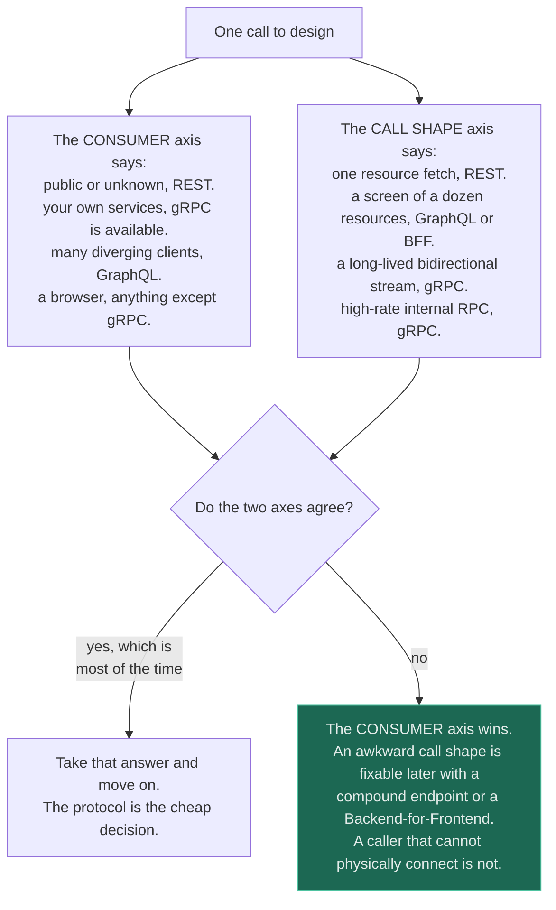
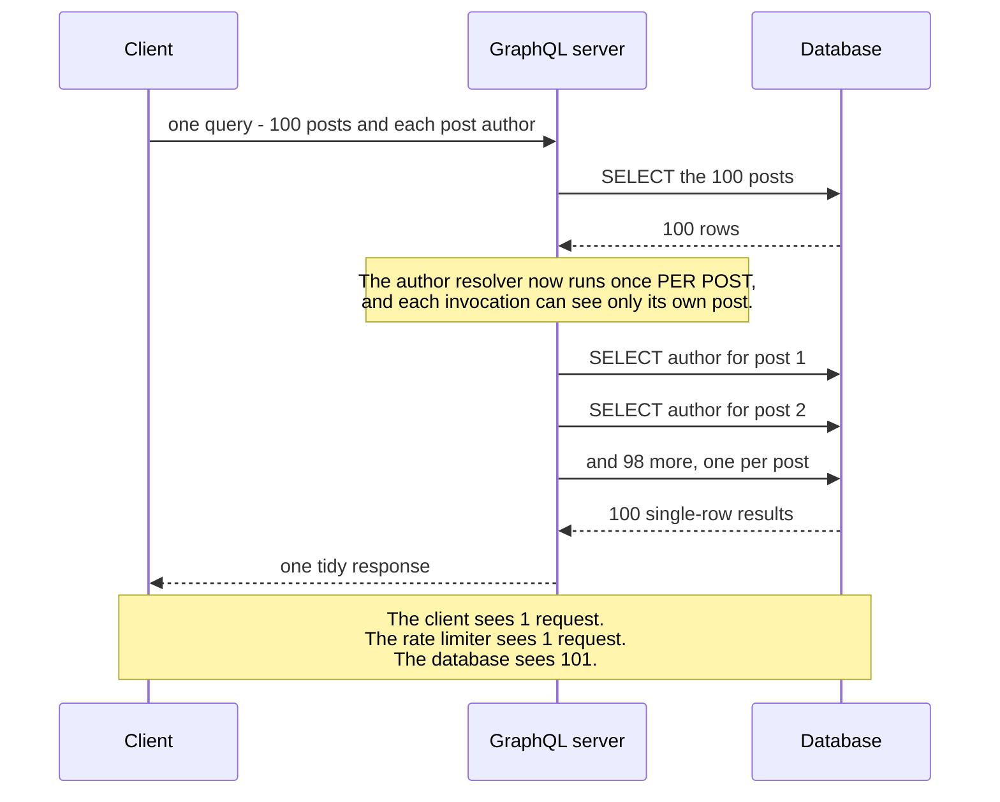
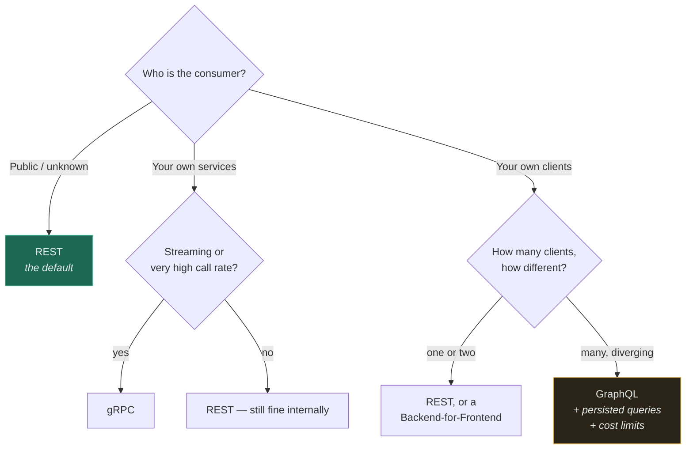

# REST vs gRPC vs GraphQL

`[INTERMEDIATE]` · The choice is decided by **who calls you and what shape the call is** — not by which of the three is newest. Two of them are specialist tools that most systems should not reach for, and the third needs no justification at all.

---

## 1. One-line definition

Three ways to expose a remote operation: **REST** models resources over plain HTTP, **gRPC** models
typed procedure calls over a binary HTTP/2 stream, and **GraphQL** models a queryable graph behind a
single endpoint.

## 2. Explain like I'm new

Imagine ordering food.

**REST** is a menu with numbered dishes. You say "number 14" and you get exactly dish 14 — no more,
no less. If your meal needs three dishes, you order three times. Everyone in the world understands a
numbered menu, which is the point.

**gRPC** is the intercom to the kitchen. It is fast, it is terse, both sides already agreed on the
vocabulary before service started, and a stranger who wanders in cannot use it at all.

**GraphQL** is telling the waiter exactly what you want on the plate: "chicken, no sauce, half the
rice, and whatever the soup is". You get one trip instead of three, tailored to you. The cost is that
the kitchen now has to handle any combination anyone can describe — including "everything on the menu,
twice" — and it cannot pre-plate anything in advance because no two orders are alike.

## 3. Real-world analogy

Postal addresses (REST), a direct phone line between two offices (gRPC), and a research librarian who
fetches exactly the pages you asked for (GraphQL).

**Where it breaks:** the librarian analogy makes GraphQL sound purely like a saving. In reality the
librarian has to walk to a different shelf for every field you asked for, and a request that reads as
one polite sentence can send them up and down the building a thousand times. That is the
[N+1 problem](#5-engineering-at-scale), and it is the defining cost of GraphQL — the analogy hides
precisely the thing you need to plan for.

## 4. Technical explanation

The three differ on far more than syntax, and the differences that matter operationally are rarely
the ones people compare.

| | **REST** (JSON/HTTP) | **gRPC** | **GraphQL** |
|---|---|---|---|
| Wire format | JSON text | Protobuf binary | JSON text |
| Transport | HTTP/1.1 or HTTP/2 | **HTTP/2 required** | Usually `POST` to one URL |
| Schema | Optional (OpenAPI) | **Mandatory** (`.proto`) | **Mandatory** (SDL) |
| Browser support | Native | **Poor** — needs grpc-web plus a proxy | Native |
| Streaming | Bolted on (SSE, WebSocket) | **Native, bidirectional** | Subscriptions, on a separate transport |
| Generated clients | Optional | **First class** | First class |
| HTTP caching / CDN | **Native** — `GET`, `ETag`, `Cache-Control` | None | **None** — one URL, one verb |
| Rate limiting | Per route, trivial | Per method, easy | **Hard** — cost varies per query |
| Debugging at 3am | `curl` | `grpcurl` + reflection | GraphiQL, or nothing |
| The failure it invites | Chatty clients, N round trips | Connection pinning under an L4 balancer | N+1 resolvers, unbounded queries |

**REST is the correct default and everything else needs an argument.** Not because it is technically
superior — it is not, on several axes — but because it is the only one of the three where every
possible caller, proxy, log aggregator, load balancer, CDN, browser, and junior engineer already
knows what to do. That compatibility is worth more than the wire efficiency you would gain, right up
until you can name the specific constraint that makes it worth less.

The two real arguments for the other two are narrow and precise:

- **gRPC wins when both ends are yours.** Binary encoding, generated clients in every language,
  streaming as a first-class call type, and a schema the compiler enforces rather than a document
  nobody reads. This describes internal service-to-service traffic and almost nothing else.
- **GraphQL wins when many *different* clients need different subsets of the same graph.** Not "our
  web app and our mobile app" — those are two clients and a
  [Backend-for-Frontend](../../13-design-patterns/CATALOGUE.md) is cheaper. It means iOS, Android,
  web, TV, watch, and a partner integration, each wanting a different slice, each shipping on its own
  schedule, with a backend team that cannot keep cutting bespoke endpoints.

**Choose by consumer.** This single table settles most of the argument:

| Who is calling | Choose | Why |
|---|---|---|
| Public third-party developers | **REST** | Anyone can call it with anything. Lowest support burden by a wide margin. |
| Your own single web frontend | **REST** | One client cannot amortise a query language. |
| Internal service-to-service | **gRPC** | Schema enforced at compile time; generated clients; streaming. |
| Many heterogeneous clients, differing data needs | **GraphQL** | This is the actual problem it was built for. |
| Mobile, poor network, one screen = many resources | **GraphQL** or a **BFF** | The round trips are the cost, not the bytes. |
| Long-lived bidirectional streams | **gRPC** | The only one where streaming is native rather than bolted on. |
| Anything a human will debug with `curl` | **REST** | |
| Bulk export of a million rows | **None of them** | A file and a signed URL. An API is the wrong shape for this. |

The second axis is **call shape**: a single resource fetch is REST-shaped, a screen composed of a
dozen related resources is GraphQL- or BFF-shaped, high-frequency internal RPC is gRPC-shaped, and a
stream is gRPC-shaped. If the consumer and the call shape disagree, the consumer wins — you can work
around an awkward call shape, but you cannot work around a caller who physically cannot connect.



The value is entirely in the bottom-right box, because that is the case the two tables above cannot
settle on their own. A composed mobile screen calling a *public* API is exactly this conflict: the
call shape points at GraphQL and the consumer points at REST, and the resolution is REST plus a
compound endpoint rather than a public query language. Read the asymmetry as the reason: call-shape
mistakes are fixed with an extra endpoint, consumer mistakes are fixed with a migration.

## 5. Engineering at scale

**gRPC under an L4 load balancer sends all your traffic to one backend.** This is the single most
common gRPC production surprise and it is structural, not a misconfiguration. HTTP/2 multiplexes
every call over one long-lived TCP connection; a connection-level balancer makes exactly one routing
decision, at connect time; therefore every subsequent request from that client goes to the same
server, forever. Your fleet looks balanced in the dashboard for CPU and utterly unbalanced in
reality.

The fixes, in increasing order of correctness: set a maximum connection age so connections churn and
re-balance, put an L7 proxy in the path that balances per-request, or do client-side load balancing
with service discovery. See [load balancing](../../03-load-balancing/fundamentals/) — the layer at
which you balance is the whole question here.

**GraphQL's N+1 problem is not a bug you can fix once.** Ask for 100 posts and each post's author,
and a naive resolver executes 1 query for the posts and 100 for the authors. Batching loaders
(DataLoader and its equivalents) collapse those 100 into 1 — but only *within a single request*, only
if every resolver is written to use them, and never across concurrent requests. The N+1 is a
permanent property of resolver-per-field execution; batching is a discipline you have to maintain in
every resolver anyone ever adds. Compare with the same problem in
[databases](../../05-databases/fundamentals/#19-failure-scenarios), where at least the ORM is the
only place it hides.



The cause is visible in the middle note, and it is architectural rather than careless: **a field
resolver is invoked per parent object and is given only that parent**, so it is structurally incapable
of noticing that 99 near-identical queries are about to run beside it. Batching loaders work by
deferring resolution to the end of a tick and collapsing what accumulated — which is why they only
help within one request, and only where every resolver on the path opted in. The last note is the
monitoring consequence: every layer above the database counts this as one request, so the only signal
that catches a new N+1 is **database queries per API request**.

**A public GraphQL endpoint without query-cost limits is a denial-of-service endpoint you built and
hosted for the attacker.** Nested traversal makes request cost superlinear in request *size*:

```
{ users { friends { friends { friends { posts { comments { author { name }}}}}}}}
```

That is under 100 characters and it is a combinatorial traversal of your entire social graph. The
mitigations are all mandatory rather than optional: query **depth** limits, **complexity** scoring
with a per-caller budget, and — the one that actually works — **persisted queries**, where clients
register their operations ahead of time and the endpoint refuses anything not on the allow-list. A
persisted-query GraphQL API is, usefully, back to having a finite set of known operations you can
cost, cache, and rate limit, which is what REST gave you for free.

**Protobuf's size advantage is oversold; its schema advantage is undersold.** Yes, Protobuf is several
times smaller than equivalent JSON — and then gzip closes most of that gap on the wire. The durable
gRPC wins are the mandatory schema, the generated clients that fail at *compile* time instead of at
3am, streaming, and cheap parsing at high call rates. If someone justifies gRPC purely on payload
size, they have picked the weakest of its four real arguments.

**Caching is where GraphQL's cost is most often missed.** REST gets HTTP caching for free at every
layer: browser, CDN, reverse proxy, all keyed on the URL. GraphQL posts an opaque body to one URL, so
none of that machinery applies and you must rebuild caching at the entity or resolver layer yourself.
That is a real cache with real [invalidation problems](../../04-caching/fundamentals/), now living in
your application instead of in infrastructure you did not have to write.

## 6. The problem it solves

- **REST** — exposing operations to callers you have never met, over infrastructure you do not
  control, in a way that needs no shared library.
- **gRPC** — the cost and fragility of hand-written internal clients: serialisation overhead, drifted
  request models, and integration bugs found in production rather than by the compiler.
- **GraphQL** — over-fetching and under-fetching across many differing clients. Under-fetching (the
  screen needs six endpoints, so six round trips) is the expensive half, especially on mobile
  networks where [latency](../../00-foundations/latency/), not bandwidth, is the constraint.

## 7. The problem it does NOT solve

**None of the three makes a bad service boundary good.** A beautifully typed gRPC interface across a
seam that should never have been cut is still a distributed transaction waiting to happen — see
[monolith vs microservices](../../02-architecture/monolith-vs-microservices/). The protocol is the
cheapest and most reversible decision in this whole area; the boundary is the expensive and permanent
one, and teams routinely spend a month on the first and an afternoon on the second.

Specifically:

- **GraphQL does not make your backend fast.** It makes it dramatically easier for a client to ask
  for something expensive, and moves the cost from "many cheap requests" to "one request you cannot
  predict the cost of".
- **gRPC does not give you exactly-once.** Deadlines and retries are built in, which means duplicate
  execution is built in too. You still need [idempotency](../idempotency/).
- **None of them version themselves.** Protobuf gives you structural wire compatibility, which is
  genuinely useful and is not a versioning strategy. See [versioning](../versioning/).
- **None of them fix pagination**, and GraphQL's connection spec is a convention, not an
  implementation — see [pagination](../pagination/).

---

## 9. How it works

The mechanical difference is *where the shape of the response is decided*, and everything else
follows from it.

| | Response shape decided by | Consequence |
|---|---|---|
| REST | The **server**, at design time, per endpoint | Cacheable and costable; sometimes wrong for a given client |
| gRPC | The **schema**, at compile time | Both ends verified; changing it is a coordinated release |
| GraphQL | The **client**, at request time | Never over-fetches; cost and cacheability become unknowable |



The amber leaf carries conditions because it is the only one of the four that arrives with mandatory
homework. Choosing GraphQL and deferring cost limits is choosing an outage on a date of an attacker's
choosing.

Note the second-from-left leaf: **REST is a perfectly good internal protocol.** "Internal traffic
should be gRPC" is a preference dressed as a rule. gRPC earns its place when the call rate, the
streaming, or the polyglot client generation is actually worth the operational novelty — not
automatically.

## 13. When to use it

**Choose REST when** the callers are external or unknown; when you want CDN and HTTP caching; when
per-route rate limiting matters; when the team is small and debuggability is worth more than
efficiency; or when you have no specific reason to choose otherwise — which is most of the time.

**Choose gRPC when** both ends are yours and deployed together-ish; when the call rate is high enough
that serialisation cost is measurable; when you need streaming; when polyglot services need
consistent generated clients; or when you want the compiler to catch contract drift.

**Choose GraphQL when** you have several genuinely different clients over one domain graph; when
client teams are blocked waiting on backend teams to cut endpoints; when under-fetching on mobile is
a measured problem — **and** when you are willing to fund persisted queries, cost analysis, and
resolver-level caching from day one.

## 14. When NOT to

- **gRPC for a browser-facing API.** grpc-web plus a translating proxy works, and it removes most of
  gRPC's advantages while keeping all of its debugging cost.
- **GraphQL with one client.** You have built a query engine to serve a single consumer whose needs
  you already know. Cut the endpoints instead.
- **GraphQL to avoid talking to the backend team.** That is an [organisational
  problem](../../02-architecture/monolith-vs-microservices/) and GraphQL will not fix it; it will
  relocate it into resolver ownership disputes.
- **REST for a high-frequency internal hot path** where JSON parsing is genuinely showing up in
  profiles — measure first, this is rarer than assumed.
- **Any of them for bulk data movement.** Millions of rows want a file, an object store, or
  replication — not an HTTP API with a page cursor.
- **All three at once, "so clients can choose".** Three surfaces, three sets of bugs, three
  deprecation problems, one team.

## 17. Trade-offs

| Choose | Get | Pay |
|---|---|---|
| REST | Universal reach, HTTP caching, trivial rate limiting, `curl` | Over/under-fetching; chatty clients on composed screens |
| gRPC | Binary efficiency, schema enforcement, native streaming, generated clients | No browser without a proxy; L7-aware balancing required; harder to debug |
| GraphQL | One round trip per screen; clients ship without backend changes | **N+1**, no HTTP caching, hard rate limiting, per-field authorisation |
| Persisted queries on GraphQL | Costable, cacheable, rate-limitable again | Clients can no longer ship a new query without a deploy — you gave back the flexibility you bought |
| A BFF instead of GraphQL | Screen-shaped responses, caching and limits intact | One backend per client type to build and own |
| Schema-first anything | Contract drift caught by tooling | A change is now a coordinated release, not a commit |

The persisted-queries row is the honest one and it is rarely stated. **Locking GraphQL down enough to
operate it safely removes most of the reason you adopted it.** If your clients cannot ship arbitrary
queries, you bought a query language to generate a fixed set of endpoints — which is a defensible
choice, but you should make it knowingly.

## 18. Why not?

| Alternative | Why not here | When it WOULD win |
|---|---|---|
| **REST, always** | Loses streaming and typed internal contracts; chatty for composed screens | The default. Any time you cannot name the specific constraint that rules it out |
| **gRPC everywhere, including the edge** | Browsers need a proxy; external callers cannot use it; debugging cost on every incident | Internal-only platforms, or a mobile client you fully control |
| **GraphQL everywhere** | Rebuilds caching, rate limiting, and authorisation that HTTP gave you free | Many diverging clients over one graph, with the team to run it properly |
| **Backend-for-Frontend** ([pattern](../../13-design-patterns/CATALOGUE.md)) | One backend per client type to own and deploy | **The most underrated option here.** Two or three clients, screen-shaped responses, caching intact |
| **tRPC / typed RPC over HTTP** | Ties client and server to one language | A single-language full-stack team wanting types without Protobuf |
| **Webhooks / events** ([queues](../../06-messaging/queues/)) | Not request/response; harder to reason about | The caller does not need an answer now — often the real requirement |
| **A file drop + object store** | No interactivity | Bulk export/import, where an API is simply the wrong shape |

The BFF row deserves the emphasis. **Most teams who adopted GraphQL wanted a Backend-for-Frontend**:
one endpoint per screen, shaped by the team that owns that screen, returning exactly what the screen
needs. It solves under-fetching completely, keeps HTTP caching, keeps per-route rate limits, and
costs you a service instead of a query engine.

## 19. Failure scenarios

| Failure | What happens | Mitigation |
|---|---|---|
| **gRPC call with no deadline** | Default is *no timeout*. A hung callee holds the caller's thread indefinitely and the failure propagates up the call graph | Set a deadline on **every** call; propagate the remaining budget downstream |
| **gRPC behind an L4 balancer** | All requests from one client pin to one backend; the fleet is unbalanced and one node melts | L7 proxy, client-side balancing, or `max_connection_age` |
| **GraphQL N+1** | One tidy query becomes 1,000 database round trips; the database, not the API, falls over | Batching loaders, enforced in review; alert on queries-per-request |
| **Unbounded GraphQL query** | A single request saturates the database. No rate limiter helps — it was one request | Depth limits, complexity budget, persisted queries |
| **GraphQL partial failure** | HTTP 200 with `errors` populated. Clients that check the status code think it succeeded | Treat the `errors` array as first class in clients and in monitoring |
| **Breaking schema change** | Generated clients fail at deserialisation, often far from the change | Additive-only evolution; reserved Protobuf field numbers — see [versioning](../versioning/) |
| **REST chatty client** | 40 sequential round trips to paint one screen; fine on fibre, unusable on 4G | BFF or a compound endpoint; measure round trips per screen, not per API |
| **Cache stampede after a GraphQL deploy** | Resolver-level cache keys change; everything misses at once | Versioned cache keys and staged rollout — see [caching](../../04-caching/fundamentals/) |

**The first row is the one that causes multi-service outages.** A missing deadline turns one slow
dependency into thread exhaustion in every service that calls it, and then in every service that
calls *them*. Slow is worse than down, and gRPC's default makes "slow" unbounded — see
[reliability](../../00-foundations/reliability/).

---

## 25. Without it → With it → New problem → Next

```
Without it   →  every caller invents its own request format; contracts live in
                tribal knowledge and break silently between releases
With it      →  one stated contract, one serialisation, one set of client
                expectations — and, for gRPC and GraphQL, a schema tooling can check
New problem  →  the contract is now permanent. Any protocol that generates clients
                turns a field change into a coordinated multi-team release, and
                GraphQL specifically hands cost control to the caller
Next         →  versioning and deprecation to change the contract safely;
                idempotency because every one of these protocols retries;
                pagination because responses outgrew one payload
```

The protocol is the cheap, reversible decision. The
[service boundary underneath it](../../02-architecture/monolith-vs-microservices/) is the expensive,
permanent one — see [the chain](../../SYSTEM-DESIGN-THINKING.md#part-1--the-chain).

## 28. Common mistakes

| Mistake | Why it is wrong |
|---|---|
| Choosing by what is newest | The consumer decides. Fashion has never once been a constraint |
| gRPC for a public or browser API | Needs a proxy, excludes most callers, loses `curl` — and gains little at edge call rates |
| GraphQL with a single client | A query engine serving one known consumer; a BFF or plain endpoints are cheaper |
| GraphQL without cost limits | One request can take down the database, and rate limiting by request count does nothing |
| Assuming DataLoader "fixes" N+1 | It batches within one request only, and only where someone remembered to use it |
| No deadline on gRPC calls | The default is unbounded; one slow service exhausts every caller |
| L4 balancing in front of gRPC | Connection pinning; an unbalanced fleet that looks fine on average CPU |
| Justifying gRPC on payload size alone | The weakest of its arguments; gzip closes most of the gap |
| Returning HTTP 200 with a GraphQL error body | Monitoring reports 100% success during an incident |
| Running all three "so clients can choose" | Three surfaces, three deprecation problems, one on-call rotation |
| Treating the protocol as the architecture | A typed interface over a wrong boundary is still a wrong boundary |

## 29. Monitoring

Per-route (REST), per-method (gRPC), or **per-operation-name** (GraphQL) latency and error rate — a
single aggregate for `POST /graphql` is not monitoring, it is an average across unrelated workloads.

For GraphQL specifically, the number that predicts outages is **database queries per API request**;
alert when it rises, because that is N+1 appearing in a resolver someone added last week. Also track
query depth and complexity distribution, and the share of traffic using persisted queries — a falling
share means someone found the escape hatch.

For gRPC: deadline-exceeded rate as its own signal, and per-backend request distribution, because
that is how you discover connection pinning before the pager does. For REST: round trips per rendered
screen, measured at the client, since that is the number GraphQL and BFFs exist to reduce and it is
invisible from the server. All of this needs
[distributed tracing](../../11-observability/) to be interpretable at all.

## 31. Exercises

1. Your mobile team says the app is slow and asks to move the whole public API to GraphQL. What do
   you measure before agreeing, and what cheaper change might the measurement point to?

<details><summary>Answer</summary>

Measure **round trips per screen** and the latency breakdown per trip, at the client, on a real
mobile network. GraphQL helps if the problem is *under-fetching* — six sequential calls to paint one
screen, where the round-trip time dominates. It does not help if the problem is one slow endpoint,
oversized images, or a cold cache, and it will make those harder to diagnose.

If the measurement shows under-fetching for a small number of known screens, a
[Backend-for-Frontend](../../13-design-patterns/CATALOGUE.md) or one compound endpoint gets the same
latency win, keeps HTTP caching and per-route rate limiting, and costs a service rather than a query
engine plus persisted-query infrastructure plus a cost-analysis layer. Also note the API is
*public*: adopting GraphQL means third parties, not just your app, can now compose arbitrary queries
against your database.
</details>

2. You put gRPC between two internal services. Latency is good, but one of six backend pods runs at
   90% CPU while the others sit at 15%. The load balancer reports an even split. Explain both facts
   at once.

<details><summary>Answer</summary>

Both are true. The balancer is splitting **connections** evenly, and gRPC uses one long-lived HTTP/2
connection per client, multiplexing every request over it. So a client that connected to pod 3 sends
*all* of its requests to pod 3 for the life of that connection. With a small number of client
instances, an even connection split produces a wildly uneven request split — and if one client is
busier than the others, its pod carries that load alone.

Fixes: balance at L7 so routing happens per request; or do client-side load balancing with service
discovery; or set a maximum connection age so connections churn and redistribute. The general lesson
is that **the layer you balance at must match the layer your protocol multiplexes at** — see
[load balancing](../../03-load-balancing/fundamentals/).
</details>

3. A GraphQL API is behind a rate limiter allowing 100 requests per minute per client. A caller stays
   well under the limit and the database still falls over. Why, and what would you have limited
   instead?

<details><summary>Answer</summary>

Request count is meaningless when request *cost* is unbounded. One GraphQL query with nested
connections can traverse an enormous subgraph and issue thousands of database queries; 100 of those
per minute is not a modest load, it is an attack. REST does not have this problem because each route
has a roughly known cost, which is exactly why per-route limiting works there.

Limit on **cost**, not count: assign a static complexity score to each field and connection, compute
the query's score before execution, reject anything above a ceiling, and debit a per-caller budget by
the score. Add a depth limit as a cheap backstop, and move to persisted queries so that only
allow-listed operations — whose cost you have already measured — can run at all.
</details>

4. Your public REST API is stable and widely used. An internal team proposes replacing it with gRPC
   "because it is faster". Give the strongest version of their argument, then say why it still loses.

<details><summary>Answer</summary>

The strongest version: Protobuf is smaller and much cheaper to parse than JSON, HTTP/2 multiplexing
removes head-of-line blocking across concurrent calls, the schema is compiler-enforced so contract
drift becomes a build failure, and every consumer gets a generated client instead of hand-rolling
one. At high call rates those are real, measurable wins.

It still loses because the consumer is *the public*. gRPC excludes browsers without a proxy,
excludes anyone whose stack lacks good tooling, breaks every existing integration, removes CDN and
HTTP caching, removes per-route rate limiting as configured today, and makes third-party debugging
materially harder — and the support burden of all of that lands on you. The efficiency gain accrues
to your servers; the cost accrues to every caller. **Choose by consumer**: for an unknown public
audience, reach beats efficiency essentially always. If the internal hot path genuinely needs gRPC,
put it *behind* the REST edge, where both ends are yours.
</details>

5. Two teams argue for a week about REST versus GraphQL for a new "orders" service, then ship
   whichever won. Six months later everything is painful. What did they most likely get wrong, and
   which decision should have taken the week?

<details><summary>Answer</summary>

They optimised the reversible decision. Protocol is a surface: you can put a translating layer in
front of a service, run REST and gRPC side by side, or migrate a client at a time. What is not
reversible is the **service boundary** — what data this service owns, which invariants must hold
atomically inside it, and which of those now span a network call.

If "orders" was cut such that placing an order must atomically touch inventory and payment in other
services, no protocol saves them: they have chosen sagas, compensating transactions, eventual
consistency, and multiplied availability, and they chose it in an afternoon. The week should have
gone on the boundary — see
[monolith vs microservices](../../02-architecture/monolith-vs-microservices/). The heuristic worth
remembering: **if two things must be atomic, they belong in the same service**, whatever the API
between them looks like.
</details>

## 33. Related

- [Versioning](../versioning/) — none of the three versions itself
- [Pagination](../pagination/) · [Idempotency](../idempotency/) — protocol-independent, and both mandatory
- [Monolith vs microservices](../../02-architecture/monolith-vs-microservices/) — the boundary decision underneath the protocol decision
- [Load balancing](../../03-load-balancing/fundamentals/) — why gRPC needs an L7 path
- [Caching](../../04-caching/fundamentals/) — what GraphQL gives up and has to rebuild
- [Latency](../../00-foundations/latency/) — why round trips, not bytes, drive mobile API design
- [Observability](../../11-observability/) — per-operation metrics, or you are monitoring an average of unrelated things
- [Pattern catalogue](../../13-design-patterns/CATALOGUE.md) — Backend-for-Frontend, Ambassador, Sidecar
- [Combination matrix](../../14-component-combinations/MATRIX.md) · [Glossary](../../GLOSSARY.md)
- [API design index](../README.md)
