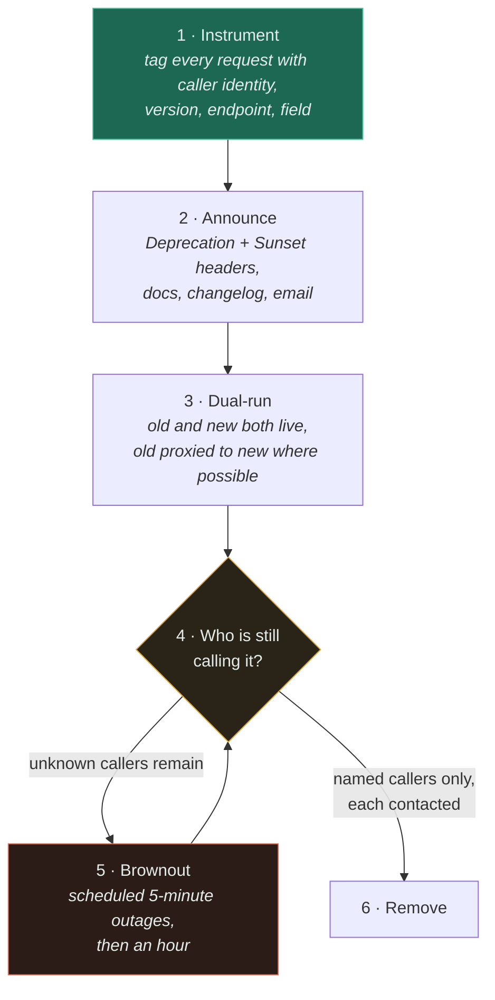

# API Versioning

`[INTERMEDIATE]` · Versioning is the easy half. **The hard half is deprecation** — and you cannot deprecate anything until you can name who is still calling it.

---

## 1. One-line definition

A set of conventions for changing a published contract without breaking the callers who already
depend on it — and, eventually, for removing what they no longer need.

## 2. Explain like I'm new

You publish a form for people to fill in. Thousands of people have printed copies.

Adding an **optional** box to the form is fine: old copies still work, they just leave it blank.
Adding a **required** box breaks every printed copy at once. Removing a box breaks everyone who was
reading what it said. Renaming a box is removing one and adding another, so it breaks people too.

That is the entire rule: **you can add, you cannot take away**. The rest of this page is what to do
when you genuinely must take something away — and the surprising discovery that the difficult part is
not printing a new form, it is finding out who is still using the old one.

## 3. Real-world analogy

A phone number that changes. You keep the old line ringing, you record a message pointing at the new
number, and one day you finally disconnect it.

**Where it breaks:** with a phone line you can hear the calls still coming in — the old number ringing
is itself the evidence that someone has not moved. An API gives you no such feedback unless you
deliberately built it. Most teams discover who was still on v1 at the moment they switch it off,
which is the worst possible time and the most expensive possible way. **The telemetry is the
strategy**; the version string is just labelling.

## 4. Technical explanation

The taxonomy that matters is not "URL versus header". It is **what counts as breaking**, and the
answer is broader than most teams assume.

| Change | Breaking? | Why |
|---|---|---|
| Add a new endpoint | No | Nobody calls what they do not know about |
| Add an **optional** request field | No | Old callers omit it; the server must have a sane default |
| Add a field to a **response** | No — *if readers are tolerant* | Clients with strict schema validation reject unknown fields and will break |
| Add a **required** request field | **Yes** | Every existing caller is instantly invalid |
| Remove a response field | **Yes** | Someone reads it. Someone always reads it |
| Rename anything | **Yes** | A removal plus an addition, in one commit |
| Change a field's type | **Yes** | Even widening `int32` → `int64` breaks fixed-width parsers |
| Make a response field nullable | **Yes** | Clients that never handled null now crash on a value you consider valid |
| Make a required request field optional | No | Strictly more inputs accepted |
| Add an enum value | **Yes, in practice** | Any client with exhaustive matching fails on the value it has never seen |
| Tighten validation | **Yes** | Requests that worked yesterday now 400 |
| Loosen validation | No — *usually* | Unless a caller relied on the rejection as a check |
| Change default sort order or page size | **Yes, in practice** | Undocumented behaviour that clients absolutely depend on |
| Change the error shape or an error code | **Yes** | Error handling is client code too, and it is the least tested client code |
| Make a call 10× slower | **Yes, in practice** | Client timeouts are part of your contract whether you agreed to them or not |

**The real rule is that additive changes are safe and removals are not** — where "removal" includes
taking away a behaviour nobody ever wrote down. This is Hyrum's Law: with enough users, every
observable property of your interface is depended upon by somebody. The last four rows of that table
are all the same row.

Two consequences follow immediately, and they are the practical content of this page:

1. **Design so that additive changes cover most of what you will ever need.** Optional fields,
   extensible enums with a documented `UNKNOWN` fallback, error objects with a stable envelope and an
   open detail field, explicit pagination and sort parameters rather than implicit defaults. An API
   built this way can evolve for years without a version bump.
2. **Write clients to be tolerant readers.** Ignore unknown fields, do not fail on a new enum value,
   do not assume field order, do not parse error strings. You control your own internal clients;
   make tolerance a library default rather than a habit each team must remember.

### Where to put the version

| Mechanism | Example | Verdict |
|---|---|---|
| **URI path** | `/v2/orders` | **The default.** Visible in every access log, routable at the load balancer, pasteable into a bug report, trivially `curl`-able |
| Query parameter | `/orders?version=2` | Works. Easy to omit by accident; must be part of every cache key |
| Custom header | `X-API-Version: 2` | Invisible in a URL, silently stripped by some proxies, hard to reproduce by hand |
| Media type | `Accept: application/vnd.acme.v2+json` | Doctrinally "correct", operationally the worst of the four |
| No versioning; evolve additively | — | **Best of all, if you can hold the line** |
| Field-level deprecation (GraphQL) | `@deprecated(reason:)` | Moves the problem to per-field usage data, which you must then collect |
| Wire-structural (Protobuf) | field numbers, `reserved` | Compatibility is structural, not a version string — a different and better model |

**A version in the URL is honest and easy, and every argument against it is aesthetic.** The
objection is that a version is not part of a resource's identity, which is true and does not matter.
What matters at 3am is that you can read the version off a log line, route it at the edge, split
traffic between versions with a load balancer rule, and reproduce a report by pasting a URL. The
media-type approach optimises for a REST purity argument at the direct cost of every operational
concern, and teams that adopt it end up printing the version into logs anyway.

**Version the API, not the endpoint.** Per-endpoint versions look like they give you granularity;
what they give you is a combinatorial matrix of endpoint-version pairs that nobody can reason about
and no client can navigate. One version number for the surface, bumped rarely, with additive
evolution doing the day-to-day work.

## 5. Engineering at scale

**Every live version is a permanent tax**, and it is a bigger one than the code suggests. Each
version is a code path to test, a set of dashboards, a row in the incident runbook, a migration to
consider on every schema change, and a thing to explain to every new hire. Two supported versions is
manageable. Five is a maintenance programme. The rule worth committing to publicly: **support N and
N-1, nothing older**, and mean it — a stated policy is what makes removal a scheduled task rather
than a negotiation.

**GraphQL's "we don't need versions" claim is half true and the half that is false is the expensive
half.** Additive schema growth plus `@deprecated` on fields genuinely avoids version *numbers*. It
does not avoid deprecation: you still cannot delete a field until you know no client selects it, and
now you need per-field usage telemetry rather than per-endpoint, at higher cardinality, attributed to
individual clients. GraphQL moved the problem from a place with good tooling (routes, logs, CDNs) to
a place where you must build the tooling yourself. Call that a trade, not a solution.

**Protobuf's model is the one to steal conceptually.** Compatibility is enforced by structure: field
numbers, not names, are on the wire; unknown fields are preserved rather than rejected; you `reserve`
a number when you remove a field so it can never be reused with a different meaning. Reusing a field
number is the classic Protobuf disaster — old and new clients agree on the number and disagree on the
type, and the failure is a silently misinterpreted value rather than an error. The transferable
lesson for JSON APIs: **never reuse a name for a different meaning.** A field that once held a
currency string must never later hold an integer of minor units, whatever the migration plan says.

**Internal APIs are not exempt; they are merely easier.** "It's internal, we can just change it" is
true only if you can enumerate the callers. If you can list the six services that call this endpoint
and reach their owners in a chat channel, move fast. If you cannot, an internal API is a public API
with worse telemetry — and at any real company size, you cannot.

## 6. The problem it solves

Changing a contract that other people's running code depends on, without a coordinated global
release — which is impossible to arrange and, past a handful of teams, impossible to attempt.

## 7. The problem it does NOT solve

**Versioning does not remove old code; it accumulates it.** A version number is permission to leave
the old behaviour running, and without a deprecation process that permission is permanent. Teams that
"solved" versioning by adding `/v2` frequently have v1 traffic five years later, from a client nobody
can identify, which is now load-bearing for a customer nobody can name.

It also does not help with:

- **Data migrations.** A field's *meaning* changing in the database is a separate and harder problem;
  see expand-contract in the [pattern catalogue](../../13-design-patterns/CATALOGUE.md) and the
  migration notes in [databases](../../05-databases/fundamentals/).
- **Clients that never update.** Mobile apps in particular: a shipped binary may call your v1 for
  years, and app stores do not let you force an upgrade quickly. Version support windows for mobile
  are set by the slowest 1% of installs, not by your release cadence.
- **Behavioural drift.** No version scheme protects a caller from your endpoint getting slower or
  changing its result ordering.

---

## 9. How it works — the deprecation lifecycle

Versioning is a labelling convention and takes an afternoon. This is the part that takes a quarter.



Two things about that diagram are the whole point.

**Step 1 comes first and is usually skipped.** If you announce a deprecation before you can measure
usage, you have started a process you cannot finish — you will reach the removal date with no
evidence and no choice but to guess. Every request should carry the caller's identity (API key,
client ID, service account, user agent as a last resort), the version, the endpoint and — for
GraphQL — the fields actually resolved. That is an [observability](../../11-observability/) problem
with a cardinality cost, and it is the price of ever deleting anything.

**Step 5 is the loop most teams lack, and it is the only step that reliably works.** A brownout is a
deliberate, announced, short outage of the deprecated path: return `410 Gone` for five minutes at a
fixed time, then an hour a fortnight later. It works because it converts silence into a support
ticket from exactly the team you needed to talk to. Emails and changelogs are read by people who were
already going to migrate. **A brownout is the only technique that finds the caller who never read
anything**, and it finds them at a time you chose rather than on removal day.

Signalling, concretely: `Deprecation: true` and `Sunset: <HTTP-date>` on every response from the old
path (RFC 8594), a `Link` to the migration guide, a log line per call at low sample rate, and — for
internal callers — a build-time warning in the generated client, which is the one place engineers
cannot ignore it.

## 13. When to use it

- **Version explicitly** when the API is public, or internal with callers you cannot enumerate.
- **Bump the version** only for a genuine break — a removal, a type change, a semantic change to an
  existing field. Additive growth does not deserve a version and creates migration work for nothing.
- **Deprecate per field** (rather than per version) when the surface is large and the breaks are
  localised. This is GraphQL's model and it works for REST too.
- **Run a brownout** whenever your usage telemetry still shows callers you cannot name.
- **Use expand-contract** — add the new shape, migrate readers, then remove the old — for anything
  that touches storage as well as the API.

## 14. When NOT to

- **Do not version for an additive change.** `/v2` because you added an optional field is a new code
  path, a new test matrix and a client migration in exchange for nothing.
- **Do not version per endpoint.** The combinatorics defeat everyone, starting with your own docs.
- **Do not run more than two versions** without a written reason and a dated plan for the third.
- **Do not use header or media-type versioning** unless someone can explain how they will debug a
  production report with it. "It is more RESTful" is not that explanation.
- **Do not announce a deprecation before you can measure usage.** You will not be able to finish, and
  a missed sunset date teaches every caller that your dates are fictional — which makes the next one
  harder.
- **Do not maintain a version to avoid a difficult conversation.** That is not engineering, it is a
  standing cost paid by everyone to avoid one call with a customer.

## 17. Trade-offs

| Choose | Get | Pay |
|---|---|---|
| URL versioning | Visible, routable, debuggable, trivially cacheable | Version leaks into every path and client constant |
| Header / media-type versioning | A "pure" resource identity | Invisible in logs, proxy-fragile, painful to reproduce by hand |
| No versioning, additive only | Zero migration cost; one code path | You can never remove anything without a break |
| Field-level deprecation | Fine-grained removal; no big-bang migration | Needs per-field usage telemetry, at high cardinality |
| Supporting N and N-1 | Bounded maintenance; a credible removal story | Callers must move on your schedule, and some will complain |
| Supporting every version forever | No caller is ever inconvenienced | Permanent, compounding cost paid by your team, on every change, forever |
| Brownouts | You find the silent callers, at a time you chose | You deliberately caused an incident for someone — do it with notice, and never near their peak |
| Tolerant readers | Clients survive additive change unattended | Real breaks are silently swallowed instead of failing loudly |

The last row deserves care. Tolerance is right for *unknown* fields and *unknown* enum values, and
wrong for a field you require and did not get. **Be liberal about what you ignore, strict about what
you rely on** — a client that silently treats a missing required field as zero is a data-corruption
bug wearing a robustness costume.

## 18. Why not?

| Alternative | Why not here | When it WOULD win |
|---|---|---|
| **Never break anything; add forever** | The surface grows without bound and eventually cannot be explained or tested | **Genuinely the best option for most APIs.** Small teams, stable domain, public callers |
| Big-bang cutover ("everyone moves on the 14th") | Requires coordinating releases you do not control | A handful of internal callers you can name and schedule with |
| Version negotiation per request | Complex; every code path multiplies | Long-lived protocols with slow-upgrading clients — device firmware |
| Translate v1 → v2 in a gateway | The translation layer becomes its own untested legacy component | Mechanical shape changes only, as a *temporary* bridge with its own sunset date |
| Two parallel deployments (v1 service, v2 service) | Two of everything: data access, bugs, on-call | A genuinely large break where the internals differ, e.g. a rewrite |
| Semantic versioning on the API | Implies a precision HTTP APIs do not have; callers cannot pin a patch level | Client libraries and SDKs, where the consumer really is a package manager |

The first row is a real option and usually the right one. **If your options table has no row for "do
not version at all", you have not finished thinking** — most APIs that ended up with four versions
needed zero, and got there one avoidable rename at a time.

## 19. Failure scenarios

| Failure | What happens | Mitigation |
|---|---|---|
| **Removal with no usage data** | You switch off v1 and find out who used it from the incident channel | Instrument before announcing — step 1 exists for this |
| **Sunset date slips, repeatedly** | Callers learn your dates are advisory; the next deprecation is ignored entirely | Publish few dates and honour them; brownout to make the date real |
| Enum value added, strict client | A client crashes on a value it has never seen, in the field, on a value you consider routine | Document an `UNKNOWN` fallback from day one; test clients against unknown values |
| Strict schema validation on responses | An additive server change breaks a caller you thought was safe | Tolerant readers as the client-library default |
| Field name reused with a new meaning | Silent misinterpretation — no error anywhere, wrong numbers everywhere | Never reuse a name; `reserved` in Protobuf, a naming policy in JSON |
| Mobile client never upgrades | A five-year-old binary is still calling v1 and its users are real customers | Minimum-supported-version enforcement in the app; plan for the slow 1% |
| **Version drift between docs and reality** | Callers integrate against documentation that has not been true for a year | Generate docs from the schema; contract tests in CI |
| Gateway translation layer rots | A shim written for six months becomes the load-bearing path for six years | Give the shim its own sunset date and its own owner, in writing |
| Breaking change shipped by accident | Nobody meant to; a serialiser default changed | Contract tests and a schema diff gate in CI — this is the only real defence |

**The last row is the one worth investing in.** Most breaking changes are not decisions, they are
side effects: a library upgrade changes date formatting, a refactor drops a field, someone tightens a
validator. A schema diff in CI that fails the build on a non-additive change catches all three, and
it costs a day to set up.

---

## 25. Without it → With it → New problem → Next

```
Without it   →  any contract change breaks live callers; you can only ship changes
                during a coordinated release nobody can actually coordinate
With it      →  the contract can evolve; old and new callers coexist; changes ship
                on your schedule instead of the slowest caller's
New problem  →  old versions never die. Every version is a permanent code path, test
                matrix and on-call surface — and you cannot remove one without
                knowing who still calls it
Next         →  per-caller usage telemetry (an observability problem), a stated
                support window, and brownouts to find the callers who never read
                the announcement
```

Versioning is the component; **deprecation telemetry is the component it forces** — see
[the chain](../../SYSTEM-DESIGN-THINKING.md#part-1--the-chain).

## 28. Common mistakes

| Mistake | Why it is wrong |
|---|---|
| Adding `/v2` for an additive change | A whole migration bought for something that would not have broken anyone |
| Announcing a deprecation before instrumenting usage | You reach the sunset date with no evidence and no ability to act |
| Versioning per endpoint | A version matrix nobody — including your docs — can navigate |
| Header or media-type versioning by default | Invisible in logs, proxy-fragile, unreproducible by hand |
| Assuming an added enum value is safe | Exhaustive matching in clients fails on the first unseen value |
| Assuming an added response field is safe | Strict schema validators reject unknown fields |
| Reusing a field name or Protobuf number | Silent misinterpretation; no error is raised anywhere |
| Treating internal APIs as versionless | True only if you can enumerate the callers — and you cannot |
| Missing a sunset date | Teaches every caller that your dates are optional |
| Believing GraphQL removed the problem | It removed version numbers, not deprecation, and made usage data harder to collect |
| No schema diff in CI | Most breaking changes are accidents, and this is what catches accidents |
| Keeping a version alive to avoid one hard conversation | A permanent team-wide cost to avoid a ten-minute call |

## 29. Monitoring

The primary signal is **requests per (version, endpoint, caller)** — and the caller dimension is the
one that makes deprecation possible at all. Without it you know a deprecated endpoint gets 40,000
calls a day and you cannot do anything about it; with it you know the three services responsible and
can go and talk to them.

Also track: the count of live versions (a number that should be flat or falling, reviewed monthly);
deprecated-path traffic as a trend, with an alert if it stops falling; time since the oldest version
was introduced; and the error rate during each brownout window, which is your measurement of what
removal day would actually look like.

Cardinality is a genuine cost here — caller × version × endpoint multiplies fast. Sample the detail
and keep exact counts only on deprecated paths, where they earn their keep. See
[observability](../../11-observability/) for the cardinality trap.

## 31. Exercises

1. You add an optional `currency` field to an order response. A partner's integration starts
   returning 500s within an hour. You changed nothing else. What happened, and whose bug is it?

<details><summary>Answer</summary>

Their client validates responses against a strict schema that rejects unknown fields —
`additionalProperties: false`, or a strongly-typed deserialiser configured to fail on unmapped
members. An
additive change is only safe if readers are tolerant, and the tolerance is a property of the
*client*, not of your change.

Whose bug it is matters less than what it obliges you to do. Formally it is theirs. Practically the
outage is yours, because you shipped it and their customers are affected. The lesson is that
"additive is safe" is a statement about well-behaved clients, and for a public API you cannot assume
well-behaved clients — so document tolerant-reader expectations explicitly, ship a conformance test
with the SDK, and consider putting genuinely new fields behind an opt-in for a transition period.
Internally, make tolerance the default in the shared client library so no team can get it wrong.
</details>

2. A deprecated endpoint gets 40,000 calls a day. You emailed everyone six months ago, the sunset
   date is next week, and you cannot tell who the callers are. What do you do — and what should you
   have done in month one?

<details><summary>Answer</summary>

Do not switch it off blind. First, get identity onto those requests immediately, even crudely: API
key, source IP, user agent, TLS client fingerprint, whatever you have. Then run a **brownout** —
announce a five-minute `410 Gone` window at a fixed time, and watch who complains and who retries.
That converts anonymous traffic into named humans within one cycle. Repeat with a longer window.
Slip the sunset date once, publicly, with the new date tied to the brownout schedule — and then hold
it.

In month one you should have instrumented usage per caller *before* announcing anything. The
announcement is step 2 of the lifecycle for a reason: an announcement without measurement starts a
clock you have no way to stop, and the only remaining move is the one you were trying to avoid —
switching it off and finding out.
</details>

3. Your team argues that internal APIs do not need versioning because "we can just update all the
   callers". Under what precise condition is that true, and what makes it stop being true?

<details><summary>Answer</summary>

It is true when you can (a) enumerate every caller, (b) change and deploy them, and (c) deploy them
close enough in time that the inconsistency window is tolerable — plus (d) roll them all back
together if it goes wrong. That is realistic for a handful of services owned by one or two teams with
a shared release process.

It stops being true at the first of these: a caller owned by another team with its own schedule; a
caller you cannot find because it calls you through a gateway; a mobile or desktop client with a
shipped binary; an asynchronous caller replaying old messages from a queue (the message written last
week uses last week's schema — see [queues](../../06-messaging/queues/)); or any deployment topology
where two versions are necessarily live at once, which includes every rolling deploy you have ever
run.

That last point is the killer and it applies even to a single service: **during a rolling deploy,
old and new code are both running**, so every change must be backwards compatible for the length of
the rollout whether you have "versioning" or not. Internal APIs do not avoid compatibility; they
avoid version *numbers*, and only while the enumeration holds.
</details>

4. Someone proposes moving from `/v1/orders` to `Accept: application/vnd.acme.v1+json`, citing REST
   correctness. Make the strongest case for them, then decide.

<details><summary>Answer</summary>

Their case: a URL should identify a *resource*, and `/v1/orders` and `/v2/orders` are the same
resource in two representations — which is precisely what content negotiation is for. It keeps URLs
stable and permanent, so a link written today still resolves in ten years; it lets a client request
the newest representation it understands rather than hardcoding a path; and it avoids the version
string leaking into every client constant and every route table.

Decide against it, for operational reasons that outrank the doctrinal one. You cannot read the
version off an access log without capturing and parsing request headers. You cannot route versions
at an L7 rule as easily, and some proxies and caches mishandle or strip unusual `Accept` values —
and every cache in the path now needs `Vary: Accept` to be correct, which quietly degrades your hit
rate. You cannot paste a URL into a bug report and have it reproduce. Debuggability at 3am beats
resource-identity purity, and the tell is that teams who adopt media-type versioning end up logging
the negotiated version as a field anyway — reconstructing, at cost, what the URL gave them free.
</details>

5. Your API returns results in "natural" order — you never documented a sort. To improve performance
   you change the underlying query and the order changes. Is this a breaking change?

<details><summary>Answer</summary>

Yes, in every way that matters. Clients paginating through the result set now skip and duplicate rows
(see [pagination](../pagination/) — unstable ordering breaks both offset and cursor traversal).
Clients that displayed "the first item" now display a different item. Snapshot tests fail across your
customer base. Nothing you documented has changed, and you have broken people — which is exactly
Hyrum's Law: with enough users, undocumented behaviour is the contract.

Two lessons. Retrospectively: treat it as a breaking change, announce it, and give callers a
transition. Prospectively: **never expose an undefined ordering.** Specify a deterministic sort with
a unique tie-break in the contract from day one, and enforce it in the query. An API with no
surprising behaviour has no surprising behaviour for anyone to depend on — which is the cheapest
versioning strategy available, because it is the one where the version never has to change.
</details>

## 33. Related

- [REST vs gRPC vs GraphQL](../rest-grpc-graphql/) — Protobuf's structural compatibility model is the one worth stealing
- [Pagination](../pagination/) — a change of default ordering is a breaking change, whatever the version says
- [Idempotency](../idempotency/) — retries mean old requests arrive after you deployed
- [Observability](../../11-observability/) — per-caller usage data is what makes removal possible
- [Databases](../../05-databases/fundamentals/) — expand-contract, the same pattern one layer down
- [Queues](../../06-messaging/queues/) — a message written last week carries last week's schema
- [Pattern catalogue](../../13-design-patterns/CATALOGUE.md) — Expand-Contract, Strangler Fig, Feature Flag
- [System Design Thinking](../../SYSTEM-DESIGN-THINKING.md) · [Glossary](../../GLOSSARY.md)
- [API design index](../README.md)
