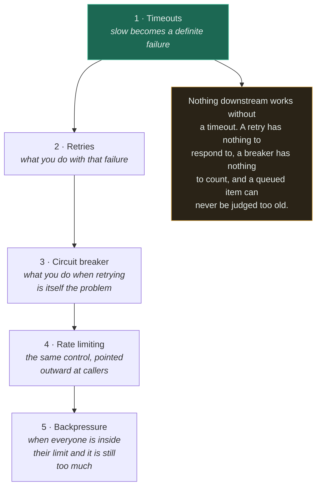
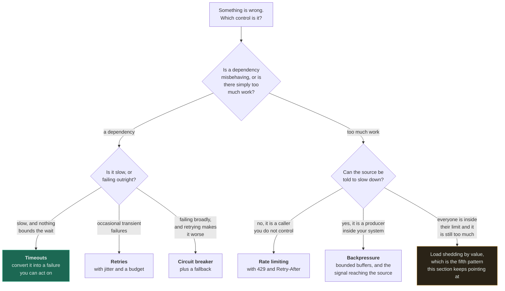
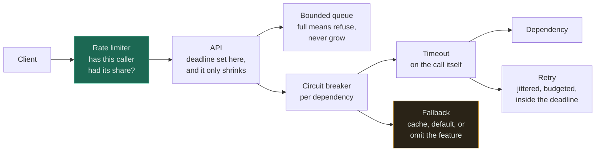

# Reliability Patterns

[Foundations](../00-foundations/reliability/) answers *what reliability is* — doing the right thing
consistently, including when parts are broken, and that availability and reliability are not the same
number. This section is the five controls you actually fit, in the order they depend on each other.

They look like five separate library features. **They are one argument, and the argument is that
every system must be able to say no — to a caller, to a producer, to a dependency, or to itself.**
The failures on these pages all come from a system that could not.

---

## Read in this order

The order is a dependency graph, not a difficulty ramp. Timeouts come first because every other page
assumes them — the amber box is the reason, and it is why a team that fits a circuit breaker before
it fits timeouts has bought decoration.

| # | Topic | Difficulty | The one thing to take away |
|---|---|---|---|
| 1 | [Timeouts](timeouts/) ★ | `[B]` | **Slow is worse than down.** A dead dependency fails fast and you route around it; a slow one holds every thread that touches it. A timeout is a guess, and no timeout is also a guess — an infinite one. |
| 2 | [Retries](retries/) | `[I]` | Backoff spreads the stampede out in *time*. Only **jitter** changes its size — and jitter is the part that gets omitted. A retry budget is the mature control. |
| 3 | [Circuit breaker](circuit-breaker/) ★ | `[I]` | Its job is **converting slow into fast failure**. Half-open admits exactly one probe, there is one breaker per dependency, and the fallback is part of the pattern rather than an enhancement. |
| 4 | [Rate limiting](rate-limiting/) ★ | `[I]` | Per-server limiting means N servers each allow the full limit. Limit the dimension that matters — **cost, not count** — and never send a `429` without `Retry-After`. |
| 5 | [Backpressure](backpressure/) ★ | `[I]` | It is a **signal, not a buffer**. A queue that absorbs load until memory runs out is the *absence* of backpressure, and it converts a slowdown into an outage. |

## The distinctions that decide which one you need

Most confusion in this section is one of these substitutions. Each pair looks interchangeable in a
design review and covers a completely different incident.

| These are not the same | The difference |
|---|---|
| **Timeout vs circuit breaker** | A timeout bounds *your* call. A breaker stops the *next* caller paying the same wait. The breaker counts timeouts — it cannot create one |
| **Retry vs circuit breaker** | A retry assumes the failure was transient. A breaker assumes it was not. Running both without a budget is how a struggling service is finished off |
| **Rate limiting vs load shedding** | A limit is about *fairness between callers* and is a published contract. Shedding is about *survival under total demand* and ignores who sent the work |
| **Rate limiting vs backpressure** | A limit refuses a caller you do not control. Backpressure asks a producer you do control to slow down, and preserves the work |
| **Backpressure vs a queue** | A queue is where work waits. Backpressure is the signal that stops it arriving. **Adding a queue is how you avoid sending that signal** |
| **Breaker vs bulkhead** | A breaker reacts to a dependency that is *failing*. A bulkhead bounds concurrency to one that is *healthy*, before anything has failed |

Read the second fork on the left branch carefully: *slow* and *failing* are different diagnoses with
different controls, and slow is the one that takes systems down. The amber box is the honest gap in
this section — load shedding is referenced from three pages and does not yet have one of its own.

## How they compose on one request path

Every control appears exactly once on this path, which is the discipline the section keeps arguing
for — retries at one layer, one breaker per dependency, one deadline set at the edge. The amber box
is the one most often missing: the breaker returns *time*, and time is worth nothing if nothing was
planned to spend it on.

## What each page corrects

These are the specific mistakes each page exists to prevent, and every one of them is common enough
to have its own incident report somewhere.

| Page | The belief | What is actually true |
|---|---|---|
| [Timeouts](timeouts/) | "Per-hop timeouts bound the chain" | They sum. A budget must shrink down the chain, or the outer timeout fires first and the inner work continues, orphaned |
| [Retries](retries/) | "Exponential backoff prevents a thundering herd" | It delays the herd without shrinking it. Only jitter disperses it, and only a budget bounds the amplification |
| [Circuit breaker](circuit-breaker/) | "The breaker handles the failure" | The breaker only makes failure *fast*. What the caller serves instead is the pattern's other half, and it is usually missing |
| [Rate limiting](rate-limiting/) | "The limit is what the config says" | Enforced per server, N servers allow N times the limit — with every config file correct |
| [Backpressure](backpressure/) | "We added a queue, so we have backpressure" | A queue is how you *avoid* the signal. Unbounded, it converts a slowdown into an outage several hours later |

## Where this connects

- **Every page here assumes [reliability](../00-foundations/reliability/)** — the badness ordering
  `data loss > silent wrong answer > loud failure > slow > fine` is the reason all five patterns
  prefer a loud, fast failure to a quiet, slow one.
- **[Latency](../00-foundations/latency/)** supplies the numbers. Timeout values come from p99.9,
  backoff windows come from the distribution, and the tail is what every one of these controls is
  actually shaped around.
- **[Queues](../06-messaging/queues/)** and **[workers](../06-messaging/workers/)** are where
  backpressure and retries stop being request-path concerns and become delivery semantics: redelivery
  is a retry, a delivery cap is a retry budget, and a DLQ is where a permanent failure belongs.
- **[Idempotency](../07-api-design/idempotency/)** is load-bearing for the whole section. Every retry,
  every redelivery and every ambiguous timeout depends on it, and it is the one property that cannot
  be added afterwards by configuration.
- **[Caching](../04-caching/fundamentals/)** is where the fallback answer comes from when a breaker
  opens — and is itself a dependency that needs all five of these controls.
- **[Observability](../11-observability/)** is not optional here. Several of these failures are
  silent by construction: an unbounded queue is green for hours, a brownout passes every health
  check, and a breaker that never opens looks exactly like a dependency that never fails.

## The measured implementations

Three of these five have working code with real benchmarks, and the numbers are cited on the pages
rather than paraphrased:

- **[Circuit breaker](../18-implementations/circuit-breaker/)** — against a dependency hanging 10ms
  then failing, 200 calls take **2.061s without the breaker and 0.051s with it**, and the dependency
  receives **5 requests instead of 200**.
- **[Rate limiter](../18-implementations/rate-limiter/)** — token bucket **0.365 µs/op**, sliding
  window **0.255 µs/op**, fixed window **0.219 µs/op**. The decision is memory, not CPU: at 1M keys
  the O(1) limiters need ~**16 MB** and the sliding window log ~**8 GB**, which is why nobody ships
  the log.
- **[LRU cache](../18-implementations/lru-cache/)** — the fallback store a breaker's degraded path
  usually reads from.

## Related

- [Reliability](../00-foundations/reliability/) — the foundation all five hang off
- [Latency](../00-foundations/latency/) · [Throughput](../00-foundations/throughput/) — where the numbers come from
- [Queues](../06-messaging/queues/) · [Workers](../06-messaging/workers/) — the asynchronous half of the same problem
- [Idempotency](../07-api-design/idempotency/) — the property every retry depends on
- [Caching](../04-caching/fundamentals/) — the usual source of a degraded answer
- [Circuit breaker + service](../14-component-combinations/circuit-breaker-and-service/) — the combination in context
- [Observability](../11-observability/) — how you would know any of this broke
- [Pattern catalogue](../13-design-patterns/CATALOGUE.md) — retry with backoff and jitter, circuit breaker, bulkhead, timeout, rate limiting, load shedding, backpressure
- [Anti-patterns](../anti-patterns/): [retry storm](../anti-patterns/retry-storm/) · [no timeout](../anti-patterns/no-timeout/) · [no idempotency](../anti-patterns/no-idempotency/) · [queue without backpressure](../anti-patterns/queue-without-backpressure/)
- [Trade-off framework](../TRADEOFF-FRAMEWORK.md) · [System design thinking](../SYSTEM-DESIGN-THINKING.md)
- [Glossary](../GLOSSARY.md) — [timeout](../GLOSSARY.md#timeout) · [retry storm](../GLOSSARY.md#retry-storm) · [circuit breaker](../GLOSSARY.md#circuit-breaker) · [rate limiting](../GLOSSARY.md#rate-limiting) · [backpressure](../GLOSSARY.md#backpressure)

<!-- PATH:BEGIN -->

---

**The reading path** · step 19 of 27 · *Reliability patterns*

◀ **Previous** [Worker](../06-messaging/workers/README.md) &nbsp;·&nbsp; **Next** [Timeouts](../08-reliability/timeouts/README.md) ▶

<!-- PATH:END -->
