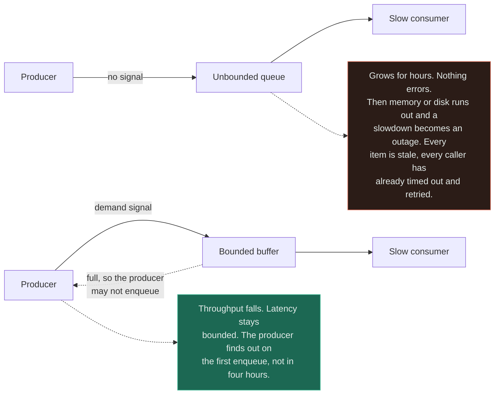
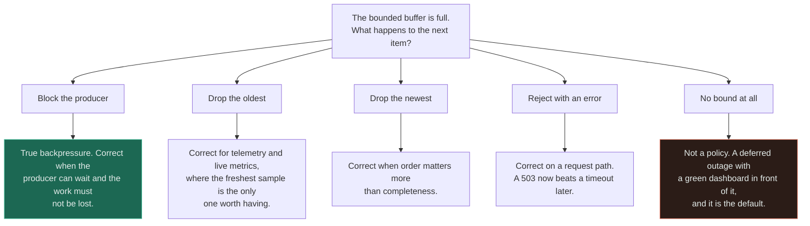
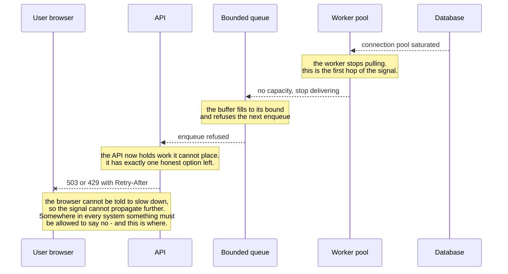
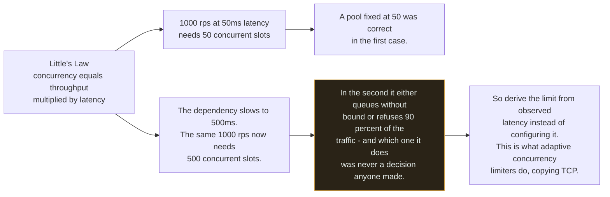

# Backpressure ★

`[INTERMEDIATE]` · It is a **signal**, not a buffer. A queue that absorbs load until memory runs out is the *absence* of backpressure — and somewhere in every system, something must be allowed to say no.

---

## 1. One-line definition

A signal that travels from an overloaded consumer back to whatever is producing the work, so the
producer slows down instead of the buffer between them growing.

## 2. Explain like I'm new

A producer faster than its consumer has a mismatch, and the mismatch has to be resolved somewhere.
There are only three places it can go: the producer slows down, work is thrown away, or it
accumulates in the middle.

The third is the one everybody picks by accident, because it requires no decision — you add a queue,
the errors stop, the dashboards go green, and the problem is deferred rather than resolved. It comes
back later as a four-hour-old backlog and a broker that has run out of disk. **The queue did not
absorb the overload; it hid it.**

Backpressure is choosing the first option deliberately: the consumer says how much it can take, the
producer may not exceed it, and every buffer along the way is bounded so a full one pushes the
signal further upstream rather than growing.

## 3. Real-world analogy

A kitchen with a fixed order rail. When the rail is full the waiter cannot clip another ticket, so
they stop taking orders and tell the next table there is a wait. The kitchen never falls behind by
more than one rail's length, and the customer finds out immediately rather than after ninety
minutes.

**Where it breaks:** a waiter can be told to stop. A UDP sender, an inbound webhook, a market data
feed and a user's browser cannot — there is no channel back to them, and refusing is your only
remaining move. That is the honest limit of the pattern, and it is why backpressure and load
shedding are two patterns rather than one.

## 4. Technical explanation

**Backpressure is the propagation of a limit, not the storage of an excess.** The mechanism is
demand: the consumer advertises how much it can accept, the producer may not exceed it, and every
buffer in the chain is bounded so that filling one is an event rather than a slow leak.

TCP is the version everyone already depends on. The receive window is the consumer advertising
capacity, and the sender is not permitted to exceed it — which is why a slow reader slows the writer
rather than exhausting a router's memory.

### Absence versus presence

| | **No backpressure** | **Backpressure** |
|---|---|---|
| Buffer | Unbounded — grows with the deficit | Bounded — a full buffer is a signal |
| Under sustained overload | Latency grows without limit, then memory or disk exhaustion | Throughput degrades, latency stays bounded |
| What the producer learns | Nothing, until it is far too late | Immediately, on every enqueue |
| Failure mode | Silent for hours, then total | Loud immediately, and partial |
| Recovery | Drain a backlog of work that is already worthless | Nothing to drain |

**A slowdown that becomes an outage is the signature of the absent version.** Nothing errors, error
rate is zero, the API is fast — and four hours later the confirmations are four hours late and the
broker's disk is full. Converting a loud, cheap, immediate rejection into an unbounded latency
increase is not resilience; it is a decision to fail later and larger.

### The uncomfortable part

By the time a consumer catches up, every item in that buffer is stale, every caller has already
timed out, and most have retried. **The work you carefully preserved is worthless and has been
duplicated.** This is why "we buffered it so nothing was lost" is usually false in every sense that
matters: the messages exist and the value does not.

### The three responses to overload, which are not interchangeable

| Pattern | Question | Requires | Applies at |
|---|---|---|---|
| **Backpressure** | Can the producer be told to slow down? | A producer that can be told, and a channel back to it | Internal pipelines you own end to end |
| **Load shedding** | Which work is worth least? | A criticality decided *before* the incident | Any boundary, including inbound |
| **[Rate limiting](../rate-limiting/)** | Has this caller had its share? | A key and a published limit | Callers you do not control |

Backpressure is the only one of the three that preserves the work. It is also the only one that
needs a cooperative producer, which is why the other two exist.

## 5. Engineering at scale

**Every buffer is bounded, and the full-buffer behaviour is chosen explicitly.** Unbounded is a
choice too — it is the one that pages you at 3am.

**The in-flight limit should be derived, not configured.** Little's Law gives it directly:
concurrency equals throughput multiplied by latency. That means the correct limit *moves whenever
latency moves*, so any fixed thread-pool size is right at exactly one traffic level and wrong at
every other. Netflix's `concurrency-limits` infers the limit continuously by watching latency rise,
borrowing the approach from TCP congestion control, which is why a system built on it adapts to a
slow dependency instead of queueing against it.

**A queue removes the natural backpressure the request path had for free.** On the synchronous path,
a slow database slows the client, which throttles the arrival rate — a feedback loop nobody designed
and everybody relied on. Behind a queue, [workers](../../06-messaging/workers/) pull at their own
pace and nothing pushes back, so the number that decides the outcome is total fleet concurrency:
workers multiplied by per-worker concurrency. It is easy to be wrong about that by an order of
magnitude.

**Goodput is the metric, not throughput.** A system driven past capacity does not degrade gracefully
on its own — queues grow, latency passes every client's timeout, and eventually every request is
worked on and then discarded by a caller who already gave up. The system does 100% of the work and
delivers 0% of the value. Backpressure is what keeps a system out of that regime, because it cannot
climb back out unaided.

**The slowest consumer sets the pace for the whole pipeline.** This is correct, and it also means one
bad consumer throttles everyone — a real cost, and the usual argument for reaching back to an
unbounded buffer. Resist it, and isolate or fix the slow consumer instead.

## 6. The problem it solves

A producer faster than its consumer, sustained. It bounds memory by design rather than by luck,
bounds latency because the buffer cannot grow, and makes the system degrade in **throughput** —
which is recoverable — instead of falling over, which is not.

## 7. The problem it does NOT solve

**It cannot be expressed across a fire-and-forget boundary.** You cannot push back on a UDP sender,
an inbound webhook, a third party's retry loop or a user's browser. At those boundaries the only
available move is to refuse, which is load shedding or [rate limiting](../rate-limiting/).

It also **relocates the problem rather than removing it**: the producer now holds work it cannot
emit and may have nowhere to put it either — so the signal must reach something that can genuinely
stop, or you have simply moved the unbounded buffer one hop upstream. And it does not add capacity.
If the deficit is permanent, backpressure converts an outage into a permanent, honest slowdown,
which is better and is still not a fix.

---

## 9. How it works



The two halves have the identical producer, the identical consumer and the identical deficit. The
only difference is the dotted arrow returning to `P2`, and that single edge is the entire pattern —
**everything else on this page is about making sure that arrow exists and reaches somewhere useful.**

### What a full buffer does is the design



Four of the five are defensible and the fifth is what you get by not deciding. Note that the right
answer differs per buffer *within one system*: dropping the oldest is correct for a metrics pipeline
and catastrophic for a payments queue, so this cannot be a global setting.

### Where the signal has to travel, and where it stops



Follow the signal upward one hop at a time: it starts at the saturated resource and walks back
toward the source, and at every hop it is a *refusal to accept*, never a place to put things. The
last note is the part usually left out of the teaching: the chain terminates at a boundary you do
not control, and there the signal must become an explicit rejection. **A system in which nothing is
permitted to refuse has not eliminated the refusal — it has delegated it to the kernel's
out-of-memory killer.**

### Why a fixed pool size is wrong at every traffic level but one



The two branches differ in one input — latency — which is precisely the variable that moves during
an incident. That is why a static limit is well behaved in testing and wrong exactly when it
matters, and why the mature answer is to infer the limit from what the system is currently doing.

## 13. When to use it

- Any producer and consumer whose rates can diverge, which is all of them
- Streaming and pipeline systems, where the mismatch compounds at every stage
- In front of a bounded shared resource: a connection pool, a thread pool, a downstream service
- Whenever you are about to add a queue "to absorb the spike" — decide the bound at the same time
- Wherever a slowdown must not be allowed to become an outage, which is the usual requirement

## 14. When NOT to

- **You cannot reach the producer.** A public API, a webhook receiver, a UDP feed. Use
  [rate limiting](../rate-limiting/) or load shedding.
- **The work is genuinely disposable.** Drop-oldest on a bounded buffer is simpler and correct for
  live telemetry.
- **The spike is short and the deficit is not real.** A bounded queue absorbing a two-minute peak is
  exactly right, and pushing back would make the experience worse for no reason.
- **The producer has nowhere to put the work either.** Then you have moved the unbounded buffer one
  hop upstream and changed nothing.
- **The deficit is permanent.** Backpressure will honestly and permanently slow you down. Buy
  capacity.

## 17. Trade-offs

| Choose | Get | Pay |
|---|---|---|
| Backpressure | Bounded memory and latency by design | Throughput limited by your slowest consumer |
| Bounded buffer | A full buffer is an event, not a leak | You must choose the full-buffer behaviour, per buffer |
| Block the producer | No work is lost | The producer's callers now wait — the signal keeps travelling |
| Drop oldest | Freshness preserved under overload | Silent loss, which needs a counter or it is invisible |
| Reject with `503` | Immediate, honest, cheap | Visible failures, and someone will ask why |
| Adaptive concurrency limit | Correct at every traffic level | Harder to reason about at 3am than a number in a config file |
| Bigger buffer | Absorbs a larger genuine spike | A longer silent window before you learn about a real deficit |

## 18. Why not?

| Alternative | Why not here | When it WOULD win |
|---|---|---|
| **A bigger queue** | Buys minutes, and makes the eventual failure larger and later | The spike is genuinely transient and you have measured it |
| **Autoscale consumers** | Takes minutes, and the bottleneck is usually a shared database that does not scale with the fleet | Consumers are stateless and the downstream really does scale |
| **Load shedding** | Discards work rather than preserving it | The producer cannot be told to slow down — then it is the *only* option |
| **[Rate limiting](../rate-limiting/)** | Per-caller fairness, blind to aggregate demand | The overload is one caller rather than the whole population |
| **[Circuit breaker](../circuit-breaker/)** | Reacts to failure, not to a rate mismatch | The consumer is broken rather than merely slower than you |
| **Do nothing, buffer in memory** | Converts a recoverable slowdown into an unrecoverable outage | Never, at any size. Bound the buffer even if the bound is generous |

The last row is the only "do nothing" in this repository that is not a real option. **An unbounded
buffer is not a simpler design — it is the same design with the failure moved out of your control.**

## 19. Failure scenarios

| Failure | What happens | Mitigation |
|---|---|---|
| **Unbounded queue under sustained overload** | Silent for hours, then memory or disk exhaustion. A slowdown became an outage | Bound every buffer |
| **The signal stops one hop short** | The unbounded buffer moved upstream and nobody noticed | Trace the signal to a component permitted to refuse |
| **Nothing is allowed to say no** | The out-of-memory killer makes the decision instead | Explicit rejection at the boundary |
| **Backlog drained after recovery** | A herd of stale work hits the database at full rate and re-kills it | Cap drain concurrency, discard work past its useful age |
| **Every item is stale on arrival** | Callers timed out long ago and retried; the preserved work is duplicated waste | Time-to-live on queued items, and alert on message *age* |
| **Slow consumer throttles the pipeline** | Correct behaviour, unacceptable outcome | Isolate that consumer — its own partition or its own queue |
| **Fixed pool sized for yesterday** | Right at one traffic level, wrong at every other | Derive the limit from observed latency |
| **Blocking a producer that cannot block** | An event loop stalls, or a request thread is pinned | Reject rather than block on request paths |
| **Depth alerted, age not** | Ten messages three hours old looks healthier than 10,000 one second old | Alert on both, and on age first |

**Alert on message *age*, not only depth.** The unbounded-queue incident is invisible in a depth
graph for its first several hours, because depth rising slowly looks a great deal like growth.

---

## 25. Without it → With it → New problem → Next

```
Without it   →  a buffer absorbs the deficit until memory or disk runs out, so a
                slowdown becomes an outage hours after anyone could have acted
With it      →  memory and latency are bounded by design, and overload shows up
                immediately as reduced throughput instead of eventual collapse
New problem  →  the slowest consumer now sets the pace for everyone, and the
                signal must terminate somewhere that is permitted to refuse
Next         →  bounded buffers with an explicit full-buffer policy, load
                shedding at the boundaries where no producer can be told to slow
                down, and rate limiting for the callers you do not control
```

## 27. Implementation

**Backpressure is the signal, and a rate limiter is the mechanism by which a system says no.** The
measured limiters in [18-implementations/rate-limiter/](../../18-implementations/rate-limiter/) are
the cheap end of that: `TokenBucket` at **0.365 µs/op**, `SlidingWindowLog` at **0.255 µs/op** and
`FixedWindowCounter` at **0.219 µs/op** — all negligible beside the work being admitted, so the
refusal path is never the reason not to bound something.

The memory figures matter more for a limiter placed in front of a pipeline. At 1M tracked keys the
O(1) limiters need about **16 MB** while the sliding window log needs about **8 GB**, which is why
nobody ships the log. That is this entire page in miniature: **the resource that runs out is rarely
the one the benchmark measured.**

The [circuit breaker](../../18-implementations/circuit-breaker/) covers the adjacent case — refusal
in response to *failure* rather than to a rate mismatch. Against a dependency hanging 10ms then
failing, 200 calls take **2.061s without the breaker and 0.051s with it**, and the dependency
receives **5 requests instead of 200**. A bounded pipeline usually needs both: the breaker for when
the consumer is broken, backpressure for when it is merely slower than the producer.

A bounded queue with visibility timeouts and a dead letter queue is on the roadmap for
[18-implementations/](../../18-implementations/); the [queues](../../06-messaging/queues/) page
covers the semantics it will have to implement.

## 28. Common mistakes

| Mistake | Why it is wrong |
|---|---|
| **Adding a queue and calling it backpressure** | A buffer is the opposite of a signal — it is how you avoid sending one |
| Unbounded buffers anywhere | A deferred outage with a green dashboard in front of it |
| No explicit full-buffer policy | The library's default becomes your reliability design |
| One global full-buffer policy | Drop-oldest is right for metrics and catastrophic for payments |
| Fixed thread-pool sizes | Correct at exactly one traffic level, by Little's Law |
| A signal that stops one hop short | You moved the problem upstream and lost the alert with it |
| Draining a backlog at full speed | The recovery re-kills the thing that just recovered |
| Keeping work past its useful age | Preserved, stale, duplicated and worthless |
| Alerting on depth only | Misses a stalled consumer entirely |
| Assuming a producer can always be told | Not true across a webhook, a UDP feed, or a browser |

## 29. Monitoring

**Queue depth and oldest-message age**, always together — the second is what catches a stalled
consumer, and it is the one that would have caught the four-hour backlog while it was still one hour
old. Alert on age first.

Track **arrival rate against processing rate**: if arrival exceeds processing for a sustained period,
the outage is already scheduled and the only open question is when. Count **rejections and drops
explicitly**, because they are the pattern working and an uncounted rejection looks exactly like
nothing happening. Express buffer occupancy as a fraction of the bound rather than an absolute, so
one dashboard works for every buffer. And watch **goodput** — work completed *and still wanted* —
since throughput alone stays flatteringly high while a system delivers nothing anybody is waiting
for.

## 31. Exercises

**1.** Order confirmations are four hours late. The API is fast, error rates are zero, and every
dashboard is green. What happened, and which design decision made it possible?

<details><summary>Answer</summary>

Consumers have been outpaced for hours and an **unbounded buffer** has been absorbing the deficit.
The API is fast precisely *because* it is not waiting for anything, which is why the dashboards look
perfect: an unbounded queue converts a loud capacity problem into a silent latency problem, and the
silence is the mechanism rather than a side effect.

The decision was made when the queue was added without a bound — very possibly by nobody deciding
anything, since unbounded is the default in most libraries. The ending is a slowdown that becomes an
outage when the broker runs out of disk, and a backlog whose contents are worthless by the time
anyone drains it: every caller timed out hours ago and most retried.

What would have caught it: an alert on **oldest-message age**, not depth. See
[queue without backpressure](../../anti-patterns/queue-without-backpressure/).
</details>

**2.** In response, someone proposes doubling the queue size. Do you approve it?

<details><summary>Answer</summary>

No. If arrivals exceed processing *on average*, a bigger buffer buys proportionally more time and
makes the eventual failure both later and larger — a longer silent window, a bigger stale backlog,
the same ending.

The first question is whether this is a **spike or a deficit**. For a spike, a bounded queue is
already doing its job and the fix is to autoscale consumers on depth and wait. For a deficit, only
three things resolve it: more capacity, backpressure so producers slow down, or shedding so the
excess is refused cheaply and immediately.

There is a legitimate sizing argument, and it is different in kind: size the bound to the largest
*genuine* spike you have measured, then treat any fill beyond that as the signal it is.
</details>

**3.** You bound the queue. Now the API blocks when it is full, and those HTTP requests time out.
Have you made things worse?

<details><summary>Answer</summary>

No, but you have chosen the wrong full-buffer policy for that buffer. **Blocking is right where the
producer can wait and the work must not be lost; rejecting is right on a request path**, because a
`503` in two milliseconds is strictly better than a timeout in thirty seconds — the client learns
something, keeps its own resources, and can retry with jitter or degrade.

Blocking a request thread also fails in the way this page keeps warning about: the thread is now the
unbounded buffer, and the signal has stopped one hop short of the client.

Send `503` or `429` with `Retry-After`, and make sure the client honours it — otherwise you have
built a very efficient rejection loop. The chain has to end at something permitted to refuse, and on
an inbound HTTP boundary that something is you.
</details>

**4.** A backlog finally clears after an incident. Twenty minutes later the database falls over,
having been healthy throughout. What happened?

<details><summary>Answer</summary>

The **drain** did it. Workers pull as fast as they can by design, so a recovered pipeline hits the
database with the entire accumulated backlog at maximum concurrency — a load profile that never
occurs in normal operation and that nothing was sized for. The recovery re-kills the thing that
recovered.

Two fixes, and you want both. Cap drain concurrency — workers multiplied by per-worker concurrency,
bounded against measured downstream capacity, ideally ramped rather than switched on. And **discard
work past its useful age** before processing it: much of a four-hour backlog is confirmations for
orders whose customers gave up, so paying full database cost for them is the worst of both outcomes.
</details>

**5.** Your pipeline has backpressure end to end and the producer is a third party's webhook. Where
does the signal go?

<details><summary>Answer</summary>

Nowhere — it stops at your edge, and that is not a gap in your implementation. Backpressure needs a
producer that can be told to slow down and a channel to tell it on. A webhook sender, a UDP feed and
a browser all lack one or both.

So the edge must **refuse**, and refusing is a different pattern with a different question.
[Rate limiting](../rate-limiting/) answers "has this caller had its share?" and load shedding
answers "which work is worth least right now?" — you frequently need both, and neither preserves
the work the way backpressure does.

What you can do is make the refusal useful: `429` or `503` with `Retry-After`, since most webhook
senders implement retry with backoff, so an honest rejection often becomes a delayed delivery rather
than a lost one. And bound your ingress buffer anyway, or the unbounded queue has merely moved to
the front door.
</details>

## 33. Related

- [Reliability section index](../README.md) — how this fits with the other four patterns
- [Rate limiting](../rate-limiting/) — how a system says no where no producer can be told to slow down
- [Timeouts](../timeouts/) — the deadline that makes a stale queued item detectable
- [Circuit breaker](../circuit-breaker/) — refusal in response to failure rather than to overload
- [Retries](../retries/) — what the callers in that backlog were doing while they waited
- [Queues](../../06-messaging/queues/) · [Workers](../../06-messaging/workers/) — the buffer this page is about bounding
- [Reliability](../../00-foundations/reliability/) — the foundation this hangs off
- [Latency](../../00-foundations/latency/) — the other half of Little's Law
- [Caching](../../04-caching/fundamentals/) — reducing the arrival rate rather than surviving it
- [Observability](../../11-observability/) — depth, age, goodput, and drop counters
- [Anti-pattern: queue without backpressure](../../anti-patterns/queue-without-backpressure/) · [no timeout](../../anti-patterns/no-timeout/)
- [Pattern catalogue: backpressure](../../13-design-patterns/CATALOGUE.md)
- [Rate limiter implementation](../../18-implementations/rate-limiter/) · [circuit breaker implementation](../../18-implementations/circuit-breaker/)
- [Glossary: backpressure](../../GLOSSARY.md#backpressure) · [throughput](../../GLOSSARY.md#throughput)
