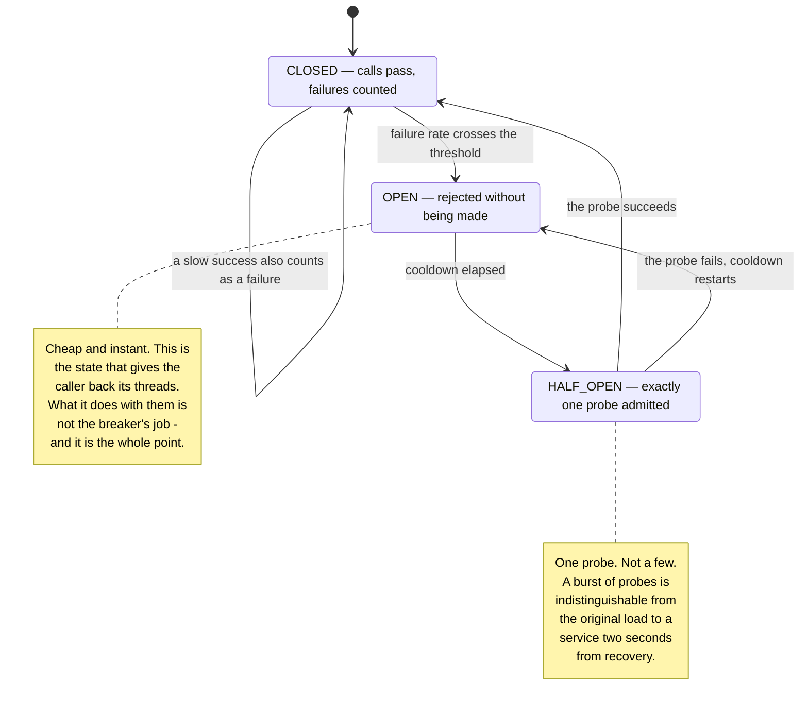
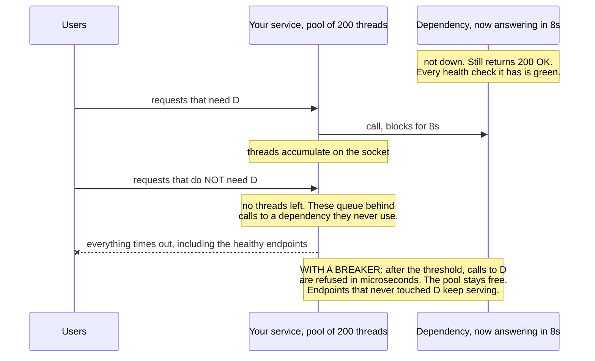
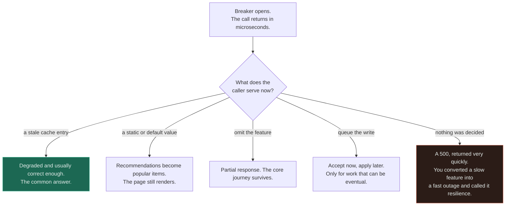

# Circuit Breaker ★

`[INTERMEDIATE]` · Its job is not to stop calls. It is to convert **slow** into **fast failure**, because slow is the one mode a caller cannot route around — and it is only finished when you have decided what the caller does instead.

---

## 1. One-line definition

A per-dependency switch that stops calling something that is already failing, fails those calls
immediately without touching the network, and periodically admits one probe to test whether it has
recovered.

## 2. Explain like I'm new

A dependency is broken. You know it is broken. Every request you send it will fail. You send them
anyway, because nothing in your code has any memory of the last four hundred failures.

That is the situation the breaker fixes, and if the dependency were cleanly *dead* it would barely
matter — a refused connection returns in microseconds and costs you almost nothing. The dangerous
case is the dependency that has gone **slow**: it still accepts connections, it still eventually
answers, it just takes eight seconds instead of eight milliseconds. Every caller thread sits blocked
on a socket. The pool fills. Requests that never needed that dependency queue behind the ones that
do, and **your service falls over while your own code is fine.**

## 3. Real-world analogy

The electrical breaker in a consumer unit. A fault appears, the breaker trips, and the rest of the
house keeps its lights — the point was never to fix the fault, it was to stop one bad circuit from
burning down the building.

**Where it breaks:** an electrical breaker has nothing to say about what you do in a dark room. A
software breaker hands you back control in microseconds instead of seconds, and **that returned time
is the entire product**. If the caller's only response to an open breaker is to return a `500`
faster, the pattern has been installed and not adopted.

## 4. Technical explanation

Three states, and one of them is the whole design.

| State | Behaviour | Purpose |
|---|---|---|
| `CLOSED` | Calls pass through. Failures are counted. | Normal operation |
| `OPEN` | Calls are rejected **without being made**. A cooldown runs. | Stop paying for something already known to fail |
| `HALF_OPEN` | **Exactly one** trial call is admitted. Success closes, failure reopens. | Ask the cheapest possible question about recovery |

**Half-open exists because the alternatives are both bad.** Without it a breaker can only stay open
forever and never recover on its own, or resume full production traffic the instant the timer fires
and knock a half-recovered dependency straight back over. Half-open sends one request and lets the
answer decide — and *one* is not a rounding of "a few". A burst of probes is indistinguishable from
the original load to a service that is two seconds from recovery.

### Why "slow" is the case that matters

| Failure mode | What the caller experiences | Can the caller route around it? |
|---|---|---|
| **Down** — connection refused | An error in microseconds | **Yes.** Fall back, degrade, shed, retry elsewhere |
| **Slow** — brownout, `200 OK` in 8s | A held thread, a held connection, a held pool slot | **No.** A blocked thread cannot do anything, including give up |

That table is the reason this component exists. A dead dependency is nearly harmless because failure
is *information*. A slow one delivers no information until the timeout fires, and until then it
consumes exactly the resources you would need in order to react.

**A slow success must count as a failure**, or the breaker cannot see a brownout at all. A dependency
returning `200 OK` in eight seconds is up by every health check it has and is taking you down. That
is what a slow-call threshold is for, and leaving it unset means the breaker only ever notices the
failure mode that was never going to hurt you much.

## 5. Engineering at scale

**One breaker per dependency, never one global breaker.** A shared breaker means an outage in the
recommendations service opens the path to payments, and you have converted a degraded feature into a
total outage with your own resilience library. The state is per dependency because the *health* is
per dependency.

**The breaker protects the caller, not the callee.** The relief the failing dependency gets is a side
benefit. Getting this backwards produces breakers configured as if they were rate limits, and it is
the most common conceptual error in the pattern.

**Consecutive-failure counting is wrong for high-volume services.** A dependency failing 40% of the
time may never string five failures together while being comprehensively broken. Production counts
errors over a rolling window and trips on a *rate*, with a minimum-throughput floor so that three
calls at 100% failure do not trip anything. Related, and worse: a threshold on an absolute error
count never fires during a low-traffic outage. **The tell of a badly configured breaker is one that
has never opened.**

**Per-process state multiplies the probes.** Ten app servers each need their own threshold before
any of them stops calling, so a dead dependency absorbs ten times the probe traffic. Shared state
fixes the arithmetic and puts a network round trip on the hot path to a store that may itself be the
thing that is down.

**A breaker is not a bulkhead.** It limits calls to a *failing* dependency and does nothing to cap
concurrent calls to a *healthy* one. Between the dependency going slow and the threshold being
reached, unbounded threads can still pile in. A concurrency limit alongside the breaker is what
actually protects the pool.

## 6. The problem it solves

Cascading failure. One dependency degrades, its callers block on it, their callers block on them,
and an outage propagates upward through services that have nothing wrong with them. The breaker cuts
the propagation at the first hop by making failure immediate and therefore handleable.

## 7. The problem it does NOT solve

**It does not create timeouts — it counts them.** A breaker with no client timeout underneath it is
decoration: if the callee hangs forever, so does the call the breaker is wrapping. See
[timeouts](../timeouts/).

It does not fix the dependency, does not decide what you serve instead, does not bound concurrency
to healthy dependencies, and **an open breaker converts a partial outage into a total one for that
path** — which is only the right answer if the fallback is genuinely acceptable.

---

## 9. How it works



The self-loop on `CLOSED` is the transition people omit: without it, a dependency in brownout returns
`200 OK` slowly forever and the breaker never trips, because nothing ever errored. The two notes are
the two places the pattern is most often installed wrongly — too many probes, and no plan for the
time the open state hands back.

### What the open state actually buys



Read the fourth arrow, not the third. The requests that never touched the failing dependency are the
ones that turn a feature outage into a service outage, and they fail for a reason that appears
nowhere in their own code path. **This is why the breaker is measured in threads rather than in
errors** — a one-thread latency graph makes it look like a modest win.

### The half of the pattern nobody ships



Four of these five branches are a working system and the fifth is the default. The breaker's output
is *time* — microseconds instead of seconds, on threads that are now free — and time is only worth
something if something was planned for it. **A fallback is part of the pattern, not an enhancement
of it.** Note also that the fallback must not call anything that is about to receive the failing
dependency's entire traffic: a fallback that hits a second live service inherits the load and fails
too.

## 13. When to use it

- Any remote dependency on a request path — this is the default, not the exception
- The dependency is optional and a degraded answer exists — the strongest case
- The dependency is mandatory with no fallback — **still fit one**, because fail fast beats fail slow
- Brownouts are plausible, which is to say always
- The caller has a bounded thread or connection pool that a stall would exhaust

## 14. When NOT to

- **No timeout underneath it.** Fix that first, or the breaker cannot see slowness and cannot
  interrupt it either.
- **Local, in-process calls.** There is no pool to exhaust and no network to fail.
- **Cheap, idempotent calls that fail instantly.** [Retries](../retries/) with backoff are the whole
  answer; a breaker adds nothing.
- **To protect a *healthy* dependency from your own load.** That is a
  [rate limiter](../rate-limiting/) or a bulkhead — a breaker only reacts to failure.
- **One breaker in front of everything.** A shared breaker turns one dependency's outage into all of
  them.

## 17. Trade-offs

| Choose | Get | Pay |
|---|---|---|
| Circuit breaker | Cascading failure contained; threads freed; fallbacks become possible | Requests that might have succeeded are rejected |
| Lower failure threshold | Trips early, pool is protected sooner | Trips on a blip and degrades a working feature |
| Higher failure threshold | Tolerant of noise | The pool may fill before the breaker fires |
| Short cooldown | Fast recovery when the dependency heals | Probes hammer a service that is still recovering |
| Long cooldown | The dependency gets real breathing room | You stay degraded long after it healed |
| Slow-call threshold | Brownouts become visible and trippable | Some genuinely slow-but-fine calls count as failures |
| Rolling-rate trip | Correct for high-volume services | More state, a minimum-volume gate, more to tune |
| Shared breaker state | One threshold for the fleet, fewer probes | A network hop on the hot path to a store that may also be down |

## 18. Why not?

| Alternative | Why not here | When it WOULD win |
|---|---|---|
| **Timeout alone** | Bounds one call. Every caller still pays the full timeout, every time, for the whole outage | The dependency fails rarely and cheaply |
| **Retries with backoff** | Adds load to something already failing; does not stop the next caller either | Brief, isolated, transient faults |
| **Bulkhead** — a bounded pool per dependency | Caps the damage but every slot still blocks for the full timeout | You need protection against a *healthy* dependency saturating you |
| **Load shedding** | Sheds *your* work by priority; says nothing about a broken callee | Total demand exceeds your own capacity |
| **Adaptive concurrency limits** | More machinery; fewer people understand it at 3am | You have many dependencies and hand-tuned thresholds keep going stale |
| **Do nothing** | Every caller pays full latency for the entire outage, and the pool decides how it ends | The call is in-process, or a stall genuinely cannot exhaust anything |

Netflix, who popularised the pattern with Hystrix, put Hystrix into maintenance in 2018 and moved to
adaptive concurrency limits — on the reasoning that per-dependency thresholds are a configuration
burden that silently goes stale. **That is an argument about the thresholds, not about the idea.**

## 19. Failure scenarios

| Failure | What happens | Mitigation |
|---|---|---|
| **No fallback behind the breaker** | You converted a slow feature into a fast outage | Decide the degraded answer before shipping the breaker |
| **One global breaker** | A recommendations outage opens the payments path | One breaker per dependency |
| **Half-open admits many probes** | A recovering service is re-killed every cooldown | Exactly one probe, single-flight |
| **Threshold on absolute counts** | Never fires during a low-traffic outage | Error *rate* over a rolling window plus a minimum-volume gate |
| **No slow-call threshold** | Brownouts are invisible; the breaker sleeps through the real incident | Count slow successes as failures |
| **No timeout underneath** | The breaker cannot see or interrupt a hang | A client timeout on every call the breaker wraps |
| **Every error counted** | A `404` — *your* bug — trips the breaker and takes out a healthy dependency | Classify: client errors are not dependency failures |
| **Synchronised cooldowns** | Every instance trips together and probes together — a herd of probes per cooldown | Jitter the cooldown per instance |
| **Breaker flaps** | Open, close, open, close as the dependency limps | Require several consecutive successes to close |
| **The dependency looks healthy** | It receives almost no traffic while open, so it logs almost no errors | Alert on the **caller's** rejected counter, not the callee's error rate |

**The last row is the one that wastes an hour of every incident.** With the breaker open the
dependency's own dashboard is quiet, because you stopped sending it work — so the team that owns it
will tell you, truthfully, that it looks fine.

---

## 25. Without it → With it → New problem → Next

```
Without it   →  a slow dependency holds every thread that touches it, and takes
                down endpoints that never used it
With it      →  failure is immediate; the pool stays free; the caller keeps the
                capacity it needs in order to react
New problem  →  requests that might have succeeded are now rejected, and the
                caller must have something to serve instead
Next         →  a fallback — cache, default, degraded response or queued write —
                and a bulkhead, because the breaker does not bound concurrency
                to a dependency that is still healthy
```

## 27. Implementation

A three-state breaker with a real benchmark is in
[18-implementations/circuit-breaker/](../../18-implementations/circuit-breaker/), and the benchmark
measures the only thing the pattern is for.

Against a dependency that hangs 10ms then fails, 200 calls take **2.061s without the breaker and
0.051s with it — 40× less blocked thread time**. The dependency receives **5 requests instead of
200**. Both halves matter and they are different claims: the first is the caller keeping its
resources, the second is the callee getting the breathing room it needs to recover.

Two honest caveats the implementation is explicit about. **p99 is essentially unchanged** — the
calls that trip the breaker pay full price, and so does each probe, so a breaker does not make the
tail disappear; it bounds how many callers ever see it. And the **40× understates the benefit**,
because on one thread it reads as a latency win, while on a pool of 200 it is the difference between
a degraded feature and a caller with no threads left for anything at all. The wrapper's own overhead
is a fraction of a microsecond against a network call costing a thousand times more, which is why a
breaker belongs on a dependency by default rather than being retrofitted after the first outage.

See also [circuit breaker + service](../../14-component-combinations/circuit-breaker-and-service/)
for the combination in context, and the
[rate limiter](../../18-implementations/rate-limiter/) for the same shape of control pointed the
other way — a breaker protects *you* from a dependency, a limiter protects a dependency from *you*.

## 28. Common mistakes

| Mistake | Why it is wrong |
|---|---|
| **No fallback** | The breaker returns time and nothing spends it |
| One breaker for all dependencies | Couples unrelated failures into one outage |
| Half-open admitting a burst | Re-kills the service the cooldown was protecting |
| Trip on absolute error count | Silent through every low-traffic outage |
| No slow-call threshold | The dangerous failure mode is invisible |
| No timeout under the breaker | A hang is still a hang; the breaker is decoration |
| Counting `4xx` as dependency failure | Your bug trips a breaker on a healthy service |
| Treating it as a rate limiter | It reacts to failure, not to volume |
| Never opening | Almost always a mistuned threshold, not a perfect dependency |
| Watching the callee's error rate | It goes quiet precisely because the breaker is working |

## 29. Monitoring

**State transitions are the primary signal** — every open, every half-open probe, every close, with
the dependency name on it. A breaker that has never opened in eighteen months is a configuration
report, not a reliability achievement.

Track the **rejected** counter on the caller, because that is the number the callee's dashboard
cannot show. Track fallback invocation rate and fallback *success* rate separately: a fallback path
with no traffic in normal times rots quietly, and finding out during an incident is the standard
way. Track time-in-open per dependency, and alert on flapping rather than on a single trip.

## 31. Exercises

**1.** A dependency starts returning `200 OK` after eight seconds instead of eight milliseconds. Your
breaker never opens. Why, and what fixes it?

<details><summary>Answer</summary>

Nothing ever failed. The breaker is counting errors and there are none — this is a brownout, and by
every health check the dependency has, it is up. Meanwhile every caller thread is blocked for eight
seconds and the pool is filling.

The fix is a **slow-call threshold**: a call that exceeds it counts as a failure even when it
succeeds. Leave that unset and the breaker only ever notices dependencies that are honestly, cleanly
dead — the failure mode that was never going to hurt you much. You also need a client timeout
underneath the breaker, because the breaker can notice a slow call but cannot interrupt one.
</details>

**2.** To recover faster, someone changes half-open to admit ten probes instead of one. Do you
approve it?

<details><summary>Answer</summary>

No. One probe is not a conservative rounding of "a few" — it is the design.

The dependency at the end of a cooldown is, by hypothesis, in the worst possible condition to receive
traffic: recently overwhelmed, possibly mid-restart, cold caches, empty pools. Ten simultaneous
probes from *each* instance is a burst indistinguishable from the original load, so the probe knocks
over the thing it was measuring, the breaker reopens, and the cycle repeats every cooldown for the
rest of the incident.

If recovery genuinely feels too slow, the knob is the **cooldown**, jittered per instance so all
instances do not probe in the same second. Closing on several consecutive successes rather than one
handles the flapping case, and costs nothing when the dependency is truly healthy.
</details>

**3.** Your breaker is open. The dependency's team says their dashboards are completely clean. Who is
right?

<details><summary>Answer</summary>

Both, and this is a genuine artefact of the pattern rather than a disagreement. An open breaker
sends the dependency almost nothing — 5 requests instead of 200 in the measured benchmark — so it
serves almost no traffic and therefore logs almost no errors. Its error *rate* can look perfect
while it is comprehensively broken.

The number that describes reality is on your side: the **caller's rejected counter**, plus the
breaker's state transitions. Ask them for latency percentiles and saturation rather than error rate,
and ask what happened just before the breaker opened, because that is the last window in which they
were receiving real load.
</details>

**4.** You fit a breaker to the recommendations service. It opens during an incident and the product
page starts returning `500` in two milliseconds instead of eight seconds. Has it worked?

<details><summary>Answer</summary>

Half. The mechanism worked perfectly and the pattern was not finished: you converted a slow *feature*
into a fast *outage*.

The breaker's product is **time** — microseconds instead of seconds, on threads that are now free —
and time is worthless if nothing was planned for it. Recommendations are the textbook degradable
feature: serve a cached list, a static popular-items list, or omit the section entirely and render
the page. A fallback is part of the pattern, not an enhancement.

One trap when you add it: the fallback must not call a second *live* service, or it inherits the
failing dependency's entire traffic and fails too. Pre-computed or already in memory is the safe
shape, and it needs a trickle of real traffic in normal times or it will be broken on the day it
matters.
</details>

**5.** A single breaker wraps every outbound call in the service, "so there is one place to configure
it". What happens on the first partial outage?

<details><summary>Answer</summary>

The recommendations service fails, the shared counter crosses its threshold, and the breaker opens
the path to **payments** — a dependency that is completely healthy. You have used a resilience
library to convert a degraded feature into a total outage.

State is per dependency because *health* is per dependency. One breaker per dependency, each with
its own threshold and cooldown, and jitter the cooldowns so instances do not all probe in the same
second. The bulkhead argument runs alongside it and is separate: a breaker limits calls to a
*failing* dependency, while a bounded pool per dependency is what stops a *healthy* one from
absorbing every thread you own.
</details>

## 33. Related

- [Reliability section index](../README.md) — how this fits with the other four patterns
- [Timeouts](../timeouts/) — the prerequisite; a breaker counts timeouts, it does not create them
- [Retries](../retries/) — what happens in front of the breaker, and why it needs a budget
- [Rate limiting](../rate-limiting/) — the same control pointed outward, at callers
- [Backpressure](../backpressure/) — the signal for overload, as distinct from failure
- [Reliability](../../00-foundations/reliability/) — the foundation this hangs off
- [Latency](../../00-foundations/latency/) — why the tail, not the average, decides when to trip
- [Caching](../../04-caching/fundamentals/) — where the fallback answer usually comes from
- [Queues](../../06-messaging/queues/) · [Workers](../../06-messaging/workers/) — park the write instead of dropping it when the breaker opens
- [Circuit breaker + service](../../14-component-combinations/circuit-breaker-and-service/) — the combination in context
- [Observability](../../11-observability/) — state transitions and the rejected counter
- [Anti-pattern: no timeout](../../anti-patterns/no-timeout/) · [retry storm](../../anti-patterns/retry-storm/)
- [Pattern catalogue: circuit breaker](../../13-design-patterns/CATALOGUE.md)
- [Circuit breaker implementation](../../18-implementations/circuit-breaker/) · [rate limiter implementation](../../18-implementations/rate-limiter/)
- [Glossary: circuit breaker](../../GLOSSARY.md#circuit-breaker) · [tail latency](../../GLOSSARY.md#tail-latency)

<!-- PATH:BEGIN -->

---

<sub>**The reading path** · step 22 of 27 · *Circuit breaker*</sub>

◀ **Previous** [Retries](../../08-reliability/retries/README.md) &nbsp;·&nbsp; **Next** [Observability](../../11-observability/README.md) ▶

<!-- PATH:END -->
