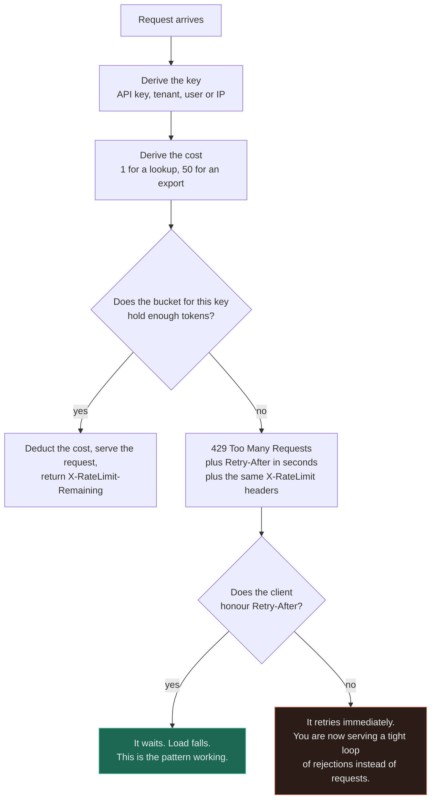
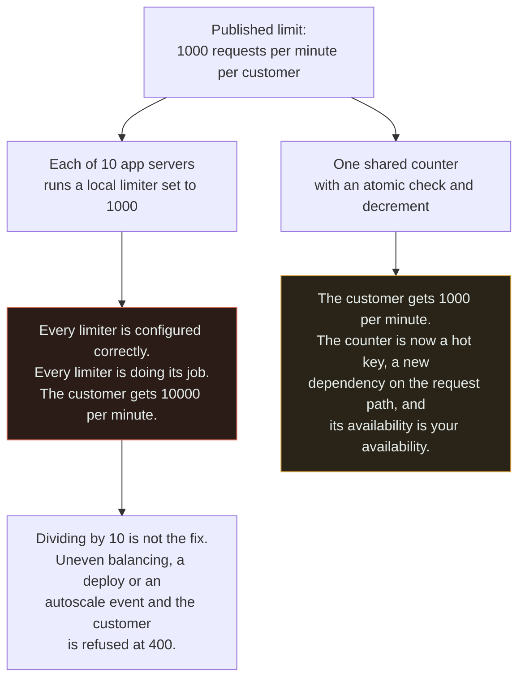
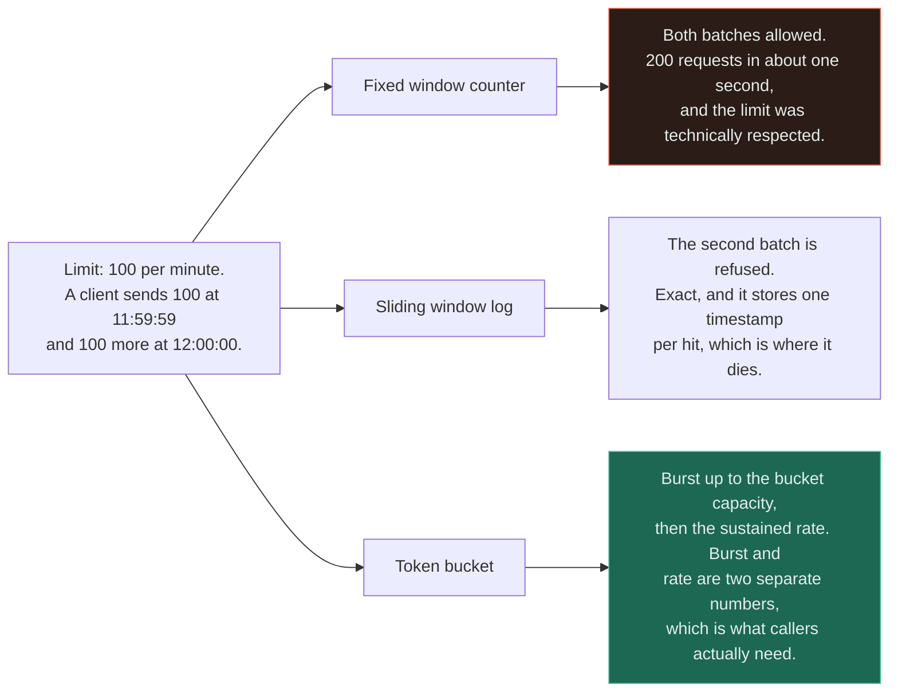
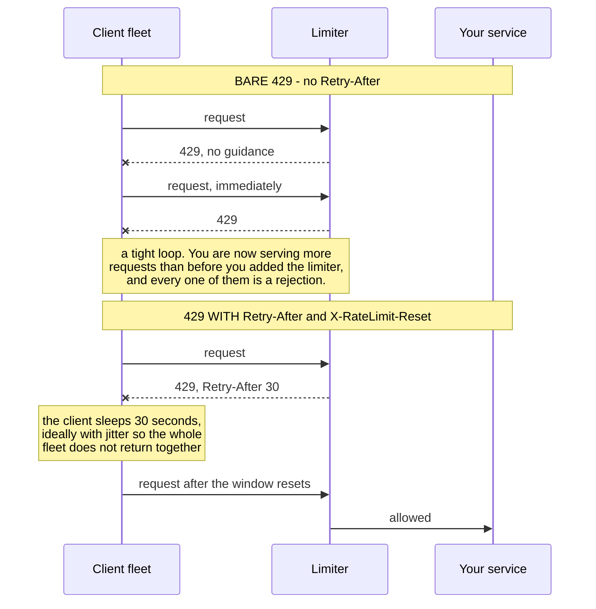

# Rate Limiting ★

`[INTERMEDIATE]` · A limit enforced per server is not the limit you published — ten servers each honouring "1,000 per minute" allow ten thousand. And a `429` without `Retry-After` instructs every client to retry immediately, which is worse than not limiting at all.

---

## 1. One-line definition

Capping how much of a finite resource any one caller may consume in a given period, and refusing the
excess in a way that tells the caller when to come back.

## 2. Explain like I'm new

Capacity is shared and finite. Without a cap, the least well-behaved client decides everyone else's
experience — one customer's runaway loop, one badly written integration, one scraper. A rate limit
is a per-caller ceiling, so the worst case any single caller can inflict becomes a number you chose
rather than a number you discover.

Two things follow immediately and both are usually missed. The ceiling has to be enforced somewhere
that can see *all* of that caller's traffic — if each of your servers counts separately, each of
them independently allows the whole limit. And the refusal has to say **when to try again**, because
a client that is told "no" and nothing else will try again at once, and you have converted a
rejected request into an infinite loop of rejected requests.

## 3. Real-world analogy

A nightclub door. One person counts, the venue never exceeds its capacity, and the queue outside is
visible and orderly.

**Where it breaks:** there is exactly one door. Put ten doors on the same building, give each
doorman the building's full capacity, and the fire limit is breached ten times over while every
doorman is doing their job correctly. That is the distributed rate limiting problem, and it is not a
detail — it is the whole difficulty.

## 4. Technical explanation

Three decisions, and they are usually made in the wrong order — algorithm first, dimension last,
when dimension is what decides whether the limit does anything.

### The dimension — what you count

**Count is the default and cost is usually the correct answer.** A limit of 1,000 requests per minute
treats a key lookup and a report that scans ten million rows as the same event, so a caller staying
politely inside the limit can saturate the database while the limiter reports green.

| Dimension | Limits | Good for | Fails when |
|---|---|---|---|
| **Requests** | Calls per window | Simple, uniform APIs | Endpoint costs differ by orders of magnitude |
| **Cost / weight** | Units per window, priced per endpoint | Anything with an expensive query | Nobody has priced the endpoints — which is most of the design effort |
| **Concurrency** | Requests in flight | Long-running or streaming work | Short requests, where the ceiling is never reached |
| **Bandwidth** | Bytes per window | Uploads, exports, media | Small requests with heavy server-side cost |
| **Rows / results** | Records returned | Search, bulk reads, exports | Writes |

### The key — whose traffic it is

API key, user, tenant, IP, or a combination. Get this wrong in a specific way and you punish the
innocent: limiting by IP when customers arrive through a corporate proxy or an aggregator throttles
an entire company for one user's behaviour.

### The algorithm — how you count

| Algorithm | Burst behaviour | Memory per key | Where it disagrees with the others |
|---|---|---|---|
| **Fixed window** | **Allows 2× the limit across a boundary** | O(1) — one integer | 100 requests at 11:59:59 and 100 at 12:00:00 is 200 in one second, with a limit of 100 per minute |
| **Sliding window log** | Exact. No burst possible | **O(limit)** — one timestamp per hit | Refuses precisely the traffic the fixed window let through |
| **Token bucket** | A burst up to capacity, then settles to the rate | O(1) — two floats | Expresses burst and sustained rate as two separate numbers |

**All three enforce the same average rate.** They differ completely at the boundary between two
windows, and that difference is the entire basis for choosing. Token bucket is the usual answer for
user-facing APIs, because burst tolerance is a *feature*: a client that has been quiet for a minute
should not be punished for its own politeness when it finally sends five requests.

### The response — how you refuse

`429 Too Many Requests`, with `Retry-After`, and `X-RateLimit-Limit` / `-Remaining` / `-Reset` on
every response including the successful ones. **A limiter that says "no" without saying "when"
guarantees an immediate retry**, and a fleet of clients retrying immediately against a limiter is
strictly more load than no limiter at all — you have added a component and made the problem worse.

## 5. Engineering at scale

**Per-server limiting means N servers each allow the full limit.** This is the failure that survives
review, because every individual limiter is configured correctly and the published number appears
verbatim in the config.

The obvious repair — divide the limit by the node count — is wrong the moment the load balancer is
uneven, a node is deployed, an instance is autoscaled out, or a customer's traffic hashes unevenly.
Then a caller entitled to 1,000 gets 400 because most of their requests landed on two nodes. The
real options are a shared counter, or approximate local accounting with periodic reconciliation.

| Approach | Accuracy | Cost | Honest verdict |
|---|---|---|---|
| Local per server | **N× the intended limit** | Free | Only acceptable if you meant "roughly, per node" |
| Limit divided by N | Wrong in both directions | Free | Breaks on uneven balancing and on every deploy |
| Shared store, atomic | Exact | A network round trip on every request | Its latency and its availability are now yours |
| Local plus reconciliation | Approximate, bounded | Cheap | What large deployments actually run |

**The shared counter is a new dependency on the request path, and a hot key.** Its availability
becomes your availability, so decide in advance whether a limiter outage fails open — everyone is
unlimited — or fails closed — everyone is refused. Both are defensible; the default is usually
neither, because nobody chose.

Two more at scale. The check must be **one atomic operation** — a read, a compare and a write as
three round trips is a race that lets a caller through under concurrency. And the key space needs
**eviction**: a limiter that grows forever turns one client with a million distinct API keys into a
memory exhaustion attack. That per-key memory question has a measured answer in
[§27](#27-implementation), and it is the number that decides the algorithm.

## 6. The problem it solves

One caller — hostile, buggy, or merely enthusiastic — consuming capacity that belongs to everyone.
It also makes capacity planning tractable, because the worst case per caller becomes a known number
rather than an open question.

## 7. The problem it does NOT solve

**A rate limit protects you from one caller, not from all of them.** If every client is individually
inside its limit and the aggregate still exceeds capacity, every limiter reports green while the
system saturates. That case belongs to [load shedding](../backpressure/) and
[backpressure](../backpressure/), which are different patterns with a different question.

It also does not price the endpoints for you, does not protect the shared counter from being a
bottleneck, and does nothing about a *slow dependency* — that is the
[circuit breaker](../circuit-breaker/).

### Throttling a caller versus protecting yourself

**Conflating these three is the most common misunderstanding in this family.**

| Pattern | Question it answers | Who decides | What is refused |
|---|---|---|---|
| **Rate limiting** | Has *this caller* had its share? | You, per key, in advance — it is a published contract | That caller's excess |
| **Load shedding** | Is *total demand* over capacity? | Your saturation signal, right now | The lowest-value work, whoever sent it |
| **Backpressure** | Can the producer be told to slow down? | The consumer, continuously | Nothing — the producer stops generating |

You can need all three at once, and each will be useless against the others' failure mode.

---

## 9. How it works



The two boxes after the refusal are the ones people leave off the diagram, and they are the whole
difference between a working limiter and a self-inflicted load generator. Note the cost step near
the top: it is one line, it is almost always missing, and without it a caller can stay inside its
limit while consuming everything.

### The distributed problem, which is the real one



Neither branch is free, which is why this is a design decision rather than a config value. The red
box is the one that ships, because nothing about it looks wrong in review — the published number is
right there in the file, ten times.

### Where the algorithms disagree



All three enforce the same *average*, so a throughput test cannot tell them apart — they are
distinguished only at the boundary, which is exactly where an abusive client operates. The measured
cost of each is in [§27](#27-implementation), and the surprise there is that the decision is not
about CPU at all.

### Why the refusal needs a deadline in it



The two halves send the same first request and diverge entirely on one header. Read the note in the
top half: the rejections are cheap individually and unbounded in number, so the limiter becomes a
very efficient way of generating load. `Retry-After` is not documentation — it is the control loop.

## 13. When to use it

- A public or partner API — the limit is part of the contract
- Any multi-tenant system where one tenant can starve the others
- Expensive endpoints: exports, search, report generation, anything unbounded
- Login and password-reset paths, where the limit is a security control
- In front of a downstream you do not own and must not overwhelm
- Wherever you can name the worst-case caller and do not like the answer

## 14. When NOT to

- **Internal, trusted, low-volume calls.** You have added a dependency and a failure mode to solve a
  problem you do not have.
- **When the real problem is aggregate demand.** Every caller inside its limit and the system still
  saturating is [load shedding](../backpressure/) or [backpressure](../backpressure/), not this.
- **When the dependency is failing rather than busy.** That is a
  [circuit breaker](../circuit-breaker/) — a limiter does not react to failure at all.
- **A shared counter you cannot afford.** If the limiter's round trip dominates the request it is
  guarding, limit locally and accept the approximation deliberately.
- **As a substitute for capacity.** A limit that is set below what customers need is an outage you
  scheduled.

## 17. Trade-offs

| Choose | Get | Pay |
|---|---|---|
| Rate limiting | Fair sharing; a known worst case per caller | A stateful counter on the request path; a limit that is now a published contract |
| Cost-weighted limits | The limit tracks actual load | Every endpoint must be priced, and repriced as it changes |
| Token bucket | Burst tolerance as an explicit, separate number | Two parameters to explain to callers instead of one |
| Sliding window log | Exact enforcement, no boundary burst | Memory proportional to the limit, per key — see [§27](#27-implementation) |
| Fixed window | Cheapest possible | Up to 2× the limit across a boundary |
| Shared counter | One true limit across the fleet | A round trip, a hot key, and its availability becomes yours |
| Local counters | Free and fast | N× the intended limit |
| Fail open on limiter outage | No self-inflicted outage | Unlimited traffic exactly when something is already wrong |
| Fail closed on limiter outage | The protected resource stays protected | A limiter outage becomes a full outage |

## 18. Why not?

| Alternative | Why not here | When it WOULD win |
|---|---|---|
| **Autoscale instead** | Scales the bill with the abuse, and the database usually cannot scale with the fleet | Load is genuinely legitimate and the cost is acceptable |
| **Load shedding** | Sheds by value, not by caller — it cannot make one customer behave | Total demand exceeds capacity and everyone is inside their quota |
| **Backpressure** | Needs a producer that can be told to slow down; a public API has none | An internal pipeline where the producer is yours |
| **Concurrency limit** — cap in-flight work | Says nothing about sustained rate | Long-running or streaming requests, where rate is the wrong unit |
| **Quota per billing period** | Monthly quotas do nothing about a spike at 09:00 on the 3rd | Commercial fairness, alongside a rate limit rather than instead of one |
| **Do nothing** | The least well-behaved caller sets everyone's experience | Trusted internal traffic, low volume, and you would rather not run a counter |

Rate limiting and load shedding are the pair that get substituted for each other most often. **One
is about fairness between callers, the other is about survival under total demand**, and neither
covers the other's incident.

## 19. Failure scenarios

| Failure | What happens | Mitigation |
|---|---|---|
| **Limiter is per server** | N× the published limit, with every config file correct | Shared counter, or local plus reconciliation |
| **Divide the limit by node count** | Uneven balancing refuses callers well under their quota | Do not — reconcile instead |
| **`429` without `Retry-After`** | Clients retry instantly. You have built a load generator | Always send `Retry-After` and `X-RateLimit-Reset` |
| **Fixed window at a boundary** | 2× the limit in a couple of seconds | Token bucket or sliding window |
| **Limiting count, not cost** | A caller inside its limit saturates the database | Weight by endpoint cost |
| **Shared counter goes down** | Fail open means unlimited; fail closed means total outage | Choose deliberately, in advance, and test it |
| **Check is not atomic** | Read-compare-write races let concurrent callers through | One atomic operation — a script or an atomic increment |
| **Unbounded key space** | A client with a million distinct keys exhausts memory | TTL or LRU on idle keys |
| **Limiting by IP** | One corporate proxy throttles an entire company | Key on the authenticated principal |
| **The limit is lowered silently** | A partner integration breaks with no warning and no diagnosis | The limit is a contract: document it, version it, announce changes |
| **Clock skew across nodes** | Windows disagree, and enforcement wobbles at the boundary | Prefer monotonic accounting and a shared clock source |

**A rate limit is a product decision wearing infrastructure clothing.** The number is part of your
API contract — it belongs in the docs and in the response headers, and it must never be lowered
quietly. Teams that treat it as a config value find this out by breaking an integration partner.

---

## 25. Without it → With it → New problem → Next

```
Without it   →  the least well-behaved caller decides everyone else's experience,
                and the worst case per client is unknown
With it      →  capacity is shared fairly and the worst case is a number you chose
New problem  →  a stateful counter on the request path whose availability is now
                yours, a published limit you cannot quietly change, and refused
                callers who will retry instantly unless you tell them not to
Next         →  429 with Retry-After so refusal does not become a retry storm,
                a shared or reconciled counter so the limit means what it says,
                and load shedding for the case where everyone is inside their
                limit and the system saturates anyway
```

## 27. Implementation

Three limiters, in one file, with a benchmark, are in
[18-implementations/rate-limiter/](../../18-implementations/rate-limiter/). The fixed window's
boundary flaw is asserted as a test rather than described: ten requests succeed against a limit of
five per second, about twenty milliseconds apart.

Measured, 200,000 operations per limiter:

| Limiter | Cost per operation |
|---|---|
| `TokenBucket` | **0.365 µs/op** |
| `SlidingWindowLog` | **0.255 µs/op** |
| `FixedWindowCounter` | **0.219 µs/op** |

**The surprising result is the useful one.** The sliding window log — the "expensive" algorithm — is
*faster per operation* here than the token bucket, because appending to a deque beats float
arithmetic plus a `min()` on every call. So CPU is not why nobody ships the log.

**Memory is:**

```
1M tracked keys, limit 1000
  TokenBucket / FixedWindow    ~16 MB
  SlidingWindowLog             ~8 GB
```

That is the whole decision, and it is invisible in a throughput benchmark — a good reminder to ask
*which* resource a benchmark measures before drawing a conclusion from it. All three of these are
single-process: ten app servers each running one enforce ten times the intended limit, which is
[§5](#5-engineering-at-scale) reproduced in code.

The [circuit breaker](../../18-implementations/circuit-breaker/) is the same shape of control
pointed the other way — a limiter protects a dependency from *you*, a breaker protects *you* from a
dependency. Against a dependency hanging 10ms then failing, 200 calls take **2.061s without the
breaker and 0.051s with it**, and the dependency receives **5 requests instead of 200**.

## 28. Common mistakes

| Mistake | Why it is wrong |
|---|---|
| **Per-server limiters** | N× the published limit, and every config file is correct |
| **`429` with no `Retry-After`** | Guarantees an immediate retry; strictly worse than no limiter |
| Counting requests, not cost | The expensive endpoints are unlimited in every way that matters |
| Fixed window on an abusable API | 2× the limit is available at every boundary |
| Non-atomic check-and-decrement | A race that concurrent callers will find |
| No eviction on the key space | One caller with many keys becomes a memory attack |
| Keying on IP | Punishes everyone behind a proxy |
| No headers on successful responses | Clients cannot self-pace, so they discover the limit by hitting it |
| Undocumented or silently changed limits | It is a contract; breaking it breaks partners |
| No decision on limiter-down behaviour | The default is whichever the library picked |
| Using it against aggregate overload | Every caller green, system saturated |

## 29. Monitoring

**Throttled requests per key** is the primary signal, and the distribution matters more than the
total: one key at 90% throttled is abuse or a broken integration, while every key at 5% throttled
means the limit is too low and you are about to hear from customers.

Track limiter **latency and error rate** as request-path metrics, because that is what they now are.
Track the fraction of traffic arriving from callers *near* their limit — the early warning before
throttling starts. And track how many `429` responses are followed by a retry inside the
`Retry-After` window: a high number means your clients are ignoring the header, and you should plan
for that rather than assume compliance.

## 31. Exercises

**1.** You publish a limit of 1,000 requests per minute. Ten app servers each run a local limiter
configured to 1,000. Is the customer limited to 1,000?

<details><summary>Answer</summary>

No — they get up to **10,000 per minute**, and every limiter in the fleet is configured exactly as
documented. This is the failure that survives code review, because the published number appears
verbatim in the config file, ten times.

Dividing by ten is not the fix. The moment the load balancer is uneven, an instance is autoscaled, a
node is deployed or a customer's traffic hashes unevenly, a caller entitled to 1,000 is refused at
400. The real options are a **shared counter with an atomic check-and-decrement** — which puts a
round trip, a hot key and a new availability dependency on the request path — or **local accounting
with periodic reconciliation**, which is approximate with a bounded error and is what large
deployments actually run.
</details>

**2.** Your limit is 100 requests per minute, fixed window. A client sends 100 requests at 11:59:59
and 100 more at 12:00:00. How many did you allow, and what would each algorithm have done?

<details><summary>Answer</summary>

**200 in roughly one second**, with the limit technically respected in both windows. This is the
fixed window's defining flaw, and it is exactly the burst the limit existed to prevent.

A **sliding window log** refuses the second batch precisely, at a cost of one timestamp per hit —
which is fine for a small key count and catastrophic at a million keys. A **token bucket** allows a
burst up to its capacity and then settles to the sustained rate, expressing burst and rate as two
separate numbers, which is what callers actually need and why it is the usual answer.

Note that all three enforce the same *average* rate, so no throughput test distinguishes them. They
differ only at the boundary — which is where an abusive client lives.
</details>

**3.** Every customer is comfortably inside their rate limit. The database is saturated and latency
is climbing. Why did rate limiting not help, and what would?

<details><summary>Answer</summary>

Because a rate limit protects you from **one caller, not from all of them**. It is a fairness
mechanism with a per-key question, and every key is answering that question correctly. Aggregate
demand exceeding capacity is a different failure with a different owner.

Two candidates. **Load shedding** measures a saturation signal — queue depth, concurrency, latency
against a target — and drops the lowest-value work regardless of who sent it, which needs a
criticality label decided before the incident rather than during it. **[Backpressure](../backpressure/)**
applies where the producer is yours and can be told to slow down. A third possibility is that the
limit is on the wrong dimension: if you are counting requests rather than cost, one caller inside a
1,000-request limit can be issuing a thousand full table scans.
</details>

**4.** To reduce response size, someone proposes returning a bare `429` with no headers and no body.
Do you approve it?

<details><summary>Answer</summary>

No. The header is the control loop, not decoration.

A client told "no" and nothing else retries immediately, so you convert one rejected request into a
tight loop of rejected requests. Rejections are individually cheap and unbounded in number, which
means the limiter becomes a very efficient load generator and the system is under **more** load than
before it was added.

Send `Retry-After`, and send `X-RateLimit-Limit`, `-Remaining` and `-Reset` on **successful**
responses too, so well-behaved clients can pace themselves rather than discovering the limit by
hitting it. Then assume some clients will ignore all of it anyway and check, as a metric, how many
`429`s are followed by a retry inside the window. Ideally the client also jitters its wait, or the
whole throttled fleet returns in the same second.
</details>

**5.** Your shared Redis counter becomes unavailable. What does your API do in the next second?

<details><summary>Answer</summary>

Whatever the library's default is — which is the actual problem, because almost nobody chose it.

**Fail open** means every caller is unlimited at the exact moment something is already wrong, and
the protected resource takes the full unmetered load. **Fail closed** means every request is refused
and a limiter outage has become a total outage. Both are defensible for different systems: fail
closed suits a limiter guarding something that genuinely cannot survive the traffic, fail open suits
one whose job is fairness rather than survival.

The middle answer is usually best and needs building in advance: fall back to **local per-node
limits** during the outage. You lose exactness — you are back to N× — and you keep a ceiling, which
beats both extremes. Whichever you pick, the limiter is now a request-path dependency, so its
latency and availability belong on your dashboards.
</details>

## 33. Related

- [Reliability section index](../README.md) — how this fits with the other four patterns
- [Backpressure](../backpressure/) — for aggregate overload, which a per-caller limit cannot see
- [Circuit breaker](../circuit-breaker/) — the same control pointed inward, at a failing dependency
- [Retries](../retries/) — the token bucket again, this time bounding your own retry traffic
- [Timeouts](../timeouts/) — a throttled call still needs a deadline
- [Reliability](../../00-foundations/reliability/) — the foundation this hangs off
- [Latency](../../00-foundations/latency/) — the limiter is now on the request path, so it is in your budget
- [Caching](../../04-caching/fundamentals/) — the cheapest way to need a smaller limit
- [Queues](../../06-messaging/queues/) · [Workers](../../06-messaging/workers/) — where throttled work can wait instead of being refused
- [Observability](../../11-observability/) — throttle rate per key, and limiter latency
- [Anti-pattern: retry storm](../../anti-patterns/retry-storm/) · [queue without backpressure](../../anti-patterns/queue-without-backpressure/)
- [Pattern catalogue: rate limiting](../../13-design-patterns/CATALOGUE.md)
- [Rate limiter implementation](../../18-implementations/rate-limiter/) · [circuit breaker implementation](../../18-implementations/circuit-breaker/)
- [Glossary: rate limiting](../../GLOSSARY.md#rate-limiting) · [throughput](../../GLOSSARY.md#throughput)
