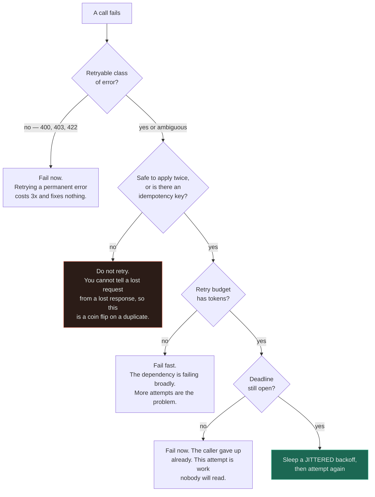
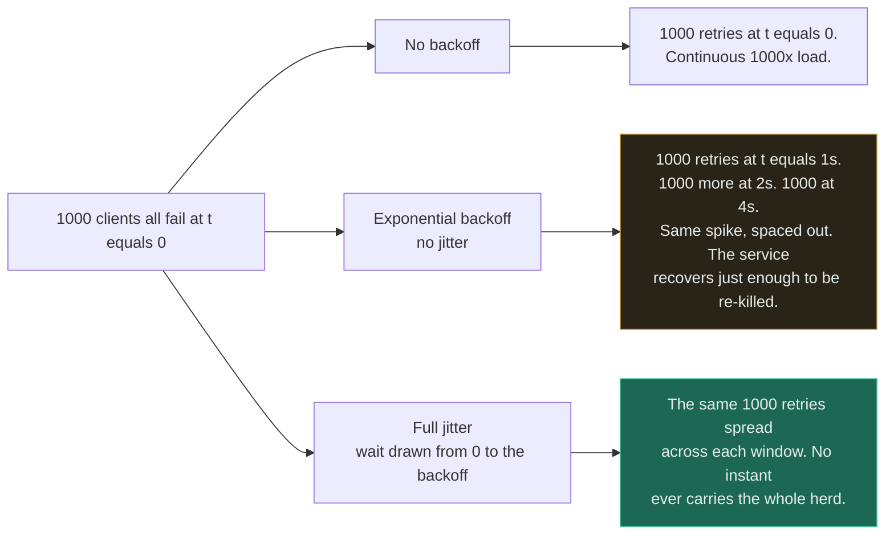
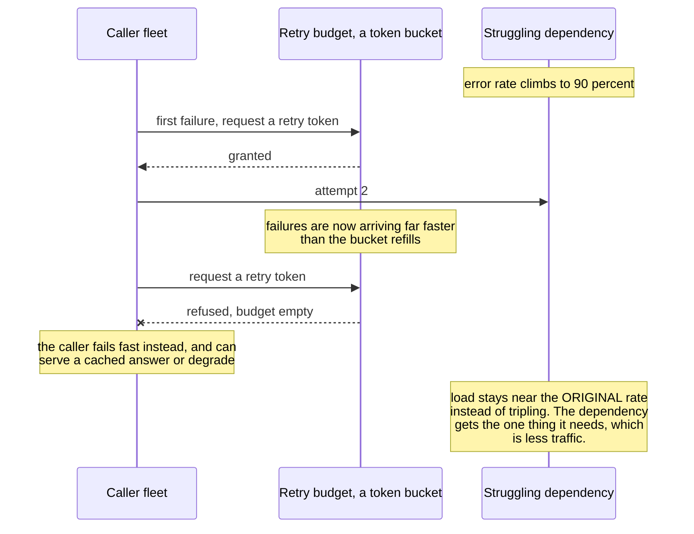

# Retries

`[INTERMEDIATE]` · Backoff spreads the stampede out in *time*. Only **jitter** changes its *size* — and jitter is the part that gets omitted.

---

## 1. One-line definition

Attempting a failed operation again, on the bet that the failure was transient and the next attempt
will land on a healthy path.

## 2. Explain like I'm new

A call does not connect, so you dial again. Most of the time the second attempt works, because the
thing that broke was momentary — a packet lost, a server restarting, a load balancer draining a node
mid-request.

Three problems arrive with that instinct, and they arrive in a fixed order. The first is that you
cannot tell a lost *request* from a lost *reply*, so "try again" and "do it twice" are the same
action from where you are standing. The second is that if the callee is struggling rather than
broken, your extra attempts are the last thing it needs. The third is the one nobody sees coming:
you are not the only caller, and **every other client failed at the same instant you did**.

## 3. Real-world analogy

A busy switchboard. Everyone's call fails at 14:00, everyone is told to try again in a minute, and
at 14:01 the switchboard receives every one of those calls simultaneously — plus the new ones.
Waiting politely did nothing, because everybody waited the *same* politely.

**Where it breaks:** a redialled phone call cannot be half-connected. A retried network request can
succeed at the far end and lose only the response, so the caller's second attempt applies the effect
a second time. That is the failure mode with no switchboard equivalent, and it is the one that
charges a customer twice.

## 4. Technical explanation

A retry policy is four independent decisions, and teams routinely ship one or two of them and call
it done.

| Decision | The question | Failure if omitted |
|---|---|---|
| **Retryability** | Is this class of error worth another attempt? | Retrying a `400` forever — a bug, dressed as resilience |
| **Safety** | Is applying this operation twice acceptable? | Duplicate charges, duplicate emails, drifting counters |
| **Backoff** | How long before the next attempt? | You finish off a dependency that was merely struggling |
| **Jitter** | How long *differently from everyone else*? | Every client retries in lockstep — the herd survives backoff |

### What is actually retryable

| Class | Examples | Retry? |
|---|---|---|
| **Transient** | Connection reset, `503`, `502`, a leader election, a brief GC pause, a node draining | **Yes** — this is the entire case for retrying |
| **Permanent** | `400`, `401`, `403`, `404`, `422`, a schema violation | **No.** A `400` will be a `400` forever. Retrying it is a bug that costs three times as much as it should |
| **Ambiguous** | Timeout, connection closed mid-response, `429` | Only if the operation is idempotent or carries an idempotency key — you do **not** know whether it happened |

**The ambiguous row is where the money goes.** A timeout tells you nothing about the far end. The
request may never have arrived, or it may have completed and had its acknowledgement lost, and no
amount of client-side cleverness can distinguish those two — which is why the fix lives on the
server as an [idempotency key](../../07-api-design/idempotency/), not in the retry policy.

### Why backoff alone is not enough

Take 1,000 clients that all fail at `t=0`, with a policy of `base × 2^attempt`:

| Policy | When the retries land | Peak retries in one instant |
|---|---|---|
| Immediate retry | `t=0` | 1,000 |
| Exponential backoff, no jitter | `t=1s`, then `t=2s`, then `t=4s` | **1,000** — unchanged |
| Full jitter — wait drawn uniformly from `[0, base × 2^attempt]` | spread across each window | ~1,000 divided by the window |

Backoff moved the spike; it did not shrink it. The recovering service is hit by the same wall of
traffic at exponentially spaced intervals, which is arguably worse, because it now recovers just far
enough to be knocked over again. **Jitter is not a refinement of backoff — it is the mechanism.**

## 5. Engineering at scale

**Retries must live at exactly one layer.** Three attempts in the HTTP client, three in the API
gateway and three in the calling service is not nine — it is twenty-seven, because each layer
retries the composite failure of the layer beneath it.

| Layers retrying, 3 attempts each | Attempts per user action | Load multiplier at total failure |
|---|---|---|
| 1 | 3 | 3× |
| 2 | 9 | 9× |
| 3 | **27** | **27×** |

Nobody designs this. It assembles itself, because each layer's retry policy is a sensible default
that someone enabled without knowing what the other two were doing.

**The mature control is a retry budget.** A per-call cap of three bounds one caller's attempts and
says nothing at all about fleet-wide retry load — the arithmetic above is proof. A budget caps
*retries as a fraction of total traffic*, typically a few per cent, using a token bucket per
downstream dependency. When the success rate collapses, the budget empties and retries stop, which
is precisely the moment you wanted them to stop. This is what gRPC ships as retry throttling and
Envoy ships as a retry budget, and both exist because per-call limits provably do not bound the
aggregate.

**Retries amplify load at exactly the moment there is least capacity to serve it.** That sentence is
the whole subject. Every other control on this page is a way of making it less true.

## 6. The problem it solves

Transient faults — the large class of failures that are real, are nobody's bug, and are gone by the
time you look. Packet loss, a replica failing over, a connection pool recycling, a pod being
rescheduled. Without retries, every one of those becomes a user-visible error for no reason.

## 7. The problem it does NOT solve

**Retries do not help against an overloaded dependency — they are the overload.** If the callee is
failing because it is saturated, your attempts are additional saturation, and the system converges
on staying down. That case belongs to the [circuit breaker](../circuit-breaker/) and to
[backpressure](../backpressure/), not here.

They also do not fix bugs, do not make a permanent failure temporary, and **do not tell you whether
the first attempt happened**. That last one is not a gap in the implementation — it is not knowable
from the client, ever.

---

## 9. How it works

Five gates, in this order, and the order matters — the cheap refusals come first:

```
if not retryable(error):      raise          # a 400 will be a 400 forever
if not safe_to_repeat(op):    raise          # unless an idempotency key exists
if not budget.allow():        raise          # fleet-wide brake, the important line
if attempt >= max_attempts:   raise
if deadline_exceeded():       raise          # nobody is left to read the answer

sleep(uniform(0, min(cap, base * 2 ** attempt)))   # full jitter
```



Only one path out of five ends in another attempt, and that is the correct ratio. Read the two boxes
people delete: the budget gate is the only one that knows anything about the *fleet*, and the
deadline gate is the only one that knows the answer is already worthless. Both look redundant beside
a `max_attempts` counter and neither is.

The jitter question deserves its own picture, because the intuition that backoff fixes it is so
strong:



The amber box is the one worth staring at. It is the configuration almost everybody ships, it looks
responsible in code review, and its peak load is **identical** to no backoff at all. Backoff changes
*when* the herd arrives; only jitter changes *how many arrive together*.

And the budget is what stops all of this from being a per-client argument:



The refusal arrow is the feature. A per-call limit of three would have allowed every one of these
retries — it is satisfied by construction — while the budget notices that *the fleet as a whole* has
started retrying and turns the amplifier off. That is the difference between bounding one caller and
bounding the load.

## 13. When to use it

- The failure class is genuinely transient — measure this rather than assuming it
- The operation is idempotent, or the server accepts an idempotency key
- A deadline exists and there is meaningful time left inside it
- The dependency is *not* currently failing broadly — otherwise the budget should be refusing you
- Reads, almost always. Writes, only with the safety question answered explicitly

## 14. When NOT to

- **The error is permanent.** A `400` retried three times is three `400`s and a slower error page.
- **The operation is not idempotent and there is no key.** You are trading an occasional error for
  an occasional duplicate charge, and only one of those two is recoverable.
- **The dependency is overloaded.** Retries are the load. Use a
  [circuit breaker](../circuit-breaker/).
- **The caller's deadline has already passed.** Every attempt after that is pure cost — see
  [timeouts](../timeouts/).
- **Another layer is already retrying.** Retry at one layer and fail fast everywhere else.
- Long-running or expensive operations, where a retry means repeating minutes of work — prefer a
  [queue](../../06-messaging/queues/) and a delivery counter.

## 17. Trade-offs

| Choose | Get | Pay |
|---|---|---|
| Retries | Transient faults become invisible | Duplicates unless idempotent; load amplification |
| Exponential backoff | The dependency gets breathing room between waves | Latency on the unlucky request; the herd is unchanged in size |
| Full jitter | The herd is broken up, not just delayed | Slightly worse best-case latency; less predictable timing |
| More attempts | Higher eventual success on a flaky path | Multiplied load exactly when capacity is lowest |
| Retry budget | Retry volume bounded fleet-wide, automatically | Some retries that would have succeeded are refused |
| Retry at one layer only | Amplification is `n`, not `n³` | Every other layer must be configured to fail fast — and defaults do not |

## 18. Why not?

| Alternative | Why not here | When it WOULD win |
|---|---|---|
| **Fail fast, no retry** | Transient faults become user-visible errors you could have absorbed | The operation is unsafe to repeat, or a human is about to retry anyway |
| **Circuit breaker instead** | It does not help the single transient blip, which is the common case | The dependency is *broadly* failing rather than occasionally |
| **Queue and retry asynchronously** | The caller is waiting; a queue makes the answer eventual | Work the user does not need in the response — then this is strictly better |
| **Hedged requests** — send a second attempt after p95 | Doubles load on the tail by design; needs idempotency anyway | Read-only, latency-critical, spare capacity available |
| **Fix the flakiness** | Slower, and some faults are not yours to fix | The retry rate is high enough that it is a defect report, not a resilience policy |

That last row is the one to keep honest about. **A retry rate that keeps climbing is not resilience
working — it is a bug being hidden**, and the retries are what stopped anyone noticing.

## 19. Failure scenarios

| Failure | What happens | Mitigation |
|---|---|---|
| **Retry without idempotency** | Duplicate writes: double charges, double emails, counters that drift upward and never down | Idempotency keys committed in the same transaction as the effect |
| **Retry without backoff** | You finish off a service that was merely struggling | Exponential backoff with a cap |
| **Retry without jitter** | Every client retries in lockstep — the herd survives, spaced out | Full jitter |
| **Retries at three layers** | 27 attempts per user action; a self-inflicted 27× load spike | Retry at one layer, fail fast elsewhere |
| **Retrying permanent errors** | Three times the cost, none of the benefit, and the real error is now three log lines away | Classify errors before retrying |
| **Retrying past the deadline** | Work completes for a caller that gave up minutes ago | Propagate a deadline, check it before each attempt |
| **Unbounded fleet-wide retries** | Per-call caps are satisfied while aggregate load triples | Retry budget as a fraction of live traffic |
| **Retry storm** | Inbound traffic flat, downstream request rate at 9× — and it stays there | Budget, jitter, and a breaker — see [retry storm](../../anti-patterns/retry-storm/) |

**The signature of the worst row is a divergence between two graphs that should track each other:**
user traffic flat, downstream request rate multiplied. Everything between those two lines is
self-inflicted, which also means it is entirely within your control to remove.

---

## 25. Without it → With it → New problem → Next

```
Without it   →  every transient blip becomes a user-visible error
With it      →  transient faults disappear; success rate rises on flaky paths
New problem  →  duplicate effects, and load amplification exactly when the
                dependency has least capacity to absorb it
Next         →  idempotency to make repeats safe, jitter and a retry budget to
                bound the amplification, and a circuit breaker for the case where
                retrying is itself the problem
```

## 27. Implementation

The control that bounds a retry storm is a **token bucket**, and there is a measured one in
[18-implementations/rate-limiter/](../../18-implementations/rate-limiter/). A retry budget is that
same structure pointed inward: tokens refill at a fixed rate, each retry spends one, and an empty
bucket means fail fast.

Measured on that implementation, `TokenBucket` costs **0.365 µs/op**, the sliding window log
**0.255 µs/op** and the fixed window **0.219 µs/op** — all three fast enough that the budget check is
free relative to the network call it is guarding. **The cost that decides the design is memory, not
CPU.** At 1M tracked keys the O(1) limiters need about **16 MB** and the sliding window log about
**8 GB**, which is why nobody ships the log. If you key a retry budget per downstream *and* per
tenant, that number is the one that will stop you.

The [circuit breaker](../../18-implementations/circuit-breaker/) is the companion piece: against a
dependency that hangs 10ms then fails, 200 calls take **2.061s without the breaker and 0.051s with
it**, and the dependency receives **5 requests instead of 200**. Retries in front of that breaker
are the difference between 5 requests and 15.

## 28. Common mistakes

| Mistake | Why it is wrong |
|---|---|
| Retries without idempotency | Manufactures duplicates — the classic sequence, because retries are easy to add and idempotency is easy to forget |
| Retries without backoff | Turns a struggling dependency into a dead one |
| **Retries without jitter** | The herd is delayed, not dispersed. Peak load is unchanged |
| Retrying every status code | `400` retried three times is still `400` |
| Retry logic in three layers | 27 attempts per user action, and no single owner |
| Per-call caps treated as a fleet limit | They bound one caller and nothing else |
| Ignoring the deadline | Attempts made on behalf of a caller who has already gone |
| Retrying a `429` immediately | You were told to slow down and did the opposite — honour `Retry-After` |
| No metric for attempts per logical request | The amplification factor is invisible until it is an incident |

## 29. Monitoring

Track **attempts per logical request** — not request count, which cannot distinguish one user action
retried nine times from nine user actions. Alert on the **retry ratio**, retries divided by total
outbound calls, because a rising ratio is the earliest signal that a dependency is degrading. Count
**budget exhaustions** separately: those are retries you deliberately refused, and a non-zero rate is
the system working, while a *sustained* one is an incident.

The highest-value panel is the pair from [§19](#19-failure-scenarios): inbound user traffic and
downstream request rate on the same axes. When they diverge, the gap is yours.

## 31. Exercises

**1.** The HTTP client retries three times. The API gateway retries three times. The calling service
retries three times. A dependency fails completely for thirty seconds. What does it receive?

<details><summary>Answer</summary>

**Twenty-seven attempts per user action**, because each layer retries the composite failure of the
layer beneath it — 3 × 3 × 3. Inbound user traffic is flat on the graph the whole time and the
dependency sees a 27× spike, which is the classic [retry storm](../../anti-patterns/retry-storm/)
signature.

Nobody designed this. Each layer's policy is a reasonable default enabled by someone who did not
know about the other two. The discipline is to **retry at exactly one layer and fail fast
everywhere else**, then bound that layer with a budget — because a per-call cap of three is
satisfied by all three layers simultaneously and bounds nothing.
</details>

**2.** During an incident, someone proposes raising `max_attempts` from 3 to 10 so that more requests
eventually succeed. Do you approve it?

<details><summary>Answer</summary>

No — and it is worth being specific about why, because the proposal is trying to help.

At a 90% failure rate you are not converting failures into successes, you are multiplying the load on
a dependency that is failing *because* of load. Ten attempts per action against a saturated service
is a 10× amplifier applied at the exact moment there is least capacity, and the system converges on
staying down.

The change that actually helps points the other way: a **retry budget** that stops retrying when the
fleet-wide failure rate spikes, plus a [circuit breaker](../circuit-breaker/) so callers fail fast
and can serve something degraded. If more attempts genuinely are the answer, the failures were
transient and the budget will happily fund them.
</details>

**3.** A payment call times out. The client does not know whether the charge happened. Retry or not?

<details><summary>Answer</summary>

Not on the client's own judgement — the question is not answerable there. A lost request and a lost
*response* are indistinguishable from the caller, so "retry only if it did not happen" is not
implementable at that end at all.

Make it decidable instead: send an **idempotency key**, and have the server store the key alongside
the result *in the same transaction as the effect*. The retry then returns the original response
rather than charging again. Store the key in a separate transaction and a crash between the two
gives you a charge with no key, which is precisely the case the mechanism exists to prevent. See
[idempotency](../../07-api-design/idempotency/) and
[no-idempotency](../../anti-patterns/no-idempotency/).
</details>

**4.** A colleague adds full jitter to every retry and reports the thundering herd is fixed. The
dependency still falls over in the next incident. What did jitter not do?

<details><summary>Answer</summary>

Jitter changed the *shape* of the retry load, not its *volume*. Spreading 27× amplification evenly
across a window still delivers 27× of work to a dependency sized for 1×; it merely arrives smoothly
instead of in waves, which is easier to survive and not enough.

Jitter is one of four controls, and the other three are still missing: retry at one layer, a budget
capping retries as a fraction of live traffic, and error classification so permanent failures are
not being retried at all. Jitter solves synchronisation. Only the budget solves amplification.
</details>

**5.** Your service already has a strict per-call cap of three attempts. Why is a retry budget not
redundant?

<details><summary>Answer</summary>

Because the two bound different things. A per-call cap bounds **one caller's attempts for one
operation**; a budget bounds **the fleet's retry traffic as a fraction of its live traffic**. Every
layer in the 27× example was inside its cap.

The distinction matters most at the worst moment. As the success rate collapses, per-call caps allow
retry volume to grow in proportion to failures — maximum amplification precisely at minimum capacity.
A budget is a token bucket whose refill rate does not care how badly things are going, so retries
taper off automatically. gRPC's retry throttling and Envoy's retry budgets exist for exactly this
reason.
</details>

## 33. Related

- [Reliability section index](../README.md) — how this fits with the other four patterns
- [Timeouts](../timeouts/) — a retry is meaningless without one, because nothing has failed yet
- [Circuit breaker](../circuit-breaker/) — what to do when retrying is itself the problem
- [Rate limiting](../rate-limiting/) — the same token bucket, pointed at callers instead of retries
- [Backpressure](../backpressure/) — the signal that should have stopped the load upstream
- [Reliability](../../00-foundations/reliability/) — the foundation this hangs off
- [Latency](../../00-foundations/latency/) — where backoff windows and deadlines come from
- [Idempotency](../../07-api-design/idempotency/) — the property that makes any of this safe
- [Queues](../../06-messaging/queues/) · [Workers](../../06-messaging/workers/) — retry as redelivery, with a DLQ as the cap
- [Caching](../../04-caching/fundamentals/) — where a fallback answer comes from when you stop retrying
- [Observability](../../11-observability/) — attempts per logical request, or you cannot see any of this
- [Anti-pattern: retry storm](../../anti-patterns/retry-storm/) · [no idempotency](../../anti-patterns/no-idempotency/)
- [Pattern catalogue: retry with backoff and jitter](../../13-design-patterns/CATALOGUE.md)
- [Rate limiter implementation](../../18-implementations/rate-limiter/) · [circuit breaker implementation](../../18-implementations/circuit-breaker/)
- [Glossary: retry storm](../../GLOSSARY.md#retry-storm) · [idempotency](../../GLOSSARY.md#idempotency)

<!-- PATH:BEGIN -->

---

<sub>**The reading path** · step 21 of 27 · *Retries*</sub>

◀ **Previous** [Timeouts](../../08-reliability/timeouts/README.md) &nbsp;·&nbsp; **Next** [Circuit breaker](../../08-reliability/circuit-breaker/README.md) ▶

<!-- PATH:END -->
