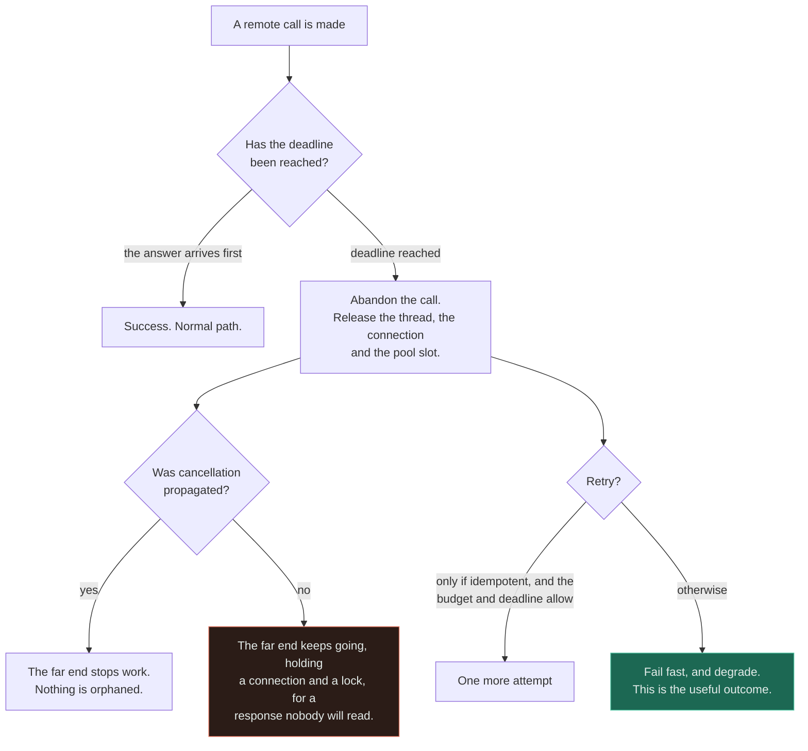
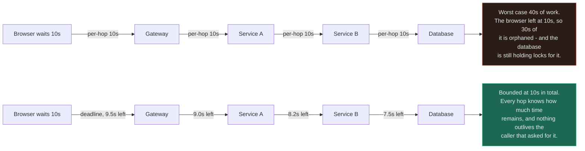
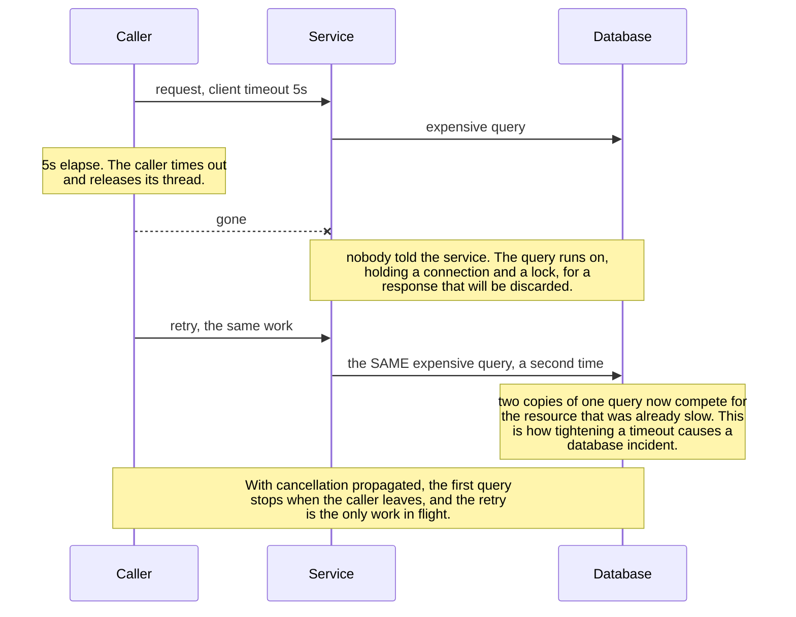
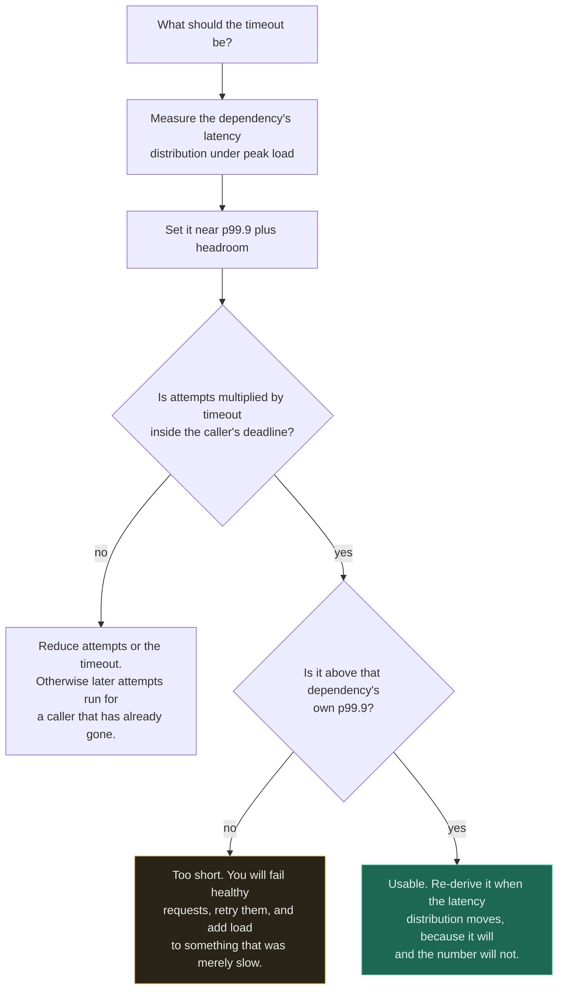

# Timeouts ★

`[BEGINNER]` · **Slow is worse than down.** A dead dependency fails fast and you route around it; a slow one holds every thread that touches it. A timeout is a guess — and having none is also a guess, an infinite one.

---

## 1. One-line definition

An upper bound on how long you will wait for an operation, after which you abandon it, release what
it was holding, and return a definite failure.

## 2. Explain like I'm new

Every remote call has two ways of going wrong, and only one of them is the one people design for.

If the dependency is **down**, you get a refused connection in microseconds. That is almost harmless:
failure is information, and information is something you can act on — fall back, degrade, try
somewhere else, tell the user.

If the dependency is **slow**, you get nothing at all. No error, no signal, just a thread sitting on
a socket. And a blocked thread cannot do anything, including give up. Multiply it by your request
rate and the pool empties, at which point endpoints that never touched the slow dependency stop
working too. **The timeout is the thing that converts the second case into the first**, and it is the
only mechanism that does.

## 3. Real-world analogy

A phone call where the other end has gone silent. You do not know whether they hung up, are thinking,
or have walked away. At some point you say "I'll call you back" and put the phone down, because the
line is worth more than the wait.

**Where it breaks:** when you hang up, the other person knows. When a client times out, the server
usually does not — it keeps working on a request nobody will read, holding a database connection and
a lock for a caller that has already gone. Hanging up frees *your* resource, and without explicit
cancellation it frees nothing at the far end.

## 4. Technical explanation

### Slow versus down

| | **Down** | **Slow** |
|---|---|---|
| Detection | Immediate — connection refused | Only when your timeout fires |
| Cost per call | Microseconds | The full wait, in held resources |
| What the caller can do | Anything: fall back, degrade, shed, reroute | Nothing. It is blocked |
| Health checks | Red | **Green** |
| Blast radius | The feature that needed it | Every endpoint sharing the pool |

**A dependency in brownout is up by every measure it publishes and is taking you down.** That
asymmetry — the dangerous mode being the invisible one — is why the timeout is the first control in
this section and the prerequisite for the rest of it.

### There is more than one timeout, and the default one is not the one you want

| Timeout | Bounds | The trap |
|---|---|---|
| **Connect** | Establishing the TCP connection | Usually short and usually fine |
| **TLS handshake** | Negotiation | Often defaults to none |
| **Socket / read** | The gap between *bytes* | **Resets on every byte.** A dependency dribbling one byte a second never trips it |
| **Total request** | The whole call, end to end | The one you actually want, and the one most clients do not set by default |
| **Idle / keep-alive** | An unused pooled connection | Too long, and you reuse a connection the peer already closed |
| **Deadline** | The whole *operation*, across every hop | Absolute, shared and propagated — see [§5](#5-engineering-at-scale) |

The socket-read row is the one that catches experienced people. A client configured with a
"30-second timeout" that is actually a read timeout will wait indefinitely on a peer that trickles
data — which is precisely the behaviour of a saturated service.

### The number is a guess, so make it an informed one

Derive it from the measured latency distribution, not from a round number. A timeout at roughly
p99.9 plus headroom fails the genuinely stuck calls and spares the merely unlucky ones. Then check it
against the two boundaries that actually constrain it:

```
attempts × timeout   ≤   the caller's remaining deadline
timeout              >   your dependency's p99.9 under peak load
```

A 10-second timeout with three attempts inside a caller that gives up at 10 seconds means attempts
two and three are executed on behalf of nobody. **That combination is extremely common and it is
pure cost.**

## 5. Engineering at scale

**Timeout budgets must shrink down a call chain.** If every hop restarts a 10-second clock, a
four-hop chain can take 40 seconds while the browser gave up at 10 — and the work at the bottom
carries on for the other 30, orphaned. What propagates is a **deadline**: an absolute point in time,
set once at the edge, passed down, and decremented by the time already spent. This is why gRPC's
deadlines are absolute and shared rather than per-hop, a decision made explicitly because per-hop
timeouts do not compose.

| Approach | A chain of four hops | The caller |
|---|---|---|
| Per-hop 10s timeouts | Up to 40s of work | Gave up at 10s. 30s of work is orphaned |
| Propagated deadline, 10s at the edge | Bounded at 10s total | Learns at 10s, and nothing outlives it |

**A timeout without cancellation frees your resource and nothing else.** The far end keeps burning
CPU, holding a connection and possibly a lock, for a response no one will read. Add a retry and you
now have two copies of the same expensive query running concurrently, which is how a timeout tuned
downward turns into a database incident. Propagate cancellation — a context, a deadline the server
re-checks, a client disconnect the handler notices.

**Timeouts interact with everything else in this section.** They are the input a
[circuit breaker](../circuit-breaker/) counts, the failure a [retry](../retries/) responds to, and
the mechanism by which a queued item can be recognised as too old to be worth doing. **Nothing else
here works without them**, which is the argument for reading this page first.

**Shortening a timeout is a load-shifting change, not a safety change.** Cutting it from 30s to 3s
converts held threads into errors, and if those errors are retried you have multiplied the request
rate against a dependency that was already slow. Change the timeout and the retry policy together,
or not at all.

## 6. The problem it solves

Unbounded resource consumption per request. A timeout makes the worst case per call a number you
chose, which is what keeps a caller alive when a dependency stalls — and it turns an unbounded
unknown into a definite, handleable outcome, which is the precondition for every other reaction.

## 7. The problem it does NOT solve

**It does not cancel the work.** Unless cancellation is propagated, the far end continues.

It does not tell you whether the operation succeeded — a timeout fires identically whether the
request was lost, the response was lost, or the work is still running, which is exactly why retrying
one requires [idempotency](../../07-api-design/idempotency/). It does not stop the *next* caller from
paying the same wait, which is the [circuit breaker](../circuit-breaker/)'s job. And it does not make
a slow dependency fast — **it converts a latency problem into an error-rate problem**, deliberately,
because errors are the ones you can handle.

---

## 9. How it works



The green box is the point of the whole mechanism: a definite failure, early enough to do something
about. The red box is what most implementations actually do, because setting a timeout is one line
and propagating cancellation is a design change.

### Why per-hop timeouts do not compose



Both rows use the same 10 seconds. In the top row it is a *per-hop* number, so it multiplies; in the
bottom row it is an *absolute deadline* set once at the edge, so it divides. **A budget that does not
shrink is not a budget** — it is four separate guesses that happen to share a value.

### The orphan, and how a retry doubles it



Read the last two notes together. The timeout did its job perfectly — the caller's thread was
released on schedule — and the *system* got worse, because the resource under pressure is now doing
the work twice. **A timeout protects the caller; only cancellation protects the callee.**

### Picking the number



Two checks, both arithmetic, and almost nobody runs either. The amber box is the failure mode of
over-correcting after an incident: a timeout tightened below the real latency distribution turns
healthy-but-slow requests into errors, and if those errors are retried the change is a load
multiplier wearing a safety improvement's clothes.

## 13. When to use it

- **Every remote call. Without exception.** Network, database, cache, queue, a filesystem on a
  network mount, DNS.
- Every lock acquisition and every pool checkout — those queue too
- Every hop in a chain, as a *deadline* derived from the caller's, not a fresh local number
- Anywhere a slow response is worse for the user than a fast failure, which is almost everywhere

## 14. When NOT to

- **Never "no timeout".** The choice is between a guess you made and a guess you inherited — and the
  inherited one is infinity.
- **Genuinely long-running work on a request thread.** Do not raise the timeout; move the work to a
  [queue](../../06-messaging/queues/) and return a handle.
- **Streaming responses**, where a total-request timeout is the wrong shape. Bound idle time between
  chunks and total duration separately.
- **Tightening one in isolation.** A shorter timeout with an unchanged retry policy is a load
  increase, not a safety improvement.
- **As a substitute for a breaker.** A timeout bounds *your* call; every subsequent caller still pays
  the full wait for the entire outage.

## 17. Trade-offs

| Choose | Get | Pay |
|---|---|---|
| Any timeout | Bounded resource use per call; slow becomes handleable | Some work that would have succeeded is failed |
| Shorter timeout | Threads freed sooner; failure detected earlier | Healthy-but-slow requests fail, and retries amplify |
| Longer timeout | Fewer false failures | Resources held through the whole outage |
| Propagated deadline | The chain is bounded by the caller's patience | Every hop must accept, decrement and honour it |
| Per-hop timeouts | Trivial to configure | They do not compose — the total is the sum |
| Cancellation on timeout | The callee stops too | Real plumbing in every layer, including the driver |
| Timeout plus retry | Transient stalls recover | Duplicate work unless idempotent; the worst case multiplies |

## 18. Why not?

| Alternative | Why not here | When it WOULD win |
|---|---|---|
| **No timeout** | Not an alternative — it is an infinite one, chosen by omission | Never, on a remote call |
| **A health check instead** | A dependency in brownout passes every health check it has | Removing a genuinely dead node from a pool |
| **[Circuit breaker](../circuit-breaker/) instead** | It counts timeouts; it cannot create one, and cannot interrupt a hang | Alongside, always — never instead |
| **A bulkhead** — a bounded pool per dependency | Caps the damage, but every slot still blocks for the full wait | Alongside, to stop one dependency owning the pool |
| **Bigger thread pool** | Buys seconds and makes the eventual exhaustion larger | A genuine concurrency need, not a stall |
| **Hedged request** — a second attempt after p95 | Doubles load on the tail, and needs idempotency anyway | Read-only, latency-critical, with spare capacity |
| **Async plus callback** | A larger change, and not always available | Work that is genuinely long-running — then it is the right answer |

The first row is why this page has no honest "do nothing" option, which makes it unusual in this
repository. **Every other pattern here is a judgement call. This one is arithmetic.**

## 19. Failure scenarios

| Failure | What happens | Mitigation |
|---|---|---|
| **No timeout at all** | One slow dependency holds every thread; endpoints that never used it also die | A total-request timeout on every call |
| **Read timeout mistaken for total** | A peer dribbling bytes never trips it | Set a total-request timeout explicitly |
| **Per-hop timeouts in a chain** | Up to N× the intended bound, and the outer caller leaves first | Propagate an absolute deadline |
| **Outer fires, inner continues** | Orphaned work holding connections and locks for nobody | Propagate cancellation, and re-check it server-side |
| **Timeout too short** | Healthy requests fail, get retried, and add load to something merely slow | Derive it from measured p99.9 under peak |
| **Timeout too long** | Resources are held for the full duration of the outage | The same derivation, from the other side |
| **`attempts × timeout` exceeds the caller's deadline** | Later attempts execute for a caller who has gone | Check the arithmetic; budget attempts inside the deadline |
| **Retry after a timeout, no idempotency** | The work is applied twice — the classic double charge | Idempotency keys |
| **Timeout on a non-idempotent write** | You cannot know whether it happened, so retrying and not retrying are both wrong | Make it decidable with a key, committed with the effect |
| **Every timeout is the same round number** | 30s everywhere leaves the fast dependency unprotected and fails the slow one constantly | Per-dependency values from per-dependency data |

**The first row deserves the emphasis it gets in [no timeout](../../anti-patterns/no-timeout/):**
the signature is *everything hanging, nothing erroring*. Health checks time out rather than fail, CPU
is low, memory is normal, and a restart buys about ninety seconds.

---

## 25. Without it → With it → New problem → Next

```
Without it   →  a slow dependency holds every thread that touches it, and takes
                down endpoints that never used it. Nothing errors and nothing
                alerts, because waiting is not a failure anyone measures
With it      →  slow becomes a definite, fast, handleable failure, and resource
                use per call is a number you chose
New problem  →  work that would have succeeded is now failed, the far end may
                still be running it, and a retry can duplicate it
Next         →  a propagated deadline so the chain is bounded, cancellation so
                nothing is orphaned, idempotency so a retry is safe, and a
                circuit breaker so the NEXT caller does not pay the wait again
```

## 27. Implementation

The measured [circuit breaker](../../18-implementations/circuit-breaker/) is the clearest evidence
for why this page exists, and its most useful line is an admission rather than a result: a
synchronous breaker in pure stdlib **cannot interrupt a blocking call** — it can only notice
afterwards that one was slow. Real deployments set a socket or request timeout on the client
*underneath* the breaker, and the breaker counts those timeouts rather than creating them. **A
breaker without a client timeout underneath it is decoration.**

The benchmark then measures what the timeout and the breaker buy together. Against a dependency that
hangs 10ms then fails, 200 calls take **2.061s without the breaker and 0.051s with it — 40× less
blocked thread time** — and the dependency receives **5 requests instead of 200**. Scale that 10ms
hang to a realistic multi-second brownout and the first number stops being a latency win and becomes
the difference between a degraded feature and a caller with no threads left for anything at all.

Two honest notes carried across from that page. The breaker's p99 is essentially unchanged, because
the calls that trip it pay the timeout in full and so does every probe — a timeout bounds the wait,
it does not remove it. And the wrapper's own cost is a fraction of a microsecond against a network
call costing a thousand times more, so neither the timeout nor the breaker is ever too expensive to
fit.

The [rate limiter](../../18-implementations/rate-limiter/) covers the complementary control: a
timeout bounds how long *you* will wait, a limiter bounds how much anyone may ask for.

## 28. Common mistakes

| Mistake | Why it is wrong |
|---|---|
| **No timeout on a remote call** | The default is infinity, and infinity holds threads |
| Assuming the client library has a sensible default | Many have none, and several default only to a *read* timeout |
| One round number for every dependency | Leaves the fast one unprotected and fails the slow one constantly |
| Per-hop timeouts in a chain | They sum. The outer caller leaves first and the inner work continues |
| A timeout with no cancellation | Frees your thread and nothing at the far end |
| `attempts × timeout` larger than the caller's deadline | Later attempts run for nobody |
| Tightening a timeout without touching retries | A load multiplier disguised as a safety fix |
| Retrying a timed-out non-idempotent write | The double-charge bug, exactly |
| Trusting health checks to catch slowness | A brownout is green on every one of them |
| No timeout on lock or pool acquisition | The queue is in front of the call, not inside it |

## 29. Monitoring

**Count timeouts as their own error class**, separately from `5xx` — they behave differently, they
mean something different, and lumping them together hides the only signal that distinguishes slow
from broken.

Watch **p99 and p99.9 against the configured timeout on the same chart**: the gap between them is
your actual headroom, and it shrinks silently as a dependency degrades. Track thread-pool and
connection-pool **saturation**, since that is the resource the timeout exists to protect and the
first thing to move in the no-timeout incident. Track **time-to-first-byte separately from total
duration**, because a read timeout cannot distinguish them. And alert on **timeout rate by
dependency** rather than in aggregate — the aggregate stays calm while one dependency fails
completely.

## 31. Exercises

**1.** A reporting query gets slow. Within minutes the checkout service is down, and it does not use
the reporting database at all. Explain the mechanism.

<details><summary>Answer</summary>

Shared resource exhaustion, caused by an absent timeout. Every request touching the slow dependency
holds a thread — or a connection, or an event-loop slot — for as long as it takes, and with no bound
that is indefinitely. The pool empties, and a service with no free threads cannot serve *any*
endpoint, including the ones with nothing wrong with them.

The signature is **everything hanging, nothing erroring**: health checks time out rather than fail,
CPU is low, memory is normal, and a restart buys about ninety seconds. Nothing appears in an error
dashboard, because waiting is not a failure anybody is counting.

Two fixes, in order. A total-request timeout on every remote call converts the hang into a countable
error. Then a bulkhead — a bounded pool per dependency — so that even bounded waits on one
dependency cannot consume every slot. See [no timeout](../../anti-patterns/no-timeout/).
</details>

**2.** Every hop in a four-service chain has a 10-second timeout, and the browser gives up after 10
seconds. Is the system bounded at 10 seconds?

<details><summary>Answer</summary>

No. Per-hop timeouts **sum** — the worst case is roughly 40 seconds of work, and the browser left at
10. The remaining 30 seconds is orphaned: nobody is waiting for it, and it is still holding
connections and possibly locks at the bottom of the chain.

The fix is a **deadline** rather than a timeout — an absolute point in time, set once at the edge,
passed to each hop and decremented by the time already spent, so hop four gets what is left rather
than a fresh ten seconds. gRPC's deadlines work exactly this way, and its documentation is explicit
that they are absolute and shared precisely because per-hop timeouts do not compose.

A budget that does not shrink as it travels is not a budget; it is four separate guesses that happen
to share a value.
</details>

**3.** After an incident, a team cuts every timeout from 30s to 3s. Latency improves. A week later
the database falls over under normal traffic. What did they do?

<details><summary>Answer</summary>

They turned held threads into errors, and the errors are being retried. A timeout below the real
latency distribution fails healthy-but-slow requests, each retry issues the same work again, and the
request rate against a dependency that was merely slow is now multiplied.

The second mechanism is worse and is invisible: without propagated cancellation the abandoned query
**keeps running**, so each retry adds a concurrent copy of an expensive query rather than replacing
it, and the resource under pressure is doing the work two or three times over.

The right move is to derive each timeout from that dependency's own measured p99.9 under peak load,
change the retry policy in the same commit, and propagate cancellation so an abandoned call actually
stops. **A timeout protects the caller; only cancellation protects the callee.**
</details>

**4.** The client timeout is 5 seconds and the retry policy is three attempts, all inside an upstream
caller whose deadline is 5 seconds. What is wrong?

<details><summary>Answer</summary>

`attempts × timeout` is 15 seconds inside a 5-second deadline, so attempts two and three run entirely
on behalf of a caller that has already gone. They cost full load and can deliver nothing — and if the
operation writes, they can still apply their effects, which is duplicated work for a request that was
reported as failed.

The arithmetic that must hold is `attempts × timeout ≤ the caller's remaining deadline`, checked
against the *remaining* budget at that hop rather than the original one. Either drop to one attempt,
or reduce the per-attempt timeout so the sequence fits, or propagate the deadline and let each
attempt take only what is left.

Every attempt should also re-check the deadline before starting, because a slow first attempt can
consume the whole budget on its own.
</details>

**5.** Someone argues that a wrong timeout is worse than no timeout, since a wrong one fails work
that would have succeeded. Do you accept the argument?

<details><summary>Answer</summary>

No. The comparison is not "a guess versus certainty" — it is **a guess you made versus a guess you
inherited**, and the inherited one is infinity. No timeout is a decision that you will wait for ever,
made by omission, and it is wrong in the one situation that matters most.

The costs are also not symmetric. A too-short timeout fails some requests that would have succeeded,
which is visible, countable, and tunable from the metrics it produces. No timeout holds threads
indefinitely and takes down endpoints that never touched the dependency — silently, with no error
rate, no alert and no obvious cause — and the blast radius is the whole service rather than one call.

The honest version of their concern is a real one: **do not tighten a timeout in isolation.** Derive
it from measured latency, change the retry policy alongside it, and propagate cancellation. Then the
guess is bounded, observable, and improvable, which is as close to certainty as this ever gets.
</details>

## 33. Related

- [Reliability section index](../README.md) — how this fits with the other four patterns
- [Circuit breaker](../circuit-breaker/) — counts the timeouts this page creates, and spares the next caller
- [Retries](../retries/) — what happens after a timeout fires, and the arithmetic that bounds it
- [Backpressure](../backpressure/) — bounding the wait *before* the call, not during it
- [Rate limiting](../rate-limiting/) — bounding how much is asked for rather than how long you wait
- [Reliability](../../00-foundations/reliability/) — the foundation this hangs off, including why a timeout converts slow into down
- [Latency](../../00-foundations/latency/) — p99 and p99.9, which is where the number comes from
- [Idempotency](../../07-api-design/idempotency/) — what makes retrying a timed-out write safe
- [Queues](../../06-messaging/queues/) · [Workers](../../06-messaging/workers/) — where genuinely long work belongs
- [Caching](../../04-caching/fundamentals/) — the fallback served when the deadline is spent
- [Circuit breaker + service](../../14-component-combinations/circuit-breaker-and-service/) — slow versus down, in context
- [Observability](../../11-observability/) — timeouts as their own error class, and pool saturation
- [Anti-pattern: no timeout](../../anti-patterns/no-timeout/) · [retry storm](../../anti-patterns/retry-storm/) · [no idempotency](../../anti-patterns/no-idempotency/)
- [Pattern catalogue: timeout](../../13-design-patterns/CATALOGUE.md)
- [Circuit breaker implementation](../../18-implementations/circuit-breaker/) · [rate limiter implementation](../../18-implementations/rate-limiter/)
- [Glossary: timeout](../../GLOSSARY.md#timeout) · [tail latency](../../GLOSSARY.md#tail-latency)

<!-- PATH:BEGIN -->

---

<sub>**The reading path** · step 20 of 27 · *Timeouts*</sub>

◀ **Previous** [Reliability patterns](../../08-reliability/README.md) &nbsp;·&nbsp; **Next** [Retries](../../08-reliability/retries/README.md) ▶

<!-- PATH:END -->
