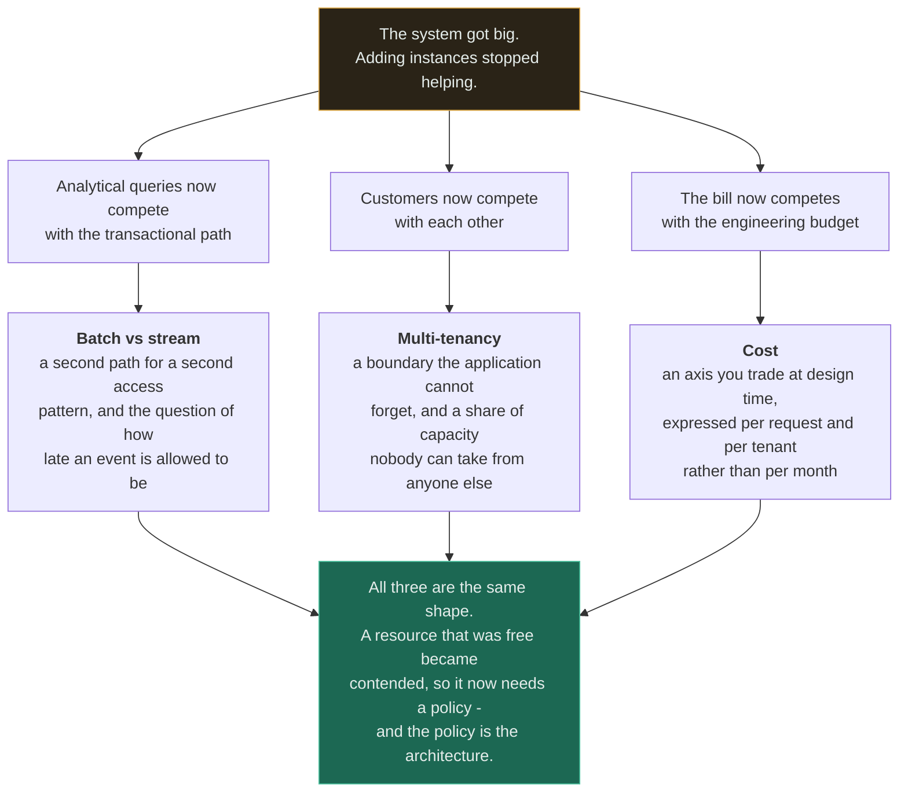

# Scalability

[Foundations](../00-foundations/scalability/) answers *what scalability is* — that a system is limited
by what its copies **share**, not by how many copies you can afford. This section is about what
happens after that: the three pressures that arrive once a system is genuinely large, and that are not
solved by adding another instance.

They look unrelated. They are the same pressure seen from three angles. **Every one of them is a
question about a resource that used to be free and is now contended** — the transactional database's
spare capacity, the connection pool a tenant is monopolising, the gigabyte crossing an availability
zone. At small scale, none of these has a name. At large scale, each is an architecture.

---

## What is here

Read the middle column as symptoms rather than topics. None of the three arrives as a design request;
each arrives as an incident, a support ticket or an invoice, which is why they are so often handled by
the person who happened to be on call rather than by anyone with the authority to change the design.

| # | Topic | Difficulty | The one thing to take away |
|---|---|---|---|
| 1 | [Batch vs stream processing](batch-vs-stream/) | `[A]` | OLTP and OLAP are **access patterns, not products**. What makes streaming hard is event time versus processing time, and a watermark is how you decide to stop waiting. |
| 2 | [Multi-tenancy](multi-tenancy/) | `[A]` | **Enforce the tenant identifier at a layer the application cannot forget.** One missing `WHERE` clause is a cross-tenant breach with a `200` status code. |
| 3 | [Cost](cost/) | `[I]` | Cost is an architectural constraint, not a finance report. **The most expensive architecture is usually the one nobody measured.** |

Two more topics belong in this section — **batching** and **asynchronous processing** — and are not
written yet, so they are absent rather than stubbed. Until they are, the nearest coverage is
[queues](../06-messaging/queues/) and [workers](../06-messaging/workers/) for the asynchronous shape,
and the batching row in the [trade-off framework](../TRADEOFF-FRAMEWORK.md#4-trade-offs-you-will-make-constantly)
for the throughput-against-latency exchange. [ROADMAP.md](../ROADMAP.md) tracks both.

## The three questions this section is really about

Each page turns on a single question that is almost never asked explicitly, and each of those
questions has a **number** as its answer. That is what separates them from taste.

| Page | The question | Why it is never asked | What happens without it |
|---|---|---|---|
| Batch vs stream | *How late is too late for an event to count?* | "Real-time" is treated as a requirement rather than as a range | Allowed lateness is left at a default, stragglers are dropped silently, and the totals drift a few per cent below the batch recompute forever |
| Multi-tenancy | *What may one tenant take from the others?* | Sharing is the default and limits have to be built | One customer's export is everyone else's outage, and the aggregate dashboard shows a small bump |
| Cost | *What does one request cost?* | The bill arrives monthly as one number, months after the decision | The expensive architecture is discovered a year later by somebody who cannot change it |

**All three failures are silent.** Nothing errors, nothing pages, and every health check stays green
— which is why each page's monitoring section matters more than its trade-off table. The signals are
watermark lag, per-tenant percentiles and unit cost, and almost nobody has any of the three.

## Where this connects

These pages sit downstream of the component sections and assume them:

- **Batch vs stream** builds on [queues](../06-messaging/queues/) — the log is what makes replay
  possible, and its retention *is* your replay horizon — and on
  [database fundamentals](../05-databases/fundamentals/) for why a row store and a column store cannot
  be the same bytes.
- **Multi-tenancy** builds on [sharding](../05-databases/sharding/) for placement and hot partitions,
  and on [schema migration](../05-databases/schema-migration/) for what happens when one migration
  becomes six thousand.
- **Cost** builds on [availability](../00-foundations/availability/), because most of the expensive
  decisions in an architecture were bought to survive something, and on
  [observability](../11-observability/), which is both the tool you find the money with and 10 to 30
  per cent of the bill.

And they connect to each other more tightly than the numbering suggests: a per-tenant aggregation is
where a stream's key skew becomes a hot partition; cost per tenant is the metric that decides whether
the multi-tenant model works; and the choice between an always-on streaming cluster and a job that
runs for twenty minutes is a cost decision wearing a latency argument.

## Related

- [Scalability](../00-foundations/scalability/) — the foundation these three assume
- [Throughput](../00-foundations/throughput/) · [Latency](../00-foundations/latency/) — the two axes every page here trades between
- [Sharding](../05-databases/sharding/) · [Replication](../05-databases/replication/) — how the storage layer scales, one section down
- [Queues](../06-messaging/queues/) · [Workers](../06-messaging/workers/) — asynchrony, which is not the same as stream processing
- [Rate limiter](../18-implementations/rate-limiter/) — the per-tenant bucket, with measured benchmarks
- [Observability](../11-observability/) — every failure in this section is silent, so this is not optional
- [Trade-off framework](../TRADEOFF-FRAMEWORK.md) · [Estimation guide](../ESTIMATION-GUIDE.md) · [System design thinking](../SYSTEM-DESIGN-THINKING.md)
- [Glossary](../GLOSSARY.md) · [Coverage gaps](../GAPS.md)
