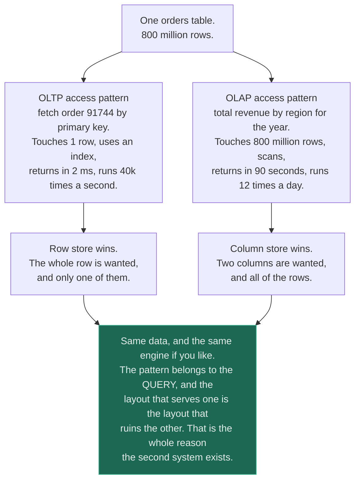
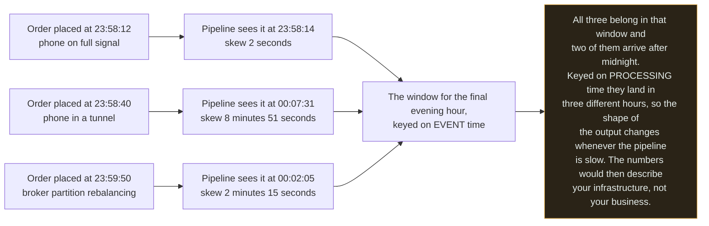
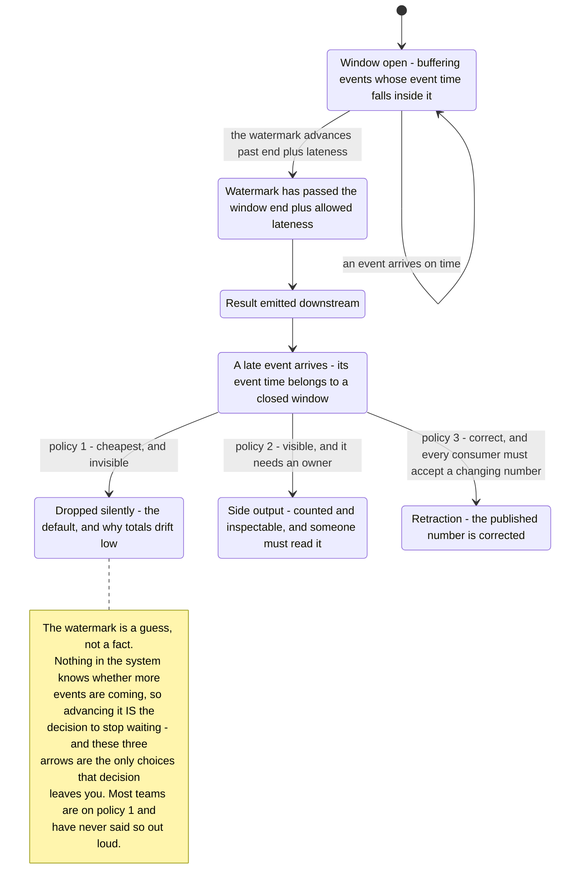
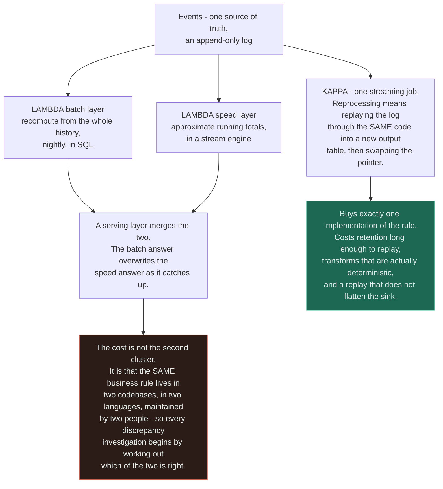

# Batch vs Stream Processing

`[ADVANCED]` · Batch and streaming run the same computation over different windows. What actually
separates them is that a stream must decide, with no way of ever being certain, **when to stop
waiting for data that has not arrived yet** — and every hard problem on this page is a consequence of
that one decision.

---

## 1. One-line definition

Two ways of running the same computation over the same events: **batch** reads a bounded set that has
finished arriving, **streaming** reads an unbounded set that never will.

## 2. Explain like I'm new

You want to know how many orders you took yesterday.

The batch answer: at midnight, read yesterday's orders, count them, write the number down. Easy,
because "yesterday's orders" is a finished list — nothing can be added to it.

The streaming answer: keep a running count and add one every time an order arrives. That sounds like
the same job with a smaller loop, and it is not, because of a phone in a tunnel. Someone placed an
order at 23:58 on a train with no signal. Their phone held it and sent it at 00:07 the next morning.
Your midnight job has already run and published yesterday's total. Your streaming job published it
seven minutes ago. Both numbers are now wrong, and neither system knows.

Nothing here is a bug. The order genuinely happened yesterday, and it genuinely arrived today, and no
amount of engineering removes the gap between those two facts. So the real design question is never
"batch or stream". It is **how long you are willing to wait for stragglers, and what you do with the
ones that turn up after you stopped waiting** — and once you have answered that, batch is simply the
version where the answer was "until midnight, then never".

## 3. Real-world analogy

Your monthly bank statement versus the balance in your banking app. The statement is batch: a closed
period, reconciled, definitive, arriving once and never changing. The app balance is streaming: always
current, and always containing things that have not settled — a card payment appears in seconds, a
cheque appears three days later dated when it was written.

**Where it breaks:** the bank has a legal definition of when a period closes and a regulator who
enforces it. Your pipeline has neither, so "closed" is a number somebody guessed. The analogy also
implies the two views are for two audiences, whereas in a real pipeline they are the same numbers on
two dashboards and a stakeholder *will* notice they disagree — at which point the interesting work
begins. Worst of all, a bank never has to un-publish. A streaming job that fired a window early and
then received late data has to decide whether to emit a correction, which means every consumer
downstream must be built to accept a number that changes after it looked final. Almost none of them
are.

## 4. Technical explanation

### OLTP and OLAP are access patterns, not products

The single most common confusion in this area is treating these as two categories of software. They
are two shapes of query.

| | **OLTP — transactional** | **OLAP — analytical** |
|---|---|---|
| Unit of work | One entity, by key | One aggregate, over a population |
| Rows touched per query | 1 to a few hundred | Millions to billions |
| Columns touched | All of them | Two or three of them |
| Latency budget | Single-digit milliseconds | Seconds to minutes |
| Concurrency | Thousands of queries at once | A handful |
| Access method | Index seek | Sequential scan |
| Storage layout that wins | **Row store** — the whole row is wanted | **Column store** — one column across every row |
| Writes | Constant, small, transactional | Bulk load, append-only, rarely updated |
| Who is waiting | A user, holding a page open | An analyst, or nobody |
| Correctness bar | Exact, now | Exact eventually, or approximate now |

**These are properties of the query, not of the logo on the database.** PostgreSQL serves both
patterns perfectly well up to a surprising size. Snowflake will accept a single-row insert. What is
true is that a store *tuned* for one pattern is bad at the other, and the tuning is physical — you
cannot store the same bytes in row-major and column-major order at the same time without storing them
twice.



Read the two middle boxes as a physics constraint rather than a product recommendation. The
operational corollary is the one that causes incidents: **an OLAP query aimed at your OLTP database
is how the OLTP database goes down**, because a ninety-second scan holds buffer pool, connections and
— as [schema migration](../../05-databases/schema-migration/) shows — a lock queue that everything
else piles up behind.

### Batch and streaming, precisely

| | **Batch** | **Streaming** |
|---|---|---|
| Input | Bounded — the set is complete | Unbounded — the set never completes |
| Trigger | A schedule, or a file landing | An event arriving |
| Notion of "done" | The job exits | There is none |
| Window | Implicit: the whole input | Explicit, and you must choose it |
| Latency | Minutes to a day | Milliseconds to seconds |
| Failure recovery | Rerun the job. It is idempotent by construction | Restore from a checkpoint and resume from an offset |
| Reprocessing | Trivially — point it at the same input | Replay the log, if you kept enough of it |
| State | Lives in the input; the job is stateless | Lives in the job, and grows |
| Cost shape | Bursty — you pay for twenty minutes | Constant — you pay for a cluster that never stops |
| Operational load | A cron job and a failure email | A permanently running distributed system |

The last two rows are the ones that get left off whiteboards. **A streaming pipeline is a service you
now operate, with an on-call rotation, and it costs money at 04:00 on a Sunday when nothing is
happening.**

### Event time versus processing time — the distinction that makes streaming hard

Three timestamps exist for every event and they are routinely conflated:

| Timestamp | Meaning | Whose clock | Trustworthy? |
|---|---|---|---|
| **Event time** | When the thing actually happened | The source device or service | Only as far as you trust that clock |
| **Ingestion time** | When it entered your pipeline | The broker | Yes, and useless for business meaning |
| **Processing time** | When your operator got to it | The worker | Yes, and it changes if you are slow |

The gap between event time and processing time is called **skew**, and its distribution is bimodal in
every real system: the overwhelming majority of events are a second or two behind, and a thin tail is
minutes to days behind because of retries, mobile offline buffers, a broker backlog, a consumer
restart, a partition rebalance, or a deliberate replay.



The final box is the whole argument. **Windowing by processing time is always computable and usually
meaningless; windowing by event time is what you actually want and is not computable, because no
system can prove that no further events are coming.** Every streaming framework is an elaborate answer
to that impossibility, and the answer is called a watermark.

### Watermarks — how you decide to stop waiting

A watermark is an assertion made by the pipeline: *"I believe I have now seen every event with an
event time at or before T."* It is a heuristic. Nothing verifies it. It is usually derived as the
maximum event time observed so far minus a fixed allowed lateness, computed per partition and then
taken as the minimum across partitions.

Everything follows from that:

| Watermark behaviour | Consequence |
|---|---|
| It advances past a window's end | The window closes, fires, and emits a result. **This is the only reason you ever get an answer** |
| Allowed lateness set too small | Windows fire before the stragglers arrive. Totals drift low, silently |
| Allowed lateness set too large | Results are late and state is held open longer, so memory grows with lateness |
| It stops advancing | Every window in the job stops firing. No errors, throughput normal, output simply stops |
| An event arrives after it | You must choose: drop, divert, or retract |



Read the diagram by noticing that the interesting transitions all leave `LATE`, and that the default
is the invisible one. Policy 3 is the only correct answer and it is the most expensive, because a
retraction is a contract change for **every** downstream consumer: the dashboard, the export, the
finance reconciliation, and the email that already went out. Choosing policy 1 is legitimate. Choosing
it by never discussing it is how a 2% shortfall becomes a quarter-long investigation.

### Window types

| Window | Shape | Use it for | State cost |
|---|---|---|---|
| **Tumbling** | Fixed size, no overlap — every minute | Counts and totals per period | One window per key at a time |
| **Hopping / sliding** | Fixed size, overlapping — 5 minutes, advanced every minute | Moving averages, rate alarms | Size divided by hop, per key. A 1-hour window hopping every second is 3,600 live windows per key |
| **Session** | Closes after a gap of inactivity | User sessions, device activity | Unbounded — one busy key can hold a window open indefinitely |
| **Global** | Everything, fired by a custom trigger | Running totals with manual control | You now own the state eviction policy |

**Hopping windows are where streaming state costs are hidden**, because nothing in the configuration
looks expensive until you multiply the overlap factor by the key cardinality.

### Lambda and Kappa



**Lambda architecture is not two systems, it is one business rule written twice** — and duplicated
logic diverges on a schedule set by whoever forgets first. That is the entire reason Kappa exists, and
it is why the argument between them is not about hardware.

Kappa's own costs are real and are usually understated. Replay assumes your transforms are
deterministic, which they are not if the job enriches events with a lookup against a service whose
data has since changed — replay then produces today's answer to yesterday's question. It assumes the
log retains enough history, which is a storage bill that scales with how far back you might ever need
to go. And it assumes a full-speed replay will not saturate the sink that is also serving live writes.

The honest modern position is neither purist: engines such as Flink, Beam and Spark run **the same
code over a bounded and an unbounded source**, which does not delete the batch layer so much as make
it stop being a second implementation. That is Lambda's actual problem solved, and it is the outcome
worth aiming at.

### "Real-time" means seconds

| What someone says | What they need | What it costs |
|---|---|---|
| "Real-time" in a trading or ad-auction context | Sub-millisecond, inside the request path | A different architecture entirely — no pipeline is involved |
| "Real-time" on a fraud or abuse check | 100 ms to 1 s, before the action commits | A stream engine with tiny windows, or an in-request lookup |
| **"Real-time" on a dashboard or alert** | **1 to 10 seconds** | **A stream engine with ordinary windows. This is what the word almost always means** |
| "Real-time" on an operations report | 1 to 15 minutes | Micro-batch. A five-minute cron and a query will do it |
| "Real-time" on anything a human reads each morning | Overnight | A batch job, and streaming would be a waste |

**The design question is not "do you need real time", it is "how late is too late, and what happens
then".** A fraud decision that arrives after the payment settles has zero value; a dashboard ninety
seconds stale is indistinguishable from live to the person looking at it. Ask for the number, and ask
what the number costs — the answer collapses most streaming proposals into a scheduled query.

## 5. Engineering at scale

**State is the resource that runs out, and it is a product you can compute in advance.** A streaming
job's memory is roughly window length × key cardinality × overlap factor × allowed lateness. A session
window keyed on user id, with a thirty-minute gap and seven days of allowed lateness, holds every
active user's partial session for a week. Nothing in the configuration file looks like a capacity
decision, and all four of those terms are one.

**Exactly-once means exactly-once *effect*, not exactly-once delivery.** No system prevents a message
being delivered twice; what a stream engine gives you is an atomic pairing of the output write with
the offset commit, so a replay overwrites rather than adds. That requires a transactional sink or an
idempotent write — see [idempotency](../../07-api-design/idempotency/). Bolt a stream engine onto a
sink that does neither and every checkpoint restart double-counts, quietly.

**Backpressure has nowhere to go, because the source is the world.** A batch job that is slow finishes
late. A streaming job that is slow accumulates a backlog in the broker, and you have three options and
no others: buffer it, which is the broker's retention doing the absorbing; shed it, which means
choosing what to lose; or scale out, which takes minutes you may not have. See
[queues](../../06-messaging/queues/) — the broker is the shock absorber and its retention setting is a
capacity decision disguised as a config value.

**Key skew concentrates a distributed job onto one machine.** Windows are keyed, keys are hashed to
task slots, and if one tenant is 60% of your traffic then one slot holds 60% of the state and does 60%
of the work while the rest idle. This is the same failure as a hot shard — see
[sharding](../../05-databases/sharding/) — and the same mitigations apply: a composite key, a
pre-aggregation stage, or a salted key with a second reduce.

**Reprocessing is what makes a pipeline maintainable, and it has to be designed in.** If you cannot
re-derive last month's numbers with today's code, every bug you ship is permanent and every historical
figure is an artefact of whichever version was running that week. That means versioned output tables,
a pointer swap rather than an in-place update, and enough retention to replay the window you care
about.

**Schema evolution has to survive a replay.** A replay reads messages written by code from a month
ago. Adding a required field is therefore the same trap as adding a `NOT NULL` column mid-rollout —
the compatibility rules are the ones in [versioning](../../07-api-design/versioning/), and the
enforcement point is a schema registry, not a code review.

**Batch pipelines fail differently and just as expensively.** The classic is the small-files problem:
a job writing one file per micro-batch produces a million tiny objects, and the metadata cost of
listing them eventually exceeds the cost of reading them. The other classic is the job that takes
longer to run than its schedule interval, so two copies overlap and race on the same output.

## 6. The problem it solves

Turning a continuous flow of events into answers, at a latency the decision actually needs, with an
explicit and stated policy for data that arrives after you stopped waiting. Batch solves the same
problem for decisions that can wait, at a fraction of the operational cost.

## 7. The problem it does NOT solve

**Streaming does not make the data correct — it makes wrong data arrive sooner.** A pipeline is a
transport and an aggregation; it has no opinion about whether the events were right.

It also does not give you:

- **Freedom from batch.** You will still run a reconciliation recompute, and the first thing anyone
  does with a streaming number is compare it to that recompute. Plan for two answers that disagree.
- **Transactions across events.** A stream sees one event at a time. Anything requiring two facts to
  change together needs the mechanisms in [consistency](../../00-foundations/consistency/).
- **A fix for OLTP being asked OLAP questions.** That wants a second store with a different layout,
  not a shorter window.
- **Removal of late data.** It converts an unbounded uncertainty into a policy. The uncertainty is
  still there; you have chosen how to be wrong.
- **Lower cost.** A cluster that never stops is nearly always more expensive than a nightly job that
  runs for twenty minutes — see [cost](../cost/).
- **Ordering.** Partitioned logs order within a partition and not across them, so a global ordering
  requires either one partition or a sort you pay for yourself.

---

## 9. How it works

A streaming pipeline is six stages, and the interesting one is the fifth.

| # | Stage | What happens | The decision hidden in it |
|---|---|---|---|
| 1 | **Source** | Read from a partitioned, replayable log | Retention length, which is your replay horizon |
| 2 | **Timestamp assignment** | Extract event time from the payload | Which clock you are trusting, and what to do with events from the future |
| 3 | **Key** | Hash the record onto a partition and task slot | Skew, and therefore which machine falls over first |
| 4 | **Window** | Assign to one or more windows by event time | Window type, size, overlap — and therefore state size |
| 5 | **Trigger** | Fire when the watermark passes the window end plus lateness | **The whole design. How late is too late** |
| 6 | **Sink** | Write the result, atomically with the offset commit | Idempotent or transactional, or your restarts double-count |

Batch is the same six stages with stages 4 and 5 collapsed: the window is the input, and the trigger is
"the file is complete". **That is not a simplification of streaming, it is streaming with the hard
decision made for you by the fact that the input ended.**

Reprocessing in a Kappa-shaped pipeline is then: reset the consumer group to the earliest offset,
point the sink at a new versioned output table, let it run at whatever speed the sink tolerates,
verify the new table against the old, and swap the pointer. It is the same
[expand and contract](../../05-databases/schema-migration/) shape one level up, and the pointer swap
is the flag flip.

## 13. When to use it

Reach for **streaming** when at least one of these is true:

- **The decision expires.** Fraud scoring, abuse throttling, alerting, live capacity control, anything
  where an answer produced later has less value than no answer.
- The output feeds another machine rather than a person, and that machine acts within seconds.
- Recomputing the whole history is impractical, so incremental state is the only affordable shape.
- The source is genuinely a stream — clickstream, IoT telemetry, CDC from a database — and materialising
  it into files first buys you nothing.
- You need per-key state over a moving window, which is awkward and slow to express in scheduled SQL.

Reach for **batch** when:

- The consumer is a human on a daily or hourly cadence — and note that this covers most dashboards.
- Correctness matters more than freshness, and being able to rerun the job is worth more than being
  fast.
- The computation needs a global view: a full sort, a join against the whole dimension table, a
  percentile over everything.
- The source produces one file a day anyway, so there is no stream to consume.
- The team is small. A cron job and a query has an operational cost close to zero.

## 14. When NOT to

- **Do not adopt streaming because the source is a queue.** A queue in front of a worker is
  asynchronous processing, not stream processing — see [workers](../../06-messaging/workers/). The
  distinction is windows and state, not the transport.
- **Do not build Lambda on day one.** It is a migration shape, adopted when a working batch pipeline
  needs a fast path bolted beside it. Starting there means writing the rule twice before you know what
  the rule is.
- **Do not stream into a dashboard nobody watches at night.** A five-minute cron produces a number
  indistinguishable from live to its only reader, at a fraction of the cost and none of the on-call.
- **Do not build a streaming pipeline before you can state "how late is too late" as a number.** It is
  the only input that determines the design, and without it every subsequent choice is arbitrary.
- **Do not point an analytical query at the transactional database** because a pipeline felt like too
  much work. That is not the cheap option, it is the option whose cost lands on the checkout path.
- **Do not use processing-time windows for anything a business reads.** They are correct only when the
  question is genuinely about your infrastructure — throughput, latency, queue depth.

## 17. Trade-offs

| Choose | Get | Pay |
|---|---|---|
| Batch, on a schedule | Simple, rerunnable, cheap, one failure email | Results as stale as the interval; a backlog if a run overruns its window |
| Micro-batch, every few minutes | Most of streaming's freshness for most of batch's simplicity | Still a scheduler; per-run overhead; awkward for session-shaped state |
| True streaming | Seconds of latency; incremental state; backpressure semantics | A permanently running distributed system, and its on-call rota |
| Event-time windows | Results that describe the business | Watermarks, late data policy, and results that can arrive after they were published |
| Processing-time windows | No watermark, no late data, trivially simple | Numbers that change shape whenever the pipeline is slow |
| Small allowed lateness | Fast results, bounded state | Silently dropped stragglers and totals that drift low |
| Large allowed lateness | Accurate results | State held open for the whole lateness window; memory grows with it |
| Emitting retractions | Correct published numbers | Every downstream consumer must handle a number that changes |
| Dropping late data | Nothing downstream changes | You are wrong by an amount you are not measuring |
| Lambda | A fast path and a correct path, both available today | The same rule implemented twice, diverging on its own schedule |
| Kappa | One implementation, one set of bugs | Long retention, deterministic transforms, and replays that must not flatten the sink |
| A separate OLAP store | Analytical queries that do not threaten checkout | A copy of the data, a sync pipeline, and a freshness lag to explain |

## 18. Why not?

| Alternative | Why not here | When it WOULD win |
|---|---|---|
| **A cron job and a SQL query** | No sub-minute latency, no per-key windowed state | **More often than anyone admits.** If the consumer is a morning report, this is the correct architecture and everything else is decoration |
| A materialised view in the transactional database | Refresh competes with live traffic, and it does not scale past one machine | Modest volumes where the aggregate is small and the freshness need is minutes |
| CDC into a warehouse plus scheduled SQL | Freshness is bounded by the schedule, not by the CDC stream | Very common and very sensible — you get analytical power without operating a stream engine |
| Micro-batch, every 1 to 5 minutes | Windows shorter than the batch interval are impossible; session semantics are painful | Almost every "real-time dashboard" request. Ask what the number is for before rejecting this row |
| Full streaming engine | Cluster, checkpoints, watermarks, state backend, and an on-call rota | The decision expires in seconds, or the state genuinely cannot be recomputed |
| Lambda | The rule is written twice and the two copies diverge | An existing, trusted batch pipeline that needs a fast approximate path beside it — as a migration, with an end date |
| Kappa | Needs retention, determinism, and a sink that survives replay at speed | Greenfield, with a log you control and transforms with no external lookups |
| Aggregate at read time, in the query | Cost moves to every read, and it will not hold at scale | Low query volume over a small enough table. The simplest thing that can work |
| Approximate structures such as HyperLogLog | Answers are approximate, and someone will eventually compare them to an exact count | Distinct counts over enormous cardinality where 2% error is genuinely acceptable |
| Do nothing; keep reading the OLTP replica | Analytical scans against a replica still cost a scan, and lag makes them wrong in a second way | Early stage, low volume, and a replica nobody else depends on |

The first and fourth rows carry most of the weight. **The question that closes most streaming
proposals is "what decision does this number change, and how quickly"** — and the honest answer is
usually a number of minutes, which is a cron job.

## 19. Failure scenarios

| Failure | What happens | Mitigation |
|---|---|---|
| **Watermark stalls on an idle partition** | The global watermark is the minimum across partitions, so one silent partition freezes every window in the job. Output stops. No errors, throughput normal | Idleness detection on sources; alert on watermark lag, not on error rate |
| **A source clock is wrong and sends an event dated next year** | The watermark jumps to that timestamp, every open window closes and fires immediately, and every real event afterwards is late | Reject or clamp event times beyond a sane bound at ingestion; never let an untrusted clock drive the watermark |
| Allowed lateness too small | Stragglers are dropped. Totals drift low by a few per cent, permanently, with nothing logged | Measure the skew distribution first; set lateness from p99 skew; count drops as a first-class metric |
| Allowed lateness too large | State grows with the lateness window and the job runs out of memory — usually days later, at the worst moment | Bound state explicitly; alert on state size growth, not just on memory |
| Processing-time windows during a backlog | The numbers change shape, not just timing, so a slow pipeline looks like a business event | Event-time windows for anything with business meaning |
| Non-idempotent sink plus a checkpoint restart | Records written between the last checkpoint and the crash are written again. Silent double-counting | Transactional sink, or an idempotent upsert keyed on an event id |
| Hot key | One task slot at 100%, the rest idle; lag grows on one partition only | Composite or salted key, pre-aggregation, a two-stage reduce |
| Replay produces different numbers | An enrichment lookup returned today's value for a year-old event | Snapshot the dimension, or join against a versioned table, or accept and document it |
| Schema change mid-retention | A replay hits messages written by last month's producer and the job crashes on deserialisation | A schema registry with compatibility enforced at publish time |
| Full-speed replay | The reprocessing job saturates the sink that is also serving live writes | Throttle the replay; write to a separate versioned table and swap |
| Lambda layers disagree | Two numbers, both defended, and an investigation nobody has time for | A reconciliation job that runs continuously and emits a divergence metric |
| Batch job overruns its interval | Two runs overlap and race on the same output | A lock, a skip-if-running guard, and an alert on runtime approaching the interval |
| Small files | A million tiny objects; listing costs more than reading | Compaction; a larger micro-batch; partitioned layout |
| **Slow, not down** | Lag grows steadily and results are hours old while every health check is green | Watermark lag and consumer lag as the primary SLIs — see [observability](../../11-observability/) |

---

## 25. Without it → With it → New problem → Next

```
Without it   →  every question about events is answered by scanning the transactional
                store, so analytical queries compete with checkout and freshness is
                whatever the last nightly job managed
With it      →  events are aggregated on their own path at a latency chosen to fit the
                decision, and the transactional store is left alone
New problem  →  event time and processing time have diverged, so you must decide how
                long to wait for late data, what to do with what arrives afterwards,
                and how to reconcile two pipelines that answer the same question
Next         →  watermarks with a measured allowed lateness, a counted late-data policy,
                idempotent or transactional sinks, replayable log retention, and a
                continuous reconciliation against a batch recompute
```

The chain in miniature: the fix for slow analytics buys you a second source of truth, and a second
source of truth immediately needs machinery to prove it agrees with the first. See
[the chain](../../SYSTEM-DESIGN-THINKING.md#part-1--the-chain).

## 28. Common mistakes

| Mistake | Why it is wrong |
|---|---|
| Treating OLTP and OLAP as two products | They are two access patterns. The layout is the constraint, not the vendor |
| Running the monthly report against the primary database | A long scan holds resources the transactional workload needs, and the lock queue does the rest |
| Windowing by processing time | The output changes shape whenever the pipeline is slow, so the numbers describe your infrastructure |
| Never measuring event-time skew | Allowed lateness is then a guess, and it is the single number the design depends on |
| Dropping late data without counting it | You are wrong by an unmeasured amount, and the drift only shows up against a batch recompute |
| Assuming exactly-once means no duplicates | It means an atomic output-plus-offset commit. Without an idempotent sink you get duplicates |
| Trusting client clocks for event time | One device from the future closes every window in the job |
| Session windows with no state bound | One busy key holds a window open indefinitely and the job dies of memory |
| Hopping windows without doing the multiplication | Size divided by hop, times key cardinality, is the live window count |
| Building Lambda before there is anything to be fast about | Two implementations of a rule that has not stabilised |
| "We will just replay it" with 24 hours of retention | Your replay horizon is your retention. That is a bill, and it is a design decision |
| Enriching with a live lookup and expecting deterministic replay | Replay produces today's answer to a year-old question |
| Calling it real-time without a number | "Real-time" almost always means seconds, and frequently means minutes once asked |
| No reconciliation between the stream and a recompute | Divergence is discovered by a stakeholder, in a meeting |

## 29. Monitoring

**Watermark lag — the gap between the watermark and wall-clock time — is the metric this whole page
reduces to.** If it grows, results have stopped arriving; if it jumps forward, results have been
emitted early and are wrong. Nothing else detects either failure, and neither of them raises an error.
Alert on it directly, and alert on it being *stuck* as well as on it being large, because a frozen
watermark and a healthy pipeline look identical from every other angle.

Around it: the **event-time skew distribution** at p50 and p99, which is the measurement that sets
allowed lateness and the one nobody takes; **late records and dropped records as two separate
counters**, never one, because the difference between them is your error bar; consumer lag per
partition rather than in aggregate, since a single lagging partition is invisible in a sum; checkpoint
duration and failure rate, which is where state-size problems appear first; state size per operator as
a standing gauge; and records-in versus records-out, which catches a filter that has quietly started
matching everything.

Finally, run a **continuous reconciliation** against a batch recompute of the same figure and emit the
divergence as a metric. It is the streaming equivalent of a shadow read, and it is the only control
that catches a wrong answer rather than a missing one. See
[observability](../../11-observability/) for why symptom-based alerting matters more than any of the
individual signals above.

## 31. Exercises

**1.** The live dashboard has shown daily order totals about 2% below the nightly batch recompute for
three weeks. No job has failed. No error has been logged. Lag is normal. What is happening, and why is
there no error?

<details><summary>Answer</summary>

Late data is being dropped, and dropping is silent by design.

Events arriving after the window closed plus allowed lateness have nowhere to go. The default in most
frameworks is to discard them, and discarding is not an error condition — the pipeline is doing
exactly what it was configured to do. A steady 2% is the signature of a **stable** skew tail:
approximately the same fraction of events arrives late every day, which is why the discrepancy is
constant rather than spiky.

To confirm it, look at the framework's dropped-late-records counter, which almost certainly exists and
almost certainly is not on a dashboard. To fix it, first measure the event-time skew distribution and
find the p99 — mobile clients and retry paths usually put it minutes rather than seconds behind. Then
either raise allowed lateness to cover it, accepting more state and later results, or route late
records to a side output so the amount is at least visible and countable.

The deeper lesson is that **a policy nobody chose is still a policy.** Somebody accepted a 2% error
when they left the default in place, and the only reason it was ever discovered is that a batch job
existed to disagree with.
</details>

**2.** One mobile client has its clock set to next year. What happens to a job using event-time windows
with a five-minute allowed lateness?

<details><summary>Answer</summary>

The job effectively stops producing correct output, and nothing errors.

The watermark is typically derived from the maximum event time observed. One event dated next year
drags it forward by a year, so every currently open window is now far past its end plus lateness. They
all close and fire at once, most of them containing partial data. From that moment every genuinely
current event has an event time a year *behind* the watermark, so all of it is late — dropped under
policy 1, or diverted under policy 2 — and the pipeline emits nothing further of value while looking
completely healthy.

Two defences, and you want both. At ingestion, reject or clamp any event time more than a small bound
ahead of ingestion time; the source clock is untrusted input, and this is the same argument as
validating anything else a client sends. In the watermark strategy, prefer a bounded-out-of-orderness
generator that ignores outliers, or derive the watermark from ingestion time and carry event time only
as a payload field when the sources are genuinely untrustworthy.

Note the asymmetry worth remembering: **an event from the past costs you one late record; an event
from the future costs you every record after it.**
</details>

**3.** A team proposes a Lambda architecture — Spark batch overnight plus a Flink speed layer — for an
internal operations dashboard the ops team looks at each morning and occasionally during an incident.
Should you approve it?

<details><summary>Answer</summary>

**No.** Nothing in the requirement justifies either layer, let alone both.

The consumer is a human on a morning cadence with occasional incident use. That is a freshness
requirement of minutes at worst, which a five-minute scheduled query satisfies completely — a person
cannot distinguish a 90-second-old number from a live one, and during an incident they are looking at
[observability](../../11-observability/) signals anyway, which is a different system with different
data.

The specific harm in approving it is not the cluster cost, it is that **the same business rule now
exists in two codebases**, so every future change to the definition of an "order" or a "failed job" is
two changes, in two languages, by whoever remembers both exist. When they drift — and they will — the
first symptom is two numbers on two dashboards and an argument about which is right.

The question to send back is the one that resolves nearly every proposal of this shape: *how late is
too late, and what decision changes if the number is five minutes old?* If the honest answer is
"nothing", the design is a scheduled query. If the answer turns out to be "an automated throttle acts
on it within two seconds", then you need the speed layer — and at that point you need only the speed
layer, which is Kappa, not Lambda.
</details>

**4.** At 14:02 the output of a streaming job stopped. Consumer lag is flat, CPU is low, no exceptions,
all health checks green, and the input topic is still receiving events. Where do you look?

<details><summary>Answer</summary>

At the watermark, and specifically at whether one partition has gone idle.

The global watermark is the **minimum** across all input partitions, because the job cannot claim to
have seen everything up to time T while any partition might still deliver something older. A partition
that stops receiving events therefore never advances its own watermark, and it pins the global one in
place. Windows never reach end-plus-lateness, so nothing ever fires. The job is not stuck — it is
reading, buffering, and accumulating state exactly as designed.

Every conventional signal looks fine, which is the point. Lag is flat because there is nothing to
consume on that partition. CPU is low because firing windows is where the work is. There is no
exception because nothing has failed.

The fix is idleness detection on the source, which lets a partition that has seen nothing for a
configured interval be excluded from the watermark calculation. The detection is the fix, and the
**alert** is watermark lag against wall-clock time, which is the only signal that distinguishes "no
output because nothing happened" from "no output because we are waiting for a partition that will
never speak again". Note the second-order problem too: while it was stuck, state was growing.
</details>

**5.** A product manager asks for "real-time revenue by region". What do you ask before designing
anything, and what are the likely outcomes?

<details><summary>Answer</summary>

Three questions, in this order.

**What decision does this number change, and how fast?** If nobody acts on it inside an hour, the
latency requirement is an hour. If a regional budget is throttled automatically, it is seconds. The
answer determines everything downstream and it is the question that is never asked.

**How late is too late for an order to be counted, and what should happen to one that arrives after
that?** This sets allowed lateness and the late-data policy — the two parameters the design actually
turns on. It also surfaces the retraction question: if the number for yesterday changes tomorrow, does
the dashboard update, and does anyone downstream have a copy that will not?

**Does "revenue" mean the same thing here as it does in the finance report?** Refunds, currency
conversion, tax, cancelled orders and partial fulfilment all have a timestamp of their own, and a
streaming figure that differs from the finance figure by any of them will be treated as broken
regardless of which one is right.

The likely outcomes: most often a five-minute scheduled query against an analytical store, which is
cheap and correct enough; sometimes a stream engine with one-minute tumbling event-time windows,
allowed lateness set from the measured p99 skew, a side output for stragglers and a nightly
reconciliation; and occasionally the discovery that what was wanted was an **alert** on a threshold
rather than a continuously displayed figure, which is a much smaller system.
</details>

## 33. Related

- [Scalability section index](../README.md) — where this sits among the other scaling pressures
- [Multi-tenancy](../multi-tenancy/) — per-tenant aggregation is where key skew becomes a hot partition
- [Cost](../cost/) — a cluster that never stops versus a job that runs for twenty minutes
- [Queues](../../06-messaging/queues/) — the log underneath every streaming pipeline, and your replay horizon
- [Workers](../../06-messaging/workers/) — asynchronous processing, which is not the same thing as stream processing
- [Database fundamentals](../../05-databases/fundamentals/) — row versus column layout, which is what OLTP and OLAP actually differ by
- [Data modelling](../../05-databases/data-modelling/) — designing for the query, one level below this page
- [Sharding](../../05-databases/sharding/) — a hot key in a stream is a hot shard with a different name
- [Schema migration](../../05-databases/schema-migration/) — the pointer-swap shape a Kappa reprocess borrows
- [Idempotency](../../07-api-design/idempotency/) — why your sink survives a checkpoint restart
- [Latency](../../00-foundations/latency/) · [Throughput](../../00-foundations/throughput/) — the two axes "real-time" conflates
- [Consistency](../../00-foundations/consistency/) — what a stream cannot give you across two events
- [Observability](../../11-observability/) — watermark lag is the SLI nobody has
- [Trade-off framework](../../TRADEOFF-FRAMEWORK.md) · [Glossary](../../GLOSSARY.md)
