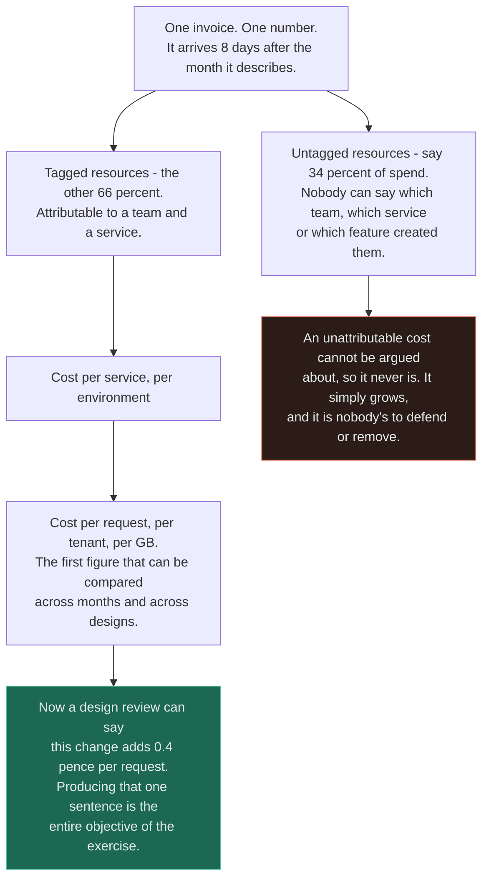
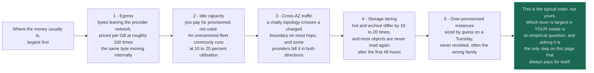
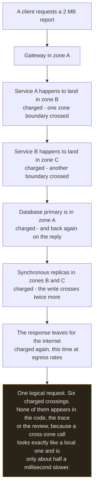
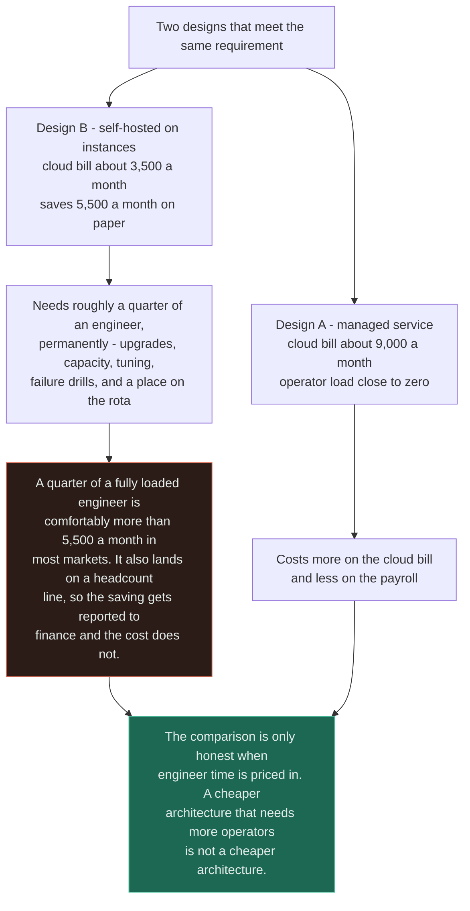

# Cost

`[INTERMEDIATE]` · Cost is an axis you trade against latency and availability at design time, not a
report finance sends you afterwards — and **the most expensive architecture is usually the one nobody
measured**, because a bill arrives as one number a month while an architecture is a thousand decisions
nobody priced.

---

## 1. One-line definition

The money an architecture consumes to serve its load — expressed per unit of business value rather
than per month, and treated as a design constraint in exactly the way a latency budget is.

## 2. Explain like I'm new

Two teams build the same feature. Both work. Both are fast. Both pass code review. One costs about
£900 a month to run and the other costs about £40,000, and nobody finds out for a year, because the
bill arrives as a single line called "cloud" and no part of it says which feature caused what.

The expensive team was not careless. The problem is that **almost nothing in a code review shows you
money.** A loop that makes one call per item looks the same whether that call stays inside a machine
or crosses to another availability zone at a charge per gigabyte. A service reading from a bucket in
another region looks identical to one reading locally. An instance provisioned for a peak that happens
twice a year looks like prudence for the other 363 days. Turning the log level up to debug looks like
diligence, right up until you are billed per gigabyte ingested.

So money is spent at design time and discovered months later, by somebody who was not in the room,
with no map back to the decisions that caused it. That gap — between where a cost is *created* and
where it is *observed* — is the entire subject. Closing it is a measurement problem long before it is
an optimisation problem, which is why the first move is never "turn something off".

## 3. Real-world analogy

A household electricity bill with no per-appliance metering. You know you spent £340 last month. You
do not know that £190 of it was the immersion heater. So you turn lights off, because lights are
visible and switching them off feels like action, while the real expense hums away in a cupboard.

**Where it breaks:** a house has perhaps thirty appliances and the set barely changes. Your estate has
thousands of resources, most created by automation, many by people who have left, and the set changes
daily. Worse, an appliance's cost is roughly proportional to something you can perceive — heat, light,
a spinning drum — whereas a byte crossing an availability zone boundary costs real money and produces
no observable effect whatsoever. And the analogy misses the direction that hurts most: the energy
company will not raise your bill because you wrote an inefficient loop. Your cloud provider will,
automatically, in real time, and the graph will be labelled elasticity.

## 4. Technical explanation

### Cost is a constraint, not a consequence

The [trade-off framework](../../TRADEOFF-FRAMEWORK.md) lists seven axes — latency, throughput,
consistency, availability, durability, cost, operability. Cost is the only one on that list that teams
routinely assume can be dealt with afterwards, and it is close to the worst candidate for deferral,
because the decisions that determine it are among the least reversible in the design: where the data
lives, how many copies exist, how chatty the topology is, and what failure the system is built to
survive.

**A cost problem discovered in production is an architecture problem with a twelve-month lead time on
the fix.** You cannot un-choose a region, un-replicate a dataset, or un-split a monolith in a sprint.

| Decision, at design time | What it looks like | What it actually costs |
|---|---|---|
| "Put the replica in another AZ for resilience" | Prudent | A cross-zone charge on every write, forever |
| "Serve images from the application" | One fewer component | Egress at retail rates, per byte, on every request |
| "Storage is cheap, keep it all hot" | Convenient | Ten to twenty times the archive price on data last read in 2022 |
| "Autoscale on CPU" | Elastic | A runaway loop is now billed as elasticity, at machine speed |
| "One instance per service per environment" | Tidy | Services multiplied by environments, of mostly idle capacity |
| "Multi-region, for availability" | Responsible | Roughly double, before the inter-region traffic |
| "Retry until it succeeds" | Reliable | A retry storm is a spend storm with a nicer name |
| "Log everything at debug in production" | Observable | Log ingest priced per gigabyte, and it is routinely a top-five line item |
| "We will self-host it, the licence is free" | Frugal | A permanent fraction of an engineer, which is not on the cloud bill |

Every row is a decision made in a design discussion by someone with no cost signal in front of them.
That is the failure this page exists to fix, and note that the fix is *information*, not restraint.

### Unit economics — the only durable way to talk about cost

Absolute spend is almost meaningless on its own. A bill that grew 40% in a quarter is good news if
traffic grew 60%, and it is an emergency if traffic was flat. **Total spend measures your success;
unit cost measures your architecture.**

| Unit | How | What it tells you | What corrupts it |
|---|---|---|---|
| **Cost per request** | Total attributable spend ÷ billable requests | Whether the architecture scales sub-linearly | Health checks and bots inflating the denominator |
| **Cost per tenant** | Attributed spend ÷ tenants | Whether your pricing works at all | The mean — see [multi-tenancy](../multi-tenancy/), where the top tenant is 100× the median |
| **Cost per GB stored per month** | Storage spend ÷ GB | Whether lifecycle policies are doing anything | Snapshots, backups and object versions, which frequently exceed live data |
| **Cost per GB served** | Egress spend ÷ GB out | Whether a CDN would pay for itself | Ignoring intra-cloud transfer, which is a separate and often larger number |
| **Cost per active user** | Total ÷ MAU | The number the business will actually use | Definition drift in "active" |
| **Infrastructure as a share of revenue** | Total ÷ revenue | Gross margin, which is what funds engineering | Nothing — this is the one the board reads |



The left branch is the one that decides whether any of this works. **Attribution is not reporting
hygiene, it is the precondition for the argument** — an unowned cost has no advocate for its removal
and no defender either, so it survives every review by never appearing in one.

Read unit cost as a trend, not a value. A unit cost that is **flat** as you grow means a linear
architecture with no economies of scale — every new customer costs what the last one did, which is a
viable business but not a leveraged one. A unit cost that **rises** as you grow means something
superlinear is in the design, usually a fan-out or a full scan whose work grows with the square of
something, and it will eventually be the whole bill. Only a **falling** unit cost means the
architecture is doing what shared infrastructure is supposed to do.

### The big levers, in order



| # | Lever | Why it is big | The fix | What the fix costs |
|---|---|---|---|---|
| 1 | **Egress** | Bytes leaving the provider's network are priced per GB at roughly two orders of magnitude more than the same byte moving internally, and nothing in your code marks the boundary | A CDN in front of anything static or repeatedly requested; compression; smaller payloads; move compute to the data rather than data to the compute | A CDN, its cache invalidation, and a new component in the path |
| 2 | **Idle capacity** | You are billed for provisioned capacity, not used capacity. Non-production is the extreme case — an environment running 168 hours a week and used for 45 | Autoscale with a floor set from real minimum load; scheduled shutdown of non-production; consolidation; spot or preemptible for interruptible work | Autoscaling has a warm-up lag, and spot means engineering for interruption |
| 3 | **Cross-AZ traffic** | Multi-AZ is an availability decision that creates a per-byte charge on the request path. A mesh with eight hops crosses a boundary on most of them | Zone-aware routing so a request stays in one zone; replicate state across zones rather than traffic; batch chatty calls | Zone affinity slightly reduces load-balancing quality, and it is real work to configure |
| 4 | **Storage tiering** | Hot and archive tiers differ by ten to twenty times, and the access pattern of most data is a sharp decay: written once, read within two days, never read again | Lifecycle policies from day one; measure retrieval rates by object age; audit snapshots and versions | Retrieval fees and minimum-duration charges mean a badly chosen policy costs **more** than no policy |
| 5 | **Over-provisioned instances** | The instance size was picked from a menu once and never revisited, often in the wrong family — paying for memory on a CPU-bound service. Databases are usually the largest single line and the least examined, because resizing them is frightening | Right-size from measured p95 utilisation, not from peak; match the family to the bottleneck; commit only the steady floor | Right-sizing removes headroom, so it must be done against a measured peak and not a comfortable one |

Two caveats that keep this list honest. The order above is typical, not universal — **the first
useful action is always to measure your own five, because an estate with heavy media serving and one
with heavy batch compute have completely different top lines.** And committed-use discounts interact
badly with lever 2: reservations make idle capacity *cheaper*, which makes it harder to notice, so
buying commitments before right-sizing locks in the waste for three years.

### The same byte, charged more than once



The important word in the last box is *looks*. **Cross-zone cost is invisible in every tool an
engineer uses day to day** — it does not appear in a flame graph, it barely moves a latency
percentile, and it has no error rate. It appears only in a monthly aggregate under a name like "data
transfer", which is why it is routinely the largest line item nobody can explain.

Note also that most of those crossings were *bought deliberately*. Spreading replicas across zones is
what buys you survival of a zone failure. So the decision is not "eliminate cross-AZ traffic", it is
**availability versus cost, priced** — and the waste is only the crossings that buy you nothing, such
as a request path that ping-pongs between zones on every hop for no reason but scheduler placement.

### Multi-region roughly doubles the cost

| Component | What happens under two regions |
|---|---|
| Compute | 2×, and worse if each region must absorb full load during a failover — that is 2× capacity running at 50% utilisation, which is the price of being able to lose one |
| Storage | 2×, plus the replication traffic itself, which is billed as inter-region transfer |
| Data transfer | An entirely new line item that did not previously exist, proportional to write volume |
| Operations | Two of everything to deploy, patch, monitor and reason about; every incident has a "which region" question |
| Engineering | Every feature now carries a multi-region design question, permanently. This is the largest of the five and the only one not on the bill |

**Multi-region is the most expensive availability decision available to you, and it is frequently
bought to solve a problem that multi-AZ already solved.** Before approving it, ask which failure it
protects against. Whole-region failures are rare. The common causes of extended downtime — a bad
deploy, a schema migration, a configuration change, an expired certificate — replicate to the second
region at the speed of your CI pipeline, so a second region buys nothing against any of them.

| Disaster recovery posture | Recovery time | Cost multiple | Honest description |
|---|---|---|---|
| Backups only | Hours to days | ~1.02× | Correct for a great many systems, and it needs a *tested* restore |
| Pilot light | Tens of minutes | ~1.15× | Data replicated, compute scaled to nearly zero until needed |
| Warm standby | Minutes | ~1.4× | Reduced-capacity second region, scaled up on failover |
| Active-passive, full size | A minute or two | ~2× | Everything duplicated and idle |
| Active-active | Seconds | 2× or more, plus consistency engineering | Also the only posture that gives you regional latency, which is often the real motive |

The ladder is the useful part: **the interesting choices are the middle rows, and the argument is
usually conducted as if only the top and bottom existed.** See
[availability](../../00-foundations/availability/) for what each recovery time is actually worth.

### Engineer time is cost



This is the step the [trade-off framework](../../TRADEOFF-FRAMEWORK.md) calls operational capacity,
priced. A small team is a larger line item than most cloud bills at mid scale, so **the premium on a
managed service is frequently the cheapest thing you will buy all year** — and the corollary is that
the architecture with the lowest infrastructure bill is often the one with the most moving parts,
which is the same architecture with the highest total cost.

Three consequences worth stating:

- **Count the rota, not just the hours.** A component that adds a person to on-call has a cost in
  attrition and in hiring that never appears in any comparison, and a rota you cannot staff is a
  reliability problem wearing a budget disguise.
- **The saving must survive the second year.** Self-hosting saves money while the person who set it up
  is still there and the version is still current. Price the upgrade you will do in eighteen months.
- **This cuts both ways.** A managed service you are barely using, bought to avoid an afternoon's
  work, is the same mistake in the other direction.

## 5. Engineering at scale

**Enforce tagging at creation, never by cleanup.** An untagged resource is an unattributable cost, and
retrospective tagging campaigns fail — the person who created it has left, and nobody will claim a
line item. Make the tag mandatory in the provisioning policy so an untagged resource cannot exist, and
publish the **unallocated percentage** as a data-quality metric with a target. If a third of spend is
unallocated, no cost conversation you have is real.

**Showback before chargeback.** Showback tells each team what they spend; chargeback moves the money
into their budget. Showback changes behaviour at a fraction of the political cost, because the moment
a number has a team's name on it somebody wants it smaller. Chargeback is worth reaching for later,
once the attribution data is trusted — and it will be contested the day it starts affecting budgets,
so it must be trustworthy first.

**Shared costs need a published, simple allocation rule.** The load balancer, the cluster control
plane, the observability stack and the security tooling serve everyone. Allocate them by a single
obvious proxy — request share, or headcount, or an even split — and publish the rule. A perfect
allocation model will never ship, and an unallocated shared pool grows until it is the only thing
left.

**Detect anomalies daily, because the billing cycle is monthly.** If the only signal is the invoice,
the worst-case detection time for a runaway resource is over a month, and the second-worst is the day
the budget alert fires at 100%. Daily spend by tag, with a day-over-day anomaly alert, turns a
five-figure surprise into a Tuesday morning question.

**Put a cost estimate in the pull request.** Infrastructure changes are reviewed by people who can see
the diff and not the price. A cost diff on infrastructure-as-code pull requests moves the conversation
back to the moment the decision is made, which is the entire theme of this page.

**Budget the observability stack explicitly.** It is commonly 10–30% of the infrastructure bill, it
grows with the thing it watches rather than with revenue, and a single debug log left on can double
it — see [observability](../../11-observability/), where sampling and retention are described as
correctness decisions and are equally cost decisions.

**Data gravity is an exit fee you agree to at the beginning.** The cost of moving a large dataset out
of a provider is paid at egress rates on the whole dataset, so a storage decision made in year one
constrains the negotiation in year four. It is worth knowing the number even if you never intend to
move.

**Commitments trade flexibility for price, and that trade is architectural.** A three-year commitment
on a particular instance family is a bet that the architecture will not change, priced. Commit only to
the floor you are confident about, and right-size before you commit rather than afterwards.

## 6. The problem it solves

Making the money an architecture consumes visible at the point and in the moment the decisions are
made, so that cost can be stated in the same sentence as latency and availability rather than
discovered a year later by someone who cannot change it.

## 7. The problem it does NOT solve

**Measuring cost does not tell you what to build.** A cheap system nobody wants has a perfect unit
cost and no value, and cost optimisation applied to the wrong product just reaches the wrong
destination more efficiently.

It also does not give you:

- **A substitute for capacity planning.** Knowing what you spend is not knowing what you will need —
  that is [estimation](../../ESTIMATION-GUIDE.md), and it runs in the other direction.
- **Efficiency.** A perfectly efficient service running continuously in the wrong storage tier is
  still expensive. The two words are not synonyms and conflating them sends teams to optimise code
  when the answer is a lifecycle policy.
- **Judgement about what should exist.** Attribution finds the expensive parts. It has no opinion on
  whether an expensive part is worth it, and the most common outcome of good cost data is discovering
  that your most expensive component is also your most valuable one.
- **The costs that are not on the bill.** Engineer time, opportunity cost, and the cost of an outage
  are all real and none of them appear in any cloud console.
- **Safety.** Cost optimisation has a floor and a genuine failure mode: a 40% saving that removed a
  replica is a bad trade you discover exactly once. **Never optimise away redundancy, backups, or
  headroom you have not measured.**

---

## 9. How it works

Cost management is a loop, and it fails at whichever stage is skipped — which, in practice, is
always stage 2 or stage 7.

| # | Stage | What it means | The failure if skipped |
|---|---|---|---|
| 1 | **Measure** | Daily spend, by service and by resource | Monthly granularity means a month of detection latency |
| 2 | **Attribute** | Tag at creation; allocate shared costs by a published rule | An unowned cost is never argued about, so it never shrinks |
| 3 | **Normalise** | Divide by a business unit — requests, tenants, GB | Absolute spend confuses growth with waste |
| 4 | **Rank** | Sort the levers by size, and look at the top three only | Effort spent on visible, small items while the large one hums away |
| 5 | **Change one thing** | Make a single change with a predicted saving | Five simultaneous changes attribute to nothing |
| 6 | **Verify** | Compare the realised saving to the prediction | Optimisations that did not work stay in the architecture as complexity |
| 7 | **Guard** | An anomaly alert and a unit-cost SLO, so the win does not decay | Every saving erodes within two quarters without a guard |

**Stage 3 is the one that turns cost work from a cleanup exercise into an engineering discipline**,
because it is the only stage that produces a number you can put in a design review. "This design adds
0.4 pence per request" is a sentence an architect can act on; "the bill went up" is not.

## 13. When to use it

Treat cost as a first-class design constraint when any of these hold:

- The infrastructure bill is a **meaningful share of revenue** or of the engineering budget — for most
  software businesses that threshold sits somewhere in the single-digit percentages of revenue.
- **Unit cost is rising** with scale, which means something in the design is superlinear and will
  eventually dominate.
- A decision on the table is **hard to reverse**: region topology, multi-region, storage engine,
  self-hosting versus managed, or a multi-year commitment.
- You are about to **price a product**, especially a per-seat or per-tenant one, where cost per tenant
  is the input to whether the business works — see [multi-tenancy](../multi-tenancy/).
- The bill contains a line item **nobody can explain**, which is a measurement gap rather than a
  spending problem and will not fix itself.
- You are choosing between an **always-on and an on-demand** shape — a streaming cluster versus a
  scheduled job, for instance, which is exactly the choice in
  [batch versus stream](../batch-vs-stream/).

## 14. When NOT to

- **Do not optimise cost before product-market fit.** Engineer attention is the scarce resource at that
  stage, and a £2,000 monthly bill that buys a week of engineering time is a bargain.
- **Do not micro-optimise below the noise floor.** A change saving £200 a month that costs two
  engineer-days a year to maintain is net negative, and it consumes the credibility you will need for
  the change that matters.
- **Do not optimise before you measure.** Without attribution you will optimise the item you can see,
  which is systematically not the largest one — the visible costs are compute and storage, and the
  large one is frequently transfer.
- **Do not trade away redundancy, backups or tested restores.** These are the cheapest insurance in the
  estate and the most tempting line items on a spreadsheet.
- **Do not build a bespoke cost platform.** The provider's own tooling plus consistent tags covers most
  of it, and a homegrown FinOps system is itself a cost with an operator.
- **Do not let a cost target become a de facto availability target.** "Reduce spend 30%" with no
  reliability constraint attached is an instruction to remove headroom, and someone will follow it.

## 17. Trade-offs

| Choose | Get | Pay |
|---|---|---|
| Managed services | Near-zero operator load; someone else on call for the platform | A visible premium on the bill, and less control over tuning and versions |
| Self-hosting | A lower cloud bill and full control | A permanent fraction of an engineer, an upgrade path, and a rota slot |
| Reserved or committed capacity | 30–60% off the steady floor | A multi-year bet that the architecture will not change |
| Spot or preemptible capacity | Very large discounts on interruptible work | Engineering for interruption, and capacity that can vanish mid-job |
| Aggressive autoscaling | You pay close to what you use | Cold-start latency, and a runaway loop billed at machine speed |
| Generous static provisioning | Predictable latency and predictable spend | Utilisation in the low tens of per cent, paid every hour |
| Multi-region active-active | Regional failure tolerance and regional latency | Roughly double, plus consistency engineering and a permanent design tax |
| Backups plus a tested restore | Almost all of the protection for a rounding error of the cost | Hours of recovery time, which for many systems is genuinely acceptable |
| Aggressive storage tiering | Ten to twenty times cheaper on cold data | Retrieval fees and minimum durations, which punish a wrong guess |
| A CDN | Egress at a fraction of origin rates, and lower latency | Cache invalidation, a component in the path, and a second thing to configure |
| Detailed per-tenant cost attribution | Pricing that reflects reality; the noisy tenant is nameable | Cardinality, a tagging discipline, and an allocation rule for shared costs |
| Ignoring cost until it hurts | Nothing today | An architecture problem with a twelve-month lead time on the fix |

## 18. Why not?

| Alternative | Why not here | When it WOULD win |
|---|---|---|
| **Do nothing; the bill is small** | It stops being small suddenly, and by then the causes are structural | **Early stage, pre-product-market-fit.** Genuinely correct, and it should be a decision rather than an oversight |
| The provider's cost explorer alone | Shows spend by service, not by feature or tenant, so it cannot answer "why" | **The right starting point for nearly everyone.** Exhaust it before buying anything |
| A third-party FinOps platform | Another vendor, another integration, and it cannot fix untagged resources | Large, multi-account, multi-cloud estates where the reconciliation itself is the work |
| A dedicated FinOps team | Separates the people who see the cost from the people who cause it | Beyond a certain scale, as a centre of expertise — but the engineers must still see their own numbers |
| Chargeback from day one | Contested the moment budgets move, and it fails if the data is not trusted | After showback has established that the attribution is accurate |
| Hard budget caps in production | An automated cap that throttles or stops production is an availability incident you scheduled | **Non-production, always.** Caps there are pure upside |
| Move off the cloud entirely | Very large capital and operational commitment, and hardware is the smallest part of the change | Stable, predictable, high-volume workloads at large scale — a real answer, and a rare one |
| Serverless everywhere | Excellent per-request economics until utilisation is steady, at which point it inverts | Spiky, low-duty-cycle workloads, and anything whose baseline load is close to zero |
| Buy commitments now to show a saving | Locks in whatever waste already exists, for years | After right-sizing, and only for the floor you are certain about |

The second row deserves emphasis. **Most organisations have not yet extracted the value in the tooling
they already pay nothing extra for**, and buying a platform before establishing tags produces a
prettier view of the same unattributable spend.

## 19. Failure scenarios

| Failure | What happens | Mitigation |
|---|---|---|
| **A runaway loop meets autoscaling** | Spend climbs at machine speed with no error, no alert, and no user impact. Discovered on the invoice | Daily anomaly detection on spend by tag; concurrency ceilings on autoscaling groups; a maximum, not just a minimum |
| **Retry storm** | A downstream failure multiplies requests, and each retry is billed. The bill spikes on the same day as the incident | Bounded retries with exponential backoff and jitter; a circuit breaker; a budget on retries |
| Debug logging left on in production | Log ingest is priced per gigabyte and can double the observability bill overnight | Log level as a runtime setting with an expiry; per-service ingest budgets |
| Cross-region replication misconfigured | An inter-region transfer charge appears with no functional symptom at all | Alert on transfer volume as a metric in its own right, not only on spend |
| Archive lifecycle set too aggressively | Retrieval fees and minimum-duration charges exceed the storage saved | Measure access rate by object age before writing the policy; model the retrieval cost |
| Commitments bought before right-sizing | Three years of the current waste, locked in and non-refundable | Right-size first, commit to the measured floor only |
| Cost cutting removes a replica | The saving is real and so is the outage six weeks later | Never trade redundancy without an explicit availability decision and a named owner |
| Untagged resources grow | The unallocated bucket becomes the largest line and nobody owns it | Mandatory tags at creation, enforced by policy; unallocated share as a tracked metric |
| A resource is deleted during a clean-up | It turned out another team depended on it | A deprecation window with alerting on access before deletion |
| Free tier or trial credit expires | Spend jumps overnight with no change to the system | Track the expiry date as a scheduled event, not as a surprise |
| Data gravity at renegotiation | Leaving costs egress on the entire dataset, so the negotiation was already lost | Know the exit number; keep a copy of genuinely critical data elsewhere |
| **Slow, not down** | Unit cost rises 3% a month for two years. Nothing ever looks wrong on any single day, and the architecture is now unaffordable | Unit cost as a tracked metric with a target, reviewed monthly. It is the only signal that catches a gradient |

---

## 25. Without it → With it → New problem → Next

```
Without it   →  money is spent at design time and discovered a year later by somebody
                who was not in the room, with no map from the bill back to the decisions
                that caused it, so the only available response is to cut something visible
With it      →  cost is a number in the design review, expressed per request and per
                tenant, and an architecture can be compared against an alternative before
                either one is built
New problem  →  attribution requires tagging discipline, an allocation rule for shared
                costs, and per-tenant cardinality you must bound; and a cost target with
                no reliability constraint attached is an instruction to remove headroom
Next         →  enforced tags at creation, unit-cost metrics with targets, daily anomaly
                detection rather than a monthly invoice, cost diffs on infrastructure
                pull requests, and an availability floor that optimisation may not cross
```

The chain here is unusual in that the new problem is organisational rather than technical: making cost
visible creates an incentive, and an incentive with no counterweight optimises away the thing you
forgot to measure. See [the chain](../../SYSTEM-DESIGN-THINKING.md#part-1--the-chain).

## 28. Common mistakes

| Mistake | Why it is wrong |
|---|---|
| Treating cost as finance's problem | The decisions are made in design reviews; finance sees the consequence months later |
| Reporting total spend without a denominator | A bill that grew 40% while traffic grew 60% is good news reported as bad |
| Optimising before attributing | You optimise the visible item, which is systematically not the largest one |
| Assuming compute is the biggest line | Transfer and storage frequently beat it, and neither shows up in a profiler |
| Ignoring cross-AZ traffic | Invisible in every engineering tool, and often the largest unexplained line item |
| Buying reservations before right-sizing | Locks in today's waste for three years at a discount |
| Multi-region for a problem multi-AZ already solves | Roughly doubles cost and does nothing against bad deploys, which cause most downtime |
| Comparing architectures without pricing engineer time | The cheapest bill often belongs to the most expensive system |
| Hard budget caps on production | An automated availability incident, scheduled in advance |
| Cutting redundancy to hit a cost target | The saving is real, immediate and small; the outage is real, later and large |
| No lifecycle policy on object storage | Data written once and never read again, billed at hot-tier rates indefinitely |
| Forgetting snapshots, backups and object versions | Frequently larger than the live dataset, and never on anyone's dashboard |
| Monthly-only cost review | Worst-case detection time for a runaway resource is over a month |
| Letting the unallocated bucket grow | An unowned cost has no advocate for its removal and never enters a review |
| One-off optimisation with no guard | Every saving erodes within two quarters unless something watches it |

## 29. Monitoring

**Unit cost is the headline metric and everything else is diagnostic.** Cost per request, per tenant
and per GB served, tracked as a trend with a target, is the only signal that distinguishes growth from
waste — and the only one that catches the slowest and most damaging failure on this page, which is a
unit cost drifting upward by a few per cent a month for two years while every individual day looks
normal.

Underneath it: **daily** spend by service and by tag, never monthly, because the billing cycle sets
your worst-case detection time; a day-over-day **anomaly alert** per tag, which is what catches a
runaway resource in hours; **unallocated share** as a data-quality metric with a target, since every
cost conversation is only as real as the attribution behind it; forecast against budget, as a ticket
rather than a page; and **utilisation** as the saturation signal — CPU, memory and connection-pool
utilisation are simultaneously the capacity signal from
[observability](../../11-observability/) and the direct measure of lever 2.

Three volume metrics deserve to be first-class rather than derived from the bill, because each is
invisible everywhere else: **egress GB**, **cross-AZ GB**, and **storage GB by tier and by object
age**. Each has a spend consequence with no latency or error consequence, which means no conventional
signal will ever show you a regression in them.

## 31. Exercises

**1.** The quarterly infrastructure bill is up 40%. The CFO wants an explanation and a plan. Requests
over the same period are up 60% and monthly active users are up 55%. Is there a cost problem?

<details><summary>Answer</summary>

**No** — and saying so clearly, with the arithmetic, is the correct response.

Unit cost fell. Spend rose by a factor of about 1.4 while requests rose by about 1.6, so cost per
request is roughly 1.4 ÷ 1.6, or around 88% of what it was. The architecture became more efficient per
unit of work, most likely through better amortisation of fixed costs across higher volume, which is
exactly what shared infrastructure is supposed to do. Total spend measures the company's success; unit
cost measures the architecture, and only the second one was ever the engineering question.

Two things are still worth doing. Present the unit-cost trend rather than the total, because the total
will keep rising with growth and this conversation will otherwise recur every quarter with the same
answer. And check whether the *rate of decline* is flattening: a unit cost that fell 20% last year and
2% this year is an early signal that something in the design has stopped amortising and is heading for
linear or superlinear.

The failure mode this question is really about is responding to the 40% by cutting something. A cut
made under that framing lands wherever it is easiest to cut, which is generally headroom or
redundancy — and that is a genuinely bad trade made in response to a metric that was never a problem.
</details>

**2.** The largest single line on the bill is a category called "data transfer" at 31% of the total.
Nobody on the team can account for it. Where does it come from, and how do you find out?

<details><summary>Answer</summary>

Almost certainly a mixture of internet egress and cross-availability-zone traffic, and the reason
nobody can account for it is structural rather than negligent: **transfer cost is invisible in every
tool an engineer uses.** It does not appear in a profiler, it does not move a latency percentile
enough to notice — a cross-zone hop costs perhaps half a millisecond — and it produces no errors. It
exists only in a monthly aggregate.

The three usual sources, in rough order of likelihood. Cross-AZ chatter, where services are spread
across zones for availability and the request path crosses a charged boundary on most hops, multiplied
by the number of hops in the topology. Internet egress, where anything large and repeatedly requested
— images, exports, API responses — is served directly from origin rather than a CDN. And inter-region
replication, which is easy to configure and produces no functional symptom at all.

To find out: enable flow logs or the provider's per-resource transfer breakdown for a representative
day, and split the volume by source and destination zone and by whether the destination is internal or
the internet. That single report usually resolves it, because the distribution is heavily skewed and
one or two paths will dominate.

The fixes differ per source and so do the trade-offs. A CDN in front of egress is close to free money.
Zone-aware routing keeps a request inside one zone and costs a little load-balancing quality. But
notice that **most cross-AZ traffic was deliberately bought**: replicas spread across zones are what
survive a zone failure. The waste is only the crossings that buy nothing — a request ping-ponging
between zones because of scheduler placement — so the conversation is availability against cost,
priced, not elimination.
</details>

**3.** A team proposes replacing a managed database costing £9,000 a month with a self-hosted cluster
on instances costing £3,500. The design is credible and they have run it in staging. Do you approve
it?

<details><summary>Answer</summary>

Not on the numbers presented, because the comparison is missing its largest term.

The £5,500 monthly difference has to cover the engineer time to run it: version upgrades, capacity
management, backup verification, failover testing, performance tuning, and a place in the on-call
rotation for a stateful system where the failure modes are the worst ones available. A conservative
estimate of a quarter of an engineer is, in most markets, comfortably more than £5,500 a month fully
loaded. The proposal is plausibly cost-neutral at best and quite likely negative.

There is an accounting asymmetry that makes this seductive and is worth naming out loud: the £5,500 is
a cloud line item that gets reported as a saving, while the engineer time is a headcount line that
nobody attributes to this decision. The saving is visible and the cost is not, which is why this
proposal recurs.

The questions that decide it: who runs it at 03:00, and are they already on a rota or is this a new
one? What is the plan for the major version upgrade in eighteen months, and has anyone priced it? Does
staging include a tested restore and a tested failover, or only a working cluster? And what happens
when the person who built it leaves?

Where the answer flips to yes: when the scale is large enough that the managed premium is tens of
thousands a month rather than five; when the team already operates several of these and the marginal
operational cost is genuinely near zero; when a specific capability the managed service does not offer
is actually needed; or when a compliance requirement forces it. Note that the first of those is a
function of scale, so a proposal that is wrong today can be right in two years — which is worth
recording rather than simply refusing.
</details>

**4.** A cost-reduction target of 30% has been set. The largest single saving available, at 22%, is to
run in one availability zone instead of three. What do you say?

<details><summary>Answer</summary>

That this is not a cost decision at all, and it must not be made by whoever owns the cost target.

Running across three zones is what buys survival of a zone failure — a real and periodic event at
every major provider. Collapsing to one converts a degraded-but-serving event into a total outage, and
it does so silently: nothing changes on any normal day, so the decision looks free until the day it
does not. That is the defining shape of a bad reliability trade, and it is exactly why a cost target
with no availability constraint attached is an instruction to remove headroom.

The right move is to price the availability rather than refuse the conversation. What is an hour of
total downtime worth, in revenue, in contractual penalties, and in customer trust? How often does a
zone actually fail? Multiply and compare to the 22%. Sometimes — an internal tool, a system with a
batch-shaped business, a product where a few hours of downtime is genuinely survivable — the
arithmetic says single-zone is correct, and that is a legitimate engineering answer arrived at
legitimately. What is not legitimate is arriving at it because someone needed 30%.

Then go and find the 30% where it actually lives, which is almost never in redundancy. Look for
cross-AZ traffic that buys nothing because the request path ping-pongs between zones on every hop —
zone-aware routing keeps the availability and removes much of the charge. Look at utilisation, which
in an unexamined fleet is commonly 10 to 20%. Look at non-production environments running 168 hours a
week for 45 hours of use. Look at storage with no lifecycle policy, and at snapshot and version
sprawl. Those four regularly total more than 30% and none of them costs you an outage.
</details>

**5.** An executive asks for multi-region deployment because "we need four nines". What do you ask
before agreeing, and what will it cost?

<details><summary>Answer</summary>

Ask what failure this is protecting against, because four nines — about 52 minutes of downtime a year
— is a statement about total unavailability, and multi-region addresses only one narrow cause of it.

The load-bearing question: what has actually caused your downtime? For nearly every organisation the
answer is bad deploys, configuration changes, schema migrations, expired certificates and dependency
failures — and **every one of those replicates to a second region at the speed of your CI pipeline.**
A second region buys nothing against any of them. Whole-region failures, which it does address, are
rare. So it is entirely possible to spend double and move the availability number in the wrong
direction, because you have doubled the operational surface that produces most of your incidents.

Then ask what recovery time is genuinely acceptable, because the interesting options are the middle of
the ladder and the discussion is usually conducted as though only the extremes existed. Backups with a
tested restore cost almost nothing and give hours. Pilot light gives tens of minutes for around 15%
more. Warm standby gives minutes for around 40% more. Active-passive at full size is roughly double.
Active-active is double plus a permanent consistency and data-residency engineering tax — and it is
also the only option that gives you *regional latency*, which in my experience is the real motive
about half the time and is a much easier conversation to have honestly.

Finally, ask whether the dependencies can hold four nines. Availability chains multiply — see
[availability](../../00-foundations/availability/) — so a design with a third-party payment provider
at three nines somewhere in the critical path cannot reach four nines no matter how many regions you
run.

The likely honest outcome: the reliability gap is in deployment practice, testing and dependency
management, all of which are far cheaper than a second region and none of which sound as decisive in
a board meeting.
</details>

## 33. Related

- [Scalability section index](../README.md) — the other constraints that arrive at the same size
- [Multi-tenancy](../multi-tenancy/) — cost per tenant, and why the mean tenant does not exist
- [Batch vs stream](../batch-vs-stream/) — a cluster that never stops against a job that runs for twenty minutes
- [Trade-off framework](../../TRADEOFF-FRAMEWORK.md) — cost as one of seven axes, and operational capacity as another
- [Estimation guide](../../ESTIMATION-GUIDE.md) — the arithmetic that turns a design into a number of machines
- [Availability](../../00-foundations/availability/) — what each recovery time is worth, and why chains multiply
- [Scalability](../../00-foundations/scalability/) — whether unit cost falls with size, which is the whole question
- [Caching](../../04-caching/fundamentals/) — the cheapest request is the one that never reaches origin
- [Replication](../../05-databases/replication/) — every copy is a storage line and a transfer line
- [Monolith vs microservices](../../02-architecture/monolith-vs-microservices/) — a network hop between modules is a charged hop
- [Observability](../../11-observability/) — 10 to 30 per cent of the bill, and the tool you find the rest with
- [Glossary](../../GLOSSARY.md) · [System design thinking](../../SYSTEM-DESIGN-THINKING.md)
