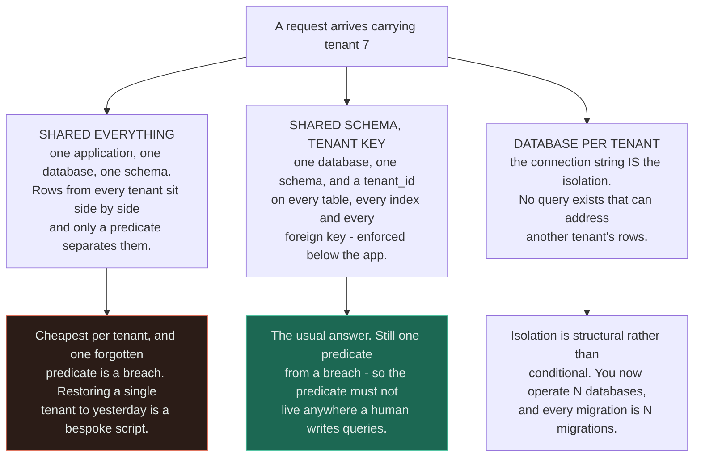
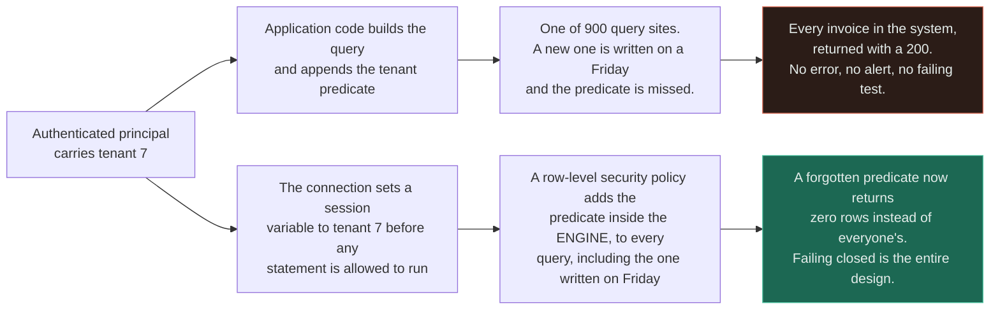
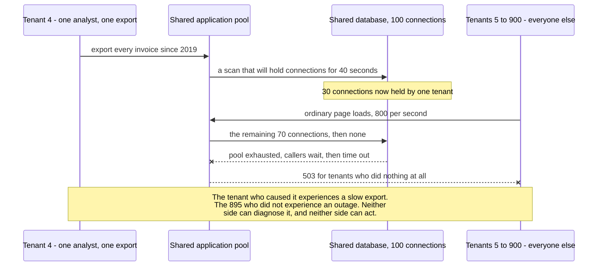
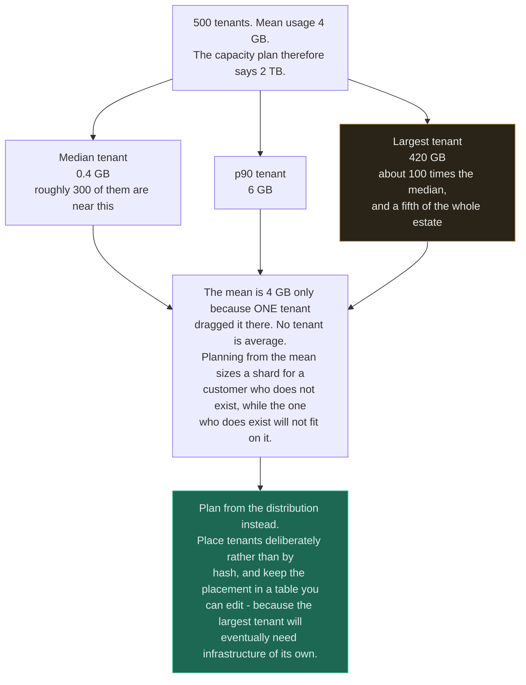

# Multi-Tenancy

`[ADVANCED]` · Isolation is never a yes-or-no property, only a question of *which layer* enforces it —
and **the tenant identifier has to be enforced at a layer the application cannot forget**, because a
single missing `WHERE` clause is not a bug, it is a cross-tenant data breach with a `200` status code.

---

## 1. One-line definition

Serving many independent customers from one deployment, such that no tenant can see, corrupt, or
degrade another — while sharing enough infrastructure to make the unit cost work.

## 2. Explain like I'm new

You have built an invoicing product. Two customers sign up, then two hundred. You do not want two
hundred copies of the application to deploy, patch and monitor, so all of them share one — and now
every row in your database belongs to somebody, and every query has to say *whose*.

That sounds like a small change: add a `customer_id` column, and remember to filter on it. It is
small right up to the moment somebody forgets, and then it is the worst kind of failure your product
can have. Not a crash — a crash is loud and someone gets paged. This one returns a perfectly valid
page of results, at normal speed, containing another company's invoices. Every test passes, because
tests run as one customer at a time and a query with no filter returns that customer's rows plus
everyone else's, which looks correct if you only check that yours are present.

There is a second, quieter problem. Everyone shares the same machines, so a customer who runs an
enormous report at nine on a Tuesday morning uses up the shared capacity, and two hundred other
companies get a slow application for four minutes. None of them did anything. None of them can see
why. And your monitoring, which averages across all tenants, shows a small bump.

**Multi-tenancy is those two problems.** Everything else on this page is a way of choosing where to
pay for solving them.

## 3. Real-world analogy

An office block. Tenants share the lifts, the electricity supply, the loading bay and the security
desk, which is the only reason the rent is affordable. Each has their own lockable floor. The
building manager decides how much is shared and how much is partitioned, and that decision is the
whole business model.

**Where it breaks:** a locked door is physical, and the lock does not depend on the person walking
past remembering to check the nameplate. Your tenant boundary is a predicate in a query written by
someone at 17:45 on a Friday, and it is *conditional* rather than structural unless you deliberately
make it otherwise. The analogy also flatters the failure modes: an office tenant who overloads the
lifts is visible in the lobby, whereas a tenant who exhausts your connection pool is visible only as
a latency graph that nobody has broken down per tenant. And no office block has the problem that
matters most here — one tenant occupying more floor space than the other four hundred combined, while
the lease was priced on the average.

## 4. Technical explanation

### The three isolation models

Every multi-tenant system is one of these three, or a documented mixture of them. The choice is made
early and is expensive to reverse, because it determines the shape of every query, every migration
and every backup you will ever run.



Read the difference between the two green-and-red boxes carefully: **M1 and M2 have the same failure
mode and differ only in whether anyone has done anything about it.** M2 is not "M1 with a column" — it
is M1 plus the machinery that makes the column impossible to skip, and a team that adds the column
without the machinery has chosen M1 while believing they chose M2.

| | **Shared everything** | **Shared schema, tenant key** | **Database per tenant** |
|---|---|---|---|
| Separation mechanism | A predicate somebody remembers | A predicate the engine adds | The connection string |
| Blast radius of a code bug | Every tenant | Every tenant | One tenant |
| Cost per tenant | Lowest | Low | A fixed floor per tenant — connections, storage overhead, backups |
| Tenants per node | Thousands | Thousands | Tens to hundreds, limited by connections and file handles |
| Onboarding a tenant | An insert | An insert | Provisioning, migrating and monitoring a database |
| Offboarding, and erasure requests | A delete across every table, and prove it | Same, with the key to find them by | Drop the database. **Trivially provable** |
| Restore one tenant to yesterday | Bespoke extraction from a full backup | Same | A restore. It is the ordinary operation |
| Schema migration | One migration | One migration | N migrations, and partially applied is normal |
| Per-tenant customisation | None realistically | Limited, via configuration | Possible, and it becomes a support burden |
| Noisy neighbour | Fully exposed | Fully exposed unless quotas exist | Contained at the database, still shared at the application |
| Data residency per tenant | Impossible | Impossible without partitioning by region | Natural — place the database where the law requires |
| Cross-tenant analytics | Trivial, one query | Trivial, one query | Hard — needs a separate aggregation pipeline |
| Right for | Nothing, on reflection | **Most SaaS, most of the time** | Enterprise contracts, regulated data, or a handful of very large tenants |

Two rows decide most real arguments. **Migration fan-out** kills database-per-tenant at scale: 6,000
tenants means 6,000 migrations, of which some will fail on a lock timeout, so the application must
tolerate two schema shapes simultaneously — exactly the state described in
[schema migration](../../05-databases/schema-migration/), except permanent. And **erasure** kills
shared schema for regulated data: "delete everything belonging to this customer and prove it" is a
one-line operation in one model and an audit project in the other.

The common mature answer is a **hybrid**: shared schema by default, with the largest or most regulated
tenants promoted onto dedicated infrastructure. That requires tenant placement to be *data in a table*
rather than a hash function, which is a decision worth making on day one because retrofitting it is
painful.

### Where the tenant identifier is enforced

This is the most important paragraph on the page. **A tenant predicate that lives in application code
is a predicate that will eventually be omitted**, because it depends on every engineer, on every code
path, forever, including the paths added under deadline pressure and the ones generated by an ORM.



The two paths differ in one property: what happens when someone forgets. The upper path fails **open**
and returns more data than it should; the lower path fails **closed** and returns less. Both are bugs,
but only one of them is a notifiable incident, and the choice between them is architectural rather
than cultural — no amount of code review reliably catches an absence.

Ordered from weakest to strongest, the enforcement points are:

| Layer | Mechanism | Why it is stronger than the one above |
|---|---|---|
| Convention | "Always filter by tenant" in the wiki | It is not a mechanism |
| Code review | A human checks each query | Catches most, and the failure rate is nonzero and unbounded in time |
| Repository or ORM interceptor | A hook refuses to build a query with no tenant predicate | Applies to code nobody reviewed — but raw SQL and reporting tools bypass it |
| **Row-level security in the database** | Session variable plus a policy on every table | The engine adds the predicate. Raw SQL, an ad-hoc console and a reporting tool all get it |
| **Tenant in the primary key** | `PRIMARY KEY (tenant_id, id)`, and every foreign key carries it too | A cross-tenant join becomes structurally impossible rather than merely unlikely |
| Separate database or schema per tenant | The connection cannot see other tenants' rows | There is nothing to forget |

Two rules that sit alongside all of them. **Derive the tenant from the authenticated principal, never
from a request parameter.** A `tenant_id` in a query string or a JSON body is not an identifier, it is
an attack — it is the same broken-object-level-authorisation failure described in
[API security](../../12-security/api-security/), with a larger blast radius because it crosses an
organisational boundary rather than a user one.

And **the tenant identifier belongs in every cache key.** A cross-tenant leak does not require the
database to be involved at all: a cache keyed on `invoice:8842` with no tenant prefix will serve
tenant 4's invoice to tenant 9 the moment two tenants' identifier spaces overlap. This is a
particularly nasty failure because it is intermittent, it depends on eviction order, and it leaves no
trace in the query log.

### The noisy neighbour

The defining failure of multi-tenancy, and the one that has no clean solution — only a set of places
to spend money.



Read off the asymmetry: **the cost of the behaviour lands almost entirely on people who did not choose
it, and it is invisible to everyone involved.** That is what makes it different from ordinary
overload. A capacity problem is everyone's problem and shows up in aggregate metrics; a noisy
neighbour is one tenant's problem imposed on the rest, and it disappears completely into an average.

Every shared resource is a channel for it, and connection pools are only the most common:

| Shared resource | How one tenant monopolises it | Containment |
|---|---|---|
| Connection pool | A long analytical scan holds connections | Per-tenant pool limits; a separate pool for reporting |
| CPU on the application tier | An expensive endpoint called in a loop | Per-tenant concurrency limits; admission control |
| Database CPU and I/O | An unindexed query over a large tenant's data | Statement timeouts; query cost limits; a read replica for exports |
| Cache memory | One tenant's working set evicts everybody else's | Per-tenant cache quotas, or partitioned caches |
| Queue workers | 400,000 jobs enqueued at once starve every other tenant | **Fair queuing** — per-tenant queues with weighted draw, not one FIFO |
| Rate limiter buckets | A limit shared across tenants, so one consumes it | Per-tenant buckets — see [rate limiter](../../18-implementations/rate-limiter/) |
| Locks | A long transaction on a shared table | Short transactions; per-tenant partitioning of hot tables |
| Log and metrics volume | One tenant's debug logging costs everybody money | Per-tenant volume budgets; sampling |

**A single FIFO work queue is the most commonly overlooked one.** It is fair to *jobs* and grossly
unfair to *tenants* — a tenant who enqueues 400,000 items has bought themselves the entire worker pool
until they are done, and there is nothing in a FIFO that can express "no". Fair queuing is the fix,
and it means per-tenant queues with a weighted or round-robin draw across them. See
[queues](../../06-messaging/queues/) and [workers](../../06-messaging/workers/).

### Per-tenant limits and quotas

Limits are the mechanism that turns the noisy neighbour from an incident into a `429`. There are two
kinds and they are frequently confused:

| | **Rate limit** | **Quota** |
|---|---|---|
| Bounds | Requests per unit time | Cumulative consumption |
| Window | Seconds | A billing period, or forever |
| Enforced at | The edge, per tenant | The write path and a periodic sweep |
| Examples | 100 requests per second; 5 concurrent exports | 50 GB of storage; 2 million rows; 10,000 jobs a day |
| Exceeded response | `429` with `Retry-After` | `402` or `403`, and a conversation with sales |
| What it protects | Your capacity right now | Your unit economics — see [cost](../cost/) |

Four rules worth stating plainly. **Limits must be per tenant, not per IP or per API key** — a tenant
with forty servers behind one account defeats an IP limit, and a tenant who mints ten API keys defeats
a per-key one. **Every limit must be published**, because an undocumented limit is indistinguishable
from an outage to the person hitting it, and they will open a support ticket rather than fix their
client. **Limits need a burst allowance**, since real traffic is spiky and a hard ceiling rejects
legitimate work; a token bucket gives you both a sustained rate and a burst. And **the enforcement
must be cheap** — a limit that costs a database read per request has moved the bottleneck rather than
removed it.

Also, build the **override before you need it**. The first time a large customer legitimately needs
ten times the standard limit will be during their launch, at 22:00, and you do not want the answer to
be a deploy.

### The largest tenant is not the average tenant



**Tenant size is a power-law distribution in essentially every B2B product, and the mean is therefore
a number that describes no customer.** The largest tenant is routinely 100 times the median, and
occasionally 1,000 times. That single fact breaks four things at once:

- **Capacity planning by average** sizes every unit for a tenant who does not exist.
- **Placement by hash** — `shard = hash(tenant_id) mod N` — puts the largest tenant somewhere
  arbitrary, and that shard is now permanently hot with no way to move it that is not a resharding
  project. See [sharding](../../05-databases/sharding/).
- **Per-tenant pricing built on average cost** loses money on the top of the distribution, which is
  also where your revenue is, so the customers you least want to lose are the ones you serve at a
  loss.
- **Testing** happens against the median tenant. The query that is fine over 4,000 rows is a table
  scan over 4 million, and the tenant who finds out is your largest account.

The mitigation is a placement table rather than a hash: a row per tenant naming the shard, cell or
cluster it lives on, so a tenant can be *moved*. That costs one lookup on the request path and buys
the ability to promote a growing tenant before it becomes an incident. It is also the foundation of
cell-based architecture, which is the endgame here — many small identical stacks, each holding a
bounded set of tenants, so that a failure has a blast radius of one cell rather than the estate.

## 5. Engineering at scale

**Onboarding and offboarding become engineering problems, not admin ones.** At three tenants a month a
manual process is fine. At three hundred, provisioning must be an idempotent, resumable job with its
own retries — and offboarding needs the same, because a half-deleted tenant is both a compliance
problem and a source of orphaned rows that break every aggregate.

**Migrations fan out.** Under shared schema, one migration serves everyone and the risk is that it
serves everyone badly — a bad migration is a total outage rather than a partial one. Under
database-per-tenant, a migration across 6,000 databases will be applied to 5,940 of them at some
point, so the application must tolerate both shapes concurrently and you need per-tenant tracking of
what actually landed. This is exactly the shape described in
[schema migration](../../05-databases/schema-migration/), and it is the strongest practical argument
against database-per-tenant at volume.

**Support impersonation is your largest deliberate hole in the tenant boundary.** Somebody has to be
able to see a customer's data to help them, which means a legitimate cross-tenant read path exists in
your production system by design. Make it explicit: a separate code path, a separate credential, an
approval or a reason string, an immutable audit log entry per access, a time limit, and read-only by
default. It should be conspicuously harder to use than the ordinary path. A support tool that runs as
a superuser with no logging is the most likely origin of your first breach, and it will not be
malicious — it will be an engineer who left a session open on the wrong tenant.

**Cross-tenant work needs a deliberate exemption, not an accident.** Aggregate analytics, billing
rollups and platform-wide search all legitimately span tenants. Run them through a distinct,
audited path with its own credential, and never by relaxing the policy that protects the request path.
Under row-level security this is the difference between a separate role and a `BYPASSRLS` flag on the
application's own user, and the second one silently deletes your entire isolation guarantee.

**Data residency turns isolation into geography.** A tenant contractually or legally required to keep
data in the EU cannot be a row in a table hosted elsewhere, regardless of how good your predicate is.
That forces at least region-level partitioning, and it makes the placement table a legal artefact
rather than an optimisation.

**Per-tenant observability is possible precisely because tenant count is bounded.** User id is an
unbounded label and destroys a metrics system — the [cardinality trap](../../11-observability/). A
tenant id is bounded at thousands, which is survivable if and only if the bound is real and enforced.
The workable pattern is per-tenant series for the top N by volume plus an `other` bucket, with full
per-tenant attribution kept in logs and traces where unbounded cardinality is affordable.

## 6. The problem it solves

Serving many customers from one deployment at a unit cost that makes the business viable, while giving
each of them a plausible claim that their data and their performance are their own. It is a cost
structure decision that presents as a technical one.

## 7. The problem it does NOT solve

**It does not give you isolation. It gives you a place to implement isolation.** Shared schema with a
tenant column and nothing else is single-tenant code with a multi-tenant bill.

It also does not give you:

- **Fairness for free.** Nothing about a shared system distributes capacity fairly; a FIFO queue and
  an unpartitioned connection pool are both strictly first-come-first-served, which favours whoever is
  largest.
- **Protection from your own bugs.** A logic error in shared code reaches every tenant simultaneously,
  which is the price of the deployment you were trying to save. Only cells and staged rollouts reduce
  that.
- **Per-tenant availability.** One tenant cannot be up while the shared tier is down, so your SLA is
  the shared tier's — see [availability](../../00-foundations/availability/).
- **Escape from the largest customer.** At some size a tenant needs dedicated infrastructure, and
  the only question is whether your architecture can express that or whether it is a rewrite.
- **Simpler security.** It adds an entire class of vulnerability that single-tenant systems do not
  have, and the class is the most severe one available to you.

---

## 9. How it works

The tenant context has to be established once, early, and then be impossible to lose. Six stages, and
the failure is always that one of them is implicit.

| # | Stage | What happens | The failure if it is skipped |
|---|---|---|---|
| 1 | **Resolve** | Determine the tenant from the authenticated principal — a token claim, a certificate, a verified subdomain | Resolving from a request parameter, which is an authorisation bypass by design |
| 2 | **Bind** | Attach the tenant to the request context, and to the database session or connection | The context is passed as an argument, and one call site drops it |
| 3 | **Enforce** | The engine applies the predicate: row-level security, or a per-tenant connection | The predicate lives in application code and is omitted on one path |
| 4 | **Meter** | Count the request against this tenant's rate limit and quota | One tenant consumes shared capacity and nobody can attribute it |
| 5 | **Attribute** | Tag logs, traces, metrics and cost with the tenant | An incident affecting one tenant is invisible in the aggregate |
| 6 | **Isolate** | Bound the blast radius: pool limits, fair queues, timeouts, and placement | A slow export becomes a platform-wide outage |

**Stage 3 is the security boundary and stage 6 is the performance boundary, and they are independent.**
A system can be perfectly separated and still let one tenant starve the others, which is the more
common of the two failures and the less career-limiting.

Asynchronous work is where stage 2 is most often lost. A job enqueued by tenant 7 must carry the
tenant on the message, and the worker must re-bind it before touching the database — a worker that
inherits nothing and queries with an admin connection has stepped straight past every control on this
page. This is the same boundary at which trace context goes missing; see
[observability](../../11-observability/).

## 13. When to use it

Multi-tenancy is not usually a choice — if you are selling software as a service, you have it. The
real choice is which model, and the conditions are:

- **Shared schema with an engine-enforced tenant key** when you have many tenants, self-serve
  onboarding, a common feature set, and no per-tenant residency requirement. This is most SaaS and
  should be the default.
- **Database or schema per tenant** when tenants are few and large, when contracts demand physical
  separation, when erasure or per-tenant restore must be provable, or when residency varies by
  customer.
- **A hybrid** — shared by default, dedicated for the top of the distribution — once one tenant is
  large enough that its behaviour is visible in everyone else's latency. This is where most successful
  products end up, and building the placement table early is what makes it possible.
- **Cells** when the blast radius of a shared failure has become the dominant risk rather than cost.

## 14. When NOT to

- **Do not choose database-per-tenant for a self-serve product with thousands of small accounts.** The
  fixed cost per database — connections, backups, monitoring, and one migration each — exceeds what a
  small tenant pays you.
- **Do not add a `tenant_id` column and call it isolation.** Without engine-level enforcement you have
  documented the boundary rather than built it.
- **Do not build per-tenant limits before you can attribute usage per tenant.** You will set the
  numbers by guesswork and then be unable to tell whether they are hurting anyone.
- **Do not shard by `hash(tenant_id)`.** It removes the ability to move a tenant, which is the one
  operation the distribution guarantees you will need.
- **Do not let one tenant's configuration diverge into per-tenant code.** It is the cheapest promise to
  make in a sales call and the most expensive one to keep — every branch is a permanent test matrix.
- **Do not build multi-tenancy for a single internal customer.** If there is one tenant and no
  prospect of a second, the boundary is speculative complexity; add the column when the second
  customer signs.

## 17. Trade-offs

| Choose | Get | Pay |
|---|---|---|
| Shared schema, tenant key | Lowest unit cost; one migration; trivial cross-tenant analytics | A shared blast radius, and a boundary that must be enforced below the application |
| Database per tenant | Structural isolation; provable erasure; per-tenant restore and residency | N migrations; a fixed cost floor per tenant; connection and file-handle limits |
| Row-level security | The engine enforces the predicate on every query, including raw SQL | A performance cost on every query; policies to maintain; a superuser flag that silently disables it all |
| Tenant in the primary key | Cross-tenant joins become structurally impossible | Every key, index and foreign key is wider; retrofitting it is a full migration |
| Per-tenant rate limits | The noisy neighbour becomes a `429` instead of an outage | State per tenant on the hot path, and limits that need tuning and overrides |
| Fair queuing across tenants | One tenant cannot buy the whole worker pool | Per-tenant queues, a scheduler, and lower raw throughput than a single FIFO |
| Placement table | Tenants can be moved; the largest can be promoted | A lookup on the request path, and a placement service to keep correct |
| Placement by hash | No lookup, no table, perfectly even by count | Even by count is not even by load, and nothing can ever be moved |
| Cells | Blast radius bounded to one cell; independent upgrades | Many stacks to operate; cross-cell features become distributed problems |
| Per-tenant metrics | Attribution — you can name who is causing it | Cardinality that must be bounded, and a top-N plus `other` scheme |
| Support impersonation | Support can actually help | A deliberate hole in the boundary, which must be audited or it is the breach |

## 18. Why not?

| Alternative | Why not here | When it WOULD win |
|---|---|---|
| **Single tenant per deployment** | The operational cost is per customer, so it does not scale past a few dozen and the margin disappears | **On-premise, air-gapped, or a handful of very large regulated contracts** — and it is genuinely simpler, so do not dismiss it |
| Shared schema with application-level filtering only | One forgotten predicate is a breach, and no process reliably catches an absence | Prototypes, and internal tools with one real tenant |
| Row-level security | A per-query cost, policies on every table, and one privileged role undoes it | **The default recommendation** for shared-schema systems on an engine that supports it |
| Schema per tenant in one database | Migration fan-out without the isolation of a separate database; catalogue bloat at thousands of schemas | Tens of tenants, where per-tenant customisation is real and the count will stay small |
| Separate cluster per tenant | Cost floor per tenant is very high | The largest handful of tenants, promoted deliberately, on a hybrid model |
| Cell-based architecture | Many stacks to run, and cross-cell features are distributed problems | Blast radius has become the dominant risk, and the tenant count justifies the machinery |
| A per-tenant column with no limits, and buy bigger machines | It works until the largest tenant grows, and then it stops working suddenly | Very early stage, where the whole estate fits on one instance and the tenant distribution is still flat |
| Rate limit per IP or per API key | Trivially defeated by a tenant with many servers or many keys | Anonymous public endpoints, where there is no tenant to limit by |
| One FIFO queue for all tenants | Fair to jobs and grossly unfair to tenants | Job volumes so uniform that no tenant can flood it — verify before assuming |

## 19. Failure scenarios

| Failure | What happens | Mitigation |
|---|---|---|
| **A query is written without the tenant predicate** | Another tenant's data is returned with a `200`. Every test passes, because tests run as one tenant and extra rows look like success | Enforce below the application: row-level security, tenant in the primary key, or a connection per tenant. Add a test that runs each query as two tenants and asserts disjoint results |
| **Cache key omits the tenant** | Intermittent cross-tenant leakage depending on eviction order, with nothing wrong in the query log | Tenant prefix on every cache key, enforced by the cache client rather than by callers |
| **Noisy neighbour exhausts the connection pool** | Hundreds of tenants get `503` because one ran an export | Per-tenant pool limits; statement timeouts; a separate pool and replica for reporting |
| One tenant floods the job queue | Every other tenant's jobs wait behind 400,000 items | Fair queuing with per-tenant queues and a weighted draw |
| Tenant resolved from a request parameter | Any authenticated user can read any tenant by editing a number | Resolve from the authenticated principal only, and treat the parameter as untrusted input |
| Background job loses the tenant context | The worker queries with an admin connection and processes or writes across tenants | Carry the tenant on the message; re-bind it before the first query; fail the job if it is absent |
| `BYPASSRLS` or a superuser on the application role | Every policy is silently inert. Nothing changes visibly and every test still passes | A test asserting the application role cannot bypass; separate roles for migrations and for requests |
| Largest tenant lands on a hashed shard | That shard is permanently hot and cannot be rebalanced without resharding | Placement table rather than hash; promote large tenants deliberately |
| Capacity planned from the mean | The plan is sized for a tenant who does not exist; the real largest one does not fit | Plan from the distribution — p99 tenant, not the average |
| Erasure request under shared schema | Nobody can prove every row is gone, including from backups, logs and caches | Design the erasure path before the first request arrives; keep an inventory of every store holding tenant data |
| Support tool runs as superuser with no audit | An engineer views the wrong tenant, and there is no record that it happened | Separate credential, reason string, immutable audit log, time limit, read-only default |
| A shared migration is bad | Total outage rather than partial, because the blast radius is the estate | Staged rollout by cell or tenant cohort; the [expand and contract](../../05-databases/schema-migration/) sequence |
| **Slow, not down** | One tenant's p99 has been terrible for a month while the aggregate p99 looks fine | Per-tenant latency percentiles, and alert on the worst tenant rather than the average |

---

## 25. Without it → With it → New problem → Next

```
Without it   →  every customer needs their own deployment, so operational cost grows
                linearly with sales and the margin disappears before the product does
With it      →  one deployment serves everyone, unit cost falls with each new tenant,
                and a single upgrade reaches all of them at once
New problem  →  tenants now share a failure domain and a boundary that exists only where
                you enforced it, so one missing predicate is a data breach and one large
                customer's export is everybody else's outage
Next         →  engine-level tenant enforcement, per-tenant rate limits and quotas, fair
                queuing across tenants, per-tenant attribution in metrics and cost, and
                a placement table so the largest tenants can be moved out
```

Note where the chain lands: the fix for cost creates a security boundary and a fairness problem, and
both of those are solved by mechanisms that reintroduce some of the cost you saved. See
[the chain](../../SYSTEM-DESIGN-THINKING.md#part-1--the-chain).

## 28. Common mistakes

| Mistake | Why it is wrong |
|---|---|
| Adding a `tenant_id` column and stopping there | Documents the boundary rather than enforcing it. The next forgotten predicate is a breach |
| Taking the tenant from the URL or request body | Turns an authorisation boundary into a parameter the caller controls |
| Trusting code review to catch a missing predicate | Review catches most, and "most" is not a security control for an unbounded number of future queries |
| Cache keys without a tenant prefix | A leak with no bad query anywhere, dependent on eviction order |
| Testing with one tenant in the database | A query with no predicate returns your rows plus everyone's, which looks correct |
| One FIFO queue for every tenant's jobs | Fair to jobs, grossly unfair to tenants, and unfixable without per-tenant queues |
| Rate limiting per IP or per API key | Defeated by any tenant with more than one server or more than one key |
| Undocumented limits | Indistinguishable from an outage to the tenant hitting them |
| No override path for limits | The first legitimate exception arrives at 22:00 during a customer launch |
| Sharding by `hash(tenant_id)` | Removes the ability to move the one tenant that will certainly need moving |
| Capacity planning from the average tenant | The mean describes no customer in a power-law distribution |
| Per-tenant metrics with no cardinality bound | The tenant label is only survivable while the tenant count is |
| Aggregate dashboards only | An outage affecting your largest customer is a rounding error in the mean |
| Support tooling with unaudited cross-tenant access | The most likely origin of the first breach, and it will not be malicious |
| Per-tenant branches in application code | A permanent test matrix, sold in one meeting and maintained for a decade |
| Database-per-tenant at thousands of tenants | Migration fan-out and a fixed cost floor that exceeds a small tenant's revenue |

## 29. Monitoring

**Every signal that matters here is per tenant, and every aggregate hides exactly the failure you are
looking for.** A noisy neighbour, a starved tenant and a tenant-specific regression all look like
normal service in a mean, and frequently in a global p99 too if the affected tenant is small.

The specific set worth having: **request rate, error rate and latency percentiles broken down by
tenant**, with alerting on the *worst* tenant rather than the aggregate; **limit and quota events per
tenant**, since a rising `429` rate on one account is the earliest sign that a limit is wrong or that
a tenant's usage has changed; **resource attribution per tenant** — connection-seconds, CPU-seconds,
query time, storage, egress — which is simultaneously your fairness signal and the input to
[cost](../cost/) per tenant; **queue depth and oldest-item age per tenant queue**, because a single
global depth cannot show that one tenant is starved; and a **cross-tenant access counter** from the
support and admin paths, which should be low, attributable, and alarming when it moves.

Keep the cardinality honest. Tenant id is a bounded label only while the tenant count is bounded —
top-N series plus an `other` bucket for metrics, and full attribution in logs and traces, which is
where unbounded detail belongs. See [observability](../../11-observability/).

## 31. Exercises

**1.** A code review contains `SELECT * FROM invoices WHERE id = $1`, in a repository class, in a
system using shared schema with a `tenant_id` column. The reviewer asks for `AND tenant_id = $2`. Is
that the right fix?

<details><summary>Answer</summary>

It is the right change to that line and the wrong response to the problem.

Adding the predicate fixes one of nine hundred query sites and leaves the property that made this
possible completely intact: the boundary is enforced by human memory, on every path, forever,
including paths written by people who have not read this review. The reviewer has just demonstrated
the control working once, which is not the same as the control working.

The right fix is to move the predicate somewhere it cannot be omitted. In order of strength: a
row-level security policy plus a session variable set on the connection, so the engine adds the
predicate to every statement including raw SQL and anything run from a console; `PRIMARY KEY (tenant_id,
id)` with the tenant carried through every foreign key, so a cross-tenant reference is structurally
impossible rather than merely absent; or a connection per tenant, where there is nothing to forget.

Note the failure direction, which is the reason this matters more than an ordinary bug. Forget the
predicate under the current design and the query returns **more** than it should — it fails open, with
a `200`, and no test notices because tests run as a single tenant where extra rows look like the
correct rows. Under row-level security the same omission returns zero rows, which is a visible bug in
about four minutes.
</details>

**2.** Every Tuesday at 09:05 the application is slow for about six minutes. Aggregate p99 rises from
180 ms to 900 ms. No deploys, no errors, CPU normal, and it clears on its own. Where do you look?

<details><summary>Answer</summary>

At per-tenant resource attribution, and specifically at what one tenant does on Monday night or
Tuesday morning.

The signature — periodic, self-clearing, no errors, aggregate degradation — is a noisy neighbour, and
the weekly cadence points at a scheduled report or export. One tenant's large analytical query is
holding connections, or database I/O, or the worker pool, and everybody else is queueing behind it.
Notice that a 900 ms aggregate p99 almost certainly means something far worse for a subset of tenants:
the average is diluted by the majority who were merely a bit slow.

You cannot diagnose this from aggregates, which is the actual finding. What you need is
connection-seconds, query time and worker time attributed per tenant over that window, which most
systems do not collect until the second time this happens.

Then containment rather than a fix, because the tenant is doing something legitimate: a per-tenant
connection pool cap so no account can take more than a share; a statement timeout; a separate pool and
a read replica for exports so analytical work never competes with the request path; per-tenant fair
queuing for the job side; and a published concurrent-export limit with an override for customers who
need more. See [sharding](../../05-databases/sharding/) for what to do when one tenant outgrows
containment entirely.
</details>

**3.** A B2B product with 6,000 self-serve tenants, most of them under ten users, proposes moving to a
database per tenant "for proper isolation". Should you?

<details><summary>Answer</summary>

**No** — not at this shape of business, although the instinct behind it is correct.

The costs scale with tenant count and this tenant count is high. Every schema change becomes 6,000
migrations, some of which will fail on a lock timeout, so the application must permanently tolerate
two schema shapes at once and you need per-tenant tracking of what landed — the state described in
[schema migration](../../05-databases/schema-migration/), except never resolved. Each database carries
a fixed cost floor in connections, backup jobs, monitoring targets and idle storage, and for a
ten-user tenant that floor plausibly exceeds what they pay you. Connection limits become the binding
constraint well before 6,000. And cross-tenant analytics, which was one query, becomes a pipeline.

What the proposal is actually reaching for is enforcement, and that is available without the fan-out:
row-level security with a session variable, the tenant in every primary key, tenant-prefixed cache
keys, and a test that runs each query as two tenants and asserts the results are disjoint. That is
structural isolation on the read path, which is the thing they are worried about.

Where the answer flips to yes: a tenant with a contractual requirement for physical separation, one
subject to data residency law, one large enough that its load needs its own hardware anyway, or a
product with fifty enterprise customers rather than six thousand self-serve ones. Which is the real
recommendation — a **hybrid**, shared by default with dedicated infrastructure for the top of the
distribution, and a placement table from day one so promoting a tenant is a row update rather than a
migration project.
</details>

**4.** 500 tenants, mean storage 4 GB. Someone proposes provisioning 2 TB with a little headroom. What
is wrong, and what would you provision instead?

<details><summary>Answer</summary>

The mean is not describing any tenant. Tenant size follows a power law, so a 4 GB mean is entirely
consistent with a median around 0.4 GB, a p90 around 6 GB, and one tenant at 420 GB who is
single-handedly producing the average.

The total may well be roughly right — 2 TB might be the correct aggregate figure — but the plan is
wrong in every way that matters, because capacity is not consumed in aggregate. It is consumed per
node, per shard, per connection pool. A shard sized for a 4 GB tenant cannot hold the 420 GB one at
all, and if placement is by hash then whichever shard receives that tenant is permanently hot with no
supported way to move them.

Provision from the distribution instead: size the standard unit from something like the p90 tenant so
the ordinary case has genuine headroom, and treat everything above the p99 as a placement decision
rather than a capacity one. Then make placement explicit — a table naming each tenant's shard or cell,
so a growing tenant can be moved before it becomes an incident — and set per-tenant storage quotas so
growth is a conversation rather than a surprise.

The second-order point is commercial rather than technical: if pricing was also built on average cost,
the top of the distribution is being served at a loss, and those are the customers you least want to
lose. Cost per tenant is a metric, not an estimate — see [cost](../cost/).
</details>

**5.** After a deploy, a support engineer reports that a customer occasionally sees another company's
invoice on the detail page. It happens perhaps once in two hundred loads, only for some customers, and
the query log shows every statement correctly scoped to one tenant. What is it?

<details><summary>Answer</summary>

A cache key without the tenant in it.

The query log is correct because the database was never asked. The application checked a cache first,
found an entry under a key such as `invoice:8842`, and returned it. If two tenants have overlapping
identifier spaces — which they will whenever ids are per-tenant sequences rather than global UUIDs —
that key names two different invoices and whichever tenant populated it last wins.

The reported pattern is the giveaway. Intermittent, because it depends on whether the entry is
currently cached and who wrote it. Only some customers, because it needs an id collision. And starting
after a deploy, because the deploy either added caching to that path or changed the key format. No
statement is wrong anywhere, which is why the query log is a dead end and why this class of bug can
sit undetected for a long time.

The immediate fix is a tenant prefix on the key, and a cache flush — the poisoned entries are still
there. The structural fix is that key construction must not be the caller's responsibility: the cache
client takes the tenant from the request context and prefixes it, so no call site can produce an
unscoped key. It is exactly the argument from the row-level security section applied one component
across. **The boundary has to be enforced everywhere tenant data rests, not only in the database** —
which means the cache, the search index, the object store, the message payloads, the exports and the
logs.
</details>

## 33. Related

- [Scalability section index](../README.md) — the other pressures that arrive at the same size
- [Cost](../cost/) — cost per tenant is the metric this page is ultimately optimising
- [Batch vs stream](../batch-vs-stream/) — per-tenant aggregation, where a large tenant becomes a hot key
- [Sharding](../../05-databases/sharding/) — placement, hot shards, and why hashing the tenant id traps you
- [Schema migration](../../05-databases/schema-migration/) — one migration or six thousand, and partially applied as the normal state
- [Database fundamentals](../../05-databases/fundamentals/) — row-level security, connections, and where a predicate can live
- [Data modelling](../../05-databases/data-modelling/) — the tenant in the primary key is a modelling decision
- [Queues](../../06-messaging/queues/) · [Workers](../../06-messaging/workers/) — fair queuing, and where tenant context is lost
- [API security](../../12-security/api-security/) — object-level authorisation, one organisational boundary up
- [Rate limiter](../../18-implementations/rate-limiter/) — the per-tenant bucket, with measured benchmarks
- [Availability](../../00-foundations/availability/) — your SLA is the shared tier's SLA
- [Observability](../../11-observability/) — per-tenant attribution, and the cardinality bound that makes it possible
- [Trade-off framework](../../TRADEOFF-FRAMEWORK.md) · [Glossary](../../GLOSSARY.md)
