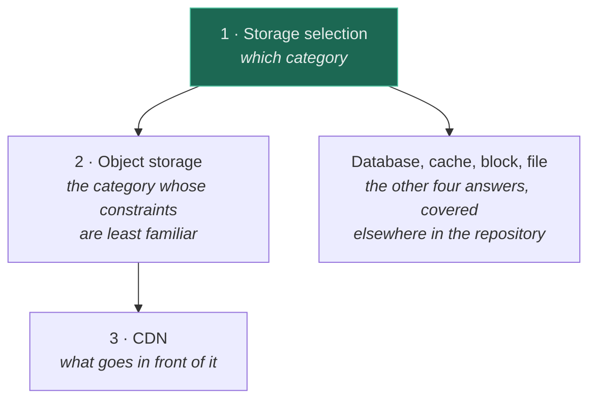
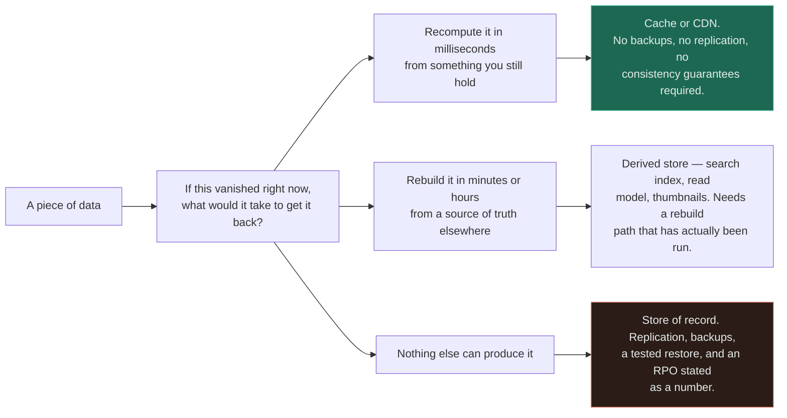
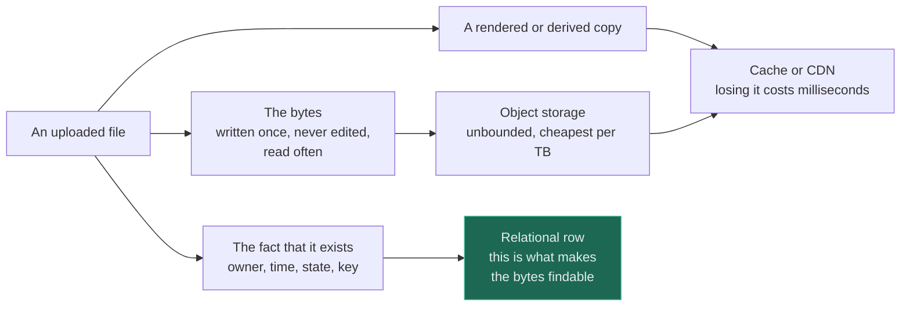

# Storage

Three pages about where bytes live when they are not in a [database](../05-databases/fundamentals/)
and not in a [cache](../04-caching/fundamentals/) — plus the decision guide that tells you which of
the five options you actually needed.

If you only read one, read [storage selection](storage-selection/). It is four questions, it takes an
afternoon, and it is the page that prevents the migrations the other two describe.

---

## Read in this order

| # | Topic | Difficulty | The one thing to take away |
|---|---|---|---|
| 1 | [Storage selection](storage-selection/) | `[I]` | Four questions decide it, and **the one nobody asks is what losing it costs**. Volume is not a category argument. |
| 2 | [Object storage](object-storage/) | `[I]` | It is not a filesystem. No rename, and **listing is a paginated scan you pay for** — never put it on a request path. |
| 3 | [CDN](cdn/) | `[I]` | The only fix for distance is proximity. **Invalidation at the edge is slow, partial and billed**, which is why cache-busting URLs beat purges. |

The order is a dependency chain rather than a difficulty ramp, and the branch on the right is the
point: **three of the four possible answers to page 1 are not in this section**, because the store you
most often want is a [database](../05-databases/fundamentals/) and the next most often is a
[cache](../04-caching/fundamentals/). Object storage is the category whose constraints are least
familiar and therefore most often violated; a CDN is what goes in front of it once the bytes are
somewhere sensible.

## The one distinction the section rests on

**Every store in this repository sits somewhere on a single axis: what does losing it cost?** That
question, not scale and not price, is what separates the categories — and it is the one routinely
answered by assumption rather than by asking.

The middle branch is where the damage happens. A derived store is treated as disposable right up to
the moment someone needs it rebuilt and finds the rebuild path was never written — at which point it
has been a store of record for eighteen months. **A component is a store of record if nothing else can
reproduce it, not if the diagram says so.**

## Where these sit relative to everything else

Storage is the layer everything else is eventually constrained by, and each page here has a
counterpart elsewhere in the repository that is easy to confuse it with.

| This | Is not this | The difference |
|---|---|---|
| [CDN](cdn/) | [Cache](../04-caching/fundamentals/) | A cache removes *work*. A CDN removes *distance*. Only one of those is fixable behind your origin |
| [CDN](cdn/) | [Load balancer](../03-load-balancing/fundamentals/) | The balancer divides work between identical servers; the edge stops the work arriving |
| [Object storage](object-storage/) | A filesystem | No rename, no partial write, no directories, and listing is a scan |
| [Object storage](object-storage/) | [A database](../05-databases/fundamentals/) | It answers "give me the bytes at this key" and nothing else. The database is the index |
| [Storage selection](storage-selection/) | [Comparisons](../comparisons/) | The tree stops at the category. Product arguments live in comparisons |

**The second row is the conflation that costs most**, because it decides where you spend effort: a
user 15,000 km away is not helped by a bigger fleet, and no amount of edge caching rescues a saturated
origin. They act on different terms of the same total, which is why they compose — see
[CDN + load balancer](../14-component-combinations/cdn-and-load-balancer/).

## The shape almost every system ends up with

Once the tree has been run honestly, one entity usually lands in three places at once. This is not a
failure of the design — it is the design.

Three parts of one noun, three different answers to the question above. The highlighted box is the
half that gets omitted: **without the row, the only way to find the bytes is to list the bucket**,
which works perfectly at a thousand objects and becomes an outage at ten million.

## The four questions, in full

Reproduced here so the section index is usable on its own — the reasoning, and the tree they build,
are in [storage selection](storage-selection/).

1. **Does more than one machine need it at the same time?** Decides whether a local disk is eligible
   at all. Binary, and the cheapest to answer.
2. **Is it mutated in place, or written whole and read whole?** Decides whether object storage works,
   because mutation is the thing it cannot do.
3. **What is the access unit — the whole value by a known key, or fields, sets and relationships?**
   This is the question people phrase as "SQL or NoSQL", and it is third, not first.
4. **What does losing it cost — data, or only latency?** The one above. The only question whose wrong
   answer destroys data rather than performance.

Note what the list does not contain: how much data there is, and how fast it must be. Volume and
latency change how you *operate* the store you chose — [sharding](../05-databases/sharding/),
[caching](../04-caching/fundamentals/), an edge — and very rarely change which category fits.

## What this section does not cover

Stated plainly, because an empty heading implies the question was never considered:

- **Filesystem internals** — inodes, journalling, block allocation. Real, and one level below where
  design decisions get made.
- **Distributed file systems** as a subject in their own right — HDFS, Ceph, Lustre. They appear here
  only as the "file storage" branch of the tree.
- **Data lake and warehouse architecture** — table formats, partitioning for analytics engines. The
  bucket underneath them is covered; what is built on top is not.
- **Backup tooling and disaster-recovery runbooks.** RPO and RTO are treated as inputs to the
  decision, not as an operational practice.
- **Encryption at rest** — assumed on, everywhere, and discussed where it bears on access control in
  [API security](../12-security/api-security/).

See [GAPS.md](../GAPS.md) for what is missing across the whole repository and
[ROADMAP.md](../ROADMAP.md) for what is planned.

## Related

- [Databases](../05-databases/fundamentals/) — the store of record, and the default
- [Caching](../04-caching/fundamentals/) — the same trade as a CDN, made behind the origin
- [Load balancing](../03-load-balancing/fundamentals/) — the stateless half, once state has a home
- [API gateway](../13-design-patterns/api-gateway/) — the door in front of the services that own this state
- [Latency](../00-foundations/latency/) — the round-trip arithmetic the CDN page is built on
- [Observability](../11-observability/) — the signatures of a wrong storage choice
- [API security](../12-security/api-security/) — presigned URLs, public buckets, and shared caches holding private data
- [Comparisons](../comparisons/) — the product-level arguments · [Glossary](../GLOSSARY.md)
