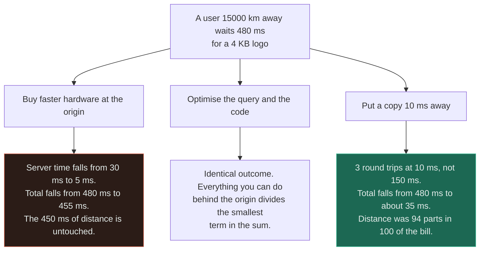
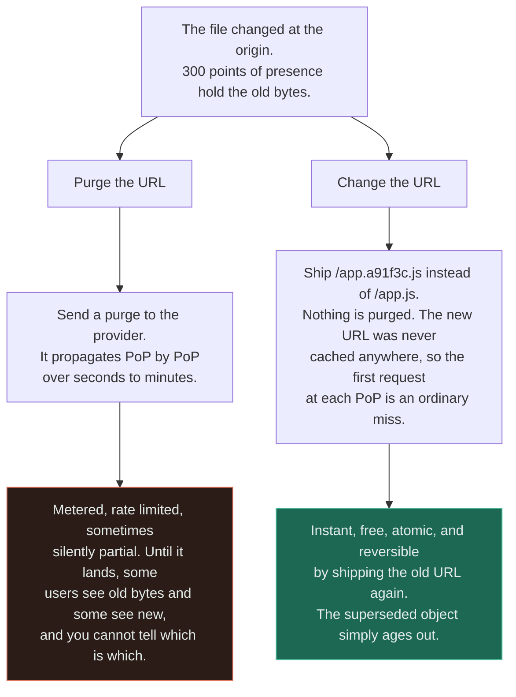
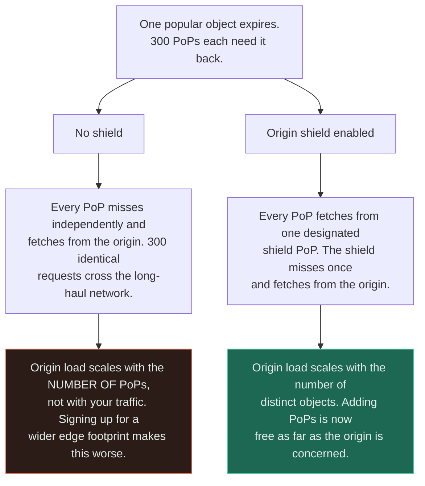
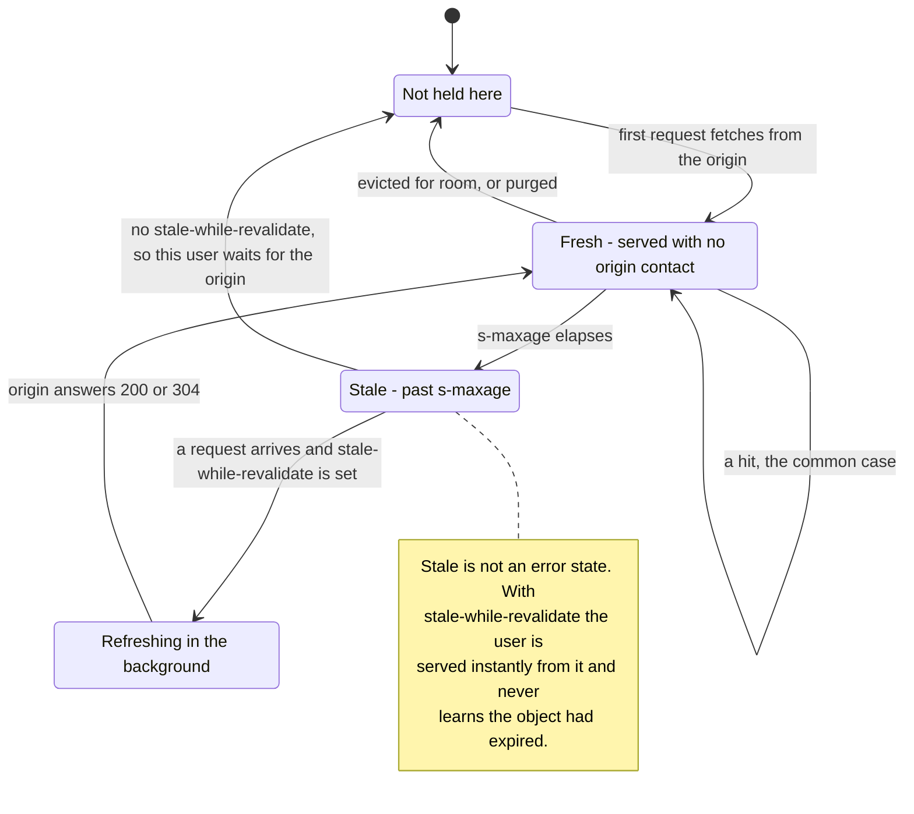

# CDN

`[INTERMEDIATE]` · The only fix for the speed of light is being closer — no hardware you can buy shortens a fibre route. What you get is proximity; what you give up is control over when the copy dies.

---

## 1. One-line definition

A geographically distributed fleet of caching proxies that terminate the user's connection near them
and serve copies of your responses, so most requests never reach your origin at all.

## 2. Explain like I'm new

You order a book. It can ship from the single warehouse on another continent — five days — or from the
depot in your city — tomorrow morning. **The book is identical.** Nothing about the book got better;
the only thing that changed is how far it travelled.

Two consequences arrive immediately and they are the whole page. The depot only stocks the popular
titles, so the rare ones still come the slow way. And the depot holds whatever was shipped to it last
week — if the publisher issues a correction today, **nobody rings round three hundred depots to
collect the old copies.**

## 3. Real-world analogy

A national newspaper with regional print sites. One editorial process, the same edition, printed and
distributed locally so the paper is on the doorstep by breakfast rather than after a two-day lorry
journey.

**Where it breaks:** a newspaper is *meant* to be a frozen snapshot — nobody expects yesterday's copy
to change in your hands. Your responses can change any second, and once a copy is sitting in three
hundred buildings you do not own and cannot log into, reaching all of them is a request you file with
a vendor, not an operation you perform. That asymmetry — cheap to distribute, expensive to retract —
is the defining property of an edge cache and the source of every hard decision below.

## 4. Technical explanation

A user's total wait decomposes into two terms that behave completely differently:

| Term | What it is | What shortens it |
|---|---|---|
| **Distance** | Round trips × RTT. TCP handshake, TLS handshake, request. | **Only proximity.** |
| **Work** | Origin CPU, query time, rendering | Faster machines, indexes, caching *behind* the origin |

Every optimisation most teams reach for divides the second term. At 150 ms RTT a cold HTTPS request
costs roughly three round trips — about 450 ms — before your process is even scheduled. See
[latency](../../00-foundations/latency/) for where these numbers come from.



Read the two leaf boxes as the same engineering effort spent on different terms. The red branch is
not *wrong* — 25 ms is real — it is simply attacking six per cent of the problem, which is why
"the site is slow in Australia" is never solved by a bigger instance.

**The number to optimise is the offload ratio** — the share of requests answered at the edge — for
exactly the reason [hit rate](../../04-caching/fundamentals/#4-technical-explanation) is the number
for an ordinary cache. And note what a CDN gives you even on a *miss*: the edge already holds a warm,
pooled, TLS-established connection to your origin, so a miss pays one long-haul round trip rather
than three.

## 5. Engineering at scale

### What you control versus what the edge honours

You do not configure a CDN. You **request** behaviour with response headers, and the edge decides.
This distinction is the source of most "but I set the header" incidents.

| Header | Who reads it | What it actually does |
|---|---|---|
| `Cache-Control: max-age=N` | Browser **and** shared caches | The browser copy — the one you cannot purge at all |
| `Cache-Control: s-maxage=N` | **Shared caches only** | Overrides `max-age` at the CDN. Lets the edge hold for a day while browsers hold for a minute |
| `stale-while-revalidate=N` | Shared caches | Serve the stale copy instantly, refresh in the background. **The single highest-value header most teams never set** |
| `stale-if-error=N` | Shared caches | Keep serving the stale copy while the origin is down — see [§19](#19-failure-scenarios) |
| `Cache-Control: no-cache` | Everyone | **Does not mean "do not cache".** It means "cache it, but revalidate before each use". `no-store` is the one that means what people think `no-cache` means |
| `Cache-Control: private` | Shared caches | Browser may cache, CDN must not. The correct header for per-user responses |
| `Vary: Some-Header` | Shared caches | Forks the cache key on that header |
| `ETag` / `Last-Modified` | Everyone | Enables a 304 — saves bytes, still pays the round trip |

**Provider configuration usually outranks your headers.** Most CDNs let an operator set a "cache
everything for 1 hour" rule that ignores origin headers entirely, and most let an operator strip
cookies to make responses cacheable. Both are legitimate and both mean the header in your code is a
suggestion. When behaviour surprises you, the dashboard is the authority, not the response.

### The cache key, and how `Vary` destroys it

The default key is scheme, host, path and query string. Every value you fork on multiplies the number
of stored copies and divides your offload ratio by the same factor.

| Vary on | Distinct variants | Verdict |
|---|---|---|
| `Accept-Encoding` | 2–3 | Fine — necessary and bounded |
| `Accept-Language` | Number of languages you serve | Fine if you normalise to a short list first |
| `User-Agent` | Effectively unbounded | **Never.** Normalise to `mobile` or `desktop` at the edge instead |
| `Cookie` | One per user | This is not a cache. You have built a very slow proxy |

Query strings are the same trap wearing different clothes: if analytics parameters are part of the
key, one asset has as many cached copies as it has campaign tags. Strip unknown parameters at the
edge.

### Invalidation is slow, partial, and billed

This is the correction the page exists to make.

**A purge is a distributed operation across infrastructure you do not own.** It takes seconds to
minutes to reach every point of presence, it is rate-limited, it is metered on most commercial plans,
and during the window some users see the new bytes and some see the old with no way for you to tell
which. Nothing about it resembles `DEL key` against a [cache](../../04-caching/fundamentals/) you run.

The fix is to stop needing it.



**Content-hashed URLs turn invalidation into deployment**, which is a problem you already know how to
do safely. The old and new versions coexist, so a half-propagated rollout is merely two valid states
rather than one broken one, and a rollback is a deploy rather than a support ticket. Set `max-age` on
hashed assets to a year and never think about it again.

The rule that follows: **the only document you should ever need to purge is the one that names the
hashed URLs** — `index.html`, or the API response that lists asset paths. Give that one a short TTL
and everything downstream of it becomes immutable.

## 6. The problem it solves

Distance, which nothing behind the origin can touch — and, as a consequence, origin load for every
byte that is identical for everybody.

## 7. The problem it does NOT solve

**A CDN in front of uncacheable personalised responses buys you almost nothing.** If every response
depends on who is asking, the offload ratio is zero by construction. What remains is the warm pooled
origin connection and TLS terminated near the user — real, worth roughly two round trips, and far
less than the tenfold figure that got the CDN approved. Measure the offload ratio before you attribute
a win to the edge.

It does not fix a slow origin — every miss pays full price, so your p99 is still the uncached path. If
the origin is slow because of a missing index, an edge cache hides that from the average and not from
the tail, and the [database](../../05-databases/fundamentals/) problem survives another year.
It does not give you invalidation, only a slower and more expensive version of it. It does not make
your data safe: caching a per-user response in a shared cache is a
[data leak](../../12-security/api-security/), not a performance bug. And it does not reduce your
availability risk — it moves it, which [§19](#19-failure-scenarios) is about.

---

## 9. How it works

A request never reaches you unless the edge decides it must.

1. **DNS or anycast steers the client** to a nearby point of presence — see
   [DNS](../../01-networking/dns/), because your failover time is that TTL.
2. **The PoP terminates TCP and TLS** locally. This is where the handshake saving comes from.
3. **Cache lookup** on the computed key.
4. **On a miss**, the PoP fetches — from a mid-tier or shield, then the origin.
5. **The response is stored** according to whichever of your headers and the provider's rules wins.

### Origin shielding

Step 4 is where a subtle scaling failure lives, and it is the same shape as the local-versus-shared
cache problem one layer down.



Read the bottom row as the only row that matters: without a shield, **the thing that grows your
origin traffic is your CDN getting better**, which is a genuinely counter-intuitive bill. It is
exactly the failure that makes
[per-server local caches](../../04-caching/fundamentals/#5-engineering-at-scale) degrade as a fleet
grows, reappearing at a different altitude.

### The life of one object at one PoP



The transition worth staring at is `STALE --> MISS`: without `stale-while-revalidate`, expiry
converts a hit into a full origin round trip **for whichever unlucky user arrives first**, at every
PoP, on every TTL boundary. That is a thundering herd distributed across the planet, and one header
removes it.

---

## 13. When to use it

- Users are geographically spread and the origin is not
- A meaningful share of bytes is **identical for everybody** — assets, images, video, public API reads
- Traffic is spiky and you would rather absorb it upstream than provision for it
- You want [DDoS](../../12-security/ddos/) absorption you cannot build yourself
- Response bodies are large relative to the work that produced them

## 14. When NOT to

- **Every response is personalised.** Offload will be near zero. See [§7](#7-the-problem-it-does-not-solve).
- Content must be correct to the second and you cannot express that as a short TTL
- Your entire audience is in one metro area and so is your origin — you have added a hop and a
  dependency to save nothing
- Traffic is internal, service-to-service, inside one region
- **You have not measured what fraction of bytes is cacheable.** That one division decides the whole
  business case, and it takes an afternoon.

## 17. Trade-offs

| Choose | Get | Pay |
|---|---|---|
| CDN | Distance removed, origin offloaded, attack absorption | A third party in the request path — their outage is yours |
| Long edge TTL | High offload, low origin load | Staleness you can only end slowly and at a price |
| Short edge TTL | Fresher content | Low offload; the CDN degrades toward a slow proxy |
| Content-hashed URLs | Immutable assets, instant rollout and rollback | A build step, and a manifest document you must still invalidate |
| Purge API | Precise removal on demand | Seconds to minutes, rate limits, per-purge cost, partial states |
| `stale-while-revalidate` | No user ever waits for a refresh | Someone is knowingly served stale data |
| Origin shield | Origin load stops scaling with PoP count | One more tier, and one more thing to be regionally unavailable |
| Caching authenticated responses | Offload on your most expensive routes | **Cross-user leaks** if the key is even slightly wrong |

## 18. Why not?

| Alternative | Why not here | When it WOULD win |
|---|---|---|
| **No CDN — origin only** | Distance stays in every request and nothing behind the origin can remove it | Single-region audience, internal traffic, or nothing cacheable |
| **Multi-region origins** | Far more expensive and you now own data replication and consistency | Requests are genuinely *uncacheable* and must still be fast worldwide |
| **A [cache](../../04-caching/fundamentals/) in front of the origin** | Removes work, not distance. A user in Sydney still crosses an ocean to hit it | The expensive part is the query, and your users are already close |
| **Bigger origin behind a [load balancer](../../03-load-balancing/fundamentals/)** | Divides the smallest term in the latency sum | The origin is genuinely saturated — see [CDN + load balancer](../../14-component-combinations/cdn-and-load-balancer/) |
| **Client-side caching only** | You control it least of all and can never purge it | Assets truly immutable per release, as a layer *on top of* the CDN |
| **Edge compute** | Turns a cache you can reason about into a distributed runtime you must operate | Personalisation is thin and mechanical — geo redirects, A/B assignment, auth checks |

The last row is where teams overshoot. Running code at the edge is the answer to "this response is
personalised so it cannot be cached", but it converts a boring cache into three hundred deployments
of your business logic. Try splitting the response into a cacheable shell and a personalised fragment
first.

## 19. Failure scenarios

| Failure | What happens | Mitigation |
|---|---|---|
| **CDN provider outage** | Your site is down. Your servers are healthy, your dashboards are green, and you can do nothing. **Their availability multiplies with yours** | A second CDN with DNS or health-based failover; and rehearse it, because the failover path is never exercised |
| Origin down, edge holding | Users see stale content or errors depending on one header | `stale-if-error` — the cheapest resilience in this repository |
| **Cache key includes a user identifier** | One user's response served to another. A security incident | Never `Vary: Cookie`; strip auth-bearing headers from the key deliberately |
| **Cache key omits something that mattered** | Everyone gets the first requester's language, currency or tenant | Enumerate what the response actually depends on before choosing the key |
| Purge lands partially | Two versions live simultaneously with no way to tell which a user has | Content-hashed URLs, so both versions are valid |
| TTL expiry storm | Every PoP misses the same popular object at the same instant | Origin shield, `stale-while-revalidate`, jittered TTLs |
| Origin bill rises as the edge grows | No shield: origin load tracks PoP count | Enable shielding — see [§9](#9-how-it-works) |
| Certificate expiry at the edge | Total outage, scheduled by you, at a time nobody is watching | Automated renewal with alerting on days remaining, not on failure |

**The first row is the trade almost nobody prices.** Adding a CDN raises your typical performance and
lowers your ceiling on availability, because you have taken a dependency you cannot debug, cannot
patch, and cannot fail over from without having practised. It is usually the right trade. It should
still be a decision, and it should appear in the availability arithmetic in
[availability](../../00-foundations/availability/) rather than being assumed to be free.

---

## 25. Without it → With it → New problem → Next

```
Without it   →  distance is charged on every request and no amount of origin
                engineering can remove it
With it      →  most requests never cross the long-haul path; the origin sees a
                fraction of the traffic
New problem  →  copies of your content live in infrastructure you do not own,
                and retracting them is slow, partial and billed
Next         →  content-hashed URLs so invalidation becomes deployment, an origin
                shield so origin load stops tracking PoP count, and a second
                provider because the CDN is now a single point of failure
```

Each line buys the next problem. See [the chain](../../SYSTEM-DESIGN-THINKING.md#part-1--the-chain).

## 28. Common mistakes

| Mistake | Why it is wrong |
|---|---|
| Putting a CDN in front of personalised responses | Offload is zero by construction; the win was a warm connection, not the cache |
| Using purges as the routine release mechanism | Slow, metered, partial — and it fails exactly when a release is going badly |
| `Cache-Control: no-cache` to prevent caching | It means "revalidate", not "do not store". `no-store` is the one you wanted |
| `Vary: User-Agent` or `Vary: Cookie` | Unbounded cache keys; the offload ratio collapses to roughly zero |
| Analytics parameters left in the cache key | One asset, one cached copy per campaign tag |
| No `stale-while-revalidate` | Every TTL boundary makes one user per PoP wait for the origin |
| No origin shield | Origin load grows when your CDN footprint grows |
| Assuming the response header is authoritative | Provider rules routinely override it — the dashboard wins |
| Treating the CDN as infrastructure rather than a dependency | Their outage is your outage, and the failover was never tested |
| Caching an error response with a long TTL | A transient 500 is now pinned worldwide for an hour |

The last row deserves a sentence of its own: **negative caching needs its own, short, deliberate
TTL.** Inheriting the success TTL for a 5xx is how a thirty-second origin blip becomes an hour-long
global outage.

## 29. Monitoring

**Offload ratio is the primary SLI** — requests and bytes served at the edge as a share of the total.
Track it per route, because a single uncacheable route can quietly dominate origin traffic while the
aggregate looks healthy.

Then: origin request rate, which is the number that tells you what a CDN outage would send your way;
p99 by region, since the whole point is a term that varies by geography and a global average hides it
entirely; 4xx and 5xx split **by edge versus origin**, because confusing the two makes an incident
unreadable; purge latency and purge volume, the latter being a usage signal that you are releasing
wrongly; and certificate expiry in days remaining. See
[observability](../../11-observability/) for how to hold these together.

## 31. Exercises

**1.** Your API is entirely authenticated and every response differs per user. An engineer proposes
putting it behind a CDN "for the latency win". Do you approve it?

<details><summary>Answer</summary>

No — not on that reasoning. The offload ratio will be near zero because no two users can share a
cached response, so the caching layer you are paying for does nothing. What you would actually get is
TLS terminated near the user and a warm pooled connection to the origin: roughly two round trips,
which is real but is not what was promised.

Approve it if that is the stated case, or if you want the [DDoS](../../12-security/ddos/) absorption
and WAF — both are good reasons. Reject the *latency-from-caching* argument until someone measures
what fraction of responses are actually shareable. And note the risk it adds: your availability is now
multiplied by theirs.
</details>

**2.** A release goes out. You purge `/app.js` at the CDN. Ten minutes later, some users report a
broken page and others are fine. What happened, and what should the release process have been?

<details><summary>Answer</summary>

The purge propagated unevenly. Some PoPs served new HTML with the old cached `/app.js`, or old HTML
with the new one — a mismatch that exists only during the propagation window and is invisible from
your side, because you cannot ask a PoP what it currently holds.

The process should have shipped `/app.a91f3c.js` — a **content-hashed URL** — with `max-age` of a
year, purging only the short-TTL `index.html` that names it. Both versions then coexist legitimately,
a half-propagated rollout is two valid states rather than one broken one, and rollback is a deploy
instead of a support ticket. **Invalidation you have to perform is a design smell — the fix is to
stop needing it.**
</details>

**3.** Your CDN bill is stable but origin egress has tripled over six months. Traffic is flat and the
hit rate reported by the provider is unchanged. What is the most likely cause?

<details><summary>Answer</summary>

You have no origin shield, and the provider added PoPs. Without shielding, each PoP fills its cache
independently, so origin fetches scale with the **number of PoPs** rather than with your traffic —
which means your origin bill rose because your CDN footprint improved.

The per-PoP hit rate is genuinely unchanged, which is why the reported number does not move. Enable
origin shielding so all PoPs fill through one designated tier. It is the same failure as a
[per-server local cache](../../04-caching/fundamentals/#5-engineering-at-scale) degrading as a fleet
grows, one layer up.
</details>

**4.** A page renders correctly for the first visitor after each deploy and shows the wrong currency
for everyone after that. Where is the bug?

<details><summary>Answer</summary>

The cache key. The response depends on something — a currency header, a geo hint, a cookie — that is
not part of the key, so the first requester's variant is stored and served to everyone behind it.

Two correct fixes, and they are genuinely different decisions: add the discriminator to `Vary` and
accept a smaller offload ratio, or make the response identical for everyone and resolve currency on
the client. Do **not** reach for `Vary: Cookie` — that keys per user and turns your CDN into a very
slow proxy. The general rule is to enumerate what the response actually depends on *before* choosing
the key, because the failure is silent and the first request after each deploy always looks fine.
</details>

**5.** Your origin goes down for four minutes. Some users see cached pages throughout, others see 502s
immediately. Both groups are behind the same CDN. Explain.

<details><summary>Answer</summary>

`stale-if-error` was not set, so behaviour depended entirely on whether each user's PoP happened to
hold a fresh copy. Fresh copies were served from cache and those users never noticed; anything past
`s-maxage`, or absent, required an origin fetch that failed and became a 502.

Setting `stale-if-error` — with `stale-while-revalidate` alongside it — would have let every PoP keep
serving its stale copy for the duration. It is close to free, and it converts a four-minute outage
into a four-minute staleness window for most of your traffic. Note the corollary: you cannot fix this
during the incident, because changing a header requires the origin you no longer have.
</details>

## 33. Related

- [Storage](../README.md) — the section index, and where a CDN sits among the other stores
- [Cache](../../04-caching/fundamentals/) — the same bet, made behind the origin instead of in front of it
- [Latency](../../00-foundations/latency/) — the round-trip numbers this whole page is arithmetic over
- [Load balancer](../../03-load-balancing/fundamentals/) — divides work; the CDN removes it
- [CDN + load balancer](../../14-component-combinations/cdn-and-load-balancer/) — the pairing, and what the edge hides from the balancer
- [Object storage](../object-storage/) — the usual origin for static assets
- [Storage selection](../storage-selection/) — where an edge cache is and is not the right answer
- [API security](../../12-security/api-security/) — a shared cache holding a per-user response is a leak
- [Observability](../../11-observability/) — how you would know any of this broke
- [Comparisons](../../comparisons/) · [Glossary: CDN](../../GLOSSARY.md#cdn)
