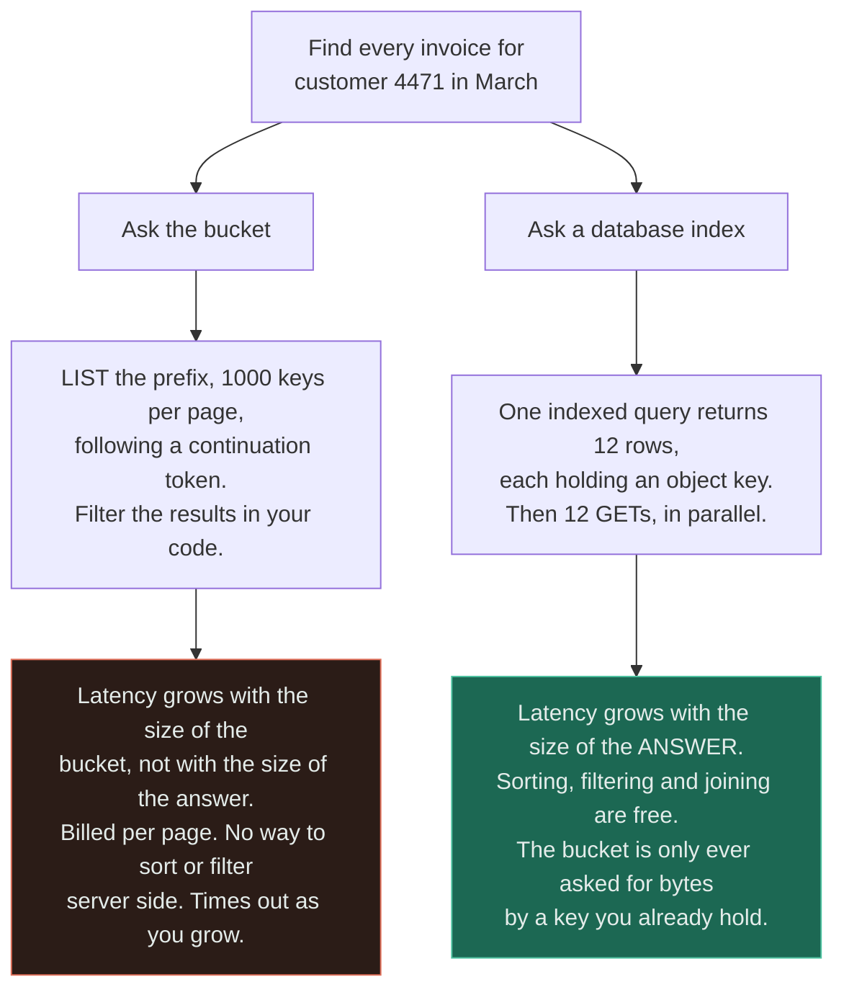
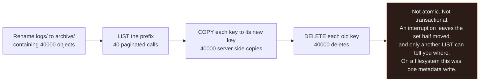
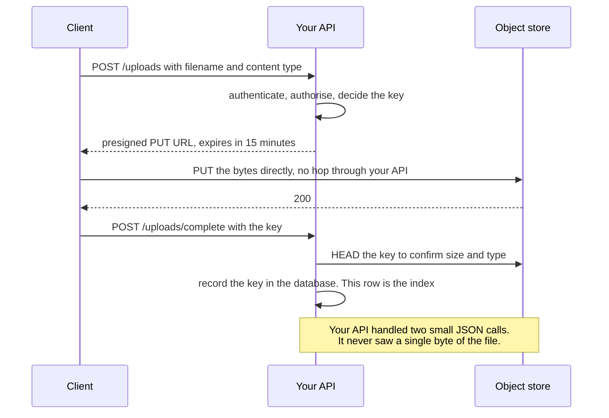
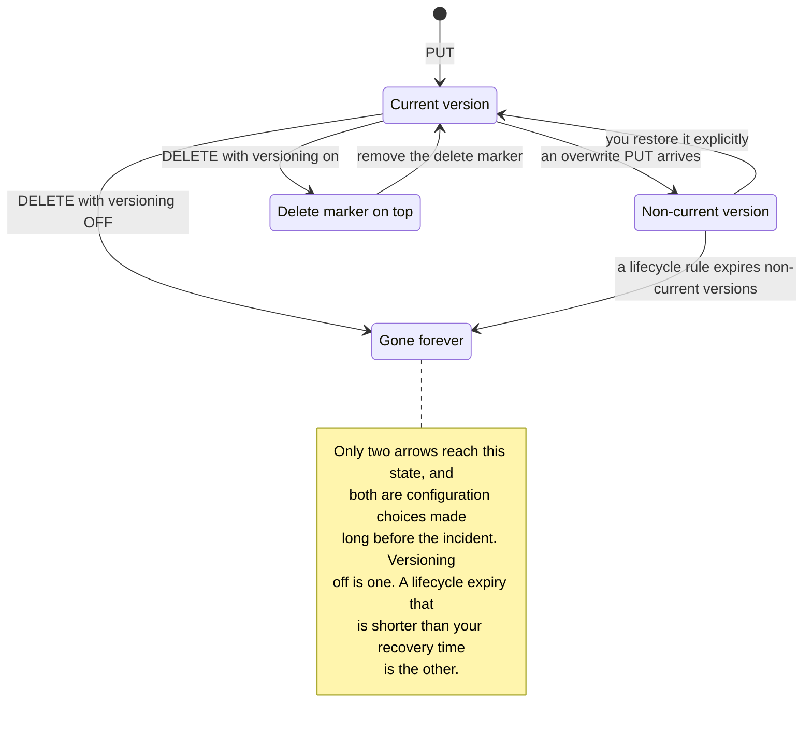

# Object Storage

`[INTERMEDIATE]` · It looks like a filesystem, is priced like a filesystem, and is not one. There is no rename, listing is a paginated scan you pay for, and the directories in the console do not exist.

---

## 1. One-line definition

A durable key-to-blob store reached over HTTP, where the whole value is written and read as one unit,
the namespace is flat, and the only cheap operations are `PUT`, `GET` and `DELETE` on a key you
already know.

## 2. Explain like I'm new

Think of a very large left-luggage office. You hand over a bag, you are given a ticket, and the bag
comes back when you present the ticket. It is enormously reliable and effectively unlimited.

Now notice what you *cannot* do. You cannot open the bag and change one shirt — you take the bag out,
repack it, and hand it back as a new bag. You cannot relabel a bag: relabelling means collecting it
and depositing it again under the new name. And **if you have lost the ticket, the only way to find
your bag is to have the clerk read out every ticket in the building**, a hundred at a time, while the
meter runs.

That last one is the mistake. Systems that work fine with a thousand objects and fall over at ten
million almost always fell over on listing.

## 3. Real-world analogy

A bonded warehouse with a manifest. Crates go in, each with a unique code, and the warehouse promises
the crate will still be there in a decade. Retrieval by code is instant.

**Where it breaks:** the warehouse keeps no index of what is *in* the crates, and it has no aisles —
the codes only look like addresses because you chose to put slashes in them. Ask "which crates
arrived in March from supplier 12" and the only answer available is a full walk of the manifest. Every
system that treats object storage as a queryable store rediscovers this at the exact moment the
manifest gets long, and the fix is always the same: **keep your own index somewhere that can answer
questions**, and use the object store only for the bytes.

## 4. Technical explanation

The category is defined by what it deliberately gave up. Each row below is a POSIX filesystem
guarantee traded for scale-out durability:

| Filesystem operation | Object storage | Cost of the difference |
|---|---|---|
| Rename or move | **Does not exist.** A rename is `COPY` then `DELETE` | O(bytes), not O(1). Renaming a 5 TB "folder" moves 5 TB |
| Partial write, append, seek | Whole-object `PUT` only | Changing one byte rewrites the object |
| Directories | Only a UI illusion over key prefixes | There is no "move a directory" — there are N moves |
| `stat` a path | `HEAD` one key, cheap. Enumerate a prefix, expensive | Listing is a paginated scan, see below |
| Locking, concurrent writers | Last writer wins, per object | Two concurrent `PUT`s: one survives, silently |
| Hard links, permissions per inode | Policy per bucket or prefix | Fine-grained sharing needs presigned URLs |

**The namespace is flat.** `logs/2026/03/14/app.log` is not four directories and a file — it is one
key that happens to contain slashes. The console draws folders by splitting on the delimiter, which is
a rendering choice, not a structure. This matters because it explains every surprise in the table:
there is nothing to rename, nothing to move, and nothing to walk.

**Consistency has improved and the habit should not.** The major providers now offer read-after-write
consistency for new objects *and* overwrites. Historically, an overwrite could serve the old bytes for
some seconds, and a great deal of production code was written against that reality. The durable lesson
is not "it is eventually consistent" but **do not build mutable state out of overwrites** — write a
new key and update a pointer, which is correct under either model and is also how you get history for
free.

## 5. Engineering at scale

### Listing is the thing that kills systems

`LIST` is a paginated scan over a sorted key range. It returns roughly a thousand keys per call, it is
billed per call, it is slow relative to a `GET`, and it gets slower as the prefix grows. A bucket with
fifty million objects under one prefix needs fifty thousand sequential round trips to enumerate.



Read the two bottom boxes as the same question answered with different complexity classes. **The rule
is one line: never make listing part of a request path.** Object storage answers "give me the bytes at
this key". Anything that starts with "find" belongs to a [database](../../05-databases/fundamentals/).

Listing is legitimate for batch and administrative work — reconciliation, garbage collection, a
one-off migration — where minutes are acceptable. It is not legitimate anywhere a user is waiting.

### Prefixes are a physical decision, not a cosmetic one

Keys are stored in sorted order and partitioned by range, so a key prefix determines which partition
serves the request. Two consequences:

| Key design | What happens |
|---|---|
| `2026-03-14T09:15:00-<id>` | Every write in a minute lands on one partition. A **hot prefix**, and a throughput ceiling that has nothing to do with the service's total capacity |
| `<hash-of-id>/2026-03-14/<id>` | Writes spread across partitions from the first character |
| `tenant/<id>/...` | Natural sharding, natural policy boundary, natural lifecycle rule |

Modern services auto-partition under sustained load, which softens this but does not remove it —
auto-partitioning reacts, so a launch spike meets the old layout. **Design the prefix for the write
distribution and the deletion boundary**, because the second one is what you will care about later:
"delete everything for tenant 12" is trivial if the tenant is a prefix and a horror if it is a suffix.

### Storage classes, and the retrieval trap

Cheaper per gigabyte-month almost always means more expensive per read, and the cross-over is not
where intuition puts it.

| Class | Storage cost | Retrieval | Honest use |
|---|---|---|---|
| Standard | Baseline | Free or near it | Anything read more than about once a month |
| Infrequent access | ~45% less | Per-GB fee, plus a minimum object size and a minimum 30-day charge | Genuinely infrequent, genuinely large objects |
| Archive / cold | ~80% less | Per-GB fee, **minutes to hours to first byte**, 90–180 day minimums | Compliance retention nobody expects to read |
| Deep archive | ~95% less | Hours, and the highest retrieval fees | Legal hold. The read is an event, not a request |

**A lifecycle rule that moves everything to archive after 30 days is a trap if 5% of it is still being
read.** You save on the 95% and pay a retrieval fee plus an early-deletion charge on the 5%, and the
bill goes *up*. Worse, the read path now has a multi-hour tail nobody designed for. Measure the access
distribution by age before writing the rule — the same discipline as
[sizing a cache from the working set](../../04-caching/fundamentals/#5-engineering-at-scale), and
wrong for the same reason when skipped.

## 6. The problem it solves

Storing an unbounded quantity of immutable blobs durably and cheaply, with no capacity planning, no
filesystem to run out of, and an HTTP interface every client already speaks.

## 7. The problem it does NOT solve

**It is not a database and it is not a filesystem.** No queries, no transactions, no secondary
indexes, no partial updates, no locking, no ordering. If your access pattern contains the word "find",
"filter", "latest" or "count", the answer is not in the bucket.

It is also not fast. A `GET` is tens of milliseconds at best, an order of magnitude slower than a
[cache](../../04-caching/fundamentals/) and often slower than a database read — durability and
elasticity were bought with network hops. And it does not protect you from yourself: eleven nines of
durability describes the provider's hardware, not your `DELETE` statement or your misconfigured
lifecycle rule.

---

## 9. How it works

A bucket is a keyspace. Each object is bytes plus metadata, replicated across failure domains inside a
region — that replication is the eleven-nines durability figure, and it is a property of the *storage*,
not of your usage.

The operation set is deliberately tiny: `PUT`, `GET`, `HEAD`, `DELETE`, `LIST`, `COPY`, and multipart
upload for large objects. Everything else you want is a composition of those, which is exactly why a
rename costs what it costs:



Every arrow is a network operation billed per request, and the chain has no rollback. This is the
single most useful thing to internalise about the category: **the operations that are free on a
filesystem are the expensive ones here, and vice versa.**

### Presigned URLs — keeping bytes off your servers

The default design has uploads and downloads pass through your application. It is the wrong default:
your servers become a bandwidth funnel, request timeouts have to accommodate a 2 GB upload on a slow
mobile link, and one large transfer occupies a worker that could have served a thousand API calls.



The authorisation decision still happens in your code — that is the point of the pattern, and the
reason it is safe. What moves is only the byte transfer. Note the last two steps: **the write is not
finished until a row exists**, because an object with no database row is invisible to everything
except a `LIST`, which is precisely what you promised never to do.

### Lifecycle, versioning and the delete you did not mean



The state worth noticing is `DM` — a delete with versioning on does not remove anything, it stacks a
marker, which is why the bucket keeps growing and the bill keeps rising after a large cleanup.
Versioning is your undo button and it is also a storage cost you must expire deliberately.

---

## 13. When to use it

- Blobs: images, video, documents, backups, build artefacts, exports
- Data written once and read many times, or written once and read never
- Volume is unbounded or unpredictable and you do not want to plan capacity
- Content is served onward by a [CDN](../cdn/) — object storage is the canonical origin, and
  [the pairing](../../14-component-combinations/cdn-and-load-balancer/) is the default shape for
  anything user-facing
- The consumer can be given a URL instead of bytes
- Data-lake and analytics files that a query engine reads in bulk

## 14. When NOT to

- **The access pattern is a search**, not a fetch by known key
- The object is mutated frequently — every change rewrites the whole thing
- You need low latency per read — a cache or a database is an order of magnitude closer
- Many small objects with high request rates: you are paying per request for something a database row
  does better and cheaper
- **Two writers may touch the same object.** Last writer wins, and neither is told
- You need transactions or ordering across objects

## 17. Trade-offs

| Choose | Get | Pay |
|---|---|---|
| Object storage | Unbounded, durable, cheap, no capacity planning | No queries, no partial writes, no rename |
| Flat namespace | Scale-out with no directory bottleneck | Listing is a scan, and "folders" are fiction |
| Whole-object writes | Simple concurrency, natural immutability | A one-byte change rewrites the object |
| Cold storage class | Large saving per GB-month | Retrieval fees, minimum durations, and a latency tail in hours |
| Versioning | An undo button for deletes and overwrites | Storage that grows silently until you expire it |
| Presigned URLs | Bytes never touch your servers | A time-boxed credential in the wild; you must scope and expire it |
| Provider-managed durability | Eleven nines you did not have to build | Lock-in, egress pricing, and a dependency you cannot debug |

## 18. Why not?

| Alternative | Why not here | When it WOULD win |
|---|---|---|
| **Blobs in the [database](../../05-databases/fundamentals/)** | Bloats the table, wrecks backup and restore times, and burns your most expensive storage | Small blobs under a few hundred KB where transactional consistency with the row genuinely matters |
| **A network filesystem** | Costs far more per GB, caps out on capacity, and the POSIX semantics you are paying for are usually unused | Legacy software that must have `open`, `seek` and `rename`, or a shared working directory |
| **Block storage on a VM** | You now own capacity planning, backups, replication and the machine | A single writer needing low latency and in-place mutation — a database's own volume |
| **A key-value store** | Not built for large values, and memory pricing is a different universe | Values are small, hot, and read constantly |
| **Object storage as a queue** | Listing to find work is polling a scan. Ordering and once-only delivery do not exist | Never for the queue itself — use a [queue](../../06-messaging/queues/) and put the payload in the bucket |

The last row is a specific, common, and expensive mistake. The correct shape is the **claim check**:
the message carries the object key, the bucket carries the bytes.

## 19. Failure scenarios

| Failure | What happens | Mitigation |
|---|---|---|
| **A request path calls `LIST`** | Fine at a thousand objects. Times out at ten million, and the degradation is gradual | Index keys in a database. Reserve listing for batch work |
| **Concurrent overwrites** | Last writer wins. No error, no conflict, one version silently gone | Write new keys and swap a pointer, or use conditional writes if the provider offers them |
| Object written, database row not | An orphan: it exists, it is billed, nothing can find it | Write the row in the same logical step, plus a reconciliation sweep |
| Row written, object never uploaded | A dangling reference: reads 404 | Two-phase upload with a completion call, as in [§9](#9-how-it-works) |
| Hot prefix | Sequential or timestamped keys concentrate on one partition; throughput caps well below the service's limits | Distribute the leading characters of the key |
| Lifecycle rule too aggressive | Data you still read is in archive. Retrieval fees and hours of latency | Model the cost against real access-by-age before enabling the rule |
| **Accidental mass delete** | Durability does not help. The provider faithfully deleted what you asked | Versioning, `DELETE` protection, and a copy in another account |
| Presigned URL leaks | Anyone holding it has the access it encodes for as long as it lives | Minutes not days, narrow the method and the key, and log the use |
| Public bucket misconfiguration | Everything is readable by everyone. The classic breach | Block public access at account level and grant via presigned URLs only |
| Region outage | Buckets are regional. Durability is not availability | Cross-region replication, and decide whether reads fail or fall back |

**The row people underestimate is the second.** Object storage has no locks and no conflict
detection, so two services updating "the current state" object destroy each other's work with a `200`
returned to both. It is the same lost-update bug as
[read-modify-write at read committed](../../05-databases/fundamentals/#12-isolation-levels), except
there is no isolation level to raise — the fix must be a different data model.

---

## 25. Without it → With it → New problem → Next

```
Without it   →  blobs live in the database or on a volume, backups take hours, and
                someone plans disk capacity every quarter
With it      →  unbounded, durable, cheap storage with no capacity planning and an
                HTTP interface every client already speaks
New problem  →  no queries, no rename, no partial writes, and listing is a scan you
                pay for — the bucket cannot answer any question about itself
Next         →  a database to hold the index, a CDN in front so reads do not pay
                origin latency, and lifecycle rules whose retrieval cost you modelled
                before enabling
```

The database does not disappear when you adopt object storage — it becomes the thing that knows what
is in the bucket. See [the chain](../../SYSTEM-DESIGN-THINKING.md#part-1--the-chain).

## 28. Common mistakes

| Mistake | Why it is wrong |
|---|---|
| Listing a bucket to find something | O of bucket size, paginated, billed, and it degrades gradually into an outage |
| Treating prefixes as directories | There is no directory. A "folder rename" is N copies and N deletes |
| Mutable state in a single overwritten object | No locking: concurrent writers silently destroy each other |
| Uploading through your API | Your servers become a bandwidth funnel for no benefit — use presigned URLs |
| Sequential or timestamped key prefixes | Hot partition, throughput ceiling, and it appears only under load |
| Lifecycle to archive without measuring reads by age | Retrieval fees and early-deletion charges can exceed the saving |
| Assuming durability means safety | Eleven nines describes their disks, not your `DELETE` |
| No versioning on anything that matters | The undo button costs a checkbox and is unavailable retroactively |
| Object written before, or without, the index row | Orphans that only a `LIST` can find, which is the operation you banned |
| Using it as a queue | Polling a scan, with no ordering and no delivery guarantee — use the claim-check pattern |

## 29. Monitoring

**Request counts split by operation** is the primary signal, and specifically the `LIST` count — a
rising `LIST` rate is the leading indicator of the failure this page is mostly about, and it appears
in the bill long before it appears in latency.

Then: 4xx and 5xx by operation, since a rising 403 rate is usually an expiring credential or a policy
change and a rising 404 rate is usually dangling references; p99 `GET` latency; object count and total
bytes by storage class, with the **trend**, because storage bills grow monotonically unless something
expires; retrieval volume from cold classes, which is the number that tells you a lifecycle rule was
wrong; and orphan counts from your reconciliation job — if you have no such job, that is the finding.
See [observability](../../11-observability/).

## 31. Exercises

**1.** A photo service stores images at `users/<user-id>/<timestamp>.jpg` and renders a gallery by
listing the user's prefix. It is fast in staging. What happens in production, and when?

<details><summary>Answer</summary>

It degrades with the number of photos *per user*, not with total users, so it looks healthy for
months and then breaks for your most engaged customers first. At a thousand keys per page, a user with
20,000 photos costs 20 sequential paginated calls before the page renders, and there is no way to sort
or filter server-side.

The fix is an index: a table of `user_id, taken_at, object_key` answers the gallery query with one
indexed read, in the right order, with cursor pagination — and the bucket is only ever asked for bytes
by a key you already hold. **Never make listing part of a request path.** The bucket cannot answer
questions about itself.
</details>

**2.** To save money, a team adds a lifecycle rule moving everything older than 30 days to deep
archive. Approve it?

<details><summary>Answer</summary>

Not without the access-by-age distribution, and usually not as written. Deep archive is cheapest per
GB-month and carries the highest retrieval fees, a 90-to-180-day minimum charge, and a **first byte
measured in hours**. If even a small share of objects older than 30 days is still read, the retrieval
and early-deletion charges can exceed the storage saving outright.

The latency change is the bigger problem and nobody costs it: a read path that returned in 40 ms now
returns in four hours for some fraction of requests, and no caller was designed for that. Measure
reads by object age, then set the rule at the age where reads actually stop — and consider infrequent
access rather than archive for the middle band.
</details>

**3.** Two services both update `state/current.json` by reading it, modifying a field, and writing it
back. Both get `200`. What is the bug, and why can it not be fixed with retries or careful code?

<details><summary>Answer</summary>

A lost update. The read-modify-write pair is not atomic and object storage has no locking, so the
second `PUT` overwrites the first with a value computed from data that was already out of date. Both
callers are told they succeeded because, individually, both did.

Retries do not help — each retry is another unsynchronised read-modify-write — and neither does
careful code inside either service, because the race is *between* them. It is the same shape as
[read-modify-write at read committed](../../05-databases/fundamentals/#12-isolation-levels), but there
is no isolation level to raise. The fix must change the model: put the mutable state in a database
that has transactions, or write immutable objects under new keys and atomically swap a pointer that
lives somewhere with compare-and-set.
</details>

**4.** Users upload 2 GB videos. Uploads currently `POST` to your API, which streams to the bucket.
Requests time out on mobile and one upload pins a worker for minutes. Describe the fix and what stays
in your code.

<details><summary>Answer</summary>

Issue a **presigned `PUT` URL** with a short expiry and let the client send the bytes directly to the
bucket, with multipart upload so a dropped connection resumes rather than restarts. Your API handles
two small JSON calls and never sees a byte.

What stays in your code is the part that matters: authentication, authorisation, and choosing the
object key — the presigned URL is issued only after those pass, which is why the pattern is safe.
Afterwards, a completion call `HEAD`s the key to confirm size and content type and **writes the
database row**. Without that row the object is invisible to everything except a `LIST`. Keep expiry in
minutes, scope the URL to one method and one key, and log its use.
</details>

**5.** "Object storage gives eleven nines of durability, so we do not need backups." Is that right?

<details><summary>Answer</summary>

No. Eleven nines describes the probability that the provider's hardware loses your bytes. It says
nothing about the far more likely causes of data loss: a bad `DELETE` from a script, a lifecycle rule
that expired more than you meant, a compromised credential, or a bucket policy change.

The provider will faithfully and durably execute a mistaken delete. Durability is also not
availability — buckets are regional, and a region outage takes reads offline with every byte intact.
What you want is versioning on, delete protection, lifecycle rules whose expiry exceeds your detection
time, and a copy in a **separate account** so one compromised credential cannot reach both. See the
[database](../../05-databases/fundamentals/) rule that applies unchanged here: an untested restore is
a hypothesis.
</details>

## 33. Related

- [Storage](../README.md) — the section index and the other four options
- [Storage selection](../storage-selection/) — the decision tree that lands you here, or does not
- [CDN](../cdn/) — the usual thing in front of a bucket, and why the pairing is the default
- [Database](../../05-databases/fundamentals/) — the index that makes a bucket findable
- [Cache](../../04-caching/fundamentals/) — an order of magnitude closer, for the objects read constantly
- [Latency](../../00-foundations/latency/) — why a `GET` is tens of milliseconds and not microseconds
- [Load balancer](../../03-load-balancing/fundamentals/) — what you stop needing when bytes bypass your fleet
- [API security](../../12-security/api-security/) — presigned URLs are a credential, and public buckets are the classic breach
- [Observability](../../11-observability/) · [Comparisons](../../comparisons/)
- [Glossary: durability](../../GLOSSARY.md#durability) · [eventual consistency](../../GLOSSARY.md#eventual-consistency)
