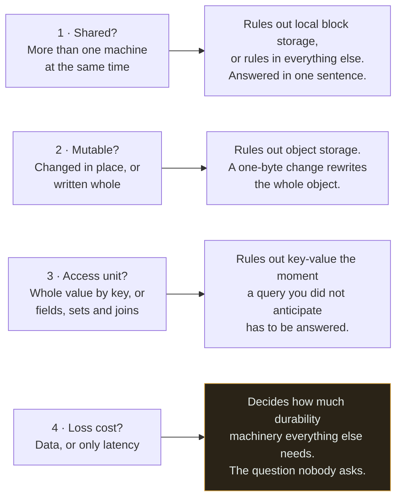
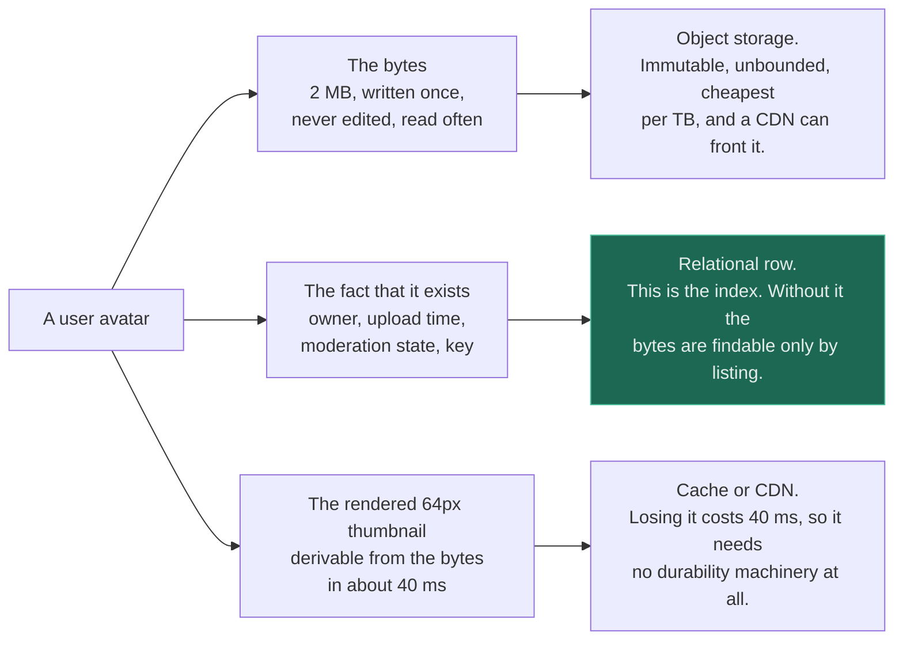
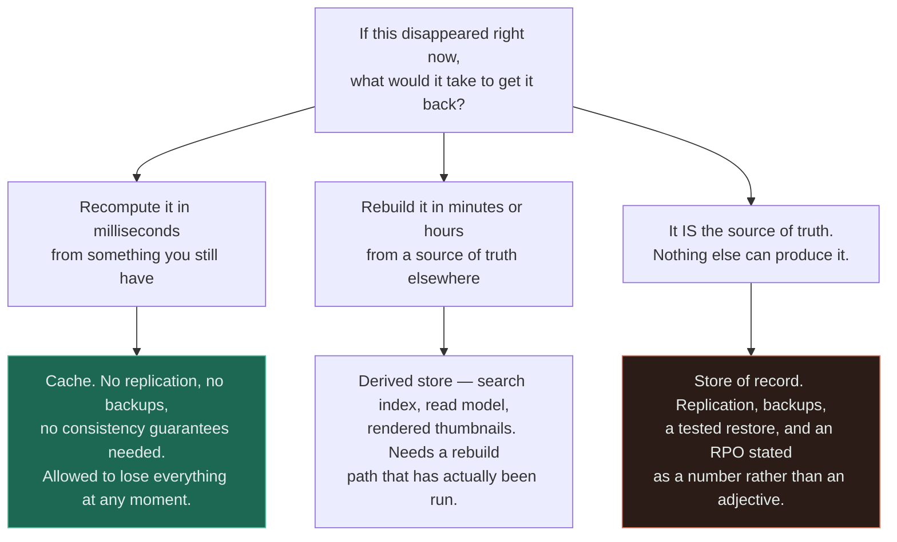
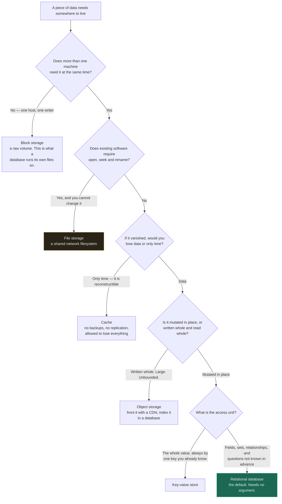

# Storage Selection

`[INTERMEDIATE]` · Four questions decide it, and none of them is "SQL or NoSQL". The one that costs most to get wrong is the one nobody asks — what does losing this actually cost.

---

## 1. One-line definition

A method for choosing between block, file, object, relational, key-value and cache storage by asking
four questions about the data, rather than by comparing products.

## 2. Explain like I'm new

You have things to keep. Where you keep them depends on how you will get them back.

Your passport goes in a drawer at home — one person needs it, you take the whole thing, and losing it
is a genuine problem. A shared team document goes somewhere everyone can open it at once. Photographs
go in boxes in the loft: enormous, never edited, fetched only when you know which box. And a shopping
list goes on a scrap of paper you will happily throw away, because you can write it again.

**Nobody agonises over these.** The properties of the item decide the storage, and you already know
the properties. The reason storage choices go wrong in software is that the question gets asked the
other way round — someone picks a product and then discovers what it implies.

## 3. Real-world analogy

A hospital records department. Charts at the bedside for the one clinician using them now, a shared
system every ward can read, a basement for archived films nobody expects to open, and a whiteboard at
the nurses' station that is wiped every shift.

**Where it breaks:** the hospital gets to keep all four and never has to pick one. Software teams
believe they must choose a single store, and that belief is the actual mistake — the same *entity*
routinely belongs in three places at once. A user avatar is bytes in the archive, a row in the shared
system, and a rendered copy on the whiteboard, and getting each part right is a different question
with a different answer. Choosing "a database" for all three, or "object storage" for all three, is
how one wrong answer contaminates everything downstream.

## 4. Technical explanation

Four questions, in this order, because each one eliminates categories the next would otherwise have to
consider.

| # | Question | What it really decides |
|---|---|---|
| **1** | Does more than one machine need it at the same time? | Whether a **local disk** is even eligible. This one is binary and it is the cheapest to answer |
| **2** | Is it mutated in place, or written whole and read whole? | Whether an **object store** works. Mutation is what object storage cannot do |
| **3** | What is the access unit — the whole value, or fields and sets? | **Key-value versus relational.** The question people phrase as "SQL or NoSQL" |
| **4** | What does losing it cost — data, or only latency? | Whether it may live in a **cache**, and how much durability machinery the rest needs |



Read the order as an elimination sequence rather than a checklist — by the time you reach question 3
there are usually two candidates left, which is why the argument people actually have is the last one
that matters and the first one they start with. **Question 4 is amber because it is the one routinely
skipped, and it is the only one whose wrong answer loses data rather than performance.**

Here is the same thing as a comparison, which is where most of the working knowledge sits:

| | **Block** | **File** | **Object** | **Relational** | **Key-value** | **Cache** |
|---|---|---|---|---|---|---|
| Unit | Fixed-size block | File and path | Whole object by key | Row, set of rows | Value by exact key | Value by exact key |
| Shared across machines | **No** — one mount | Yes | Yes | Yes | Yes | Yes |
| Mutable in place | Yes | Yes | **No** | Yes | Yes | Yes |
| Queries | None | Path only | Key only | **Anything** | Key only | Key only |
| Rename / move | n/a | O of 1 | **Copy plus delete** | n/a | n/a | n/a |
| Typical latency | ~0.1 ms | ~1 ms | ~30 ms | ~1–10 ms | under 1 ms | under 1 ms |
| Cost per TB | High | Highest | **Lowest** | High | Very high | Very high |
| Loss costs | Data | Data | Data | Data | Data | **Latency only** |
| Scales by | Bigger volume | Bigger appliance | **Unbounded** | Shard or replicate | Shard | Add memory |

The latency row is order-of-magnitude only — see [latency](../../00-foundations/latency/) for where
those numbers come from and why the gaps between them are the reason caches exist at all.

Two rows carry most of the decision. **"Shared across machines" has exactly one `No`**, which is why
question 1 is first and why block storage almost never appears in an application design — it appears
underneath the database. And **"loss costs" has exactly one row that says latency**, which is the
entire reason a cache may be treated casually and nothing else may.

## 5. Engineering at scale

### You are not choosing one store

The question is never "which store for this system". It is "which store for this *part*", and one
entity usually splits three ways.



Three parts of one noun, three different answers to question 4 alone. The highlighted box is the one
that gets forgotten: **the row is what makes the bytes findable**, and a design that stores the object
without it has committed to searching by listing, which
[does not scale](../object-storage/#5-engineering-at-scale).

### What losing it costs — the only question with an irreversible wrong answer

Questions 1 to 3 produce performance problems when answered badly. Question 4 produces data loss, so
it deserves its own ladder.



The middle tier is where the damage happens. A derived store is treated as disposable right up to the
moment someone needs it rebuilt and discovers the rebuild path was never written, at which point it
has been a store of record for eighteen months and nobody noticed. **A component is a store of record
if nothing else can reproduce it — not if the architecture diagram says so.**

### Reversibility should break your ties

When two options look close on the merits, pick the one you can walk back.

| Decision | How hard to reverse | Why |
|---|---|---|
| Cache in front of a store | **Trivial** — delete it | Nothing lives only there |
| Object storage class | Easy | A lifecycle rule and a retrieval bill |
| Block versus file for one workload | Moderate | Copy the data, remount, restart |
| Relational to key-value | **Hard** | You lose joins, transactions, and any query you did not anticipate |
| Key-value to relational | Hard | The data was modelled for one access path and has no schema to migrate |
| Choosing a [shard key](../../05-databases/sharding/) | **Near-irreversible** | It decides what the application can express, forever |

Read the top and bottom rows together: the choices that are easy to undo are also the ones people
agonise over, and the choices that are permanent get made in a sprint-planning meeting. **Spend the
argument on the bottom of the table.**

## 6. The problem it solves

Choosing a store from properties of the data rather than from familiarity, a vendor comparison, or
whatever the previous project used — and being able to defend the choice to someone who was not there.

## 7. The problem it does NOT solve

It does not tell you *which* relational database, *which* cache, or *which* provider. Those are
operational questions — team familiarity, managed versus self-hosted, cost — and they are downstream
of the category. See [comparisons](../../comparisons/) for the product-level arguments.

It does not remove the need to measure. The tree tells you which category fits the access pattern you
described; **if you described the access pattern wrongly, it will confidently give you the wrong
answer.** And it does not help with data you have not thought of yet, which is the honest argument for
[relational as the default](../../05-databases/fundamentals/#4-technical-explanation): it is the only
category that answers questions you did not anticipate.

---

## 9. How it works — the tree



Two branches carry a judgement rather than a fact. **File storage is amber because it is almost always
inherited rather than chosen** — it is the right answer when software you cannot modify demands POSIX
semantics, and the wrong answer whenever someone reaches for it because a bucket "felt unfamiliar".
And the key-value branch turns on the word *always*: if there is any question you might one day ask
that is not "give me the value at this key", the honest answer to question 3 is the relational one.

Note what the tree does **not** ask. It never asks how much data there is, how many users there are,
or how fast it must be. Volume changes how you operate the chosen store — [sharding](../../05-databases/sharding/),
[caching](../../04-caching/fundamentals/), [a CDN](../cdn/) — but it very rarely changes the category,
and treating "we will have a lot of data" as a category argument is the most common way this decision
goes wrong.

## 13. When to use it

- Any new component that will hold state
- Before writing a schema, because the schema is downstream of the category
- When someone proposes moving data between stores — run the tree on the *new* access pattern, not the
  old one
- During review, as the question "which of the four did this answer?"
- When a store is straining and the instinct is to scale it rather than to ask whether it was ever the
  right one

## 14. When NOT to

- To choose between two products in the same category. The tree stops at the category
- **When the access pattern is genuinely unknown.** The tree will answer confidently from bad input.
  Default to relational and revisit when you have real queries
- For data with a legal or regulatory shape — retention, residency and audit override the tree
- To relitigate a decision that is working. A store that fits and is boring is a finished decision

## 17. Trade-offs

| Choose | Get | Pay |
|---|---|---|
| Relational by default | Every question answerable, transactions, one system to operate | Harder horizontal write scale; cost per TB |
| Object storage for blobs | Unbounded and cheapest per TB | No queries, no mutation, no rename — you must keep the index elsewhere |
| Key-value for the hot path | Sub-millisecond reads at scale | The access pattern is fixed at design time |
| Cache for the derived | Latency, and no durability obligations | Staleness and a new failure mode |
| Block storage | Lowest latency, full filesystem semantics | One machine. Capacity planning is yours |
| File storage | Existing software runs unchanged | Highest cost per TB and a scaling ceiling |
| **Several stores** | Each part in the right place | The same fact now lives in more than one, and they can disagree |
| One store for everything | Nothing to keep in sync | Every part is served by a compromise |

The last two rows are the real trade of this page, and both are defensible. Splitting is usually right
and it buys you a consistency problem; not splitting is sometimes right and it buys you a store doing
three jobs badly.

## 18. Why not?

| Alternative | Why not here | When it WOULD win |
|---|---|---|
| **Put everything in the relational database** | Blobs bloat backups and restore windows; the most expensive storage holds the coldest bytes | Small scale, small blobs, and one system to operate is worth real money — **more often than architects admit** |
| **Put everything in object storage** | No queries, no transactions, and finding anything means listing | A data lake read in bulk by a query engine that brings its own index |
| **Pick by what the team knows** | Familiarity is not an access pattern | It is a genuine tiebreaker when the tree leaves two candidates — operating a store badly costs more than choosing the second-best one |
| **Pick by benchmark** | Benchmarks measure throughput on someone else's access pattern | You have your own workload and are choosing between products *within* a category |
| **Defer the decision** | Storage decisions harden fast; code assumes the model within weeks | Genuinely early, when relational-by-default keeps every option open — which is itself the deferral |

The third row is worth sitting with. "The team knows Postgres" is not an argument about the data, but
**it is a real argument about the system**, because a well-run second-best store beats a badly-run
best one. Use it to break ties, never to skip the tree.

## 19. Failure scenarios

| Wrong answer | How it announces itself | Cost to fix |
|---|---|---|
| **Key-value where relational was needed** | The first query nobody anticipated. Then joins reimplemented in application code | High — a migration and a re-model |
| **Relational where object was needed** | Backups take hours, restores take longer, storage bill dominated by cold blobs | Moderate — move the bytes, keep the row |
| **Object where a database was needed** | Listing a bucket to find things. Fine at a thousand keys, an outage at ten million | Moderate — add the index you should have had |
| **Cache treated as a store of record** | Data gone after a restart, and no other copy exists | **Unbounded** — the data is not recoverable |
| **Store of record treated as a cache** | Nobody wrote a rebuild path because it "can be regenerated". It cannot | High, and discovered during an incident |
| Block where shared was needed | A second instance cannot mount it. Scaling out is blocked at the storage layer | Moderate — migrate to file or object |
| File where object was needed | Cost per TB an order of magnitude high, plus a capacity ceiling | Low if the code can be changed, high if it cannot |
| Splitting with no source of truth | The same fact in two stores, disagreeing, with no rule for which wins | High — a modelling problem, not a plumbing one |

**Rows four and five are the same mistake in mirror image**, and both come from question 4 being
answered by assumption. The test is not what the diagram calls the component; it is whether anything
else in the system can produce the data again, and whether that path has ever been run.

---

## 25. Without it → With it → New problem → Next

```
Without it   →  the store is chosen by habit or by whatever the last project used,
                and the mismatch surfaces under load, as a migration
With it      →  four questions settle it in an afternoon, and the answer is
                defensible to someone who was not in the room
New problem  →  you now have several stores, and the same fact lives in more than
                one of them, where they can silently disagree
Next         →  name a source of truth for every fact, then choose how the copies
                stay honest — replication, change data capture, or reconciliation
```

The moment you split storage correctly, you own consistency between the pieces. See
[the chain](../../SYSTEM-DESIGN-THINKING.md#part-1--the-chain).

## 28. Common mistakes

| Mistake | Why it is wrong |
|---|---|
| Starting from "SQL or NoSQL" | That is question 3 of 4, and only after 1, 2 and 4 have eliminated the rest |
| Choosing by expected data volume | Volume changes how you operate a store, rarely which category fits |
| Assuming one system needs one store | One entity routinely splits across three, and each part has its own answer |
| Never asking what losing it costs | The only question whose wrong answer destroys data instead of performance |
| Calling something a cache because it is fast | It is a cache only if something else can regenerate it — and that path has been run |
| Storing blobs in the relational database | The most expensive storage holding the coldest bytes, and backups that never finish |
| Using a bucket as a database | Finding anything means listing, which degrades gradually into an outage |
| Choosing a product before a category | The product then dictates the model rather than the data |
| Ignoring reversibility | The near-permanent choices get the least argument and the trivial ones get the most |
| Running the tree on last year's access pattern | Migrations exist because access patterns changed — model the new one |

## 29. Monitoring

There is no metric for "the storage choice was right", so watch for the **signatures of each wrong
answer** instead. A rising `LIST` rate against a bucket means an index is missing. Application-side
joins and N+1 fan-out against a key-value store mean question 3 was answered optimistically. Backup
and restore duration growing faster than row count means blobs are in the database. Cache hit rate
approaching 100% with no origin traffic at all means something has quietly become a store of record.

Then measure the thing question 4 depends on: for every store, whether a **rebuild or restore has
actually been performed**, and how long it took. An untested rebuild path is the difference between a
derived store and a permanent data-loss risk, and nothing in a dashboard will tell you which you have.
See [observability](../../11-observability/).

## 31. Exercises

**1.** A service stores 4 KB of session state per user, read on every request, always by session ID,
and rebuildable by making the user log in again. Which store, and which question decided it?

<details><summary>Answer</summary>

A cache — and **question 4 decided it before question 3 was reached**. Losing the data costs users a
re-login, not data, so no durability machinery is warranted: no backups, no replication for safety, no
consistency guarantees.

Question 3 would also have said key-value, since access is always by one known key, and a durable
key-value store is a defensible answer. But it commits you to operating something durable for data
that is not. The interesting follow-up is a product question rather than a storage one: how bad is
mass re-login during a cache restart, and does that push you to a replicated cache or to sticky
sessions.
</details>

**2.** A team proposes moving 40 TB of user-uploaded video out of the relational database and into
object storage, deleting the `videos` table entirely. Is that the right move?

<details><summary>Answer</summary>

No — not as proposed, and the half that is wrong is the half that causes the outage. Moving the
**bytes** to object storage is clearly
correct: written once, never mutated, read whole, unbounded, and the cheapest per TB by an order of
magnitude. Backups and restores stop being dominated by cold blobs.

Deleting the table is wrong. The row is the **index** — owner, upload time, duration, moderation
state, and the object key. Without it, finding a user's videos means listing a bucket, which is fine
at a thousand objects and an outage at ten million. The correct shape is bytes in the bucket, row in
the database, key in the row. This is the split from [§5](#5-engineering-at-scale): one entity, two
stores, and the row is the half people delete.
</details>

**3.** A read model is rebuilt nightly from the event log, so the team classes it as derived and runs
it with no backups. Two years later the rebuild is attempted for real and fails. What was wrong with
the classification?

<details><summary>Answer</summary>

Nothing, in principle — and everything, in practice. A derived store is one that **something else can
reproduce**, and the classification was true on the day it was made. It stopped being true
incrementally: a schema change the rebuild never learned about, a backfill applied only to the live
copy, an event type retired from the log.

The rule is that a rebuild path is a claim, and an unexercised claim decays. Run it on a schedule
against a scratch copy and compare, exactly as you would with a
[database restore](../../05-databases/fundamentals/#19-failure-scenarios) — an untested restore is a
hypothesis. Until then the honest classification is store of record, whatever the diagram says.
</details>

**4.** A key-value store is chosen because "we might need to scale". Which question was skipped, and
what will it cost?

<details><summary>Answer</summary>

Question 3 — what is the access unit — was answered with a prediction about volume rather than a
statement about access. The tree never asks how much data there is, because volume changes how you
*operate* a store and rarely changes which category *fits*.

The cost arrives with the first query nobody anticipated: reporting, an admin screen, a support tool
that needs "all orders for this customer last month". In a key-value store the access pattern is fixed
at design time, so the answer is a full scan, a second store, or joins reimplemented in application
code. This is the [relational-by-default](../../05-databases/fundamentals/#4-technical-explanation)
argument stated as a decision rule: relational is the only category that answers questions you did not
anticipate, and giving that up needs an argument about the data, not a hope about growth.
</details>

**5.** Two candidate stores fit equally well on all four questions. One is operationally familiar to
the team. Is familiarity a legitimate tiebreaker?

<details><summary>Answer</summary>

Yes — as a tiebreaker, and only as one. A well-run second-best store beats a badly-run best one,
because most storage incidents are operational rather than architectural: a missed upgrade, an
unmonitored disk, a restore nobody had performed. Familiarity is a real property of the system even
though it is not a property of the data.

The failure is using it *before* the tree rather than after. "The team knows Postgres" is not an
answer to "is this mutated in place", and when it is used to skip the questions it produces 40 TB of
video in a relational database. Break ties with it. Never open with it — and when it does decide,
add reversibility as the check: prefer the familiar option that is also the easier one to walk back.
</details>

## 33. Related

- [Storage](../README.md) — the section index
- [Object storage](../object-storage/) — the category with the least familiar constraints
- [CDN](../cdn/) — not a store, but where copies end up once you have chosen one
- [CDN + load balancer](../../14-component-combinations/cdn-and-load-balancer/) — the two layers in front of whatever the tree chose
- [Database](../../05-databases/fundamentals/) — the default, and why it is the default
- [Cache](../../04-caching/fundamentals/) — the only category whose loss costs latency instead of data
- [Sharding](../../05-databases/sharding/) — the near-irreversible decision at the bottom of the reversibility table
- [Load balancer](../../03-load-balancing/fundamentals/) — the stateless half of the design, once state has a home
- [Comparisons](../../comparisons/) — the product-level arguments the tree deliberately stops short of
- [API security](../../12-security/api-security/) · [Observability](../../11-observability/)
- [Glossary: durability](../../GLOSSARY.md#durability) · [cache](../../GLOSSARY.md#cache)
