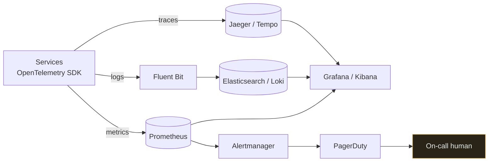

# Observability

`[INTERMEDIATE]` · Being able to answer questions about your system that you did not think to ask in advance. **An architecture you cannot debug at 3am is not finished.**

---

## 1. One-line definition

The property of a system that lets you understand its internal state from its external outputs.

## 2. Explain like I'm new

Monitoring is the dashboard in your car: speed, fuel, engine temperature. Someone decided in advance
which gauges to fit.

Observability is being able to answer *"why does it pull left when braking at 60 on a wet road?"* —
a question nobody fitted a gauge for. **Monitoring tells you something is wrong. Observability lets
you work out why.**

You need both, and most teams have only the first.

## 3. Real-world analogy

A hospital: continuous vitals (monitoring), plus the ability to order any test (observability).

**Where it breaks:** a patient can be asked where it hurts. A distributed system will not volunteer
that its 99th-percentile latency comes from one shard whose disk is failing — you have to have
instrumented it before the incident.

## 4. Technical explanation — the three pillars

| Pillar | Answers | Cardinality | Cost |
|---|---|---|---|
| **Metrics** | "How many, how fast, how often" — aggregate over time | Low; must stay low | Cheap, constant |
| **Logs** | "What exactly happened in this one case" | Unbounded | Expensive at volume |
| **Traces** | "Where did the time go across services" | High | Expensive; usually sampled |

They are not interchangeable and the failure is using the wrong one:

- Using **logs as metrics** — counting log lines to get a rate — is slow and expensive
- Using **metrics as logs** — adding a `user_id` label — is the cardinality explosion described below
- Skipping **traces** in a microservice system means you can see that a request was slow and never
  which of eleven hops caused it

### The cardinality trap

A metric with a label having `N` distinct values creates `N` time series. Labels multiply:

```
http_requests{method, status, endpoint}
     4 methods × 6 statuses × 50 endpoints  =  1,200 series      fine

add user_id (1,000,000 users)
     1,200 × 1,000,000  =  1.2 billion series                    your metrics system is dead
```

**Never put an unbounded value in a metric label** — user id, request id, email, full URL path with
parameters. Those belong in logs or traces, which are built for it. This single mistake takes down
more Prometheus installations than anything else.

## 5. Engineering at scale

**Structured logs or nothing.** `log.info("user " + id + " failed")` is unsearchable at volume.
`log.info("login_failed", user_id=id, reason="bad_password")` can be queried, aggregated and alerted
on. The cost is identical; the difference is whether the data is usable during an incident.

**Sample traces, keep all errors.** Tracing every request at scale costs more than the system it
observes. Head-based sampling (decide at the start, e.g. 1%) is cheap but misses rare failures.
Tail-based sampling (decide after seeing the whole trace, keep the slow and failed ones) costs more
and keeps what you actually need.

**Propagate a correlation ID through everything**, including asynchronous hops. A trace that stops at
the queue boundary is the most common gap in an otherwise good setup — and the queue is exactly where
work goes missing.

## 6. The problem it solves

Reducing time-to-understand during an incident, and making it possible to answer questions nobody
anticipated.

## 7. The problem it does NOT solve

Observability does not make the system reliable — it makes failure *visible*. It also does not
replace design: a system with no defined failure modes produces dashboards nobody knows how to read.
And it does not reduce alert fatigue on its own; more signals with no discipline makes that worse.

---

## 9. The stack

Role first, product second — the architecture does not change when you swap the product.

| Role | What it does | Common implementations |
|---|---|---|
| **Metrics store** | Time-series storage and query | Prometheus, VictoriaMetrics, Datadog, CloudWatch |
| **Metrics visualisation** | Dashboards, ad-hoc query | Grafana |
| **Log pipeline** | Ship, parse, enrich | Logstash, Fluent Bit, Vector |
| **Log store and search** | Index and query | Elasticsearch/OpenSearch, Loki, Splunk |
| **Log visualisation** | Search UI | Kibana, Grafana |
| **Tracing** | Distributed request timing | Jaeger, Tempo, Zipkin |
| **Instrumentation standard** | Vendor-neutral SDK and wire format | **OpenTelemetry** |
| **Alerting and routing** | Evaluate rules, page a human | Alertmanager, PagerDuty, Opsgenie |

Two notes worth having:

**"ELK" is Elasticsearch + Logstash + Kibana** — store, pipeline, UI. Elasticsearch is powerful and
expensive to run at log volume; Loki is the common lighter alternative because it indexes only labels
rather than full text.

**OpenTelemetry is the one to instrument against.** It is the vendor-neutral standard for all three
pillars, which means changing backend later is a configuration change rather than re-instrumenting
every service.



The human at the end is the point. **Every arrow into that box costs someone their sleep**, which is
the discipline that should govern what you alert on.

## 11. SLI, SLO, error budget

The vocabulary that turns "make it reliable" into a decision.

| Term | Meaning | Example |
|---|---|---|
| **SLI** | A measured indicator | Fraction of requests served < 300ms |
| **SLO** | The target for that indicator | 99.9% over 30 days |
| **SLA** | A contract, with penalties | 99.5%, or money back |
| **Error budget** | `1 − SLO` — the failure you are *allowed* | 0.1% of 30 days ≈ 43 minutes |

The error budget is the useful invention here, because it converts reliability from an argument into
arithmetic. **If the budget is unspent, you are being too cautious and should ship faster. If it is
exhausted, you stop shipping features and fix reliability.** Both directions matter; teams usually
only implement the second.

Set the SLO **below** what users currently experience but above what they would complain about. An
SLO of 100% is not a target, it is a refusal to make a decision — and it guarantees the budget is
always exhausted, so the mechanism does nothing.

## 12. Alerting

Alerting is where observability meets a human being, and it is the part most commonly done badly.

**Alert on symptoms, not causes.** "p99 latency above 1s" is a symptom — users are affected. "CPU
above 80%" is a cause that may or may not matter; a healthy batch job can pin CPU for an hour. Cause
alerts are how you train people to ignore the pager.

**Alert on burn rate, not on instantaneous failure.** A single failed request should never page.
Consuming 5% of the monthly error budget in an hour should. Burn-rate alerting catches both the fast
catastrophe and the slow leak with one rule, and it is the single biggest improvement available to
most alerting setups.

**Every page must be actionable.** If the runbook says "check whether it recovers", it should not
have been a page — make it a ticket. This is the whole of alert-fatigue prevention: a team that has
learned its pager is usually noise will miss the one that is not.

| Severity | Response | Example |
|---|---|---|
| **Page** | Wake a human now | Error budget burning fast; checkout is down |
| **Ticket** | Business hours | Disk 70% full; certificate expires in 20 days |
| **Dashboard only** | No notification | Everything else |

## 13. The four golden signals

If you instrument nothing else, instrument these four, per service:

| Signal | Why |
|---|---|
| **Latency** | Split successful from failed — fast errors otherwise flatter your average |
| **Traffic** | Demand; the denominator for everything else |
| **Errors** | Explicit failures *and* wrong-but-200 responses |
| **Saturation** | How full the constrained resource is — usually the leading indicator |

Saturation is the one people omit, and it is the one that predicts. Latency and errors tell you it
already went wrong; a queue depth or connection pool climbing tells you it is about to.

## 14. When NOT to invest more

- Before there is *any* alerting. The first alert is worth more than the third dashboard.
- Adding dashboards nobody opens. A dashboard with no owner and no question is decoration.
- Tracing everything at full sample rate — cost with no marginal benefit.
- Before failure modes are known. Instrument the things you have decided can break.

## 17. Trade-offs

| Choose | Get | Pay |
|---|---|---|
| High-cardinality metrics | Slice by anything | Metrics system collapse |
| Full trace sampling | Complete picture | Cost that can exceed the system observed |
| Long log retention | Historical investigation | Storage cost grows without bound |
| Aggressive alerting | Catch everything | Alert fatigue; the real one gets missed |
| Structured logging | Queryable, aggregatable | Slightly more effort at the call site |
| Self-hosted stack | Control, lower unit cost | You now operate a distributed system to watch your distributed system |

That last row is worth pausing on. A self-hosted Elasticsearch cluster at log volume is a substantial
system in its own right, with its own on-call burden.

## 19. Failure scenarios

| Failure | What happens | Mitigation |
|---|---|---|
| **Cardinality explosion** | Metrics backend OOMs — you go blind precisely during an incident | Label allowlists; never use unbounded values |
| Observability shares the failure | Logging goes through the service that is down | Keep the observability path independent |
| Alert fatigue | Real alerts ignored | Symptom-based, burn-rate, actionable-only |
| Trace stops at the queue | Async hops invisible | Propagate context through message headers |
| Clock skew across hosts | Traces and logs appear out of order | NTP; rely on trace spans rather than timestamps |
| Log volume cost spike | A debug log left on in production | Sampling; per-service budgets |
| Dashboard with no owner | Nobody notices it has been broken for months | Owner per dashboard; delete the rest |

## 25. Without it → With it → New problem → Next

```
Without it   →  failures are discovered by users; incidents last as long as guessing does
With it      →  failure is visible, and questions can be answered after the fact
New problem  →  cost, cardinality limits, alert fatigue, and a second system to operate
Next         →  SLOs and error budgets to decide what is worth alerting on, and
                sampling to keep the cost proportionate
```

## 28. Common mistakes

| Mistake | Why it is wrong |
|---|---|
| Unbounded label values | Cardinality explosion takes the metrics system down |
| Unstructured logs | Unsearchable at volume, which is when you need them |
| Alerting on causes | CPU spikes are usually fine; users being affected is not |
| Paging on single failures | Trains people to ignore the pager |
| No SLO | No basis for deciding what is worth waking someone for |
| Observability depending on the observed system | Both fail together |
| Trace context dropped at async boundaries | The queue is exactly where work goes missing |
| Dashboards instead of alerts | Nobody is watching a dashboard at 3am |
| No runbook link on the alert | The responder starts from zero |

## 31. Exercises

**1.** To chase one customer complaint, an engineer adds `user_id` as a label on the HTTP request
metric. Predict the next thirty minutes, and say where that data belonged.

<details><summary>Answer</summary>

The metrics backend runs out of memory and you go blind — plausibly shortly before the next real
incident, since the change was made during one. Labels multiply into time series:
`{method, status, endpoint}` might be 1,200 series, and a million user IDs makes that 1.2 billion.

Metric labels must be **bounded**; per-request identity belongs in logs or traces, which are built
for unbounded cardinality and pay for it with sampling and retention limits. See
[the cardinality trap](#the-cardinality-trap). That the observability system dies exactly when it is
needed is also the argument for keeping its path independent of the system it watches.
</details>

**2.** Latency and error rate both look normal, but the incident started ten minutes ago. Which golden
signal would have told you first?

<details><summary>Answer</summary>

**Saturation** — how full the constrained resource is. A climbing queue depth, a connection pool at
90%, a disk filling: these move *before* anything a user can feel, because the system is still
absorbing the pressure.

Latency and errors are confirmations that it already went wrong. Saturation is the only one of the
[four](#13-the-four-golden-signals) that predicts, which is why it is both the most useful and the
one teams most often omit.
</details>

**3.** Traces are complete right up to the point where a request enqueues a job, and then they stop.
What is missing?

<details><summary>Answer</summary>

Trace context is not being propagated through the message headers, so the asynchronous half of the
request is invisible and appears as a span that simply ends. The correlation ID has to travel with
the message, be read by the worker, and be attached to everything it does.

This is the most common gap in an otherwise good setup, and it is the worst possible place for one:
**the queue is exactly where work goes missing.** A trace that stops at the broker cannot answer
whether the job ran, ran twice, or is sitting in a DLQ.
</details>

**4.** Your team receives about 40 pages a week and missed the one that mattered. What changes?

<details><summary>Answer</summary>

Three rules, in order of how much they buy. **Alert on symptoms, not causes** — "p99 above 1s" means
users are affected; "CPU above 80%" is a healthy batch job as often as not. **Alert on burn rate, not
instants** — a single failed request should never page, while consuming 5% of the monthly error
budget in an hour should, and one burn-rate rule catches both the fast catastrophe and the slow leak.

Then the filter that removes most of the rest: **every page must be actionable**. If the runbook says
"check whether it recovers", it was a ticket. A team that has learned its pager is usually noise will
miss the one that is not — which is what already happened. See [§12](#12-alerting).
</details>

**5.** You have hit 100% of your SLO for three months and the error budget is untouched. The proposal
is to raise the SLO. What do you say?

<details><summary>Answer</summary>

That an unspent budget is a signal to **ship faster**, not to move the target. The error budget works
in both directions — exhausted means stop shipping features and fix reliability; unspent means you
are being more cautious than the users require and are paying for it in velocity. Teams almost always
implement only the first half.

Raising the SLO removes the slack without any user noticing an improvement, and it makes the
mechanism harsher for no return. An SLO of 100% is not a target at all, it is a refusal to make a
decision. Set it below what users currently experience and above what they would complain about.
</details>

## 32. Decision checklist

- [ ] Four golden signals per service
- [ ] Structured logs with a correlation ID
- [ ] Trace context propagated across **async** boundaries too
- [ ] No unbounded values in metric labels
- [ ] SLOs defined with error budgets
- [ ] Alerts are symptom-based, burn-rate driven, and every one is actionable
- [ ] Every alert links to a runbook
- [ ] The observability path does not depend on the system it observes
- [ ] Retention and sampling chosen against a cost budget

## 33. Related

- [Observability](../11-observability/) — how you would know any of this broke
- [Reliability](../00-foundations/reliability/) — what you are measuring
- [Availability](../00-foundations/availability/) — SLOs are how you express it
- [Latency](../00-foundations/latency/) — percentiles, and why averages hide the problem
- [Coverage gaps](../GAPS.md)
