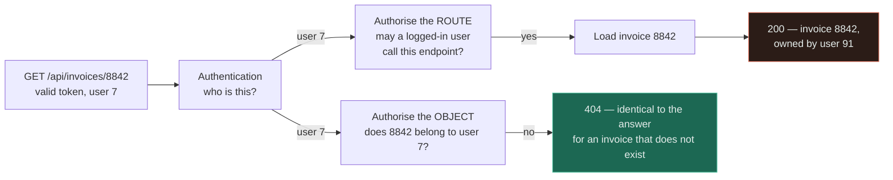

# Security

Five pages, and they are not independent. Read them in order, because each one exists to fix
something the previous one left open.

If you only read two, read [authentication](authentication/) and [API security](api-security/). The
first is the distinction the rest of the section is built on; the second is where the bugs actually
are.

---

## The distinction the whole section rests on

**Authentication asks _who is this_. Authorisation asks _what may they do_.** They are different
questions, answered by different code, at different points in the request, and they are conflated
constantly — in conversation, in framework documentation, in variable names (`auth`), and in the
middleware people write.

The conflation has a signature failure. A team builds solid authentication — hashed passwords,
MFA, short-lived tokens — bolts it on as middleware, and ships an API where any logged-in user can
read any other user's invoice by changing a number in the URL. Every control worked. Nobody was
impersonated. The data left anyway, because *authenticated* was checked and *authorised for this
object* never was.

Read off the fork: the two paths are identical until a single node, and both return `200` when the
invoice really is user 7's — so every test passes on the broken branch. Only a request for someone
*else's* record separates them, and nothing in the upper path ever asks that question.

Hold the two questions apart and most of this section becomes obvious. Let them merge and no amount
of cryptography helps.

## Read in this order

| # | Topic | Difficulty | The one thing to take away |
|---|---|---|---|
| 1 | [Authentication](authentication/) | `[I]` | Sessions are underrated. **"Stateless" is not free** — it is a revocation window you chose to accept. |
| 2 | [OAuth 2.0 + OIDC](oauth/) | `[I]` | OAuth 2.0 is **delegated authorisation, not login**. Login is OIDC, layered on top. |
| 3 | [JWT](jwt/) | `[I]` | **You cannot revoke one before it expires** without server state — which is what you adopted JWTs to avoid. |
| 4 | [API security](api-security/) | `[I]` | Authorise the **object**, not the endpoint. Broken object-level authorisation is the most common real API vulnerability. |
| 5 | [DDoS](ddos/) | `[I]` | You cannot absorb a volumetric attack yourself. Rate limiting is an **L7** control and does nothing at L3. |

The order is a dependency chain, not a difficulty ramp. Authentication produces a credential; OAuth
is how you get that credential from someone else; JWT is the format the credential usually arrives
in; API security is everything you still have to do *after* the credential checks out; DDoS is the
case where the attacker never needed a credential at all.

```mermaid
flowchart LR
    C["One request"] --> D["Absorb volumetric traffic<br/>5 · DDoS"]
    D --> RL["Reject cheaply — rate limit<br/>5 · DDoS and 4 · API security"]
    RL --> T["A credential arrives<br/>2 · OAuth obtained it<br/>3 · JWT is its format"]
    T --> AN["Who is this?<br/>1 · Authentication"]
    AN --> AZ["May they use this operation?<br/>4 · API security"]
    AZ --> OBJ["May they use it on THIS object?<br/>4 · API security"]
    OBJ --> H["Handler runs"]

    style D fill:#2a2317,stroke:#d9a441,color:#e4ecea
    style OBJ fill:#1c6853,stroke:#4fc3a1,color:#e4ecea
```

The five pages are five gates on one request, and the useful thing to read off is the ordering
constraint. Everything to the left of the credential can be pushed upstream to an edge or a gateway
and rejected before you pay for it; the last gate cannot move, because nothing upstream knows which
object the request will touch. That asymmetry is why the cheap controls are also the ones people
over-trust.

## The six confusions that cause most of the damage

If you can state each difference in one sentence, this section has done its job.

| These are not the same | The difference |
|---|---|
| **Authentication vs authorisation** | Who you are vs what you may touch. Middleware answers the first and is routinely trusted for the second. |
| **Encoding vs encryption vs signing** | Base64 hides nothing. Encryption hides content. A signature hides nothing and proves origin — **a JWT is signed, so its payload is public**. |
| **Stateless vs no state** | A self-contained token moves state onto the wire and freezes it in the past. The state did not disappear; your ability to change it did. |
| **CORS vs access control** | CORS is a rule a *browser* applies to *its own* scripts. Nothing else enforces it, and it protects nothing on your server. |
| **Rate limiting vs DDoS protection** | Rate limiting rejects a request you have already received and paid for. Volumetric attacks are won or lost upstream of you. |
| **Hashing vs encrypting a password** | If you can get the password back, so can whoever takes the database. Storage is one-way, salted, and deliberately slow. |

## What "secure" means here

Not a checklist and not a product. Three properties, and they trade against each other and against
everything else in the repository:

| Property | Question | Lives in |
|---|---|---|
| **Confidentiality** | Can only the right people read it? | [Authentication](authentication/), [API security](api-security/) |
| **Integrity** | Can only the right people change it — and can you tell? | [API security](api-security/), [JWT](jwt/) signatures, audit logs |
| **Availability** | Can they use it at all? | [DDoS](ddos/), and [reliability](../00-foundations/reliability/) |

**Availability is a security property**, which is why DDoS is in this section and not filed under
operations. An attacker who takes you offline achieved their goal without reading a single row.

## Where this sits relative to the rest

Security is not a layer you add at the end; it is a constraint that changes components you have
already chosen.

| It touches | How |
|---|---|
| [Load balancing](../03-load-balancing/fundamentals/) | TLS termination, connection limits, SYN cookies, and the first place you can shed load |
| [Caching](../04-caching/fundamentals/) | A high hit rate is a DDoS control — and caching a per-user response in a shared cache is a data leak |
| [Rate limiter](../18-implementations/rate-limiter/) | The working implementation behind the abuse-control discussion on two of these pages |
| [Observability](../11-observability/) | A 403 spike from one principal is enumeration in progress. Nobody alerts on it. |
| [Reliability](../00-foundations/reliability/) | Fail open or fail closed is a reliability decision with a security answer, and vice versa |
| [Messaging](../06-messaging/queues/) | Under attack, queueing everything instead of shedding turns a slowdown into an outage |

## What this section does not cover

Stated plainly, because an empty heading implies the question was considered:

- **TLS and transport security** — assumed throughout, not explained. Everything here presumes HTTPS
  everywhere, including between internal services.
- **Cryptographic primitives** — how AES or SHA-256 work. You should be choosing libraries, not
  algorithms, and certainly not implementing either.
- **Threat modelling as a practice** (STRIDE, attack trees) and compliance regimes (SOC 2, PCI DSS,
  GDPR). Both matter; neither is a system design decision.
- **Infrastructure and network segmentation**, container escape, supply chain. Real, large, elsewhere.
- **Secrets management** gets a section inside [API security](api-security/) rather than a page,
  because in practice the decision is never made on its own.

See [GAPS.md](../GAPS.md) for what is missing across the whole repository and
[ROADMAP.md](../ROADMAP.md) for what is planned.

## Related

- [System Design Thinking](../SYSTEM-DESIGN-THINKING.md) — the method these pages plug into
- [Trade-off Framework](../TRADEOFF-FRAMEWORK.md) — security is an axis on it, and it is always paid for
- [Design Checklist](../DESIGN-CHECKLIST.md) — the questions to ask before a design is finished
- [Foundations](../00-foundations/) — availability and reliability, which security both needs and threatens
- [Diagram notation](../19-diagrams/README.md) — the contract every diagram here obeys
- [Glossary](../GLOSSARY.md) — one-line definitions of everything
