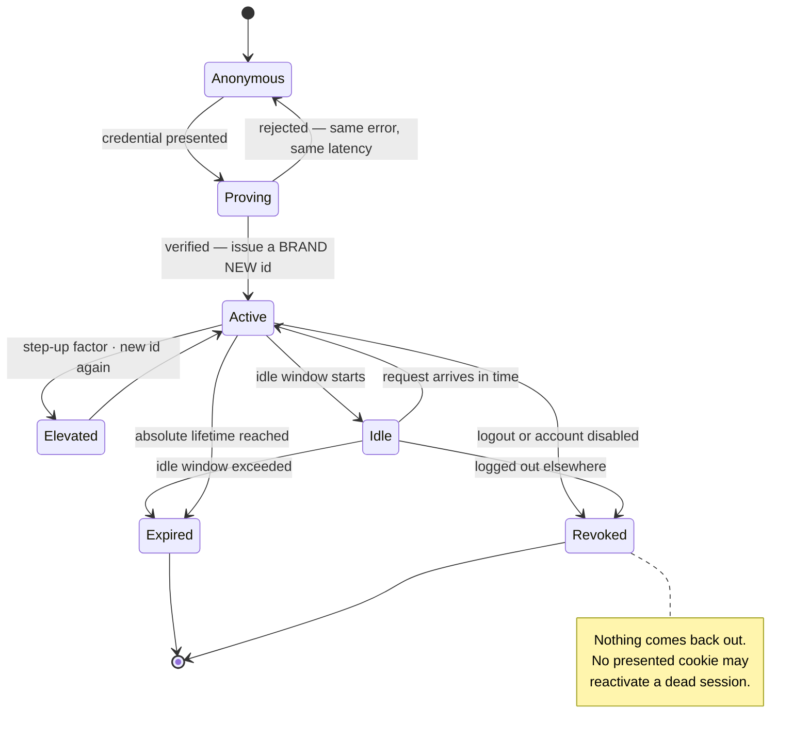
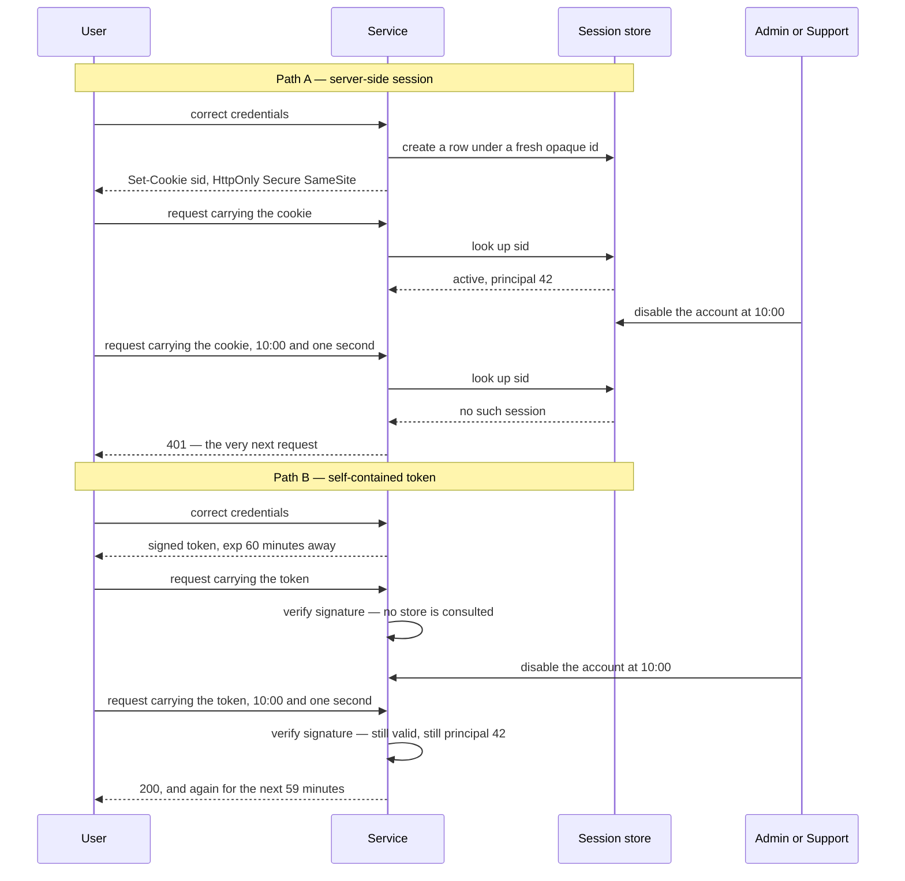
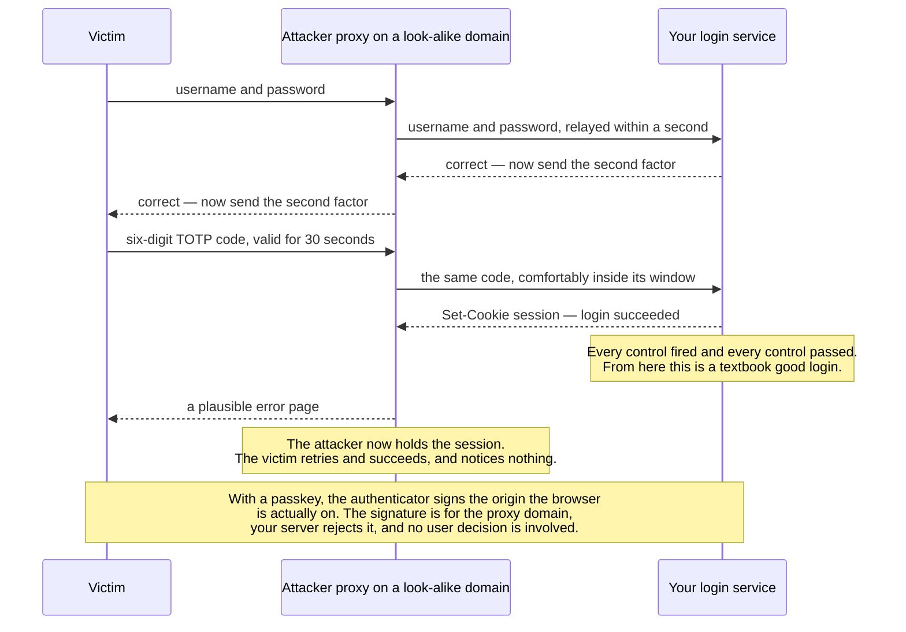
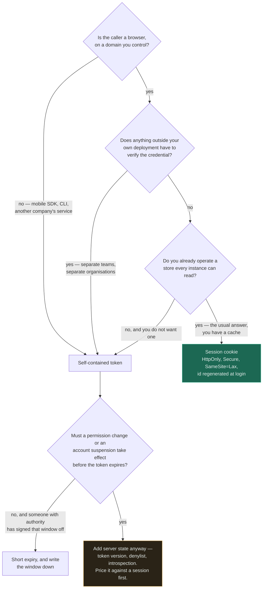

# Authentication

`[INTERMEDIATE]` · Establishing *who* is making a request — and nothing else. **Authentication and authorisation are different questions, and conflating them is the most productive source of security bugs in existence.**

---

## 1. One-line definition

The process of establishing, to a stated level of confidence, which principal a request belongs to —
and then carrying that answer forward for the rest of a session.

## 2. Explain like I'm new

Two questions get asked at every door, and people run them together:

- **Authentication** — *who are you?* You show a passport.
- **Authorisation** — *are you allowed in here?* Someone checks the passport against a list.

The passport does not admit you anywhere. It only makes the second question answerable. A system
that checks passports beautifully and then admits everyone with a passport to every room has
excellent authentication and no security.

Authentication has a second half that gets less attention and causes more incidents: having proved
who you are once, the system gives you something — a cookie, a token — so it does not have to ask
again on every click. **That something is now as good as your password**, and everything difficult
about this page follows from that sentence.

## 3. Real-world analogy

A nightclub. The bouncer checks ID at the door (authentication), then puts a wristband on you so the
bar staff do not have to re-check all night (the session).

**Where it breaks:** a wristband is physical. It cannot be worn by two people in two cities at the
same moment, and if it were, someone would notice. A stolen session cookie can be used by anyone,
anywhere, concurrently with the real user, and nothing in the protocol notices — because a bearer
credential means exactly what it says: *whoever holds it, is you*. The analogy also implies the
bouncer could tear the wristband off. In a stateless token design there is no bouncer left to do it,
which is the entire argument of the [JWT page](../jwt/).

## 4. Technical explanation

Four questions, routinely collapsed into one word, `auth`:

| Question | Name | Answered by | Failure looks like |
|---|---|---|---|
| Who is this? | **Authentication** | Credential check | Impersonation |
| What may they do? | **Authorisation** | Policy check on subject + action + **object** | A user reads another user's data |
| Who are they, durably? | **Identity** | The account record | Two accounts, one human |
| What did they do? | **Accounting / audit** | Append-only log | You cannot answer "what was taken?" |

This page owns the first. The second is [API security](../api-security/), and it is where the
breaches are.

### The factors

| Factor | Examples | Beaten by |
|---|---|---|
| Something you **know** | Password, PIN, security question | Phishing, reuse, breach lists, guessing |
| Something you **have** | Phone, hardware key, TLS client certificate | Theft, SIM swap, malware on the device |
| Something you **are** | Fingerprint, face | Cannot be rotated after compromise — this matters more than it sounds |

Security questions are a password with a smaller keyspace and public answers. They are not a factor;
they are a downgrade.

### Password storage

The rule is one sentence: **never store anything from which the password can be recovered, and make
verifying it deliberately slow.** Encryption is disqualified by the first half — encryption is
reversible, and whoever takes the database is quite likely to take the key with it.

| Approach | Verdict |
|---|---|
| Plaintext | Indefensible |
| Encrypted | Reversible by whoever has the key, and they will |
| MD5 / SHA-1 / SHA-256, unsalted | A commodity GPU does billions per second; rainbow tables do it for free |
| Salted fast hash | Defeats rainbow tables, not brute force. Still billions per second. |
| **Argon2id** | The default choice. Memory-hard, so GPUs and ASICs lose their advantage. |
| **scrypt** | Also memory-hard. Fine. |
| **bcrypt** | Fine, and everywhere. Cost ≥ 12. Note the 72-byte input truncation. |
| PBKDF2 | Only when a certification regime demands it. Not memory-hard; high iteration counts required. |

**Tune the cost to a time budget, not to a constant.** Pick roughly 100–250 ms per verification on
your production hardware and re-measure yearly, because hardware improves and your constant does
not. Salting is per-user and automatic in all three modern choices — if you are generating salts
yourself you are probably using the wrong function. A *pepper* (a secret mixed in, stored outside
the database, ideally in an HSM or secret manager) adds a real independent layer, because a
database dump alone then yields nothing.

Two small things that are wrong more often than they should be: compare hashes with a
constant-time function, and return the *same* error and the *same* latency for "no such user" as for
"wrong password" — otherwise your login endpoint is a user-enumeration API.

## 5. Engineering at scale

**Your login endpoint is a CPU-bound service wearing a web endpoint's clothes, and nobody capacity-plans it that way.**

Follow the arithmetic. At 200 ms of CPU per password verification, one core does five logins per
second. A 32-core fleet does 160 — assuming it does nothing else, which it does. Now notice who
controls that spend: an attacker sending wrong passwords pays a few hundred bytes per request and
costs you 200 ms of CPU. The asymmetry is roughly 100,000:1 in their favour, and they do not need to
guess correctly even once to take you down. Three consequences:

- **Rate limit before the KDF, not after.** The cheap check must come first, or the limiter is
  running on a machine that is already saturated. See the [rate limiter](../../18-implementations/rate-limiter/).
- **Isolate the login path** — its own pool, its own instances, or at minimum a bulkhead — so that a
  credential-stuffing run cannot starve the requests from users who are already signed in.
- Lowering the cost factor to "fix" the load is the wrong direction, and it is what happens under
  incident pressure. Decide the floor in advance and write it down.

**The latency argument for stateless tokens is weaker than it is usually presented.** Verifying an
HMAC signature is sub-microsecond; verifying an RSA signature is tens of microseconds; a session
lookup in a shared cache is around a millisecond over a network you are already crossing for
something else on the same request. A millisecond is real but it is not the reason to choose a
design. The reasons that *are* real: not wanting a shared store between services, and callers who
are not browsers. Choose on those, not on a microbenchmark.

At fleet scale the session store becomes a hot, shared, load-bearing dependency: when it is down,
nobody can log in and possibly nobody can do anything. That is a genuine cost of sessions and it
belongs in the trade table below — not hidden behind the word "stateless".

## 6. The problem it solves

Attributing a request to a principal, so that authorisation has something to decide about and the
audit log has something to name — and doing it once per session rather than once per request, so
that the expensive proof is paid for rarely.

## 7. The problem it does NOT solve

**It does not tell you what the user may do.** This is the headline and it is worth repeating in the
negative section: an authenticated request is not an authorised one, and middleware that sets
`req.user` has finished its job, not yours.

It also does not:

- **Protect the credential after issue.** Every cookie and bearer token is "whoever holds it, is
  them". Theft is not detectable by the protocol.
- **Stop phishing** — unless the factor is origin-bound. A user will type a TOTP code into a
  convincing replica of your login page, and the attacker will relay it in real time, within the
  window.
- **Stop credential stuffing.** That is rate limiting, breach-password rejection, and MFA — not
  better hashing.
- **Establish identity in the real world.** Proving control of an email address is not proving who
  someone is. Identity proofing is a different, harder, mostly non-technical problem.

---

## 9. How it works

The lifecycle, and what can go wrong at each step. Notice that only step 2 is what people usually
mean by "authentication", and the incidents cluster in 4, 5 and 6.

| # | Step | The failure that lives here |
|---|---|---|
| 1 | **Enrol** — create the account, store the verifier | Weak hashing, reversible storage |
| 2 | **Prove** — present the credential, verify it | Enumeration via error or timing differences |
| 3 | **Elevate** — second factor if required | The factor is phishable, or skippable |
| 4 | **Issue** — hand back a session artefact | Predictable ids, missing cookie flags, no rotation after login |
| 5 | **Present** — the artefact accompanies each request | Theft via XSS, CSRF, or a token in a URL |
| 6 | **End** — expiry, logout, or revocation | Logout that does not actually invalidate anything server-side |

Session fixation deserves a line of its own: **always issue a brand-new session identifier at the
moment privilege changes** — at login, and again at any step-up. Reusing the pre-login identifier
lets an attacker who planted it earlier ride the upgrade.



The transitions that are **absent** are the point. There is no arrow from `Anonymous` straight to
`Active` — every session id is minted by a verification, which is what closes session fixation. There
is no arrow out of `Expired` or `Revoked` back into `Active`; a system that lets a presented cookie
resurrect a dead session has re-implemented "log out" as a suggestion. And `Elevated` decays back to
`Active` on its own, because a step-up that never expires is just a longer session.

### Sessions versus tokens — the actual trade

This is a genuine engineering choice with a defensible answer on both sides, presented almost
everywhere as a settled question in favour of tokens. It is not settled.

| | **Server-side session** | **Self-contained token** |
|---|---|---|
| Where state lives | On the server, keyed by an opaque id | In the token, signed |
| Client holds | A meaningless random string | A readable claim set |
| **Revocation** | Delete the row. Immediate. | **Impossible before expiry** without adding server state |
| Change permissions mid-session | Takes effect on the next request | Takes effect when the token expires |
| Cost per request | One store lookup, ~1 ms, cacheable | Signature verification, microseconds |
| Scaling out | Needs a shared store | Needs a shared public key |
| Size on the wire | 32–128 bytes | 500 B – 2 KB, on **every** request |
| Data exposure | None — the id means nothing | Anyone holding it reads every claim |
| Works across orgs / services | Awkward | The actual reason to use it |
| Hard failure mode | Store down: nobody can log in | Key compromised: anyone can be anyone, for the token lifetime |



The two paths are identical up to the admin's action, and the diagram exists to place that action in
**time**. In path A the store is on the request path, so revocation lands on the next request. In
path B the store was removed from the request path — which is the whole benefit — and the same
removal is why there is nowhere for the revocation to be noticed. **Speed and revocability are the
same lookup.** You cannot delete it and keep both.

**Sessions are underrated, and "stateless" is not free.** What you buy is one lookup removed from
the request path. What you sell is the ability to change your mind — about a session, about a
permission, about a compromised account — before an expiry you set in advance. Systems that need
that ability back invariably re-add server state (a denylist, a token version, an introspection
call) and end up with a session that is larger, more complex, and slower to invalidate. If you have
one application, one domain, and a cache you already operate, a session cookie is less code and
better behaviour. Use tokens when you are crossing a boundary that a shared store cannot.

### Cookie attributes, which are the actual controls

| Attribute | Effect | Get it wrong and |
|---|---|---|
| `HttpOnly` | JavaScript cannot read it | An XSS bug becomes an account takeover |
| `Secure` | HTTPS only | The cookie leaks over any plaintext request |
| `SameSite=Lax` | Not sent on cross-site subrequests | CSRF becomes possible (`Lax` is the sane default) |
| `SameSite=Strict` | Not sent on any cross-site navigation | Inbound links land the user logged out |
| `SameSite=None` | Sent everywhere; requires `Secure` | Only for deliberate cross-site flows, with CSRF tokens |
| `__Host-` prefix | Forces `Secure`, no `Domain`, `Path=/` | Without it, a subdomain takeover can set your cookies |
| `Max-Age` / expiry | Bounds the damage window | "Remember me" for a year is a year of stolen-cookie validity |

### MFA — and the only property that matters

| Factor | Phishing-resistant | Notes |
|---|---|---|
| SMS one-time code | **No** | SIM swap, SS7 interception, delivery failure. Still far better than nothing. |
| Email code / magic link | **No** | Security reduces to the user's email account |
| TOTP app | **No** | Real-time relay works within the 30-second window |
| Push approval | **No** | MFA-fatigue attacks: spam prompts until someone taps accept. Number matching helps. |
| **Passkey / WebAuthn** | **Yes** | The credential is bound to the origin and will not sign for a look-alike domain |
| **Hardware security key (FIDO2)** | **Yes** | Same mechanism, separate physical device, resistant to device malware |

**Only origin-bound factors resist phishing.** Everything above the line moves a secret that a
convincing website can simply ask for. This is not a small distinction — it is the difference
between raising the cost of an attack and removing a whole class of it.



What to read off is the direction of every arrow: nothing is forged and nothing is replayed out of
order, so no server-side check has anything to fail on. TOTP is a secret converted into a short
string, and a convincing page can simply ask for a string. The last note is the only line in the
diagram that breaks the relay, and it does so by binding the credential to something the proxy
cannot lie about.

Then the part that undoes all of it: **account recovery is the real MFA bypass.** If "lost my
device" drops back to an emailed link, your authentication strength is the strength of that email
account, and every hour of MFA design was spent building a door next to an open window.

## 13. When to use it

- **Server-side session cookie** — the default for any first-party browser application on one
  domain. `HttpOnly`, `Secure`, `SameSite=Lax`, rotated at login.
- **Self-contained token** — many services with no shared session store; callers that are not
  browsers; anything crossing an organisational boundary. See [JWT](../jwt/).
- **Federated login (OIDC)** — when you would rather not own passwords at all, which is usually the
  right instinct. See [OAuth and OIDC](../oauth/).
- **MFA** — offer it universally, require it for anything privileged: admin consoles, payment
  changes, exports, permission grants.
- **Step-up authentication** — re-prove immediately before a dangerous action rather than making
  every session paranoid.



The tree is shaped the way it is because **the question is never "which is more modern"** — it is
whether a credential has to be verified by something you do not deploy. Notice that the amber node
is where most token migrations actually land: having removed the shared store, you add a smaller one
back, which is a defensible design but a different one from the one that was proposed.

## 14. When NOT to

- **Do not write your own** password reset, MFA enrolment, or session management if a maintained
  library or identity provider will do it. These are solved, subtle, and unrewarding to get wrong.
- **Do not choose tokens because they are modern.** One domain, one app, a cache already in the
  stack: a session is simpler and revocable. Choose the trade deliberately.
- Do not implement SSO or an identity protocol from the specification. Use a certified library.
- Do not add MFA before you have rate limiting and breach-password rejection — those are cheaper and
  stop more attacks per hour of engineering.
- Do not authenticate internal service calls with a shared static secret in an environment variable
  and call it done — see mTLS and workload identity, and [secrets](../api-security/).

## 17. Trade-offs

| Choose | Get | Pay |
|---|---|---|
| Server-side sessions | Instant revocation; nothing leaks in the cookie | A shared store on the critical path of every request |
| Self-contained tokens | No shared store; verify anywhere | No revocation before expiry; claims stale on arrival |
| Long session lifetime | Users stay logged in | A long window for any stolen credential |
| Short session lifetime | Small theft window | Refresh machinery, and users who get logged out mid-task |
| Higher KDF cost | Offline cracking gets much harder | Login CPU cost, and a sharper DoS surface |
| MFA required everywhere | Credential theft alone is not enough | Support load, lockouts, and a recovery flow that becomes the weak point |
| Passkeys only | Phishing largely eliminated | Device loss handling, and users who are not ready |
| Federated identity (OIDC) | You never store a password | Hard dependency on a provider; their outage is your outage |

## 18. Why not?

| Alternative | Why not here | When it WOULD win |
|---|---|---|
| **Session cookie** | Needs a shared store; awkward across domains and non-browser clients | First-party web app on one domain — the majority case |
| **Self-contained token ([JWT](../jwt/))** | Cannot be revoked before expiry; payload is readable | Service-to-service, federation, genuinely stateless edges |
| **Delegated identity ([OIDC](../oauth/))** | Adds an external hard dependency to every login | You do not want to own passwords, MFA, or recovery — usually right |
| **API keys** | Long-lived, no user context, get committed to repositories | Server-to-server where the caller is a machine, scoped and rotatable |
| **mTLS / client certificates** | Certificate distribution and rotation is real work | Internal service-to-service; high-assurance clients |
| **Magic links** | Security reduces to the email account; links leak via forwarding | Low-risk products where password fatigue is the bigger problem |
| **Passwordless / passkeys only** | Recovery and device loss are the hard part | Consumer products willing to invest — the direction of travel |
| **No authentication** | Only viable when there is genuinely nothing to protect | Public read-only content. It belongs in the table; **if your options list has no "do nothing" row, you have not finished thinking.** |

## 19. Failure scenarios

| Failure | What happens | Mitigation |
|---|---|---|
| **Session store down** | Nobody can log in; possibly everyone is logged out at once. A cache-shaped dependency turns out to be load-bearing. | Replicate it; treat it as a tier-1 store, not a cache; decide fail-open vs fail-closed *before* the incident |
| **Credential stuffing** | Millions of breached pairs replayed; a small percentage work | Per-account and per-IP limits, breach-list rejection, MFA, device signals |
| **Password spraying** | One common password against many accounts — invisible to per-account limits | Per-IP and global anomaly detection, not just per-account counters |
| **Session token stolen (XSS)** | Full account takeover, indistinguishable from the real user | `HttpOnly` cookies, CSP, and never storing tokens where JavaScript can read them |
| **Session fixation** | Attacker plants an id pre-login and inherits the session | Regenerate the session id at every privilege change |
| **Logout does nothing** | User clicks logout; the token still works for another hour | Server-side invalidation, or accept and document the window |
| **KDF cost too high under load** | Login CPU saturates; a login flood becomes an outage | Rate limit ahead of the KDF; isolate the login path |
| **Recovery flow bypasses MFA** | The strongest factor is skipped by "lost my device" | Recovery must be at least as strong as the primary path |
| **Timing / error difference** | Login becomes a user-enumeration endpoint | Identical responses and comparable latency for both failure modes |

## 25. Without it → With it → New problem → Next

```
Without it   →  every request is anonymous; there is nobody to authorise and
                nobody to hold responsible for anything that happens
With it      →  requests carry a verified principal, and authorisation finally
                has something to make a decision about
New problem  →  the proof is now a bearer artefact — a cookie or a token that
                works for whoever holds it — and it must be stored, expired,
                rotated and revoked
Next         →  session or token strategy, then object-level authorisation,
                because knowing who someone is says nothing at all about what
                they may touch
```

That last line is the step teams skip, and it is why [API security](../api-security/) exists. See
[the chain](../../SYSTEM-DESIGN-THINKING.md#part-1--the-chain).

## 28. Common mistakes

| Mistake | Why it is wrong |
|---|---|
| Treating "authenticated" as "authorised" | The single most common source of data exposure in real APIs |
| Encrypting passwords instead of hashing | Reversible. Whoever takes the database usually takes the key |
| Fast hashes (SHA-256) for passwords | Billions of guesses per second on commodity hardware |
| Rolling your own salt handling | A signal you are using the wrong primitive; modern KDFs do it for you |
| Different errors for "no such user" and "wrong password" | Free user enumeration |
| Session id not regenerated at login | Session fixation |
| Tokens in `localStorage` | Any XSS is an account takeover; an `HttpOnly` cookie is not readable |
| No revocation path at all | "Log out all devices" turns out to be impossible after launch |
| SMS as the only second factor | SIM swap, and it is phishable in real time |
| Recovery weaker than the primary path | Your MFA is exactly as strong as the weakest way back in |
| Rate limiting after the password hash | The limiter runs on an already-saturated machine |
| One session lifetime for everything | Admin actions and a reading session do not deserve the same window |

## 29. Monitoring

Track failed logins along **two** dimensions, because each one is blind to a different attack:
per-account failures catch brute force against one user, per-IP failures catch a scanner, and
neither catches distributed password spraying — for that you need the global failure *ratio*, which
is the signal that actually moves during an attack.

Also worth an alert: successful logins from a new device, region, or ASN; password reset volume,
which spikes during account-takeover campaigns; MFA enrolment coverage as a trend rather than a
number; login endpoint p99 and CPU, since that is your denial-of-service canary; and — quietly the
most useful — **KDF verification latency**, because if it suddenly halves, somebody lowered the cost
factor to make a graph look better. See [observability](../../11-observability/).

## 31. Exercises

Reason these through before opening the answers. Each one has a defensible alternative view; the
answers say which trade is being made, not merely what to do.

**1.** A team migrates from session cookies to JWTs "to become stateless". Two weeks later Support
asks for a "log out all devices" button and Legal asks that a disabled employee lose access
immediately. What has to be built, and what is left of the original justification?

<details><summary>Answer</summary>

Both requests need revocation, and a self-contained token has none. The realistic options are a
per-user token version or `not-before` timestamp checked on every request (one integer per user —
cheap, and it revokes every token that user holds at once), a `jti` denylist held until each entry's
expiry, or introspection on every request.

All three are server state on the read path. The first is small and bounded; the third *is* a
session with more moving parts and a slower lookup. So the honest position after the migration is
that statelessness was not achieved — what was actually bought is a *smaller* piece of shared state
than a full session store, in exchange for accepting that any change you do not explicitly encode as
a version bump stays stale until the token expires.

The residual justification is real but narrower than the original pitch: services can verify a
caller offline with a public key, without a shared session store. If every service was already
talking to the same cache, even that is worth little.
</details>

**2.** Your login endpoint verifies passwords with bcrypt at cost 12, roughly 250 ms of CPU. You
have 40 cores. An attacker sends 5,000 login attempts per second from a botnet, all with wrong
passwords. What happens, and where exactly does the fix go?

<details><summary>Answer</summary>

40 cores at 250 ms each is about 160 verifications per second. At 5,000 attempts per second the
queue grows without bound; CPU pins at 100%; every request on those machines — including from
already-authenticated users — slows and then times out. No password was guessed and the service is
down.

The fix goes **before** the hash: reject at the edge or in a limiter that costs microseconds, keyed
on account and on IP, and ideally shaped so a per-account counter survives an IP rotation. Cheap
rejection first is the general principle — the same one that governs the whole
[DDoS](../ddos/) discussion, and this is a logic-layer DDoS.

Two things that are *not* the fix: lowering the cost factor (that permanently weakens offline
cracking resistance to solve an online availability problem) and autoscaling (you scale into the
attacker's bill). Isolating the login path so it cannot starve the rest of the fleet is a good
second layer, because it converts a total outage into a degraded login experience.
</details>

**3.** A colleague argues that storing a JWT in `localStorage` is more secure than a session cookie
because it eliminates CSRF. Is that true, and what did the change actually trade?

<details><summary>Answer</summary>

It is true that a token read from `localStorage` and attached manually is not sent automatically by
the browser, so classic CSRF does not apply. But CSRF was traded for XSS token theft — and that is a
bad trade in both directions.

An `HttpOnly` cookie cannot be read by injected JavaScript at all; a `localStorage` token can be
read and exfiltrated by a single line of it. With a cookie, an XSS bug lets an attacker *act as* the
user while the page is open; with `localStorage`, they take the credential and use it later, from
anywhere. Meanwhile CSRF already has cheap, complete mitigations: `SameSite=Lax` (now the default in
most browsers) plus a synchroniser token.

So: an unsolved-by-default problem was traded for a solved-by-default one. The strong pattern is an
`HttpOnly`, `Secure`, `SameSite` cookie — and if you want a token format inside it, that is allowed.
The cookie is transport; JWT is format; people argue as if choosing one excluded the other.
</details>

**4.** You require TOTP for all users. An attacker sets up a proxy that renders a pixel-perfect copy
of your login page, forwards whatever the victim types to you in real time, and captures the
resulting session. Which of your controls fired, and what would actually have stopped this?

<details><summary>Answer</summary>

None of them fired, and none of them could. The victim authenticated correctly — right password,
valid TOTP code, inside its window — with an attacker in the middle relaying it. From your server's
point of view this is a textbook successful login. TOTP is a shared secret converted to a short-lived
code, and a code is exactly the thing a convincing page can ask for.

What stops it is an **origin-bound** factor: WebAuthn or a passkey signs a challenge that includes
the origin the browser is actually on, and the authenticator will not produce a signature for
`login.exarnple.com`. The user cannot be talked into overriding this, which is the point — the
defence does not depend on the user noticing anything.

Weaker partial mitigations exist and are worth having: binding the session to a device or client
certificate, flagging logins from unfamiliar ASNs, and shortening the code window. They raise cost.
Only origin binding removes the class.
</details>

## 33. Related

- [Security overview](../README.md) — the section index, and the authN/authZ distinction in one place
- [OAuth 2.0 + OIDC](../oauth/) — delegating authentication to someone who does it for a living
- [JWT](../jwt/) — the token format, and why revocation is its unsolved problem
- [API security](../api-security/) — the authorisation half, which is where the incidents are
- [DDoS](../ddos/) — the login endpoint is a favourite target, for CPU rather than credentials
- [Rate limiter](../../18-implementations/rate-limiter/) — working code for the control this page keeps invoking
- [Reliability](../../00-foundations/reliability/) — fail open or fail closed, decided in advance
- [Observability](../../11-observability/) — how you would notice any of this
- [Glossary: rate limiting](../../GLOSSARY.md#rate-limiting) · [idempotency](../../GLOSSARY.md#idempotency)
