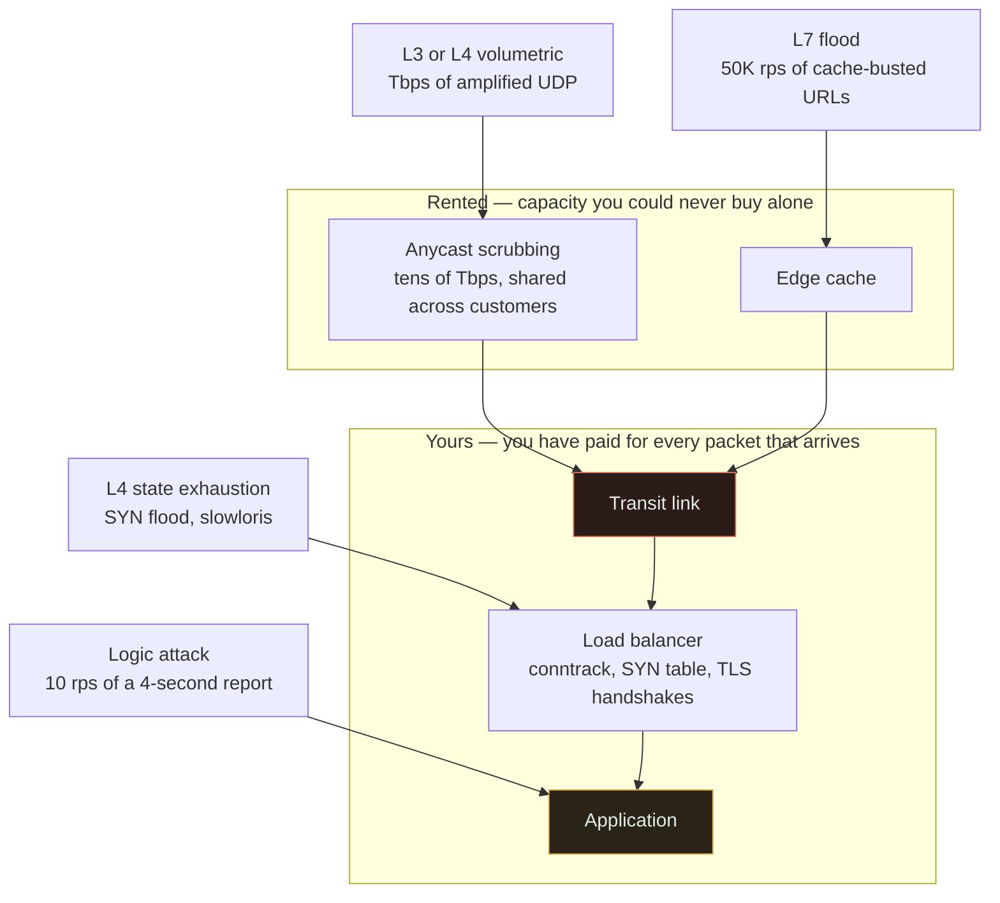
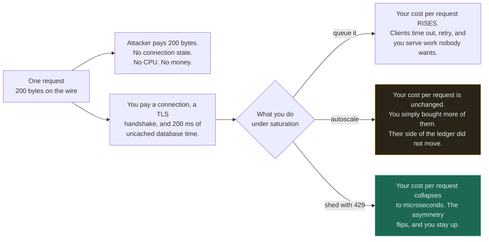
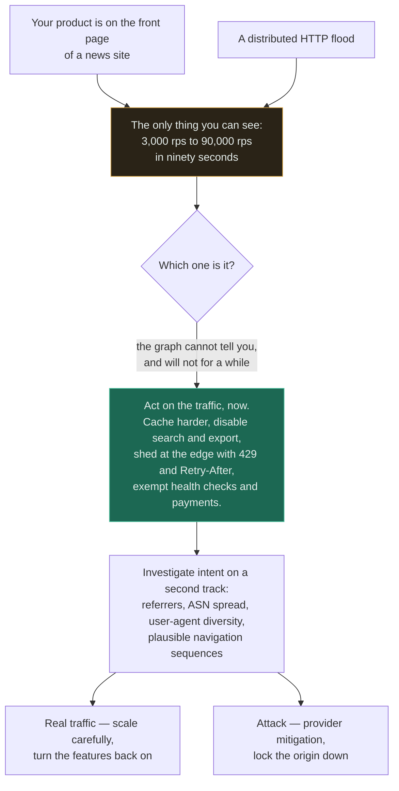
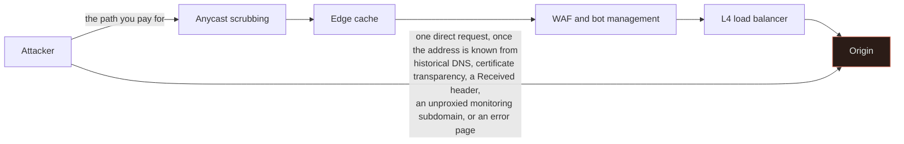

# DDoS — Distributed Denial of Service

`[INTERMEDIATE]` · You cannot absorb a volumetric attack yourself; the pipe fills before your code runs. **The only two real defences are somebody else's much larger network, and making each request cheap enough that you win the cost asymmetry.**

---

## 1. One-line definition

An attack that exhausts a finite resource — bandwidth, connection state, CPU, memory, or a
downstream quota — until legitimate requests cannot be served.

## 2. Explain like I'm new

A thousand people phone the pizza shop and ask questions. Nobody who wants a pizza can get through.
Every phone works perfectly. The staff are competent. The shop is nonetheless closed for business.

There are only two ways out. Get ten thousand phone lines — which you rent from someone who already
has them, because you are not going to install them this afternoon. Or answer each call in one
second instead of five, so a thousand callers stop being enough to jam you.

That is the entire subject. Everything below is detail about which of those two you are doing, at
which layer, and what each one costs.

## 3. Real-world analogy

A motorway at rush hour. Too many vehicles for the road; nobody gets anywhere; no vehicle is
individually at fault.

**Where it breaks:** congestion has no adversary. Traffic does not observe your contraflow and
adapt. An attacker watches exactly what you block and changes within minutes — switching from one
URL to another, from cached paths to uncached ones, from a flood to a slow trickle of expensive
queries. **Every mitigation is a move in a game, not a fix.**

The analogy misleads a second time, and this one costs people their first hour: on a motorway you
can see it is congestion. **An application-layer attack looks exactly like a traffic spike.** A
product launch, a link on the front page of a news site, and a distributed HTTP flood produce the
same graph, and often you cannot tell which you have until well after you must act.

## 4. Technical explanation

### The layers, which decide who can defend

| Layer | Attack | Measured in | Typical scale | Where it must be stopped |
|---|---|---|---|---|
| **L3/L4 volumetric** | UDP flood; amplification and reflection via DNS, NTP, memcached, CLDAP | Gbps, Mpps | 100 Gbps to multiple Tbps | **Upstream of you. Always. There is no other option.** |
| **L4 state exhaustion** | SYN flood, ACK flood, connection hold | Connections, packets/s | Fills conntrack and socket tables at modest bandwidth | Edge and load balancer: SYN cookies, connection caps, timeouts |
| **L7 application** | HTTP flood, slowloris, cache-buster query strings, expensive search | Requests/s **and cost per request** | 50K rps of `/search?q=<random>` | Your edge, then your application |
| **Logic / resource** | Login flood against a slow password hash, report generation, unbounded pagination, catastrophic regex backtracking | **CPU-seconds per request** | 10 rps can be fatal | Your application design — nothing else can help |



Each attack arrow points at the component that **runs out first**, not at where the packets enter,
and the two arrows that reach inside the lower box are the ones no purchase can fix. The red node is
the reason volumetric defence has to be rented: everything downstream of a full link is irrelevant.
The amber node is the reason the bottom row of the table above exists — the logic attack arrives as
ordinary, well-formed, authenticated traffic and every layer above waves it through.

**The number that matters is not requests per second. It is cost asymmetry:** what one request costs
the attacker versus what it costs you. An attacker spending 200 bytes to trigger a 200 ms uncached
database query holds an advantage of roughly five orders of magnitude and does not need a botnet at
all — a single laptop will do. This is why the bottom row exists and why it is the row most teams
never consider. Ten requests per second can take down a service, and no scrubbing provider will
notice, because there is nothing anomalous about the traffic.

Amplification is the same principle at L3. A 60-byte DNS query that returns a 4,000-byte answer is a
70× amplifier; spoof the source address and the answer goes to your victim. That is how modest
botnets produce terabit attacks, and why the fix has to live where the bandwidth is.

### Why rate limiting does not help at L3

Rate limiting is an **L7 control**. Your limiter runs in your application, or at best on your load
balancer — which means the packet has already traversed your transit link, been processed by your
kernel, and consumed a slot in your connection table. **You cannot rate-limit a packet you have
already paid to receive.** If the attack is 400 Gbps and your uplink is 10 Gbps, your uplink is
full; what your software decides afterwards is irrelevant, because 97% of legitimate packets never
arrived either.

Rate limiting is genuinely valuable — against L7 abuse, credential attacks, scraping and the logic
attacks above. It is simply the wrong tool one layer down, and conflating the two produces the most
expensive misconception in this topic: a team that believes it is protected because it has a
limiter.

### Why an edge provider is not optional for volumetric attacks

A scrubbing network works through two properties you cannot replicate:

- **Anycast.** One IP address announced from dozens or hundreds of points of presence. An attack
  from a globally distributed botnet is split by internet routing itself, so each site handles a
  fraction rather than any one site handling the whole.
- **Aggregate capacity.** Tens of terabits, paid for once and shared across every customer. Attack
  capacity is a shared-cost good; buying your own would cost more than your company.

This is why "we will filter it at our firewall" fails. The firewall is behind the link that is
already full.

## 5. Engineering at scale

**Your cache hit rate is a DDoS control.** Follow the arithmetic: if your origin handles 20,000 rps
and the edge serves 95% of requests, a 200,000 rps flood arrives at the origin as 10,000 rps — and
you survive without noticing. Drop the hit rate to 50% and the same attack delivers 100,000 rps and
you are down. This is why attackers append random query strings (`?cb=8471`) — it is a
one-character change that converts every request into an origin miss. Configure the edge to ignore
or normalise unknown query parameters for cache keys, and that particular move stops working. See
[caching](../../04-caching/fundamentals/).

**Autoscaling is not a defence. It is a payment plan.** Scaling out under attack converts an outage
into an invoice — "economic denial of sustainability" — and it does not even reliably work, because
your database connection pool, your third-party quotas and your licence limits do not scale with
your web tier. Set a maximum. Prefer shedding to scaling. An honest 429 costs almost nothing to
serve; an autoscaled fleet grinding through attack traffic costs money *and* still fails.



Read the two branches off the same node: only one of them changes the **ratio**, which is the only
quantity that decides the outcome. Autoscaling and queueing both accept the attacker's price per
request and try to buy more capacity at yours; shedding is the only move that makes a request cheap
for you while staying exactly as expensive for them. This is also why "fix the expensive endpoint"
outranks every purchase on this page — it moves the same ratio, permanently.

**Shed load, and shed it in the right order.** Under saturation the instinct is to queue, and
queueing is the classic amplifier: latency climbs, clients time out and retry, the queue grows with
work whose requesters have already left, and the system spends 100% of its capacity on requests
nobody is waiting for. Reject early instead, and reject selectively — see
[queues](../../06-messaging/queues/) for why an unbounded buffer turns a slowdown into an outage.

A degradation ladder, decided in advance and ideally behind a flag you can flip in seconds:

| Step | Action | Users notice |
|---|---|---|
| 1 | Serve more from cache; extend TTLs | Slightly stale content |
| 2 | Disable expensive features: search, export, recommendations | Some functions unavailable |
| 3 | Serve stale-while-revalidate for everything cacheable | Older content |
| 4 | Static, fully-cached page for anonymous traffic; sessions preserved for logged-in users | Read-only site |
| 5 | 429 with `Retry-After` at the edge; keep health checks and the payment path alive | Site effectively down, but recoverable and cheap |

**Rehearse it.** A DDoS runbook that has never been executed is a document, not a control. The
things that fail in a real event are always the same: nobody has the provider's emergency contact,
the "enable mitigation" toggle needs an approval, and the origin firewall rules were never tested.

## 6. The problem it solves

Keeping a service usable while somebody is actively and adaptively trying to make it unusable — and,
more mundanely, surviving the legitimate traffic spike that looks identical.

## 7. The problem it does NOT solve

- **It is not a breach.** No data is taken. Treating a flood as an intrusion sends the wrong people
  to the wrong dashboards. Keep the caveat that it is sometimes deliberate cover for something else,
  and keep one person watching the security signals while everyone else fights the traffic.
- **Mitigation cannot tell an attacker from a user.** Every control — CAPTCHA, JavaScript challenge,
  IP block, rate limit, geo-fence — rejects some real users. **You are choosing a false-positive
  rate whether or not you admit it**, and the people it hits hardest are on mobile networks, shared
  NAT, corporate proxies, older devices and assistive technology.
- **An application-layer attack looks exactly like a traffic spike.** You often cannot distinguish
  them in the first ten minutes, and here is the useful part: **the correct first action is the same
  either way** — protect the origin, shed cheaply, serve what you can from the edge. Build for the
  spike and you have largely built for the attack.



The two causes converge on one observable and then diverge again only *after* you have already
acted, which is the practical point: the branch you cannot resolve is not on the critical path. Read
the green node as the answer to "what do I do in minute one" and the split at the bottom as the
answer to "what do I do in minute twenty". Building for the spike and building for the attack are
the same project, because the first two nodes are shared.
- **It does not fix an origin that is one 20-rps endpoint away from death.** If a single expensive,
  uncached, unbounded endpoint can be triggered by anyone, no amount of scrubbing helps. That is an
  application design problem wearing a DDoS costume.
- It does not remove the dependency you just took on an edge provider, which now sees all your
  traffic, terminates your TLS, and can have an outage of its own.

---

## 9. How it works — the defence stack, outside in

| Position | Control | Stops | Costs you |
|---|---|---|---|
| **Anycast network + scrubbing** | Absorb and filter volumetric traffic across many PoPs | L3/L4 floods, amplification | Provider fee; all traffic transits a third party |
| **Edge cache / CDN** | Serve without touching the origin | L7 floods against cacheable content | Staleness; defeated by cache busting unless keys are normalised |
| **WAF / bot management** | Signatures, JS challenges, CAPTCHA, fingerprinting, reputation | Patterned L7 floods, commodity tooling | False positives, accessibility harm, and it is bypassable by anyone determined |
| **L4 load balancer** | SYN cookies, connection caps, header and body timeouts | State exhaustion, slowloris | Tuning; genuinely slow clients get dropped |
| **Application rate limiting** | Per-account, per-key, per-endpoint, cost-weighted quotas | Targeted abuse, credential stuffing, scraping | Only applies after the request reaches you |
| **Application design** | Bounded work per request, timeouts everywhere, no unbounded pagination, cheap error paths | Logic attacks — the ones nothing else catches | Engineering effort, permanently |
| **Origin hiding** | Origin only accepts traffic from the edge provider's ranges, or requires mTLS from it | Direct-to-origin bypass of everything above | Firewall discipline; the leaks are subtle |

**Origin hiding is the step people forget, and it invalidates every row above it.** If your origin
IP is reachable directly, an attacker simply skips the entire stack. The address leaks through
historical DNS records, mail headers from your own servers, certificate transparency logs,
misconfigured subdomains, and error pages that echo an internal hostname. Lock the origin firewall to
the provider's published ranges and verify from outside that nothing else answers.



The lower arrow is the whole diagram: it is one hop, it costs nothing, and it renders the four boxes
above it decorative. This is why origin hiding belongs in the same conversation as the provider
contract rather than as a hardening task afterwards — and why the verification step is *from
outside* your network, because from inside, everything answers.

Two smaller items worth naming because they take services down on their own: **your DNS is part of
the attack surface** — a provider-level DNS outage takes you offline with your servers perfectly
healthy — and **stateful middleboxes saturate before your application does**. Connection tracking
tables, TLS handshake capacity and database connection pools all have hard limits that are much
lower than your bandwidth.

## 13. When to invest

- **Anything internet-facing gets the cheap baseline, always.** Put an edge in front, cache what is
  cacheable, set timeouts on everything, bound the work any single request can cause, and lock the
  origin to the edge. That is a few hours of work and it removes most of the risk.
- **Target classes need more:** gaming, gambling, crypto, media, politics, anything with an
  aggrieved competitor or an ideological opponent. Attacks are cheap to rent and often personal.
- **When downtime has a price you can state.** If an hour costs real money, the provider fee is
  arithmetic rather than a judgement call.
- **Before a known event** — a launch, a sale, an election, a court ruling. Attacks are scheduled
  around attention.
- **When one endpoint is expensive and public.** Fix the endpoint, then limit it, in that order.

## 14. When NOT to

- **Internal services with no internet exposure.** Spend on access control instead; a service behind
  private networking has no attack surface to scrub.
- **Before you have timeouts and bounded work.** Buying scrubbing to protect an unbounded endpoint
  is paying a third party to defend a self-inflicted wound; ten legitimate users will still take you
  down.
- **Do not build your own scrubbing.** You cannot buy enough bandwidth for this to make sense.
- **Do not add CAPTCHA everywhere pre-emptively.** It is a permanent tax on real users, an
  accessibility problem, and commercial solvers defeat it for a fraction of a cent per solve. Keep
  it as a lever for when you are actually under attack.
- **Do not geo-block by default.** It is the crudest control available, it blocks customers and VPN
  users, and botnets are everywhere anyway.

## 17. Trade-offs

| Choose | Get | Pay |
|---|---|---|
| Edge provider / scrubbing | Volumetric attacks stop being your problem | Fee; a third party terminates your TLS and sees all traffic; their outage is yours |
| Aggressive rate limits | Abuse is expensive and bounded | Real users on shared IPs are rejected; you own that false-positive rate |
| CAPTCHA / JS challenge | Filters commodity tooling cheaply | Accessibility harm, conversion loss, solvable for money |
| Autoscaling under load | Absorbs genuine spikes | Scales into the attacker's bill and hides the real problem |
| Load shedding | Predictable survival; cheap | Deliberately serving errors to some real users |
| Aggressive caching | Enormous origin protection | Staleness, and cache-buster attacks if keys are not normalised |
| Origin hiding | The whole defence stack cannot be bypassed | Ongoing discipline; one leaked record undoes it |
| Long connection timeouts | Tolerant of slow mobile clients | Slowloris-style attacks become cheap |

## 18. Why not?

| Alternative | Why not here | When it WOULD win |
|---|---|---|
| **Filter at your own load balancer** | It sits behind the link that is already saturated | L7 filtering and connection limits — genuinely useful, just not for volumetric |
| **ISP blackhole (RTBH)** | Drops *all* traffic to the target address — the attacker's goal, achieved by you, for free | The absolute last resort to protect other services sharing your transit |
| **Overprovision bandwidth** | Attacks scale far faster and cheaper than your budget | Small, predictable spikes; not attacks |
| **IP allowlisting** | Impossible for a public service | Internal or partner APIs — excellent there |
| **Proof-of-work challenge** | Costs real users battery and time; asymmetry is weaker than it looks | Bot-heavy endpoints where a small friction is acceptable |
| **CAPTCHA everywhere** | Permanent tax on humans; cheaply solved at scale | As a temporary lever during an active attack |
| **Do nothing** | Honest for a hobby project with no revenue and no users to disappoint | Genuinely low-stakes services. **If your options table has no "do nothing" row, you have not finished thinking.** |

## 19. Failure scenarios

| Failure | What happens | Mitigation |
|---|---|---|
| **Origin IP discovered** | The attacker bypasses every layer you pay for and hits the servers directly | Firewall to provider ranges only; audit DNS history, certificate transparency, mail headers |
| **Attack moves to an uncached path** | Cache hit rate collapses; the origin takes the full load within seconds | Normalise cache keys; rate-limit uncacheable paths harder; be ready to shed |
| **Attack targets the login endpoint** | Each request costs 200 ms of password-hashing CPU; 200 rps is enough | Limit before the hash; isolate the login path — see [authentication](../authentication/) |
| **Mitigation blocks real users** | Support queue explodes; the "fix" causes the visible damage | Measure the false-positive rate; start with the least invasive control; have a rollback |
| **Autoscaling absorbs the attack** | You stay up and receive an enormous bill | Hard maximums; alert on scale-out rate, not just on errors |
| **DNS provider is the target** | Your servers are perfectly healthy and unreachable | Two DNS providers; sensible TTLs; do not point everything at one anycast set |
| **Stateful component saturates first** | Connection tracking or the database pool fills at a fraction of your bandwidth | Know each component's real ceiling; test to it, not to the network limit |
| **Edge provider outage** | Your protection layer is a single point of failure and it is down | Accept it explicitly, or keep a tested path to serve directly at reduced capacity |
| **It was not an attack** | You shed load and blocked regions during a successful marketing campaign | Baselines and provenance data; check referrers before assuming malice |
| **Retry storm from your own clients** | Your mobile app amplifies a blip into an outage | Exponential backoff with jitter, and a circuit breaker — see [reliability](../../00-foundations/reliability/) |

## 25. Without it → With it → New problem → Next

```
Without it   →  a single cheap flood makes the service unavailable to everyone,
                and no amount of application code helps once the link is full
With it      →  volumetric traffic dies at somebody else's edge, and expensive
                requests are shed before they ever reach the origin
New problem  →  every control has a false-positive rate, so you are now
                rejecting some real users — and the edge provider is a new
                dependency that sees all your traffic and can fail on its own
Next         →  load shedding and graceful degradation, because the last line of
                defence is your own service deciding what to stop doing
```

See [the chain](../../SYSTEM-DESIGN-THINKING.md#part-1--the-chain).

## 28. Common mistakes

| Mistake | Why it is wrong |
|---|---|
| **Believing rate limiting protects against volumetric attacks** | The packets arrived and were paid for before your limiter ran |
| Planning to filter it at your own firewall | The firewall is behind the link that is already full |
| Leaving the origin publicly reachable | Every layer you pay for is bypassed with one direct request |
| Autoscaling as the plan | You scale into the attacker's bill, and the database does not scale with you |
| Queueing instead of shedding | Latency climbs, clients retry, capacity is spent on requests nobody is waiting for |
| No bound on the work one request can cause | Ten requests per second becomes an outage; scrubbing cannot see it |
| Treating a flood as a data breach | Wrong responders, wrong dashboards, wasted first hour |
| CAPTCHA everywhere, permanently | Taxes real users daily; solved commercially for a fraction of a cent |
| Ignoring DNS | Your servers can be perfectly healthy and completely unreachable |
| No baseline traffic data | "Is 40,000 rps a lot?" is unanswerable, and you will be arguing about it during the incident |
| A runbook nobody has executed | The provider contact, the approval and the firewall rule all fail at once |
| Assuming a spike is an attack, or that an attack is a spike | They look identical; act on the traffic, investigate the intent in parallel |

## 29. Monitoring

You need a **baseline** before anything else, because every question during an incident reduces to
"is this a lot?" and that is unanswerable without last Tuesday's graph.

Then watch three things that are usually collapsed into one: **bandwidth** (Gbps — the L3 signal),
**request rate** (rps — the L7 signal), and **cost per request** (CPU-seconds, database time — the
logic-attack signal, and the only one that catches an attack running at 10 rps). An attack that
moves between layers shows up as one of these rising while the others stay flat.

Watch the **origin's** request rate, not the edge's — the edge number is reassuring and irrelevant,
since the whole point is what got through. Track distinct clients alongside total requests: the same
rps from 50 sources and from 50,000 need different responses. Alert on the 429 rate, on cache hit
rate falling, and on scale-out events. And measure **time to mitigate** as the headline metric,
because you cannot prevent these and MTTR is the number you can actually improve — the same
reasoning as in [reliability](../../00-foundations/reliability/). See
[observability](../../11-observability/) for the golden signals this plugs into.

## 31. Exercises

**1.** Traffic to your API jumps from 3,000 to 90,000 rps in ninety seconds. The origin is
struggling. You cannot tell whether it is an attack or a viral link. What do you do first, and why
does the ambiguity matter less than it seems?

<details><summary>Answer</summary>

Do the same thing either way, immediately: protect the origin. Raise cache TTLs and cache more
aggressively at the edge, turn off the expensive optional features (search, recommendations,
exports), and start shedding at the edge with a cheap 429 and a `Retry-After` rather than letting
requests queue. Keep health checks and the payment path exempt.

The ambiguity matters less than it seems because **the correct first action does not depend on
intent.** Ninety thousand requests per second that the origin cannot serve is the same operational
problem whether the requesters are enthusiastic or hostile, and every action above is one you would
want during a genuine success. This is the practical argument for treating spike-readiness and
DDoS-readiness as the same project.

Investigate intent in parallel, on a second track: referrers (a viral link has one; a botnet does
not), the distribution of source ASNs and geographies, user-agent diversity, whether requests
follow plausible navigation sequences, and whether they concentrate on one expensive endpoint. If
it is real traffic you will want to scale carefully and turn features back on. If it is an attack
you will want provider mitigation and origin lockdown. But you will know within twenty minutes, and
you will still be up when you find out.
</details>

**2.** Your team has a well-tested rate limiter: 100 requests per minute per IP, enforced in
application middleware. Someone argues this makes you DDoS-resistant. Give the two independent
reasons they are wrong.

<details><summary>Answer</summary>

**Reason one — the layer.** The limiter runs after the packet crossed your transit link, was
processed by your kernel, occupied a connection slot and reached your application. Against a 400
Gbps volumetric flood your uplink is saturated and legitimate packets are dropped by physics
upstream of anything you control. **You cannot rate-limit a packet you have already paid to
receive.** Volumetric defence has to live where the bandwidth is, which is an anycast network you
rent.

**Reason two — the key.** Per-IP limiting assumes an attacker has few addresses and that real users
have distinct ones. Both assumptions are wrong. A botnet has tens of thousands of source addresses,
each comfortably under 100 requests per minute, which sums to millions per minute while never
tripping the rule. Meanwhile a corporate NAT, a mobile carrier gateway or a university presents
thousands of real users as one address — so the rule you set to stop attackers is mainly hitting
customers. IPv6 makes it worse: a single host is routinely delegated a /64.

What the limiter is genuinely good for: targeted abuse of specific endpoints keyed on **account or
API key** rather than IP, credential stuffing, scraping, and cost control. Those are real and
valuable. They are simply a different problem from the one being claimed.
</details>

**3.** Your service sits behind a major CDN with DDoS protection. You are hit by a 300 Gbps attack
and go down anyway. The CDN's dashboard shows normal traffic throughout. What happened, and how do
you confirm it?

<details><summary>Answer</summary>

The attacker found your origin IP and went straight to it. The CDN's dashboard is honest — nothing
unusual passed through the CDN, because none of the attack did.

Confirm it by looking at where the traffic actually arrived: your origin's own interface counters
and your hosting provider's network graphs will show the flood, while the CDN's do not. That
mismatch is diagnostic on its own.

Then find the leak, because there always is one and it is rarely exotic:

- Historical DNS records from before you adopted the CDN, permanently archived by passive DNS services
- Certificate transparency logs, which publish every hostname you request a certificate for —
  including `origin.example.com` and `staging.example.com`
- Mail sent directly from your application servers, carrying the origin IP in `Received` headers
- Subdomains not proxied through the CDN — a monitoring endpoint, an old API host, an FTP record
- Error pages or headers that echo an internal hostname or address

The fix is not a new IP on its own, because the same leak will expose the new one. Rotate the origin
address **and** close the leak **and** configure the origin firewall to accept traffic only from the
CDN's published ranges — or better, require an authenticated pull, such as mTLS or a shared secret
header, so that knowing the address is not sufficient. Then verify from outside your network that
nothing answers directly.
</details>

**4.** An endpoint generates a PDF report. It takes 4 seconds of CPU, is not cached, and is
available to any authenticated user. You have 200 cores. How much traffic does an attacker with one
account need, and which of the seven rows in §9 helps?

<details><summary>Answer</summary>

200 cores at 4 seconds each is 50 reports per second at absolute saturation, with nothing left for
any other request. Realistically, sustained 25 rps against this endpoint consumes half your fleet;
50 rps takes the whole service down. **One authenticated user on a home connection can produce
50 rps of small POST requests without effort** — this is well under a megabit of upload.

Which rows help:

- **Anycast/scrubbing:** no. The traffic volume is trivial; there is nothing anomalous to filter.
- **Edge cache:** no, the responses are per-user and uncacheable — though caching *identical* report
  requests briefly would help against a naive attacker.
- **WAF/bot management:** barely. The requests are well-formed, authenticated, and look legitimate.
- **L4 limits:** no. A handful of connections.
- **Application rate limiting:** yes, and it must be **cost-weighted** — one report should consume
  the same quota as several hundred ordinary requests. A flat "100 requests per minute" allows 100
  reports per minute, which is still fatal.
- **Application design:** yes, and this is the real fix. Make the work asynchronous: accept the
  request, enqueue it, return a job id, and process it on a bounded worker pool with a per-user
  concurrency limit of one. The endpoint becomes cheap, the expensive work becomes schedulable, and
  the blast radius is a slow queue rather than a dead site. See
  [queues](../../06-messaging/queues/) and [workers](../../06-messaging/workers/).
- **Origin hiding:** irrelevant to this attack.

The lesson is the one from §4: **cost asymmetry, not request rate.** No amount of edge protection
addresses an endpoint that lets any caller spend four seconds of your CPU for free, and this is the
category of attack that scrubbing providers will never see.
</details>

## 33. Related

- [Security overview](../README.md) — the section index; availability is a security property
- [API security](../api-security/) — rate limiting as an abuse control, and where it stops working
- [Authentication](../authentication/) — the login endpoint is a favourite target, for CPU not credentials
- [Rate limiter](../../18-implementations/rate-limiter/) — working code and measured behaviour
- [Load balancing](../../03-load-balancing/fundamentals/) — SYN cookies, connection caps, and the first shed point
- [Caching](../../04-caching/fundamentals/) — hit rate is a DDoS control; cache busting is an attack
- [Queues](../../06-messaging/queues/) — why queueing under overload amplifies an outage
- [Reliability](../../00-foundations/reliability/) — retry storms, backoff, jitter, and MTTR as the metric
- [Observability](../../11-observability/) — you cannot answer "is this a lot?" without a baseline
- [Glossary: rate limiting](../../GLOSSARY.md#rate-limiting) · [retry storm](../../GLOSSARY.md#retry-storm)
