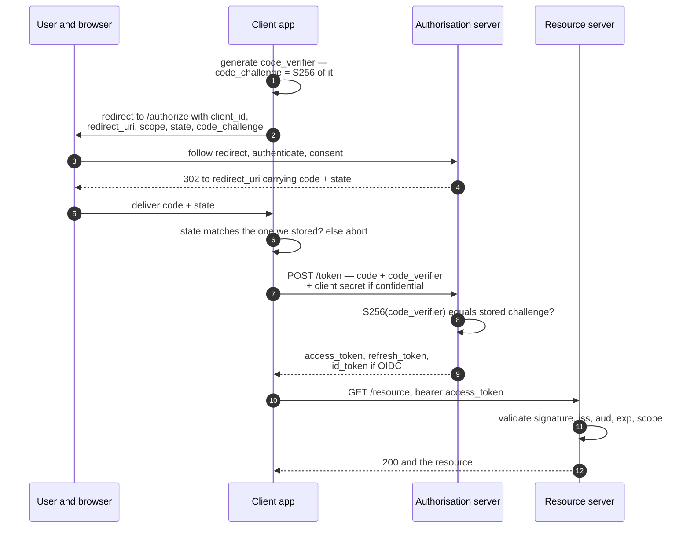

# OAuth 2.0 and OpenID Connect

`[INTERMEDIATE]` · A **delegated authorisation** framework. It answers "may this application act on my behalf?" — never "who is this person?". **Treating OAuth 2.0 as a login protocol is the defining mistake of this topic; login is OIDC, a separate layer sitting on top.**

---

## 1. One-line definition

OAuth 2.0 lets a resource owner grant a third-party application scoped, expiring, revocable access
to their data on another service, without ever giving that application their credentials. **OpenID
Connect (OIDC)** is a thin standard layer on top that adds an **ID token**, which is the part that
actually authenticates a user.

## 2. Explain like I'm new

Before OAuth, an app that wanted to import your contacts asked for your email password. You typed
it in. That app now had your password — permanently, for everything, with no way to give it back
except changing the password everywhere.

OAuth replaced that with a redirect. You go to the provider, log in *there*, and see a screen saying
"this app wants to read your contacts". You approve. The app receives a token that reads contacts,
expires, and can be switched off — and never sees your password.

Now the part that trips everyone. That token says **what the app may do**. It does not say who you
are, and it was not designed to. It is a key, not an ID card. Systems that treat the key as an ID
card have a real, exploitable bug — which is why OIDC exists and why it added a separate token whose
entire job is to say who you are, to a named audience.

## 3. Real-world analogy

A hotel valet key. It starts the engine and opens the driver's door. It does not open the boot or
the glovebox, it stops working when you check out, and the valet never touches your house keys.

**Where it breaks:** a valet key is a physical object held by one person at a time. An access token
is a string — copy it and you are the valet, from anywhere, silently. The analogy misleads in a
second and more important way: handing over a valet key tells the car park attendant nothing
whatsoever about *who you are*. That is precisely the property people forget when they build a login
button on top of OAuth alone.

## 4. Technical explanation

### The four roles

| Role | Who | Note |
|---|---|---|
| **Resource owner** | The user | The only one who can grant consent |
| **Client** | The application requesting access | **Confidential** (has a server, can keep a secret) or **public** (SPA, mobile, CLI — cannot keep anything) |
| **Authorisation server (AS)** | Issues tokens; owns login and consent | Now on the critical path of every sign-in you have |
| **Resource server (RS)** | The API holding the data | Validates the token; usually not the same service as the AS |

### The three tokens, and who each one is for

Getting these wrong is the source of most real OAuth bugs.

| Token | Audience | Format | Sent to | Purpose |
|---|---|---|---|---|
| **Access token** | The resource server | Opaque **or** JWT — the client must not care | The API | Authorises a call. Short-lived: 5–15 minutes. |
| **Refresh token** | The authorisation server | Opaque | Only the AS | Obtains a new access token without re-prompting |
| **ID token** (OIDC only) | **The client** | Always a JWT | Nowhere — the client consumes it | Asserts *who the user is*, with an `aud` naming this client |

**The ID token is not an API credential and the access token is not proof of identity.** Sending an
ID token to an API in an `Authorization` header is the most common form of this confusion; the
second is a client parsing an access token, which it has no business doing because the format is the
resource server's concern and may change without notice.

### Grant types, with verdicts

| Grant | Use for | Verdict |
|---|---|---|
| **Authorisation code + PKCE** | Every user-facing app: web, SPA, mobile, desktop | **The default. Use this and stop reading the others.** |
| **Client credentials** | Machine-to-machine, no user involved | Correct for its case |
| **Device authorisation** | TVs, consoles, CLIs — no browser or keyboard | Correct for its case |
| **Refresh token** | Renewing access silently | Necessary; rotate, and detect reuse |
| ~~Implicit~~ | — | **Dead.** Returned tokens in the URL fragment: browser history, referrers, logs. Removed in OAuth 2.1. |
| ~~Resource owner password credentials~~ | — | **Dead.** The client handles the password, which defeats the entire purpose of the framework. |

OAuth 2.1 is a consolidation rather than a new protocol, and its changes are a good summary of two
decades of incidents: PKCE required for *all* clients including confidential ones, implicit and
password grants removed, exact string matching on redirect URIs, and refresh tokens either rotated
or sender-constrained.

### Scopes are not an authorisation model

A scope is a coarse label on the *delegation*: "this application may read calendars". It says
nothing about **which** calendar this user may read. That decision is yours, it belongs on the
object, and no token can make it for you.

| Question | Answered by |
|---|---|
| Is this token valid and unexpired? | Signature and claim validation |
| Was this application granted calendar access? | **Scope** |
| Is this *user* allowed to read *calendar 8842*? | **Your authorisation logic**, on the object — see [API security](../api-security/) |

Teams that treat `scope: calendar.read` as the access check ship broken object-level authorisation
on day one.

## 5. Engineering at scale

**Validating tokens is the decision that scales or does not.** Two strategies, and a rarely-stated
third:

| Strategy | Latency | Revocation | Cost |
|---|---|---|---|
| **Local validation** of a signed JWT | Microseconds | **None until expiry** | Cache the JWKS; nothing per request |
| **Introspection** (RFC 7662) — ask the AS on every request | A network hop, every request | Immediate | The AS is now on your read path, at your full request rate |
| **Introspect and cache for N seconds** | Amortised | Within N seconds | The honest middle. State the window. |

Almost everyone lands on the third and pretends it is the first. That is fine, provided the
staleness window is written down and agreed, because it is the same trade as a
[cache TTL](../../04-caching/fundamentals/) and it has the same failure mode.

Three operational details that cause outages:

- **JWKS fetching.** Cache the key set aggressively and refresh on a schedule. If you fetch on every
  unknown `kid`, an attacker sends a stream of tokens with random `kid` values and you denial-of-
  service your own identity provider — from inside your own fleet. Rate-limit your own refresh and
  cache negative results.
- **The AS is a new single point of failure.** Every login in the company now depends on it. Its
  availability multiplies into yours, exactly as in the
  [availability chain](../../00-foundations/availability/). Existing sessions surviving an AS outage
  is a design choice you should make explicitly — long-lived access tokens degrade gracefully; short
  ones plus a dead AS logs out the world in fifteen minutes.
- **Token lifetime is a dial between two failures.** Long: a stolen token stays useful and revocation
  lags. Short: your AS takes the refresh traffic of the entire fleet, which is a load you must
  actually size. Five to fifteen minutes is conventional; the number should come from your incident
  response target, not from a blog post.

## 6. The problem it solves

The password anti-pattern — third-party applications collecting user credentials for a service they
do not own, gaining permanent, unscoped, unauditable, unrevocable access. OAuth replaces that with
delegation that is **scoped, expiring, revocable, and individually auditable per application**.

Secondarily, and this is why it ended up everywhere: it gives you one place where authentication,
MFA and consent happen, instead of one per application.

## 7. The problem it does NOT solve

**It is not authentication.** An access token proves that *some* authorisation server granted *some*
client access to *some* resource. It contains no verifiable statement about who the user is *to
you*. The classic exploit — token substitution — follows directly. The attacker registers a
perfectly ordinary-looking application with the provider and gets a victim to sign in to it. That
application now holds a valid access token **for the victim's account**. The attacker replays that
token to your "log in with X" endpoint; your server calls the provider's `/userinfo` with it, is
truthfully told it belongs to the victim, and signs the attacker in as them. Nothing was forged. The
token was valid — it was simply never meant for you, and you had no way to tell.

**This is what the ID token's `aud` claim fixes**, and it is the reason OIDC had to exist rather
than being a convention. An ID token names the client it was minted for. An access token does not.

OAuth also does not:

- Give you an **authorisation model for your own data** — scopes are coarse; object-level checks are yours
- Protect a bearer token in transit or at rest — anyone holding it can use it
- Make a client trustworthy; consent is a user decision, and users approve everything
- Solve **logout**. Killing a session at the AS does not invalidate access tokens already issued.
  OIDC back-channel logout exists, is optional, and is patchily implemented.
- Remove your dependency on an identity provider. It creates one.

---

## 9. How it works — the authorisation code flow with PKCE

This is the one place in this section where a diagram earns its place: the security of the flow is
entirely about **which leg carries which secret, and in what order**.



**The whole reason for the two legs is that the front channel is not trustworthy.** Steps 2 to 5
travel through the user's browser: visible in the address bar, in history, in referrer headers, in
proxy logs. So the front channel carries only a short-lived, single-use *code* — useless on its own.
The token itself comes back over step 7, a direct server-to-server call the browser never sees.

Each parameter in that flow is a patch for a specific attack:

| Parameter | Without it |
|---|---|
| `state` | Login CSRF: an attacker's code is exchanged into the victim's browser session, silently linking the victim's account to the attacker's |
| **PKCE** (`code_challenge` / `code_verifier`) | A malicious app registered for the same mobile URI scheme, or anything that can read the redirect, steals the code and redeems it. PKCE binds the code to the client that started the flow. |
| Exact `redirect_uri` matching | An open redirect or a wildcard match exfiltrates the code to an attacker-controlled host |
| Single-use, ≤60 s codes | Replay |
| `nonce` (OIDC) | ID token replay — the nonce ties the token to this specific authentication request |

PKCE was invented for mobile apps that cannot keep a secret, and OAuth 2.1 now requires it
everywhere — because it turns out a stolen code is a stolen code regardless of client type.

## 13. When to use it

- **A third party needs access to user data you hold.** This is the case OAuth was designed for; do
  not invent anything else.
- **Single sign-on across many applications** — one login, one MFA policy, one place to disable a
  leaver. Use OIDC, not raw OAuth.
- **"Sign in with Google/GitHub/Apple"** — again OIDC. You will never store a password, which is
  worth a great deal.
- **Mobile and SPA clients against your own API**, when you already operate an authorisation server.
- **Machine-to-machine**, via client credentials, when you want short-lived scoped tokens instead of
  static API keys that live in configuration for six years.

## 14. When NOT to

- **A single first-party web application with one backend.** A session cookie is a few lines of
  configuration. OAuth here is a distributed system introduced to solve a cookie problem, and you
  will spend the next year debugging redirect URIs.
- **Do not implement an authorisation server.** Use a certified product or a maintained library.
  This specification has a decade of published attacks against subtly wrong implementations.
- **Do not use OAuth alone for login.** Use OIDC — see §7, which is the whole point of this page.
- Do not use it to authorise your own internal service calls where mTLS or a service mesh identity
  is simpler and stronger.
- Do not use it as your permission system. Scopes are labels, not policy.

## 17. Trade-offs

| Choose | Get | Pay |
|---|---|---|
| Delegated authorisation | Third parties never see a password; access is scoped and revocable | Redirect flows, consent screens, and a protocol to get right |
| OIDC over your own login | No password storage, no MFA to build, no recovery flow | Hard dependency on a provider; their outage is your outage |
| Local JWT validation | Microsecond checks, no AS on the read path | No revocation until expiry |
| Introspection | Immediate revocation | A network call per request; the AS must scale to your full rate |
| Short access tokens | Small window for a stolen token | Refresh traffic, and a dead AS logs everyone out quickly |
| Long access tokens | Survives an AS outage | Revocation lag measured in hours |
| Many fine-grained scopes | Precise delegation | Consent screens users cannot read, so they approve everything |

## 18. Why not?

| Alternative | Why not here | When it WOULD win |
|---|---|---|
| **Session cookie** | Does not cross organisations or work for third-party clients | One app, one domain, first-party — the majority of software |
| **API keys** | Static, unscoped, no user context, and they end up in Git | Server-to-server, when scoped and rotatable |
| **SAML** | XML, heavier, browser-centric, painful for mobile and APIs | Enterprise SSO where the identity provider already speaks it — still very common |
| **mTLS / workload identity** | Certificate distribution is real work; no user consent model | Internal service-to-service; strongest option there |
| **Minting your own JWTs** | You have written an authorisation server with none of the review | You are the only party involved and the tokens never leave your trust boundary |
| **Password sharing** | Listed only so the table is honest: this is what OAuth replaced | Never |

## 19. Failure scenarios

| Failure | What happens | Mitigation |
|---|---|---|
| **Authorisation server down** | Nobody can log in anywhere. New tokens cannot be issued; existing ones expire on schedule and the outage widens over time. | Multi-region AS; decide deliberately how long existing sessions survive |
| **Access token treated as identity** | Token substitution: a token minted for another application is accepted as proof of your user | Use the OIDC ID token and **verify `aud`** |
| **`state` not validated** | Login CSRF; the victim's account is linked to the attacker's | Store `state` in the session, compare on callback |
| **Wildcard or loose `redirect_uri`** | Authorisation code exfiltrated to an attacker host | Exact registered string matching, no wildcards, no path suffixes |
| **Refresh token stolen** | Indefinite access, renewed forever, invisible in your login metrics | Rotation with reuse detection: presenting an old one revokes the whole family |
| **JWKS unreachable or rotated early** | Every token fails validation at once — a total outage from a key-management event | Cache keys, overlap old and new during rotation, alert on validation failure rate |
| **`kid` flood** | Unknown key ids trigger a JWKS fetch per request; you DoS your own identity provider | Rate-limit refreshes, cache negative lookups |
| **Consent phishing** | A malicious app with a plausible name obtains real, user-approved scopes. Nothing was broken; the user said yes. | App review, publisher verification, admin consent for sensitive scopes, and periodic grant review |
| **No logout propagation** | A revoked user keeps working until the access token expires | Short access tokens; back-channel logout where supported; accept and document the window |

## 25. Without it → With it → New problem → Next

```
Without it   →  third-party apps ask users for their password and obtain
                permanent, unscoped, unrevocable access to everything
With it      →  scoped, expiring, revocable delegated access, and the password
                never leaves the identity provider
New problem  →  a distributed system: an authorisation server on the critical
                path of every login, tokens to validate, keys to rotate, and a
                framework that says nothing about identity unless you add OIDC
Next         →  the token format and its validation rules — which is JWT — and
                then object-level authorisation, because a scope is not a
                permission on a row
```

See [the chain](../../SYSTEM-DESIGN-THINKING.md#part-1--the-chain).

## 28. Common mistakes

| Mistake | Why it is wrong |
|---|---|
| **Using OAuth 2.0 as a login protocol** | An access token is not an identity assertion. Use OIDC and check `aud`. |
| Calling `/userinfo` with an access token and calling it authentication | Accepts a token minted for a different application — the classic token substitution attack |
| Skipping `state` | Login CSRF, and account linking hijacks |
| Skipping PKCE because "we are a confidential client" | OAuth 2.1 requires it for everyone; a stolen code is a stolen code |
| Wildcards in `redirect_uri` | Code exfiltration via open redirect |
| Client parsing the access token | The format belongs to the resource server and can change without warning |
| Treating scopes as permissions | Coarse delegation labels, not per-object policy |
| Long-lived access tokens "to reduce load" | Trades your revocation window for a saving you have probably not measured |
| Never rotating refresh tokens | A single theft grants indefinite access with no detection |
| Storing tokens in `localStorage` | Any XSS is a full account takeover |
| Implementing the AS yourself | A decade of published attacks against subtly wrong implementations |

## 29. Monitoring

The signal that matters is **token validation failures, split by reason**. Expired is routine and
mostly noise; *bad signature*, *wrong issuer* and *wrong audience* are attack signals and should
alert separately. Bundling them into one counter is how the interesting failure hides inside the
boring one.

Also: authorisation server latency and error rate, since it is on the login path for everything;
refresh token reuse detections, each of which is a probable theft; consent grants to newly
registered applications, which is how consent phishing looks in a graph; unknown `kid` rate as an
early warning for both rotation problems and probing; and the ratio of authorisation requests
started to codes redeemed — a sudden drop means the redirect leg is broken somewhere you cannot see.
See [observability](../../11-observability/).

## 31. Exercises

**1.** A team builds "Sign in with Acme". Their backend receives an access token from the mobile
app, calls Acme's `/userinfo` endpoint with it, gets back `{"sub": "u_1234", "email": ...}`, and
signs the user in. Describe the attack, then say precisely which claim would have prevented it.

<details><summary>Answer</summary>

The attacker registers an innocuous application with Acme — a wallpaper app, a leaderboard, anything
with a "Sign in with Acme" button — and gets the victim to use it. Nothing malicious has happened
yet: the victim consented, and the attacker's app holds a valid Acme access token **for the victim's
account**, scoped to whatever they approved.

The attacker then sends *that* token to the vulnerable backend as if it were their own login. The
backend calls `/userinfo`, Acme honours the token and truthfully returns the victim's profile, and
the backend signs the attacker in as the victim.

The root cause: **an access token has no audience the resource-consuming party can check.** It was
issued for the attacker's app, but there is nothing in it saying so that the victim server verifies.
Any valid token from anywhere is accepted.

The fix is the OIDC **ID token** and its **`aud`** claim, which contains the `client_id` it was
minted for. Reject any ID token whose `aud` is not you, and the attacker's token is refused
regardless of how valid it is elsewhere. Also verify `iss`, `exp`, the signature against the
provider's JWKS, and the `nonce` you sent.

The general lesson generalises past OAuth: *valid* and *intended for me* are different questions,
and only the second one is a security check.
</details>

**2.** PKCE exists to protect public clients that cannot keep a secret. Your web app is a
confidential client with a server-side secret. OAuth 2.1 still requires PKCE. Why is the original
justification not the whole story?

<details><summary>Answer</summary>

The client secret protects the **token** request. PKCE protects the **code** — and the code travels
through the browser, where the client secret gives it no protection at all.

Concretely: the authorisation code lands on your redirect URI as a query parameter. It can leak via
the `Referer` header if the landing page loads a third-party resource, via browser history, via a
proxy or CDN access log, via an open redirect on your own domain, or via an error page that echoes
the URL. If an attacker obtains that code before you redeem it, the only remaining barrier is your
client secret — which is a single static value shared across your whole fleet, quite possibly
present in a container image and in three CI systems.

PKCE adds a per-request secret. The verifier exists only in the memory of the flow that started it,
is never transmitted on the front channel, and cannot be replayed. It converts code theft from
"sometimes sufficient" to "useless", and it does so without depending on the confidentiality of a
long-lived shared secret.

There is also an operational argument: one flow for every client type is one flow to review, test
and get right. Conditional security requirements are the ones that get dropped.
</details>

**3.** Your API validates JWT access tokens locally using the provider's public key. Security asks
for immediate revocation when an employee is offboarded. You are handling 40,000 requests per
second. Introspection on every request is not viable. What do you propose, and what remains true
about the window?

<details><summary>Answer</summary>

Layer the answer instead of choosing one option.

First, shorten access tokens to five minutes and make the refresh path the enforcement point. The
refresh call hits the authorisation server, which is stateful and *can* refuse — so disabling the
account stops renewal immediately and the worst case becomes the remaining life of one already-issued
token.

Second, add a cheap revocation check to the read path that is not a per-request network call: a
per-user token version or `not-before` timestamp, replicated into a local cache your services already
consult. One integer per user, invalidated on offboarding, checked in microseconds. At 40,000 rps
this is affordable; introspection is not.

Third, be honest in writing about the residual window. Local validation plus a cached revocation
signal gives revocation in *cache-propagation time*, not zero. Quote the number — usually seconds —
and let the risk owner accept it. A stated five-second window that everyone understands beats a
claimed zero that is actually fifteen minutes.

Note what this really is: **server state on the request path**. The stateless property was traded
away the moment revocation became a requirement, and the design work is choosing the smallest piece
of state that satisfies it.
</details>

**4.** Someone proposes replacing session cookies with OAuth for a single internal admin tool used
by 30 people, hosted on one domain, backed by one service. Argue both sides, then decide.

<details><summary>Answer</summary>

**For:** it removes password storage, MFA and account recovery from a tool nobody wants to maintain.
Offboarding happens in one place — disable the directory account and access ends everywhere. The 30
people already log in to the identity provider daily, so it is also better UX. If the organisation
has an identity provider, this is close to free and genuinely reduces the number of credential
stores that can be breached.

**Against:** if there is no identity provider yet, this proposal is "stand up and operate an
authorisation server" wearing a smaller hat. That is a new single point of failure for a tool used by
30 people, plus redirect URI configuration per environment, plus token validation, plus a dependency
your admin tool now has during an incident — which is exactly when you need the admin tool.

**Decision:** if an identity provider already exists, use OIDC — the marginal cost is a library and
a redirect URI, and centralised offboarding on an *admin* tool is worth real money. If one does not
exist, a session cookie behind the corporate network with MFA at the network edge is the proportionate
answer, and you revisit when the second internal tool appears. The deciding question is not "which is
more secure" but "does the authorisation server already exist and who is already paying to run it".
</details>

## 33. Related

- [Security overview](../README.md) — the section index
- [Authentication](../authentication/) — what OIDC delegates, and what you keep either way
- [JWT](../jwt/) — the format ID tokens always use and access tokens usually use
- [API security](../api-security/) — scopes are not object-level authorisation, which is the next problem
- [Caching](../../04-caching/fundamentals/) — introspection caching is a TTL decision with the usual trade
- [Availability](../../00-foundations/availability/) — the authorisation server multiplies into every login
- [Observability](../../11-observability/) — validation failure rate, split by reason
- [Glossary](../../GLOSSARY.md)
