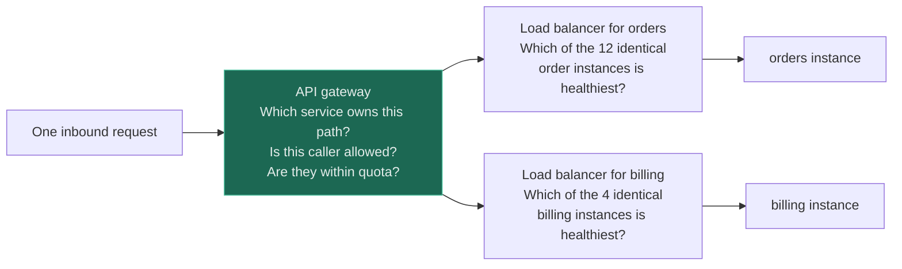
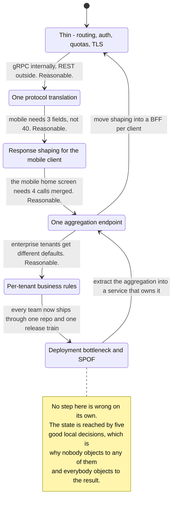
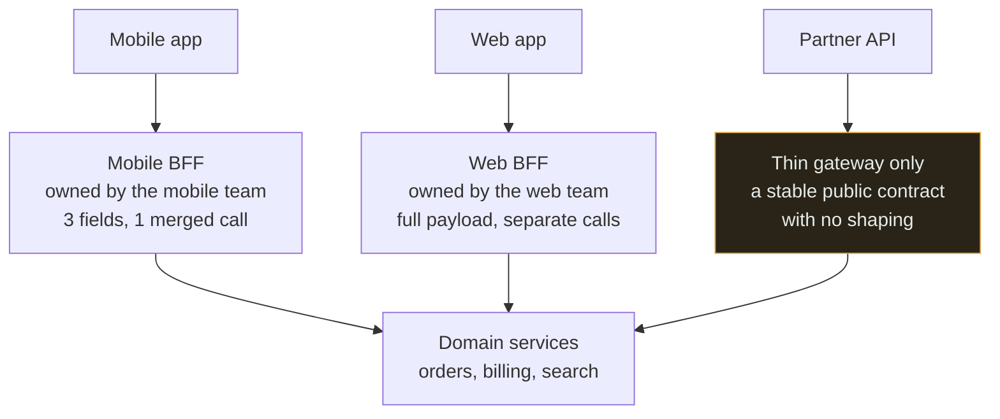
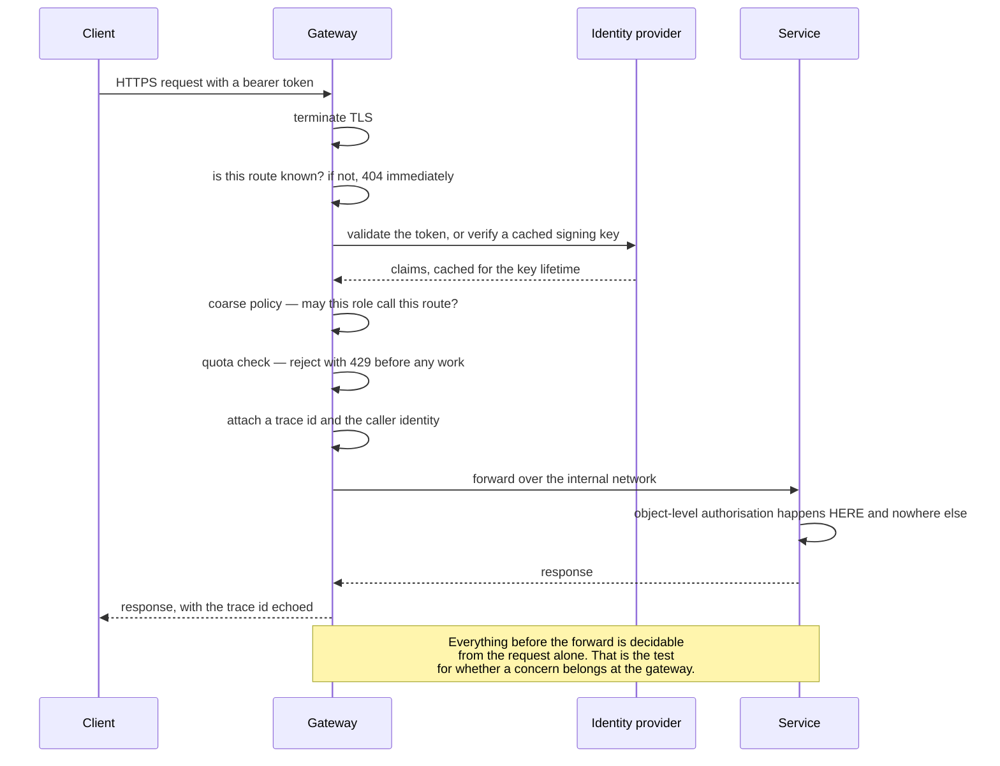

# API Gateway

`[INTERMEDIATE]` · One door for auth, routing, quotas and TLS. It fails by succeeding — every team's special case is small, reasonable, and lands in the gateway, until releasing anything means releasing everything.

---

## 1. One-line definition

A single entry point in front of many services that terminates TLS, authenticates the caller, applies
quotas and coarse policy, and routes each request to the service that owns it.

## 2. Explain like I'm new

A large office building has one reception desk. You show ID once, you are told which lift to take, and
the desk turns away anyone without an appointment. The alternative is a separate door and a separate
security guard for every department, each with their own idea of what a valid ID looks like — and one
of them will get it wrong.

The desk is obviously a good idea. **The failure is also obvious once stated: everybody must go
through it.** If the receptionist is off sick, the building is shut. And every time a department asks
for one small extra check — "would you mind confirming our visitors have a purchase order?" — the desk
gets slower, more specialised, and harder to replace, one entirely reasonable request at a time.

## 3. Real-world analogy

Airport security. One checkpoint, one set of rules, applied consistently to everyone before they reach
any gate.

**Where it breaks:** the checkpoint knows nothing about your destination, and that ignorance is the
source of its power — it scales because the rules are the same for everybody. The moment it starts
enforcing per-airline baggage policy, it needs to know which airline you are flying, it must be updated
whenever any airline changes anything, and a mistake in one airline's rule now stops the entire
terminal. **That is not a hypothetical failure mode; it is the observed lifecycle of most gateways**,
and every step of it is taken for a good local reason.

## 4. Technical explanation

A gateway is a policy enforcement point on the request path. Its whole value is that some decisions
are **identical for every service**, so making them once is cheaper and safer than making them N times.

| Concern | Belongs at the gateway | Why |
|---|---|---|
| TLS termination | **Yes** | Certificate management in one place, not N |
| Authentication — is this a valid caller? | **Yes** | One implementation, one place to rotate keys |
| Coarse authorisation — may this role call this route? | **Yes** | Depends on the request alone |
| **Object-level authorisation** | **No** | The gateway cannot know what invoice 8842 is — see [API security](../../12-security/api-security/) |
| Rate limits and quotas | **Yes** | Rejects before you pay for the work |
| Routing and service discovery | **Yes** | Clients stop encoding your topology |
| Request and response logging, trace propagation | **Yes** | One consistent view of every request |
| Protocol translation — REST in, gRPC out | Sometimes | Useful, and the first step toward the failure below |
| Response aggregation — fan out and merge | **No** | This is a service. Give it a name and a deployment |
| Field mapping, defaulting, validation of business rules | **No** | Business logic. It belongs to whoever owns the domain |

The line between the yes-rows and the no-rows is one property: **a yes-row decision depends only on the
request; a no-row decision depends on the domain.** That test is the whole discipline, and it is worth
holding onto because every individual request to cross the line will sound reasonable.

### It is not a load balancer

These are conflated constantly, including in vendor material, because both sit in front of things and
both "distribute traffic".

| | **[Load balancer](../../03-load-balancing/fundamentals/)** | **API gateway** |
|---|---|---|
| Question it answers | *Which instance* of this service? | *Which service*, and *may you*? |
| Sees | Connections, or HTTP at L7 | Requests, identities, routes, quotas |
| Knows about | A pool of interchangeable backends | Your API surface, per-route policy, callers |
| Instances are | Interchangeable — that is the premise | Not applicable — services are distinct |
| Config changes when | Instances scale up or down | **Your API changes** |
| Typical failure | An instance is ejected; capacity drops | A route is misconfigured; that API is gone |



Read the two questions as operating on different axes. **The gateway chooses between things that
differ; the load balancer chooses between things that are identical.** They compose rather than
compete, and the last row of the table is the practical consequence: a load balancer's configuration
churns with your infrastructure, a gateway's churns with your product — which is exactly why the
gateway becomes a deployment bottleneck and the load balancer does not.

## 5. Engineering at scale

### The erosion — how a thin gateway becomes a monolith

Nobody decides to put business logic in the gateway. It arrives in increments, each defensible.



The two backward arrows are the only escape, and both are extractions rather than rewrites: give the
aggregation a name and a deployment, and move client-specific shaping into a BFF. **The gradient runs
one way** — there is always a reason to add the next thing and never a scheduled moment to take one
out — so the countermeasure has to be a rule, not vigilance. The usable version of that rule is the
test from [§4](#4-technical-explanation): if the change depends on the domain rather than on the
request, it is not a gateway change.

### What the erosion actually costs

| Symptom | Underlying cause |
|---|---|
| Every team's release is blocked by every other team's | One artefact, one release train |
| Gateway changes need reviewers from four teams | It now encodes four domains |
| A billing bug takes down search | Shared process, shared memory, shared blast radius |
| Nobody can say what the gateway does | The logic has no owner, only contributors |
| Gateway CPU is dominated by JSON transformation | It is doing work, not routing |
| Staging cannot be tested without every service | It has dependencies, not routes |

**A gateway you are afraid to deploy has already failed**, whatever its latency numbers say. That is
the operational tell, and it appears long before any performance symptom.

### BFF — when clients genuinely differ

The honest case for putting client-specific logic somewhere is that clients really do differ. A watch
app, a mobile app and a desktop web app want different fields, different granularity and different
call counts over different networks. Serving all three from one shape produces either an over-fetching
mobile client or an under-serving web client.

The answer is not to put all three shapes in the gateway. It is a **backend for frontend**: one small
service per client type, owned by the team that owns that client, deployed on their schedule.



Each BFF absorbs the client-specific coupling that would otherwise land in the gateway, and it is
deployed by the team that feels the pain of getting it wrong. The amber box is the caution: the
partner path deliberately has **no** BFF, because a third-party contract must be stable and general —
give a partner a shaped, convenient endpoint and you have promised to keep that shape forever.

The cost is real and should be stated: a BFF per client is more services, more deployments and
duplicated logic across them. **Adopt it when clients genuinely differ, not when you have two clients
that differ slightly** — the second case is solved by field selection or a `fields` query parameter.

## 6. The problem it solves

Cross-cutting concerns implemented N times, inconsistently — and clients that have to know your
internal topology in order to make a call.

## 7. The problem it does NOT solve

**It cannot do object-level authorisation.** The gateway can confirm you are a valid user permitted to
call `GET /invoices/{id}`; only the service holding the data knows whether invoice 8842 is yours. Its
presence makes teams believe otherwise, which is why
[broken object-level authorisation](../../12-security/api-security/) remains the most common real API
vulnerability. A gateway in front of services that trust their input has moved the perimeter, not
secured the interior.

It does not make a slow service fast, and it adds a hop — and therefore a
[round trip](../../00-foundations/latency/) — to every request. It does not fix a bad API —
routing an inconsistent surface through one host produces an inconsistent surface with one hostname.
It does not remove the need for [load balancing](../../03-load-balancing/fundamentals/) behind it. And
it does not reduce coupling by itself: it **relocates** coupling, and if you relocate the wrong kind
you have built a distributed monolith with a shared front door.

---

## 9. How it works

Each request passes an ordered chain, and the order is not decorative — it exists so that the cheapest
rejections happen first.



Read the chain as increasing cost per step: an unknown route is rejected for the price of a map
lookup, a quota breach for the price of a counter increment, and only a request that has passed
everything cheap is allowed to consume a backend connection. **The single most important line is the
one inside the service** — the gateway has by then established *who* is calling, and has no way to
know *what* they are reaching for.

Deployment is usually a small stateless fleet behind a load balancer, which is what keeps it from
being a literal single point of failure. That mitigation covers the process crashing. It does not
cover the two failures that actually happen: a bad configuration push, and a release train nobody can
get onto.

## 13. When to use it

- More than a handful of services with a shared external surface
- Cross-cutting concerns you refuse to implement N times — TLS, authentication, quotas, tracing
- Clients should not know your internal topology, or you want the freedom to change it
- You need one consistent place to shed load and rate-limit before paying for work
- A public API where the contract must outlive your internal refactors

## 14. When NOT to

- **A monolith, or two or three services.** The gateway is more operational surface than it removes;
  a load balancer and a middleware chain do the same job
- Purely internal service-to-service traffic — that is a service mesh's problem, and it belongs beside
  each service rather than in front of all of them
- **When the real requirement is per-client response shaping.** That is a BFF, and putting it in the
  gateway is the first step of [the erosion](#5-engineering-at-scale)
- When no team will own it. An unowned gateway accretes logic by default
- When it would be the only thing between the internet and services that trust their input

## 17. Trade-offs

| Choose | Get | Pay |
|---|---|---|
| API gateway | One place for auth, TLS, quotas, routing | One hop, one dependency, one blast radius |
| Centralised auth | Consistency, one key rotation | Services stop validating and start trusting their input |
| Routing at the edge | Clients decoupled from topology | Gateway config now changes whenever your API does |
| Aggregation in the gateway | Fewer client round trips | Domain knowledge in shared infrastructure — **the erosion** |
| BFF per client | Client teams move independently | More services, more deploys, duplicated logic |
| Managed gateway | No fleet to operate | Vendor limits, opaque behaviour, and their outage is yours |
| Self-hosted gateway | Full control, no vendor ceiling | You now operate the most critical fleet you own |
| No gateway | Nothing central to fail or to bottleneck | Cross-cutting concerns re-implemented per service, inconsistently |

## 18. Why not?

| Alternative | Why not here | When it WOULD win |
|---|---|---|
| **[Load balancer](../../03-load-balancing/fundamentals/) plus per-service middleware** | Every service re-implements auth and quotas, and one gets it wrong | **Few services, one team.** The most under-used option on this table |
| **Service mesh** | Sidecars solve service-to-service concerns, not a public edge — no quotas per API key, no public contract | Internal mTLS, retries and traffic shifting between services you own |
| **BFF only, no gateway** | Cross-cutting concerns duplicated per BFF, and no single place to shed load | Few client types, each with a strong owning team |
| **Managed gateway from your cloud provider** | Vendor limits and opaque behaviour; hard to reproduce locally | Almost always right for a small team — **operating a gateway fleet is the real cost** |
| **Direct client-to-service calls** | The topology becomes the client's problem and freezes | Internal tools, or one trusted first-party client |

The first row deserves the weight. A load balancer plus a shared middleware library gives you most of
a gateway's value with none of its release coupling, and it stays the right answer for far longer than
architecture diagrams suggest. Adopt a gateway when the *number of services* makes duplication
genuinely unsafe — not when the number of services makes the diagram look untidy.

## 19. Failure scenarios

| Failure | What happens | Mitigation |
|---|---|---|
| **Gateway down** | Everything is down. Services are healthy and unreachable | Multiple instances across zones behind a load balancer, and health checks that fail the instance rather than the fleet |
| **Bad config push** | A routing or policy change takes out APIs that were not being changed | Config as code, staged rollout, automatic rollback, and a smoke test per route |
| **Deployment bottleneck** | Every team ships through one artefact and one release train | Keep the domain logic out. The rule from [§4](#4-technical-explanation) is the only durable defence |
| Auth provider unreachable | Every request fails authentication, including valid ones | Cache signing keys, verify locally, and decide fail-open versus fail-closed **in advance** |
| Gateway becomes the bottleneck | CPU spent on JSON transformation rather than routing | Move transformation out; measure gateway CPU by activity |
| Timeout misalignment | Gateway gives up at 5 s while the service works on for 60 s | Budget timeouts so each layer is shorter than the one in front of it |
| **Retries at the gateway** | A slow backend receives 3× the load exactly when it is struggling | Retry only idempotent methods, with a budget and a circuit breaker |
| Services trust the gateway | Internal callers are compromised, or a route bypasses it | Every service validates its own input and authorises the object |
| Rate limiter is per-instance | The effective limit is N times what you configured | Shared counters, or divide the limit by the instance count and accept the drift |

**The second and third rows are the real failure of this pattern**, and neither is an outage of the
kind runbooks cover. A gateway is usually deployed redundantly, so the process crashing is handled.
What is not handled is that a single configuration surface and a single release train make one team's
mistake everyone's incident, and that this is a property of the *organisation* the gateway created,
not of the software.

---

## 25. Without it → With it → New problem → Next

```
Without it   →  every service implements TLS, auth and quotas separately, one gets
                it wrong, and clients hard-code your internal topology
With it      →  one enforcement point, one consistent contract, and services free
                to move behind it
New problem  →  everything depends on one component, and every team's reasonable
                request adds domain logic to it until releases serialise
Next         →  a rule about what may live there, BFFs for genuine per-client
                differences, and object-level authorisation pushed back into the
                services where it is the only place it can work
```

The pattern's failure is organisational before it is technical. See
[the chain](../../SYSTEM-DESIGN-THINKING.md#part-1--the-chain).

## 28. Common mistakes

| Mistake | Why it is wrong |
|---|---|
| Business logic in the gateway | Domain knowledge in shared infrastructure; releases serialise across teams |
| Assuming it did authorisation | It cannot see objects. This is the most common real API vulnerability |
| Confusing it with a load balancer | One picks between different things, the other between identical ones |
| Aggregating responses in it | That is a service. Give it a name, an owner and a deployment |
| Per-client shaping in it | That is a BFF, and it is the first increment of the erosion |
| One shared instance for internal and public traffic | Two threat models and two availability requirements in one process |
| Services trusting the gateway's word | A bypassed route or a compromised caller reaches unguarded code |
| Unbudgeted retries | Multiplies load on a backend that is already failing |
| Gateway timeout longer than the client's | The client has given up; you are still paying for the work |
| No owning team | Logic accretes by default, and nobody can say what it does |

## 29. Monitoring

**Split every metric by route**, because an aggregate hides the one endpoint that is failing, and the
gateway is the only place where a per-route view of the whole system exists.

Track request rate, error rate and latency per route, with the **gateway's own added latency isolated
from the backend's** — otherwise you cannot tell a slow gateway from a slow service, and that is the
first question in every incident. Then: 401 and 403 rates by caller, since a 403 spike from one
principal is enumeration in progress and nobody alerts on it; 429 rate, which tells you whether quotas
are protecting you or blocking legitimate traffic; auth-provider latency and cache hit rate for signing
keys; config version deployed per instance, so a partial rollout is visible; and connection pool
saturation toward each backend. See [observability](../../11-observability/).

A useful non-metric: **track how many teams must approve a gateway change.** It is the leading
indicator of the failure this page is about, and it rises silently.

## 31. Exercises

**1.** A team has three services and one client. They propose an API gateway "because that is the
microservices pattern". Do you approve it?

<details><summary>Answer</summary>

No. At three services, a [load balancer](../../03-load-balancing/fundamentals/) plus a shared
middleware library gives you TLS termination, authentication, quotas and tracing with none of the
release coupling, and it stays the right answer for far longer than architecture diagrams suggest.

A gateway earns its place when the *number of services* makes duplicating cross-cutting concerns
genuinely unsafe — when one of them will get authentication wrong. Three services with one client is
not that. Approving it here buys a component every request depends on, a config surface that can take
out APIs nobody was changing, and a release train, in exchange for deduplicating code that is already
in one library.
</details>

**2.** The mobile team asks for an endpoint that merges four service calls into one response, because
mobile round trips are expensive. Where does it go?

<details><summary>Answer</summary>

Not in the gateway. The requirement is real — four round trips on a mobile network is a genuine
latency problem — but the merge depends on the *domain*, not on the request, which is the test from
[§4](#4-technical-explanation). Put it in the gateway and the gateway now knows what an order is.

Put it in a **mobile BFF**: a small service owned by the mobile team, deployed on their schedule,
which fans out and merges. They get to change it without a cross-team release, and the coupling lives
with the people who feel it. Note this is precisely step three of
[the erosion](#5-engineering-at-scale), which is why it is worth catching — the request is reasonable,
which is exactly what makes it dangerous.
</details>

**3.** The gateway authenticates every request and attaches the caller's identity. A service therefore
skips its own checks. What is wrong with that?

<details><summary>Answer</summary>

Two, and they are different. The gateway established **who** is calling; it never established what
they may touch. Only the service holding the data knows whether invoice 8842 belongs to caller 7, so
the service skipping "its own checks" has skipped the only check that can answer the question — this
is [broken object-level authorisation](../../12-security/api-security/), the most common real API
vulnerability.

The second is trust. A service that assumes every caller arrived through the gateway is one internal
compromise, one misrouted internal call, or one bypassed route away from executing unguarded. The
gateway moved the perimeter; it did not secure the interior. Both fixes are the same sentence: **every
service authorises the object itself, on every request, regardless of what is in front of it.**
</details>

**4.** During an incident, latency at the gateway is 3 seconds. Backend dashboards show 200 ms. Name
three explanations and say which metric distinguishes them.

<details><summary>Answer</summary>

Queuing at the gateway — connection pools to the backend are saturated, so time is spent waiting to
be forwarded rather than being served. Work in the gateway — JSON transformation, response
aggregation, or synchronous token validation against an unreachable identity provider. Or retries: the
gateway is silently making three attempts, so the client sees 3 × 200 ms plus backoff while each
individual backend call looks perfect.

The metric that distinguishes them is **gateway-added latency, isolated from backend latency**, broken
down by activity — and the retry case is separated by comparing the gateway's outbound request count
with the client's inbound count. If you cannot make that split, you cannot tell a slow gateway from a
slow service, which is the first question in every incident and the reason it is the first line of
[§29](#29-monitoring).
</details>

**5.** Two years in, deploying the gateway requires sign-off from four teams and takes a week. Nothing
is broken. Is anything wrong?

<details><summary>Answer</summary>

Yes, and it is the failure this pattern actually has. Four approvers means the gateway encodes four
domains, which means every team's release is serialised behind every other team's, and a billing
mistake can now take down search. **A gateway you are afraid to deploy has already failed**, whatever
its latency numbers say — and it is operating fine, which is exactly why nobody has raised it.

Nothing here was a bad decision. It arrived through five reasonable increments, each approved on its
own merits. The way out is extraction rather than rewrite: give each aggregation a name and a
deployment, move per-client shaping into BFFs, and adopt the rule from
[§4](#4-technical-explanation) — if the change depends on the domain rather than the request, it is
not a gateway change. Then track the number of approvers as a metric, because it rises silently.
</details>

## 33. Related

- [Pattern catalogue](../CATALOGUE.md) — where this sits among the other structural patterns
- [Load balancer](../../03-load-balancing/fundamentals/) — the component this is most often confused with
- [API security](../../12-security/api-security/) — why the gateway cannot authorise the object
- [Cache](../../04-caching/fundamentals/) — what a gateway can and cannot cache in front of
- [CDN](../../10-storage/cdn/) — the layer above, which rejects even more cheaply
- [Database](../../05-databases/fundamentals/) — the state the services behind the gateway actually own
- [Storage selection](../../10-storage/storage-selection/) — the decision each of those services made
- [CDN + load balancer](../../14-component-combinations/cdn-and-load-balancer/) — the pairing in front of this one
- [Observability](../../11-observability/) — the per-route view only the gateway can give you
- [Comparisons](../../comparisons/) · [Glossary: rate limiting](../../GLOSSARY.md#rate-limiting)
