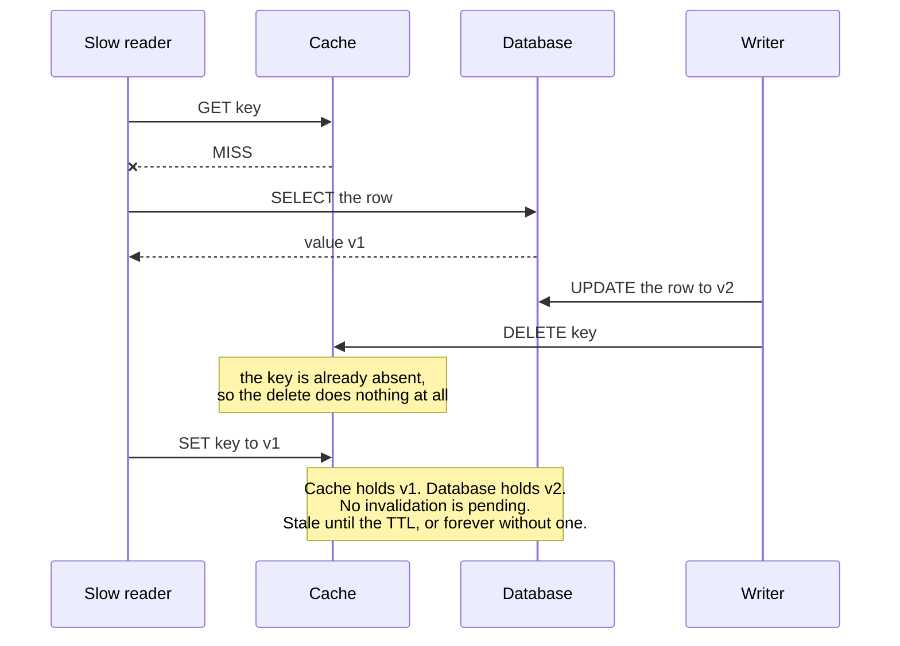
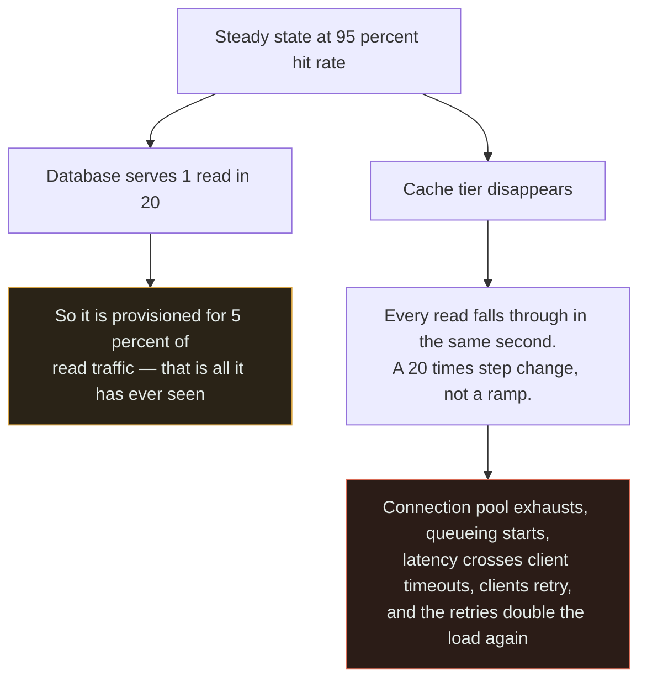
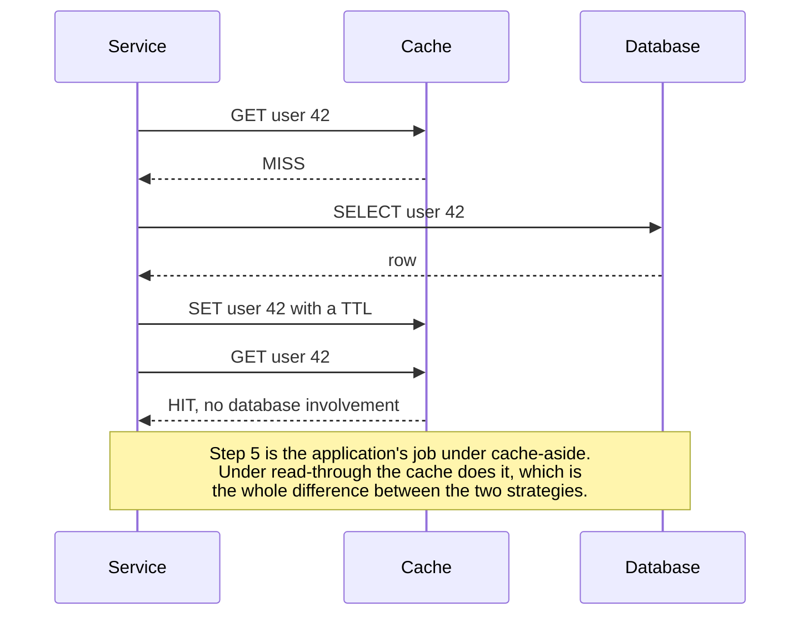

# Cache + Database

`[INTERMEDIATE]` · The moment a second copy of a row exists, the system has two answers to every read — and the newer one lives in the component that is allowed to lose everything at any moment.

---

## 1. Why combine them

The [database](../../05-databases/fundamentals/) is the truth and it is slow. The
[cache](../../04-caching/fundamentals/) is fast and it is not the truth. Put them together and reads
mostly stop touching disk, mostly stop touching the network, and mostly stop touching the primary at
all.

**"Mostly" is doing all the work in that sentence**, and everything below is a consequence of the
remaining fraction. This is the most-deployed pair in this matrix and the one most likely to be in
your system already, added by someone who has left.

## 2. What happens WITHOUT the combination

Every read pays the full query cost, every time, whether or not the answer changed since the last
identical read. Origin load is a straight function of traffic: double the users, double the queries,
and the primary saturates on repetition rather than on new information.

There is a second, quieter cost. **Without a cache, read scaling and write scaling are the same
problem**, so the only lever is a bigger primary — and the primary is the component you cannot scale
horizontally without either [replication](../database-and-replica/) or
[sharding](../database-and-shard/), each of which is a much larger commitment than a cache.

What you get in exchange for that is not nothing: exactly one copy of every row, so a read is either
correct or it failed. No page in this section will offer you that again.

## 3. What the combination solves

At a 95% hit rate the primary sees one read in twenty. That is not a 20% improvement, it is a change
of category: the same hardware now serves twenty times the read traffic, and the p50 collapses from a
query to a memory lookup.

The non-linearity is the part worth internalising. Going from 90% to 99% removes **90% of the
remaining** origin load, so each additional nine is worth roughly as much as everything before it —
which is why hit rate, not average latency, is the number to optimise.

One thing this pair does *not* solve is invalidation, and it is worth stating up front which of the
two available answers you are choosing. Invalidating from application code produces a correct cache on
the happy path but depends on human memory across every current and future write path, including the
migration script somebody runs once. Invalidating from the database's change log derives the same
signal from something no code path can bypass. **That single difference is most of what separates a
cache that ages well from one that does not.**

## 4. What NEW problem the combination creates

Two truths now exist, and they diverge in two structurally different ways.

**The first is bounded and priced: staleness up to the TTL.** That is the deal you signed. It is
fine, as long as somebody actually stated the window and the product owner actually agreed to it.

**The second is unbounded and nobody signed anything: the stale set.** A read misses, fetches `v1`,
and stalls — a GC pause, a slow serialiser, a retried network call. Meanwhile a write commits `v2`
and deletes the cache key, which does nothing because the key is already absent. The stalled reader
then wakes up and writes `v1` into the cache. The cache now holds a value the database has never
agreed with, with **no pending invalidation to correct it**. It is stale until the TTL expires, or
forever if there is no TTL.

Read the ordering, not the arrow count. Every individual operation is correct and every component
behaved as documented — the bug is entirely in the interleaving, which is why it survives code review,
passes tests, and reproduces roughly never in staging. Facebook's **leases** exist for exactly this
window: the cache hands the missing reader a token on the miss and refuses a `SET` whose token was
invalidated by an intervening write.

The third consequence is not a bug at all, which is why it is worse:

**The cache stopped being an optimisation the moment the database could no longer serve the traffic
without it** — and it is almost always still labelled "safe to lose" on the diagram at that point.
The amber box is the mechanism: success at caching is what removes the headroom that would have
absorbed the failure.

## 5. Request flow

The interesting line is the last one. Whoever performs step 5 also owns invalidation, and invalidation
is where the bugs are — so "cache-aside or read-through?" is never really a question about read paths.

## 6. Data flow

Writes have three shapes and they differ on one point only: **where the acknowledgement sits relative
to the database commit.**

| Strategy | Cache is updated | Ack happens | Can lose acknowledged data |
|---|---|---|---|
| Cache-aside | invalidated after the commit | after the commit | No |
| Write-through | written with the commit | after the commit | No |
| Write-around | not at all; fills on next read | after the commit | No |
| Write-behind | written first, flushed later | **before** the commit | **Yes** |

Write-behind is not a performance setting with a caveat, it is a durability decision wearing one. The
only copy of an acknowledged write lives, for the length of the flush window, in a component whose
defining property is that it may lose everything without notice. Choose it for counters and telemetry;
never for anything a user was told was saved. When you do choose it, you have built
[cache + queue + database](../cache-and-queue/), with that pair's failure modes attached.

## 7. Trade-offs

| Choose | Get | Pay |
|---|---|---|
| Add a cache | 10–100× lower p50; large drop in origin load | Bounded staleness, plus the unbounded kind from stale sets |
| Longer TTL | Higher hit rate, less origin load | A longer window in which users see the wrong number |
| Shorter TTL | Fresher data | Lower hit rate, more origin load, more thundering herds per hour |
| Cache-aside | Simple, works with any store, no cache-side integration | Invalidation lives in application code — where invalidation bugs live |
| Read-through / CDC invalidation | Nothing can forget to invalidate | A component that must understand your schema or your change log |
| Write-through | No stale read immediately after a write | Every write pays both stores; writes get slower to make reads correct |
| Write-behind | The fastest writes available | **Acknowledged data can be lost** |

## 8. Failure modes

| What fails | Effect | Survivable? | Mitigation |
|---|---|---|---|
| Cache tier down | `1 / (1 - hit rate)` step change on the primary, instantly | **Often not** at 95%+ | Decide fail-open or fail-closed in advance; breaker to the origin; keep headroom |
| Hot key expires | Thousands of identical queries hit the primary in one millisecond | Usually | Single-flight coalescing; probabilistic early expiry |
| Stale set race | Cache holds a value the database never had, with no invalidation pending | Yes, but silently wrong until the TTL | Leases or CAS on fill; version-stamped values; short TTL as a backstop |
| A write path forgets to invalidate | Permanent staleness on that entity, discovered by a user | Yes | Derive invalidation from the change log rather than from code paths |
| Batch job scans the table | LRU evicts the entire working set; the morning arrives to a cold cache | Yes | Separate cache, scan-resistant eviction, or do not route batch reads through it |
| Cache serialisation changes shape | Old and new format coexist; deserialisation errors on hit | Yes | Version the key namespace, never the value format alone |
| Primary fails over | Cache still serves the old primary's data through the switch | Yes — and it can mask the incident | Treat a failover as an invalidation event |

The last row is a genuine oddity worth pausing on: **the cache can hide a database outage well enough
that nobody notices until the hit rate decays**, at which point traffic arrives at a primary that has
been down for ten minutes.

## 9. When this is appropriate

- Reads outnumber writes by a wide margin — check the ratio, it is one division
- Access is **skewed**, so a small key set absorbs most of the traffic. A cache over a uniform access
  pattern is a new failure mode with no benefit
- A staleness window can be stated in seconds and someone who owns the product has agreed to it
- The origin query is genuinely expensive: 10 ms or more, a remote call, or a computation
- You have measured. Caching before profiling is how a missing index survives for two more years

## 10. When this is over-engineering

A read-heavy endpoint at 50 requests per second doing an indexed primary-key lookup on a table that
fits inside the database's own buffer pool. **Postgres is already caching that page in
`shared_buffers`, and the operating system is caching it again underneath.** A 2 ms query is not a
latency problem. Putting Redis in front of it wins perhaps 1.5 ms and costs you a staleness window, an
invalidation branch in every writer, a network hop, and a component whose loss now takes the read path
down.

A usable rule: **if the query is under about 5 ms and the primary is under about 30% CPU, the cache is
buying something you cannot measure and selling you a correctness problem you will debug at 3 a.m.**

Three more cases where the answer is no:

- **The query is slow because it is wrong.** A four-second sequential scan wants an index, which is
  free, reversible and usually a 10–100× win. A cache hides it instead, and every miss still pays four
  seconds, so p99 does not move at all.
- **Access is uniform over a large keyspace.** A cache sized at 20% of a uniformly-accessed dataset
  gives a 20% hit rate. The same cache over a Zipf workload gives 95%. Size from the working set, not
  from a fraction of the data.
- **The data must never be stale.** Balances, permissions, inventory counts at the point of sale. A
  cache is a deliberate weakening of [consistency](../../00-foundations/consistency/); if that
  weakening is unacceptable, no TTL value makes it acceptable.

## 11. Real-world example

**Facebook**, and effectively every read-heavy consumer product — documented in *Scaling Memcache at
Facebook* (NSDI '13), the source cited in [the matrix](../MATRIX.md).

What makes the paper the canonical reference for this pair is that it is organised around the two
problems in §4 rather than around performance. **Leases** solve both at once: on a miss the cache
issues a token to exactly one requester, which collapses a thundering herd into a single fill, and
refuses a later `SET` whose token has been invalidated by an intervening write, which closes the
stale-set race. The paper also documents invalidation driven from the database's commit log rather
than from application code, precisely because application code forgets — the green arrow in §3.

## 12. Exercises

**1.** A report endpoint takes four seconds. The query sequentially scans a 200-million-row table. An
engineer proposes caching the result for an hour. Do you approve it?

Answer

Not yet, and the reason is structural rather than stylistic. A cache would hide the missing index
rather than remove it, and hidden problems survive for years. Every miss still pays four seconds, so
p99 does not improve — and the first user after each expiry waits for a full scan, which is a worse
experience than a consistently slow endpoint because it is unpredictable.

Add the index first: free, reversible, routinely 10–100×. Then measure again and cache if it is still
worth caching. **If your options table has no row for "do nothing", you have not finished thinking.**

**2.** Two engineers argue about whether to delete the cache key before or after the database write.
One says before, one says after. Who is right, and what does the argument reveal?

Answer

"After" is less bad — deleting before the commit opens a window in which a concurrent reader refills
the key with the pre-write value, which is the stale set from §4 arriving on schedule rather than by
bad luck. So: commit, then invalidate.

But the argument reveals the real problem, which is that **neither ordering is correct**. Deleting
after still loses the race in §4 whenever a reader stalls between its `SELECT` and its `SET`. No
ordering of two operations against two systems can close that window, because the interleaving is not
under your control. Closing it needs a mechanism: a lease or compare-and-set on the fill so a stale
value cannot overwrite a newer one, invalidation derived from the change log, or a TTL short enough
that you accept the exposure. Ordering is a mitigation debate disguised as a correctness one.

**3.** Hit rate has drifted from 94% to 81% over six weeks. Latency graphs look normal and no alert
fired. What should you be worried about?

Answer

Two things, one immediate and one structural.

Immediately: origin load has more than tripled — 6% of reads reaching the primary became 19%, which is
a 3.2× increase with no traffic change. Latency looks normal because the primary still has headroom;
it is being consumed silently.

Structurally: **hit rate falls for a reason**, and the reason is usually that the access pattern is
changing — the working set outgrew the cache, a new feature added low-skew keys, the key space
fragmented after a schema change, or eviction pressure rose. A drifting hit rate is the earliest
available warning that a sizing assumption expired, and it is only visible if hit rate is monitored as
a first-class SLI with an alert on decline rather than on a threshold.

## 13. Related

- [Cache](../../04-caching/fundamentals/) — strategies, eviction, and the single-component view
- [Database](../../05-databases/fundamentals/) — the truth this page keeps deferring to
- [Load balancer + cache](../load-balancer-and-cache/) — where the cache sits, and why it decides everything
- [Cache + queue](../cache-and-queue/) — ⚠ what happens when misses become queued work
- [Database + read replica](../database-and-replica/) — the other way to scale reads, with a different staleness bound
- [Consistency](../../00-foundations/consistency/) — a cache is a deliberate weakening; the TTL is the bound
- [Combination matrix](../MATRIX.md) · [Section index](../README.md) · [Glossary: cache invalidation](../../GLOSSARY.md#cache-invalidation)
