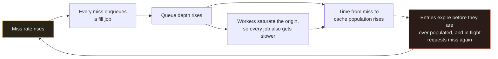
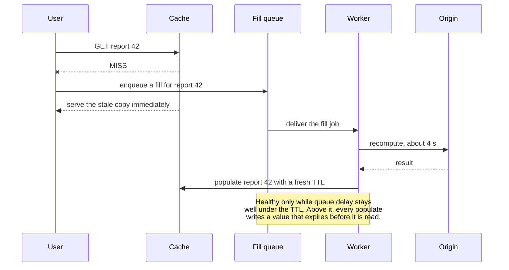
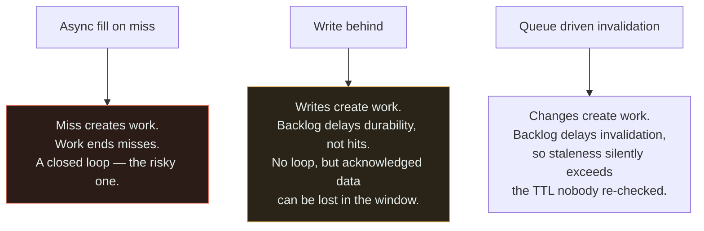

# Cache + Queue

`[ADVANCED]` · ⚠ The dangerous one. Misses create queued work and queued work is what ends misses — so the two failure modes feed each other, and past a threshold the system runs at full capacity with a hit rate of zero.

---

## 1. Why combine them

Three legitimate arrangements put a [queue](../../06-messaging/queues/) next to a
[cache](../../04-caching/fundamentals/), and all three are reasonable in isolation:

- **Asynchronous fill.** A miss is expensive to compute, so rather than making a user wait, enqueue a
  recompute job and serve something else in the meantime.
- **Write-behind.** Writes land in the cache, and a queue carries them to the durable store later.
- **Queue-driven invalidation.** Change events travel through a queue and invalidate cache entries as
  they arrive.

Each one makes the cache's state depend on how long the queue takes. That single shared property is
what this page is about, and it is the reason the matrix marks this pair with a warning rather than
listing it as a technique.

## 2. What happens WITHOUT the combination

Misses are filled **synchronously**. One request pays the full computation, and — if you have
single-flight coalescing — the other four thousand concurrent requests for that key wait on that one
fetch rather than starting their own.

That has an important structural property: **the work in flight is bounded by the requests in
flight.** Origin load cannot exceed what your connection pools and thread pools allow, because every
fill is attached to a caller who is waiting for it. Requests time out, users see errors, and the
system stays inside a boundary it cannot leave.

The cost is a genuinely bad p99. Every miss is a user waiting for the full computation, and if that
computation takes four seconds, some users wait four seconds. That pain is what motivates moving fills
onto a queue.

## 3. What the combination solves

Nobody waits for an expensive recompute. A miss returns immediately — stale data, a partial response,
a placeholder or a `202` — and the real work happens elsewhere. The p99 of the read path stops being
the p99 of the computation.

The second benefit is the one worth designing around: **the queue is a rate limiter on cache fills.**
Instead of five thousand concurrent misses producing five thousand concurrent origin queries, a fixed
worker pool meters them at whatever rate the origin can sustain. Used deliberately, that converts an
unbounded thundering herd into a bounded, smooth load — which is the opposite of the failure this page
warns about, and the reason the pattern exists at all.

## 4. What NEW problem the combination creates

**A positive feedback loop between two components that each look healthy.**

Follow the cycle once and the mechanism is obvious; the part that is not obvious is that **there is a
threshold, and crossing it is irreversible without intervention.** Call the queue's delay `Dq` and the
cache TTL `T`:

| Condition | Behaviour |
|---|---|
| `Dq` well below `T` | Fills land with plenty of TTL remaining. Hit rate is high. Stable. |
| `Dq` approaching `T` | Fills land shortly before expiry. Hit rate falls, so more misses enqueue. |
| `Dq` greater than `T` | **Every completed job populates an entry that has already expired or is about to.** Hit rate approaches zero while workers run flat out. |

That third row is the whole warning. The system is doing the maximum amount of work it is capable of
and producing no cache hits at all, because every result is stale before anyone reads it. Throughput
is 100% and usefulness is 0%.

Four mechanisms make the loop's gain worse, and each is individually easy to miss:

- **Duplicate work.** Five thousand concurrent misses on one hot key enqueue five thousand identical
  jobs. The queue is now mostly filled with work whose result already exists, which slows the drain,
  which lengthens `Dq`. **Deduplication by cache key is not an optimisation here — it is what keeps
  the loop gain below one.**
- **Retries.** Failed fill jobs go back on the queue. Fill jobs fail more often when the origin is
  saturated, which is exactly when the backlog is already growing.
- **Cold start.** A cache restart, a deploy, an eviction storm or a namespace change makes the whole
  working set miss at once, so the loop starts at maximum gain rather than ramping into it.
- **Origin coupling.** Workers hammering the origin make every job slower, which lowers the drain rate,
  which raises `Dq` — the second feedback path in the diagram, compounding the first.

**And the loop does not stop when the trigger does.** Restore the origin, fix the slow query, end the
traffic spike — the backlog is still there, `Dq` is still above `T`, and the system continues to
produce misses at full rate. This is the defining property of a cascading failure: the cause becomes
irrelevant, because the system is now sustaining itself. Recovery requires breaking the loop from
outside: shed load, lengthen the TTL, serve stale unconditionally, or discard the queue.

## 5. Request flow

The fourth line is what makes this arrangement work at all: **serving stale is not a fallback here, it
is the design.** Remove it and a miss becomes a user-visible failure while the fill job sits in a
queue, which is strictly worse than having waited synchronously.

## 6. Data flow

The three arrangements from §1 couple cache and queue differently, and they are not equally
dangerous.

Only the first is a feedback loop, because it is the only one where the queue's output changes the
queue's input. The other two are still worth watching: write-behind is the only shape in this section
that can lose acknowledged data, and queue-driven invalidation fails in the quietest way of all —
staleness stops being bounded by the TTL and becomes bounded by the backlog, with nothing in the cache
indicating that anything is wrong.

Three mechanisms keep the loop's gain below one, and a design using async fill needs all three rather
than a choice between them:

| Mechanism | What it does | Why it matters to the loop |
|---|---|---|
| **Deduplicate by cache key** | One in-flight job per key, no matter how many misses | Caps enqueue rate at the number of distinct keys, not the number of requests |
| **Stale-while-revalidate** | Serve the expired value and refresh behind it | A miss stops being a miss, so the loop's input never spikes |
| **Admission control on fills** | Refuse to enqueue when depth or age crosses a bound | Guarantees `Dq` stays under `T` by dropping work instead of accepting all of it |

**The third is the one teams leave out**, because dropping fill requests feels like giving up. It is
the only mechanism that holds when the other two are overwhelmed, and it is the difference between
degrading and collapsing.

## 7. Trade-offs

| Choose | Get | Pay |
|---|---|---|
| Async fill on miss | Nobody waits for an expensive recompute; origin load is metered | A feedback loop that can drive hit rate to zero |
| Synchronous single-flight fill | Bounded, self-limiting; no broker; no loop | One unlucky request per key pays the full cost |
| Stale-while-revalidate | Misses stop being user-visible; the loop loses its input spike | Staleness beyond the TTL, and a stale copy must exist |
| Dedup by cache key | Enqueue rate bounded by distinct keys | A dedup store or broker feature, and a correctness question about coalescing windows |
| Admission control on fills | `Dq` stays under `T` by construction | Some keys are simply not refreshed during overload |
| Longer TTL | Larger margin between `Dq` and `T` | More staleness in normal operation |
| Write-behind through a queue | Fastest writes available | **Acknowledged data can be lost** in the flush window |
| Queue-driven invalidation | Invalidation derived from events, not from code paths | Staleness bounded by backlog rather than by TTL, invisibly |

## 8. Failure modes

| What fails | Effect | Survivable? | Mitigation |
|---|---|---|---|
| Queue delay exceeds the TTL | Hit rate approaches zero at full worker utilisation; the system will not self-recover | **No** — requires intervention | Alert on `oldest fill job age` against the TTL, not on queue depth |
| No dedup on fill jobs | One hot key produces thousands of identical jobs; the drain rate collapses | No | Dedup by cache key; single-flight at the point of enqueue |
| Cold cache after a restart or deploy | The entire working set misses at once; the loop starts at maximum gain | Yes, if bounded | Admission control; staged rollout; pre-warm; keep the old namespace readable |
| Retry storm on fill jobs | Failed fills re-enqueue while the origin is already saturated | Yes | Capped retries, backoff with jitter, a breaker to the origin |
| Workers saturate the origin | Every job gets slower, so the drain rate falls and `Dq` grows | No, unaided | Cap worker concurrency; a circuit breaker — see [circuit breaker + service](../circuit-breaker-and-service/) |
| No stale copy to serve | Misses become user-visible errors while jobs queue | No | Keep expired values for a grace period; never evict-on-expire when async fill is used |
| Write-behind flush backlog | Acknowledged writes exist only in the cache for longer and longer | No | Bound the flush lag; alert on it; never use write-behind for data users were told was saved |
| Invalidation backlog | Staleness exceeds every documented bound, with no signal | Yes | Monitor invalidation lag as an SLI; TTL as a hard backstop |

**Row one has no in-band mitigation, which is why it leads.** Every other row can be tuned; that one
has to be broken from outside, and by the time users notice, the trigger that started it is usually
long gone and the graphs no longer point at it.

## 9. When this is appropriate

- The recompute is genuinely expensive — seconds, not milliseconds — and no user should wait for it
- A stale value exists and serving it is acceptable, so a miss is never a user-visible failure
- The result is shared across many users, so one fill benefits thousands
- Deduplication by cache key is in place, so the enqueue rate is bounded by distinct keys
- The TTL is comfortably longer than p99 queue delay, with the margin monitored rather than assumed
- Admission control exists, so the system drops fills rather than accepting an unbounded backlog

That is a long list, and it is meant to be. **Every item on it is load-bearing**, and the arrangement
is only safe when all of them hold at once.

## 10. When this is over-engineering

**The recompute takes 20 ms.** A synchronous fill with single-flight coalescing is strictly better in
every dimension: one request pays 20 ms, the rest wait a few milliseconds on that one in-flight fetch,
origin load is bounded by concurrency, there is no broker, no worker fleet, no dead-letter queue, and
— decisively — **no feedback loop, because the work cannot outlive the request that asked for it.**

A workable ladder, in order of increasing recompute cost:

| Recompute cost | Right answer |
|---|---|
| Under ~200 ms | Synchronous fill with request coalescing. No queue. |
| ~200 ms to ~2 s | Stale-while-revalidate with an in-process background refresh. Still no external queue. |
| Over ~2 s, shared across many users | Async fill via a queue — with dedup, stale serving and admission control all present |
| Any cost, one user's private result | Do it synchronously, or make it an explicit job with a job id the user polls |

Two more cases where the queue is the wrong instrument. **Queue-driven invalidation when a 30-second
TTL would do**: you have taken a bounded staleness window and replaced it with one bounded by a
backlog you now have to monitor, in exchange for freshness nobody asked for. And **write-behind for
data that is not loss-tolerant**: it is the only pattern here that can lose acknowledged writes, and
"the queue makes it durable" is untrue for the window between the cache acknowledging and the flush
completing.

The general test: **if the fill work can be attached to a waiting request, attach it.** A request
holding a thread is crude, but it is a hard bound on how much work can be in flight, and the queue's
central feature is removing exactly that bound.

## 11. Real-world example

This pair is cited in [the matrix](../MATRIX.md) not as one company's architecture but as a
**common cascading-failure shape**, documented in the Google SRE Book, chapter 22, *Addressing
Cascading Failures*.

The chapter is the right reference because it describes the general form of which this pair is an
instance: a failure that **grows over time as a result of positive feedback**, where an initial
degradation increases load, and the increased load deepens the degradation. Its central observation is
the one in §4 — a system in that state **does not recover on its own once the triggering condition is
removed**, because the feedback path, not the trigger, is now sustaining it. Teams restore the
downstream, watch nothing improve, and conclude the diagnosis was wrong.

The remedies the chapter recommends map directly onto §6. **Load shedding** is admission control on
fills. **Graceful degradation** is serving stale rather than treating a miss as a failure. **Reducing
positive feedback** is deduplication and capped retries. And the chapter's operational advice applies
literally here: test for this before it happens, because the interaction only appears under load, and
the first time you will see it is in production.

## 12. Exercises

**1.** Your fill queue normally sits at 200 messages with a delay of 3 seconds. The cache TTL is 60
seconds. During a spike the delay reaches 90 seconds. Describe what the hit rate does, and why fixing
the origin will not help.

Answer

Hit rate collapses towards zero. Every fill job now completes after the entry it was meant to populate
has already expired, so the value it writes is either immediately stale or is written into a key
nobody will read before it expires again. Requests keep missing, keep enqueueing, and the backlog
keeps growing — the third row of the §4 table.

Fixing the origin does not help because the origin is no longer the constraint. **The backlog has
become the cause.** Even with a perfectly healthy origin, the enqueue rate exceeds the drain rate, so
`Dq` stays above the TTL and the loop sustains itself. This is the Google SRE Book's central point
about cascading failures, and it is why the natural incident response — repair the trigger, wait for
recovery — produces no improvement and a great deal of confusion.

Recovery has to break the loop from outside: shed fill requests, raise the TTL well above the current
queue delay, serve stale unconditionally, or purge the queue and refill deliberately. Only then does
repairing the origin matter.

**2.** Five thousand concurrent requests miss on the same hot key. What lands on the queue, and why is
deduplication a correctness concern rather than an efficiency one?

Answer

Without dedup, five thousand identical fill jobs. Only one is useful — the other 4,999 recompute a
value that is already being computed and will be written by the first job to finish.

The reason this is correctness rather than tidiness is the loop's gain. The enqueue rate should be
bounded by the number of **distinct keys** going stale, which is a property of your data. Without
dedup it is bounded by the number of **requests**, which is a property of your traffic — so a traffic
spike multiplies queue depth directly, `Dq` crosses the TTL, and the system enters the state in
exercise 1. Deduplication is what keeps the loop's gain below one, and a loop with gain above one does
not have a performance problem, it has a stability problem.

Implementations: a `SETNX`-style marker on the cache key at enqueue time so only the first miss
enqueues, a broker-level deduplication window keyed on the cache key, or coalescing in the worker by
checking whether the key was populated since the job was created. The last is the weakest, because the
duplicate work has already occupied the queue.

**3.** An engineer proposes moving cache fills onto a queue to fix a p99 of 800 ms, where the origin
query takes 700 ms. What do you propose instead, and what would change your mind?

Answer

Stale-while-revalidate with in-process single-flight refresh. At 700 ms the work is comfortably
attachable to a background task in the serving process: serve the expired value immediately, kick off
one refresh per key, and the user never waits. That gets the same p99 improvement with no broker, no
worker fleet, no dead-letter queue and — most importantly — **no feedback loop, because the refresh
work is bounded by the number of processes and keys rather than by the number of requests.**

What would change my mind: if the recompute is measured in many seconds rather than hundreds of
milliseconds; if it needs resources the serving tier does not have, such as a large model or a
different runtime; if the same key is filled by many processes so in-process coalescing does not
actually coalesce; or if the fill must survive a deploy that would otherwise abandon it mid-flight.

If any of those hold, use the queue — and then §9's whole list becomes mandatory rather than advisory:
dedup by key, stale serving, admission control, capped retries, worker concurrency limits, and an
alert on fill-job age measured against the TTL rather than on queue depth.

## 13. Related

- [Cache](../../04-caching/fundamentals/) — thundering herd, single-flight, and TTL as a staleness bound
- [Queues](../../06-messaging/queues/) — depth, delay and dead-letter behaviour
- [Queue + worker](../queue-and-workers/) — the drain side, and why the backlog may never clear
- [Cache + database](../cache-and-database/) — the fill's other end, and the write-behind row
- [Circuit breaker + service](../circuit-breaker-and-service/) — interrupting the origin half of the loop
- [Observability](../../11-observability/) — the SLI here is fill-job age against TTL, not queue depth
- [Combination matrix](../MATRIX.md) · [Section index](../README.md) · [Glossary: thundering herd](../../GLOSSARY.md#thundering-herd)
